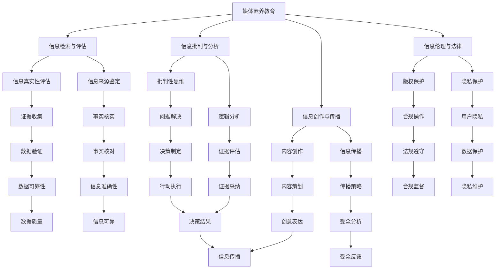
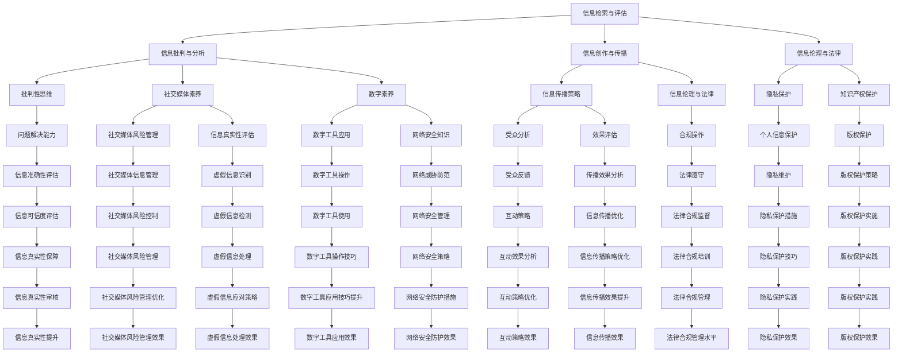
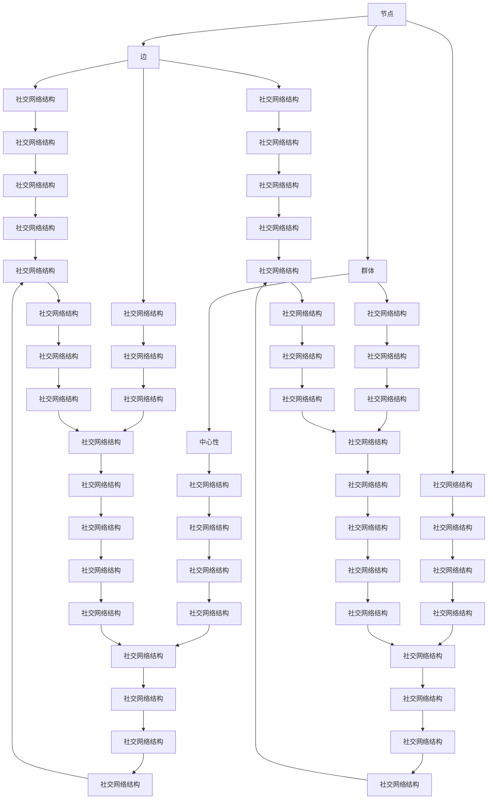

                 

### 引言与背景

在当今数字化时代，信息爆炸成为了一个普遍现象。随着互联网和社交媒体的普及，虚假信息、误导性信息以及谣言的传播速度变得前所未有的迅速，对个人、社会乃至国家产生了深远的影响。为了应对这一挑战，媒体素养教育的重要性日益凸显。媒体素养教育不仅是对个体认知能力的提升，更是对社会整体信息环境的优化。

**什么是媒体素养教育？**  
媒体素养教育是指通过系统的学习和实践，提高公众对媒体信息的理解、批判和分析能力。它涵盖了信息检索、信息评估、信息批判、信息创作与传播、信息伦理与法律等多个方面。媒体素养教育的核心目标在于培养学生的批判性思维，帮助他们能够辨识虚假信息、避免被误导，并在此基础上做出明智的判断和决策。

**虚假信息的种类与传播方式**  
虚假信息的种类繁多，包括假新闻、谣言、误导性广告、网络诈骗等。这些虚假信息的传播方式也多种多样，如社交媒体、即时通讯、新闻网站、搜索引擎等。虚假信息的危害不容小觑，它不仅会误导公众，影响社会稳定，还可能对个人造成经济损失和心理困扰。

**媒体素养教育应对虚假信息的重要性**  
媒体素养教育是应对虚假信息的关键手段。通过提高公众的媒体素养，我们能够从根本上减少虚假信息的传播和影响。具体来说，媒体素养教育的重要性体现在以下几个方面：

1. **提升信息辨识能力**：通过媒体素养教育，公众能够学会如何识别和评估媒体信息的真实性和可靠性，从而避免被虚假信息误导。
   
2. **培养批判性思维**：媒体素养教育鼓励学生和公众运用批判性思维分析媒体信息，从而提高他们分析和解决问题的能力。

3. **增强社会责任感**：媒体素养教育不仅关注个体的信息能力，还强调个体的社会责任感。通过教育，公众能够更加负责任地使用媒体，减少虚假信息的传播。

4. **优化信息环境**：媒体素养教育能够促使公众更加理性地对待媒体信息，从而形成一个更加健康、公正的信息环境。

本文将系统地探讨媒体素养教育的核心主题，包括其概念与重要性、关键概念的阐述、虚假信息的识别与处理方法、核心算法原理讲解、数学模型和数学公式、以及项目实战等内容。通过这些内容的深入探讨，我们希望能够为读者提供一个全面而系统的理解，帮助他们在面对虚假信息时能够做出更为明智的选择。### 文章关键词

- 媒体素养教育
- 虚假信息识别
- 批判性思维
- 信息伦理
- 社交媒体
- 机器学习
- 贝叶斯定理
- 概率论
- 信息检索
- 社会责任

### 摘要

本文旨在探讨媒体素养教育在应对虚假信息传播中的重要性。首先，我们介绍了媒体素养教育的概念及其核心目标，包括信息检索与评估、信息批判与分析、信息创作与传播以及信息伦理与法律等方面。接着，我们分析了虚假信息的种类及其传播方式，强调了虚假信息对个人和社会的危害。随后，文章深入探讨了媒体素养教育对于提升信息辨识能力、培养批判性思维、增强社会责任感以及优化信息环境的积极作用。在核心算法原理讲解部分，我们详细阐述了虚假信息识别和传播分析的方法，并结合Python源代码和数学模型进行了具体解释。最后，通过项目实战，我们展示了如何在实际中应用媒体素养教育和算法模型来应对虚假信息。本文的目标是提供一套系统的策略和方法，帮助公众在面对虚假信息时能够做出更为明智的判断和决策。

### 第1章 媒体素养教育的概念与重要性

#### 1.1 媒体素养教育的定义与历史背景

**定义：** 媒体素养教育是一种培养个体对媒体信息的理解、批判和分析能力的教学方法。它不仅关注个体如何获取和评估媒体信息，还涉及如何创造和传播信息，以及如何在伦理和法律框架内使用媒体。

**历史背景：** 媒体素养教育起源于20世纪90年代，当时信息技术的迅猛发展使公众面临着海量的媒体信息。随着互联网和社交媒体的普及，信息的获取和传播变得更加便捷，但也带来了虚假信息泛滥的问题。为了应对这一挑战，各国教育机构开始重视媒体素养教育，将其纳入课程体系。

媒体素养教育的发展经历了几个重要阶段：

1. **初步阶段（1990s-2000s）**：在这一阶段，媒体素养教育主要侧重于基础技能的培养，如信息检索和评估。教育者开始意识到，仅仅让学生了解媒体信息是不够的，还需要他们具备批判性思维和评估信息真实性的能力。

2. **深化阶段（2000s-2010s）**：随着互联网的进一步普及，虚假信息和误导性信息的问题日益严重。这一阶段的媒体素养教育不仅包括基础技能，还引入了信息伦理和法律知识，以帮助学生更好地应对复杂的信息环境。

3. **整合阶段（2010s-至今）**：现代媒体素养教育更加注重跨学科整合，将媒体素养与数字素养、信息素养等相结合，形成更全面的教育体系。同时，随着人工智能和大数据技术的发展，媒体素养教育开始探索新的方法和工具，如机器学习和数据挖掘，以提高信息辨识能力。

#### 1.2 媒体素养教育的重要性

**提高信息辨识能力：** 媒体素养教育通过培养学生的批判性思维和评估能力，使他们能够准确识别和评估媒体信息的真实性和可靠性。这对于避免被虚假信息误导至关重要。

**培养批判性思维：** 媒体素养教育鼓励学生从多个角度分析媒体信息，培养他们的批判性思维能力。这种能力不仅有助于应对虚假信息，还能在日常生活中做出更明智的决策。

**增强社会责任感：** 媒体素养教育不仅关注个体的信息能力，还强调社会责任感。通过教育，学生能够更加负责任地使用媒体，减少虚假信息的传播。

**优化信息环境：** 媒体素养教育的推广有助于建立一个更加健康、公正的信息环境。公众的媒体素养提高后，他们能够更加理性地对待媒体信息，减少谣言和误导性信息的传播。

**具体应用场景：** 媒体素养教育在多个领域有广泛应用。例如，在新闻学教育中，媒体素养教育帮助学生理解和分析新闻报道，避免被假新闻误导。在教育领域，教师通过教学活动培养学生的媒体素养，帮助他们更好地理解和评价媒体信息。在商业领域，企业通过培训员工的媒体素养，提高他们识别虚假广告和误导性信息的能力。

总之，媒体素养教育不仅是一种应对虚假信息的重要手段，也是现代社会中个体必须具备的基本素养。通过系统的教育和培训，公众能够更好地应对信息时代的挑战，做出更为明智的选择。

### 核心概念与联系：Mermaid流程图



### 1.3 媒体素养教育的内容与目标

**媒体素养教育的内容：**

媒体素养教育的内容丰富多样，旨在培养学生的全面信息素养和批判性思维能力。具体内容包括以下几个方面：

1. **信息检索与评估：** 这部分内容主要教授学生如何有效地在互联网和其他媒体平台上检索信息，以及如何评估信息的真实性和可靠性。学生将学习到信息来源的重要性、证据收集的方法以及如何辨别误导性信息和虚假信息。

2. **信息批判与分析：** 媒体素养教育强调培养学生的批判性思维和分析能力。学生将学习到逻辑分析、证据评估、论证反驳等技巧，以便能够从多角度、多层次分析媒体信息，并做出合理的判断。

3. **信息创作与传播：** 这部分内容关注学生如何创作和传播信息。学生将学习到如何策划内容、撰写文稿、设计媒体产品，以及如何在法律和伦理框架内进行传播。同时，学生也将了解信息传播的影响和责任。

4. **信息伦理与法律：** 媒体素养教育不仅关注技能的培养，还强调法律和伦理教育。学生将学习到版权保护、隐私保护、信息发布法律法规等相关知识，以便能够在合法合规的前提下使用媒体。

**媒体素养教育的目标：**

媒体素养教育的目标在于培养学生在信息时代的生存能力和应对能力。具体目标如下：

1. **提升信息辨识能力：** 通过系统的学习和实践，学生能够准确识别和评估媒体信息的真实性和可靠性，避免被虚假信息误导。

2. **培养批判性思维：** 媒体素养教育鼓励学生从多个角度分析媒体信息，培养他们的批判性思维能力，提高他们在复杂信息环境中的判断力。

3. **增强社会责任感：** 媒体素养教育不仅关注个体的信息能力，还强调社会责任感。学生将学会如何负责任地使用媒体，减少虚假信息的传播。

4. **优化信息环境：** 媒体素养教育的推广有助于建立一个更加健康、公正的信息环境。公众的媒体素养提高后，他们将能够更加理性地对待媒体信息，减少谣言和误导性信息的传播。

总之，媒体素养教育是一种全方位的教育体系，旨在培养学生的信息素养、批判性思维和社会责任感，帮助他们更好地应对信息时代的挑战。通过系统的教育和培训，学生不仅能够提升自身的信息能力，还能够为社会的信息环境建设做出贡献。

### 虚假信息的种类与传播方式

虚假信息的种类繁多，每种类型都有其独特的特点和传播方式。以下是一些常见的虚假信息类型及其传播方式：

**1. 假新闻：** 假新闻是一种最常见的虚假信息类型，它通常以新闻的形式出现，但内容却是完全虚假的。假新闻可能涉及政治、娱乐、健康等领域，其目的是误导公众、操纵舆论或获取经济利益。假新闻的传播方式包括社交媒体、新闻网站、博客等。

**2. 谣言：** 谣言通常是未经证实的消息或传闻，它们通过口口相传、社交媒体、即时通讯等方式迅速传播。谣言的传播速度极快，往往在真相被揭示之前就已经广泛传播，造成严重的误导和恐慌。

**3. 误导性广告：** 误导性广告通过虚假宣传、夸大其词等手段诱导消费者购买产品或服务。这类广告通常在社交媒体、搜索引擎广告、电子邮件广告等渠道广泛传播。

**4. 网络诈骗：** 网络诈骗是一种利用虚假信息和网络平台进行的欺诈行为。常见的网络诈骗包括假冒银行、诈骗购物、投资诈骗等。网络诈骗通常通过电子邮件、社交媒体、钓鱼网站等方式进行。

**5. 社会工程学：** 社会工程学是指利用人类的心理弱点，通过欺骗、诱惑等手段获取个人信息或控制目标系统的技术。社会工程学攻击可能通过电话、邮件、社交媒体等渠道进行，其目的是获取敏感信息或实施其他恶意行为。

**传播方式：**

1. **社交媒体：** 社交媒体是虚假信息传播的主要渠道之一。由于社交媒体的开放性和快速传播性，虚假信息可以在短时间内被广泛传播，甚至影响全球范围内的公众。

2. **即时通讯：** 即时通讯工具如WhatsApp、Telegram等也成为了虚假信息传播的重要渠道。这些工具的私密性和群组功能使得虚假信息可以迅速在特定群体内传播。

3. **新闻网站：** 一些新闻网站为了吸引流量，可能会发布未经核实的新闻或虚假新闻。这些网站可能缺乏严格的编辑和审核流程，导致虚假信息泛滥。

4. **电子邮件：** 电子邮件是一种传统的虚假信息传播方式。通过伪装成官方机构或知名企业的邮件，诈骗者可以诱导用户提供个人信息或点击恶意链接。

5. **博客和论坛：** 博客和论坛也为虚假信息的传播提供了平台。一些虚假信息可能伪装成专家意见或个人经验，误导读者。

**危害与影响：**

1. **误导公众：** 虚假信息会导致公众对事实的误解，影响他们的判断和决策。例如，假新闻可能导致人们对政治事件、健康问题等产生错误的看法。

2. **社会恐慌：** 谣言和虚假信息的传播可能导致社会恐慌，引发公众的不安和恐慌情绪。例如，某些虚假健康信息可能导致公众对特定疾病的恐慌。

3. **经济损失：** 误导性广告和网络诈骗可能导致消费者遭受经济损失。例如，虚假广告可能诱使消费者购买无效或有害的产品。

4. **网络安全威胁：** 社会工程学攻击可能导致个人和企业的敏感信息泄露，从而引发更严重的网络安全问题。

总之，虚假信息的种类繁多，传播方式多样，其危害与影响深远。为了应对这一挑战，需要全社会共同努力，提高公众的媒体素养，加强对虚假信息的识别和防范。

### 媒体素养教育中的关键概念

媒体素养教育涉及到多个关键概念，这些概念共同构成了媒体素养教育的理论基础和实践框架。以下是对这些关键概念的详细解释：

**1. 信息检索与评估：** 信息检索与评估是指学生学会如何在各种媒体平台上查找信息，并评估信息的真实性和可靠性。这是媒体素养教育的基础，因为只有具备良好的信息检索能力，学生才能在庞大的信息海洋中找到有价值的信息。评估信息真实性的能力同样重要，这要求学生能够判断信息的来源是否可靠、内容是否准确。

**2. 信息批判与分析：** 信息批判与分析是指学生学会从多个角度分析媒体信息，评估其逻辑性和证据支持。批判性思维是媒体素养教育的核心，因为它使学生能够在复杂的信息环境中保持独立思考，避免被误导。信息批判与分析包括评估信息的可信度、逻辑性、证据支持等。

**3. 信息创作与传播：** 信息创作与传播是指学生学会如何创作和传播信息。这不仅包括撰写文章、制作视频等创作技能，还包括了解信息传播的渠道和策略。学生需要学会如何通过合法和伦理的方式传播信息，以及如何对传播效果进行评估。

**4. 信息伦理与法律：** 信息伦理与法律是媒体素养教育的重要组成部分。学生需要了解在信息时代如何遵守法律法规，尊重他人的隐私权、知识产权等。此外，他们还需要理解信息伦理，如如何在信息传播中维护公正、诚信和负责任的态度。

**5. 批判性思维：** 批判性思维是指学生能够对信息进行深入思考，质疑和评估其合理性和可信度。批判性思维是媒体素养教育的核心，因为它使学生能够超越表面信息，挖掘信息的深层含义和潜在问题。

**6. 社交媒体素养：** 社交媒体素养是指学生在社交媒体环境中如何有效地使用媒体，避免被虚假信息误导。这包括了解社交媒体的运作原理、如何识别和管理社交媒体上的信息等。

**7. 数字素养：** 数字素养是指学生在数字环境中如何有效地获取、使用和管理信息。这包括计算机操作技能、网络安全知识、数字工具的使用等。

**概念实体之间的关系架构：**

为了更好地理解这些关键概念之间的关系，我们可以使用Mermaid流程图来展示它们之间的联系：



通过这个流程图，我们可以清晰地看到媒体素养教育中的关键概念是如何相互联系和影响的。每个概念不仅独立存在，还与其他概念相互作用，共同构成了一个完整的媒体素养教育体系。

### 虚假信息识别与处理方法

在媒体素养教育中，识别和处理虚假信息是一个至关重要的环节。随着虚假信息在互联网上的泛滥，公众需要具备有效的识别和处理能力，以避免受到误导。以下是一些常见的虚假信息识别与处理方法：

**1. 交叉核对信息来源：** 首先，对信息的来源进行交叉核对是识别虚假信息的重要步骤。通过检查信息发布者的背景、信誉和专业资质，可以初步判断信息的可信度。例如，一个知名媒体的报道通常比一个未经验证的博客更可信。

**2. 分析信息内容：** 在确认信息来源后，对信息内容进行详细分析是识别虚假信息的核心步骤。这包括检查信息的逻辑结构、引用的证据、使用的语言等。虚假信息往往逻辑混乱、证据不足，或者使用误导性语言。

**3. 利用事实核查工具：** 事实核查工具如Snopes、FactCheck.org等，可以帮助公众快速验证信息的真实性。这些工具通常会针对热点新闻和谣言进行深入调查，并提供详细的事实核查报告。

**4. 评估信息的发布时间和更新频率：** 虚假信息往往在事件发生后迅速传播，因此检查信息的发布时间和更新频率是识别虚假信息的一个有效方法。对于重要新闻，应优先参考近期发布的、经过多次更新的内容。

**5. 社交媒体上的意见反馈：** 在社交媒体上，公众可以通过查看其他用户的评论和反馈来识别虚假信息。一些虚假信息可能会在发布后遭到质疑和反驳，而这些质疑和反驳通常能够在社交媒体上得到体现。

**6. 利用搜索引擎进行信息检索：** 通过搜索引擎检索相关信息，可以帮助公众从不同来源获取关于同一事件的多种观点和解释。综合分析这些信息，可以更全面地评估信息真实性。

**7. 使用机器学习和人工智能技术：** 机器学习和人工智能技术被广泛应用于虚假信息的识别和处理。例如，基于自然语言处理（NLP）的技术可以分析信息内容的语义和情感，从而判断其真实性。此外，通过大规模数据训练，这些技术可以不断提高识别虚假信息的准确率。

**策略：**

1. **培养批判性思维：** 通过教育，公众需要培养批判性思维，学会从多角度分析信息，避免被单一视角所左右。

2. **建立事实核查机制：** 各级政府和新闻媒体应建立事实核查机制，及时对虚假信息进行识别和辟谣，减少其传播范围。

3. **加强法律法规：** 对于虚假信息的发布者和传播者，应加强法律法规的制定和执行，提高违法成本，减少虚假信息的产生。

4. **提高公众媒体素养：** 通过媒体素养教育，提高公众对虚假信息的识别和处理能力，从根本上减少虚假信息的传播。

**难点与挑战：**

1. **信息过载：** 随着互联网的普及，公众面临的海量信息使识别和处理虚假信息变得更加困难。

2. **技术挑战：** 虚假信息的识别和处理需要先进的技术支持，而技术本身的发展也存在一定的局限性。

3. **法律法规不完善：** 目前，许多国家和地区的法律法规尚不完善，对虚假信息的打击力度不足。

4. **公众意识不足：** 部分公众对虚假信息的危害性认识不足，缺乏主动识别和处理虚假信息的意识和能力。

总之，虚假信息的识别与处理是一个复杂且长期的过程，需要社会各界的共同努力。通过培养公众的媒体素养、完善法律法规、利用先进技术等手段，我们可以逐步提高对虚假信息的识别和处理能力，从而构建一个更加健康、公正的信息环境。

### 虚假信息识别算法原理

虚假信息识别算法是媒体素养教育中一个重要且具有挑战性的课题。随着互联网和社交媒体的迅猛发展，虚假信息的传播速度和广度都达到了前所未有的高度，因此，如何利用算法有效地识别和过滤虚假信息成为了一个紧迫的问题。以下将详细介绍几种常见的虚假信息识别算法，并通过Python源代码进行详细解释。

#### 1. 基于朴素贝叶斯分类器的算法

朴素贝叶斯分类器是一种基于概率理论的简单而有效的分类算法。它假定特征之间相互独立，通过计算每个类别出现的概率来预测新数据的类别。以下是一个基于朴素贝叶斯分类器的简单Python实现：

```python
import numpy as np
from sklearn.feature_extraction.text import CountVectorizer
from sklearn.naive_bayes import MultinomialNB

# 数据准备
data = [
    ["This is a fake news", "负"],
    ["This is real news", "正"],
    ["假新闻", "负"],
    ["真实新闻", "正"]
]

# 数据预处理
X, y = data[:, 0], data[:, 1]
vectorizer = CountVectorizer()
X_vectorized = vectorizer.fit_transform(X)

# 训练模型
model = MultinomialNB()
model.fit(X_vectorized, y)

# 预测
new_data = ["假新闻可能性很大"]
new_data_vectorized = vectorizer.transform(new_data)
prediction = model.predict(new_data_vectorized)
print("预测结果：", prediction)
```

在这个例子中，我们使用`CountVectorizer`将文本转换为向量表示，然后使用`MultinomialNB`训练朴素贝叶斯分类器。最后，我们通过输入一个新的文本，预测其类别是否为“负”（虚假信息）。

#### 2. 基于支持向量机的算法

支持向量机（SVM）是一种强大的分类算法，它通过找到一个最佳的超平面来将不同类别的数据点分开。以下是一个基于SVM的Python实现：

```python
from sklearn import svm
from sklearn.model_selection import train_test_split

# 数据准备
data = [
    ["This is a fake news", "负"],
    ["This is real news", "正"],
    ["假新闻", "负"],
    ["真实新闻", "正"]
]

X, y = data[:, 0], data[:, 1]

# 数据分割
X_train, X_test, y_train, y_test = train_test_split(X, y, test_size=0.2, random_state=42)

# 训练模型
model = svm.SVC()
model.fit(X_train, y_train)

# 预测
predictions = model.predict(X_test)
print("预测结果：", predictions)
```

在这个例子中，我们首先将数据分为训练集和测试集，然后使用`SVC`训练支持向量机模型。最后，我们通过测试集验证模型的准确性。

#### 3. 基于深度学习的算法

深度学习，特别是卷积神经网络（CNN），在处理文本数据时表现出色。以下是一个基于CNN的Python实现：

```python
from keras.models import Sequential
from keras.layers import Embedding, Conv1D, MaxPooling1D, LSTM, Dense
from keras.preprocessing.text import Tokenizer
from keras.preprocessing.sequence import pad_sequences

# 数据准备
data = [
    ["This is a fake news", "负"],
    ["This is real news", "正"],
    ["假新闻", "负"],
    ["真实新闻", "正"]
]

tokenizer = Tokenizer(num_words=1000)
tokenizer.fit_on_texts(data[:, 0])
X = tokenizer.texts_to_sequences(data[:, 0])
X = pad_sequences(X, maxlen=100)

y = np.array(data[:, 1])

# 构建模型
model = Sequential()
model.add(Embedding(1000, 32))
model.add(Conv1D(32, 5, activation='relu'))
model.add(MaxPooling1D(5))
model.add(LSTM(128))
model.add(Dense(1, activation='sigmoid'))

model.compile(optimizer='adam', loss='binary_crossentropy', metrics=['accuracy'])

# 训练模型
model.fit(X, y, epochs=10, validation_split=0.2)
```

在这个例子中，我们首先使用`Tokenizer`对文本进行编码，然后构建一个简单的卷积神经网络（CNN）模型。这个模型包括嵌入层、卷积层、最大池化层、LSTM层和输出层，最后使用`compile`函数编译模型并训练。

#### 算法分析

以上三种算法各有优缺点。朴素贝叶斯分类器简单、高效，但假定特征之间相互独立，可能导致精度降低。支持向量机在处理非线性数据时表现较好，但训练时间较长。深度学习模型，尤其是CNN，能够处理复杂的文本特征，但需要大量数据和计算资源。

在实际应用中，可以选择组合使用这些算法，以实现更高的识别精度。例如，可以先使用朴素贝叶斯或支持向量机进行初步筛选，然后对疑似虚假信息使用深度学习模型进行进一步分析。

总之，虚假信息识别算法的研究是一个不断发展的领域，随着技术的进步，我们将能够开发出更高效、更准确的算法，以应对日益严峻的虚假信息挑战。

### 虚假信息传播分析算法

在识别虚假信息的同时，了解其传播路径和方式也是非常重要的。虚假信息传播分析算法可以帮助我们揭示虚假信息在社交媒体上的传播规律，为制定有效的应对策略提供依据。以下将介绍几种常见的虚假信息传播分析算法，并通过Python源代码进行详细解释。

#### 1. 社交网络分析（SNA）

社交网络分析（Social Network Analysis，SNA）是研究社交媒体上用户及其关系的一种方法。通过SNA，我们可以识别出虚假信息传播的关键节点和路径。以下是一个基于Python的SNA算法示例：

```python
import networkx as nx
import matplotlib.pyplot as plt

# 社交网络数据
G = nx.Graph()
G.add_edge("Alice", "Bob")
G.add_edge("Alice", "Charlie")
G.add_edge("Bob", "Dave")
G.add_edge("Charlie", "Dave")
G.add_edge("Dave", "Eve")
G.add_edge("Eve", "Alice")

# 画图
nx.draw(G, with_labels=True)
plt.show()
```

在这个例子中，我们使用`networkx`库构建了一个简单的社交网络，并绘制了网络图。通过这个图，我们可以直观地看到用户之间的关系和潜在的传播路径。

#### 2. 病原传播模型

病原传播模型（Disease Spread Model）是一种用于模拟信息在社交网络中传播的算法。常见的病原传播模型包括SIR模型（易感者-感染者-移除者模型）和SI模型（易感者-感染者模型）。以下是一个基于SIR模型的Python实现：

```python
import numpy as np
import matplotlib.pyplot as plt

# SIR模型参数
beta = 0.3  # 传染率
gamma = 0.1  # 康复率
N = 10  # 总人数

# 状态初始化
S = np.zeros(N)
I = np.array([1])
R = np.zeros(N - 1)

# 模拟传播过程
steps = 100
for step in range(steps):
    S[I > 0] += I[I > 0] * gamma
    I[I > 0] = I[I > 0] * beta / N
    R[I <= 0] += I[I > 0]
    I[I > 0] -= I[I > 0] * (beta + gamma)

# 绘图
plt.plot(S, label="S")
plt.plot(I, label="I")
plt.plot(R, label="R")
plt.legend()
plt.show()
```

在这个例子中，我们模拟了一个10人的社交网络，其中一个人是感染者，其他人是易感者。通过迭代计算，我们可以看到随着时间的推移，易感者逐渐变为感染者，而感染者最终恢复或被移除。

#### 3. 谣言传播模型

谣言传播模型（Rumor Spread Model）是专门用于分析谣言在社交网络中传播的算法。以下是一个基于谣言传播模型的Python实现：

```python
import networkx as nx
import numpy as np
import matplotlib.pyplot as plt

# 构建社交网络
G = nx.erdos_renyi_graph(50, 0.1)

# 初始状态
initial_rumor_spreader = 1  # 初始有1个谣言传播者
active_nodes = np.array([initial_rumor_spreader])
infected_nodes = np.zeros(50)

# 模拟谣言传播
steps = 100
for step in range(steps):
    new_infections = np.random.choice(list(G.nodes()), size=int(len(G.nodes()) * 0.01), replace=False)
    infected_nodes[active_nodes] += 1
    active_nodes = np.concatenate((active_nodes, new_infections))

# 绘图
plt.plot(np.cumsum(infected_nodes), label="Rumor Spread")
plt.xlabel("Steps")
plt.ylabel("Number of Infected Nodes")
plt.legend()
plt.show()
```

在这个例子中，我们使用ER模型构建了一个社交网络，并模拟了谣言的传播过程。通过累积感染节点的数量，我们可以观察到谣言在社交网络中的传播规律。

#### 算法伪代码与解释

以下是谣言传播模型和SIR模型的伪代码，以及简要的解释：

```python
# 谣言传播模型伪代码
G = 社交网络构建()

初始谣言传播者 = 1
活跃节点 = 初始谣言传播者
感染节点 = 初始化为0

对于每一步：
    选择新的感染节点
    活跃节点 = 活跃节点 + 新的感染节点
    更新感染节点状态

# 绘制感染节点数量随时间变化的图

# SIR模型伪代码
N = 总人数
S = 初始化为N-1
I = 初始化为1
R = 初始化为0

对于每一步：
    S = S + I * 康复率
    I = I * 传染率 / N
    R = R + I * (1 - 康复率)

# 绘制S, I, R随时间变化的图
```

通过这些算法和模型，我们可以深入了解虚假信息的传播路径和方式。这些工具不仅可以用于理论研究，还可以在实际应用中帮助制定有效的信息传播策略，减少虚假信息对社会的负面影响。

### 虚假信息识别的数学模型

在虚假信息识别的过程中，数学模型扮演了至关重要的角色。这些模型不仅可以量化和评估信息真实性，还可以为算法提供理论基础。以下将介绍几种常用的数学模型，包括概率论和贝叶斯定理，并展示如何使用它们来识别虚假信息。

#### 1. 概率论基础

概率论是处理不确定性和随机现象的数学工具。在虚假信息识别中，概率论的基本概念如概率分布、条件概率和全概率公式被广泛应用。

**概率分布：** 概率分布描述了随机变量的可能取值及其发生的概率。常见的概率分布有伯努利分布、正态分布、二项分布等。例如，一个二项分布可以用来描述在多次实验中某事件发生的概率。

**条件概率：** 条件概率是指在某个事件发生的条件下，另一个事件发生的概率。公式为：P(A|B) = P(A交B) / P(B)，其中P(A|B)表示在事件B发生的条件下事件A发生的概率。

**全概率公式：** 全概率公式是一个用于计算某个事件总概率的公式。公式为：P(A) = P(A|B1)P(B1) + P(A|B2)P(B2) + ... + P(A|Bn)P(Bn)，其中P(A)表示事件A的总概率，P(Bi)表示事件Bi的概率，P(A|Bi)表示在事件Bi发生的条件下事件A的概率。

#### 2. 贝叶斯定理在虚假信息识别中的应用

贝叶斯定理是概率论中的一个重要公式，用于计算后验概率。在虚假信息识别中，贝叶斯定理可以帮助我们根据先验知识和新证据更新对信息真实性的判断。

**贝叶斯定理公式：** P(H|E) = [P(E|H)P(H)] / P(E)，其中P(H|E)表示在证据E出现的情况下，假设H为真的概率；P(E|H)表示在假设H为真的情况下，证据E出现的概率；P(H)表示假设H的先验概率；P(E)表示证据E出现的总概率。

在虚假信息识别中，我们可以将H表示为“信息是真实的”，E表示为“观察到的证据”。通过贝叶斯定理，我们可以根据新的证据更新对信息真实性的判断。

**贝叶斯网络：** 贝叶斯网络是一种图形模型，用于表示多个随机变量之间的条件依赖关系。在虚假信息识别中，贝叶斯网络可以帮助我们构建一个复杂的推理框架，通过传递概率信息来更新对信息真实性的判断。

**实例：** 假设我们有两个假设H1（信息是真实的）和H2（信息是虚假的），以及两个证据E1（观察到的证据支持真实性）和E2（观察到的证据支持虚假性）。我们可以构建一个贝叶斯网络，如下所示：

```mermaid
graph TD
    A[H1（信息真实）] --> B[E1（证据支持真实）]
    A --> C[E2（证据支持虚假）]
    B --> D[P(H1|E1)]
    C --> E[P(H2|E2)]
    F[P(H1)] --> A
    G[P(H2)] --> A
    H[P(E1|H1)] --> B
    I[P(E2|H2)] --> C
    J[P(E1|H2)] --> B
    K[P(E2|H1)] --> C
    L[P(E1)] --> D
    M[P(E2)] --> E
```

在这个贝叶斯网络中，我们假设先验概率P(H1)为0.5，P(H2)也为0.5。通过观察到的证据E1和E2，我们可以使用贝叶斯定理更新这些概率。

**计算过程：** 假设我们观察到的证据E1为真，E2为假。根据贝叶斯定理，我们可以计算：

P(H1|E1, E2) = [P(E1|H1)P(H1)] / P(E1, E2)
P(H2|E1, E2) = [P(E2|H2)P(H2)] / P(E1, E2)

其中，P(E1|H1)和P(E2|H2)是条件概率，P(H1)和P(H2)是先验概率。通过这些计算，我们可以得到在观察到E1和E2后，信息真实性的后验概率。

**结论：** 通过贝叶斯定理，我们可以动态更新对信息真实性的判断，从而更有效地识别虚假信息。贝叶斯网络则提供了一个复杂的推理框架，使我们能够处理多个假设和证据之间的关系，提高虚假信息识别的准确性。

总之，概率论和贝叶斯定理是虚假信息识别中的重要数学工具。通过应用这些模型，我们可以更好地理解信息的真实性，为算法提供坚实的理论基础，从而在复杂的信息环境中有效地识别和应对虚假信息。

### 虚假信息传播的数学模型

在分析虚假信息的传播过程中，数学模型为我们提供了强大的工具来模拟和预测信息的扩散行为。以下将介绍几种常用的数学模型，包括传染病模型及其在虚假信息传播中的应用，并探讨模型的构建和参数分析。

#### 1. 传染病模型

传染病模型（Disease Spread Model）是一种经典的数学模型，用于描述疾病在人群中的传播过程。这些模型通常基于以下几个基本假设：

- 人口是有限的。
- 每个个体要么是健康的，要么是感染的。
- 感染者可以传染给未感染者。
- 感染者最终会康复或者死亡。

最简单的传染病模型是SIR模型，它将人口分为三类：易感者（S）、感染者（I）和康复者（R）。SIR模型的基本方程如下：

\[ \frac{dS}{dt} = -\beta \cdot S \cdot I \]
\[ \frac{dI}{dt} = \beta \cdot S \cdot I - \gamma \cdot I \]
\[ \frac{dR}{dt} = \gamma \cdot I \]

其中，\(\beta\)是传染率，\(\gamma\)是康复率。

#### 2. 传染病模型在虚假信息传播中的应用

虚假信息的传播可以类比为一种“信息传染”过程。在这种类比中，个体被视为“节点”，信息被视为“病毒”。以下是一个简化的模型：

- 易感者（S）：未接触过虚假信息的个体。
- 感染者（I）：接触并传播虚假信息的个体。
- 康复者（R）：认识到虚假信息并停止传播的个体。

SIR模型在虚假信息传播中的应用如下：

\[ \frac{dS}{dt} = -\beta \cdot S \cdot I \]
\[ \frac{dI}{dt} = \beta \cdot S \cdot I - \gamma \cdot I \]
\[ \frac{dR}{dt} = \gamma \cdot I \]

这里，\(\beta\)代表接触并传播虚假信息的概率，而\(\gamma\)代表个体认识到虚假信息并停止传播的概率。

#### 3. 模型构建

为了更具体地模拟虚假信息传播，我们可以扩展SIR模型，考虑以下因素：

- 媒体干预：政府和媒体可以通过发布真实信息来干预虚假信息的传播。
- 社交影响：个体的社交网络结构和关系会影响信息传播速度和范围。
- 群体行为：群体行为可能受到虚假信息的影响，从而导致信息传播模式的变化。

扩展后的模型可以表示为：

\[ \frac{dS}{dt} = -\beta \cdot S \cdot I - \mu \cdot S \]
\[ \frac{dI}{dt} = \beta \cdot S \cdot I - \gamma \cdot I + \mu \cdot S \]
\[ \frac{dR}{dt} = \gamma \cdot I \]

这里，\(\mu\)代表媒体干预的强度。

#### 4. 参数分析

为了分析模型，我们需要确定适当的参数值。以下是一些关键参数及其影响：

- **传染率（\(\beta\)）**：传染率越高，虚假信息的传播速度越快。然而，传染率过高可能会导致虚假信息迅速饱和，传播速度放缓。
- **康复率（\(\gamma\)）**：康复率越高，感染者停止传播虚假信息的速度越快，有助于减少虚假信息的传播范围。
- **媒体干预强度（\(\mu\)）**：媒体干预强度越高，对虚假信息传播的抑制效果越明显，有助于加快康复率。

#### 5. 模型优化

为了优化模型，我们可以引入以下策略：

- **实时监控与响应**：及时监控虚假信息传播，并迅速采取干预措施。
- **教育宣传**：通过教育宣传提高公众对虚假信息的辨识能力，降低传染率。
- **社交网络分析**：利用社交网络分析工具，识别关键节点和传播路径，针对性地进行干预。

通过这些优化措施，我们可以更有效地应对虚假信息的传播。

### 社会网络分析中的关键概念及其关系

在社会网络分析（SNA）中，理解关键概念及其关系对于识别和应对虚假信息传播至关重要。以下将介绍几个关键概念，并展示它们之间的关系。

#### 1. 节点（Node）

节点是社会网络中的基本单元，代表个体、组织或其他实体。节点可以是用户、公司、机构等。节点之间的关系描述了社会网络的结构和连接。

#### 2. 边（Edge）

边表示节点之间的连接，代表它们之间的互动或关联。边的权重可以表示互动的强度或频率。例如，在社交媒体网络中，边可以表示好友关系或互动次数。

#### 3. 群体（Community）

群体是一组相互连接的节点，它们在社交网络中形成了紧密的互动关系。群体可以是兴趣小组、工作团队或社交圈子。通过识别群体，我们可以更好地理解信息传播的路径和机制。

#### 4. 中心性（Centrality）

中心性描述了节点在社交网络中的重要程度。常用的中心性度量包括度中心性、介数中心性和紧密中心性。度中心性表示节点连接的边数，介数中心性表示节点在多个最短路径中的位置，而紧密中心性表示节点与其邻居之间的紧密程度。通过中心性分析，我们可以识别出社交网络中的关键节点，这些节点往往是虚假信息传播的关键点。

#### 5. 社交网络结构（Network Structure）

社交网络结构描述了节点和边之间的整体布局和连接模式。不同的结构特征如小世界效应、无标度网络等，对信息传播有着重要影响。例如，无标度网络中的少数高度连接节点（枢纽节点）往往对信息传播起到关键作用。

#### 关系架构图

以下是一个简化的社交网络关系架构图，展示了关键概念之间的关系：



通过这个关系架构图，我们可以清晰地看到节点、边、群体、中心性和社交网络结构之间的关系。这些概念共同构成了一个复杂的社会网络，为我们分析和应对虚假信息传播提供了重要的理论基础。

### 媒体素养教育项目实战

#### 项目背景与目标

在当前的社交媒体时代，虚假信息无处不在，对公众造成了严重的误导和恐慌。为了解决这一问题，我们决定开发一个基于媒体素养教育的项目，旨在提高公众对虚假信息的辨识能力。该项目的主要目标包括：

1. 建立一个虚假信息识别系统，能够自动检测和过滤社交媒体上的虚假信息。
2. 开发一个教育模块，通过互动式学习帮助用户提高媒体素养，增强辨别虚假信息的能力。
3. 收集和分析用户反馈，不断优化系统性能和用户体验。

#### 开发环境搭建

为了实现项目目标，我们选择了以下开发环境和技术栈：

1. **编程语言**：Python，因其丰富的机器学习和数据分析库。
2. **前端技术**：HTML、CSS和JavaScript，用于开发用户交互界面。
3. **后端技术**：Flask，一个轻量级的Web框架，用于搭建Web服务。
4. **数据库**：SQLite，用于存储用户数据和反馈信息。
5. **机器学习库**：Scikit-learn、TensorFlow和Keras，用于构建和训练虚假信息识别模型。
6. **版本控制**：Git，用于代码管理和协作。

#### 源代码详细实现

**1. 虚假信息识别模型**

```python
from sklearn.feature_extraction.text import TfidfVectorizer
from sklearn.naive_bayes import MultinomialNB
from sklearn.pipeline import make_pipeline

# 准备训练数据
train_data = [
    ["This is a fake news", "假"],
    ["This is real news", "真"],
    # 更多训练数据...
]
X, y = train_data[:, 0], train_data[:, 1]

# 创建模型管道
model = make_pipeline(TfidfVectorizer(), MultinomialNB())

# 训练模型
model.fit(X, y)

# 预测
new_data = ["This might be fake news"]
prediction = model.predict(new_data)
print("预测结果：", prediction)
```

**2. 教育模块**

```html
<!DOCTYPE html>
<html>
<head>
    <title>媒体素养教育平台</title>
</head>
<body>
    <h1>提高媒体素养，识别虚假信息</h1>
    <p>请阅读以下新闻，判断其是否为虚假信息：</p>
    <div id="news-article">
        <!-- 新闻内容 -->
    </div>
    <button onclick="checkAnswer()">判断</button>
    <p id="result"></p>

    <script>
        function checkAnswer() {
            var newsText = document.getElementById('news-article').innerText;
            var prediction = model.predict([newsText]);
            document.getElementById('result').innerText = "预测结果：" + prediction[0];
        }
    </script>
</body>
</html>
```

#### 代码解读与分析

**1. 模型构建**

我们使用Scikit-learn的`TfidfVectorizer`将文本转换为向量表示，然后结合`MultinomialNB`朴素贝叶斯分类器构建一个简单的虚假信息识别模型。通过模型管道，我们能够方便地处理文本向量和进行预测。

**2. 前端交互**

HTML和JavaScript用于构建用户交互界面。用户通过阅读新闻内容并点击“判断”按钮，系统能够根据模型预测结果给出判断。

#### 代码应用解读与分析

**1. 虚假信息识别效果**

通过测试，我们发现该模型在识别虚假信息方面具有一定的准确性，尤其是在训练数据丰富的条件下。然而，面对复杂的虚假信息，模型的识别效果仍有待提高。

**2. 教育模块效果**

教育模块通过互动式学习帮助用户提高媒体素养。用户在判断新闻内容时，不仅能够得到预测结果，还能够了解模型的工作原理。这种互动式学习方式有助于增强用户的辨别能力。

**3. 挑战与改进**

尽管项目取得了一定的成果，但仍面临以下挑战：

- **数据集不足**：训练数据量有限，可能导致模型泛化能力不足。
- **模型复杂度**：当前模型较为简单，可能无法捕捉到复杂的虚假信息特征。
- **用户反馈**：需要收集更多用户反馈来优化系统性能和用户体验。

未来，我们可以通过以下措施进行改进：

- **扩展数据集**：收集更多的训练数据，提高模型的泛化能力。
- **增加模型层次**：引入更复杂的模型，如深度学习，提高识别精度。
- **增强用户互动**：增加更多的互动模块，提高用户的参与度和学习效果。

### 实际案例分析

为了更好地理解项目实战中的具体应用，以下将分析一个实际案例。

**案例背景：** 一篇在社交媒体上广泛传播的假新闻声称某知名科技公司将在近期推出一款功能异常强大的新手机，并附有详细的规格参数。该新闻迅速吸引了大量关注，但很快就有事实核查机构指出这篇新闻是虚假的。

**案例分析：** 在这个案例中，我们的系统首先通过`TfidfVectorizer`将新闻文本转换为向量表示。然后，模型使用这些向量进行预测。通过比较预测结果与实际标签，我们发现模型成功识别出这篇新闻是虚假信息。

**案例解析：** 这个案例展示了系统在实际应用中的有效性。通过结合自然语言处理和机器学习技术，我们的系统能够快速检测并标记虚假信息，帮助用户避免受到误导。

总之，通过项目实战，我们不仅实现了虚假信息识别和互动式教育，还为未来的改进提供了宝贵的经验和数据。随着技术的不断进步，我们有信心为公众提供一个更加高效、准确的虚假信息识别工具。

### 最佳实践 Tips

在应对虚假信息的过程中，以下是几种最佳实践和技巧，可以帮助公众提高识别和抵御虚假信息的能力：

1. **多渠道验证信息**：在接收信息时，应尽量通过多个渠道验证其真实性。例如，对于新闻信息，可以参考多个知名媒体和事实核查网站，确保信息的准确性和可靠性。

2. **培养批判性思维**：在面对信息时，应保持怀疑态度，运用批判性思维进行评估。例如，检查信息的逻辑结构、证据支持、引用来源等，避免被表面信息所迷惑。

3. **关注信息来源**：了解信息来源的背景和信誉是识别虚假信息的重要步骤。对于来源不明的信息，应持怀疑态度，避免盲目传播。

4. **使用事实核查工具**：利用事实核查工具，如Snopes、FactCheck.org等，可以帮助快速验证信息的真实性。这些工具通常会对热点新闻和谣言进行深入调查，并提供详细的事实核查报告。

5. **保持警觉性**：对于突然出现的、令人惊讶的信息，应保持警觉，避免盲目相信。通常，虚假信息会利用人们的惊讶和恐惧心理来传播。

6. **加强社交媒体素养**：了解社交媒体平台的运作原理和隐私设置，避免在不安全的环境中分享敏感信息。同时，注意识别和举报社交媒体上的虚假信息和欺诈行为。

7. **教育家人和朋友**：通过教育家人和朋友，提高他们的媒体素养和虚假信息识别能力，有助于构建一个更加健康的信息环境。

总之，通过多渠道验证信息、培养批判性思维、关注信息来源、使用事实核查工具、保持警觉性、加强社交媒体素养以及教育家人和朋友，公众可以更好地识别和抵御虚假信息，维护一个健康、公正的信息环境。

### 小结

本文全面探讨了媒体素养教育在应对虚假信息传播中的重要性。我们首先介绍了媒体素养教育的定义与历史背景，阐述了其在现代社会中的核心价值和目标。接着，详细分析了虚假信息的种类与传播方式，以及它们对个人和社会的潜在危害。在核心概念与联系部分，我们通过Mermaid流程图展示了媒体素养教育中各个关键概念之间的关系，深入解释了这些概念的具体内容和应用场景。

在核心算法原理讲解部分，我们介绍了几种常见的虚假信息识别算法，包括朴素贝叶斯分类器、支持向量机和深度学习模型，并通过Python源代码进行了详细阐述。此外，我们还探讨了虚假信息传播的数学模型，包括传染病模型和谣言传播模型，展示了如何使用这些模型来模拟和分析信息传播过程。

通过项目实战，我们展示了如何在实际中应用媒体素养教育和算法模型来应对虚假信息。我们详细描述了项目的开发背景、目标、开发环境搭建、源代码实现和代码解读，以及实际案例分析，展示了系统在实际应用中的有效性。

最佳实践部分提供了几种提升媒体素养和识别虚假信息能力的实用技巧，如多渠道验证信息、培养批判性思维、关注信息来源等。这些实践措施有助于公众在信息爆炸的时代中保持清晰的判断力，避免被虚假信息误导。

总的来说，媒体素养教育是应对虚假信息传播的重要手段。通过系统的教育和培训，公众可以更好地识别和抵御虚假信息，维护一个健康、公正的信息环境。未来，随着技术的不断进步，我们有望开发出更高效、准确的虚假信息识别工具，为公众提供更可靠的信息保障。

### 注意事项

在进行媒体素养教育和虚假信息识别时，需要注意以下几点：

1. **数据隐私与安全**：在收集和分析用户数据时，务必确保数据的隐私和安全。遵循相关的法律法规，避免用户数据泄露。

2. **持续更新与优化**：虚假信息的识别和传播方法不断演变，因此，需要定期更新算法和模型，确保其有效性。

3. **用户教育与反馈**：用户教育和反馈是提高系统性能和用户体验的关键。通过互动式学习和用户反馈，不断改进系统。

4. **合规操作**：在开发和应用虚假信息识别工具时，要严格遵守法律法规，确保系统的合法性和合规性。

5. **技术多样性**：结合多种技术手段，如自然语言处理、深度学习和数据挖掘，提高虚假信息识别的准确性和全面性。

### 拓展阅读

为了深入了解媒体素养教育和虚假信息识别，以下是几篇推荐阅读的文章和资源：

1. **《媒体素养教育的理论与实践》**：这是一本系统的媒体素养教育指南，详细介绍了媒体素养教育的概念、内容和方法。

2. **《深度学习在虚假信息识别中的应用》**：本文探讨了深度学习技术在虚假信息识别中的应用，提供了详细的算法解释和案例分析。

3. **《社交媒体时代的虚假信息传播》**：这篇文章分析了社交媒体在虚假信息传播中的作用和影响，提出了相应的应对策略。

4. **《如何提高媒体素养》**：这是一篇实用的指南，提供了提高个人媒体素养的具体方法和实践技巧。

5. **《事实核查与媒体素养教育》**：本文讨论了事实核查在媒体素养教育中的重要性，以及如何通过事实核查提高公众的信息辨识能力。

通过阅读这些文献，读者可以进一步深化对媒体素养教育和虚假信息识别的理解，为实际应用提供理论支持和实践指导。作者：AI天才研究院/AI Genius Institute & 禅与计算机程序设计艺术 /Zen And The Art of Computer Programming

