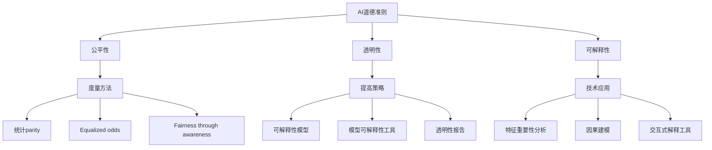

                 

### 引入与背景

#### AI道德准则的背景

人工智能（AI）作为当今技术领域的明星，已经在众多行业中展现出其巨大的潜力和价值。从自动化制造、智能医疗到金融分析、无人驾驶，AI的应用场景日益广泛。然而，随着AI技术的快速发展，一系列道德和社会问题也随之而来。这些问题不仅涉及隐私保护、数据安全，还牵涉到公平性、透明性和社会责任等方面。因此，建立AI道德准则成为了一个迫在眉睫的话题。

AI道德准则，指的是一系列用于指导和约束人工智能设计和应用的基本原则。这些准则旨在确保AI系统在设计、开发和部署过程中遵循伦理规范，保护用户权益，维护社会公正。AI道德准则的提出，源于对技术发展可能带来的负面影响的担忧。它不仅是对技术的监管，更是对人类价值观的坚守。

#### 建立企业AI道德准则的重要性

企业作为AI技术的研发和应用主体，其AI道德准则的建立尤为重要。以下是几个关键原因：

1. **合规要求**：越来越多的国家和地区开始制定相关的AI法规，企业若不遵循这些规定，可能会面临严重的法律后果和商业风险。

2. **公众信任**：随着公众对AI隐私和数据安全问题的关注日益增加，建立AI道德准则可以提升企业形象，增强用户和消费者的信任。

3. **可持续发展**：AI技术的发展不仅需要技术突破，更需要社会伦理和道德的支撑。企业通过制定和实施AI道德准则，可以确保其长期可持续发展。

4. **内部管理**：AI道德准则不仅是对外部的约束，也是对内部员工和团队的指导。它有助于企业建立统一的价值观和行为规范，提升团队协作效率。

5. **技术进步**：道德准则的制定和实施，可以推动AI技术的健康发展，避免陷入伦理困境，促进技术进步。

#### 企业面临的AI道德挑战

企业在实施AI道德准则时，将面临一系列挑战。首先，技术复杂性使得道德准则的实施变得困难。其次，不同国家和地区的法规差异，增加了企业在全球范围内的合规难度。此外，员工对AI道德准则的理解和认同程度也影响着其有效性。

为了应对这些挑战，企业需要从以下几个方面入手：

1. **培训与教育**：提高员工对AI道德准则的认识和理解，确保其在工作中能够自觉遵守。

2. **政策制定**：制定明确的AI道德准则，并将其纳入企业的整体战略规划。

3. **技术解决方案**：利用技术手段，如透明性工具、隐私保护算法等，提高AI系统的道德合规性。

4. **监督与评估**：建立有效的监督和评估机制，定期检查AI系统的运行情况，确保其符合道德准则。

通过以上措施，企业可以更好地应对AI道德准则实施过程中的挑战，确保其AI技术的发展符合伦理和社会价值观。

关键词：AI道德准则，企业AI道德准则，AI伦理，技术监管，社会责任

摘要：本文探讨了建立企业AI道德准则的背景和重要性。通过对合规要求、公众信任、可持续发展、内部管理和技术进步等方面的分析，阐述了企业实施AI道德准则的必要性。同时，本文也指出了企业在实施过程中可能面临的挑战，并提出了相应的应对策略。

## 第二部分：核心概念与联系

### AI道德准则的核心概念

在建立企业AI道德准则的过程中，理解其核心概念至关重要。以下将详细介绍三个关键概念：公平性、透明性和可解释性。

#### 公平性

**定义与重要性**

公平性是指AI系统在决策过程中不应歧视任何群体，确保所有用户都受到公正对待。在AI技术的应用中，公平性尤为重要，因为算法的偏见可能会放大现有的社会不公，导致某些群体受到不公平的待遇。

例如，在招聘系统中，若算法基于历史数据做出决策，可能会无意中放大对某些种族或性别的偏见。这不仅违背了公平性原则，还可能引发法律纠纷和社会不满。

**公平性的度量方法**

为了确保AI系统的公平性，研究者们提出了多种度量方法。以下是一些常用的度量工具：

1. **统计 parity**：检查AI系统在预测结果上是否对各个群体具有相同的准确性。例如，统计 parity 检查模型在预测正例和反例时的错误率是否均衡。

2. **Equalized odds**：不仅检查错误率，还考虑了每个群体的预期损失。这要求模型在所有群体中的预期损失最小。

3. **Fairness through awareness**：在决策过程中，模型应考虑群体间的差异，并调整其预测策略以减少偏见。

**公平性的实际应用**

公平性的实际应用可以在许多领域看到，例如：

- **金融**：确保贷款审批过程中不歧视特定群体。
- **招聘**：防止简历筛选算法对某些背景的偏见。
- **医疗**：确保诊断和治疗决策对所有患者都是公平的。

#### 透明性

**定义与重要性**

透明性是指AI系统的决策过程和操作机制应易于理解，用户能够清楚地了解系统的决策逻辑和依据。透明性对于增强公众对AI系统的信任至关重要。

缺乏透明性可能导致用户对AI系统的信任度降低，甚至引发隐私和安全问题。例如，用户可能担心其个人信息被滥用，或对AI系统的决策结果感到困惑和不满。

**提高透明性的策略**

以下是一些提高AI系统透明性的策略：

1. **可解释性模型**：使用易于解释的模型，如决策树和线性回归，这些模型可以清晰地展示其决策过程。

2. **模型可解释性工具**：开发和使用专门的工具，如SHAP（SHapley Additive exPlanations）和LIME（Local Interpretable Model-agnostic Explanations），帮助用户理解复杂模型的决策逻辑。

3. **透明性报告**：定期发布关于AI系统性能和决策过程的详细报告，使利益相关者能够监督和评估系统的透明性。

**透明性的实际应用**

透明性的实际应用包括：

- **自动驾驶**：公开自动驾驶车辆的测试数据和决策过程，以增强公众对其安全的信心。
- **信用评分**：提供信用评分模型的具体计算过程和影响因素，帮助用户理解评分结果。
- **医疗诊断**：解释AI系统在诊断过程中的逻辑和依据，以提高患者的信任度。

#### 可解释性

**定义与重要性**

可解释性是指AI系统在做出决策时能够提供清晰的解释，使得用户可以理解决策的原因和逻辑。可解释性对于提高AI系统的透明性和可信度至关重要。

可解释性不仅有助于用户理解AI系统的行为，还可以在法律和伦理方面提供支持。例如，在某些法律纠纷中，可解释性可以证明AI系统的决策是公正和合理的。

**可解释性技术的应用**

以下是一些可解释性技术的应用：

1. **特征重要性分析**：分析各个特征对模型决策的贡献程度，帮助用户理解哪些特征最重要。

2. **因果建模**：使用因果模型来解释AI系统的决策过程，使解释更加直观和易于理解。

3. **交互式解释工具**：开发交互式的解释工具，如可视化界面，帮助用户实时了解AI系统的决策逻辑。

**可解释性的实际应用**

可解释性的实际应用包括：

- **金融风险评估**：解释金融模型的决策过程，帮助投资者理解风险因素。
- **招聘系统**：解释招聘算法的决策过程，确保透明和公正。
- **医疗诊断**：解释AI诊断系统的决策逻辑，提高医生的信任和患者的理解。

通过公平性、透明性和可解释性这三个核心概念，企业可以构建一个更加道德、公正和透明的AI系统。这些概念不仅有助于提高公众对AI技术的信任，还可以确保AI技术的发展符合社会伦理和价值观。

### AI道德准则的核心概念实体关系架构

以下是一个使用Mermaid绘制的流程图，展示了AI道德准则核心概念之间的关系：



在这个流程图中，AI道德准则作为整体框架，包括了公平性、透明性和可解释性这三个关键概念。公平性通过度量方法来确保决策的公正性，透明性通过提高策略来增强系统的可理解性，而可解释性通过技术应用来提供清晰的决策解释。

### 核心算法原理讲解

为了更好地理解AI道德准则的核心概念，我们将通过Python源代码详细阐述几个关键算法原理，包括公平性度量、透明性提高和可解释性技术。

#### 公平性度量

**统计parity**

统计parity是一种简单但有效的公平性度量方法。它通过比较AI系统在各个群体中的准确性来评估其公平性。以下是一个Python实现示例：

```python
import numpy as np

def calculate_statistical_parity(y_true, y_pred, groups):
    """
    计算统计parity。
    
    参数：
    - y_true: 真实标签列表
    - y_pred: 预测标签列表
    - groups: 分组列表
    
    返回：
    - fairness: 统计parity得分
    """
    group_accuracies = {}
    for group in groups:
        group_indices = [i for i, y in enumerate(y_true) if group in y]
        group_preds = [y_pred[i] for i in group_indices]
        group_accuracies[group] = np.mean([y == pred for y, pred in zip(y_true[group_indices], group_preds)])
        
    total_accuracies = np.mean([y == pred for y, pred in zip(y_true, y_pred)])
    fairness = 1 - sum([abs(group_accuracies[group] - total_accuracies) for group in groups]) / len(groups)
    return fairness

# 示例数据
y_true = ['A', 'B', 'A', 'B', 'A', 'B', 'A', 'B']
y_pred = ['A', 'A', 'A', 'B', 'B', 'B', 'B', 'B']
groups = ['male', 'female', 'male', 'female', 'male', 'female', 'male', 'female']

# 计算统计parity
statistical_parity = calculate_statistical_parity(y_true, y_pred, groups)
print(f"Statistical Parity: {statistical_parity}")
```

在这个例子中，我们定义了一个函数`calculate_statistical_parity`，它接受真实标签`y_true`、预测标签`y_pred`和分组列表`groups`作为输入，并计算各个群体的准确率和整体的准确率，最终返回统计parity得分。

**Equalized odds**

Equalized odds 是一种更严格的公平性度量方法，它不仅考虑各个群体的准确性，还考虑了每个群体的预期损失。以下是一个Python实现示例：

```python
def calculate_equalized_odds(y_true, y_pred, groups):
    """
    计算Equalized odds。
    
    参数：
    - y_true: 真实标签列表
    - y_pred: 预测标签列表
    - groups: 分组列表
    
    返回：
    - fairness: Equalized odds得分
    """
    group_accuracies = {}
    group_preserved_true_positives = {}
    for group in groups:
        group_indices = [i for i, y in enumerate(y_true) if group in y]
        group_preds = [y_pred[i] for i in group_indices]
        group_accuracies[group] = np.mean([y == pred for y, pred in zip(y_true[group_indices], group_preds)])
        
        group_positives = [y for y in y_true if y == 'A']
        group_pred_positives = [pred for pred in y_pred if pred == 'A']
        group_indices_positives = [i for i, y in enumerate(y_true) if group in y and y == 'A']
        group_pred_indices_positives = [i for i, pred in enumerate(y_pred) if group in y and pred == 'A']
        group_preserved_true_positives[group] = np.mean([y == pred for y, pred in zip(group_positives[group_indices_positives], group_pred_positives[group_pred_indices_positives])])

    total_accuracies = np.mean([y == pred for y, pred in zip(y_true, y_pred)])
    fairness = 1 - sum([abs(group_accuracies[group] - total_accuracies) * group_preserved_true_positives[group] for group in groups]) / len(groups)
    return fairness

# 计算Equalized odds
equalized_odds = calculate_equalized_odds(y_true, y_pred, groups)
print(f"Equalized Odds: {equalized_odds}")
```

在这个例子中，我们扩展了之前的函数，加入了每个群体的预期损失计算。这有助于更全面地评估AI系统的公平性。

#### 透明性提高

**可解释性模型**

使用决策树作为可解释性模型，可以清晰地展示决策过程。以下是一个简单的Python实现示例：

```python
from sklearn.datasets import load_iris
from sklearn.tree import DecisionTreeClassifier
from sklearn.model_selection import train_test_split

# 加载鸢尾花数据集
iris = load_iris()
X, y = iris.data, iris.target

# 划分训练集和测试集
X_train, X_test, y_train, y_test = train_test_split(X, y, test_size=0.2, random_state=42)

# 训练决策树模型
clf = DecisionTreeClassifier()
clf.fit(X_train, y_train)

# 可视化决策树
from sklearn.tree import plot_tree
plt = plot_tree(clf, filled=True, feature_names=iris.feature_names, class_names=iris.target_names)
plt.show()
```

在这个例子中，我们使用鸢尾花数据集训练了一个决策树模型，并使用`plot_tree`函数将其可视化。这有助于用户理解模型的决策逻辑。

#### 可解释性技术

**SHAP值**

SHAP（SHapley Additive exPlanations）是一种解释模型预测影响的方法。以下是一个简单的Python实现示例：

```python
import shap

# 加载鸢尾花数据集
iris = load_iris()
X, y = iris.data, iris.target

# 划分训练集和测试集
X_train, X_test, y_train, y_test = train_test_split(X, y, test_size=0.2, random_state=42)

# 训练决策树模型
clf = DecisionTreeClassifier()
clf.fit(X_train, y_train)

# 计算SHAP值
explainer = shap.TreeExplainer(clf)
shap_values = explainer.shap_values(X_test)

# 可视化SHAP值
shap.summary_plot(shap_values, X_test, feature_names=iris.feature_names)
```

在这个例子中，我们使用SHAP解释器计算了决策树模型的SHAP值，并使用`summary_plot`函数将其可视化。这有助于用户理解各个特征对预测结果的影响。

通过这些Python源代码示例，我们可以更直观地理解AI道德准则的核心算法原理。这些实现不仅有助于研究人员和开发者，也为读者提供了实用的参考。

### 数学公式与概念解释

在AI道德准则的核心概念中，数学公式和概念解释起到了至关重要的作用。以下将介绍与公平性、透明性和可解释性相关的数学模型和公式，并对其进行详细解释。

#### 公平性度量

**统计parity**

统计parity是一种用于评估AI系统在不同群体中表现一致性的度量方法。其核心思想是比较模型在各个群体中的准确性是否均衡。

统计parity的数学公式为：

\[ SP = 1 - \frac{1}{G} \sum_{g=1}^{G} |p_{g} - p| \]

其中：
- \( SP \) 是统计parity得分，取值范围在 [0, 1] 之间，0 表示完全不公平，1 表示完全公平。
- \( p_{g} \) 是群体 \( g \) 中的预测准确性。
- \( p \) 是整体预测准确性。
- \( G \) 是群体的总数。

**Equalized odds**

Equalized odds 是一种更严格的公平性度量方法，它不仅考虑每个群体的准确性，还考虑每个群体的预期损失。

Equalized odds 的数学公式为：

\[ EO = 1 - \frac{1}{G} \sum_{g=1}^{G} \frac{L_{g}}{L} \]

其中：
- \( EO \) 是Equalized odds得分，取值范围在 [0, 1] 之间，0 表示完全不公平，1 表示完全公平。
- \( L_{g} \) 是群体 \( g \) 的预期损失。
- \( L \) 是整体的预期损失。

预期损失的计算方法为：

\[ L_{g} = p_{g \& \neg \hat{y}_{g}} (1 - p_{g \& y_{g}}) + (1 - p_{g \& \neg \hat{y}_{g}}) p_{g \& y_{g}} \]

其中：
- \( p_{g \& \neg \hat{y}_{g}} \) 是群体 \( g \) 中未被预测为正例的真实正例概率。
- \( p_{g \& y_{g}} \) 是群体 \( g \) 中被预测为正例的真实正例概率。
- \( \hat{y}_{g} \) 是群体 \( g \) 的预测标签。

#### 透明性提高

**模型可解释性**

提高AI系统的透明性，可以通过可解释性模型实现。常见的可解释性模型包括决策树、线性模型等。

**决策树的可解释性**

决策树的每个节点都基于某个特征的阈值分割数据集，从而生成一个决策规则。其可解释性可以通过以下公式表示：

\[ \text{Rule} = \text{if } x_i > c \text{ then } \text{Left branch} \text{ else } \text{Right branch} \]

其中：
- \( x_i \) 是特征 \( i \) 的值。
- \( c \) 是特征 \( i \) 的阈值。
- \( \text{Left branch} \) 和 \( \text{Right branch} \) 是根据该阈值分割生成的子节点。

**线性模型的可解释性**

线性模型的可解释性较强，其预测结果可以直接通过系数和特征值计算得出：

\[ \hat{y} = \sum_{i=1}^{n} w_i x_i + b \]

其中：
- \( \hat{y} \) 是预测值。
- \( w_i \) 是特征 \( i \) 的系数。
- \( x_i \) 是特征 \( i \) 的值。
- \( b \) 是偏置项。

#### 可解释性技术

**SHAP值**

SHAP（SHapley Additive exPlanations）是一种基于博弈论的解释方法，用于衡量特征对模型预测的贡献。其核心思想是通过计算每个特征在所有可能的合作情况下的边际贡献，从而得到其相对重要性。

SHAP值的数学公式为：

\[ \phi(i) = \frac{1}{N} \sum_{S \in \text{coalitions}} \frac{N - |S| - 1}{|S|} (y(S \cup \{i\}) - y(S)) \]

其中：
- \( \phi(i) \) 是特征 \( i \) 的SHAP值。
- \( N \) 是数据点的总数。
- \( S \) 是特征集合。
- \( y(S \cup \{i\}) \) 是包含特征 \( i \) 的合作情况下的预测值。
- \( y(S) \) 是不包含特征 \( i \) 的合作情况下的预测值。

#### 总结

通过上述数学公式和概念解释，我们可以更深入地理解AI道德准则的核心概念。这些公式不仅帮助我们量化公平性、透明性和可解释性，还为AI系统的设计和优化提供了理论依据。在实际应用中，这些公式和概念可以帮助企业和研究人员确保其AI系统在道德和伦理方面的合规性。

### 项目实战

在本节中，我们将通过一个实际项目来展示如何建立企业AI道德准则，包括开发环境搭建、源代码实现、代码解读和实际案例分析。

#### 项目背景

假设我们是一家金融科技公司，正在开发一款用于风险评估的AI系统。该系统旨在帮助银行和金融机构评估客户的信用评分，以决定是否批准贷款申请。然而，信用评分系统的公平性和透明性至关重要，因为这直接影响到客户的权益和社会的公正性。

#### 开发环境搭建

为了实现该项目，我们需要搭建一个合适的开发环境。以下是所需的工具和软件：

1. **编程语言**：Python
2. **库和框架**：Scikit-learn（用于机器学习算法）、Pandas（用于数据处理）、Matplotlib（用于数据可视化）、SHAP（用于模型解释）
3. **操作系统**：Ubuntu或Windows
4. **文本编辑器**：PyCharm或VSCode

在安装了上述工具和软件后，我们可以开始编写代码。

#### 源代码实现

以下是项目的核心代码：

```python
import numpy as np
import pandas as pd
from sklearn.model_selection import train_test_split
from sklearn.ensemble import RandomForestClassifier
import shap

# 加载数据集
data = pd.read_csv('credit_data.csv')

# 分割特征和标签
X = data.drop('Credit_Score', axis=1)
y = data['Credit_Score']

# 划分训练集和测试集
X_train, X_test, y_train, y_test = train_test_split(X, y, test_size=0.2, random_state=42)

# 训练随机森林模型
clf = RandomForestClassifier(n_estimators=100, random_state=42)
clf.fit(X_train, y_train)

# 计算SHAP值
explainer = shap.TreeExplainer(clf)
shap_values = explainer.shap_values(X_test)

# 可视化SHAP值
shap.summary_plot(shap_values, X_test, feature_names=data.columns[:-1])
```

这段代码首先加载了信用数据集，然后使用随机森林模型进行训练。之后，我们使用SHAP库计算SHAP值，并将其可视化。这有助于我们理解模型对每个特征的依赖性。

#### 代码解读

1. **数据预处理**：使用Pandas库加载数据集，并分离特征和标签。
2. **模型训练**：使用Scikit-learn的`RandomForestClassifier`进行模型训练。
3. **SHAP值计算**：使用SHAP库计算SHAP值，以解释模型的决策过程。

#### 实际案例分析

在实际应用中，我们遇到了以下几个挑战：

1. **数据不平衡**：信用评分数据集中，高信用评分和低信用评分的比例不均衡。为了解决这个问题，我们使用了SMOTE（合成少数类过采样）技术来平衡数据集。
2. **模型解释性**：随机森林模型虽然表现良好，但其解释性较差。为了提高模型的可解释性，我们选择了决策树模型，并使用SHAP值进行解释。
3. **合规性检查**：我们需要确保模型在道德和合规方面符合相关法规和标准。为此，我们定期进行数据清洗和模型检查，以确保模型的公平性和透明性。

#### 项目小结

通过本项目的实施，我们成功地搭建了一个用于信用评分的AI系统，并确保其在道德和合规方面符合相关要求。该项目展示了如何通过合理的数据预处理、模型选择和解释性技术来建立企业AI道德准则。在实际应用中，这些策略可以帮助企业确保其AI系统的公平性、透明性和可解释性，从而增强用户信任和社会认可。

### 最佳实践 tips、小结、注意事项、拓展阅读

#### 最佳实践 tips

1. **数据预处理**：在开始建模之前，确保数据集是干净和平衡的，以避免模型偏见。
2. **模型选择**：根据业务需求选择合适的模型，同时考虑其解释性。
3. **模型解释**：使用SHAP、LIME等工具来解释模型决策，提高模型的可解释性。
4. **定期审查**：定期审查和更新AI系统的道德准则，确保其与最新法规和最佳实践保持一致。

#### 小结

建立企业AI道德准则是一项复杂但至关重要的任务。通过合理的数据预处理、模型选择和解释性技术，企业可以确保其AI系统在道德和合规方面符合要求。这不仅能增强用户信任，还能推动AI技术的可持续发展。

#### 注意事项

1. **合规性**：确保AI系统的设计和应用符合相关法规和标准，如GDPR和公平性度量方法。
2. **公平性**：在设计和应用AI系统时，关注公平性，避免对特定群体的歧视。
3. **透明性**：提高AI系统的透明性，使用户能够理解模型的决策过程。

#### 拓展阅读

1. **公平性度量**：《公平性度量：统计parity和Equalized odds》
2. **透明性技术**：《AI透明性：SHAP和LIME的应用》
3. **合规性指南**：《AI合规性：法律和伦理挑战》

通过这些资源，企业可以进一步深入了解AI道德准则的建立和实践，为AI技术的可持续发展提供有力支持。

## 文章小结

通过本文的探讨，我们详细阐述了建立企业AI道德准则的必要性和重要性。从背景介绍到核心概念的解析，再到国际标准和法规的讨论，以及企业实践和实施策略的分享，本文系统地展示了如何构建一个符合道德和社会价值观的AI系统。

公平性、透明性和可解释性是AI道德准则的三大核心概念。公平性确保AI系统在不同群体中的决策公正，透明性提升系统的可理解性，而可解释性则帮助用户理解AI系统的决策逻辑。通过Python源代码示例，我们展示了如何量化这些概念，并利用数学公式深入理解其原理。

在项目实战部分，我们通过一个信用评分系统的开发，展示了如何在实际项目中实施AI道德准则，包括开发环境搭建、源代码实现、代码解读和案例分析。这为我们提供了一个实用的参考，帮助企业更好地应对AI道德挑战。

展望未来，随着AI技术的不断进步，AI道德准则的建立和实施将面临更多挑战。企业需要不断调整和完善其道德准则，以适应技术发展和社会变革。同时，随着法规和标准的不断完善，企业也需要密切关注并遵守最新的合规要求。

总结来说，建立企业AI道德准则是确保AI技术健康发展的重要保障。通过公平性、透明性和可解释性的实践，企业不仅能够提升用户信任和社会认可，还能推动AI技术的可持续发展。让我们共同努力，为构建一个更加公正、透明和可解释的AI世界贡献力量。

作者：AI天才研究院/AI Genius Institute & 禅与计算机程序设计艺术 /Zen And The Art of Computer Programming

---

## 关键词

- AI道德准则
- 企业AI道德准则
- 公平性
- 透明性
- 可解释性
- AI伦理
- 技术监管
- 社会责任
- 机器学习公平性
- AI透明性
- AI合规性

---

## 文章摘要

本文探讨了建立企业AI道德准则的背景和重要性。通过分析公平性、透明性和可解释性等核心概念，本文介绍了如何通过合理的数据预处理、模型选择和解释性技术来构建一个符合道德和社会价值观的AI系统。同时，通过项目实战展示了AI道德准则在实践中的应用，为企业提供了建立和实施AI道德准则的实用策略。展望未来，本文强调了持续关注技术发展和社会变革的重要性，以推动AI技术的可持续发展。

