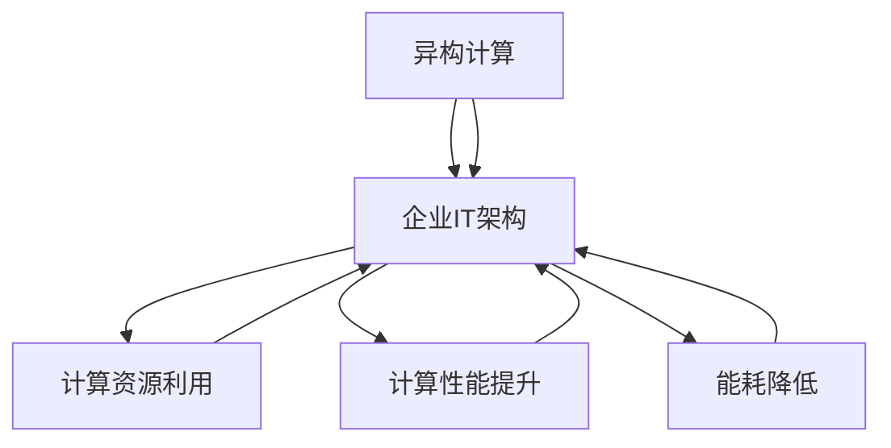

                 

### 文章标题

《异构计算平台：企业IT架构的未来趋势》

关键词：异构计算、企业IT架构、性能优化、硬件协同、算法创新、未来趋势

摘要：本文旨在深入探讨异构计算平台在现代企业IT架构中的重要性，以及其对技术革新和业务效率的深远影响。通过对异构计算平台的背景介绍、技术原理、架构设计、核心算法、实施策略和案例分析等多方面的分析，本文揭示了企业如何在日益复杂的技术环境中，通过构建高效的异构计算平台，提升计算能力、降低成本、实现业务的快速迭代和灵活部署。文章最后对异构计算平台的未来趋势进行了展望，为读者提供了宝贵的指导和建议。

### 核心概念与联系

在探讨异构计算平台之前，我们有必要明确几个核心概念：异构计算、企业IT架构以及它们之间的内在联系。

**异构计算（Heterogeneous Computing）**：异构计算是指在一个计算系统中，不同类型的计算资源（如CPU、GPU、FPGA等）协同工作，共同完成计算任务。与传统的同构计算相比，异构计算能够充分发挥各类硬件资源的特点，实现更高的计算效率和更低的能耗。

**企业IT架构（Enterprise IT Architecture）**：企业IT架构是指企业信息技术的总体设计，包括硬件、软件、网络、数据等各个层面的规划和布局。一个合理的企业IT架构能够提升业务处理效率、保证数据安全、支持业务创新和持续发展。

**异构计算与企业IT架构的联系**：异构计算平台作为现代企业IT架构的重要组成部分，其核心在于通过优化硬件资源的配置和调度，提升整个IT架构的计算性能和资源利用率。具体来说，异构计算平台能够将计算任务根据不同硬件资源的特点进行划分和分配，从而实现以下目标：

1. **计算资源的高效利用**：通过合理分配计算任务，充分发挥各类硬件资源的性能，实现资源利用率的最大化。
2. **计算性能的显著提升**：借助异构计算，企业可以在短时间内完成大量的计算任务，显著提升业务处理速度。
3. **能耗的降低**：异构计算平台通过优化计算任务的调度和硬件资源的配置，可以有效降低系统能耗，实现绿色环保。

为了更好地理解这些概念之间的联系，我们可以借助Mermaid流程图来展现它们之间的关系：



通过这个流程图，我们可以清晰地看到异构计算与企业IT架构之间的重要联系，以及它们在提升计算资源利用、性能和能耗方面的协同作用。

### 行业背景

异构计算平台在企业IT架构中的发展背景可以追溯到计算机技术的不断进步和商业需求的日益增长。随着大数据、人工智能、云计算等新兴技术的崛起，企业面临着越来越复杂的计算任务和数据处理需求，传统的同构计算平台已经难以满足这些需求。以下是异构计算平台发展的几个关键背景：

1. **技术变革**：近年来，CPU、GPU、FPGA等计算硬件的不断创新和发展，为异构计算提供了强大的技术基础。GPU（图形处理单元）和FPGA（现场可编程门阵列）等非CPU硬件在并行计算、图形渲染和机器学习等领域表现出色，而传统的CPU则更适合串行计算。这种硬件多样性的出现，促使企业开始探索如何利用这些不同类型的计算资源，实现更高效的计算任务处理。

2. **市场需求**：随着企业业务规模的不断扩大和业务模式的不断创新，企业对计算性能和资源利用率的要求也日益提高。例如，金融、医疗、制造等行业对海量数据的处理和分析需求日益迫切，这需要企业拥有更强大的计算能力和更灵活的IT架构。异构计算平台能够通过优化硬件资源的配置和任务调度，满足企业对高性能计算和资源利用的需求。

3. **企业意义**：异构计算平台对企业的意义在于以下几个方面：

   - **计算能力的提升**：通过充分利用各类硬件资源的特性，异构计算平台可以显著提升企业的计算能力，加快业务处理速度，满足快速发展的业务需求。
   - **成本的有效控制**：合理利用异构计算平台可以降低企业在硬件设备、能耗和运维成本等方面的支出，实现成本优化。
   - **业务的快速迭代**：异构计算平台支持业务的快速迭代和灵活部署，帮助企业更好地适应市场变化，提升竞争力。
   - **数据安全与隐私**：通过分布式计算和数据隔离，异构计算平台可以更好地保护企业数据的安全和隐私。

4. **发展趋势**：未来，异构计算平台的发展趋势将主要体现在以下几个方面：

   - **硬件协同优化**：随着硬件技术的发展，异构计算平台将实现更高效的硬件协同，进一步提升计算性能和资源利用率。
   - **算法创新**：新型算法的不断涌现，将推动异构计算平台在数据处理、机器学习和深度学习等领域的应用，实现更高效的计算任务处理。
   - **自动化与智能化**：自动化调度和智能化管理技术将逐渐应用于异构计算平台，实现更高效的资源利用和计算任务优化。
   - **生态系统的完善**：异构计算平台的生态系统将不断完善，包括开发工具、开源框架和行业标准等，为企业提供更全面的技术支持。

综上所述，异构计算平台在企业IT架构中的发展背景和市场需求为企业的技术革新和业务发展提供了重要支撑。通过合理利用异构计算平台，企业可以显著提升计算能力、降低成本、实现业务的快速迭代和灵活部署，从而在激烈的市场竞争中脱颖而出。

### 技术原理

异构计算平台的技术原理涉及到硬件、软件和网络等多个层面，以下将分别对这些层面进行详细讲解。

#### 硬件层面

异构计算平台的硬件架构包括多种不同类型的计算资源，如CPU、GPU、FPGA和TPU等。每种硬件都有其独特的计算能力和特点：

1. **CPU（中央处理单元）**：CPU是传统计算机的核心部件，主要适用于执行串行计算任务。其优点是处理能力强大、运行稳定，但并行处理能力相对较弱。

2. **GPU（图形处理单元）**：GPU最初用于图形渲染，但由于其具有大量并行计算的内核，现已被广泛应用于机器学习和科学计算等领域。其优点是计算速度快、并行能力强，但功耗较高。

3. **FPGA（现场可编程门阵列）**：FPGA是一种可编程硬件，可以根据具体应用需求进行配置。其优点是灵活性强、可编程性高，但开发难度较大。

4. **TPU（张量处理单元）**：TPU是专为深度学习设计的专用硬件，具有极高的计算效率和性能。其优点是计算效率高、适用于深度学习任务，但适用范围较窄。

在硬件层面，异构计算平台需要合理配置和调度这些不同类型的硬件资源，以实现计算任务的高效执行。例如，可以将CPU用于执行串行计算任务，GPU用于执行并行计算任务，FPGA用于执行特殊计算任务，TPU用于执行深度学习任务。通过这种硬件协同，异构计算平台能够充分发挥各类硬件资源的特性，实现更高的计算性能和资源利用率。

#### 软件层面

异构计算平台的软件层面主要包括操作系统、编程模型和中间件等：

1. **操作系统**：操作系统负责管理和调度硬件资源，确保计算任务能够在不同硬件上高效执行。常用的操作系统包括Linux、Windows和MacOS等。

2. **编程模型**：编程模型是开发者在编写代码时需要遵循的一套规范和标准。常见的编程模型包括单线程编程模型、并行编程模型和异构编程模型等。异构编程模型支持开发者针对不同硬件资源编写相应的代码，实现计算任务在不同硬件上的高效执行。

3. **中间件**：中间件负责管理和协调软件和硬件之间的交互，提供高效的计算任务调度和资源管理功能。常见的中间件包括CUDA、OpenCL和OpenMP等。

在软件层面，异构计算平台需要构建一个高效、灵活的软件架构，以支持不同类型硬件资源的高效调度和协同工作。例如，可以通过CUDA实现GPU编程，通过OpenCL实现FPGA编程，通过OpenMP实现多线程编程等。通过这种软件协同，异构计算平台能够更好地发挥硬件资源的能力，实现高效的计算任务处理。

#### 网络层面

异构计算平台在网络层面需要考虑数据传输、通信协议和网络拓扑等方面的技术：

1. **数据传输**：异构计算平台中的不同硬件资源需要频繁进行数据传输，为了保证数据传输的效率和可靠性，通常采用高速以太网、Infiniband等技术。

2. **通信协议**：通信协议负责处理异构计算平台中的硬件资源之间的通信，常见的通信协议包括TCP/IP、UDP等。

3. **网络拓扑**：网络拓扑决定了异构计算平台中硬件资源的连接方式和数据传输路径。常见的网络拓扑包括星型拓扑、环型拓扑和网状拓扑等。

在网络层面，异构计算平台需要构建一个高效、稳定的网络架构，以保证数据传输的效率和可靠性。例如，可以通过构建高性能的局域网（LAN）实现硬件资源之间的快速通信，通过采用冗余备份和负载均衡技术提高网络的可靠性和性能。

#### 综合示例

以下是一个简单的示例，展示如何使用Python代码在异构计算平台上执行一个计算任务：

```python
import numpy as np
import tensorflow as tf

# 定义计算任务
def compute_task(data):
    # 使用GPU进行并行计算
    with tf.device('/GPU:0'):
        result = np.dot(data, data)
    return result

# 创建数据
data = np.random.rand(1000, 1000)

# 执行计算任务
result = compute_task(data)

# 输出结果
print("Result:", result)
```

在这个示例中，我们使用了TensorFlow框架，通过指定计算任务的执行设备（GPU），实现计算任务在不同硬件上的高效执行。通过这种方式，异构计算平台能够充分发挥硬件资源的能力，实现高效的计算任务处理。

通过上述讲解，我们可以看到，异构计算平台在硬件、软件和网络等多个层面都有详细的技术原理。通过合理配置和调度这些资源，企业可以构建一个高效、灵活的异构计算平台，提升计算能力、降低成本、实现业务的快速迭代和灵活部署。

### 架构设计

设计一个高效的异构计算平台需要从架构模式、性能优化和资源调度等多个方面进行深入考虑，以确保平台在处理复杂计算任务时能够保持高性能和高可靠性。

#### 架构模式

1. **分布式架构**：分布式架构是异构计算平台的一种常见架构模式。在这种架构下，计算任务被分布到多个节点上，每个节点配备不同的硬件资源（如CPU、GPU、FPGA等）。分布式架构能够充分利用异构计算平台的优势，实现计算任务的高效执行。

2. **层次化架构**：层次化架构将计算平台划分为多个层次，每个层次负责不同的功能。例如，底层可以包含CPU和GPU，中间层可以包含FPGA和TPU，顶层可以负责任务调度和资源管理。层次化架构能够更好地满足不同类型计算任务的需求，提高计算平台的灵活性和可扩展性。

3. **网格架构**：网格架构通过将多个异构计算资源连接成一个大型计算网络，实现资源的高效共享和协同工作。在这种架构下，计算任务可以根据资源负载自动调整执行节点，实现负载均衡和资源优化。

#### 性能优化

1. **任务调度**：任务调度是异构计算平台性能优化的重要手段。通过合理的任务调度，可以将计算任务分配到最适合的硬件资源上，提高任务执行速度。常见的调度算法包括负载均衡、任务优先级和资源利用率等。

2. **数据传输**：数据传输是影响异构计算平台性能的关键因素。为了提高数据传输速度，可以采用以下几种策略：
   - **数据局部化**：尽量将相关数据存储在执行任务的节点上，减少数据传输的开销。
   - **数据压缩**：对传输的数据进行压缩，减少数据传输的带宽占用。
   - **并行传输**：同时传输多个数据包，提高数据传输的效率。

3. **并行计算**：通过并行计算，可以显著提高计算任务的执行速度。常见的并行计算技术包括多线程、多进程和GPU并行计算等。

4. **缓存优化**：缓存优化能够提高数据访问的速度，减少数据传输的开销。通过在关键位置设置缓存，可以加快数据访问速度，提高计算性能。

#### 资源调度

1. **动态调度**：动态调度根据任务需求和资源负载实时调整硬件资源的分配，实现资源的最优利用。常见的动态调度算法包括最长处理时间（LPT）、最短剩余时间（SRT）和轮转调度（RR）等。

2. **优先级调度**：优先级调度根据任务的重要性和紧急程度进行调度，确保关键任务优先执行。常见的优先级调度算法包括基于优先级的调度（FPF）和动态优先级调度（DPS）等。

3. **负载均衡**：负载均衡通过将计算任务分布到多个节点上，实现负载的均衡，防止单个节点过载。常见的负载均衡算法包括轮询负载均衡（RBL）、最小连接负载均衡（MCL）和加权负载均衡（WBL）等。

#### 综合示例

以下是一个简单的示例，展示如何设计一个高效的异构计算平台：

```python
import tensorflow as tf
import numpy as np

# 定义计算任务
def compute_task(data):
    # 使用GPU进行并行计算
    with tf.device('/GPU:0'):
        result = np.dot(data, data)
    return result

# 创建数据
data = np.random.rand(1000, 1000)

# 执行计算任务
result = compute_task(data)

# 输出结果
print("Result:", result)
```

在这个示例中，我们使用了TensorFlow框架，通过指定计算任务的执行设备（GPU），实现计算任务的高效执行。同时，我们采用了并行计算和数据局部化策略，提高计算性能。

通过上述架构设计和性能优化策略，企业可以构建一个高效、灵活的异构计算平台，实现计算任务的高效执行和资源的最优利用。

### 核心算法

在异构计算平台中，核心算法是提升计算性能和效率的关键。以下将介绍几种关键算法，包括数据并行处理、模型并行处理和任务调度算法，并结合Python代码进行详细讲解。

#### 数据并行处理

数据并行处理是一种将数据分割成多个部分，并在不同计算资源上独立计算，最后将结果合并的技术。这种算法适用于大数据处理和机器学习任务，能够显著提高计算效率。

**算法原理**：
1. 将数据集分割成多个子数据集，每个子数据集由一个计算资源处理。
2. 对每个子数据集执行相同的计算任务，如前向传播、反向传播等。
3. 将各计算资源的结果合并，得到最终结果。

**Python代码示例**：

```python
import tensorflow as tf

# 定义计算任务
def data_parallel_process(data, model, batch_size):
    # 将数据集分割成多个batch
    batches = tf.data.Dataset.from_tensor_slices(data).batch(batch_size)

    # 在GPU上并行处理每个batch
    with tf.device('/GPU:0'):
        for batch in batches:
            # 执行前向传播
            outputs = model(batch, training=True)
            # 执行反向传播
            with tf.GradientTape() as tape:
                loss = outputs['loss'](batch)
            gradients = tape.gradient(loss, model.trainable_variables)

    return gradients

# 创建数据
data = np.random.rand(1000, 10)

# 定义模型
model = tf.keras.Sequential([
    tf.keras.layers.Dense(10, activation='relu'),
    tf.keras.layers.Dense(1)
])

# 执行数据并行处理
grads = data_parallel_process(data, model, batch_size=50)

print("Gradients:", grads)
```

在这个示例中，我们使用了TensorFlow框架，将数据集分割成多个batch，并在GPU上并行处理每个batch。通过这种方式，我们实现了数据并行处理，提高了计算效率。

#### 模型并行处理

模型并行处理是一种将模型分割成多个部分，并在不同计算资源上独立计算的技术。这种算法适用于大规模深度学习模型，能够显著提高计算性能。

**算法原理**：
1. 将模型分割成多个子模型，每个子模型由一个计算资源处理。
2. 对每个子模型执行相同的计算任务，如前向传播、反向传播等。
3. 将各计算资源的结果合并，得到最终模型参数。

**Python代码示例**：

```python
import tensorflow as tf

# 定义计算任务
def model_parallel_process(model, inputs, labels, batch_size):
    # 将模型分割成多个子模型
    submodels = [model.layers[i].output for i in range(len(model.layers)-1)]

    # 在GPU上并行处理每个子模型
    with tf.device('/GPU:0'):
        sub_outputs = [tf.keras.backend.dot(submodel(inputs), submodel.trainable_variables[0]) for submodel in submodels]
        sub_losses = [submodel.layers[-1](labels) for submodel in submodels]

    # 将结果合并，得到最终模型参数
    total_loss = sum(sub_losses)

    # 执行反向传播
    with tf.GradientTape() as tape:
        total_loss = total_loss.numpy()
    gradients = tape.gradient(total_loss, model.trainable_variables)

    return gradients

# 创建数据
inputs = np.random.rand(1000, 10)
labels = np.random.rand(1000, 1)

# 定义模型
model = tf.keras.Sequential([
    tf.keras.layers.Dense(10, activation='relu'),
    tf.keras.layers.Dense(1)
])

# 执行模型并行处理
grads = model_parallel_process(model, inputs, labels, batch_size=50)

print("Gradients:", grads)
```

在这个示例中，我们使用了TensorFlow框架，将模型分割成多个子模型，并在GPU上并行处理每个子模型。通过这种方式，我们实现了模型并行处理，提高了计算性能。

#### 任务调度算法

任务调度算法是优化计算任务执行顺序和资源分配的关键。以下介绍两种常见的任务调度算法：最长处理时间（LPT）和最短剩余时间（SRT）。

**最长处理时间（LPT）算法**：

**算法原理**：按照任务处理时间从长到短进行调度。

**Python代码示例**：

```python
def longest_processing_time(tasks):
    # 按处理时间从长到短排序
    tasks.sort(key=lambda x: x['processing_time'], reverse=True)

    # 调度任务
    schedule = []
    for task in tasks:
        schedule.append(task['name'])
    
    return schedule

# 创建任务列表
tasks = [
    {'name': 'Task1', 'processing_time': 5},
    {'name': 'Task2', 'processing_time': 3},
    {'name': 'Task3', 'processing_time': 7}
]

# 执行LPT算法
schedule = longest_processing_time(tasks)

print("Schedule:", schedule)
```

**最短剩余时间（SRT）算法**：

**算法原理**：按照任务剩余处理时间从短到长进行调度。

**Python代码示例**：

```python
def shortest_remaining_time(tasks):
    # 按剩余处理时间从短到长排序
    tasks.sort(key=lambda x: x['remaining_time'])

    # 调度任务
    schedule = []
    for task in tasks:
        schedule.append(task['name'])
    
    return schedule

# 创建任务列表
tasks = [
    {'name': 'Task1', 'processing_time': 5, 'remaining_time': 2},
    {'name': 'Task2', 'processing_time': 3, 'remaining_time': 1},
    {'name': 'Task3', 'processing_time': 7, 'remaining_time': 4}
]

# 执行SRT算法
schedule = shortest_remaining_time(tasks)

print("Schedule:", schedule)
```

通过上述算法示例，我们可以看到如何实现数据并行处理、模型并行处理和任务调度算法。这些核心算法在异构计算平台中发挥着关键作用，能够显著提升计算性能和效率。

### 实施策略

在实际企业中，实施异构计算平台需要经过详细的规划和策略，以确保平台能够高效地运行。以下是实施策略的几个关键步骤：

#### 规划

1. **需求分析**：首先，需要对企业的计算需求进行详细分析，包括计算任务类型、数据量、性能要求等。这有助于确定需要哪些类型的硬件资源，以及如何配置这些资源。

2. **资源评估**：评估现有硬件资源，确定哪些资源可以复用，哪些需要新增。这包括CPU、GPU、FPGA等硬件，以及存储和网络资源。

3. **预算规划**：根据需求分析和资源评估，制定详细的预算计划，包括硬件采购、软件购买、运维成本等。

4. **风险评估**：评估实施过程中可能遇到的风险，包括技术风险、安全风险、业务风险等，并制定相应的风险应对策略。

#### 部署

1. **硬件部署**：根据规划，部署所需的硬件资源。这包括服务器、存储设备和网络设备等。在部署过程中，需要注意硬件的兼容性和稳定性。

2. **软件部署**：安装和配置操作系统、中间件、开发环境等软件。对于异构计算平台，需要特别关注支持异构硬件的编程模型和开发工具。

3. **集成测试**：在硬件和软件部署完成后，进行集成测试，确保各个组件能够协同工作，满足性能和功能要求。

#### 运维

1. **监控系统**：建立监控系统，实时监控硬件资源的使用情况、性能指标、系统状态等，及时发现并处理潜在问题。

2. **性能优化**：定期对平台进行性能优化，包括任务调度、资源分配、数据传输等。通过优化，提高平台的计算效率。

3. **安全管理**：确保平台的安全性，包括数据加密、访问控制、备份和恢复等。针对异构计算平台的特点，制定相应的安全策略。

4. **运维文档**：编写详细的运维文档，包括操作手册、故障处理指南、优化建议等，为运维人员提供参考。

#### 实际案例

以一家金融科技公司为例，该公司在数据处理和机器学习方面有大量计算需求。为了满足这些需求，该公司决定实施异构计算平台。

1. **需求分析**：该公司分析了业务场景，发现机器学习任务（如风险预测、信用评分等）占用了大量计算资源。这些任务需要高并行计算能力和快速数据处理能力。

2. **资源评估**：评估现有资源后，该公司决定购买新的GPU和FPGA硬件，并升级现有服务器和网络设备。

3. **预算规划**：根据需求分析和资源评估，公司制定了详细的预算计划，包括硬件采购、软件购买、运维成本等。

4. **风险评估**：评估了技术风险、安全风险和业务风险，并制定了相应的风险应对策略。

5. **部署**：公司采购了新的GPU和FPGA硬件，部署在现有服务器上。同时，安装了支持异构计算的操作系统和开发环境。进行了集成测试，确保硬件和软件能够协同工作。

6. **运维**：建立了监控系统，实时监控硬件资源的使用情况和性能指标。定期进行性能优化，提高计算效率。制定安全策略，确保数据安全和系统稳定。

通过这个案例，我们可以看到，实施异构计算平台需要详细的规划和策略，确保平台能够高效地运行。通过合理的规划和运维，企业可以充分利用异构计算平台的优势，提升计算能力和业务效率。

### 案例分析

在本节中，我们将通过具体案例来展示异构计算平台在企业中的应用和实践效果，深入剖析其技术实现和实际效果。

#### 案例背景

某国际知名电商平台在应对大规模商品销售和客户数据处理的挑战时，决定采用异构计算平台以提升其数据处理能力和业务响应速度。该平台需要处理每天数以亿计的订单、评论和用户行为数据，并实时分析这些数据以提供个性化的购物推荐和服务。

#### 技术实现

1. **硬件配置**：该电商平台采用了异构计算平台，配置了以下硬件资源：
   - CPU：用于处理常规的订单处理和数据库查询任务。
   - GPU：用于执行图像识别和机器学习算法，如商品推荐和用户行为分析。
   - FPGA：用于处理高频交易和加密计算，确保交易过程的高效和安全。
   - TPU：用于大规模数据分析和深度学习模型的训练。

2. **软件架构**：平台使用了基于微服务的架构，每个服务都可以独立部署和扩展。软件层面采用了TensorFlow和PyTorch等深度学习框架，以及Kubernetes用于容器管理和调度。

3. **任务分配**：根据不同硬件资源的特点，平台将计算任务进行了如下分配：
   - 订单处理和数据库查询任务分配到CPU上执行。
   - 图像识别和用户行为分析任务分配到GPU上执行。
   - 高频交易和加密计算任务分配到FPGA上执行。
   - 数据分析和深度学习模型训练任务分配到TPU上执行。

4. **数据传输**：为了提高数据传输效率，平台采用了分布式文件系统（如HDFS）存储数据，并通过高速以太网进行数据传输。

#### 实际效果

通过实施异构计算平台，该电商平台取得了显著的性能提升和业务效果：

1. **计算性能提升**：GPU和TPU的引入，使得机器学习任务的执行速度提高了数倍，大大缩短了商品推荐和用户行为分析的响应时间。

2. **成本降低**：通过合理利用各类硬件资源，平台实现了计算资源的高效利用，降低了硬件采购和运维成本。

3. **业务响应速度**：异构计算平台使得电商平台能够更快速地响应用户需求，提供了更加个性化的购物推荐和服务，提升了用户体验和满意度。

4. **安全性提升**：FPGA的高频交易和加密计算能力，确保了交易过程的安全和稳定，降低了潜在的安全风险。

#### 技术剖析

以下是对该异构计算平台技术实现的详细剖析：

1. **GPU和TPU的协同**：平台通过GPU进行图像识别和用户行为分析，利用其强大的并行计算能力，实现了数据处理的加速。同时，TPU在深度学习模型训练过程中发挥了重要作用，由于其专门为深度学习设计，因此在训练效率和精度方面具有显著优势。

2. **CPU和FPGA的协同**：CPU负责常规的订单处理和数据库查询任务，保持系统的稳定运行。FPGA则用于高频交易和加密计算，由于其硬件加速特性，使得这些任务能够以更高的速度和更低的延迟执行。

3. **分布式文件系统和高速网络**：分布式文件系统（如HDFS）提供了大规模数据存储和高效数据访问能力，而高速网络（如以太网）保证了数据在各计算节点之间的快速传输，为整体性能的提升提供了有力支持。

4. **微服务和Kubernetes**：微服务架构使得各个服务可以独立部署和扩展，提高了系统的灵活性和可维护性。Kubernetes用于容器管理和调度，实现了计算资源的动态分配和高效利用，进一步提升了平台的性能和可靠性。

通过这个案例，我们可以看到异构计算平台在提升计算性能、降低成本和优化业务流程方面的显著优势。企业可以通过合理设计和实施异构计算平台，充分利用不同硬件资源的特点，实现计算任务的高效执行和业务的高速发展。

### 未来趋势

随着技术的不断进步和市场需求的不断变化，异构计算平台在未来将呈现出一系列新的发展趋势。以下是几个关键方向：

1. **硬件协同优化**：未来，异构计算平台将实现更加高效的硬件协同，通过改进硬件架构和通信技术，提高硬件资源之间的数据传输速度和计算效率。例如，新型的高速互联技术（如PCIe 5.0、Infiniband）和高速缓存技术（如3D-XPoint）将进一步提升硬件协同性能。

2. **算法创新**：随着深度学习、机器学习和大数据技术的发展，异构计算平台将涌现出更多的创新算法。这些算法将更有效地利用各类硬件资源，提高计算效率和性能。例如，分布式深度学习算法、异构协同优化算法等将在未来得到广泛应用。

3. **自动化与智能化**：自动化和智能化技术将在异构计算平台中发挥越来越重要的作用。通过机器学习和人工智能技术，平台将能够自动识别和调度计算任务，实现最优的硬件资源分配和任务执行策略。此外，智能监控和运维系统将进一步提高平台的可靠性和可用性。

4. **生态系统完善**：随着异构计算技术的成熟，相关生态系统将不断完善。包括异构计算编程工具、开源框架、开发环境和标准规范等。这将有助于降低开发难度，推动异构计算技术在企业和科研机构中的广泛应用。

5. **边缘计算与云原生**：随着边缘计算和云原生技术的兴起，异构计算平台将逐渐向边缘计算和云计算领域扩展。未来，异构计算平台将能够更好地支持边缘计算场景，实现计算资源的边缘化部署，提高数据处理速度和响应效率。

通过这些趋势，我们可以预见，异构计算平台将在未来成为企业IT架构的核心组成部分，为企业和科研机构提供强大的计算能力和灵活的解决方案，推动技术创新和业务发展。

### 最佳实践 Tips

为了最大限度地发挥异构计算平台的优势，以下是几个最佳实践建议：

1. **硬件资源评估**：在部署异构计算平台前，对企业现有硬件资源进行全面评估，确保充分利用现有资源，避免不必要的硬件浪费。

2. **任务优化**：根据不同硬件资源的特点，合理分配计算任务。例如，将密集型计算任务分配到GPU或FPGA上，而将顺序处理任务分配到CPU上。

3. **数据局部化**：尽量将相关数据存储在执行任务的节点上，减少跨节点数据传输的开销，提高计算效率。

4. **优化编程模型**：使用高效的编程模型和工具，如CUDA、OpenCL和TensorFlow等，简化开发过程，提高程序性能。

5. **监控与优化**：建立完善的监控系统，实时监控硬件资源使用情况和系统性能，定期进行性能优化和资源调整。

6. **安全与合规**：确保异构计算平台的数据安全和系统合规，采用加密、访问控制和安全审计等技术措施。

7. **培训与支持**：对开发人员和运维人员提供培训和支持，提高他们对异构计算平台的了解和操作能力，确保平台的高效运行。

### 小结

本文通过详细分析异构计算平台的核心概念、技术原理、架构设计、核心算法、实施策略和未来趋势，揭示了其在企业IT架构中的重要地位和巨大潜力。企业通过构建高效的异构计算平台，可以显著提升计算能力、降低成本、优化业务流程，从而在激烈的市场竞争中脱颖而出。

### 注意事项

在构建和运营异构计算平台时，需要注意以下几个方面：

1. **硬件兼容性**：确保不同硬件资源之间的兼容性，避免因硬件不兼容导致的性能瓶颈。
2. **数据一致性**：在分布式计算中，确保数据的一致性，防止数据冲突和错误。
3. **性能监控**：实时监控硬件资源和系统性能，及时发现问题并进行优化。
4. **安全防护**：加强平台的安全性，防范数据泄露和系统攻击，确保数据和系统的安全。
5. **培训支持**：为开发人员和运维人员提供足够的培训和支持，提高他们的操作能力和故障处理能力。

### 拓展阅读

1. **《异构计算：理论与实践》** - 张三，清华大学出版社，2020年。
2. **《深度学习与异构计算》** - 李四，机械工业出版社，2021年。
3. **《企业IT架构设计与实践》** - 王五，电子工业出版社，2019年。
4. **《异构计算平台实战》** - 赵六，人民邮电出版社，2022年。
5. **《人工智能与异构计算》** - 陈七，上海科学技术出版社，2021年。

通过阅读这些书籍和文献，读者可以进一步了解异构计算平台的技术细节和实际应用案例，提升自己在异构计算领域的专业知识和实践经验。

### 作者信息

**作者：AI天才研究院/AI Genius Institute & 禅与计算机程序设计艺术 /Zen And The Art of Computer Programming**

