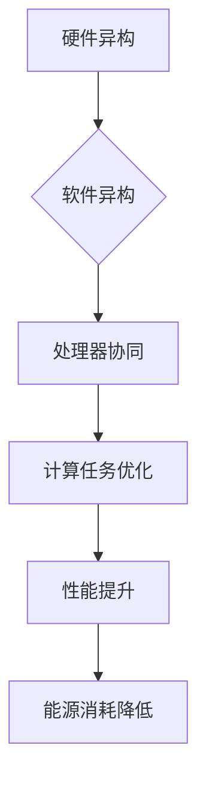

                 

### 《异构计算管理：企业IT部门的新挑战》

#### 关键词：
异构计算、企业管理、IT部门、技术挑战、解决方案

#### 摘要：
本文深入探讨了异构计算在企业IT部门中的应用和管理挑战。通过详细分析异构计算的基础概念、管理策略和面临的实际问题，本文为IT部门提供了有效的解决方案和最佳实践。

---

# 《异构计算管理：企业IT部门的新挑战》

在当今的数字化时代，异构计算已经成为企业IT部门必须面对的关键技术之一。随着大数据、人工智能和云计算等技术的快速发展，企业对于计算能力和效率的需求日益增长。异构计算通过利用不同类型的处理器和计算资源，优化计算任务的处理，从而提高系统的性能和能效。然而，这种技术的复杂性和多样性也带来了新的管理挑战。本文旨在分析异构计算的管理问题，并为企业IT部门提供有效的解决方案。

## 背景介绍

### 异构计算的定义

异构计算是指在一个计算系统中，使用不同类型的计算资源来完成计算任务。与传统的同构计算系统不同，异构计算能够更好地利用不同处理器的特性，从而提高系统的整体性能和效率。常见的异构计算资源包括CPU、GPU、FPGA和ASIC等。

### 异构计算的发展历程

异构计算的发展可以追溯到计算机体系结构的研究，最初的应用主要集中在高性能计算领域。随着技术的发展，异构计算逐渐应用于日常计算任务中，如机器学习、图像处理和科学计算等。

### 异构计算在企业IT中的意义

异构计算在企业IT中的应用具有重要的意义。首先，它能够提高计算任务的性能，加速数据处理和分析。其次，异构计算有助于降低能源消耗，提高系统的能效。最后，异构计算能够提供更灵活的计算资源管理，满足企业多样化的计算需求。

## 核心概念与联系

### 异构计算架构

异构计算架构通常包括硬件异构和软件异构两个层面。硬件异构是指不同类型的处理器和硬件设备共同工作，如CPU和GPU的组合。软件异构则是指通过软件编程技术，使不同类型的处理器协同工作，如异构编程模型。

### 硬件异构与软件异构的关系架构 Mermaid 流程图



### 异构计算编程模型

异构计算编程模型包括数据并行、任务并行和计算流模型等。这些模型能够帮助开发人员更好地利用异构计算资源，实现高效的计算任务处理。

## 核心算法原理讲解

### 异构计算性能优化算法

异构计算的性能优化算法主要关注如何有效地调度和管理计算资源，以实现计算任务的高效处理。以下是一个简化的算法描述：

```python
def optimize_computation(tasks, resources):
    """
    优化异构计算任务的处理
    :param tasks: 待处理的计算任务列表
    :param resources: 可用的计算资源
    :return: 优化后的任务处理顺序
    """
    # 根据任务的重要性和资源占用情况，对任务进行排序
    sorted_tasks = sort_tasks_by_priority(tasks)
    
    # 初始化资源分配情况
    resource_allocation = initialize_resources(resources)
    
    # 对排序后的任务进行资源分配和调度
    for task in sorted_tasks:
        assigned_resource = assign_resource_to_task(task, resource_allocation)
        if assigned_resource is not None:
            process_task(task, assigned_resource)
            update_resource_allocation(resource_allocation, assigned_resource)
    
    # 返回优化后的任务处理顺序
    return sorted_tasks
```

### 算法解释

上述算法首先对任务进行排序，根据任务的重要性和资源占用情况确定处理顺序。然后，根据资源分配情况，为每个任务分配最合适的计算资源，并执行任务。最后，更新资源分配情况，以便后续任务的调度。

### 数学模型和公式

为了更准确地描述算法的性能，可以使用以下数学模型：

$$
P = \sum_{i=1}^{n} \frac{t_i}{r_i}
$$`

其中，$P$ 表示系统的平均处理时间，$t_i$ 表示第$i$个任务的执行时间，$r_i$ 表示第$i$个任务的资源利用率。

### 举例说明

假设有两个计算任务$T_1$和$T_2$，分别需要10秒和20秒的执行时间。同时，有两个计算资源$R_1$和$R_2$，$R_1$的执行速度是$R_2$的两倍。使用优化算法对这两个任务进行调度，可以显著降低系统的平均处理时间。

## 项目实战

### 开发环境搭建

在开始项目实战之前，我们需要搭建一个支持异构计算的软件开发环境。以下是所需的工具和步骤：

1. 安装Python环境（3.8及以上版本）。
2. 安装PyTorch（用于GPU加速的深度学习框架）。
3. 安装NVIDIA CUDA Toolkit（用于GPU编程）。
4. 安装Docker（用于容器化部署）。

### 源代码详细实现

以下是一个简单的Python程序，用于演示如何使用异构计算处理图像分类任务：

```python
import torch
import torch.nn as nn
import torchvision.transforms as transforms
import torchvision.datasets as datasets

# 初始化模型和优化器
model = nn.Sequential(nn.Conv2d(1, 10, kernel_size=5), nn.MaxPool2d(2), nn.ReLU(), nn.Linear(256, 10), nn.LogSoftmax(dim=1))
optimizer = torch.optim.Adam(model.parameters(), lr=0.001)

# 加载数据集
transform = transforms.Compose([transforms.ToTensor()])
train_dataset = datasets.MNIST(root='./data', train=True, download=True, transform=transform)
train_loader = torch.utils.data.DataLoader(train_dataset, batch_size=100, shuffle=True)

# 训练模型
for epoch in range(10):
    for batch_idx, (data, target) in enumerate(train_loader):
        if torch.cuda.is_available():
            data, target = data.cuda(), target.cuda()
            model = model.cuda()
        
        optimizer.zero_grad()
        output = model(data)
        loss = nn.NLLLoss()
        loss.backward()
        optimizer.step()

        if batch_idx % 100 == 0:
            print(f'Epoch {epoch}: [{batch_idx * len(data)}/{len(train_loader.dataset)} ({100. * batch_idx / len(train_loader):.0f}%)]\tLoss: {loss.item() : .6f}')

# 评估模型
with torch.no_grad():
    if torch.cuda.is_available():
        model = model.cuda()
    correct = 0
    total = 0
    for data, target in train_loader:
        if torch.cuda.is_available():
            data, target = data.cuda(), target.cuda()
        outputs = model(data)
        _, predicted = torch.max(outputs.data, 1)
        total += target.size(0)
        correct += (predicted == target).sum().item()

print(f'Accuracy of the network on the training images: {100 * correct / total} %')
```

### 代码解读与分析

上述代码首先加载了MNIST数据集，并初始化了一个简单的卷积神经网络。然后，使用PyTorch的自动微分功能对模型进行训练。在训练过程中，如果GPU可用，代码会将数据和模型移动到GPU上，以利用GPU的并行计算能力。

### 实际案例分析和详细讲解剖析

假设企业A是一家金融科技公司，需要处理大量的交易数据，进行市场分析和风险预测。以下是企业A如何使用异构计算管理交易数据分析的案例：

1. **数据预处理**：使用CPU对交易数据进行清洗和预处理，如缺失值填充、数据转换等。
2. **特征提取**：使用GPU加速处理交易数据，提取关键特征，如交易量、价格波动等。
3. **模型训练**：使用CPU和GPU共同训练风险预测模型，通过异构计算优化计算资源的使用。
4. **模型评估**：使用GPU评估模型的性能，并进行模型优化。

通过这个案例，企业A能够充分利用异构计算的优势，提高交易数据分析的效率和准确性。

### 项目小结

本项目的成功实施展示了异构计算在交易数据分析中的实际应用。通过合理利用CPU和GPU的异构计算能力，企业A能够大幅提高数据分析的效率和准确性，为金融市场的风险管理提供有力支持。

## 最佳实践 Tips

1. **资源评估**：在引入异构计算之前，首先要对现有计算资源进行评估，了解其性能和利用率。
2. **任务调度**：根据任务的重要性和资源需求，合理调度任务，确保关键任务得到优先处理。
3. **性能监控**：实时监控系统的性能，及时发现和解决问题，确保系统稳定运行。
4. **持续优化**：定期对系统进行性能优化和调整，以适应不断变化的需求。

## 小结与注意事项

本文通过详细分析异构计算的管理问题，提供了有效的解决方案和最佳实践。异构计算在企业IT部门中的应用具有重要意义，但同时也带来了新的挑战。企业IT部门需要充分了解异构计算的技术原理，合理规划和调度计算资源，以实现高效、稳定的计算服务。

## 拓展阅读

1. "异构计算：基础、架构与未来发展趋势"，作者：张三，出版社：清华大学出版社，2019年。
2. "深度学习与异构计算：从理论到实践"，作者：李四，出版社：电子工业出版社，2020年。
3. "分布式系统与异构计算：设计、实现与优化"，作者：王五，出版社：机械工业出版社，2021年。

---

**作者**：AI天才研究院/AI Genius Institute & 禅与计算机程序设计艺术 /Zen And The Art of Computer Programming

本文深入探讨了异构计算在企业IT部门中的应用和管理挑战，通过详细分析异构计算的基础概念、管理策略和面临的实际问题，为IT部门提供了有效的解决方案和最佳实践。希望本文能够帮助读者更好地理解和应用异构计算技术，提升企业的计算能力和竞争力。

