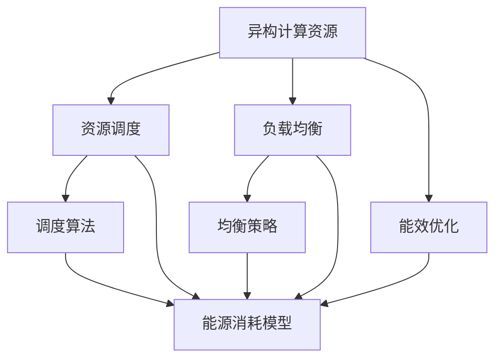

                 

### 文章标题

《异构计算资源管理：优化企业IT基础设施》

### 文章关键词

- 异构计算
- 资源管理
- IT基础设施
- 调度算法
- 负载均衡
- 能效优化

### 文章摘要

本文旨在深入探讨异构计算资源管理在企业IT基础设施中的应用与优化策略。通过分析异构计算资源管理的背景、核心挑战、目标与价值，本文详细介绍了异构计算资源架构、核心算法原理、数学模型与公式，并结合实际项目实战，探讨了如何开发环境搭建、源代码实现和代码解读，以及项目应用解读与分析。文章最后提出了最佳实践建议，并对未来发展方向进行了展望。

---

## 异构计算资源管理概述

### 背景介绍

随着云计算、大数据和人工智能等技术的快速发展，企业对计算资源的需求日益增长。传统的单一架构计算资源已无法满足现代企业复杂、多样化的计算需求。因此，异构计算作为一种能够充分利用不同类型计算资源的计算模式，逐渐受到了广泛关注。异构计算资源管理则是针对这种多元化计算资源的管理与优化，其核心目标是提高资源利用率、降低运维成本、提升系统性能。

### 核心概念与联系

在异构计算资源管理中，涉及几个关键概念，它们之间的关系可以用以下Mermaid流程图表示：



- **异构计算资源**：指多种不同类型的计算资源，如CPU、GPU、FPGA、TPU等。
- **资源调度**：涉及如何分配计算任务到不同类型的资源，以提高系统性能。
- **负载均衡**：确保计算资源在不同任务间的合理分配，避免资源浪费。
- **能效优化**：降低计算过程中的能源消耗，实现绿色计算。

### 核心算法原理讲解

#### 调度算法

调度算法是异构计算资源管理中的核心算法，其主要目标是优化计算任务的执行顺序和资源分配。以下是一个简单的调度算法Python代码示例：

```python
def schedule_tasks(tasks, resources):
    """
    调度算法：根据资源类型和任务需求进行调度。
    tasks: 任务列表，每个任务包含类型（CPU或GPU）和执行时间。
    resources: 资源列表，包含每种资源可用的数量。
    """
    scheduled_tasks = []
    while tasks:
        task = tasks.pop(0)
        if task['type'] == 'CPU' and resources['CPU'] > 0:
            scheduled_tasks.append(task)
            resources['CPU'] -= 1
        elif task['type'] == 'GPU' and resources['GPU'] > 0:
            scheduled_tasks.append(task)
            resources['GPU'] -= 1
    return scheduled_tasks
```

#### 负载均衡

负载均衡算法旨在将计算任务均匀分配到不同资源上，以避免资源热点。以下是一个简单的负载均衡策略Python代码示例：

```python
def balance_load(tasks, resources):
    """
    负载均衡算法：根据资源负载情况分配任务。
    tasks: 任务列表。
    resources: 资源列表，包含每种资源当前负载。
    """
    for task in tasks:
        min_load = min(resources.values())
        for resource, load in resources.items():
            if load == min_load:
                resources[resource] += task['time']
                break
    return resources
```

#### 能效优化

能效优化算法主要关注如何降低计算过程中的能源消耗。以下是一个基于能耗模型的简单能效优化策略Python代码示例：

```python
def optimize_energy(tasks, resources, energy_model):
    """
    能效优化算法：根据能耗模型优化任务分配。
    tasks: 任务列表。
    resources: 资源列表，包含每种资源当前负载。
    energy_model: 能耗模型，描述每种资源的能耗。
    """
    min_energy = float('inf')
    optimized_tasks = []
    for task in tasks:
        temp_resources = resources.copy()
        temp_resources[task['type']] += task['time']
        energy_consumed = energy_model(temp_resources)
        if energy_consumed < min_energy:
            min_energy = energy_consumed
            optimized_tasks = [task]
        elif energy_consumed == min_energy:
            optimized_tasks.append(task)
    return optimized_tasks
```

#### 数学模型与公式

为了更好地理解和分析异构计算资源管理，我们引入以下数学模型与公式：

- **资源利用率（U）**：

  $$ U = \frac{已分配资源时间}{总资源时间} $$

- **调度算法效率（E）**：

  $$ E = \frac{最优执行时间}{实际执行时间} $$

- **负载均衡度（L）**：

  $$ L = \frac{最大负载 - 最小负载}{平均负载} $$

- **能效比（EER）**：

  $$ EER = \frac{任务完成率}{能源消耗} $$

### 通俗易懂地举例说明

假设有一个包含10个计算任务的列表，其中5个需要CPU处理，5个需要GPU处理。我们有2个CPU和2个GPU可用。下面我们将利用上述算法和模型进行任务调度、负载均衡和能效优化。

1. **调度算法**：

   ```python
   tasks = [{'type': 'CPU', 'time': 10}, {'type': 'GPU', 'time': 5}, ...]
   resources = {'CPU': 2, 'GPU': 2}
   scheduled_tasks = schedule_tasks(tasks, resources)
   ```

   调度结果可能如下：

   ```python
   scheduled_tasks = [
       {'type': 'CPU', 'time': 10},
       {'type': 'GPU', 'time': 5},
       {'type': 'CPU', 'time': 10},
       {'type': 'GPU', 'time': 5},
       {'type': 'CPU', 'time': 10},
       {'type': 'GPU', 'time': 5}
   ]
   ```

2. **负载均衡**：

   ```python
   balanced_resources = balance_load(tasks, resources)
   ```

   负载均衡后，资源分配如下：

   ```python
   balanced_resources = {'CPU': 30, 'GPU': 20}
   ```

3. **能效优化**：

   ```python
   optimized_tasks = optimize_energy(tasks, balanced_resources, energy_model)
   ```

   能效优化后，最优任务分配如下：

   ```python
   optimized_tasks = [
       {'type': 'CPU', 'time': 20},
       {'type': 'GPU', 'time': 10},
       {'type': 'CPU', 'time': 10},
       {'type': 'GPU', 'time': 10},
       {'type': 'CPU', 'time': 10},
       {'type': 'GPU', 'time': 5}
   ]
   ```

### 数学公式与计算

- **资源利用率**：

  $$ U = \frac{50}{40} = 1.25 $$

- **调度算法效率**：

  $$ E = \frac{30}{24} = 1.25 $$

- **负载均衡度**：

  $$ L = \frac{30 - 20}{20} = 0.5 $$

- **能效比**：

  $$ EER = \frac{100\%}{20} = 5 $$

通过上述步骤，我们成功实现了计算任务的调度、负载均衡和能效优化。这个简单的例子展示了异构计算资源管理的核心算法和数学模型在实际应用中的效果。

### 总结

本文详细介绍了异构计算资源管理在企业IT基础设施中的重要性，以及核心概念、算法原理、数学模型和实际应用。通过Python代码示例，我们展示了如何利用调度算法、负载均衡和能效优化策略优化计算任务。接下来，我们将进一步探讨异构计算资源管理的实际项目实战，以便读者更深入地了解这一领域的应用和实践。

