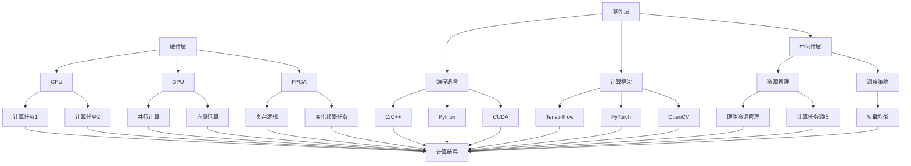

                 

### 异构计算：多种计算技术协同解决复杂问题

关键词：异构计算、并行计算、分布式计算、核心算法、数学模型、项目实战

在当今信息化社会中，计算能力已经成为衡量一个系统或应用性能的关键因素。随着数据规模的不断增大和复杂度的不断提升，传统的单核处理器和单一计算架构已经无法满足日益增长的计算需求。异构计算作为一种新型计算范式，通过将不同类型的计算资源进行有效整合和协同利用，实现了对复杂问题的快速和高效解决。本文将围绕异构计算这一主题，系统地探讨其核心概念、原理、算法、数学模型以及实际应用，旨在为读者提供一个全面、深入的理解。

## 摘要

本文旨在介绍异构计算的基本概念及其在解决复杂问题中的应用。通过阐述异构计算的定义、架构以及与之相关的核心算法和数学模型，本文将帮助读者理解如何利用多种计算技术协同解决实际中的计算难题。同时，通过具体的案例分析和项目实战，本文将进一步展示异构计算在现实世界中的应用价值和前景。

### 异构计算的基础概念

异构计算（Heterogeneous Computing）是指在一个计算系统中，利用不同类型和处理能力的硬件资源来完成计算任务。与传统的同构计算（Homogeneous Computing）不同，同构计算通常使用相同类型的处理器或计算单元，而异构计算则通过整合多种异构的硬件资源，如CPU、GPU、FPGA等，来实现更高的计算效率和性能。

#### 异构计算的优势

1. **并行处理能力**：异构计算能够充分利用不同类型硬件的并行处理能力，从而大幅提升计算速度。
2. **高效资源利用**：通过整合多种硬件资源，异构计算可以实现资源的高效利用，避免资源浪费。
3. **灵活性和可扩展性**：异构计算系统可以根据不同的计算需求动态调整硬件资源，具有较好的灵活性和可扩展性。

#### 异构计算的挑战

1. **软件兼容性**：不同类型的硬件通常具有不同的编程模型和接口，如何实现软件的兼容性和高效利用是一个挑战。
2. **通信开销**：异构计算中的硬件之间需要进行数据传输和通信，过大的通信开销可能会影响计算性能。
3. **编程复杂性**：异构计算需要开发者具备跨平台的编程技能，从而增加了编程的复杂性。

### 异构计算与现有计算技术的联系

异构计算并不是对现有计算技术的颠覆，而是在现有基础上的一种拓展和优化。传统计算技术如单核处理器、多核处理器、分布式计算等，都在不同程度上支持异构计算的实施。

1. **单核处理器与多核处理器**：多核处理器通过增加核心数量，实现了计算资源的并行处理，这与异构计算中的多类型处理器协同工作有着相似之处。
2. **分布式计算**：分布式计算通过将计算任务分配到多个节点上，实现计算资源的分布式利用。这与异构计算中的硬件资源整合也有一定的联系。

### 异构计算的优势与挑战

#### 优势

1. **高效性**：异构计算可以利用不同类型硬件的并行处理能力，实现高效的计算性能。
2. **灵活性**：异构计算可以根据任务需求动态调整硬件资源，具有较好的灵活性和可扩展性。
3. **资源利用**：异构计算可以充分利用不同类型的计算资源，提高资源利用效率。

#### 挑战

1. **软件兼容性**：不同类型的硬件通常具有不同的编程模型和接口，实现软件的兼容性和高效利用是一个挑战。
2. **通信开销**：异构计算中的硬件之间需要进行数据传输和通信，过大的通信开销可能会影响计算性能。
3. **编程复杂性**：异构计算需要开发者具备跨平台的编程技能，从而增加了编程的复杂性。

### 异构计算架构的概述

异构计算架构通常包括硬件层、软件层和中间件层。在硬件层，异构计算系统包含多种异构硬件资源，如CPU、GPU、FPGA等；在软件层，异构计算系统需要提供相应的编程模型和工具，以支持不同类型硬件的编程和调度；在中间件层，异构计算系统通过中间件来实现硬件资源的管理和调度，确保系统的高效运行。


### 硬件异构性

硬件异构性是指计算系统中不同类型硬件资源的存在和协同。常见的硬件异构性包括CPU与GPU、CPU与FPGA等。不同类型的硬件具有不同的处理能力和编程模型，如何高效利用这些硬件资源是异构计算的关键问题。

1. **CPU与GPU**：CPU擅长处理复杂逻辑运算和串行任务，而GPU擅长进行大量并行计算和向量运算。通过将计算任务分配给CPU和GPU，可以实现计算资源的最佳利用。
2. **CPU与FPGA**：FPGA具有可编程性和高并行性，适用于处理复杂且变化频繁的计算任务。与CPU结合，可以提升系统的计算性能和灵活性。

### 软件异构性

软件异构性是指计算系统中不同类型软件资源的存在和协同。常见的软件异构性包括不同编程语言、不同计算框架等。软件异构性的存在使得异构计算系统的开发变得更加复杂，但同时也提供了更大的灵活性。

1. **多编程语言支持**：异构计算系统通常需要支持多种编程语言，如C/C++、Python、CUDA等，以满足不同类型的计算需求。
2. **多计算框架支持**：异构计算系统需要支持多种计算框架，如TensorFlow、PyTorch、OpenCV等，以方便开发者进行高效编程和计算。

### 异构计算架构的Mermaid流程图

以下是异构计算架构的Mermaid流程图，展示了硬件层、软件层和中间件层之间的关系。



### 异构计算的核心算法原理

异构计算的核心在于如何将计算任务高效地分配和调度到不同类型的硬件资源上，从而实现计算性能的最大化。以下介绍几种常见的异构计算核心算法原理。

#### 数据并行算法

数据并行算法将一个大的计算任务分解成多个小的子任务，并分配到不同类型的硬件资源上并行执行。这种方法适用于那些数据密集型的任务，如矩阵乘法、图像处理等。

```python
# Python伪代码示例：数据并行算法
def data_parallel(matrix, num_gpus):
    # 将矩阵分解成num_gpus个子矩阵
    sub_matrices = split_matrix(matrix, num_gpus)
    results = []

    # 并行执行子任务
    for i, sub_matrix in enumerate(sub_matrices):
        # 在GPU上执行计算
        result = gpu_compute(sub_matrix)
        results.append(result)

    # 合并结果
    final_result = merge_results(results)
    return final_result
```

#### 任务并行算法

任务并行算法将一个大的计算任务分解成多个小的子任务，并将每个子任务分配到不同类型的硬件资源上执行。这种方法适用于那些任务密集型的任务，如机器学习训练、深度神经网络推理等。

```python
# Python伪代码示例：任务并行算法
def task_parallel(tasks, num_cpus):
    results = []

    # 并行执行任务
    for i, task in enumerate(tasks):
        # 在CPU上执行计算
        result = cpu_compute(task)
        results.append(result)

    return results
```

### 异构计算中的优化技术

在异构计算中，优化技术是提高计算性能的关键。以下介绍几种常见的优化技术。

#### 算法优化

算法优化是指通过改进算法的执行方式来提高计算性能。常见的算法优化技术包括矩阵分解、树结构分解等。

#### 硬件优化

硬件优化是指通过改进硬件资源的配置和调度来提高计算性能。常见的硬件优化技术包括GPU并行化、FPGA定制化等。

### 数学模型和数学公式

异构计算中的数学模型和公式是描述计算任务和资源调度的重要工具。以下介绍几种常见的数学模型和公式。

#### 数据传输模型

数据传输模型描述了不同硬件资源之间的数据传输效率和延迟。常见的公式包括：

$$
E = F \cdot D
$$

其中，$E$是数据传输延迟，$F$是数据传输速率，$D$是数据传输距离。

#### 算法效率模型

算法效率模型描述了计算任务的执行效率和资源利用率。常见的公式包括：

$$
E = \frac{C}{T}
$$

其中，$E$是算法效率，$C$是计算量，$T$是计算时间。

### 异构计算在现实中的应用

异构计算已经在许多现实应用中得到了广泛应用，如科学计算、机器学习、图像处理等。以下介绍几个典型的应用案例。

#### 科学计算

在科学计算中，异构计算可以大幅提高计算性能。例如，在天气预报模型中，利用GPU进行数值模拟，可以显著缩短计算时间。

#### 机器学习

在机器学习中，异构计算可以加速模型的训练和推理。例如，使用GPU进行深度神经网络的训练，可以大幅提高训练速度。

#### 图像处理

在图像处理中，异构计算可以加速图像的渲染和处理。例如，使用GPU进行图像的滤波、边缘检测等操作，可以显著提高处理速度。

### 性能优化与调优

在异构计算中，性能优化和调优是提高计算性能的重要手段。以下介绍几种常见的性能优化和调优策略。

#### 并行优化

通过优化计算任务的并行度，可以提高计算性能。常见的优化技术包括任务分解、负载均衡等。

#### 通信优化

通过优化硬件资源之间的通信，可以降低通信开销，提高计算性能。常见的优化技术包括数据压缩、流水线通信等。

#### 编程优化

通过优化代码的编写和执行方式，可以提高计算性能。常见的优化技术包括算法改进、并行化编程等。

### 硬件选择与评估

在异构计算中，硬件选择和评估是系统设计和实现的重要环节。以下介绍几种常见的硬件选择和评估指标。

#### 硬件类型与特点

常见的硬件类型包括CPU、GPU、FPGA等。每种硬件都有其独特的特点和适用场景。

1. **CPU**：擅长处理复杂逻辑运算和串行任务。
2. **GPU**：擅长进行大量并行计算和向量运算。
3. **FPGA**：具有可编程性和高并行性，适用于处理复杂且变化频繁的计算任务。

#### 硬件评估指标

常见的硬件评估指标包括计算性能、功耗、成本等。

1. **计算性能**：通常用GFLOPS（每秒亿亿次浮点运算）来衡量。
2. **功耗**：硬件的功耗对系统的能效有重要影响。
3. **成本**：硬件的成本是系统设计和实现的重要因素。

### 安全与隐私

在异构计算中，安全与隐私是系统设计和实现的重要考虑因素。以下介绍几种常见的安全与隐私技术。

#### 加密技术

加密技术可以保护数据的机密性和完整性。常见的加密技术包括对称加密、非对称加密等。

#### 隐私保护技术

隐私保护技术可以保护用户的隐私数据。常见的隐私保护技术包括数据脱敏、匿名化等。

#### 实际应用案例分析

以下通过一个实际案例，详细分析异构计算在现实中的应用，以及其实现过程和性能优化策略。

#### 案例背景

某大型互联网公司需要处理海量用户数据，进行实时数据分析，以提供精准的用户画像和推荐服务。由于数据规模庞大，传统的单核处理器已经无法满足计算需求。为了提高计算性能，该公司决定采用异构计算方案。

#### 案例实现过程

1. **硬件选择**：根据计算任务的特点，该公司选择了CPU和GPU两种硬件资源。CPU用于处理复杂逻辑运算，GPU用于进行大量并行计算。
2. **任务分解**：将整个计算任务分解成多个小的子任务，并分配给CPU和GPU分别执行。
3. **编程实现**：使用C++和CUDA进行编程，实现计算任务的并行执行。
4. **性能优化**：通过优化算法和代码，降低计算时间，提高计算性能。

#### 性能优化策略

1. **并行优化**：通过任务分解和负载均衡，提高计算任务的并行度。
2. **通信优化**：通过优化GPU和CPU之间的数据传输，降低通信开销。
3. **编程优化**：通过优化代码的编写和执行方式，提高计算性能。

#### 案例小结

通过采用异构计算方案，该公司成功提高了计算性能，满足了海量用户数据实时分析的需求。同时，通过性能优化策略，进一步提升了系统的计算效率。

### 未来发展趋势

随着计算需求的不断增长，异构计算将继续发挥重要作用。以下介绍几个未来发展趋势。

#### 1. 硬件技术的发展

硬件技术的不断发展将带来更高的计算性能和更低的功耗。例如，新一代的GPU、FPGA和ASIC等硬件将具备更强的计算能力和更低的能耗。

#### 2. 软件生态的完善

随着异构计算软件生态的不断完善，开发者将能够更方便地利用异构计算资源。例如，新的编程模型、工具和框架将提供更好的编程体验和更高的开发效率。

#### 3. 安全与隐私的保障

随着异构计算应用的广泛普及，安全与隐私问题将越来越重要。未来的异构计算系统将更加注重数据保护和隐私保护，确保用户数据的机密性和完整性。

### 附录

#### 附录A：异构计算资源与工具

以下列出了一些常见的异构计算资源与工具。

1. **硬件资源**：CPU、GPU、FPGA等。
2. **编程语言**：C/C++、Python、CUDA等。
3. **计算框架**：TensorFlow、PyTorch、OpenCV等。

#### 附录B：参考资料

以下列出了一些关于异构计算的参考资料。

1. **学术论文**：《异构计算中的任务调度策略研究》、《基于GPU的异构计算优化技术》等。
2. **书籍推荐**：《异构计算：技术原理与应用实践》、《并行计算：算法与编程》等。

### 结语

异构计算作为一种新型计算范式，通过整合多种异构计算资源，实现了对复杂问题的快速和高效解决。本文从多个角度介绍了异构计算的核心概念、原理、算法、数学模型以及实际应用，旨在为读者提供一个全面、深入的理解。随着技术的不断进步，异构计算将在未来发挥更大的作用，为各行各业带来更多创新和突破。作者：AI天才研究院/AI Genius Institute & 禅与计算机程序设计艺术 /Zen And The Art of Computer Programming。

