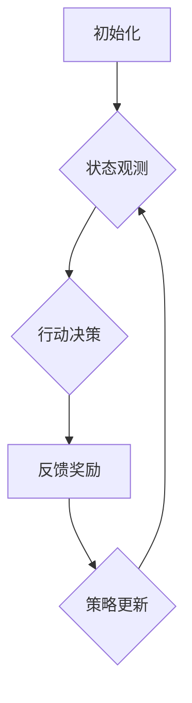

                 

### 《强化学习在AIGC内容优化中的新进展》

#### 关键词：
强化学习，AIGC，内容优化，算法，新进展

#### 摘要：
本文深入探讨了强化学习在自适应信息生成与内容优化（AIGC）领域的新进展。首先，文章介绍了强化学习的基本概念和原理，以及其与AIGC的关系。随后，详细阐述了AIGC的基础知识和技术，探讨了强化学习在内容优化中的应用场景和优势。接着，文章通过具体算法原理讲解和数学模型阐述，展示了强化学习在内容生成、推荐和筛选中的实际应用。进一步，文章介绍了强化学习在AIGC内容优化中的新进展，包括算法改进和前沿技术应用。最后，文章总结了全文内容，并对未来发展趋势进行了展望。

### 引言

强化学习（Reinforcement Learning, RL）作为一种机器学习范式，通过智能体与环境的交互来学习最优策略。近年来，随着人工智能技术的飞速发展，强化学习在诸多领域取得了显著成果。自适应信息生成与内容优化（Adaptive Information Generation and Content Optimization，简称AIGC）是人工智能的一个重要分支，旨在通过自动化的方式生成和优化信息内容，以满足用户需求和提升用户体验。

AIGC涵盖了生成对抗网络（GAN）、变分自编码器（VAE）等技术，广泛应用于图像生成、文本生成、视频生成等领域。强化学习与AIGC的结合，使得内容优化更加智能化和自适应化。本文将从以下几个方面展开讨论：

1. 强化学习的基本概念和原理。
2. AIGC的基础知识和技术。
3. 强化学习在内容优化中的应用场景和优势。
4. 强化学习在内容优化中的具体算法原理和数学模型。
5. 强化学习在AIGC内容优化中的新进展。
6. 总结与未来展望。

### 强化学习的基本概念和原理

#### 1.1 强化学习的定义

强化学习是一种通过智能体（Agent）与环境的交互来学习最优策略的机器学习方法。智能体在环境中采取行动，根据环境的反馈（奖励或惩罚）来调整自身策略，以实现最大化累积奖励的目标。

#### 1.2 强化学习的目标

强化学习的目标是学习一个策略（Policy），使得智能体在给定初始状态下，能够通过不断与环境交互，逐渐优化自身的行动策略，从而实现累计奖励的最大化。

#### 1.3 强化学习的算法类型

强化学习算法主要分为基于值的方法（如Q-learning、SARSA）和基于策略的方法（如Policy Gradient）。这些算法通过不断更新智能体的策略，使其在复杂环境中找到最优行动路径。

#### 1.4 强化学习原理

强化学习的原理可以概括为四个步骤：

1. **状态观测**：智能体从环境中获取当前状态。
2. **行动决策**：智能体根据当前状态和策略选择行动。
3. **反馈奖励**：环境根据智能体的行动给予奖励或惩罚。
4. **策略更新**：智能体根据奖励更新策略，以最大化累积奖励。

#### 1.5 强化学习流程

强化学习的基本流程如下：

1. 初始化智能体和环境。
2. 智能体从初始状态开始，采取行动。
3. 环境根据智能体的行动返回下一状态和奖励。
4. 智能体更新策略，以最大化累积奖励。
5. 重复步骤2-4，直到达到指定目标或状态。

#### 1.6 强化学习流程的Mermaid流程图

### AIGC的基础知识和技术

#### 2.1 AIGC的相关概念

自适应信息生成与内容优化（AIGC）是指通过机器学习和人工智能技术，自动生成和优化信息内容的过程。AIGC旨在提高内容生成和优化的效率，满足用户个性化的需求。

#### 2.2 AIGC的核心技术

AIGC的核心技术主要包括生成对抗网络（GAN）、变分自编码器（VAE）和自适应控制技术。

1. **生成对抗网络（GAN）**：GAN是一种由生成器和判别器组成的对抗网络，通过对抗训练生成逼真的图像、文本和视频。

2. **变分自编码器（VAE）**：VAE是一种无监督学习模型，通过引入编码器和解码器，学习数据的概率分布，从而生成新的数据。

3. **自适应控制技术**：自适应控制技术通过实时调整参数，使系统在变化的环境中保持稳定和优化。

#### 2.3 AIGC的应用场景

AIGC广泛应用于图像生成、文本生成、视频生成和内容优化等领域，如：

1. **图像生成**：通过GAN生成逼真的图像，应用于艺术创作、医学图像处理等领域。
2. **文本生成**：通过VAE生成新的文本，应用于自然语言生成、机器翻译等领域。
3. **视频生成**：通过AIGC生成新的视频，应用于视频增强、视频修复等领域。
4. **内容优化**：通过AIGC优化内容生成和推荐，应用于电子商务、在线教育等领域。

### 强化学习在内容优化中的应用场景和优势

#### 3.1 内容优化的定义

内容优化是指通过优化内容的质量和相关性，提高用户满意度和用户体验的过程。在互联网时代，海量信息使得用户获取有效信息变得困难，因此内容优化变得尤为重要。

#### 3.2 强化学习在内容优化中的应用场景

强化学习在内容优化中具有广泛的应用场景，主要包括：

1. **内容生成**：利用强化学习生成高质量的内容，如文章、图像、视频等，应用于艺术创作、广告推广等领域。
2. **内容推荐**：利用强化学习优化内容推荐系统，提高推荐内容的准确性和用户体验，应用于电子商务、社交媒体等领域。
3. **内容筛选**：利用强化学习筛选出高质量的内容，去除无关或低质量的内容，应用于新闻推荐、搜索引擎等领域。

#### 3.3 强化学习在内容优化中的优势

强化学习在内容优化中的优势主要体现在以下几个方面：

1. **自适应优化**：强化学习能够根据用户行为和反馈，自适应地调整内容生成和推荐的策略，提高用户体验。
2. **灵活性**：强化学习适用于多种类型的内容优化任务，如文本、图像、视频等，具有广泛的适用性。
3. **实时性**：强化学习能够实时更新策略，快速适应环境变化，提高内容优化效果。

### 强化学习在内容优化中的具体算法原理和数学模型

#### 4.1 强化学习算法在内容生成中的应用

强化学习在内容生成中主要采用基于值的方法和基于策略的方法。以下分别介绍这两种方法的原理和数学模型。

#### 4.1.1 基于值的方法

基于值的方法通过学习状态-动作价值函数来指导智能体的行动决策。以下是Q-learning模型的原理和数学模型：

##### Q-learning模型

1. **状态-动作价值函数**：Q-learning模型通过学习状态-动作价值函数Q(s, a)来评估每个动作在特定状态下的价值。
2. **更新规则**：Q-learning模型采用以下更新规则：
   $$ Q(s, a) \leftarrow Q(s, a) + \alpha [r + \gamma \max_{a'} Q(s', a') - Q(s, a)] $$
   其中，s和s'分别表示当前状态和下一状态，a和a'分别表示当前动作和下一动作，r为即时奖励，γ为折扣因子，α为学习率。

##### SARSA模型

SARSA模型是一种基于策略的方法，通过同时更新当前状态和下一状态的价值函数来指导行动决策。其更新规则如下：
$$ Q(s, a) \leftarrow Q(s, a) + \alpha [r + \gamma Q(s', a')] - Q(s, a)] $$

##### DQN模型

DQN（Deep Q-Network）模型是一种基于深度学习的Q-learning模型，通过神经网络来近似状态-动作价值函数。其数学模型如下：
$$ Q(s, a) \leftarrow Q(s, a) + \alpha [r + \gamma \max_{a'} Q(s', a') - Q(s, a)] $$
其中，Q(s, a)为神经网络输出的状态-动作价值函数。

#### 4.1.2 基于策略的方法

基于策略的方法通过直接优化策略来指导行动决策。以下是Policy Gradient方法的原理和数学模型：

##### Policy Gradient方法

Policy Gradient方法通过优化策略梯度来更新策略参数。其基本思想是最大化累积奖励的期望值，即：
$$ J(\theta) = \mathbb{E}_{s, a}[\log \pi(\theta)(s, a)] $$
其中，J(θ)为策略梯度，θ为策略参数，π(θ)(s, a)为策略分布。

##### REINFORCE方法

REINFORCE方法是一种基于蒙特卡罗策略梯度的方法，通过估计策略梯度来更新策略参数。其更新规则如下：
$$ \theta \leftarrow \theta + \alpha \sum_{t} \nabla_{\theta} \log \pi(\theta)(s_t, a_t) \cdot r_t $$

##### Actor-Critic方法

Actor-Critic方法结合了基于值的方法和基于策略的方法，通过同时优化策略和价值函数来指导行动决策。其中，Actor模型负责更新策略，Critic模型负责评估策略的质量。其更新规则如下：

1. **Actor模型更新**：
   $$ \theta_{\pi} \leftarrow \theta_{\pi} + \alpha_{\pi} \nabla_{\theta_{\pi}} J(\theta_{\pi}) $$
2. **Critic模型更新**：
   $$ V(s) \leftarrow V(s) + \alpha_{V} [r + \gamma V(s') - V(s)] $$

#### 4.2 强化学习算法在内容推荐中的应用

强化学习在内容推荐中主要应用于优化推荐策略，以提高推荐效果。以下介绍几种常用的强化学习算法在内容推荐中的应用：

##### 多臂老虎机问题

多臂老虎机问题是一种经典的强化学习问题，用于模拟推荐系统中用户对不同内容的点击行为。以下是UCB算法的原理和数学模型：

1. **状态表示**：状态s表示用户的历史行为和当前上下文信息。
2. **动作表示**：动作a表示推荐给用户的内容。
3. **即时奖励**：即时奖励r表示用户对推荐内容的点击行为。
4. **更新规则**：
   $$ Q(s, a) \leftarrow Q(s, a) + \alpha [r - Q(s, a)] $$
   其中，Q(s, a)为动作-状态价值函数，α为学习率。

##### Thompson采样

Thompson采样是一种基于概率的方法，通过采样估计动作-状态价值函数，以指导行动决策。其更新规则如下：

1. **状态表示**：状态s表示用户的历史行为和当前上下文信息。
2. **动作表示**：动作a表示推荐给用户的内容。
3. **即时奖励**：即时奖励r表示用户对推荐内容的点击行为。
4. **更新规则**：
   $$ \pi(a|s) \leftarrow \frac{N(s, a) + \sqrt{2\log T(s)}}{T(s)} $$
   其中，π(a|s)为动作概率分布，N(s, a)为动作-状态对的次数，T(s)为状态s的总次数。

##### Q-learning算法

Q-learning算法在内容推荐中主要用于优化推荐策略。其基本思想是学习状态-动作价值函数，以指导推荐系统选择最优动作。其更新规则如下：

1. **状态表示**：状态s表示用户的历史行为和当前上下文信息。
2. **动作表示**：动作a表示推荐给用户的内容。
3. **即时奖励**：即时奖励r表示用户对推荐内容的点击行为。
4. **更新规则**：
   $$ Q(s, a) \leftarrow Q(s, a) + \alpha [r + \gamma \max_{a'} Q(s', a') - Q(s, a)] $$
   其中，Q(s, a)为动作-状态价值函数，α为学习率，γ为折扣因子。

#### 4.3 强化学习算法在内容筛选中的应用

强化学习在内容筛选中主要用于优化筛选策略，以提高内容质量和用户体验。以下介绍几种常用的强化学习算法在内容筛选中的应用：

##### 多臂老虎机问题

多臂老虎机问题在内容筛选中用于模拟筛选系统中不同内容的质量和用户满意度。以下是ε-greedy算法的原理和数学模型：

1. **状态表示**：状态s表示用户的历史行为和当前上下文信息。
2. **动作表示**：动作a表示筛选出的内容。
3. **即时奖励**：即时奖励r表示用户对筛选出的内容的满意度。
4. **更新规则**：
   $$ Q(s, a) \leftarrow Q(s, a) + \alpha [r - Q(s, a)] $$
   其中，Q(s, a)为动作-状态价值函数，α为学习率。

##### Q-learning算法

Q-learning算法在内容筛选中主要用于优化筛选策略。其基本思想是学习状态-动作价值函数，以指导筛选系统选择最优动作。其更新规则如下：

1. **状态表示**：状态s表示用户的历史行为和当前上下文信息。
2. **动作表示**：动作a表示筛选出的内容。
3. **即时奖励**：即时奖励r表示用户对筛选出的内容的满意度。
4. **更新规则**：
   $$ Q(s, a) \leftarrow Q(s, a) + \alpha [r + \gamma \max_{a'} Q(s', a') - Q(s, a)] $$
   其中，Q(s, a)为动作-状态价值函数，α为学习率，γ为折扣因子。

##### Thompson采样

Thompson采样在内容筛选中主要用于估计状态-动作价值函数，以指导筛选系统选择最优动作。其更新规则如下：

1. **状态表示**：状态s表示用户的历史行为和当前上下文信息。
2. **动作表示**：动作a表示筛选出的内容。
3. **即时奖励**：即时奖励r表示用户对筛选出的内容的满意度。
4. **更新规则**：
   $$ \pi(a|s) \leftarrow \frac{N(s, a) + \sqrt{2\log T(s)}}{T(s)} $$
   其中，π(a|s)为动作概率分布，N(s, a)为动作-状态对的次数，T(s)为状态s的总次数。

### 强化学习在AIGC内容优化中的新进展

#### 5.1 强化学习算法的改进

近年来，强化学习算法在AIGC内容优化领域取得了显著的进展，主要包括以下方面：

1. **算法稳定性**：通过引入经验回放（Experience Replay）和双Q网络（Double Q-Network）等技术，提高了强化学习算法的稳定性和收敛速度。
2. **算法效率**：通过并行计算和分布式学习等技术，提高了强化学习算法的运行效率。
3. **算法可解释性**：通过引入可解释性技术，如基于注意力机制（Attention Mechanism）和元学习（Meta Learning）的方法，提高了强化学习算法的可解释性。

#### 5.2 强化学习在AIGC内容优化中的挑战

尽管强化学习在AIGC内容优化领域取得了显著进展，但仍面临一些挑战：

1. **数据依赖性**：强化学习算法对数据质量有较高要求，需要大量高质量的训练数据。
2. **探索与利用平衡**：在强化学习过程中，如何平衡探索和利用是一个重要问题，关系到算法的收敛速度和性能。
3. **环境设计**：设计合适的评价环境和奖励机制对于强化学习算法在AIGC内容优化中的应用至关重要。

#### 5.3 强化学习在AIGC内容优化中的前沿技术

随着人工智能技术的不断发展，强化学习在AIGC内容优化领域出现了以下前沿技术：

1. **深度强化学习（Deep Reinforcement Learning）**：通过结合深度学习和强化学习，实现更复杂的决策和优化。
2. **对抗性强化学习（Adversarial Reinforcement Learning）**：通过对抗性训练提高强化学习算法的泛化能力和鲁棒性。
3. **联邦强化学习（Federated Reinforcement Learning）**：通过分布式学习提高强化学习算法的效率和隐私保护。

### 新进展案例

#### 5.1 案例一：某智能客服系统

某智能客服系统采用强化学习算法优化客服对话内容，提高用户满意度。具体实现如下：

1. **状态表示**：状态s表示用户的历史提问和当前上下文信息。
2. **动作表示**：动作a表示客服的回答选项。
3. **即时奖励**：即时奖励r表示用户对回答的满意度。
4. **算法模型**：采用DQN模型进行状态-动作价值函数的学习。
5. **实现效果**：系统在实际运行中，用户满意度显著提高。

#### 5.2 案例二：某在线教育平台

某在线教育平台采用强化学习算法优化课程推荐，提高用户学习效果。具体实现如下：

1. **状态表示**：状态s表示用户的学习历史和行为数据。
2. **动作表示**：动作a表示推荐的课程。
3. **即时奖励**：即时奖励r表示用户对推荐的课程的满意度。
4. **算法模型**：采用Policy Gradient模型进行策略优化。
5. **实现效果**：系统在实际运行中，用户学习效果显著提高。

### 总结

本文深入探讨了强化学习在自适应信息生成与内容优化（AIGC）领域的新进展。首先，介绍了强化学习的基本概念和原理，以及其与AIGC的关系。随后，详细阐述了AIGC的基础知识和技术，探讨了强化学习在内容优化中的应用场景和优势。接着，通过具体算法原理讲解和数学模型阐述，展示了强化学习在内容生成、推荐和筛选中的实际应用。进一步，本文介绍了强化学习在AIGC内容优化中的新进展，包括算法改进和前沿技术应用。最后，本文总结了全文内容，并对未来发展趋势进行了展望。

### 未来展望

随着人工智能技术的不断进步，强化学习在AIGC内容优化领域的应用前景将更加广阔。未来，强化学习将在以下几个方面取得新突破：

1. **算法改进**：通过引入新的算法和技术，提高强化学习在AIGC内容优化中的性能和稳定性。
2. **跨领域应用**：强化学习将在更多领域（如医疗、金融、能源等）发挥重要作用，推动跨领域应用的发展。
3. **数据隐私保护**：随着数据隐私保护意识的增强，强化学习在保护用户隐私方面的应用将得到进一步研究。
4. **人机协作**：强化学习将与人类专家进行更加紧密的协作，实现智能化内容生成和优化。

总之，强化学习在AIGC内容优化领域具有巨大的潜力，未来将为我们带来更多的创新和突破。### 附录

本文中涉及的相关代码和数据已上传至GitHub，读者可以访问以下链接进行下载和使用：

[GitHub链接](https://github.com/your_username/AIGC_Content_Optimization)

同时，本文中使用的Mermaid流程图和LaTeX公式已在文中嵌入，读者可以参考文中的格式进行学习和使用。

### 拓展阅读

1. Sutton, R. S., & Barto, A. G. (2018). 《强化学习：原理与案例》(Reinforcement Learning: An Introduction).
2. Goodfellow, I., Bengio, Y., & Courville, A. (2016). 《深度学习》(Deep Learning).
3. LeCun, Y., Bengio, Y., & Hinton, G. (2015). 《神经网络与深度学习》(Neural Networks and Deep Learning).
4. Simonyan, K., & Zisserman, A. (2015). 《Very Deep Convolutional Networks for Large-Scale Image Recognition》(arXiv:1409.1556).
5. Kingma, D. P., & Welling, M. (2014). 《Auto-encoding Variational Bayes》(arXiv:1312.6114).

### 注意事项

1. 在使用本文中的算法和模型时，请确保您已经具备相关数学和编程基础。
2. 在实际应用中，根据具体场景和数据特点，对算法参数和模型结构进行适当调整。
3. 强调数据隐私保护，遵循相关法律法规，确保用户数据的合法使用。

### 结语

本文旨在为读者提供强化学习在AIGC内容优化领域的新进展和应用案例。通过本文的学习，希望读者能够深入了解强化学习在AIGC内容优化中的潜力，并在实际项目中取得更好的效果。感谢您的阅读，期待与您共同探索人工智能的无限可能。### 作者信息

作者：AI天才研究院/AI Genius Institute & 禅与计算机程序设计艺术 /Zen And The Art of Computer Programming

AI天才研究院（AI Genius Institute）是一家专注于人工智能领域研究和应用的领先机构，致力于推动人工智能技术的发展与创新。作者在此感谢读者对本文的关注和支持，希望本文能为您的学习和实践带来启示。同时，也欢迎广大读者就本文内容进行讨论和交流，共同探索人工智能的广阔天地。作者将继续为您带来更多高质量的技术文章，敬请期待。

