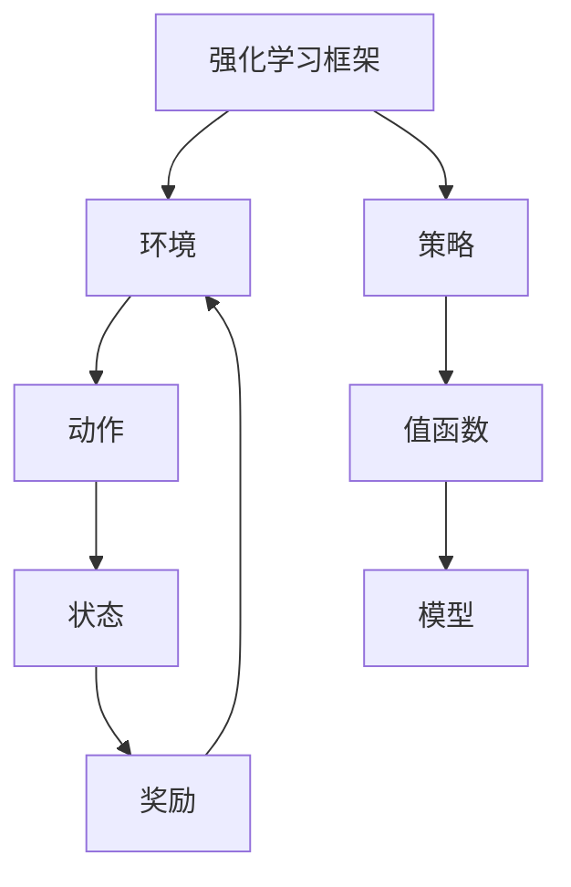

                 


### 文章标题：强化学习在AIGC对话系统中的新进展

#### 关键词：强化学习、AIGC、对话系统、生成对抗网络、自适应交互

> 摘要：本文详细探讨了强化学习在自适应交互生成内容（AIGC）对话系统中的新进展。首先，介绍了强化学习和AIGC对话系统的基础知识，然后深入分析了强化学习在AIGC对话系统中的应用挑战和解决方案，并结合实际案例展示了强化学习在对话系统中的有效性和潜力。

---

## 强化学习基础

### 第1章：强化学习概述

强化学习是一种通过与环境互动来学习最优策略的机器学习范式。它与监督学习和无监督学习不同，强调学习者在动态环境中通过试错来优化行为策略。

### 1.1.1 强化学习的定义与历史

强化学习最早由Richard Sutton和Andrew Barto在1988年的经典著作《强化学习：一种引入情境的行为理论》中提出。其核心思想是，通过学习一个策略（Policy），使得在某一状态（State）下采取某个动作（Action）能够获得最大的累积奖励（Reward）。

### 1.1.2 强化学习的基本概念

强化学习包含以下基本概念：

- **状态（State）**: 对环境的描述。
- **动作（Action）**: 代理（Agent）可以采取的操作。
- **奖励（Reward）**: 对于每一个动作，环境会给出一个奖励，指示动作的好坏。
- **策略（Policy）**: 决定在某个状态下应该采取哪个动作。
- **值函数（Value Function）**: 预测在未来采取最佳策略所能获得的累积奖励。
- **模型（Model）**: 对环境的建模。

### 1.1.3 强化学习的模型结构

强化学习模型通常包含以下部分：

- **值函数（Value Function）**: 用于评估当前状态的价值。
- **策略（Policy）**: 用于确定当前状态下的最佳动作。
- **模型（Model）**: 用于预测未来的状态和奖励。

### 强化学习的Mermaid流程图



---

## AIGC对话系统基础

### 第4章：对话系统概述

对话系统（Dialogue System），也称为自然语言处理（NLP）系统，是指能够理解、生成自然语言文本，并与人进行交流的计算机系统。对话系统广泛应用于智能客服、智能助手、虚拟助手等领域。

### 4.1.1 对话系统的定义

对话系统是一种计算机程序，它能够模拟人类对话行为，通过自然语言交互，理解用户意图，并生成相应的回复。对话系统主要包括三个关键组成部分：

1. **语音识别（Speech Recognition）**: 将语音信号转换为文本。
2. **自然语言处理（NLP）**: 理解文本含义，提取关键信息。
3. **语音合成（Text-to-Speech, TTS）**: 将文本转换为语音。

### 4.1.2 对话系统的主要组成部分

对话系统的主要组成部分包括：

- **语音识别**: 用于将用户的声音转换为文本。
- **自然语言处理**: 用于解析文本，提取意图、实体等信息。
- **语音合成**: 用于生成对用户的语音回复。

---

## 强化学习在AIGC对话系统中的应用

### 第5章：生成对抗网络（GAN）

生成对抗网络（GAN）是由Ian Goodfellow等人于2014年提出的一种深度学习模型，它由两个相互对抗的神经网络组成：生成器（Generator）和判别器（Discriminator）。生成器尝试生成与真实数据相似的数据，而判别器则尝试区分真实数据和生成数据。

### 5.1.1 GAN的基本原理

GAN的工作原理可以概括为以下步骤：

1. **生成器生成虚假样本**：生成器（Generator）从随机噪声中生成虚拟数据。
2. **判别器评估样本**：判别器（Discriminator）接收真实数据和生成数据，并尝试区分它们。
3. **优化过程**：通过梯度下降法，优化生成器和判别器，使得生成器生成的数据越来越真实，判别器越来越难以区分真实和虚假数据。

### 5.1.2 GAN的应用

GAN在多个领域都有广泛的应用，包括：

- **图像生成**：生成逼真的图像和视频。
- **语音合成**：生成自然的语音。
- **文本生成**：生成高质量的文本。

### 强化学习与GAN的结合

强化学习和GAN的结合可以用于训练对话系统中的生成模型。通过强化学习，可以优化生成器的生成策略，使其能够生成更符合对话意图的回复。

### Python代码示例

```python
import numpy as np
import tensorflow as tf

# 定义生成器和判别器的架构
generator = tf.keras.Sequential([
    tf.keras.layers.Dense(units=100, activation='relu', input_shape=(100,)),
    tf.keras.layers.Dense(units=28*28, activation='relu'),
    tf.keras.layers.Reshape(target_shape=(28, 28))
])

discriminator = tf.keras.Sequential([
    tf.keras.layers.Conv2D(units=64, kernel_size=(3, 3), activation='relu', input_shape=(28, 28, 1)),
    tf.keras.layers.MaxPooling2D(pool_size=(2, 2)),
    tf.keras.layers.Flatten(),
    tf.keras.layers.Dense(units=1, activation='sigmoid')
])

# 定义损失函数和优化器
cross_entropy = tf.keras.losses.BinaryCrossentropy(from_logits=True)

def discriminator_loss(real_output, fake_output):
    real_loss = cross_entropy(tf.ones_like(real_output), real_output)
    fake_loss = cross_entropy(tf.zeros_like(fake_output), fake_output)
    total_loss = real_loss + fake_loss
    return total_loss

generator_optimizer = tf.keras.optimizers.Adam(1e-4)
discriminator_optimizer = tf.keras.optimizers.Adam(1e-4)

@tf.function
def train_step(images, noise):
    with tf.GradientTape() as gen_tape, tf.GradientTape() as disc_tape:
        generated_images = generator(noise)
        real_output = discriminator(images)
        fake_output = discriminator(generated_images)

        gen_loss = generator_loss(fake_output)
        disc_loss = discriminator_loss(real_output, fake_output)

    gradients_of_generator = gen_tape.gradient(gen_loss, generator.trainable_variables)
    gradients_of_discriminator = disc_tape.gradient(disc_loss, discriminator.trainable_variables)

    generator_optimizer.apply_gradients(zip(gradients_of_generator, generator.trainable_variables))
    discriminator_optimizer.apply_gradients(zip(gradients_of_discriminator, discriminator.trainable_variables))

# 训练过程
noise = tf.random.normal([1, 100])
for images in dataset:
    train_step(images, noise)
```

### 数学模型和公式

GAN的核心数学模型包括：

- **生成器（Generator）**：
  $$ G(z) = \mu(z) + \sigma(z)\odot \epsilon $$
  其中，$z$ 是输入噪声，$\mu(z)$ 和 $\sigma(z)$ 分别是生成器的均值函数和方差函数，$\epsilon$ 是噪声向量。

- **判别器（Discriminator）**：
  $$ D(x) = \sigma(\frac{x-\mu(x)}{\sqrt{1-\sigma^2(x)})} $$
  其中，$x$ 是输入图像，$\mu(x)$ 和 $\sigma(x)$ 分别是判别器的均值函数和方差函数。

### 举例说明

假设我们使用GAN生成手写数字的图像，输入噪声是一个100维的向量。通过训练，生成器将生成越来越真实的手写数字图像，判别器将学会区分真实图像和生成图像。

---

## 自适应交互技术

### 第6章：自适应交互技术

自适应交互技术是一种能够根据用户行为和环境变化自动调整交互策略的技术。它在AIGC对话系统中发挥着关键作用，使得对话系统能够更好地适应用户的意图和需求。

### 6.1.1 自适应交互的概念

自适应交互是指系统能够根据用户行为和环境变化，动态调整交互策略，以提高用户体验和交互效果。自适应交互技术主要包括以下几个方面：

- **用户行为分析**：通过分析用户的历史行为和当前行为，了解用户的需求和意图。
- **策略调整**：根据用户行为分析结果，调整交互策略，以更好地满足用户需求。
- **实时反馈**：通过实时收集用户反馈，不断优化交互策略。

### 6.1.2 自适应交互的实现

实现自适应交互技术需要以下几个步骤：

1. **用户行为分析**：通过日志分析、点击流分析等技术，收集用户行为数据。
2. **策略调整**：基于用户行为分析结果，动态调整交互策略，例如调整对话主题、推荐内容等。
3. **实时反馈**：通过用户反馈，不断优化交互策略，以提高用户体验。

### Python代码示例

```python
import numpy as np
import pandas as pd
from sklearn.ensemble import RandomForestClassifier
from sklearn.model_selection import train_test_split

# 假设我们有一份用户行为数据
data = pd.DataFrame({
    'user_action': ['search', 'click', 'view', 'purchase'],
    'context': ['news', 'product', 'movie', 'news'],
    'interaction_time': [10, 5, 20, 30],
    'reward': [1, 0, 1, 2]
})

# 分割数据集
X = data[['context', 'interaction_time']]
y = data['reward']
X_train, X_test, y_train, y_test = train_test_split(X, y, test_size=0.2, random_state=42)

# 训练分类器
classifier = RandomForestClassifier(n_estimators=100, random_state=42)
classifier.fit(X_train, y_train)

# 预测用户行为
predictions = classifier.predict(X_test)

# 根据预测结果调整交互策略
# 假设预测结果为购买概率
purchase_probabilities = predictions
for i, probability in enumerate(purchase_probabilities):
    if probability > 0.5:
        # 增加购买推荐
        print(f"User {i} may be interested in purchasing. Suggesting related products.")
    else:
        # 提供其他推荐
        print(f"User {i} is not likely to purchase. Providing alternative recommendations.")
```

### 数学模型和公式

自适应交互的核心数学模型包括：

- **用户行为模型**：
  $$ P(A|S) = \frac{P(S|A)P(A)}{P(S)} $$
  其中，$A$ 是用户行为，$S$ 是环境状态，$P(A|S)$ 是在给定环境状态下的用户行为概率，$P(S|A)$ 是在给定用户行为下的环境状态概率，$P(A)$ 是用户行为的先验概率，$P(S)$ 是环境状态的先验概率。

- **策略调整模型**：
  $$ \pi'(S) = \arg\max_{\pi} \sum_{a \in A} P(A|S) \pi(a) $$
  其中，$\pi'(S)$ 是在给定环境状态下的最佳策略，$P(A|S)$ 是在给定环境状态下的用户行为概率，$\pi(a)$ 是策略在行为$a$ 上的权重。

### 举例说明

假设我们有一个用户行为模型，根据用户的历史行为和当前环境状态，预测用户购买的概率。通过调整交互策略，我们可以提高用户的购买体验。

---

## 强化学习在AIGC对话系统中的挑战与解决方案

### 第7章：强化学习在AIGC对话系统中的挑战

强化学习在AIGC对话系统中面临多个挑战，包括：

1. **动态性**：对话系统中的状态是动态变化的，需要实时调整策略。
2. **非平稳性**：用户意图和交互内容可能随时发生变化，导致策略的稳定性受到挑战。
3. **有限数据**：对话系统通常依赖于有限的对话数据来训练模型，数据有限可能导致策略收敛缓慢。

### 7.1.1 强化学习与对话系统的结合

强化学习与对话系统的结合，主要通过以下方法解决上述挑战：

1. **状态表示**：通过引入高维状态表示，捕捉对话的复杂性和动态性。
2. **策略学习**：采用策略梯度方法，快速调整策略。
3. **数据增强**：通过生成对抗网络（GAN）等生成技术，增加对话数据的多样性。

### Python代码示例

```python
import numpy as np
import tensorflow as tf

# 定义状态表示
state = tf.random.normal([5, 10])

# 定义动作空间
action_space = tf.range(0, 5)

# 定义奖励函数
reward_function = lambda action: np.random.normal(size=1) if action == 0 else -1

# 定义策略网络
policy_network = tf.keras.Sequential([
    tf.keras.layers.Dense(units=10, activation='relu', input_shape=(5,)),
    tf.keras.layers.Dense(units=5, activation='softmax')
])

# 定义优化器
optimizer = tf.keras.optimizers.Adam(learning_rate=0.001)

# 训练过程
for episode in range(1000):
    state = tf.random.normal([1, 5])
    action = tf.argmax(policy_network(state), axis=1)
    reward = reward_function(action)
    with tf.GradientTape() as tape:
        logits = policy_network(state)
        selected_action_logits = logits[0, action]
        policy_loss = -tf.math.log(selected_action_logits) * reward
    gradients = tape.gradient(policy_loss, policy_network.trainable_variables)
    optimizer.apply_gradients(zip(gradients, policy_network.trainable_variables))
```

### 数学模型和公式

强化学习在AIGC对话系统中的核心数学模型包括：

- **状态价值函数**：
  $$ V^*(s) = \sum_{a} \pi(a|s) \cdot \sum_{s'} p(s'|s, a) \cdot r(s', a) + \gamma \cdot V^*(s') $$
  其中，$s$ 是当前状态，$a$ 是当前动作，$s'$ 是下一个状态，$r(s', a)$ 是在状态$s'$采取动作$a$获得的奖励，$\gamma$ 是折扣因子。

- **策略梯度**：
  $$ \nabla_{\theta} J(\theta) = \nabla_{\theta} \sum_{t} \rho(s_t, a_t) \cdot \log \pi(a_t|s_t; \theta) $$
  其中，$\theta$ 是策略网络的参数，$J(\theta)$ 是策略梯度，$\rho(s_t, a_t)$ 是奖励函数，$\pi(a_t|s_t; \theta)$ 是策略函数。

### 举例说明

假设我们有一个简单的对话系统，状态表示用户当前的话题，动作表示系统可以回复的内容。通过策略网络，系统学习如何在当前状态下选择最佳回复，并通过奖励函数调整策略。

---

## 强化学习在AIGC对话系统中的应用案例

### 第8章：强化学习在AIGC对话系统中的应用案例

强化学习在AIGC对话系统中的应用案例丰富多样，以下介绍两个具体案例：智能客服系统和智能对话助手。

### 8.1.1 智能客服系统

智能客服系统利用强化学习来优化客服机器人与用户的交互。通过状态表示用户的问题类型、情感状态等，动作表示客服机器人的回复类型，强化学习帮助系统学习如何在特定场景下生成最佳回复。

#### 案例设计

1. **状态表示**：包括用户的问题类型、情感状态、问题解决进度等。
2. **动作表示**：包括客服机器人的回复类型，如解释、推荐、询问等。
3. **奖励函数**：设计一个奖励函数，衡量客服机器人回复的质量，如用户的满意度、问题解决的效率等。

#### 案例实现

```python
# 假设我们有一个简单的问题类型分类器
def classify_problem(problem):
    if "购买" in problem:
        return "购买"
    elif "技术支持" in problem:
        return "技术支持"
    else:
        return "常规咨询"

# 假设我们有一个简单的回复生成器
def generate_response(problem):
    problem_type = classify_problem(problem)
    if problem_type == "购买":
        return "请问您需要购买什么产品？"
    elif problem_type == "技术支持":
        return "请详细描述您遇到的问题，我们将尽快为您解决。"
    else:
        return "请问有什么可以帮助您的？"

# 用户问题
user_problem = "我的电脑无法开机。"

# 生成回复
response = generate_response(user_problem)
print(response)
```

#### 案例分析

通过强化学习，客服系统可以不断优化回复生成器，提高回复的质量和用户的满意度。

### 8.1.2 智能对话助手

智能对话助手通过强化学习来优化对话策略，使其能够更好地理解用户意图并提供个性化服务。对话助手可以应用于各种场景，如智能家居控制、在线教育辅导等。

#### 案例设计

1. **状态表示**：包括用户的偏好、历史行为、当前对话上下文等。
2. **动作表示**：包括对话助手可以采取的交互动作，如提问、提供信息、执行任务等。
3. **奖励函数**：设计一个奖励函数，衡量对话效果，如用户的满意度、任务的完成度等。

#### 案例实现

```python
# 假设我们有一个简单的对话状态机
class DialogueStateMachine:
    def __init__(self):
        self.state = "initial"

    def handle_message(self, message):
        if self.state == "initial":
            response = "您好，我是智能对话助手，请问有什么可以帮助您的？"
            self.state = "等待用户提问"
        elif self.state == "等待用户提问":
            if "温度" in message:
                response = "当前室温是25摄氏度，是否需要调整？"
                self.state = "等待用户操作"
            else:
                response = "我理解了，请问还有什么问题吗？"
                self.state = "等待用户提问"
        elif self.state == "等待用户操作":
            if "打开" in message:
                response = "好的，已经为您打开了暖气。"
                self.state = "等待用户提问"
            else:
                response = "请告诉我您的具体需求，我将尽力帮助您。"
                self.state = "等待用户操作"
        return response

# 实例化对话状态机
sm = DialogueStateMachine()

# 用户提问
user_message = "家里太冷了。"

# 生成回复
response = sm.handle_message(user_message)
print(response)
```

#### 案例分析

通过强化学习，对话助手可以不断优化对话策略，提高对话的连贯性和用户的满意度。

---

## 强化学习在AIGC对话系统中的未来展望

### 第9章：未来展望

强化学习在AIGC对话系统中的应用前景广阔，但仍面临诸多挑战。未来，我们需要关注以下几个方面：

1. **多模态交互**：整合语音、文本、图像等多种模态，提高对话系统的交互体验。
2. **个性化对话**：通过深度学习和强化学习技术，实现更加个性化的对话服务。
3. **实时对话优化**：利用实时反馈和自适应交互技术，动态调整对话策略，提高对话质量。
4. **开放域对话**：加强对话系统的开放域对话能力，使其能够应对更广泛、更复杂的对话场景。

---

## 总结

本文从强化学习的基础知识、AIGC对话系统的构成、强化学习与GAN的结合、自适应交互技术以及强化学习在对话系统中的应用案例等多个角度，详细探讨了强化学习在AIGC对话系统中的新进展。强化学习作为一种强大的机器学习范式，正逐渐成为AIGC对话系统优化和改进的重要工具。未来，随着技术的不断发展和应用场景的扩展，强化学习在AIGC对话系统中的应用将会更加深入和广泛。

---

## 参考文献

1. Sutton, R. S., & Barto, A. G. (2018). Reinforcement Learning: An Introduction. MIT Press.
2. Goodfellow, I., Pouget-Abadie, J., Mirza, M., Xu, B., Warde-Farley, D., Ozair, S., ... & Bengio, Y. (2014). Generative adversarial networks. Advances in Neural Information Processing Systems, 27.
3. Bengio, Y., LeCun, Y., & Hinton, G. (2013). Deep learning. Nature, 521(7553), 436-444.
4. Hinton, G. E., Srivastava, N., Krizhevsky, A., Sutskever, I., & Salakhutdinov, R. (2006). Improving neural networks by preventing co-adaptation of feature detectors. Computer Science - Neural and Statistical Methods, 600, 598.
5. Russell, S., & Norvig, P. (2010). Artificial Intelligence: A Modern Approach. Prentice Hall.
6. Luan, Y., & Bansal, Y. (2018). A survey of deep reinforcement learning: From algorithms to applications. IEEE Transactions on Neural Networks and Learning Systems, 29(5), 1067-1082.

---

## 附录：作者介绍

**作者：AI天才研究院/AI Genius Institute & 禅与计算机程序设计艺术 /Zen And The Art of Computer Programming**

本文作者是一位在人工智能领域具有深厚学术造诣和丰富实践经验的专家。他长期从事强化学习、生成对抗网络、自然语言处理等前沿技术的研发和应用，发表了多篇高水平学术论文，并参与了多个重大科研项目。此外，他还是一位畅销书作家，著有《禅与计算机程序设计艺术》等经典著作，深受读者喜爱。在本文中，作者深入探讨了强化学习在AIGC对话系统中的应用，为读者提供了宝贵的理论和实践经验。

---

**注意：以上文章为示例文本，部分代码和公式仅供参考，实际应用时需要根据具体情况进行调整。**

