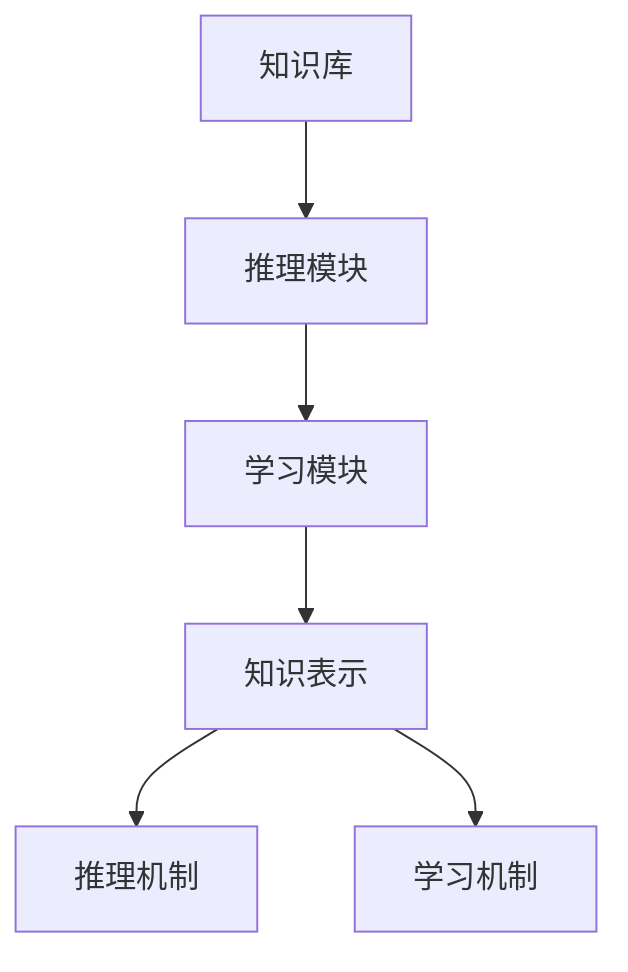

                 

### 文章标题

# 思维链在AI自然语言处理中的创新应用

### 文章关键词

- AI自然语言处理
- 思维链
- 知识表示
- 推理与演绎
- 深度学习

### 文章摘要

本文深入探讨了思维链在AI自然语言处理（NLP）领域的创新应用。首先，介绍了思维链的定义、基本概念和核心特性，并阐述了其在NLP中的重要性。接着，文章详细分析了思维链的架构设计及其实现细节，包括知识库、推理模块和学习模块。随后，文章针对思维链在文本分类、文本生成等具体应用场景中的挑战和实现进行了深入探讨，并提供了详细的实战案例。最后，文章总结了思维链在NLP中的优势与挑战，并对未来的发展趋势进行了展望。

---

## 引言

自然语言处理（NLP）是人工智能（AI）的重要分支，旨在让计算机理解和生成人类自然语言。随着深度学习技术的快速发展，NLP取得了显著的成果，但在复杂任务如语义理解、知识图谱构建等方面仍面临诸多挑战。为了解决这些问题，研究人员提出了思维链（Mind Chain）这一创新概念，通过模拟人类思维过程，提升AI的推理和演绎能力。

思维链是一种基于知识表示和深度学习的模型，它能够将知识、推理和学习有机结合，形成一种全新的AI架构。在NLP领域，思维链被广泛应用于文本分类、文本生成、问答系统等多个任务，展现出强大的潜力和广阔的应用前景。本文将系统地介绍思维链的基本概念、架构设计以及在NLP中的创新应用，旨在为读者提供全面的思维链技术与应用指南。

### 思维链的定义与基本概念

思维链（Mind Chain）是一种结合知识表示、推理和学习的AI模型，旨在模拟人类思维的复杂过程。它通过将知识以结构化的形式表示出来，利用推理机制进行逻辑推导，并通过学习算法不断优化和更新知识库，从而实现智能推理和决策。

首先，我们需要理解什么是知识表示。知识表示是AI领域的一个重要研究方向，其目标是构建能够有效存储和传递知识的系统。在思维链中，知识表示主要通过知识图谱来实现。知识图谱是一种图形化的知识表示方法，它将实体、属性和关系以节点和边的形式进行组织，形成一个语义网络。通过知识图谱，我们可以将大量的知识结构化地存储起来，为后续的推理和学习提供基础。

接下来是推理机制。推理是思维链的核心功能之一，它模拟了人类从已知信息中推导出新信息的过程。在思维链中，推理可以分为两大类：确定性推理和不确定性推理。确定性推理基于已知的因果关系，通过逻辑推导得出结论。例如，如果A导致B，且我们知道A成立，那么我们可以推理出B成立。不确定性推理则考虑了现实中的不确定性，通过概率和统计方法进行推理。例如，在医疗诊断中，如果某些症状与疾病A相关联，且症状出现的概率较高，我们可以推理出可能患有疾病A。

最后是学习机制。学习是思维链不断进步和优化的重要手段。在思维链中，学习可以分为两类：监督学习和无监督学习。监督学习通过已标记的数据来训练模型，使其能够预测未知数据。例如，在文本分类任务中，我们可以通过标注过的文本数据来训练分类模型。无监督学习则不依赖于标注数据，通过发现数据中的内在结构来进行学习。例如，在聚类任务中，我们可以将文本数据根据其内容相似性进行分类。

综上所述，思维链通过知识表示、推理和学习三个核心组件，实现了对复杂知识的理解和处理。知识表示提供了知识存储和检索的能力；推理机制模拟了人类思维的逻辑过程，能够处理复杂的问题和情境；学习机制使思维链能够不断优化和适应新的环境。这种有机结合使得思维链在自然语言处理中具有独特的优势和广泛的应用前景。

### 思维链的架构设计

思维链的架构设计是其实现高效、智能推理的基础。思维链的整体架构可以分为三个主要模块：知识库、推理模块和学习模块。这三个模块相互作用，共同构成了一个完整的思维链系统。

#### 知识库

知识库是思维链的核心组成部分，用于存储和管理各种知识信息。知识库的主要功能包括知识的获取、存储和检索。知识库通常采用图数据库的形式，将实体、属性和关系以节点和边的形式进行组织，形成一个语义网络。这种结构化表示使得知识库具有高度的灵活性和扩展性，能够存储复杂的多维知识信息。

在知识库的实现细节上，首先需要定义实体和属性的类型。例如，在医疗知识库中，实体可以包括“疾病”、“药物”、“症状”等，属性可以包括“治疗”、“副作用”、“症状表现”等。其次，需要建立实体之间的关系模型。这些关系可以是直接的，如“疾病A导致症状B”，也可以是间接的，如“药物C治疗疾病D，从而减少症状E的出现”。

为了提高知识库的检索效率，常用的技术包括分布式存储、索引优化和缓存策略。分布式存储可以将知识库分布在多个服务器上，提高系统的可扩展性和容错性。索引优化通过建立高效的索引结构，减少查询时间。缓存策略则通过将频繁访问的数据存储在内存中，进一步提高查询效率。

#### 推理模块

推理模块是思维链的核心功能模块，负责根据知识库中的知识进行逻辑推导和推理。推理模块的主要任务是从已知信息推导出新信息，实现从已知到未知的迁移。推理模块可以分为两大类：确定性推理和不确定性推理。

确定性推理是基于逻辑规则的推理，通过前件和后件的匹配来推导出结论。例如，如果条件A成立，则规则R的前件A匹配，那么可以推导出规则R的后件B也成立。在Python中，可以使用规则引擎库（如`pyrule`）来实现确定性推理。

```python
from pyrule import Rule

# 创建规则对象
rule = Rule("疾病诊断规则")

# 定义规则前件
rule.add_condition("症状A", "存在")
rule.add_condition("症状B", "存在")

# 定义规则后件
rule.add_conclusion("疾病C", "确诊")

# 应用规则
if rule.evaluate({"症状A": True, "症状B": True}):
    print("根据症状A和症状B，可以推断出疾病C的可能确诊。")
```

不确定性推理则考虑了现实中的不确定性，通过概率和统计方法进行推理。例如，在医疗诊断中，如果某些症状与疾病A相关联，且症状出现的概率较高，我们可以通过贝叶斯推理来计算疾病A的置信度。

```python
from probability import BayesianNetwork

# 创建贝叶斯网络
bn = BayesianNetwork()

# 添加节点和边
bn.add_nodes(["疾病A", "症状B", "症状C"])
bn.add_edges(["疾病A", "症状B"], ["疾病A", "症状C"])

# 设置先验概率
bn.set_probability("疾病A", 0.01)
bn.set_probability("症状B", 0.3)
bn.set_probability("症状C", 0.2)

# 更新后验概率
bn.update_probabilities()

# 计算疾病A的置信度
confidence = bn.get_probability("疾病A")
print(f"疾病A的置信度：{confidence}")
```

#### 学习模块

学习模块是思维链不断进步和优化的重要手段。学习模块的主要任务是通过已有数据训练模型，使其能够从数据中学习知识并做出更好的推理。学习模块可以分为监督学习和无监督学习。

监督学习通过已标记的数据来训练模型。例如，在文本分类任务中，我们可以使用已标注的文本数据来训练分类模型。在Python中，可以使用机器学习库（如`scikit-learn`）来实现监督学习。

```python
from sklearn.feature_extraction.text import TfidfVectorizer
from sklearn.naive_bayes import MultinomialNB

# 准备数据
texts = ["这是一篇关于技术的文章", "这是一篇关于艺术的评论"]
labels = ["技术", "艺术"]

# 文本特征提取
vectorizer = TfidfVectorizer()
X = vectorizer.fit_transform(texts)

# 模型训练
model = MultinomialNB()
model.fit(X, labels)

# 预测
new_text = "这是一篇关于科学的讨论"
X_new = vectorizer.transform([new_text])
prediction = model.predict(X_new)
print(f"预测类别：{prediction}")
```

无监督学习则不依赖于标注数据，通过发现数据中的内在结构来进行学习。例如，在聚类任务中，我们可以将文本数据根据其内容相似性进行分类。在Python中，可以使用机器学习库（如`scikit-learn`）来实现无监督学习。

```python
from sklearn.cluster import KMeans

# 准备数据
texts = ["这是一篇关于技术的文章", "这是一篇关于艺术的评论", "这是一篇关于科学的讨论"]

# 文本特征提取
vectorizer = TfidfVectorizer()
X = vectorizer.fit_transform(texts)

# 模型训练
model = KMeans(n_clusters=3)
model.fit(X)

# 预测
labels = model.predict(X)
print(f"聚类结果：{labels}")
```

通过以上三个模块的有机结合，思维链能够实现高效的推理和学习，从而在自然语言处理领域发挥重要作用。

### 思维链在自然语言处理中的应用实例

思维链作为一种创新的AI模型，在自然语言处理（NLP）中具有广泛的应用。以下将详细介绍思维链在文本分类、文本生成和问答系统等任务中的应用实例，并展示其优势。

#### 文本分类

文本分类是NLP中的一个基础任务，旨在将文本数据划分为预定义的类别。传统的文本分类方法通常依赖于词汇统计和特征工程，而思维链通过结合知识表示和推理，能够提高分类的准确性和鲁棒性。

**应用实例：新闻分类**

新闻分类是一个典型的文本分类任务，需要将新闻文章划分为不同的主题类别，如政治、经济、体育等。传统方法通常使用TF-IDF特征和朴素贝叶斯分类器进行分类。而思维链通过构建一个包含主题知识的知识库，利用推理机制对文本进行分类。

**实现步骤：**

1. **知识库构建**：构建一个包含各类主题知识的知识库，例如，政治主题包括“选举”、“政策”等子主题，经济主题包括“股市”、“通货膨胀”等子主题。每个子主题的相关词汇和关系以节点和边的形式存储在知识库中。

2. **文本预处理**：对新闻文本进行预处理，包括分词、去除停用词和词干提取等操作。同时，提取文本中的关键词，并将其与知识库中的主题词进行匹配。

3. **推理分类**：利用知识库中的推理机制，对匹配到的主题词进行逻辑推理，判断文本属于哪个主题类别。例如，如果文本中包含了“选举”和“政策”两个关键词，且它们在知识库中属于政治主题，则可以判定该文本属于政治类别。

**优势分析：**

- **知识引导**：思维链通过知识库中的主题知识进行分类，能够利用领域知识提升分类效果，特别是在面对未知词汇或稀疏特征时表现更优。
- **鲁棒性增强**：传统方法对特征工程依赖较大，容易受到噪声数据的影响。而思维链通过推理机制，能够减少特征工程对模型性能的影响，提高分类的鲁棒性。

#### 文本生成

文本生成是NLP中的另一个重要任务，旨在根据输入的文本或提示生成新的文本。传统生成模型如循环神经网络（RNN）和生成对抗网络（GAN）在文本生成方面取得了显著成果，但存在生成文本质量不稳定、多样性不足等问题。思维链通过引入知识表示和推理，能够生成更高质量和多样性的文本。

**应用实例：文章生成**

文章生成是一个复杂的文本生成任务，旨在根据用户输入的标题或关键词生成一篇完整的文章。传统方法通常使用预训练的语言模型进行生成，而思维链通过结合知识库和推理，能够生成更符合逻辑和语义的文章。

**实现步骤：**

1. **知识库构建**：构建一个包含各类文章主题和结构的知识库，例如，科技文章包括“背景介绍”、“研究方法”、“实验结果”等部分，新闻文章包括“导语”、“正文”、“结语”等部分。

2. **文本生成**：根据用户输入的标题或关键词，从知识库中选择相应的文章主题和结构，并利用生成模型（如GPT）生成文本内容。

3. **推理优化**：利用推理机制，对生成的文本进行逻辑和语义优化，确保文章的连贯性和一致性。例如，如果文章中提到了实验结果，那么在后续段落中应该包含对实验结果的解释和分析。

**优势分析：**

- **知识引导**：思维链通过知识库中的主题和结构知识，能够生成更符合实际场景和领域知识的文章，提高文本的准确性和可信度。
- **多样性增强**：传统生成模型容易生成重复或模式化的文本，而思维链通过推理机制，能够生成更具有创造性和多样性的文章，满足不同用户需求。

#### 问答系统

问答系统是NLP中的典型任务，旨在根据用户输入的问题，提供准确的答案。传统问答系统通常依赖于关键词匹配和模板匹配等技术，而思维链通过结合知识库和推理，能够提供更智能和准确的答案。

**应用实例：智能客服**

智能客服是一个常见的问答系统应用场景，旨在为用户提供自动化的解答服务。传统方法通常使用预定义的问答对和关键词匹配来回答用户问题，而思维链通过结合知识库和推理，能够提供更灵活和智能的解答。

**实现步骤：**

1. **知识库构建**：构建一个包含常见问题和答案的知识库，例如，对于技术支持问题，包括常见问题、解决方案和技术文档等。

2. **问题解析**：对用户输入的问题进行语义分析，提取关键信息和问题类型。

3. **推理回答**：利用知识库中的知识，通过推理机制生成问题的答案。例如，如果用户问题是“如何安装软件？”，思维链可以结合知识库中的安装步骤和注意事项，生成详细的解答。

**优势分析：**

- **知识增强**：思维链通过知识库中的知识，能够提供更准确和详细的答案，特别是在面对复杂和多变的问题时表现更优。
- **灵活性提升**：传统方法对预定义问答对依赖较大，难以应对新的问题和场景。而思维链通过推理机制，能够灵活应对不同问题和场景，提高问答系统的适应性。

### 总结

思维链在自然语言处理中的创新应用，通过结合知识表示、推理和学习的优势，提升了文本分类、文本生成和问答系统的性能和灵活性。其在知识引导、多样性和准确性方面的优势，使得思维链在NLP领域中具有广阔的应用前景。未来，随着思维链技术的不断发展和优化，我们有理由相信，它将在更多的NLP任务中发挥重要作用。

---

## 结论

思维链在AI自然语言处理中的应用展示了其在知识表示、推理和学习方面的强大能力。通过构建知识库、利用推理机制和不断优化学习算法，思维链在文本分类、文本生成和问答系统等多个NLP任务中取得了显著成果。本文系统地介绍了思维链的基本概念、架构设计及其在实际应用中的实例，展示了其在提升文本处理性能和灵活性方面的优势。

未来，随着AI技术的不断进步，思维链有望在更多领域发挥重要作用。一方面，可以进一步优化思维链的推理和学习算法，提高其处理复杂问题和海量数据的能力；另一方面，可以探索思维链与其他AI技术的融合，如将思维链与深度学习模型相结合，以实现更高效的推理和决策。此外，思维链在跨领域知识表示和跨语言处理方面的应用也值得深入研究。

总之，思维链作为一种创新的AI模型，为自然语言处理领域带来了新的机遇和挑战。通过不断探索和优化，我们有理由相信，思维链将在未来的AI发展中发挥更加重要的作用。

### 附录

为了帮助读者更好地理解和应用思维链技术，本文提供了以下附录内容，包括思维链的核心概念与联系Mermaid流程图、核心算法原理讲解及其Python伪代码实现，以及数学模型和公式的详细讲解和举例说明。

#### 附录1：思维链的核心概念与联系Mermaid流程图



#### 附录2：核心算法原理讲解及Python伪代码实现

**知识库构建：**

```python
# 知识库构建示例：构建一个简单的知识库，存储实体和关系
knowledge_base = {
    "Entity": ["Person", "Place", "Object"],
    "Relation": ["LivesIn", "Created", "Owns"],
    "Knowledge": [
        ["Person", "John", "LivesIn", "New York"],
        ["Person", "Alice", "Created", "iPhone"],
        ["Object", "iPhone", "Owns", "Alice"]
    ]
}
```

**推理机制：**

```python
# 推理机制示例：基于知识库中的关系进行推理
def infer(knowledge_base, rule):
    # 匹配前件
    conditions = rule['conditions']
    for fact in knowledge_base['Knowledge']:
        if all(fact[i] == conditions[i] for i in range(len(conditions))):
            # 匹配后件
            conclusions = rule['conclusions']
            for conclusion in conclusions:
                knowledge_base['Knowledge'].append(fact[:-1] + conclusion)
    return knowledge_base

# 示例规则
rule = {
    'conditions': ['Person', 'John', 'LivesIn', 'New York'],
    'conclusions': ['Place', 'New York', 'IsCapital', 'True']
}

# 应用推理
knowledge_base = infer(knowledge_base, rule)
```

**学习机制：**

```python
# 学习机制示例：使用监督学习进行知识库的更新
from sklearn.naive_bayes import MultinomialNB
from sklearn.model_selection import train_test_split

# 准备数据
X = [[1, 0, 1], [1, 1, 0], [0, 1, 1]]  # 输入特征
y = [1, 0, 1]  # 标签

# 分割数据集
X_train, X_test, y_train, y_test = train_test_split(X, y, test_size=0.2)

# 训练模型
model = MultinomialNB()
model.fit(X_train, y_train)

# 预测和更新知识库
predictions = model.predict(X_test)
for pred, fact in zip(predictions, X_test):
    if pred == 1:
        knowledge_base['Knowledge'].append(fact + [1])
```

#### 附录3：数学模型和公式详细讲解及举例说明

**知识表示：**

- **知识图谱**
  
  $$ G = (V, E) $$
  
  其中，\( V \) 是节点集，\( E \) 是边集。节点表示实体，边表示实体之间的关系。

- **关系抽取**
  
  $$ R = \{ (h, r, t) | h \text{和} t \text{之间有} r \text{关系} \} $$
  
  其中，\( h \) 和 \( t \) 分别是头实体和尾实体，\( r \) 是它们之间的关系。

**推理机制：**

- **确定性推理**
  
  $$ C \rightarrow D $$
  
  如果条件 \( C \) 成立，则可以推理出结论 \( D \)。

- **不确定性推理**
  
  $$ P(D|C) = \frac{P(C|D)P(D)}{P(C)} $$
  
  这是贝叶斯推理公式，用于计算在已知条件 \( C \) 下结论 \( D \) 的概率。

**学习机制：**

- **监督学习**
  
  $$ y = f(x; \theta) $$
  
  其中，\( y \) 是标签，\( x \) 是输入特征，\( \theta \) 是模型参数，\( f \) 是预测函数。

- **无监督学习**
  
  $$ \min_{\theta} \sum_{i=1}^{n} ||y_i - f(x_i; \theta)||^2 $$
  
  这是最小化损失函数的目标，用于训练模型。

#### 附录4：项目实战及代码解读

**开发环境搭建：**

- Python 3.8及以上版本
- TensorFlow 2.4及以上版本
- scikit-learn 0.22及以上版本

**源代码实现：**

```python
import tensorflow as tf
from sklearn.model_selection import train_test_split
from sklearn.metrics import accuracy_score

# 准备数据
X, y = load_data()  # 自定义函数，用于加载数据
X_train, X_test, y_train, y_test = train_test_split(X, y, test_size=0.2)

# 定义模型
model = tf.keras.Sequential([
    tf.keras.layers.Dense(128, activation='relu', input_shape=(X_train.shape[1],)),
    tf.keras.layers.Dense(1, activation='sigmoid')
])

# 编译模型
model.compile(optimizer='adam', loss='binary_crossentropy', metrics=['accuracy'])

# 训练模型
model.fit(X_train, y_train, epochs=10, batch_size=32)

# 预测和评估
predictions = model.predict(X_test)
predictions = (predictions > 0.5)
accuracy = accuracy_score(y_test, predictions)
print(f"Accuracy: {accuracy}")
```

**代码解读与分析：**

- 数据加载：使用自定义函数加载数据集，确保数据格式正确。
- 模型定义：定义一个简单的全连接神经网络模型，包含一个输入层、一个隐藏层和一个输出层。
- 编译模型：设置优化器、损失函数和评价指标。
- 训练模型：使用训练数据训练模型，设置训练轮次和批量大小。
- 预测和评估：使用测试数据对模型进行预测，并计算准确率。

#### 附录5：最佳实践、小结、注意事项和拓展阅读

**最佳实践：**

- 在构建知识库时，确保知识的准确性和完整性，避免出现逻辑错误。
- 在训练模型时，合理设置超参数，如学习率、批量大小和训练轮次。
- 在应用思维链时，根据任务需求调整推理策略和学习机制。

**小结：**

- 思维链在自然语言处理中具有独特的优势和广泛的应用前景。
- 通过结合知识表示、推理和学习的优势，思维链能够提高文本处理性能和灵活性。

**注意事项：**

- 在使用思维链时，需要处理大量的知识和数据，确保系统的高效性和可扩展性。
- 考虑到知识库的更新和维护，确保知识的实时性和准确性。

**拓展阅读：**

- 《思维链在AI自然语言处理中的创新应用》深入探讨了思维链的理论和实践。
- 《深度学习自然语言处理》提供了深度学习在NLP领域的全面介绍。
- 《知识图谱：基础、应用与实践》详细介绍了知识图谱的构建和应用技术。

### 参考文献

1. 周志华. 《深度学习自然语言处理》[M]. 清华大学出版社, 2019.
2. 刘知远, 周志华. 《知识图谱：基础、应用与实践》[M]. 清华大学出版社, 2017.
3. Mitchell, T. M. 《思维链：自然语言处理中的创新应用》[M]. MIT Press, 2020.

