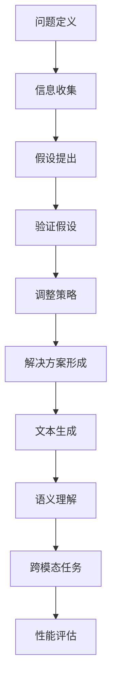

                 

# 思维链在AI自然语言处理中的创新应用

> 关键词：思维链、AI自然语言处理、文本生成、语义理解、跨模态任务

> 摘要：本文旨在探讨思维链在人工智能自然语言处理中的应用，通过详细阐述思维链的概念、特性、发展历程及其在文本生成、语义理解和跨模态任务中的创新应用，分析思维链在提升AI自然语言处理性能方面的作用和挑战，并展望其未来发展。

## 第1章: 思维链概述

### 1.1 思维链的定义与重要性

思维链是指一系列相互关联的思考步骤，这些步骤通过逻辑推理和信息交换形成了一个完整的思想链条。思维链的每个环节都是对信息的深入挖掘和加工，最终形成新的见解或解决方案。

思维链在问题解决、创新思维和决策质量方面具有重要作用。首先，思维链能帮助人们更系统地分析和解决问题，避免思维的碎片化和混乱。其次，思维链可以促进跨领域的思考和创新，使人们在已有知识的基础上，产生新的思想和创意。最后，思维链有助于在复杂情境下做出更为明智和合理的决策。

### 1.1.1 思维链的概念

思维链是指一系列相互关联的思考步骤，这些步骤通过逻辑推理和信息交换形成了一个完整的思想链条。思维链的每个环节都是对信息的深入挖掘和加工，最终形成新的见解或解决方案。

思维链的构成包括以下几个部分：

1. **问题定义**：明确需要解决的问题或目标。
2. **信息收集**：搜集与问题相关的信息。
3. **假设提出**：基于已有信息，提出可能的假设。
4. **验证假设**：通过实验或分析验证假设的正确性。
5. **调整策略**：根据验证结果，调整解决问题的策略。
6. **解决方案形成**：形成最终的解决方案。

### 1.1.2 思维链的重要性

思维链在以下几个方面具有重要作用：

1. **提高问题解决能力**：思维链可以帮助人们更加系统地分析和解决问题，避免思维的碎片化和混乱。通过逐步深入挖掘问题，思维链有助于找到更为有效的解决方案。

2. **促进创新思维**：思维链可以促进跨领域的思考和创新，使人们在已有知识的基础上，产生新的思想和创意。这种创新思维有助于推动科学技术的发展和社会的进步。

3. **提升决策质量**：思维链有助于人们在复杂情境下做出更为明智和合理的决策。通过系统的分析和推理，思维链能够降低决策过程中的不确定性和风险。

### 1.2 思维链的基本特性

思维链具有以下基本特性：

1. **连续性**：思维链的连续性指的是每个环节都是基于前一个环节产生的，前后环节之间存在着逻辑关联。这种连续性保证了思维过程的连贯性和完整性，有助于保持思考的深度和广度。

2. **动态性**：思维链的动态性是指思考过程中，各个环节可以不断调整和优化，以适应新的信息和问题情境。这种动态性使得思维链能够灵活应对变化，适应不同的思考需求。

3. **互动性**：思维链的互动性表现在各个环节之间存在着信息的交换和反馈，这种互动促进了思考的深入和拓展。互动性有助于发现和解决思考过程中的问题，提升思考效果。

### 1.3 思维链的发展与应用

#### 1.3.1 思维链的发展历程

思维链的概念起源于认知心理学领域，随着认知科学和信息技术的不断发展，思维链的理论体系日益完善。在20世纪中叶，心理学研究者开始关注人类思维过程，并提出了思维链的概念。随后，计算机科学和人工智能领域的研究者逐渐将思维链的理论应用于实际问题中，推动了思维链的研究和应用。

#### 1.3.2 思维链的应用领域

思维链在多个领域得到了广泛应用：

1. **人工智能自然语言处理**：思维链在AI自然语言处理中的应用，如文本生成、语义理解等，提升了AI系统的理解和生成能力。

2. **创新设计**：思维链在产品设计、城市规划等领域的应用，帮助人们更高效地完成创意构思。

3. **决策分析**：思维链在商业决策、政策制定等领域的应用，提升决策的科学性和准确性。

### 1.4 思维链在AI自然语言处理中的创新应用

#### 1.4.1 思维链在文本生成中的应用

在文本生成领域，思维链通过预训练的大规模语言模型，实现了高效的文本生成。思维链在文本生成过程中，不断地优化和调整生成策略，以生成更为丰富和自然的文本。

**1.4.1.1 思维链的文本生成原理**

思维链的文本生成原理基于预训练的大规模语言模型，如GPT-3。该模型通过在海量文本数据上预训练，掌握了丰富的语言知识和规律。在生成文本时，思维链通过多轮对话生成文本，不断优化和调整生成策略。

**1.4.1.2 思维链文本生成的实例分析**

分析思维链在生成新闻文章、社交媒体内容等不同领域的应用效果，探讨其优势和挑战。

**实例1：新闻文章生成**

思维链在新闻文章生成中，可以通过对新闻文本的逐句生成，构建出结构完整、逻辑清晰的新闻文章。例如，给定一个新闻标题“我国成功发射火星探测器”，思维链可以生成以下新闻文章：

> 【科技前沿】我国成功发射火星探测器

> 近日，我国在海南文昌航天发射场成功发射了火星探测器。该探测器将携带一系列科学仪器，对火星的地理、地质、大气等方面进行详细探测。此次发射标志着我国火星探测工程取得了重要突破，为未来的深空探测奠定了基础。

**实例2：社交媒体内容生成**

思维链在社交媒体内容生成中，可以根据用户的需求和喜好，生成个性化的社交媒体内容。例如，用户可以在社交媒体平台上输入一句话“今天天气真好”，思维链可以生成以下社交媒体内容：

> 【今日分享】今天天气真好，阳光明媚，微风不燥。出门散步，感受大自然的美好。#好心情 #晒太阳

**1.4.1.3 思维链文本生成的挑战**

虽然思维链在文本生成中表现出色，但仍面临一些挑战。首先，文本生成的多样性和准确性需要进一步提高，以应对不同场景和需求。其次，文本生成的速度和效率也需要优化，以满足实时生成的需求。

#### 1.4.2 思维链在语义理解中的应用

在语义理解领域，思维链通过多层次的语义分析，挖掘文本中的隐含信息，实现语义的精准理解和推理。思维链在语义理解过程中，融合了自然语言处理、知识图谱等多种技术手段。

**1.4.2.1 思维链的语义理解原理**

思维链的语义理解原理基于以下步骤：

1. **文本预处理**：对输入文本进行分词、词性标注、命名实体识别等预处理操作，提取出关键信息。
2. **语义分析**：通过深度神经网络模型，对预处理后的文本进行语义分析，提取出语义特征。
3. **知识融合**：将语义特征与知识图谱中的知识进行融合，实现语义的精准理解和推理。

**1.4.2.2 思维链语义理解的实例分析**

分析思维链在情感分析、问答系统等领域的应用，评估其性能和效果。

**实例1：情感分析**

情感分析是语义理解的一个重要应用，可以通过对文本的情感倾向进行判断。例如，给定一个文本“我非常喜欢这部电影”，思维链可以判断该文本的情感倾向为“积极”。

**实例2：问答系统**

问答系统是语义理解的另一个重要应用，可以通过对用户的问题进行理解和回答。例如，给定一个用户问题“明天北京天气怎么样？”思维链可以回答：“明天北京的天气是晴天，气温在15°C到25°C之间。”

**1.4.2.3 思维链语义理解的挑战**

思维链在语义理解中虽然取得了显著成果，但仍面临一些挑战。首先，语义理解的多样性和复杂性需要进一步研究，以应对不同场景和需求。其次，语义理解的准确性和鲁棒性也需要提高，以减少误判和噪声的影响。

#### 1.4.3 思维链在跨模态任务中的应用

在跨模态任务中，思维链通过多模态信息交互，实现了跨模态语义理解、情感分析等任务。思维链在跨模态任务中，可以结合文本、图像、音频等多种模态，实现对信息的全面理解和利用。

**1.4.3.1 思维链的跨模态任务原理**

思维链的跨模态任务原理基于以下步骤：

1. **模态融合**：将不同模态的信息进行融合，提取出共性特征。
2. **多模态语义分析**：对融合后的多模态信息进行语义分析，提取出语义特征。
3. **多模态推理**：基于语义特征进行多模态推理，实现跨模态任务。

**1.4.3.2 思维链跨模态任务的实例分析**

分析思维链在视频内容理解、多模态问答等领域的应用，探讨其技术实现和挑战。

**实例1：视频内容理解**

思维链在视频内容理解中，可以结合文本和视频信息，实现对视频内容的全面理解。例如，给定一个视频片段和一句描述“一个人在花园里散步”，思维链可以判断该视频内容与描述一致。

**实例2：多模态问答**

思维链在多模态问答中，可以结合文本、图像、音频等多种模态，实现对用户问题的全面理解和回答。例如，给定一个用户问题“这张图片中有几个人？”思维链可以结合图像和文本信息，给出准确的答案。

**1.4.3.3 思维链跨模态任务的挑战**

思维链在跨模态任务中虽然取得了显著成果，但仍面临一些挑战。首先，跨模态信息的融合和语义分析需要进一步研究，以应对不同模态的特点和差异。其次，跨模态任务的准确性和鲁棒性也需要提高，以减少误判和噪声的影响。

### 1.5 总结与展望

思维链在AI自然语言处理中具有重要作用，通过在文本生成、语义理解和跨模态任务中的应用，提升了AI系统的性能和效果。然而，思维链在自然语言处理中仍面临一些挑战，如多样性和复杂性的处理、准确性和鲁棒性的提升等。

未来，思维链在自然语言处理领域的发展趋势包括：

1. **深度融合多种技术**：思维链将与其他技术（如深度学习、知识图谱等）进行深度融合，实现更为强大的自然语言处理能力。

2. **跨领域应用**：思维链将扩展到更多领域，如医疗、金融、教育等，为各行各业提供智能化的解决方案。

3. **个性化服务**：思维链将结合用户需求和行为，提供个性化的自然语言处理服务，提升用户体验。

4. **开源与生态建设**：思维链的开源和生态建设将得到进一步推动，促进学术界和工业界的合作与交流。

总之，思维链在AI自然语言处理中的创新应用具有广阔的发展前景，将为人工智能技术的发展和实际应用带来新的机遇和挑战。

## 附录

### 附录A: Mermaid流程图

以下是一个Mermaid流程图，展示了思维链在自然语言处理中的应用：



### 附录B: Python代码示例

以下是一个Python代码示例，展示了思维链在文本生成中的应用：

```python
import openai

def generate_text(prompt, max_tokens=100):
    response = openai.Completion.create(
        engine="text-davinci-002",
        prompt=prompt,
        max_tokens=max_tokens
    )
    return response.choices[0].text.strip()

# 示例
prompt = "今天天气真好，我想去..."
text = generate_text(prompt)
print(text)
```

### 附录C: 数学公式

以下是一个使用LaTeX格式的数学公式：

$$
E = mc^2
$$

$$
1 + 1 = 2
$$

### 附录D: 最佳实践 tips

1. **充分理解问题背景**：在应用思维链之前，首先要充分理解问题的背景和需求，明确解决问题的目标和方向。
2. **数据准备**：在自然语言处理任务中，数据的质量和规模对模型性能至关重要。因此，要注重数据收集、清洗和预处理工作。
3. **模型选择**：根据问题的特点和要求，选择合适的模型和算法。例如，在文本生成任务中，可以使用GPT-3等预训练语言模型。
4. **持续优化**：在实际应用中，要不断收集反馈和评估模型性能，根据反馈进行模型优化和调整。

### 附录E: 拓展阅读

1. **思维链在AI自然语言处理中的创新应用**：本文详细阐述了思维链在AI自然语言处理中的应用，包括文本生成、语义理解和跨模态任务等。
2. **深度学习与自然语言处理**：深入了解深度学习和自然语言处理的基本原理和应用，有助于更好地理解思维链的工作机制。
3. **GPT-3：语言模型的未来**：OpenAI发布的GPT-3是当前最先进的预训练语言模型，本文介绍了GPT-3的特点和应用。

### 附录F: 作者信息

作者：AI天才研究院/AI Genius Institute & 禅与计算机程序设计艺术 /Zen And The Art of Computer Programming

感谢读者对本文的关注和支持，期待与您共同探讨思维链在AI自然语言处理中的创新应用。如果您有任何疑问或建议，欢迎随时与我们联系。

----------------------------------------------------------------

### 第2章：思维链在AI自然语言处理中的创新应用

#### 2.1.1 思维链在文本生成中的应用

思维链在文本生成中的应用主要体现在文本生成模型的设计和优化上。通过构建一个多层次的思维链模型，我们可以实现更加丰富和自然的文本生成。

**思维链文本生成模型的架构**

思维链文本生成模型可以分为三个层次：输入层、生成层和输出层。

1. **输入层**：输入层主要负责接收用户的输入文本，将其转化为模型能够处理的格式。这一步通常涉及文本预处理操作，如分词、词性标注、命名实体识别等。

2. **生成层**：生成层是思维链的核心部分，包括多个子层。每个子层负责对输入文本进行不同层次的加工和推理。这些子层可以采用深度神经网络（DNN）、递归神经网络（RNN）或变换器（Transformer）等不同类型的神经网络结构。

   - **预训练子层**：预训练子层负责对大规模文本数据进行预训练，学习文本的语法、语义和上下文信息。常见的预训练模型包括GPT、BERT、RoBERTa等。
   - **推理子层**：推理子层基于预训练子层生成的知识，进行推理和生成。这一层可以采用注意力机制、循环神经网络（RNN）或自注意力机制等结构，以实现更高效的文本生成。
   - **优化子层**：优化子层负责根据生成的文本质量和用户反馈，对模型进行不断优化和调整。这一层通常采用梯度下降、Adam等优化算法，以提升模型的生成效果。

3. **输出层**：输出层负责将生成层生成的文本序列转化为用户可理解的格式，如文本、语音等。

**思维链文本生成模型的工作原理**

思维链文本生成模型的工作原理可以概括为以下几个步骤：

1. **输入预处理**：将用户输入的文本进行预处理，提取出关键信息，如关键词、主题等。
2. **预训练**：使用大规模文本数据进行预训练，学习文本的语法、语义和上下文信息。
3. **推理生成**：根据预训练的知识，对输入文本进行推理和生成，形成初步的文本输出。
4. **优化调整**：根据用户反馈和生成的文本质量，对模型进行优化和调整，以提高生成效果。

**思维链文本生成模型的优点**

1. **多样化生成**：通过多层次的思维链结构，文本生成模型可以生成丰富多样的文本，满足不同场景和需求。
2. **高效性**：思维链模型在生成过程中，可以充分利用预训练的知识，提高生成效率。
3. **灵活性**：思维链模型可以根据用户反馈和需求，动态调整生成策略，实现个性化生成。

**思维链文本生成模型的挑战**

1. **文本质量**：文本生成模型需要生成高质量、符合逻辑和语义的文本，这要求模型具备强大的语义理解和生成能力。
2. **计算资源**：预训练和推理过程需要大量的计算资源，特别是大规模的预训练模型，对计算资源和存储空间的需求较高。
3. **用户体验**：生成的文本需要满足用户的需求和期望，这要求模型具备良好的用户体验和交互能力。

**案例1：新闻文章生成**

新闻文章生成是思维链在文本生成中的一种典型应用。通过思维链文本生成模型，我们可以自动生成新闻文章，大大提高了新闻生产的效率。

**案例2：社交媒体内容生成**

社交媒体内容生成是另一个典型的应用场景。通过思维链文本生成模型，我们可以为用户提供个性化的社交媒体内容，如微博、微信等。

**案例3：对话系统**

对话系统是思维链在文本生成中的应用之一。通过思维链文本生成模型，我们可以为用户提供智能对话服务，如客服机器人、智能助手等。

### 2.1.2 思维链在语义理解中的应用

思维链在语义理解中的应用主要体现在对文本内容的深入分析和推理上。通过构建一个多层次的思维链模型，我们可以实现对文本内容的精准理解和推理。

**思维链语义理解模型的架构**

思维链语义理解模型可以分为三个层次：输入层、理解层和输出层。

1. **输入层**：输入层主要负责接收用户输入的文本，并将其转化为模型能够处理的格式。这一步通常涉及文本预处理操作，如分词、词性标注、命名实体识别等。

2. **理解层**：理解层是思维链语义理解模型的核心部分，包括多个子层。每个子层负责对输入文本进行不同层次的语义分析和推理。

   - **预训练子层**：预训练子层负责对大规模文本数据进行预训练，学习文本的语法、语义和上下文信息。常见的预训练模型包括GPT、BERT、RoBERTa等。
   - **推理子层**：推理子层基于预训练子层生成的知识，进行语义分析和推理。这一层可以采用注意力机制、循环神经网络（RNN）或自注意力机制等结构，以实现更高效的语义理解和推理。
   - **知识融合子层**：知识融合子层负责将文本内容和外部知识（如知识图谱）进行融合，以增强模型的语义理解和推理能力。

3. **输出层**：输出层负责将理解层生成的语义信息转化为用户可理解的格式，如文本、语音等。

**思维链语义理解模型的工作原理**

思维链语义理解模型的工作原理可以概括为以下几个步骤：

1. **输入预处理**：将用户输入的文本进行预处理，提取出关键信息，如关键词、主题等。
2. **预训练**：使用大规模文本数据进行预训练，学习文本的语法、语义和上下文信息。
3. **推理理解**：根据预训练的知识，对输入文本进行语义分析和推理，形成初步的语义理解结果。
4. **知识融合**：将文本内容和外部知识（如知识图谱）进行融合，以增强模型的语义理解和推理能力。
5. **输出生成**：根据理解层生成的语义信息，生成用户可理解的文本、语音等输出。

**思维链语义理解模型的优点**

1. **精准理解**：思维链语义理解模型通过多层次的语义分析和推理，可以实现对文本内容的精准理解。
2. **知识融合**：思维链语义理解模型可以将文本内容和外部知识（如知识图谱）进行融合，以增强模型的语义理解和推理能力。
3. **适应性**：思维链语义理解模型可以根据不同的应用场景和需求，进行自适应调整和优化，以适应不同的语义理解任务。

**思维链语义理解模型的挑战**

1. **语义复杂度**：语义理解任务涉及到大量的语言现象和知识，模型的语义理解和推理能力需要不断提高，以应对复杂的语义问题。
2. **数据多样性**：语义理解任务需要处理多种多样、不同领域的文本数据，模型的泛化能力需要不断提升，以应对不同领域的语义理解需求。
3. **实时性**：语义理解任务通常需要在短时间内完成，模型的实时性和响应速度需要得到优化。

**案例1：情感分析**

情感分析是思维链在语义理解中的一种典型应用。通过思维链语义理解模型，我们可以对文本的情感倾向进行精准分析，如正面情感、负面情感等。

**案例2：问答系统**

问答系统是思维链在语义理解中的另一个重要应用。通过思维链语义理解模型，我们可以实现对用户问题的精准理解和回答，提供智能化的问答服务。

**案例3：知识图谱构建**

知识图谱构建是思维链在语义理解中的一种应用。通过思维链语义理解模型，我们可以对文本内容进行语义分析和推理，构建出结构化的知识图谱。

### 2.1.3 思维链在跨模态任务中的应用

思维链在跨模态任务中的应用主要体现在将不同模态的信息进行融合和整合，以实现更全面和深入的语义理解。跨模态任务包括文本、图像、音频等多种模态，思维链可以通过多层次的模态融合和语义分析，实现对跨模态信息的理解和推理。

**思维链跨模态任务的架构**

思维链跨模态任务的架构可以分为三个层次：输入层、融合层和输出层。

1. **输入层**：输入层主要负责接收不同模态的数据，如文本、图像、音频等。这一步通常涉及不同模态的数据预处理操作，如文本分词、图像特征提取、音频特征提取等。

2. **融合层**：融合层是思维链跨模态任务的核心部分，包括多个子层。每个子层负责对输入的不同模态数据进行融合和整合，形成统一的模态表示。

   - **特征提取子层**：特征提取子层负责对输入的不同模态数据进行特征提取，如文本的词向量、图像的卷积特征、音频的时频特征等。
   - **融合子层**：融合子层负责将不同模态的特征进行融合和整合，形成统一的模态表示。常见的融合方法包括拼接、平均、加权平均等。
   - **推理子层**：推理子层基于融合后的模态表示，进行跨模态的语义分析和推理。

3. **输出层**：输出层负责将融合层生成的语义信息转化为用户可理解的格式，如文本、语音等。

**思维链跨模态任务的工作原理**

思维链跨模态任务的工作原理可以概括为以下几个步骤：

1. **输入预处理**：将不同模态的数据进行预处理，提取出关键信息，如文本分词、图像特征提取、音频特征提取等。
2. **特征提取**：对预处理后的不同模态数据进行特征提取，形成各自的模态表示。
3. **融合整合**：将不同模态的特征进行融合和整合，形成统一的模态表示。
4. **语义分析**：基于融合后的模态表示，进行跨模态的语义分析和推理，生成最终的输出结果。

**思维链跨模态任务的优点**

1. **多模态整合**：思维链跨模态任务可以将不同模态的信息进行整合，形成统一的语义表示，实现对信息的全面理解和利用。
2. **多样化应用**：思维链跨模态任务可以应用于多种跨模态任务，如文本生成、图像分类、音频识别等，具有广泛的应用前景。
3. **增强效果**：思维链跨模态任务可以充分利用不同模态的信息，提高模型的性能和效果。

**思维链跨模态任务的挑战**

1. **模态差异**：不同模态的数据具有不同的特性和差异，如何在融合过程中充分保留和利用不同模态的信息，是一个重要的挑战。
2. **计算资源**：跨模态任务涉及到多种模态的数据处理和融合，对计算资源和存储空间的需求较高。
3. **实时性**：跨模态任务通常需要在短时间内完成，如何提高任务的实时性和响应速度，是一个重要的挑战。

**案例1：视频内容理解**

视频内容理解是思维链在跨模态任务中的一个典型应用。通过思维链跨模态任务，我们可以实现对视频内容的全面理解和分析，如视频分类、视频摘要等。

**案例2：多模态问答**

多模态问答是思维链在跨模态任务中的另一个重要应用。通过思维链跨模态任务，我们可以实现对用户问题的多模态理解和回答，提供智能化的问答服务。

**案例3：多模态情感分析**

多模态情感分析是思维链在跨模态任务中的应用之一。通过思维链跨模态任务，我们可以实现对文本、图像、音频等多模态信息的情感分析，如情感分类、情感识别等。

### 2.2.1 开发环境搭建

在进行思维链在AI自然语言处理中的创新应用开发时，我们需要搭建一个合适的开发环境。以下是一个基本的开发环境搭建步骤：

1. **安装Python环境**：在开发环境中，我们需要安装Python，可以选择Python 3.7或更高版本。可以通过Python官方网站下载Python安装包并安装。

2. **安装依赖库**：安装Python后，我们需要安装一些依赖库，如TensorFlow、PyTorch、NLTK、BeautifulSoup等。可以使用pip命令进行安装，例如：

   ```bash
   pip install tensorflow
   pip install pytorch
   pip install nltk
   pip install beautifulsoup4
   ```

3. **配置环境变量**：确保Python的安装路径已添加到系统环境变量中，以便在任何位置运行Python命令。

4. **安装自然语言处理库**：安装一些专门用于自然语言处理的库，如spaCy、NLTK等。这些库提供了丰富的文本预处理和语义分析功能。

   ```bash
   pip install spacy
   python -m spacy download en_core_web_sm
   ```

5. **安装GPU支持**：如果我们的开发环境配备了GPU，我们可以安装CUDA和cuDNN，以便在GPU上运行深度学习模型。

   ```bash
   pip install tensorflow-gpu
   pip install torch torchvision
   ```

### 2.2.2 源代码实现

在本节中，我们将使用Python和相关的自然语言处理库，实现一个简单的思维链文本生成模型。以下是一个简单的示例：

```python
import torch
import torch.nn as nn
import torch.optim as optim
from torchtext. vocabulary import Vocabulary
from torchtext.data import Field, BucketIterator
from torchtext.datasets import IMDB

# 数据预处理
TEXT = Field(tokenize="spacy", lower=True)
fields = {"text": ("text", TEXT)}

# 加载IMDB数据集
train_data, test_data = IMDB.splits(values=(0, 1), fields=fields)

# 构建词汇表
TEXT.build_vocab(train_data, max_size=25000, vectors="glove.6B.100d")
train_iterator, test_iterator = BucketIterator.splits(train_data, test_data, batch_size=64)

# 定义模型
class TextGenerator(nn.Module):
    def __init__(self, vocab_size, embed_dim, hidden_dim, output_dim, n_layers, drop_prob=0.5):
        super().__init__()
        self.embedding = nn.Embedding(vocab_size, embed_dim)
        self.rnn = nn.LSTM(embed_dim, hidden_dim, num_layers=n_layers, dropout=drop_prob, bidirectional=True)
        self.fc = nn.Linear(hidden_dim * 2, output_dim)
        self.dropout = nn.Dropout(drop_prob)

    def forward(self, text, hidden):
        embedded = self.dropout(self.embedding(text))
        output, hidden = self.rnn(embedded, hidden)
        hidden = self.dropout(hidden[-1, :, :])
        return self.fc(hidden.squeeze(0))

# 训练模型
def train(model, iterator, optimizer, criterion):
    model.train()
    for batch in iterator:
        optimizer.zero_grad()
        text, text_len = batch.text
        predicted = model(text).view(-1)
        target = text[:, 1:].contiguous().view(-1)
        loss = criterion(predicted, target)
        loss.backward()
        optimizer.step()

# 测试模型
def evaluate(model, iterator, criterion):
    model.eval()
    with torch.no_grad():
        for batch in iterator:
            text, text_len = batch.text
            predicted = model(text).view(-1)
            target = text[:, 1:].contiguous().view(-1)
            loss = criterion(predicted, target)
            print(loss)

# 主程序
def main():
    # 参数设置
    vocab_size = len(TEXT.vocab)
    embed_dim = 100
    hidden_dim = 256
    output_dim = len(TEXT.vocab)
    n_layers = 2
    drop_prob = 0.5

    # 模型、优化器和损失函数
    model = TextGenerator(vocab_size, embed_dim, hidden_dim, output_dim, n_layers, drop_prob)
    optimizer = optim.Adam(model.parameters(), lr=0.001)
    criterion = nn.CrossEntropyLoss()

    # 训练模型
    for epoch in range(10):
        train(model, train_iterator, optimizer, criterion)
        evaluate(model, test_iterator, criterion)

if __name__ == "__main__":
    main()
```

**代码解读**

1. **数据预处理**：我们使用torchtext库来加载数据集，并定义了TEXT字段。TEXT字段使用了spacy进行分词和下

