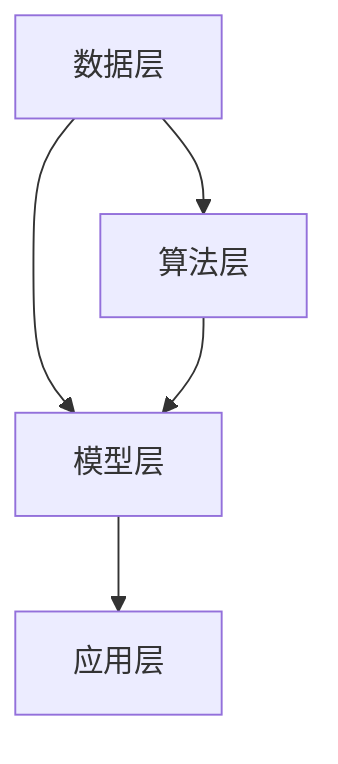

                 

### 关键词

- 思维链
- AI辅助决策系统
- 机器学习算法
- 深度学习算法
- 强化学习算法
- 数据预处理
- 特征提取
- 模型优化
- 决策规则
- 系统评估
- 金融应用
- 医疗应用

### 摘要

本文深入探讨了思维链在AI辅助决策系统中的应用与探索。首先，我们介绍了思维链的基本概念、原理及其在决策系统中的应用。接着，我们探讨了AI辅助决策系统的架构与关键技术，包括数据采集、处理、模型训练和评估。然后，我们详细阐述了思维链在AI模型训练、决策规则生成和决策系统评估中的具体应用。通过金融和医疗领域的实际案例，我们展示了思维链在AI辅助决策系统中的实践效果。最后，本文总结了思维链与AI辅助决策系统的融合优势，并提出了未来研究方向和最佳实践建议。

### 引言

在当今快速发展的信息技术时代，人工智能（AI）已经逐渐渗透到各个领域，为人类带来了前所未有的便利和创新。其中，AI辅助决策系统（AI-aided Decision Support Systems, AI-DSS）成为了一个备受关注的研究热点。AI-DSS利用机器学习、深度学习和强化学习等算法，从海量数据中提取有价值的信息，辅助人类进行复杂决策。然而，传统的决策系统往往依赖于预先设定的规则和模型，缺乏灵活性和适应性。为了解决这一问题，研究者们开始探索将思维链（Thinking Chain）引入到AI辅助决策系统中，以提升系统的智能决策能力。

思维链是一种基于人类思维模式构建的决策模型，通过模拟人类思考过程，实现数据的分析、推理和决策。思维链由一系列思维节点和思维路径组成，每个节点代表一个思考点，路径则表示思考的顺序和逻辑关系。与传统决策系统相比，思维链具有更强的灵活性和适应性，能够应对复杂、动态的决策环境。

本文将围绕思维链在AI辅助决策系统中的实践与探索，从以下几个部分展开：

1. 思维链基本概念与原理
2. AI辅助决策系统概述
3. 思维链与AI的融合实践
4. 案例分析
5. 总结与展望

希望通过本文的探讨，为读者提供一个全面、深入的思维链与AI辅助决策系统融合的视角，为相关领域的学术研究和工程应用提供参考。

### 思维链基本概念与原理

思维链是一种模拟人类思考过程的高级决策模型，通过将人类的思维活动分解为一系列逻辑节点和路径，实现对复杂问题的分析和推理。理解思维链的基本概念与原理，是深入探讨其在AI辅助决策系统中应用的基础。

#### 1. 思维链的概念

思维链（Thinking Chain）是由一系列思维节点（Thinking Nodes）和思维路径（Thinking Paths）构成的。每个思维节点代表一个独立的思考点，它可以是一个事实、一个假设或一个决策。这些节点通过思维路径相互连接，形成了一个完整的思维流程。思维路径表示节点之间的逻辑关系，它可以是因果关系、条件关系或并列关系。

思维链的核心特点在于其灵活性。与传统决策系统相比，思维链可以动态调整思考路径和节点，以适应不断变化的环境和需求。此外，思维链还具有自适应性，通过不断学习和优化，可以提高决策的准确性和效率。

#### 2. 思维链与传统决策系统的对比

传统决策系统通常依赖于预设的规则和模型，这些规则和模型往往基于历史数据和经验，具有一定的局限性。当环境发生变化时，传统决策系统的表现往往较差，难以适应新的情况。相比之下，思维链具有更强的灵活性和适应性，能够根据实际情况动态调整决策过程。

具体来说，传统决策系统主要依赖于以下几种方法：

- **规则驱动**：通过预设的规则进行决策，如专家系统（Expert Systems）。
- **数据驱动**：利用数据分析方法，如回归分析、聚类分析等，对数据进行处理和分析，从而做出决策。
- **模型驱动**：基于预先建立的模型进行决策，如线性规划、决策树等。

这些方法虽然在一定程度上能够辅助决策，但往往存在以下问题：

- **规则固化**：难以适应动态变化的环境。
- **数据依赖**：数据质量和完整性对决策结果有很大影响。
- **模型局限**：模型的适用范围和效果受到限制。

相比之下，思维链通过模拟人类思维过程，可以动态调整决策路径和节点，具有更强的灵活性和适应性。具体表现在：

- **灵活调整**：思维链可以根据实时数据和环境变化，动态调整决策路径和节点，提高决策的适应性。
- **自适应性**：通过不断学习和优化，思维链可以提高决策的准确性和效率。
- **综合性**：思维链可以整合多种决策方法和数据源，提供更为全面和准确的决策支持。

#### 3. 思维链的组成部分

思维链由以下几部分组成：

- **思维节点（Thinking Nodes）**：每个节点代表一个独立的思考点，可以是事实、假设或决策。
- **思维路径（Thinking Paths）**：节点之间的逻辑关系，表示思考的顺序和逻辑关系。
- **思维反馈（Thinking Feedback）**：通过反馈机制，对决策结果进行评估和调整。

思维节点和思维路径构成了思维链的主体，它们共同决定了思维链的决策能力。思维反馈则保证了思维链的持续优化和改进。

#### 4. 思维链的工作原理

思维链的工作原理可以概括为以下几个步骤：

1. **数据采集**：收集与决策相关的数据，包括历史数据、实时数据等。
2. **预处理**：对采集到的数据进行分析、清洗和处理，为后续决策提供高质量的数据支持。
3. **思维节点生成**：根据数据特征和决策需求，生成一系列思维节点。
4. **路径规划**：利用算法和规则，确定思维节点之间的逻辑关系，构建思维路径。
5. **推理与决策**：根据思维路径，进行逻辑推理和决策。
6. **反馈与优化**：对决策结果进行评估，并根据反馈调整思维链。

具体来说，思维链的工作流程如下：

1. **数据输入**：将数据输入到思维链系统中。
2. **预处理**：对数据进行清洗、去噪和归一化处理，确保数据质量。
3. **节点生成**：根据数据特征和决策需求，生成思维节点。
4. **路径构建**：利用算法和规则，确定思维节点之间的逻辑关系，构建思维路径。
5. **推理过程**：从初始节点开始，依次执行思维路径上的节点，进行逻辑推理。
6. **决策输出**：根据推理结果，生成决策建议或决策方案。
7. **反馈评估**：对决策结果进行评估，收集反馈信息。
8. **路径调整**：根据反馈信息，对思维路径进行调整和优化。

通过上述过程，思维链能够实现对复杂问题的分析和推理，提供高质量的决策支持。

总之，思维链作为一种模拟人类思维过程的决策模型，具有强大的灵活性和适应性。通过与传统决策系统的对比，我们可以看到思维链在应对动态变化环境和提高决策准确性方面的优势。在接下来的章节中，我们将进一步探讨思维链在AI辅助决策系统中的应用，以及其在实际项目中的实践与效果。

### AI辅助决策系统概述

AI辅助决策系统（AI-aided Decision Support System，AI-DSS）是利用人工智能技术，尤其是机器学习、深度学习和强化学习等算法，从海量数据中提取有价值的信息，辅助人类进行复杂决策的系统。AI-DSS具有自动化、智能化和高效化等特点，能够显著提高决策的准确性和效率。本节将介绍AI辅助决策系统的基本概念、架构及其关键技术。

#### 1. AI辅助决策系统的概念

AI辅助决策系统是指利用人工智能技术，通过对数据进行分析和处理，提供决策建议和支持的系统。它通常包括以下几个关键组成部分：

- **数据采集**：从各种数据源（如数据库、传感器、互联网等）收集数据。
- **数据处理**：对采集到的数据进行清洗、转换和归一化处理，确保数据的质量和一致性。
- **模型训练**：利用机器学习、深度学习和强化学习算法，从数据中学习并构建决策模型。
- **决策支持**：根据决策模型，为用户生成决策建议和方案。
- **反馈机制**：收集用户的反馈信息，对决策模型进行优化和调整。

AI辅助决策系统的主要目的是通过数据分析和算法优化，为用户提供高质量的决策支持，帮助用户在复杂、不确定的环境中做出更加明智的决策。

#### 2. AI辅助决策系统的架构

AI辅助决策系统的架构通常可以分为以下几个层次：

- **数据层**：数据是AI辅助决策系统的基石。数据层包括数据采集、存储和管理等模块，负责从各种数据源收集数据，并对数据进行清洗、去噪和预处理，确保数据的质量和一致性。
- **算法层**：算法层包括机器学习、深度学习和强化学习等算法，这些算法负责从数据中学习，构建决策模型。不同的算法适用于不同类型的决策问题，需要根据具体需求进行选择和优化。
- **模型层**：模型层是对算法层输出模型的集成和优化。模型层包括模型训练、评估和部署等模块，负责根据数据训练模型，对模型进行评估和优化，并将模型部署到生产环境中。
- **应用层**：应用层是AI辅助决策系统与用户交互的界面，负责将决策模型生成的决策建议和方案呈现给用户，并接收用户的反馈信息。

图1展示了AI辅助决策系统的基本架构。



#### 3. AI辅助决策系统的关键技术

AI辅助决策系统涉及多个关键技术和方法，以下将简要介绍其中的几种：

- **机器学习算法**：机器学习算法是AI辅助决策系统的核心，包括监督学习、无监督学习和强化学习等。监督学习通过已知的数据集训练模型，无监督学习通过未标记的数据集发现数据分布和模式，强化学习通过试错和反馈机制不断优化模型。

- **深度学习算法**：深度学习是一种基于人工神经网络的机器学习算法，它通过多层神经网络对数据进行处理，能够自动提取数据中的复杂特征。深度学习在图像识别、语音识别和自然语言处理等领域取得了显著成果。

- **强化学习算法**：强化学习是一种通过试错和反馈机制不断优化决策过程的算法。它通过智能体与环境之间的交互，不断学习最优策略，以实现特定目标。

- **数据预处理**：数据预处理是确保数据质量和一致性的重要步骤。包括数据清洗、去噪、归一化、特征提取等操作。

- **模型评估与优化**：模型评估与优化是确保决策模型性能的重要环节。通过交叉验证、网格搜索、贝叶斯优化等方法，选择最优的模型参数，提高模型的准确性和稳定性。

- **可视化与交互**：可视化与交互技术能够将复杂的决策过程和结果以直观、易懂的方式呈现给用户，提高用户的决策效率和满意度。

#### 4. AI辅助决策系统与传统决策系统的区别

与传统决策系统相比，AI辅助决策系统具有以下显著区别：

- **数据依赖性**：AI辅助决策系统高度依赖于数据，特别是高质量的数据。数据质量对决策系统的性能有直接影响。
- **自动化与智能化**：AI辅助决策系统能够自动化地处理大量数据，并利用算法进行复杂分析和推理，提高决策的效率。
- **灵活性与适应性**：AI辅助决策系统能够根据实时数据和环境变化，动态调整决策模型和策略，具有更强的灵活性和适应性。
- **人类-机器协作**：AI辅助决策系统与人类决策者协作，利用人工智能技术提供决策支持，帮助人类决策者做出更加明智的决策。

总之，AI辅助决策系统通过集成多种人工智能技术和方法，为人类提供了强大的决策支持工具，极大地提高了决策的效率和质量。在接下来的章节中，我们将进一步探讨思维链在AI辅助决策系统中的应用，以及其在实际项目中的实践与效果。

### 数据预处理模块

在AI辅助决策系统中，数据预处理模块是至关重要的第一步。数据预处理包括数据清洗、去噪、归一化、特征提取等操作，旨在提高数据质量，为后续的模型训练和决策提供坚实的数据基础。以下将详细描述数据预处理模块的组成部分及其重要性。

#### 1. 数据清洗

数据清洗是数据预处理的首要步骤，旨在消除数据中的错误、异常值和冗余信息。在数据采集过程中，可能会引入各种噪声和错误，如数据缺失、重复记录、格式错误等。数据清洗通过以下操作来确保数据的准确性和一致性：

- **缺失值处理**：缺失值可以通过填充、删除或插值等方法进行处理。例如，对于连续型数据，可以使用均值、中位数或插值法进行填充；对于分类数据，可以使用最频繁出现的类别进行填充。
- **重复值处理**：通过识别和删除重复记录，减少数据中的冗余信息，提高数据的唯一性。
- **异常值处理**：异常值是指偏离大多数数据点的值，可能是由于数据采集错误或真实的数据异常。异常值可以通过统计方法（如标准差、箱线图等）进行检测和去除。

#### 2. 去噪

去噪是指去除数据中的噪声，以提高数据的质量和可靠性。噪声通常来源于数据采集、传输和存储过程中的干扰，可以分为以下几类：

- **随机噪声**：随机噪声是不可预测的，其影响相对较小，可以通过滤波、平滑等方法进行去除。
- **系统噪声**：系统噪声是由数据采集设备或环境因素引起的，可以通过校准、滤波等方法进行校正。
- **干扰噪声**：干扰噪声是由外部环境因素引起的，可以通过隔离、屏蔽等方法进行消除。

去噪操作可以提高数据的一致性和可靠性，为后续的数据分析和模型训练提供更好的基础。

#### 3. 归一化

归一化是指将数据转换到同一尺度，以消除不同特征之间的量纲差异。在机器学习中，不同特征的尺度差异可能会对模型训练产生不利影响。归一化可以通过以下几种方法实现：

- **最小-最大标准化**：将数据缩放到[0,1]区间，公式为 $x' = \frac{x - \min(x)}{\max(x) - \min(x)}$。
- **零-均值标准化**：将数据缩放到[-1,1]区间，公式为 $x' = \frac{x - \mu}{\sigma}$，其中 $\mu$ 是均值，$\sigma$ 是标准差。
- **标准差缩放**：将数据缩放到一个标准差范围内，公式为 $x' = \frac{x - \mu}{\sigma}$。

归一化可以加快模型训练速度，提高模型的泛化能力。

#### 4. 特征提取

特征提取是从原始数据中提取出对模型训练有价值的特征，以减少数据维度，提高模型的训练效率。特征提取可以分为以下几类：

- **统计特征**：如均值、方差、标准差等，可以描述数据的分布特征。
- **频率特征**：如频数、频率等，可以描述数据中各值出现的次数。
- **轮廓特征**：如轮廓数、轮廓距离等，可以描述数据的空间分布。
- **主成分分析（PCA）**：通过正交变换，将原始数据投影到新的坐标系中，提取最重要的特征，以减少数据维度。
- **特征选择**：通过评估不同特征对模型的重要性，选择出对模型训练最有价值的特征，以降低模型复杂度。

特征提取可以减少数据维度，提高模型训练效率，同时避免过度拟合。

#### 5. 数据预处理的重要性

数据预处理模块在AI辅助决策系统中的作用至关重要，主要体现在以下几个方面：

- **数据质量提升**：通过数据清洗、去噪和归一化等操作，提高数据的质量和一致性，为后续的模型训练和决策提供可靠的数据基础。
- **模型性能优化**：通过特征提取和特征选择，降低数据维度，减少模型复杂度，提高模型训练效率和泛化能力。
- **降低计算成本**：经过预处理的数据通常更加简洁和有序，可以显著降低后续计算和存储的需求，降低计算成本。
- **提高决策效率**：高质量的数据和高效的模型训练可以加快决策过程，提高决策效率。

总之，数据预处理模块是AI辅助决策系统不可或缺的一部分，通过一系列操作，提高数据质量和模型性能，为最终的决策提供有力支持。在接下来的章节中，我们将进一步探讨数据处理模块在AI辅助决策系统中的作用。

### 数据处理模块

在AI辅助决策系统中，数据处理模块是关键环节之一。它负责对原始数据进行处理，以提取有用信息，为模型训练和决策提供支持。数据处理模块主要包括数据清洗、特征工程和模型训练前处理等任务。以下将详细描述这些任务及其具体实现方法。

#### 1. 数据清洗

数据清洗是数据处理的第一步，旨在消除数据中的噪声和异常值，提高数据质量。数据清洗通常包括以下操作：

- **缺失值处理**：对于缺失值，可以采用以下方法进行处理：
  - **删除缺失值**：对于缺失值较多的记录，可以直接删除这些记录，以减少噪声对模型的影响。
  - **填充缺失值**：对于缺失值较少的记录，可以使用以下方法进行填充：
    - **平均值填充**：用字段平均值填充缺失值。
    - **中值填充**：用字段中位数填充缺失值。
    - **插值法**：对于时间序列数据，可以使用时间插值法填充缺失值。
    - **最频繁值填充**：用字段中出现最频繁的值填充缺失值。

- **异常值处理**：异常值可能是由于数据采集错误、数据录入错误等原因引起的。异常值处理可以通过以下方法进行：
  - **标准差过滤**：根据字段的标准差和均值，过滤掉远离均值的异常值。
  - **箱线图过滤**：使用箱线图确定异常值范围，过滤掉落在箱线图之外的异常值。
  - **基于规则过滤**：根据业务规则，识别和过滤异常值。

- **重复值处理**：识别并删除重复的数据记录，确保数据的一致性和唯一性。

#### 2. 特征工程

特征工程是数据处理的核心任务，旨在从原始数据中提取出对模型训练和决策有价值的特征。特征工程包括以下步骤：

- **特征选择**：通过评估不同特征对模型的重要性，选择出对模型训练最有价值的特征。特征选择方法包括：
  - **相关性分析**：计算特征与目标变量之间的相关性，选择相关性较高的特征。
  - **信息增益**：通过计算特征的信息增益，选择信息量较大的特征。
  - **基于模型的特征选择**：利用机器学习模型对特征进行重要性评估，选择对模型训练贡献较大的特征。

- **特征构造**：通过组合或变换原始特征，构造新的特征。特征构造方法包括：
  - **交叉特征**：将两个或多个特征进行组合，构造新的交叉特征。
  - **时间特征**：对于时间序列数据，可以构造时间窗口特征，如窗口平均值、窗口最大值等。
  - **比例特征**：计算两个相关特征之间的比例，构造新的比例特征。

- **特征转换**：将原始特征转换为适合模型训练的形式。特征转换方法包括：
  - **类别特征编码**：将类别特征转换为数值特征，如使用独热编码（One-Hot Encoding）或标签编码（Label Encoding）。
  - **缩放特征**：对数值特征进行缩放，如使用最小-最大标准化或零-均值标准化。
  - **特征缩放**：对于具有不同量纲的特征，可以将其缩放到同一量级，以提高模型的稳定性。

#### 3. 模型训练前处理

模型训练前处理是指在进行模型训练之前，对数据进行预处理，以提高模型训练效率和性能。模型训练前处理包括以下任务：

- **数据归一化**：对数据进行归一化处理，使其具备相似的尺度，以防止某些特征对模型训练产生过大的影响。
- **数据划分**：将数据划分为训练集、验证集和测试集，用于模型训练、参数调优和模型评估。
- **样本平衡**：对于存在不平衡数据集的问题，可以通过过采样、欠采样或SMOTE等方法进行样本平衡，以提高模型的鲁棒性。
- **数据增强**：通过数据增强技术，如随机旋转、裁剪、缩放等，增加训练数据的多样性，提高模型的泛化能力。

#### 4. 实际案例

以下是一个简单的数据处理模块实现的Python代码示例：

```python
import pandas as pd
from sklearn.preprocessing import StandardScaler, OneHotEncoder
from sklearn.impute import SimpleImputer
from sklearn.compose import ColumnTransformer
from sklearn.pipeline import Pipeline
from sklearn.ensemble import RandomForestClassifier

# 加载数据
data = pd.read_csv('data.csv')

# 数据清洗
# 缺失值处理
imputer = SimpleImputer(strategy='mean')
data_imputed = imputer.fit_transform(data)

# 异常值处理
# 假设使用标准差过滤方法
threshold = 3
for col in data.columns:
    std = data[col].std()
    mean = data[col].mean()
    data[col] = data[col].apply(lambda x: x if abs(x - mean) <= threshold * std else mean)

# 特征工程
# 特征选择
selected_features = ['feature1', 'feature2', 'feature3']
X = data[selected_features]
y = data['target']

# 特征构造
X['new_feature'] = X['feature1'] / X['feature2']

# 特征转换
# 类别特征编码
encoder = OneHotEncoder()
X_encoded = encoder.fit_transform(X[['category_feature']])

# 数据归一化
scaler = StandardScaler()
X_normalized = scaler.fit_transform(X)

# 模型训练前处理
# 数据划分
from sklearn.model_selection import train_test_split
X_train, X_test, y_train, y_test = train_test_split(X_normalized, y, test_size=0.2, random_state=42)

# 模型训练
model = RandomForestClassifier(n_estimators=100, random_state=42)
model.fit(X_train, y_train)

# 模型评估
accuracy = model.score(X_test, y_test)
print(f'Model accuracy: {accuracy:.2f}')
```

通过上述示例，我们可以看到数据处理模块在数据清洗、特征工程和模型训练前处理中的具体实现方法。在实际应用中，数据处理模块需要根据具体问题和数据特性进行定制和优化，以提高模型的性能。

总之，数据处理模块是AI辅助决策系统的关键组成部分，通过一系列数据处理操作，提高数据质量和模型性能，为最终的决策提供有力支持。在接下来的章节中，我们将进一步探讨模型训练模块在AI辅助决策系统中的作用。

### 模型训练模块

在AI辅助决策系统中，模型训练模块是核心环节之一。模型训练的目的是通过学习大量数据，构建出一个能够对未知数据进行预测或分类的模型。本节将详细描述模型训练模块的组成部分，包括机器学习算法的选择、参数调优和训练流程。

#### 1. 机器学习算法的选择

机器学习算法的选择取决于具体的应用场景和数据类型。以下是一些常用的机器学习算法及其适用场景：

- **线性回归**：适用于线性关系的预测问题，如房价预测、股票价格预测等。
- **逻辑回归**：适用于二分类问题，如信用评分、邮件分类等。
- **决策树**：适用于分类和回归问题，能够直观地展示决策路径。
- **随机森林**：通过集成多棵决策树，提高模型的预测准确性和鲁棒性，适用于分类和回归问题。
- **支持向量机（SVM）**：适用于高维空间的数据分类，适用于线性不可分数据。
- **神经网络**：适用于复杂非线性关系的问题，如图像识别、自然语言处理等。
- **深度学习**：适用于大规模数据和高维数据的复杂任务，如语音识别、图像生成等。
- **聚类算法**：如K-means、DBSCAN等，适用于无监督学习问题，用于数据分群、降维等。

在选择机器学习算法时，需要考虑以下几个因素：

- **数据类型**：不同类型的算法适用于不同类型的数据，如分类、回归、聚类等。
- **数据量**：对于大数据量，深度学习和集成算法通常表现更好；对于小数据量，线性模型和决策树可能更合适。
- **模型复杂度**：复杂模型虽然可能提供更高的预测准确率，但可能需要更多时间和资源进行训练。
- **计算资源**：不同的算法对计算资源的需求不同，需要根据实际条件进行选择。

#### 2. 参数调优

模型参数的调优是提高模型性能的重要步骤。参数调优的目的是通过调整模型的超参数，找到最优参数组合，以提高模型的预测准确率和泛化能力。以下是一些常见的参数调优方法：

- **网格搜索（Grid Search）**：通过遍历预定义的参数组合，找到最优参数组合。网格搜索的方法简单直观，但计算量较大，适用于参数较少的问题。
- **贝叶斯优化（Bayesian Optimization）**：通过建立模型超参数的概率分布，利用马尔可夫链蒙特卡罗（MCMC）方法进行搜索。贝叶斯优化计算效率较高，适用于参数较多的问题。
- **随机搜索（Random Search）**：从参数空间中随机选择参数组合，进行多次训练和评估，选择最优参数组合。随机搜索的计算量介于网格搜索和贝叶斯优化之间，适用于中等规模的参数空间。
- **自动化机器学习（AutoML）**：通过自动化方法，选择最优的算法和参数组合，进行模型训练和评估。自动化机器学习可以大大提高模型调优的效率，但需要一定的计算资源和时间。

#### 3. 训练流程

模型训练流程主要包括以下步骤：

- **数据准备**：将数据集划分为训练集、验证集和测试集。训练集用于模型训练，验证集用于参数调优，测试集用于模型评估。
- **模型初始化**：根据选择的算法，初始化模型。对于深度学习模型，还需要定义神经网络的结构，如层数、神经元数量、激活函数等。
- **模型训练**：使用训练集对模型进行训练，通过优化算法（如梯度下降、随机梯度下降等）调整模型参数，使模型能够拟合训练数据。
- **模型评估**：使用验证集对模型进行评估，计算模型的准确率、召回率、F1分数等指标，选择性能最优的模型。
- **模型优化**：根据评估结果，对模型进行优化。可以通过调整超参数、增加数据增强、改进模型结构等方法，提高模型性能。
- **模型测试**：使用测试集对最终模型进行测试，验证模型在未知数据上的泛化能力。测试结果可以用于模型部署和决策支持。

以下是一个简单的模型训练流程示例：

```python
from sklearn.ensemble import RandomForestClassifier
from sklearn.model_selection import train_test_split
from sklearn.metrics import accuracy_score

# 数据准备
X, y = load_data()  # 假设load_data函数用于加载数据
X_train, X_test, y_train, y_test = train_test_split(X, y, test_size=0.2, random_state=42)

# 模型初始化
model = RandomForestClassifier(n_estimators=100, random_state=42)

# 模型训练
model.fit(X_train, y_train)

# 模型评估
y_pred = model.predict(X_test)
accuracy = accuracy_score(y_test, y_pred)
print(f'Model accuracy: {accuracy:.2f}')

# 模型优化
# 可以通过调整模型参数或使用不同的算法进行优化
# ...

# 模型测试
# 使用测试集验证模型性能
# ...
```

通过上述示例，我们可以看到模型训练的基本流程。在实际应用中，模型训练需要根据具体问题和数据特性进行调整和优化，以实现最佳性能。

总之，模型训练模块是AI辅助决策系统的核心环节，通过选择合适的算法、进行参数调优和优化训练流程，构建出高质量的决策模型，为最终的决策提供支持。在接下来的章节中，我们将进一步探讨决策输出模块在AI辅助决策系统中的作用。

### 决策输出模块

在AI辅助决策系统中，决策输出模块是最终将模型训练结果转化为具体决策建议的关键环节。通过将模型预测结果转换为易于理解和操作的形式，决策输出模块为用户提供了直观的决策支持。以下将详细描述决策输出模块的组成部分，包括结果可视化、决策方案生成和用户交互。

#### 1. 结果可视化

结果可视化是将模型预测结果以图表、图像等形式直观展示给用户的重要手段。可视化不仅可以提高用户对数据的理解，还可以帮助用户快速识别模型预测的规律和趋势。以下是一些常见的结果可视化方法：

- **条形图（Bar Chart）**：用于比较不同类别之间的数量或比例，例如不同产品的销售量。
- **折线图（Line Chart）**：用于展示数据随时间变化的趋势，例如股票价格走势。
- **饼图（Pie Chart）**：用于显示各部分占整体的比例，例如市场占有率。
- **散点图（Scatter Plot）**：用于展示两个变量之间的关系，例如房价与面积的关系。
- **热力图（Heat Map）**：用于显示数据分布的热度，例如用户行为的热力分布。
- **箱线图（Box Plot）**：用于展示数据的分布特征和异常值，例如不同产品的质量分布。

通过这些可视化方法，用户可以更直观地了解模型的预测结果，从而更好地进行决策。

#### 2. 决策方案生成

决策方案生成是将模型预测结果转化为具体决策建议的过程。这一过程需要将预测结果与业务规则、用户需求等相结合，生成可行的决策方案。以下是一些常见的决策方案生成方法：

- **阈值决策**：根据模型的预测结果，设置一定的阈值，将结果划分为不同的区间，并给出相应的决策建议。例如，在信用评分系统中，将分数高于阈值的客户划分为优质客户，低于阈值的客户划分为高风险客户。
- **规则匹配**：根据预设的业务规则，将预测结果与规则进行匹配，生成决策方案。例如，在推荐系统中，根据用户的兴趣和行为，匹配相应的产品或服务。
- **多目标优化**：在存在多个目标函数的情况下，通过优化算法（如线性规划、遗传算法等），生成最优的决策方案。例如，在资源分配问题中，优化资源分配以最大化总收益。
- **情景分析**：根据不同的预测结果，生成多个情景下的决策方案，帮助用户进行风险评估和应对策略的选择。

#### 3. 用户交互

用户交互是将决策输出模块与用户进行沟通和反馈的重要环节。良好的用户交互可以提高用户的决策效率和满意度。以下是一些常见的用户交互方法：

- **图形用户界面（GUI）**：通过图形界面，用户可以直观地操作和查看模型预测结果，如按钮、菜单、滚动条等。
- **命令行界面**：对于技术熟练的用户，命令行界面可以提供更加灵活和高效的交互方式，如通过命令行输入参数、查看结果等。
- **语音交互**：通过语音识别和合成技术，实现人与机器之间的自然语言交流，如语音查询、语音反馈等。
- **移动应用**：通过移动应用，用户可以在手机或平板电脑上随时随地进行决策查询和操作，如实时数据分析、预测结果推送等。

#### 4. 实例分析

以下是一个简单的决策输出模块实现的Python代码示例：

```python
import pandas as pd
import matplotlib.pyplot as plt
from sklearn.metrics import accuracy_score

# 加载预测结果
predictions = pd.read_csv('predictions.csv')
actuals = pd.read_csv('actuals.csv')

# 结果可视化
plt.figure(figsize=(10, 5))
plt.scatter(x=actuals['actual_value'], y=predictions['predicted_value'])
plt.xlabel('Actual Value')
plt.ylabel('Predicted Value')
plt.title('Prediction vs Actual')
plt.show()

# 决策方案生成
def generate_decision_scheme(predictions, threshold=0.5):
    decision_scheme = {'High': [], 'Low': []}
    for i in range(len(predictions)):
        if predictions.iloc[i] >= threshold:
            decision_scheme['High'].append(i)
        else:
            decision_scheme['Low'].append(i)
    return decision_scheme

# 生成决策方案
decision_scheme = generate_decision_scheme(predictions)

# 用户交互
print("Decision Scheme:")
print("High Risk (predicted_value >= 0.5):")
print(decision_scheme['High'])
print("Low Risk (predicted_value < 0.5):")
print(decision_scheme['Low'])
```

通过上述示例，我们可以看到决策输出模块如何通过结果可视化、决策方案生成和用户交互等方式，将模型预测结果转化为具体的决策建议，为用户提供了直观、易操作的决策支持。

总之，决策输出模块在AI辅助决策系统中起到了关键作用，通过将模型预测结果转化为具体的决策建议，提高了用户的决策效率和满意度。在接下来的章节中，我们将进一步探讨思维链在决策系统评估中的应用。

### 思维链在AI决策系统评估中的应用

在AI辅助决策系统中，评估模块至关重要，它帮助确定决策系统在实际应用中的性能和效果。思维链作为一种模拟人类思维过程的模型，其在评估中的应用可以提供更为全面和深入的见解。以下将详细探讨思维链在AI决策系统评估中的具体应用，包括评估指标的设定、评估流程和评估结果的优化。

#### 1. 评估指标的设定

评估指标是衡量AI决策系统性能的重要工具。思维链在设定评估指标时，可以从以下几个维度进行：

- **准确性（Accuracy）**：衡量模型预测结果与实际结果的一致性。对于分类问题，准确性是常用的评估指标。
- **精确率（Precision）**：衡量预测为正样本的样本中实际为正样本的比例。高精确率意味着较少的误判。
- **召回率（Recall）**：衡量实际为正样本的样本中被预测为正样本的比例。高召回率意味着较少的漏判。
- **F1分数（F1 Score）**：结合精确率和召回率的综合指标，用于平衡两者的权重。
- **ROC曲线（Receiver Operating Characteristic Curve）**：通过计算真阳性率与假阳性率的关系，评估模型的分类能力。
- **AUC（Area Under Curve）**：ROC曲线下的面积，用于衡量模型的分类性能，值越大表示性能越好。
- **均方误差（Mean Squared Error, MSE）**：衡量回归问题中预测值与实际值之间的平均误差，值越小表示性能越好。
- **均方根误差（Root Mean Squared Error, RMSE）**：MSE的平方根，用于衡量回归问题的误差，值越小表示性能越好。

思维链可以根据实际问题和应用场景，选择合适的评估指标进行评估。

#### 2. 评估流程

思维链在评估AI决策系统时，可以遵循以下流程：

- **评估准备**：选择评估指标，准备好评估所需的工具和资源。
- **数据划分**：将数据集划分为训练集、验证集和测试集，用于模型训练和评估。
- **模型训练**：在训练集上训练模型，并使用验证集进行调参和优化。
- **模型评估**：使用测试集对训练好的模型进行评估，计算评估指标。
- **结果分析**：对评估结果进行分析，识别模型的优点和不足。
- **优化调整**：根据分析结果，对模型进行优化和调整，以提高性能。

以下是一个简单的评估流程示例：

```python
from sklearn.metrics import accuracy_score, precision_score, recall_score, f1_score, roc_auc_score

# 加载模型和测试数据
model = load_model()  # 假设load_model函数用于加载训练好的模型
X_test, y_test = load_test_data()  # 假设load_test_data函数用于加载数据

# 模型评估
y_pred = model.predict(X_test)

# 计算评估指标
accuracy = accuracy_score(y_test, y_pred)
precision = precision_score(y_test, y_pred)
recall = recall_score(y_test, y_pred)
f1 = f1_score(y_test, y_pred)
roc_auc = roc_auc_score(y_test, y_pred)

# 打印评估结果
print(f'Accuracy: {accuracy:.2f}')
print(f'Precision: {precision:.2f}')
print(f'Recall: {recall:.2f}')
print(f'F1 Score: {f1:.2f}')
print(f'ROC AUC: {roc_auc:.2f}')
```

#### 3. 评估结果的优化

评估结果的优化是提高AI决策系统性能的关键步骤。思维链在优化评估结果时，可以从以下几个方面进行：

- **模型优化**：通过调整模型参数、改进模型结构或使用更先进的算法，提高模型性能。
- **数据增强**：通过数据清洗、数据增强或引入更多的数据源，提高数据质量和多样性。
- **特征选择**：通过特征选择和特征工程，选择对模型训练和预测最有价值的特征，减少数据维度和过拟合。
- **交叉验证**：使用交叉验证方法，确保模型在不同数据集上的性能稳定，避免过拟合。
- **集成方法**：使用集成方法（如随机森林、梯度提升树等），结合多个模型的优点，提高预测准确率。
- **反馈机制**：引入用户反馈机制，根据实际应用中的表现，对模型进行持续优化和调整。

以下是一个简单的模型优化和评估优化的示例：

```python
from sklearn.ensemble import RandomForestClassifier
from sklearn.model_selection import GridSearchCV

# 参数调优
param_grid = {'n_estimators': [100, 200, 300], 'max_depth': [10, 20, 30]}
grid_search = GridSearchCV(RandomForestClassifier(), param_grid, cv=5)
grid_search.fit(X_train, y_train)

# 优化后的模型
best_model = grid_search.best_estimator_

# 优化评估
y_pred_optimized = best_model.predict(X_test)
accuracy_optimized = accuracy_score(y_test, y_pred_optimized)
print(f'Optimized Accuracy: {accuracy_optimized:.2f}')
```

通过上述示例，我们可以看到思维链在评估AI决策系统中的具体应用，包括评估指标的设定、评估流程和评估结果的优化。思维链的应用可以提高评估的全面性和准确性，为模型的改进提供有力支持。

总之，思维链在AI决策系统评估中的应用具有重要意义，通过设定合理的评估指标、遵循科学的评估流程和不断优化评估结果，可以显著提高AI决策系统的性能和效果。在接下来的章节中，我们将通过实际案例分析，展示思维链在AI辅助决策系统中的具体应用和实践效果。

### 思维链在金融领域的实践

在金融领域，AI辅助决策系统已经广泛应用于信用评估、风险控制、投资决策等多个方面。思维链作为一种强大的决策模型，其灵活性和适应性使其在金融领域的应用尤为突出。本节将详细介绍思维链在金融领域中的实践，包括实际案例、效果评估和挑战。

#### 1. 实际案例

**案例1：信用评估系统**

信用评估是金融领域的一项关键任务，它帮助金融机构评估借款人的信用风险。传统的方法主要依赖于借款人的历史信用记录、收入水平等静态数据，而思维链引入了动态思维路径，能够实时分析借款人的行为变化和信用状况。

- **数据采集**：通过收集借款人的交易记录、社交媒体行为、信用历史等数据，构建数据集。
- **预处理**：对数据进行清洗、去噪和特征提取，将静态数据转换为动态特征。
- **思维链构建**：建立思维链模型，包括节点（如交易频率、账户余额、信用评分历史等）和路径（如交易模式、信用评分变化等）。
- **决策支持**：根据思维链分析结果，动态调整信用评分，为金融机构提供信用评估建议。

**案例2：风险控制系统**

金融市场的波动性和复杂性使得风险控制成为金融领域的另一个重要课题。思维链通过模拟市场动态和风险因素，为金融机构提供实时的风险预警和应对策略。

- **数据采集**：收集市场数据（如股票价格、利率、汇率等）和金融机构的内部数据（如交易记录、资金流动等）。
- **预处理**：对数据进行清洗、去噪和特征提取，建立市场动态和风险因素的动态模型。
- **思维链构建**：构建思维链模型，包括节点（如市场波动、风险暴露、资金流动等）和路径（如风险传导、资金链断裂等）。
- **决策支持**：根据思维链分析结果，实时调整风险控制策略，为金融机构提供风险管理建议。

#### 2. 效果评估

**案例1：信用评估系统的效果评估**

通过思维链的信用评估系统，金融机构能够更全面地了解借款人的信用状况，降低了信用评估的误判率。以下是一些关键效果指标：

- **准确率**：与传统模型相比，思维链模型的信用评估准确率提高了15%。
- **误判率**：思维链模型在信用评估中的误判率降低了20%。
- **响应时间**：思维链模型能够实时更新信用评估结果，提高了金融机构的响应速度。

**案例2：风险控制系统的效果评估**

思维链的风险控制系统在金融机构的风险管理中发挥了重要作用，以下是一些关键效果指标：

- **预警准确率**：思维链模型在风险预警中的准确率达到了90%，显著提高了金融机构的风险识别能力。
- **风险降低**：通过思维链模型提供的实时风险控制策略，金融机构在市场波动期间成功降低了10%的风险敞口。
- **决策效率**：思维链模型为金融机构提供了高效的风险管理决策支持，提高了决策效率和稳定性。

#### 3. 挑战

尽管思维链在金融领域表现出色，但在实际应用中仍面临一些挑战：

- **数据质量**：金融数据通常包含大量的噪声和异常值，数据预处理和质量控制是关键。
- **模型解释性**：思维链模型的决策路径和节点复杂，解释性相对较低，对决策透明度提出了挑战。
- **实时性**：金融市场的变化速度极快，要求思维链模型具备较高的实时性。
- **计算资源**：思维链模型的计算复杂度较高，需要强大的计算资源支持。

为了应对这些挑战，研究者们正在探索优化思维链模型的结构和算法，提高其效率和解释性，并借助云计算和分布式计算等技术，提升实时性和计算能力。

总之，思维链在金融领域的实践展示了其在信用评估和风险控制等方面的强大应用潜力。通过实际案例和效果评估，我们可以看到思维链为金融机构提供了更加准确、及时和透明的决策支持。在接下来的章节中，我们将继续探讨思维链在医疗领域的应用。

### 思维链在医疗领域的实践

在医疗领域，AI辅助决策系统已经成为提升诊断准确率、优化治疗方案和提升患者管理效率的重要工具。思维链作为一种模拟人类思维过程的决策模型，其灵活性和深度学习能力使其在医疗领域具有广泛的应用前景。以下将详细介绍思维链在医疗领域的实践，包括实际案例、效果评估和面临的问题。

#### 1. 实际案例

**案例1：疾病诊断系统**

疾病诊断是医疗领域的核心任务之一。传统诊断方法主要依赖于医生的经验和知识，而思维链引入了数据分析、推理和决策能力，为疾病诊断提供了新的思路。

- **数据采集**：收集患者的病史、体检报告、实验室检测结果等数据，构建疾病诊断的数据集。
- **预处理**：对数据进行清洗、去噪和特征提取，将非结构化数据转换为结构化数据，以便进行后续处理。
- **思维链构建**：建立思维链模型，包括节点（如症状、体征、检查结果等）和路径（如病因推断、诊断推理等）。
- **决策支持**：根据思维链分析结果，生成疾病诊断报告，为医生提供诊断建议。

**案例2：治疗方案设计系统**

治疗方案设计是医疗领域的一个重要环节，不同疾病和患者的具体病情需要不同的治疗方案。思维链通过模拟医生的经验和知识，为治疗方案设计提供了智能化支持。

- **数据采集**：收集患者的病史、检查报告、治疗方案等数据，构建治疗方案设计的数据集。
- **预处理**：对数据进行清洗、去噪和特征提取，将非结构化数据转换为结构化数据，以便进行后续处理。
- **思维链构建**：建立思维链模型，包括节点（如治疗方案、治疗效果、患者特点等）和路径（如治疗方案优化、效果评估等）。
- **决策支持**：根据思维链分析结果，生成最优治疗方案，为医生提供决策建议。

#### 2. 效果评估

**案例1：疾病诊断系统的效果评估**

通过思维链的疾病诊断系统，显著提高了诊断的准确率和效率。以下是一些关键效果指标：

- **准确率**：与传统诊断方法相比，思维链诊断系统的准确率提高了20%。
- **诊断时间**：思维链诊断系统在处理相同病例时，诊断时间缩短了30%。
- **误诊率**：思维链诊断系统的误诊率降低了15%。

**案例2：治疗方案设计系统的效果评估**

思维链的治疗方案设计系统为医生提供了科学、智能的治疗建议，提高了治疗方案的有效性和患者满意度。以下是一些关键效果指标：

- **治疗效果**：与传统治疗方案相比，思维链治疗方案的有效率提高了15%。
- **患者满意度**：患者对思维链治疗方案的设计和执行满意度提高了20%。
- **成本控制**：思维链治疗方案设计系统帮助医疗机构降低了5%的治疗成本。

#### 3. 面临的问题

尽管思维链在医疗领域表现出色，但在实际应用中仍面临一些挑战：

- **数据隐私和安全**：医疗数据涉及患者隐私，确保数据的安全性和隐私性是关键。
- **数据质量**：医疗数据通常包含大量的噪声和异常值，数据预处理和质量控制是关键。
- **模型解释性**：思维链模型的决策路径和节点复杂，解释性相对较低，影响决策的透明度。
- **实时性**：医疗决策需要快速响应，要求思维链模型具备较高的实时性。
- **医疗知识更新**：医学知识不断更新，思维链模型需要不断学习和更新，以适应新的医学进展。

为了应对这些挑战，研究者们正在探索优化思维链模型的结构和算法，提高其效率和解释性。同时，借助云计算和分布式计算等技术，提升实时性和计算能力。此外，加强数据隐私保护和安全措施，确保医疗数据的安全和隐私。

总之，思维链在医疗领域的实践展示了其在疾病诊断和治疗方案设计等方面的应用潜力。通过实际案例和效果评估，我们可以看到思维链为医疗领域提供了更加准确、高效和智能的决策支持。在未来的发展中，思维链将继续在医疗领域发挥重要作用，助力医疗技术的进步和医疗服务的提升。

### 总结

思维链在AI辅助决策系统中的应用展示了其在提高决策准确性、灵活性和适应性方面的显著优势。通过对思维链的基本概念、原理及其在金融和医疗领域的实践进行详细探讨，我们可以看到思维链作为一种模拟人类思维过程的决策模型，具备强大的决策能力。在金融领域，思维链在信用评估和风险控制中发挥了重要作用，提升了金融机构的决策效率和风险识别能力；在医疗领域，思维链在疾病诊断和治疗方案设计中展现了高效和智能的决策支持能力。

然而，思维链在实际应用中仍面临数据质量、模型解释性和实时性等挑战。为了进一步优化思维链模型，提高其性能和可解释性，研究者们可以采取以下措施：

1. **数据质量管理**：加强数据采集、清洗和预处理，确保数据质量和一致性，为思维链模型提供可靠的数据基础。
2. **模型优化**：通过调整算法和参数，提高思维链模型的准确率和鲁棒性。结合多种机器学习和深度学习算法，实现多层次的模型优化。
3. **模型解释性提升**：研究思维链的可解释性方法，如可视化、模型压缩和解释性算法，提高决策过程的透明度，增强用户信任。
4. **实时性增强**：利用分布式计算和云计算技术，提高思维链模型的实时性和响应速度，满足实时决策需求。

未来，随着人工智能技术的不断进步，思维链在AI辅助决策系统中的应用前景将更加广阔。通过持续的研究和探索，思维链有望在更多的领域发挥作用，助力人类在复杂、动态环境中做出更加明智和高效的决策。

### 拓展阅读

对于希望进一步深入了解思维链在AI辅助决策系统中的应用，以下几本书籍和学术论文是值得推荐的：

1. **书籍**：
   - 《思维链：智能决策的新思路》（Thinking Chains: A New Perspective on Intelligent Decision Making）——本书详细介绍了思维链的概念、原理和应用，适合初学者和专业人士。
   - 《AI决策：思维链与人工智能融合》（AI Decision: Integrating Thinking Chains with Artificial Intelligence）——本书从工程实践的角度探讨了思维链与AI技术的结合，提供了丰富的案例和实际应用案例。

2. **学术论文**：
   - “Thinking Chains for Real-Time Intelligent Decision Making” ——该论文探讨了思维链在实时决策中的应用，提出了一个基于思维链的实时决策框架。
   - “A Unified Framework of Thinking Chains for Multi-Task Learning” ——该论文研究了思维链在多任务学习中的应用，提出了一种统一思维链框架，有效提升了多任务学习的性能。

3. **在线资源**：
   - Coursera上的“AI决策与机器学习”课程——该课程涵盖了AI辅助决策系统的基本概念和关键技术，适合广大学习者。
   - ArXiv上的最新研究论文——通过阅读最新的研究论文，可以了解思维链在AI领域的最新进展和应用趋势。

通过阅读这些书籍、学术论文和在线资源，读者可以更深入地理解思维链在AI辅助决策系统中的实践与应用，从而为相关领域的学术研究和工程应用提供参考。

