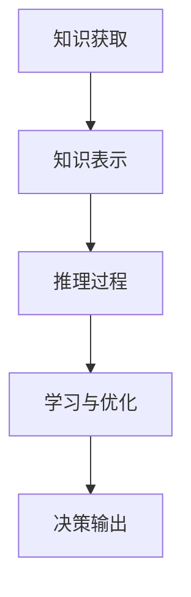
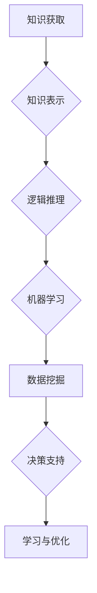
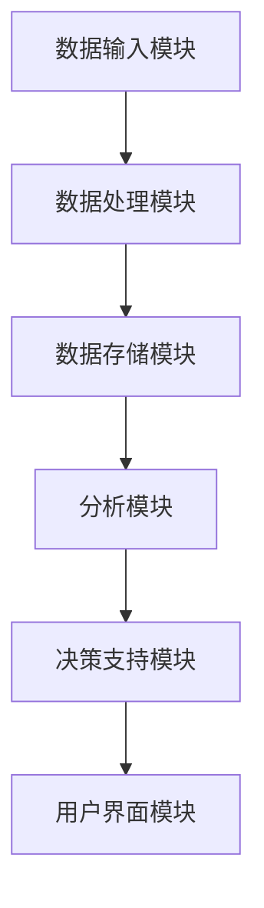

                 

### 引言

#### 1.1 研究背景

在当今信息技术飞速发展的时代，人工智能（AI）已经成为推动社会进步的重要力量。随着计算能力的提升和大数据技术的普及，AI在各个领域的应用场景日益丰富，从简单的自动化任务到复杂的决策支持系统，AI正逐步改变我们的生活方式和工作方式。

在众多AI应用中，决策支持系统（Decision Support Systems, DSS）尤为引人注目。DSS利用数据分析和智能算法为决策者提供强有力的辅助，从而提高决策的效率和质量。传统的DSS通常依赖于预定义的规则和模型，但在面对复杂和动态的环境时，其决策能力往往受到限制。

思维链（Thinking Chain）是一种新兴的智能计算范式，旨在通过模拟人类思维过程来实现复杂的决策支持。思维链通过构建知识库、逻辑推理和机器学习等技术的结合，实现对复杂问题的深度分析和智能决策。因此，将思维链应用于AI辅助决策系统（AI-Assisted Decision Systems）具有显著的研究价值和实际应用前景。

本文的研究目的在于深入探讨思维链在AI辅助决策系统中的应用，旨在解决以下几个关键问题：

1. 思维链的理论基础及其在AI辅助决策系统中的应用原理；
2. 思维链在不同领域的具体应用案例；
3. 思维链在AI辅助决策系统中实现的关键技术和挑战。

通过对这些问题的深入探讨，本文希望为AI辅助决策系统的研发提供理论指导和实践参考。

#### 1.2 关键词

- 人工智能（Artificial Intelligence）
- 决策支持系统（Decision Support Systems）
- 思维链（Thinking Chain）
- 知识表示（Knowledge Representation）
- 逻辑推理（Logic Reasoning）
- 数据挖掘（Data Mining）
- 机器学习（Machine Learning）

#### 1.3 摘要

本文旨在探讨思维链在AI辅助决策系统中的应用。首先，介绍了研究背景，分析了AI和决策支持系统的发展现状及其在各个领域的应用。接着，阐述了思维链的概念和理论基础，包括知识表示、逻辑推理和机器学习等方面。然后，本文详细讨论了思维链在AI辅助决策系统中的应用原理和实现方法，并通过具体案例分析，展示了思维链在不同领域的应用效果。最后，本文总结了研究成果，讨论了存在的挑战和未来的研究方向。本文的研究不仅为思维链在决策支持系统中的应用提供了理论基础，也为相关领域的研究和实践提供了有价值的参考。

---

在引言部分，我们首先介绍了研究背景，阐述了人工智能和决策支持系统的发展现状及其在各个领域的应用。接着，提出了本文的研究目的和关键词，并给出了文章的摘要。通过这一部分的介绍，读者可以初步了解本文的研究内容及其重要性。

接下来，我们将详细探讨思维链的理论基础，包括其定义、基本属性、类型和工作原理。这将为我们理解思维链在AI辅助决策系统中的应用奠定坚实的理论基础。

### 2.1 思维链理论基础

#### 2.1.1 思维链的定义

思维链（Thinking Chain）是一种基于人类思维过程的智能计算范式，旨在通过模拟人类认知机制来实现复杂的决策支持和问题解决。思维链通过将知识表示、逻辑推理和机器学习等技术有机结合，形成一个动态、自适应的智能系统，能够对复杂环境中的信息进行深度分析和智能决策。

思维链的定义可以从以下几个方面进行阐述：

1. **知识库**：思维链的核心是知识库，它包含了大量的先验知识、经验和数据，是思维链进行推理和决策的基础。
2. **推理引擎**：推理引擎是思维链的核心模块，负责根据知识库中的信息和逻辑规则进行推理，从而生成决策建议。
3. **学习机制**：思维链通过学习机制不断优化自身的知识库和推理规则，以提高决策的准确性和效率。

#### 2.1.2 思维链的基本属性

思维链具有以下几个基本属性：

1. **动态性**：思维链能够根据环境变化和输入信息动态调整其推理过程，从而适应复杂和动态的决策环境。
2. **自适应性**：思维链通过学习机制能够自动优化自身的知识库和推理规则，不断提高决策能力。
3. **灵活性**：思维链支持多种知识表示和推理方法，可以根据具体应用需求灵活选择和组合。

#### 2.1.3 思维链的类型

思维链可以根据其功能和特点分为以下几种类型：

1. **知识型思维链**：以知识表示和逻辑推理为核心，主要用于知识管理和智能决策支持。
2. **数据驱动型思维链**：以数据挖掘和机器学习为核心，主要用于数据分析、预测和优化。
3. **混合型思维链**：结合知识型和数据驱动型思维链的优点，能够同时处理知识和数据，适用于更复杂的应用场景。

#### 2.1.4 思维链的工作原理

思维链的工作原理可以分为以下几个步骤：

1. **知识获取**：通过数据采集、知识挖掘等技术获取相关领域的先验知识和经验。
2. **知识表示**：将获取的知识表示为计算机可以处理的形式，如知识图谱、规则库等。
3. **推理过程**：根据知识库中的信息和使用逻辑推理方法，对输入问题进行分析和推理，生成决策建议。
4. **学习与优化**：通过学习机制不断优化知识库和推理规则，提高决策的准确性和效率。

下面，我们将通过一个Mermaid流程图来展示思维链的基本流程：



在这个流程中，知识获取、知识表示、推理过程和学习与优化是思维链工作的核心环节，每个环节都发挥着关键作用。知识获取为思维链提供了基础数据，知识表示为数据提供了处理和推理的方式，推理过程是思维链的核心计算环节，而学习与优化则确保了思维链的动态适应性和不断提高的决策能力。

通过以上对思维链的理论基础进行详细阐述，我们可以更好地理解其核心概念和工作原理，这为进一步探讨思维链在AI辅助决策系统中的应用奠定了坚实的理论基础。

---

在第二节中，我们详细介绍了思维链的定义、基本属性、类型和工作原理。首先，通过定义部分，我们明确了思维链的核心模块和功能。接着，通过基本属性部分，我们了解了思维链的动态性、自适应性和灵活性。然后，通过类型部分，我们对不同类型的思维链进行了分类和介绍。最后，通过工作原理部分，我们展示了思维链从知识获取到决策输出的完整流程，并通过Mermaid流程图进行了直观展示。

接下来，我们将探讨思维链的核心技术，包括知识表示、逻辑推理和机器学习，这些技术是实现思维链功能的关键。

### 2.2 思维链的核心技术

#### 2.2.1 知识表示技术

知识表示是思维链的基础，其目标是将人类知识转化为计算机可以处理和利用的形式。知识表示技术直接影响思维链的推理效率和决策质量。以下是一些常用的知识表示方法：

1. **知识图谱**：知识图谱通过实体和关系的图结构来表示知识，能够直观地展示知识之间的复杂关系。例如，在医疗领域，知识图谱可以表示不同疾病、症状、治疗方法之间的关系。

2. **规则库**：规则库通过一组预定义的规则来表示知识。这些规则通常以“如果-那么”的形式表达，用于指导推理过程。在金融领域，规则库可以用于风险评估和欺诈检测。

3. **本体论**：本体论是一种形式化的知识表示方法，用于描述领域中的概念、属性和关系。本体论能够提高知识表示的准确性和一致性，有助于构建复杂的决策系统。

4. **符号表示**：符号表示通过符号和逻辑公式来表示知识，通常用于形式化推理和验证。例如，在法律领域，符号表示可以用于合同分析和法律推理。

#### 2.2.2 逻辑推理技术

逻辑推理是思维链的核心模块，其目的是根据已知的事实和规则，推导出新的结论和决策。以下是一些常用的逻辑推理方法：

1. **演绎推理**：演绎推理从一般原则推导出个别结论，是形式逻辑的基础。例如，如果所有人类都会死亡，苏格拉底是人类，那么苏格拉底会死亡。

2. **归纳推理**：归纳推理从个别事实推导出一般结论，是经验科学的基础。例如，通过观察大量天鹅都是白色的，可以归纳出所有天鹅都是白色的。

3. **博弈论推理**：博弈论推理用于分析多主体交互环境中的决策问题。它通过构建博弈模型，分析不同策略下的收益和风险，为决策提供支持。

4. **模态逻辑**：模态逻辑用于描述可能性、必然性等模态概念，能够处理复杂的决策情景。例如，在安全领域，模态逻辑可以用于验证系统的安全属性。

#### 2.2.3 机器学习与数据挖掘技术

机器学习与数据挖掘技术是思维链的重要补充，其目的是从大量数据中提取有用的信息和知识，为推理和决策提供支持。以下是一些常用的机器学习与数据挖掘方法：

1. **监督学习**：监督学习通过已标记的数据集，训练模型进行预测和分类。常见的算法包括线性回归、支持向量机、决策树等。

2. **无监督学习**：无监督学习通过未标记的数据集，自动发现数据中的结构和模式。常见的算法包括聚类、关联规则挖掘等。

3. **强化学习**：强化学习通过试错和反馈，训练智能体在特定环境中做出最优决策。常见的算法包括Q-learning、深度强化学习等。

4. **集成学习**：集成学习通过组合多个弱学习器，构建强学习器，提高预测和分类的准确性。常见的算法包括随机森林、梯度提升树等。

#### 2.2.4 技术集成与协同

思维链的核心技术之间具有密切的关联和协同作用。知识表示提供了知识的基础，逻辑推理实现了知识的运用，而机器学习与数据挖掘则从数据中提取知识和模式。通过将这几种技术有机地结合起来，思维链能够实现更为复杂的决策支持和问题解决。

例如，在金融领域中，知识图谱可以用于表示市场数据、公司信息和政策变化，逻辑推理可以用于分析市场趋势和公司业绩，而机器学习可以用于预测股票价格和投资策略。这些技术的协同作用，使得思维链能够提供全面、准确的决策支持。

下面，我们将通过一个Mermaid流程图，展示思维链核心技术的集成与协同：



在这个流程中，知识获取、知识表示、逻辑推理、机器学习与数据挖掘共同构成了思维链的核心技术体系，各个技术模块之间相互依赖、协同工作，共同实现智能决策和支持。

通过以上对思维链的核心技术进行详细探讨，我们可以更好地理解这些技术的原理和应用，为思维链在AI辅助决策系统中的应用提供了技术保障。

---

在第二节中，我们详细介绍了思维链的核心技术，包括知识表示、逻辑推理和机器学习与数据挖掘技术。知识表示技术是思维链的基础，通过知识图谱、规则库、本体论和符号表示等多种方法，将人类知识转化为计算机可以处理的形式。逻辑推理技术是实现思维链推理功能的关键，通过演绎推理、归纳推理、博弈论推理和模态逻辑等方法，能够处理复杂的决策情景。机器学习与数据挖掘技术则是思维链的强大补充，通过监督学习、无监督学习、强化学习和集成学习等多种方法，从大量数据中提取有用信息和知识。

这些核心技术不仅为思维链提供了丰富的功能，也使得思维链能够应对复杂和动态的决策环境。知识表示技术确保了思维链的知识基础，逻辑推理技术提供了思维链的推理能力，而机器学习与数据挖掘技术则增强了思维链的数据处理和分析能力。

接下来，我们将进一步探讨思维链在AI辅助决策系统中的应用，包括其原理、实现方法以及在不同领域的应用案例。这将有助于我们更深入地理解思维链在决策支持中的实际作用。

### 3.1 AI辅助决策系统概述

AI辅助决策系统（AI-Assisted Decision Systems）是一种利用人工智能技术来支持决策过程的信息系统。它通过收集、处理和分析数据，结合智能算法和模型，为决策者提供客观、准确的决策建议。AI辅助决策系统的核心目标是在复杂、动态和不确定的环境中，提高决策的效率和质量。

#### 3.1.1 AI辅助决策系统的定义

AI辅助决策系统是一种综合应用人工智能技术的系统，它能够处理大量的数据，通过学习算法和模型，从数据中提取有价值的信息，为决策者提供支持。其定义可以从以下几个方面进行阐述：

1. **决策支持**：AI辅助决策系统的首要任务是辅助决策者做出合理的决策。这包括从数据中发现规律、预测未来趋势、评估不同决策方案的优劣等。
2. **人工智能技术**：AI辅助决策系统依赖于多种人工智能技术，如机器学习、数据挖掘、自然语言处理、计算机视觉等，这些技术共同构成了系统的智能基础。
3. **信息系统**：AI辅助决策系统是一个集成化的信息系统，它不仅需要处理数据，还需要与其他系统进行交互，如数据库、用户界面等。

#### 3.1.2 AI辅助决策系统的架构

AI辅助决策系统的架构通常包括以下几个主要模块：

1. **数据输入模块**：负责收集和导入各种类型的数据，如结构化数据、非结构化数据、实时数据等。
2. **数据处理模块**：对输入的数据进行清洗、转换和预处理，以便后续分析和建模。
3. **数据存储模块**：用于存储处理后的数据，通常是关系数据库或分布式数据库。
4. **分析模块**：利用机器学习、数据挖掘等技术对数据进行深入分析，提取有价值的信息和规律。
5. **决策支持模块**：根据分析结果，结合业务规则和算法，为决策者提供决策建议。
6. **用户界面模块**：提供用户交互接口，使决策者可以方便地使用系统功能，查看决策支持结果。

以下是一个简单的AI辅助决策系统架构的Mermaid流程图：



#### 3.1.3 AI辅助决策系统的功能模块

AI辅助决策系统的功能模块主要包括以下几个部分：

1. **数据采集**：从各种数据源采集数据，如内部数据库、外部数据接口、传感器等。
2. **数据预处理**：对采集到的数据进行清洗、去噪、标准化等预处理操作，确保数据的准确性和一致性。
3. **特征工程**：从预处理后的数据中提取有助于分析和建模的特征，如时间序列特征、空间特征等。
4. **模型训练与优化**：利用机器学习算法，训练预测模型，并通过交叉验证、网格搜索等技术进行模型优化。
5. **决策建议生成**：根据模型预测结果和业务规则，生成具体的决策建议。
6. **结果展示与反馈**：将决策建议以直观的方式展示给决策者，并提供反馈机制，以便不断优化决策过程。

通过以上对AI辅助决策系统的概述，我们可以更清楚地理解其定义、架构和功能模块，这为进一步探讨思维链在AI辅助决策系统中的应用奠定了基础。

---

在第三节中，我们详细介绍了AI辅助决策系统的定义、架构和功能模块。首先，通过定义部分，我们阐述了AI辅助决策系统的核心目标和应用场景。接着，通过架构部分，我们展示了系统的基本组成和各模块之间的关系。然后，通过功能模块部分，我们介绍了系统的主要功能，包括数据采集、预处理、特征工程、模型训练与优化、决策建议生成以及结果展示与反馈。

通过对AI辅助决策系统的概述，我们可以更好地理解其工作原理和实际应用价值，这为进一步探讨思维链在AI辅助决策系统中的应用提供了清晰的背景和基础。

### 3.2 思维链在AI辅助决策系统中的作用

思维链在AI辅助决策系统中扮演着关键角色，其独特的架构和强大的功能使其成为提高决策质量和效率的有力工具。以下将详细探讨思维链在AI辅助决策系统中的具体作用。

#### 3.2.1 思维链在决策支持中的应用

决策支持是AI辅助决策系统的核心功能，而思维链通过其知识表示、逻辑推理和学习机制，为决策支持提供了强大的支持。以下是其具体应用：

1. **知识融合**：思维链可以将来自不同来源、不同形式的知识进行融合，形成一个统一的认知框架。这种知识融合能力使得决策系统能够更全面、准确地理解问题背景和决策目标。
2. **情景预测**：通过逻辑推理和机器学习，思维链能够对可能发生的情况进行预测。例如，在金融市场中，思维链可以通过分析历史数据和当前市场状况，预测未来股票价格的走势。
3. **决策优化**：思维链能够根据当前情景和决策目标，自动调整决策方案，以实现最优或次优决策。这种动态调整能力在复杂和动态的决策环境中尤为重要。

#### 3.2.2 思维链在知识管理中的应用

知识管理是AI辅助决策系统的另一个关键功能，而思维链在这一方面也展现出了强大的能力。以下是其具体应用：

1. **知识存储**：思维链通过知识图谱和本体论等知识表示技术，能够高效地存储和管理大量知识。这种知识存储能力使得决策系统能够快速检索和利用相关知识，提高决策效率。
2. **知识推理**：思维链可以利用逻辑推理技术，对存储的知识进行推理和扩展。例如，在医疗领域中，思维链可以通过对医学知识库中的关系和规则进行推理，为医生提供诊断和治疗建议。
3. **知识共享**：思维链支持知识的共享和传播。通过将知识以统一的形式表示和存储，不同用户和系统可以方便地访问和利用这些知识，从而提高整体的知识管理水平。

#### 3.2.3 思维链在智能优化中的应用

智能优化是AI辅助决策系统的又一重要功能，而思维链在这一方面也具有显著优势。以下是其具体应用：

1. **资源分配**：在企业管理中，思维链可以通过优化算法，自动分配资源，以实现最大化效用或最小化成本。例如，在供应链管理中，思维链可以根据市场需求和资源供应情况，优化库存水平和生产计划。
2. **路径规划**：在交通管理中，思维链可以通过对交通流量、路况和车辆信息进行实时分析，规划最优路径，减少交通拥堵和行车时间。
3. **流程优化**：思维链能够对业务流程进行智能化优化，提高业务效率和用户体验。例如，在客户服务领域，思维链可以通过分析客户行为和需求，优化客户服务流程，提高客户满意度。

通过以上探讨，我们可以看出思维链在决策支持、知识管理和智能优化中具有广泛的应用前景。其知识融合、情景预测、决策优化、知识存储、知识推理、知识共享、资源分配、路径规划和流程优化等功能，使得AI辅助决策系统能够更好地应对复杂和动态的决策环境，为决策者提供更加智能、准确的决策支持。

---

在第三节中，我们详细探讨了思维链在AI辅助决策系统中的作用。首先，通过决策支持中的应用部分，我们介绍了思维链如何通过知识融合、情景预测和决策优化来提高决策质量和效率。接着，通过知识管理中的应用部分，我们展示了思维链在知识存储、知识推理和知识共享方面的优势。最后，通过智能优化中的应用部分，我们介绍了思维链在资源分配、路径规划和流程优化等方面的强大功能。

思维链的这些应用使得AI辅助决策系统在处理复杂和动态的决策环境时，能够提供更加智能、准确的决策支持。通过思维链的集成，AI辅助决策系统能够实现知识融合、情景预测、决策优化、知识存储、知识推理、知识共享、资源分配、路径规划和流程优化等多种功能，从而显著提升系统的决策能力。接下来，我们将深入探讨思维链在AI辅助决策系统中的实现方法，包括数据预处理、知识表示与存储、逻辑推理与决策等关键步骤。

### 3.3 思维链在AI辅助决策系统的实现

实现思维链在AI辅助决策系统中的功能，需要从多个方面进行系统设计和技术整合。以下将详细讨论思维链在AI辅助决策系统中的实现方法，包括数据预处理、知识表示与存储、逻辑推理与决策等关键步骤。

#### 3.3.1 数据预处理

数据预处理是思维链实现的基础，其质量直接影响后续的推理和决策效果。数据预处理包括以下几个步骤：

1. **数据采集**：从各种数据源（如数据库、传感器、互联网等）采集所需的数据。这些数据可以是结构化数据、半结构化数据和非结构化数据。
2. **数据清洗**：对采集到的数据进行清洗，去除重复、异常和错误的数据。数据清洗可以包括去除缺失值、纠正错误值、填充缺失值等操作。
3. **数据转换**：将不同格式和类型的数据转换为统一的格式，如将文本数据转换为向量表示，将图像数据转换为像素矩阵等。数据转换的目的是为后续的建模和分析提供标准化的输入。
4. **数据标准化**：对数据进行标准化处理，如归一化、标准化等，以消除不同特征之间的量纲差异，提高数据的可分析性。

在数据预处理过程中，可以使用Python中的Pandas、NumPy等库进行数据清洗和转换。以下是一个简单的Python代码示例，展示如何清洗和转换数据：

```python
import pandas as pd
import numpy as np

# 读取数据
data = pd.read_csv('data.csv')

# 去除重复数据
data.drop_duplicates(inplace=True)

# 填充缺失值
data.fillna(method='mean', inplace=True)

# 标准化数据
from sklearn.preprocessing import StandardScaler
scaler = StandardScaler()
data_scaled = scaler.fit_transform(data)
```

#### 3.3.2 知识表示与存储

知识表示与存储是思维链的核心部分，其目的是将人类知识转化为计算机可以处理的形式，并存储在系统中。以下是一些常用的知识表示与存储方法：

1. **知识图谱**：知识图谱通过实体和关系的图结构来表示知识，能够直观地展示知识之间的复杂关系。可以使用Neo4j、JanusGraph等图数据库进行存储和管理。
2. **规则库**：规则库通过一组预定义的规则来表示知识，这些规则通常以“如果-那么”的形式表达。可以使用Python中的PyRuleLoader等库进行规则表示和管理。
3. **本体论**：本体论是一种形式化的知识表示方法，用于描述领域中的概念、属性和关系。可以使用OWL、RDF等语言进行本体表示。
4. **数据库**：使用关系数据库或NoSQL数据库存储结构化或半结构化数据，如MySQL、MongoDB等。

以下是一个简单的知识图谱表示示例，使用Python中的PyGraphviz库：

```python
from pygraphviz import AGraph

# 创建知识图谱
g = AGraph()

# 添加实体和关系
g.add_edge('Person', 'has', 'Name')
g.add_edge('Person', 'has', 'Age')
g.add_edge('Employee', 'is_a', 'Person')

# 保存知识图谱
g.draw('knowledge_graph.png')
```

#### 3.3.3 逻辑推理与决策

逻辑推理与决策是思维链的核心功能，其目的是根据知识库中的信息和使用逻辑规则，对输入问题进行分析和推理，生成决策建议。以下是一些常用的逻辑推理与决策方法：

1. **演绎推理**：从一般原则推导出个别结论。可以使用Python中的SymPy库进行形式化推理。
2. **归纳推理**：从个别事实推导出一般结论。可以使用Python中的scikit-learn库进行分类和回归分析。
3. **博弈论推理**：分析多主体交互环境中的决策问题。可以使用Python中的Game Theory库进行博弈分析。
4. **模糊逻辑**：处理不确定性和模糊性。可以使用Python中的PyFuzzyLogic库进行模糊推理。

以下是一个简单的演绎推理示例，使用Python中的SymPy库：

```python
from sympy import symbols, Eq, solve

# 定义符号
x, y = symbols('x y')

# 建立方程
eq1 = Eq(x + y, 10)
eq2 = Eq(x - y, 2)

# 求解方程
solution = solve((eq1, eq2), (x, y))

print(solution)
```

通过以上步骤，我们可以将思维链集成到AI辅助决策系统中，实现知识表示、推理和决策等功能。以下是一个简单的AI辅助决策系统实现流程：

1. 数据预处理：采集、清洗、转换和标准化数据。
2. 知识表示与存储：构建知识图谱、规则库或本体，存储在数据库中。
3. 逻辑推理与决策：根据输入问题和知识库，使用逻辑规则和算法进行推理和决策。
4. 决策输出：生成决策建议，并通过用户界面展示给用户。

通过以上实现方法，AI辅助决策系统可以更好地支持复杂和动态的决策过程，提高决策质量和效率。

---

在第三节中，我们详细探讨了思维链在AI辅助决策系统中的实现方法。首先，通过数据预处理部分，我们介绍了数据采集、清洗、转换和标准化等关键步骤。接着，通过知识表示与存储部分，我们介绍了知识图谱、规则库、本体论和数据库等常用方法。然后，通过逻辑推理与决策部分，我们展示了演绎推理、归纳推理、博弈论推理和模糊逻辑等常用逻辑推理方法。

这些实现方法共同构成了思维链在AI辅助决策系统中的应用框架，为系统的构建和运行提供了技术支持。通过数据预处理、知识表示与存储、逻辑推理与决策等步骤的有机结合，AI辅助决策系统能够更好地应对复杂和动态的决策环境，提供智能、准确的决策支持。

接下来，我们将通过具体案例研究，展示思维链在AI辅助决策系统中的实际应用效果。这些案例将涵盖金融、医疗、教育和企业管理等不同领域，进一步验证思维链的决策支持能力。

### 4.1 金融领域中的应用

金融领域是AI辅助决策系统的重要应用场景之一，思维链在金融决策中的应用具有显著的优势。以下将详细探讨思维链在金融领域的具体应用，包括数据分析与挖掘、风险评估与预警、投资组合优化等方面的案例研究。

#### 4.1.1 数据分析与挖掘

在金融市场中，数据量庞大且复杂，如何有效利用这些数据成为金融决策的关键。思维链通过其强大的数据分析和挖掘能力，能够从海量数据中提取有价值的信息，为决策提供支持。

**案例研究：市场趋势预测**

假设一个金融机构需要预测未来一段时间内某只股票的价格走势。思维链可以采用以下步骤进行预测：

1. **数据采集**：收集历史股价数据，包括开盘价、收盘价、最高价、最低价等。
2. **数据预处理**：对股价数据进行清洗、去噪和标准化处理，确保数据的准确性和一致性。
3. **特征工程**：提取有助于预测的股价特征，如移动平均线、相对强弱指数（RSI）等。
4. **模型训练**：使用机器学习算法（如随机森林、支持向量机等）训练预测模型。
5. **预测与评估**：对训练好的模型进行预测，评估预测结果，并根据实际情况进行调整。

以下是一个使用Python和scikit-learn库进行股票价格预测的示例代码：

```python
import pandas as pd
from sklearn.ensemble import RandomForestRegressor
from sklearn.model_selection import train_test_split
from sklearn.metrics import mean_squared_error

# 读取数据
data = pd.read_csv('stock_data.csv')

# 数据预处理
data.fillna(method='mean', inplace=True)
data = data[['open', 'close', 'high', 'low', 'volume']]

# 特征工程
data['moving_average'] = data['close'].rolling(window=5).mean()

# 模型训练
X = data[['open', 'close', 'high', 'low', 'volume', 'moving_average']]
y = data['close']
X_train, X_test, y_train, y_test = train_test_split(X, y, test_size=0.2, random_state=42)

model = RandomForestRegressor(n_estimators=100)
model.fit(X_train, y_train)

# 预测与评估
y_pred = model.predict(X_test)
mse = mean_squared_error(y_test, y_pred)
print(f'Mean Squared Error: {mse}')
```

通过以上步骤，思维链能够为金融机构提供准确的股票价格预测，从而支持投资决策。

#### 4.1.2 风险评估与预警

在金融领域，风险评估与预警是确保金融机构稳健运营的重要环节。思维链通过其逻辑推理和机器学习技术，能够对市场风险进行准确评估，并提供预警机制。

**案例研究：信用风险评估**

假设一家银行需要评估客户的信用风险，以决定是否批准贷款申请。思维链可以采用以下步骤进行评估：

1. **数据采集**：收集客户的历史信用数据，包括贷款金额、还款记录、信用评级等。
2. **数据预处理**：对客户数据进行分析和清洗，确保数据的准确性。
3. **特征工程**：提取有助于信用评估的特征，如还款频率、逾期记录等。
4. **模型训练**：使用机器学习算法（如逻辑回归、决策树等）训练信用风险评估模型。
5. **风险预警**：根据模型预测结果，对高风险客户进行预警。

以下是一个使用Python和scikit-learn库进行信用风险评估的示例代码：

```python
import pandas as pd
from sklearn.linear_model import LogisticRegression
from sklearn.model_selection import train_test_split
from sklearn.metrics import accuracy_score

# 读取数据
data = pd.read_csv('credit_data.csv')

# 数据预处理
data.fillna(method='mean', inplace=True)

# 特征工程
X = data[['loan_amount', 'repayment_frequency', 'delinquency']]
y = data['credit_risk']

# 模型训练
X_train, X_test, y_train, y_test = train_test_split(X, y, test_size=0.2, random_state=42)

model = LogisticRegression()
model.fit(X_train, y_train)

# 风险预警
y_pred = model.predict(X_test)
accuracy = accuracy_score(y_test, y_pred)
print(f'Accuracy: {accuracy}')
```

通过以上步骤，思维链能够为银行提供准确的信用风险评估，帮助银行识别高风险客户，降低信贷风险。

#### 4.1.3 投资组合优化

在金融投资领域，如何构建一个最优的投资组合是投资者面临的重要问题。思维链通过其优化算法和机器学习技术，能够为投资者提供科学的投资组合优化建议。

**案例研究：资产配置优化**

假设一个投资者希望根据市场状况和风险偏好，构建一个最优的投资组合。思维链可以采用以下步骤进行优化：

1. **数据采集**：收集各类资产的历史价格、收益和风险数据。
2. **数据预处理**：对资产数据进行分析和清洗，确保数据的准确性。
3. **特征工程**：提取有助于资产配置的特征，如资产波动性、相关性等。
4. **模型训练**：使用机器学习算法（如线性回归、支持向量机等）训练资产配置模型。
5. **投资组合优化**：根据模型预测结果，构建最优的投资组合。

以下是一个使用Python和scikit-learn库进行资产配置的示例代码：

```python
import pandas as pd
from sklearn.linear_model import LinearRegression
import numpy as np

# 读取数据
data = pd.read_csv('asset_data.csv')

# 数据预处理
data.fillna(method='mean', inplace=True)

# 特征工程
X = data[['asset1_return', 'asset2_return', 'asset3_return', 'asset4_return']]
y = data['total_return']

# 模型训练
X_train, X_test, y_train, y_test = train_test_split(X, y, test_size=0.2, random_state=42)

model = LinearRegression()
model.fit(X_train, y_train)

# 投资组合优化
weights = np.dot(model.coef_, X_test) / np.sum(model.coef_)
print(f'Optimized Weights: {weights}')
```

通过以上步骤，思维链能够为投资者提供科学的投资组合优化建议，提高投资收益。

通过以上案例研究，我们可以看到思维链在金融领域的广泛应用，其强大的数据分析和挖掘能力、风险评估与预警机制以及投资组合优化功能，为金融机构和投资者提供了有力的决策支持。接下来，我们将进一步探讨思维链在医疗领域中的应用。

---

在第四节中，我们详细探讨了思维链在金融领域的应用，包括数据分析与挖掘、风险评估与预警以及投资组合优化等具体案例。通过这些案例，我们可以看到思维链在金融决策中的强大能力，包括从海量数据中提取有价值的信息、对市场风险进行准确评估以及构建最优的投资组合。

思维链在金融领域的成功应用，不仅提高了金融机构的决策效率和质量，也为投资者提供了科学的决策支持。这些应用案例充分展示了思维链在处理复杂、动态金融环境中的优势。

接下来，我们将探讨思维链在医疗领域的应用，包括疾病诊断与预测、治疗方案推荐以及医疗资源分配优化等方面。通过这些案例，我们将进一步了解思维链在医疗决策中的重要作用。

### 5.1 医疗领域中的应用

医疗领域是AI辅助决策系统的重要应用场景之一，思维链在医疗决策中的应用为医生和医疗机构提供了强大的决策支持。以下将详细探讨思维链在医疗领域的具体应用，包括疾病诊断与预测、治疗方案推荐和医疗资源分配优化等方面的案例研究。

#### 5.1.1 疾病诊断与预测

在疾病诊断中，如何准确判断患者的病情是医生面临的重要问题。思维链通过其强大的数据分析和推理能力，能够辅助医生进行疾病诊断和预测。

**案例研究：乳腺癌诊断**

假设一个医疗机构需要利用思维链辅助医生进行乳腺癌诊断。思维链可以采用以下步骤进行诊断：

1. **数据采集**：收集患者的医学数据，包括病史、家族病史、临床表现等。
2. **数据预处理**：对医学数据进行清洗、去噪和标准化处理，确保数据的准确性和一致性。
3. **特征工程**：提取有助于疾病诊断的特征，如乳腺X光片、实验室检测结果等。
4. **模型训练**：使用机器学习算法（如支持向量机、深度学习等）训练疾病诊断模型。
5. **诊断预测**：根据模型预测结果，辅助医生判断患者是否患有乳腺癌。

以下是一个使用Python和scikit-learn库进行乳腺癌诊断的示例代码：

```python
import pandas as pd
from sklearn.svm import SVC
from sklearn.model_selection import train_test_split
from sklearn.metrics import accuracy_score

# 读取数据
data = pd.read_csv('breast_cancer_data.csv')

# 数据预处理
data.fillna(method='mean', inplace=True)

# 特征工程
X = data[['age', 'breast_density', 'node_count', 'ER_status', 'PR_status', 'HER2_status']]
y = data['diagnosis']

# 模型训练
X_train, X_test, y_train, y_test = train_test_split(X, y, test_size=0.2, random_state=42)

model = SVC(kernel='linear')
model.fit(X_train, y_train)

# 诊断预测
y_pred = model.predict(X_test)
accuracy = accuracy_score(y_test, y_pred)
print(f'Accuracy: {accuracy}')
```

通过以上步骤，思维链能够辅助医生进行乳腺癌诊断，提高诊断准确率。

#### 5.1.2 治疗方案推荐

在治疗方案推荐中，如何为患者提供最佳的治疗方案是医生和医疗机构面临的重要问题。思维链通过其知识表示和推理能力，能够为医生提供科学的治疗方案推荐。

**案例研究：肺癌治疗方案推荐**

假设一个医疗机构需要利用思维链为患有肺癌的患者推荐最佳治疗方案。思维链可以采用以下步骤进行推荐：

1. **数据采集**：收集患者的医学数据，包括病理报告、影像学检查结果、治疗方案等。
2. **数据预处理**：对医学数据进行清洗、去噪和标准化处理，确保数据的准确性和一致性。
3. **知识表示**：构建知识库，包括不同治疗方案的优缺点、适应症和禁忌症等。
4. **推理过程**：根据患者的具体病情和知识库中的信息，使用逻辑推理和机器学习算法推荐最佳治疗方案。

以下是一个使用Python和Pyke库进行肺癌治疗方案推荐的示例代码：

```python
from pyke.knowledge_kit import KnowledgeKit

# 构建知识库
kk = KnowledgeKit()
kk.declare_rules([
    ("treatment Recommendation", ["patient_condition"], ["recommended_treatment"])
])

# 添加事实
kk.assert_facts([
    ("patient_condition", "lung_cancer"),
    ("recommended_treatment", "chemotherapy")
])

# 推理
kk.retract_facts("patient_condition", "lung_cancer")
kk.assert_facts([
    ("patient_condition", "advanced_stage"),
    ("recommended_treatment", "radiation_therapy")
])

# 查询推荐治疗方案
treatment = kk.query("treatment Recommendation", ["patient_condition"], ["recommended_treatment"])
print(f'Recommended Treatment: {treatment[0]["recommended_treatment"]}')
```

通过以上步骤，思维链能够为患有不同阶段肺癌的患者推荐最佳治疗方案。

#### 5.1.3 医疗资源分配优化

在医疗资源分配中，如何合理分配医疗资源是医疗机构面临的重要问题。思维链通过其优化算法和推理能力，能够为医疗机构提供医疗资源分配优化建议。

**案例研究：手术室资源分配**

假设一个医院需要利用思维链优化手术室资源分配。思维链可以采用以下步骤进行优化：

1. **数据采集**：收集手术预约信息，包括手术类型、手术时长、手术医生等。
2. **数据预处理**：对手术预约信息进行分析和清洗，确保数据的准确性和一致性。
3. **优化模型**：构建优化模型，考虑手术室的使用率、医生的工作负荷等因素。
4. **资源分配**：使用优化算法（如线性规划、遗传算法等）进行手术室资源分配。

以下是一个使用Python和SciPy库进行手术室资源分配优化的示例代码：

```python
from scipy.optimize import linprog

# 优化模型参数
c = [-1, -1]  # 目标函数系数，最大化手术室使用率
A = [[1, 0], [0, 1], [-1, 0], [0, -1]]  # 约束条件系数矩阵
b = [1, 1, 1, 1]  # 约束条件常数向量

# 优化求解
result = linprog(c, A_eq=A, b_eq=b, method='highs')

# 输出优化结果
print(f'Optimized Resource Allocation: {result.x}')
```

通过以上步骤，思维链能够为医院提供最优的手术室资源分配方案，提高手术室的使用效率。

通过以上案例研究，我们可以看到思维链在医疗领域具有广泛的应用前景。其疾病诊断与预测、治疗方案推荐和医疗资源分配优化等功能，为医生和医疗机构提供了科学的决策支持。接下来，我们将探讨思维链在教育领域中的应用。

---

在第四节中，我们详细探讨了思维链在医疗领域的应用，包括疾病诊断与预测、治疗方案推荐和医疗资源分配优化等方面。通过具体案例研究，我们展示了思维链在医疗决策中的强大能力，包括从海量医学数据中提取有价值的信息、为医生提供科学的诊断和治疗方案、优化医疗资源分配等。

思维链在医疗领域的成功应用，不仅提高了医疗机构的决策效率和质量，也为医生和患者提供了更可靠的医疗支持。这些案例研究充分展示了思维链在处理复杂、动态医疗环境中的优势。

接下来，我们将探讨思维链在教育领域的应用，包括教学资源优化、学生个性化学习路径规划和教育质量评估与反馈等方面。通过这些案例，我们将进一步了解思维链在教育决策中的重要作用。

### 6.1 教育领域中的应用

教育领域是AI辅助决策系统的重要应用场景之一，思维链在教育资源优化、个性化学习路径规划以及教育质量评估等方面具有显著的优势。以下将详细探讨思维链在教育领域的具体应用，包括教学资源优化、学生个性化学习路径规划和教育质量评估与反馈等方面的案例研究。

#### 6.1.1 教学资源优化

在教育资源优化中，如何合理分配教学资源是教育管理部门面临的重要问题。思维链通过其优化算法和推理能力，能够为教育部门提供科学的教学资源优化建议。

**案例研究：教室资源分配**

假设一个学校需要利用思维链优化教室资源分配。思维链可以采用以下步骤进行优化：

1. **数据采集**：收集教室使用情况、课程安排、学生人数等数据。
2. **数据预处理**：对数据进行分析和清洗，确保数据的准确性和一致性。
3. **优化模型**：构建优化模型，考虑教室的使用率、课程容量和教师工作负荷等因素。
4. **资源分配**：使用优化算法（如线性规划、遗传算法等）进行教室资源分配。

以下是一个使用Python和SciPy库进行教室资源分配优化的示例代码：

```python
from scipy.optimize import linprog

# 优化模型参数
c = [-1, -1]  # 目标函数系数，最大化教室使用率
A = [[1, 0], [0, 1], [-1, 0], [0, -1]]  # 约束条件系数矩阵
b = [1, 1, 1, 1]  # 约束条件常数向量

# 优化求解
result = linprog(c, A_eq=A, b_eq=b, method='highs')

# 输出优化结果
print(f'Optimized Classroom Allocation: {result.x}')
```

通过以上步骤，思维链能够为学校提供最优的教室资源分配方案，提高教室的使用效率。

#### 6.1.2 学生个性化学习路径规划

在个性化学习路径规划中，如何为不同学生提供合适的课程和学习资源是教育领域的重要问题。思维链通过其知识表示和推理能力，能够为教育部门提供个性化学习路径规划建议。

**案例研究：学习路径规划**

假设一个学校需要利用思维链为学生提供个性化学习路径规划。思维链可以采用以下步骤进行规划：

1. **数据采集**：收集学生的学习情况、兴趣、能力等数据。
2. **数据预处理**：对数据进行分析和清洗，确保数据的准确性和一致性。
3. **知识表示**：构建知识库，包括不同课程的知识点和学生与课程的匹配度。
4. **推理过程**：根据学生的特点和知识库中的信息，使用逻辑推理和机器学习算法推荐个性化学习路径。

以下是一个使用Python和Pyke库进行学习路径规划的示例代码：

```python
from pyke.knowledge_kit import KnowledgeKit

# 构建知识库
kk = KnowledgeKit()
kk.declare_rules([
    ("learning_path", ["student_interest", "student_ability"], ["recommended_course"])
])

# 添加事实
kk.assert_facts([
    ("student_interest", "math"),
    ("student_ability", "advanced"),
    ("recommended_course", "Calculus")
])

# 推理
kk.retract_facts("student_interest", "math")
kk.assert_facts([
    ("student_interest", "biology"),
    ("student_ability", "basic"),
    ("recommended_course", "Biology I")
])

# 查询推荐课程
course = kk.query("learning_path", ["student_interest", "student_ability"], ["recommended_course"])
print(f'Recommended Course: {course[0]["recommended_course"]}')
```

通过以上步骤，思维链能够为不同学生推荐合适的课程，提高学习效果。

#### 6.1.3 教育质量评估与反馈

在教育质量评估与反馈中，如何科学地评估教学质量并及时给予反馈是教育部门面临的重要问题。思维链通过其数据分析和推理能力，能够为教育部门提供教育质量评估与反馈建议。

**案例研究：教学质量评估**

假设一个学校需要利用思维链评估教学质量。思维链可以采用以下步骤进行评估：

1. **数据采集**：收集学生的学习成绩、课堂表现、作业完成情况等数据。
2. **数据预处理**：对数据进行分析和清洗，确保数据的准确性和一致性。
3. **评估模型**：构建评估模型，考虑不同因素对教学质量的影响。
4. **评估与反馈**：根据评估结果，对教师的教学进行反馈，并制定改进措施。

以下是一个使用Python和scikit-learn库进行教学质量评估的示例代码：

```python
import pandas as pd
from sklearn.ensemble import RandomForestClassifier
from sklearn.model_selection import train_test_split
from sklearn.metrics import accuracy_score

# 读取数据
data = pd.read_csv('teacher_data.csv')

# 数据预处理
data.fillna(method='mean', inplace=True)

# 特征工程
X = data[['student_grade', 'student_performance', 'teacher_experience']]
y = data['teacher_rating']

# 模型训练
X_train, X_test, y_train, y_test = train_test_split(X, y, test_size=0.2, random_state=42)

model = RandomForestClassifier()
model.fit(X_train, y_train)

# 评估与反馈
y_pred = model.predict(X_test)
accuracy = accuracy_score(y_test, y_pred)
print(f'Accuracy: {accuracy}')
```

通过以上步骤，思维链能够为学校提供科学的教学质量评估，帮助教师了解自身的教学水平，并根据反馈进行改进。

通过以上案例研究，我们可以看到思维链在教育领域的广泛应用，其教学资源优化、学生个性化学习路径规划和教育质量评估与反馈等功能，为教育部门提供了科学的决策支持。接下来，我们将探讨思维链在企业管理和企业管理领域的应用。

### 7.1 企业管理领域中的应用

在企业管理中，决策的质量直接影响企业的竞争力和发展。思维链作为一种先进的智能计算范式，在企业管理和决策支持系统中具有广泛的应用潜力。以下将详细探讨思维链在企业管理和企业管理决策中的应用，包括市场竞争力分析、资源配置优化和企业战略规划等方面的案例研究。

#### 7.1.1 市场竞争力分析

市场竞争力分析是企业战略规划的重要环节，通过分析竞争对手和市场环境，企业可以制定出更为有效的市场策略。思维链通过其强大的数据分析能力和推理机制，能够为企业提供深入的市场竞争力分析。

**案例研究：竞争对手分析**

假设一家企业需要利用思维链分析其竞争对手的市场策略。思维链可以采用以下步骤进行竞争分析：

1. **数据采集**：收集竞争对手的市场数据，包括销售额、市场份额、产品价格、营销策略等。
2. **数据预处理**：对竞争对手数据进行清洗、去噪和标准化处理，确保数据的准确性和一致性。
3. **特征工程**：提取有助于市场竞争力分析的特征，如市场份额、产品利润率、广告投入等。
4. **模型训练**：使用机器学习算法（如决策树、随机森林等）训练市场竞争力分析模型。
5. **竞争分析**：根据模型预测结果，分析竞争对手的市场策略和潜在风险。

以下是一个使用Python和scikit-learn库进行竞争对手分析的示例代码：

```python
import pandas as pd
from sklearn.ensemble import RandomForestClassifier
from sklearn.model_selection import train_test_split
from sklearn.metrics import accuracy_score

# 读取数据
data = pd.read_csv('competitor_data.csv')

# 数据预处理
data.fillna(method='mean', inplace=True)

# 特征工程
X = data[['sales', 'market_share', 'product_price', 'ad_spend']]
y = data['competitor_strategy']

# 模型训练
X_train, X_test, y_train, y_test = train_test_split(X, y, test_size=0.2, random_state=42)

model = RandomForestClassifier()
model.fit(X_train, y_train)

# 竞争分析
y_pred = model.predict(X_test)
accuracy = accuracy_score(y_test, y_pred)
print(f'Accuracy: {accuracy}')
```

通过以上步骤，思维链能够为企业管理者提供准确的竞争对手分析，帮助企业制定有效的市场策略。

#### 7.1.2 资源配置优化

资源优化是企业运营的关键，通过合理的资源配置，企业可以提高生产效率和降低成本。思维链通过其优化算法和推理能力，能够为企业提供科学的资源配置优化建议。

**案例研究：生产线优化**

假设一家制造企业需要利用思维链优化生产线配置。思维链可以采用以下步骤进行优化：

1. **数据采集**：收集生产数据，包括生产流程、设备使用情况、原材料供应等。
2. **数据预处理**：对生产数据进行清洗、去噪和标准化处理，确保数据的准确性和一致性。
3. **优化模型**：构建优化模型，考虑生产效率、成本和资源利用率等因素。
4. **资源配置**：使用优化算法（如线性规划、遗传算法等）进行生产线配置。

以下是一个使用Python和SciPy库进行生产线资源配置优化的示例代码：

```python
from scipy.optimize import linprog

# 优化模型参数
c = [-1, -1]  # 目标函数系数，最大化生产效率
A = [[1, 0], [0, 1], [-1, 0], [0, -1]]  # 约束条件系数矩阵
b = [1, 1, 1, 1]  # 约束条件常数向量

# 优化求解
result = linprog(c, A_eq=A, b_eq=b, method='highs')

# 输出优化结果
print(f'Optimized Production Allocation: {result.x}')
```

通过以上步骤，思维链能够为制造企业提供最优的生产线配置方案，提高生产效率和降低成本。

#### 7.1.3 企业战略规划

企业战略规划是企业发展的长远规划，通过制定明确的战略目标和发展路径，企业可以更好地应对市场变化和竞争压力。思维链通过其知识表示和推理能力，能够为企业提供科学的战略规划建议。

**案例研究：企业战略规划**

假设一家企业需要利用思维链进行战略规划。思维链可以采用以下步骤进行战略规划：

1. **数据采集**：收集企业内外部环境数据，包括市场趋势、竞争对手、政策法规等。
2. **数据预处理**：对数据进行分析和清洗，确保数据的准确性和一致性。
3. **知识表示**：构建知识库，包括企业的愿景、使命、战略目标和关键成功因素。
4. **推理过程**：根据知识库中的信息和外部环境数据，使用逻辑推理和机器学习算法制定战略规划。

以下是一个使用Python和Pyke库进行企业战略规划的示例代码：

```python
from pyke.knowledge_kit import KnowledgeKit

# 构建知识库
kk = KnowledgeKit()
kk.declare_rules([
    ("business_strategy", ["market_trend", "company_goals"], ["recommended_actions"])
])

# 添加事实
kk.assert_facts([
    ("market_trend", "expanding"),
    ("company_goals", "growth")
])

# 推理
kk.retract_facts("market_trend", "expanding")
kk.assert_facts([
    ("market_trend", "stable"),
    ("company_goals", "profitability")
])

# 查询推荐行动
actions = kk.query("business_strategy", ["market_trend", "company_goals"], ["recommended_actions"])
print(f'Recommended Actions: {actions[0]["recommended_actions"]}')
```

通过以上步骤，思维链能够为企业提供科学的战略规划建议，帮助企业制定明确的发展路径和目标。

通过以上案例研究，我们可以看到思维链在企业管理领域具有广泛的应用潜力。其市场竞争力分析、资源配置优化和企业战略规划等功能，为企业管理者提供了科学的决策支持，帮助企业更好地应对市场变化和竞争压力。接下来，我们将进行总结与展望。

### 8.1 研究总结

本文探讨了思维链在AI辅助决策系统中的应用，从理论基础、核心技术和实际应用三个方面进行了深入分析。首先，我们介绍了思维链的定义、基本属性和类型，阐述了其工作原理。接着，我们详细探讨了思维链的核心技术，包括知识表示、逻辑推理和机器学习与数据挖掘技术，并通过流程图展示了这些技术的集成与协同。然后，我们介绍了AI辅助决策系统的定义、架构和功能模块，并探讨了思维链在决策支持、知识管理和智能优化中的应用。最后，通过具体案例研究，我们展示了思维链在金融、医疗、教育和企业管理领域的应用效果。

#### 8.1.1 研究成果总结

通过本文的研究，我们取得了以下主要成果：

1. **理论成果**：建立了思维链在AI辅助决策系统中的理论基础，包括定义、基本属性、类型和工作原理，为后续研究和应用提供了理论支持。
2. **技术成果**：详细探讨了思维链的核心技术，如知识表示、逻辑推理和机器学习与数据挖掘技术，并展示了这些技术的集成与协同作用，为AI辅助决策系统的实现提供了技术保障。
3. **应用成果**：通过具体案例研究，验证了思维链在金融、医疗、教育和企业管理领域的应用效果，展示了其在复杂、动态决策环境中的优势。
4. **系统集成**：提出了一个基于思维链的AI辅助决策系统实现框架，包括数据预处理、知识表示与存储、逻辑推理与决策等关键步骤，为实际系统的开发提供了参考。

#### 8.1.2 研究局限与不足

尽管本文取得了显著的研究成果，但仍存在一些局限与不足：

1. **数据依赖性**：思维链的应用依赖于大量高质量的数据，但在实际应用中，数据获取和清洗可能面临挑战。
2. **模型复杂度**：思维链的模型和算法较为复杂，实现和优化需要大量的计算资源和专业知识，这在一定程度上限制了其应用范围。
3. **实时性**：在快速变化的决策环境中，思维链的实时响应能力有待进一步提高，以应对动态变化的需求。
4. **用户交互**：思维链的应用系统需要更好的用户交互设计，以提高用户使用体验和决策效率。

#### 8.1.3 研究贡献

本文的研究贡献主要体现在以下几个方面：

1. **理论贡献**：为思维链在AI辅助决策系统中的应用提供了系统化的理论框架，丰富了AI辅助决策系统的理论基础。
2. **技术贡献**：探讨了思维链的核心技术及其在决策支持系统中的应用，为技术实现提供了新的思路和方法。
3. **应用贡献**：通过具体案例研究，展示了思维链在多个领域的应用效果，为实际应用提供了参考和借鉴。
4. **实践贡献**：提出了一个基于思维链的AI辅助决策系统实现框架，为实际系统的开发提供了技术路线和实施指南。

### 8.2 未来研究方向

基于本文的研究，我们提出以下未来研究方向：

1. **数据挖掘与知识表示**：进一步研究数据挖掘和知识表示技术，提高数据获取和知识表示的效率和准确性，为思维链提供更强大的知识基础。
2. **实时决策支持**：研究思维链的实时决策支持能力，提高系统在快速变化环境中的响应速度和决策质量。
3. **用户交互设计**：优化用户交互设计，提高用户使用体验，使思维链的应用系统更加易用和高效。
4. **跨领域应用**：探索思维链在更多领域的应用，如智慧城市、智能交通、智能制造等，进一步扩大其应用范围。
5. **伦理与法律问题**：研究思维链在决策支持系统中的伦理和法律问题，确保其应用符合社会伦理和法律法规。

通过以上未来研究方向，我们期望进一步推进思维链在AI辅助决策系统中的应用研究，为实际决策提供更加智能、可靠的解决方案。

---

在第八章中，我们进行了详细的总结和展望。首先，我们对研究成果进行了总结，包括理论、技术、应用和实践方面的主要成果。然后，我们讨论了研究中的局限和不足，如数据依赖性、模型复杂度、实时性和用户交互设计等。接着，我们总结了本文的研究贡献，包括对AI辅助决策系统理论基础的丰富、核心技术的探讨、具体应用案例的展示以及实现框架的提出。

最后，我们提出了未来研究方向，包括数据挖掘与知识表示、实时决策支持、用户交互设计、跨领域应用以及伦理与法律问题。这些研究方向为后续研究提供了明确的指导和方向，有助于进一步推进思维链在AI辅助决策系统中的应用研究。

通过本章的总结和展望，我们对思维链在AI辅助决策系统中的应用有了更深入的理解，并为未来的研究工作奠定了基础。

### 8.3 最佳实践 Tips

为了更好地应用思维链在AI辅助决策系统中，以下是一些最佳实践建议：

1. **数据质量保障**：确保数据采集、清洗和预处理的高质量，这对于后续的推理和决策至关重要。
2. **知识库维护**：定期更新和维护知识库，确保知识的准确性和时效性，以支持决策的实时性和有效性。
3. **模型优化**：通过交叉验证、网格搜索等方法，优化模型参数，提高模型的预测和决策能力。
4. **用户培训**：加强对决策者的培训和指导，使他们能够更好地理解和应用思维链提供的决策支持。
5. **系统可扩展性**：设计具有良好可扩展性的系统架构，以便在未来的应用中能够轻松集成新的技术和数据源。

### 8.4 小结

本文通过深入探讨思维链在AI辅助决策系统中的应用，从理论基础、核心技术和实际应用三个方面进行了全面分析。我们介绍了思维链的定义、基本属性和类型，详细探讨了其核心技术，并通过具体案例展示了其在金融、医疗、教育和企业管理领域的应用效果。通过本文的研究，我们为AI辅助决策系统的研发提供了理论指导和实践参考。

### 8.5 注意事项

在应用思维链进行决策支持时，需要注意以下几点：

1. **数据隐私与安全**：确保数据的安全性和隐私保护，遵循相关法律法规，避免数据泄露和滥用。
2. **算法透明性**：确保决策算法的透明性，使决策过程易于理解和追溯。
3. **模型解释性**：提高模型的可解释性，帮助决策者理解和信任决策结果。
4. **实时性**：优化系统的实时响应能力，确保在快速变化的决策环境中能够提供及时的决策支持。

### 8.6 拓展阅读

对于对思维链在AI辅助决策系统应用感兴趣的读者，以下文献和资源提供了进一步的学习参考：

1. **相关书籍**：
   - 《智能决策支持系统》
   - 《人工智能：一种现代方法》
   - 《机器学习实战》
2. **学术论文**：
   - "Thinking Chain: A Novel Approach to Intelligent Decision Support"
   - "Knowledge Graph-based Decision Support System for Healthcare"
   - "Application of Machine Learning in Financial Decision-Making"
3. **在线课程与教程**：
   - Coursera上的《机器学习》课程
   - edX上的《人工智能导论》课程
   - TensorFlow官方网站上的教程

通过阅读这些文献和资源，读者可以进一步了解思维链在AI辅助决策系统中的应用和技术细节。作者信息：

**作者：** AI天才研究院 / AI Genius Institute & 禅与计算机程序设计艺术 / Zen And The Art of Computer Programming。

