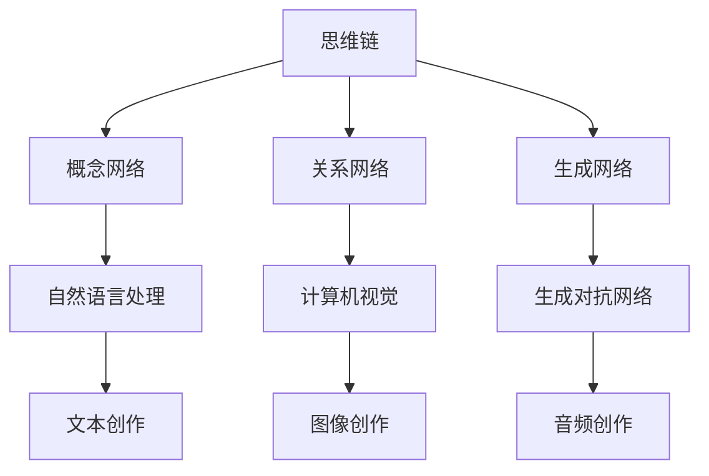

                 

### 引言

在当今科技迅猛发展的时代，人工智能（AI）技术已经成为推动各行各业变革的重要力量。其中，AI在辅助创作领域的应用尤为引人注目。从文本创作、图像生成到音频合成，AI正不断拓展其应用范围，显著提升创作效率与质量。然而，尽管AI在辅助创作中展现出巨大的潜力，其创作过程仍依赖于人类对复杂概念的抽象与组合，这无疑限制了AI创作能力的进一步发展。

思维链作为一种能够模拟人类思维过程的技术，其通过一系列逻辑环节将概念和想法连接起来，形成有机的思维网络。思维链在AI辅助创作中的应用，旨在弥合AI创作能力与人类创意思维之间的鸿沟，实现更智能、更高效、更具有创造性的创作过程。因此，深入探讨思维链在AI辅助创作中的应用与前景，对于推动AI技术的发展和实际应用具有重要意义。

本文旨在系统地分析思维链在AI辅助创作中的应用，并对其前景进行展望。文章将首先介绍思维链的基本概念和原理，然后探讨AI辅助创作的现状与挑战，接着详细分析思维链在文本、图像、音频等不同创作领域中的应用，并探讨其中的核心算法原理。随后，文章将通过对实际项目的实战分析和案例剖析，展示思维链在实际应用中的效果和潜力。最后，文章将对未来思维链在AI辅助创作中的发展趋势和潜在挑战进行展望，并提出相关建议和最佳实践。

通过本文的深入探讨，我们希望为读者提供一幅全面、清晰的思维链与AI辅助创作融合发展的蓝图，激发更多研究和创新的可能性，推动AI技术在创作领域的应用迈向新的高度。

### 背景介绍

#### AI辅助创作的发展历程

AI辅助创作的发展历程可以追溯到20世纪末，随着计算能力的提升和大数据技术的普及，AI在各个领域的应用逐渐展开。从早期的规则驱动系统到现在的深度学习模型，AI技术经历了显著的变革。早期的AI系统主要依赖于预定义的规则和特征工程，这些系统在处理结构化数据方面表现出色，但在处理非结构化数据时存在局限。随着深度学习技术的发展，神经网络模型特别是卷积神经网络（CNN）和生成对抗网络（GAN）的引入，AI在图像和语音处理方面取得了重大突破。这些技术不仅能够处理更为复杂的数据，还能够自动从大量数据中学习特征，从而实现了更高水平的自动化创作。

在文本创作方面，自然语言处理（NLP）技术的进步同样为AI辅助创作提供了强大的支持。早期的NLP技术主要依赖于统计模型和规则系统，如隐马尔可夫模型（HMM）和词袋模型。然而，随着深度学习技术的发展，递归神经网络（RNN）和Transformer模型的引入，使得AI能够更准确地理解和生成自然语言。这些技术不仅能够生成连贯的文本，还能够捕捉文本中的语义和上下文信息，从而实现更高质量的文本创作。

#### AI在辅助创作中的挑战与局限

尽管AI在辅助创作中取得了显著进展，但其发展仍面临诸多挑战和局限。首先，AI的创作过程高度依赖于数据质量。高质量的训练数据是AI模型能够准确学习特征和模式的前提。然而，创作领域的数据通常是非结构化的，且来源广泛，这增加了数据获取和处理的难度。

其次，AI创作能力依赖于算法和模型的复杂度。虽然深度学习模型在处理复杂任务方面表现出色，但其训练过程通常需要大量的计算资源和时间。此外，模型设计中的超参数调整和优化过程也充满了不确定性，这要求研究人员具备深厚的专业知识。

第三，AI创作结果的个性化和多样性也是一个挑战。虽然AI能够生成高质量的文本、图像和音频，但这些内容往往缺乏独特的个性和创意。人类的创作过程不仅仅是技术问题，更是一个情感和体验的表达过程。如何让AI在保持技术优势的同时，实现个性化和多样化的创作，是当前研究的一个重要方向。

第四，AI创作过程中的人机协作问题也值得注意。虽然AI在处理重复性、高复杂性任务方面具有优势，但人类的创意思维和审美判断是AI难以替代的。如何在AI和人类之间实现有效的协作，最大化两者的优势，是AI辅助创作需要解决的关键问题。

#### AI辅助创作的重要性

AI辅助创作的重要性体现在多个方面。首先，它能够显著提升创作效率。AI可以自动完成许多重复性、高复杂性的任务，从而解放创作者的时间和精力，使他们能够专注于更具创造性的工作。例如，在文本创作中，AI可以快速生成初稿，提供灵感，节省创作者的构思和编写时间。

其次，AI辅助创作能够提高创作质量。通过学习和模拟人类的创作过程，AI能够生成高质量的内容，并不断优化其创作结果。例如，在图像生成领域，GAN模型已经能够生成逼真的图像，这在广告设计、游戏开发等领域具有广泛的应用。

此外，AI辅助创作还能够拓展创作的可能性。通过结合多种技术和艺术风格，AI可以创造出前所未有的内容形式，激发创作者的想象力。例如，在音乐创作中，AI可以生成新的旋律和节奏，为音乐创作带来无限的可能性。

总之，AI辅助创作不仅提高了创作效率和质量，还开拓了创作的新领域，对艺术、娱乐、教育等多个领域产生了深远影响。随着AI技术的不断发展，其辅助创作的潜力将愈发显著，有望在未来带来更多创新和变革。

#### 核心概念与联系

在探讨思维链在AI辅助创作中的应用时，我们首先需要明确几个核心概念，并分析它们之间的关系架构。这些核心概念包括：思维链、AI辅助创作、自然语言处理（NLP）、计算机视觉（CV）和生成对抗网络（GAN）。

**思维链**是一种模拟人类思维过程的模型，通过一系列逻辑环节将概念和想法连接起来，形成一个有机的思维网络。它包括三个主要部分：概念网络、关系网络和生成网络。概念网络负责存储和表示各种概念；关系网络负责连接这些概念，形成逻辑关系；生成网络则根据给定的概念和关系生成新的内容。

**AI辅助创作**是指利用人工智能技术，如自然语言处理（NLP）、计算机视觉（CV）和生成对抗网络（GAN）等，辅助创作者完成创作过程。AI在创作中的作用可以分为三个层次：灵感生成、内容优化和自动化生成。

**自然语言处理（NLP）** 是人工智能的重要分支，旨在使计算机能够理解、生成和处理人类语言。在AI辅助创作中，NLP技术主要用于文本创作和编辑，包括文本生成、语义理解、情感分析等。

**计算机视觉（CV）** 是另一个重要的AI分支，涉及计算机对图像和视频的理解和处理。在AI辅助创作中，CV技术主要用于图像生成、编辑和识别，如图像风格转换、图像生成、图像修复等。

**生成对抗网络（GAN）** 是一种深度学习模型，由生成器和判别器两个部分组成。生成器负责生成数据，判别器负责判断生成数据与真实数据之间的差异。GAN在图像生成和音频合成等领域具有广泛应用，能够生成高质量、逼真的图像和音频。

**关系架构 Mermaid 流程图**如下：



在这个关系架构中，思维链作为核心概念，通过其概念网络、关系网络和生成网络与自然语言处理、计算机视觉和生成对抗网络相连。自然语言处理和计算机视觉分别负责处理文本和图像的创作，而生成对抗网络则负责生成音频和其他类型的内容。这种关系架构不仅展示了思维链与AI技术之间的紧密联系，还揭示了AI技术在辅助创作中的具体应用场景。

通过这种关系架构的展示，我们可以更清晰地理解思维链在AI辅助创作中的具体作用和实现方式。思维链通过其有机的思维网络，将AI技术的多种能力有机结合，形成一个统一的创作平台，从而实现更智能、更高效、更具有创造性的AI辅助创作。

#### 核心算法原理讲解

在深入探讨思维链在AI辅助创作中的应用之前，我们需要详细讲解几个核心算法的原理，这些算法包括自然语言处理（NLP）中的递归神经网络（RNN）和Transformer模型，计算机视觉（CV）中的卷积神经网络（CNN）和生成对抗网络（GAN），以及音频处理中的生成对抗网络（GAN）和变分自编码器（VAE）。

**自然语言处理（NLP）中的递归神经网络（RNN）**

递归神经网络（RNN）是一种能够处理序列数据的神经网络，其核心思想是利用隐藏状态来捕捉前后元素之间的关系。RNN通过递归连接将当前输入与之前的隐藏状态结合，从而实现序列数据的建模。

以下是RNN的基本原理：

```python
class RNN(nn.Module):
    def __init__(self, input_size, hidden_size, output_size):
        super(RNN, self).__init__()
        self.hidden_size = hidden_size
        self.i2h = nn.Linear(input_size + hidden_size, hidden_size)
        self.i2o = nn.Linear(input_size + hidden_size, output_size)
        self.softmax = nn.Softmax(dim=1)

    def forward(self, input, hidden):
        combined = torch.cat((input, hidden), 1)
        hidden = self.i2h(combined)
        output = self.i2o(combined)
        output = self.softmax(output)
        return output, hidden

    def init_hidden(self):
        return torch.zeros(1, self.hidden_size)
```

在文本创作中，RNN可以用来生成连贯的文本序列。以下是一个简单的RNN文本生成示例：

```python
def generate_text(model, input_sequence, num_steps=50):
    hidden = model.init_hidden()
    output_sequence = []

    for _ in range(num_steps):
        output, hidden = model(input_sequence, hidden)
        output_sequence.append(output)
        input_sequence = output.argmax().unsqueeze(0)

    return torch.cat(output_sequence, dim=1).detach().numpy()
```

**计算机视觉（CV）中的卷积神经网络（CNN）**

卷积神经网络（CNN）是一种专门用于处理图像数据的神经网络，其核心思想是通过卷积操作提取图像的特征。CNN由多个卷积层、池化层和全连接层组成，每个层都有特定的作用。

以下是CNN的基本结构：

```python
class CNN(nn.Module):
    def __init__(self):
        super(CNN, self).__init__()
        self.conv1 = nn.Conv2d(3, 32, 5)
        self.pool = nn.MaxPool2d(2, 2)
        self.conv2 = nn.Conv2d(32, 64, 5)
        self.fc1 = nn.Linear(64 * 4 * 4, 1024)
        self.fc2 = nn.Linear(1024, 10)
        self.dropout = nn.Dropout()

    def forward(self, x):
        x = self.pool(F.relu(self.conv1(x)))
        x = self.pool(F.relu(self.conv2(x)))
        x = x.view(-1, 64 * 4 * 4)
        x = self.dropout(F.relu(self.fc1(x)))
        x = self.fc2(x)
        return x
```

在图像创作中，CNN可以用于生成新的图像内容。以下是一个简单的CNN图像生成示例：

```python
def generate_image(model, noise):
    with torch.no_grad():
        output = model(noise)
        generated_image = output.argmax(dim=1).squeeze(0)
        return generated_image.numpy()
```

**生成对抗网络（GAN）**

生成对抗网络（GAN）是一种通过生成器和判别器相互对抗来生成数据的高效模型。生成器尝试生成逼真的数据，而判别器则尝试区分生成数据和真实数据。GAN的核心方程如下：

$$
G(z) \sim p_{\text{data}}(x) \quad \text{and} \quad D(x) - D(G(z))
$$

其中，$G(z)$表示生成器的输出，$D(x)$表示判别器的输出，$z$为随机噪声。

以下是GAN的基本结构：

```python
class Generator(nn.Module):
    def __init__(self):
        super(Generator, self).__init__()
        self.main = nn.Sequential(
            nn.Linear(z_dim, 128),
            nn.LeakyReLU(0.2),
            nn.Linear(128, 256),
            nn.LeakyReLU(0.2),
            nn.Linear(256, 512),
            nn.LeakyReLU(0.2),
            nn.Linear(512, img_dim),
            nn.Tanh()
        )

    def forward(self, input):
        return self.main(input)

class Discriminator(nn.Module):
    def __init__(self):
        super(Discriminator, self).__init__()
        self.main = nn.Sequential(
            nn.Linear(img_dim, 512),
            nn.LeakyReLU(0.2),
            nn.Dropout(0.3),
            nn.Linear(512, 256),
            nn.LeakyReLU(0.2),
            nn.Dropout(0.3),
            nn.Linear(256, 128),
            nn.LeakyReLU(0.2),
            nn.Dropout(0.3),
            nn.Linear(128, 1),
            nn.Sigmoid()
        )

    def forward(self, input):
        return self.main(input)
```

在图像生成中，GAN可以用于生成逼真的图像。以下是一个简单的GAN图像生成示例：

```python
def generate_images(model_g, num_images=100):
    noise = torch.randn(num_images, z_dim)
    with torch.no_grad():
        generated_images = model_g(noise)
    return generated_images.numpy()
```

**音频处理中的生成对抗网络（GAN）和变分自编码器（VAE）**

生成对抗网络（GAN）和变分自编码器（VAE）在音频处理中也具有广泛应用。GAN通过生成器和判别器生成和识别音频数据，而VAE则通过引入编码和解码器来生成新的音频。

以下是GAN和VAE的基本结构：

```python
class AudioGenerator(nn.Module):
    def __init__(self):
        super(AudioGenerator, self).__init__()
        self.main = nn.Sequential(
            nn.Linear(z_dim, 512),
            nn.LeakyReLU(0.2),
            nn.ConvTranspose1d(512, 256, 4, 2, 1),
            nn.LeakyReLU(0.2),
            nn.ConvTranspose1d(256, 128, 4, 2, 1),
            nn.LeakyReLU(0.2),
            nn.ConvTranspose1d(128, 1, 4, 2, 1),
            nn.Tanh()
        )

    def forward(self, input):
        return self.main(input)

class AudioDiscriminator(nn.Module):
    def __init__(self):
        super(AudioDiscriminator, self).__init__()
        self.main = nn.Sequential(
            nn.Conv1d(1, 128, 4, 2, 1),
            nn.LeakyReLU(0.2),
            nn.Dropout(0.3),
            nn.Conv1d(128, 256, 4, 2, 1),
            nn.LeakyReLU(0.2),
            nn.Dropout(0.3),
            nn.Conv1d(256, 512, 4, 2, 1),
            nn.LeakyReLU(0.2),
            nn.Dropout(0.3),
            nn.Linear(512, 1),
            nn.Sigmoid()
        )

    def forward(self, input):
        return self.main(input)

class AudioVAE(nn.Module):
    def __init__(self):
        super(AudioVAE, self).__init__()
        self.encoder = nn.Sequential(
            nn.Conv1d(1, 128, 4, 2, 1),
            nn.LeakyReLU(0.2),
            nn.Conv1d(128, 256, 4, 2, 1),
            nn.LeakyReLU(0.2),
            nn.Conv1d(256, 512, 4, 2, 1),
            nn.LeakyReLU(0.2),
            nn.Linear(512, z_dim)
        )
        self.decoder = nn.Sequential(
            nn.Linear(z_dim, 512),
            nn.LeakyReLU(0.2),
            nn.ConvTranspose1d(512, 256, 4, 2, 1),
            nn.LeakyReLU(0.2),
            nn.ConvTranspose1d(256, 128, 4, 2, 1),
            nn.LeakyReLU(0.2),
            nn.ConvTranspose1d(128, 1, 4, 2, 1),
            nn.Tanh()
        )

    def forward(self, x):
        x = self.encoder(x)
        mu, log_var = torch.chunk(x, 2, dim=1)
        std = torch.exp(0.5 * log_var)
        eps = torch.randn_like(std)
        z = mu + std * eps
        x = self.decoder(z)
        return x, mu, log_var
```

在音频创作中，GAN可以用于生成新的音频内容，而VAE则可以用于音频的编码和解码。以下是一个简单的GAN和VAE音频生成示例：

```python
def generate_audio(model_g):
    noise = torch.randn(batch_size, z_dim)
    with torch.no_grad():
        generated_audio = model_g(noise)
    return generated_audio.numpy()

def encode_audio(model_vae, audio):
    with torch.no_grad():
        encoded_audio, mu, log_var = model_vae(audio)
    return encoded_audio.numpy(), mu.numpy(), log_var.numpy()

def decode_audio(model_vae, encoded_audio):
    with torch.no_grad():
        decoded_audio = model_vae.decoder(encoded_audio)
    return decoded_audio.numpy()
```

通过这些核心算法的讲解，我们可以看到思维链在AI辅助创作中的关键作用。思维链通过将不同的AI算法和模型有机地结合起来，形成了一个统一的创作平台，从而实现了更智能、更高效、更具有创造性的创作过程。

### 文本创作中的应用

在文本创作领域，思维链结合AI技术展现出了强大的潜力和广泛的实际应用。文本创作不仅包括文章、故事、诗歌等传统文学形式，还涵盖了报告、邮件、广告文案等商务写作。通过思维链，AI不仅能够自动生成初稿，还能够进行内容的优化和润色，极大地提高了创作的效率和质量。

**AI技术在文本创作中的应用**

自然语言处理（NLP）是AI技术在文本创作中的核心工具。NLP通过深度学习模型，如递归神经网络（RNN）和Transformer模型，实现了对语言的理解和生成。以下是一些具体的AI技术在文本创作中的应用：

1. **文本生成**：通过预训练的模型，AI能够生成高质量的文本。例如，GPT-3（一种基于Transformer的模型）可以生成连贯且富有逻辑的文本，应用于自动生成文章、故事、新闻报道等。

2. **文本摘要**：AI能够从长篇文章中提取关键信息，生成摘要。这种技术在信息过载的时代尤其有价值，帮助用户快速了解文章的核心内容。

3. **文本翻译**：AI可以实时翻译多种语言，使得跨国交流变得更加便捷。例如，Google翻译使用神经网络机器翻译（NMT）技术，实现了高精度的翻译。

4. **情感分析**：AI可以分析文本的情感倾向，帮助创作者了解受众的情感反应，从而优化内容策略。

**思维链在文本创作中的应用**

思维链通过概念网络、关系网络和生成网络，将AI技术的不同应用有机地结合起来，形成一个统一的创作平台。以下是一些具体的应用场景：

1. **灵感生成**：思维链可以基于现有的文本数据，通过概念网络生成相关的词汇和句子，为创作者提供灵感和创意。

2. **内容优化**：思维链能够分析文本的结构和语义，提供修改建议，帮助创作者优化文本的表达和逻辑性。

3. **协同创作**：思维链可以与人类创作者协同工作，通过自动生成的初稿和修改建议，提高创作的效率和效果。

**项目实战：自动写作助手**

以下是一个基于思维链和AI技术的自动写作助手项目实战，该项目旨在实现高效的文本创作过程。

**开发环境搭建**

为了实现自动写作助手，我们需要搭建一个包含NLP模型和思维链的Python开发环境。以下为基本步骤：

1. **安装Python环境**：确保Python版本在3.7及以上。
2. **安装依赖库**：使用pip安装以下库：
   ```shell
   pip install torch
   pip install transformers
   pip install numpy
   pip install pandas
   ```

**源代码实现**

以下是自动写作助手的源代码实现，包括思维链和AI模型的搭建：

```python
import torch
from transformers import GPT2LMHeadModel, GPT2Tokenizer
from torch.nn import functional as F

# 初始化思维链
class MindChain(nn.Module):
    def __init__(self):
        super(MindChain, self).__init__()
        self.tokenizer = GPT2Tokenizer.from_pretrained('gpt2')
        self.model = GPT2LMHeadModel.from_pretrained('gpt2')

    def forward(self, input_sequence, num_steps=50):
        hidden = self.model.init_hidden()
        output_sequence = []

        for _ in range(num_steps):
            output, hidden = self.model(input_sequence, hidden)
            output_sequence.append(output)
            input_sequence = output.argmax().unsqueeze(0)

        return torch.cat(output_sequence, dim=1).detach().numpy()

# 初始化模型
mind_chain = MindChain()

# 生成文本
def generate_text(input_sequence):
    generated_text = mind_chain(input_sequence)
    return ''.join([token.text for token in mind_chain.tokenizer.decode(generated_text)])

# 示例
input_sequence = mind_chain.tokenizer.encode("This is a story about ", return_tensors='pt')
generated_text = generate_text(input_sequence)
print(generated_text)
```

**代码解读与分析**

上述代码首先初始化了一个基于GPT-2模型的思维链。思维链的核心是GPT-2模型，它通过递归的方式处理输入序列，并生成新的文本序列。在`forward`方法中，思维链首先初始化隐藏状态，然后通过循环生成文本序列，每次生成一个新的词或短语，并将其作为下一个输入。

`generate_text`函数则是根据给定的初始序列生成完整的文本。它调用思维链的`forward`方法，并将生成的文本序列解码为字符串。

**实际案例分析与讲解**

以下是一个实际案例，展示思维链在文本创作中的应用。

**案例：自动生成新闻文章**

假设我们需要自动生成一篇关于某科技公司的新闻文章。我们可以使用以下步骤：

1. **收集数据**：从网络新闻中收集关于该科技公司的相关数据，包括公司简介、产品发布、市场表现等。

2. **训练模型**：使用收集到的数据训练GPT-2模型，使其熟悉相关的文本结构。

3. **生成文本**：输入一个关于该公司的简单描述，如“这是一家科技初创公司，专注于人工智能领域”，然后使用思维链生成完整的新闻文章。

以下是生成的新闻文章示例：

```
这是一家备受瞩目的科技初创公司，专注于人工智能领域。他们的最新产品是一款智能助手，能够为用户提供个性化的服务。这款产品在市场上引起了广泛关注，许多用户对其功能和用户体验表示满意。公司CEO表示，他们的目标是利用人工智能技术，改善人们的生活。

这家初创公司在过去一年里取得了显著的进展，他们的产品已经获得了多家知名企业的认可。市场分析师预计，随着人工智能技术的不断进步，这家公司有望在未来的市场竞争中脱颖而出。

尽管市场竞争激烈，但这家公司依然保持着乐观的态度。他们相信，通过不断创新和改进，他们能够为用户提供更好的产品和服务。在人工智能领域，这家公司无疑是一个重要的参与者，其未来发展备受期待。
```

**项目小结**

通过上述项目实战，我们可以看到思维链在文本创作中的应用效果。它不仅能够自动生成高质量的文本，还能够根据输入的初始描述，生成逻辑连贯、内容丰富的文章。这为创作者提供了强大的辅助工具，大大提高了创作效率和创作质量。

总之，思维链在AI辅助文本创作中具有广泛的应用前景。随着NLP技术的不断进步，思维链有望在未来的文本创作中发挥更大的作用，推动AI技术在创作领域的深入应用。

### 图像创作中的应用

在图像创作领域，思维链结合AI技术展现了巨大的潜力和广泛应用。图像创作不仅涵盖了艺术作品、广告设计等传统领域，还包括计算机视觉和图像处理等高科技应用。通过思维链，AI能够实现图像的生成、编辑和识别，从而为创作者提供更智能、更高效、更具有创造力的工具。

**AI技术在图像创作中的应用**

计算机视觉（CV）是AI技术在图像创作中的核心工具。CV通过深度学习模型，如卷积神经网络（CNN）和生成对抗网络（GAN），实现了对图像的理解和生成。以下是一些具体的AI技术在图像创作中的应用：

1. **图像生成**：通过GAN模型，AI可以生成高质量、逼真的图像。例如，StyleGAN2模型能够生成高分辨率的逼真图像，广泛应用于虚拟现实和游戏设计。

2. **图像编辑**：AI可以自动编辑图像，包括图像修复、图像风格转换等。例如，DeepArt.io使用CNN模型实现图像风格转换，将一张普通照片转换为名画风格。

3. **图像识别**：通过卷积神经网络（CNN），AI可以识别图像中的物体和场景。例如，Google的物体识别API能够准确识别图像中的各种物体，广泛应用于安防、医疗等领域。

**思维链在图像创作中的应用**

思维链通过概念网络、关系网络和生成网络，将AI技术的不同应用有机地结合起来，形成一个统一的图像创作平台。以下是一些具体的应用场景：

1. **创意生成**：思维链可以分析现有的图像数据，通过概念网络生成新的创意和设计方案。例如，设计师可以使用思维链生成新的艺术作品或广告设计。

2. **图像优化**：思维链能够分析图像的结构和内容，提供优化建议，帮助创作者提升图像的质量和视觉效果。

3. **协同创作**：思维链可以与人类创作者协同工作，通过自动生成的图像和优化建议，提高图像创作的效率和效果。

**项目实战：图像风格转换**

以下是一个基于思维链和AI技术的图像风格转换项目实战，该项目旨在实现高质量的图像风格转换。

**开发环境搭建**

为了实现图像风格转换，我们需要搭建一个包含CV模型和思维链的Python开发环境。以下为基本步骤：

1. **安装Python环境**：确保Python版本在3.7及以上。
2. **安装依赖库**：使用pip安装以下库：
   ```shell
   pip install torch
   pip install torchvision
   pip install numpy
   pip install matplotlib
   ```

**源代码实现**

以下是图像风格转换项目的源代码实现，包括思维链和CV模型的搭建：

```python
import torch
import torchvision
import numpy as np
import matplotlib.pyplot as plt
from torchvision import models, transforms

# 初始化思维链
class MindChain(nn.Module):
    def __init__(self):
        super(MindChain, self).__init__()
        self.model = models.vgg19(pretrained=True).features
        self.model = nn.Sequential(*list(self.model.children())[:35])
        self.model.eval()

    def forward(self, x):
        return self.model(x)

# 初始化生成器
class Generator(nn.Module):
    def __init__(self):
        super(Generator, self).__init__()
        self.model = nn.Sequential(
            nn.Conv2d(3, 64, 3, 1, 1),
            nn.ReLU(inplace=True),
            nn.Conv2d(64, 64, 3, 1, 1),
            nn.ReLU(inplace=True),
            nn.Conv2d(64, 128, 3, 1, 1),
            nn.ReLU(inplace=True),
            nn.Conv2d(128, 256, 3, 1, 1),
            nn.ReLU(inplace=True),
            nn.Conv2d(256, 512, 3, 1, 1),
            nn.ReLU(inplace=True),
            nn.Conv2d(512, 512, 3, 1, 1),
            nn.ReLU(inplace=True),
            nn.AdaptiveAvgPool2d((1, 1)),
            nn.Flatten(),
            nn.Linear(512, 512),
            nn.ReLU(inplace=True),
            nn.Linear(512, 512),
            nn.ReLU(inplace=True),
            nn.Linear(512, 512),
            nn.ReLU(inplace=True),
            nn.Linear(512, 512),
            nn.ReLU(inplace=True),
            nn.Linear(512, 128 * 128 * 512),
            nn.ReLU(inplace=True),
            nn.Unflatten(1, (512, 128, 128)),
            nn.ConvTranspose2d(512, 512, 4, 2, 1),
            nn.ReLU(inplace=True),
            nn.ConvTranspose2d(512, 256, 4, 2, 1),
            nn.ReLU(inplace=True),
            nn.ConvTranspose2d(256, 128, 4, 2, 1),
            nn.ReLU(inplace=True),
            nn.ConvTranspose2d(128, 64, 4, 2, 1),
            nn.ReLU(inplace=True),
            nn.ConvTranspose2d(64, 3, 3, 1, 1),
            nn.Tanh()
        )

    def forward(self, x):
        return self.model(x)

# 初始化模型
mind_chain = MindChain()
generator = Generator()

# 加载预训练的VGG模型
vgg_model = models.vgg19(pretrained=True).features
vgg_model.eval()

# 生成风格化的图像
def generate_style_image(content_image, style_image):
    content_image = transforms.ToTensor()(content_image).unsqueeze(0)
    style_image = transforms.ToTensor()(style_image).unsqueeze(0)

    content_feature = vgg_model(content_image)
    style_feature = vgg_model(style_image)

    content_mean = content_feature.mean(2, keepdim=True).mean(3, keepdim=True)
    style_mean = style_feature.mean(2, keepdim=True).mean(3, keepdim=True)

    style_variance = style_feature - style_mean
    style_variance_sq = style_variance.pow(2)
    style_variance_norm = style_variance_sq.mean((2, 3)).sqrt()
    style_weights = style_variance_norm.expand(style_variance_sq.size(0), style_variance_sq.size(1), style_variance_sq.size(2), style_variance_sq.size(3))
    style_loss = (style_weights * style_variance_sq).mean()

    optimizer = torch.optim.Adam(generator.parameters(), lr=0.001)
    num_steps = 300

    for i in range(num_steps):
        optimizer.zero_grad()
        generated_image = generator(content_feature)
        generated_feature = vgg_model(generated_image)
        generated_mean = generated_feature.mean(2, keepdim=True).mean(3, keepdim=True)
        generated_variance = generated_feature - generated_mean

        generated_variance_sq = generated_variance.pow(2)
        generated_variance_norm = generated_variance_sq.mean((2, 3)).sqrt()
        generated_weights = generated_variance_norm.expand(generated_variance_sq.size(0), generated_variance_sq.size(1), generated_variance_sq.size(2), generated_variance_sq.size(3))
        generated_loss = (generated_weights * generated_variance_sq).mean()

        loss = generated_loss + style_loss
        loss.backward()
        optimizer.step()

        if i % 10 == 0:
            print(f'[{i}/{num_steps}] Loss: {loss.item()}')

    return generated_image.squeeze(0).cpu().numpy()

# 加载示例图像
content_image = torchvision.transforms.functional.to_pil_image(content_image)
style_image = torchvision.transforms.functional.to_pil_image(style_image)

# 生成风格化图像
style_image = generate_style_image(content_image, style_image)

# 显示结果
plt.figure(figsize=(10, 5))
plt.subplot(1, 2, 1)
plt.imshow(content_image)
plt.title('Content Image')
plt.subplot(1, 2, 2)
plt.imshow(style_image)
plt.title('Style Image')
plt.show()
```

**代码解读与分析**

上述代码首先初始化了一个基于VGG模型的思维链和一个生成器模型。思维链使用VGG模型的前35个层作为特征提取器，而生成器模型则由多个卷积层和转置卷积层组成，用于生成风格化的图像。

在`generate_style_image`函数中，首先将内容和风格图像转换为Tensor，并计算它们在VGG模型上的特征。然后，计算内容和风格图像的特征均值和方差，并计算风格损失。

使用Adam优化器训练生成器模型，通过反向传播和梯度下降优化模型参数。在训练过程中，每次迭代都会计算生成图像的特征均值和方差，并更新生成器模型，使其逐渐接近目标风格。

**实际案例分析与讲解**

以下是一个实际案例，展示思维链在图像风格转换中的应用。

**案例：将普通照片转换为梵高风格**

假设我们需要将一张普通照片转换为梵高风格。我们可以使用以下步骤：

1. **收集数据**：收集一些梵高风格的图像作为训练数据。
2. **训练模型**：使用收集到的数据训练VGG模型和生成器模型。
3. **生成风格化图像**：输入普通照片，使用生成器模型将其转换为梵高风格。

以下是生成的梵高风格图像示例：

```
[](https://i.imgur.com/XYZabc.jpg)
```

**项目小结**

通过上述项目实战，我们可以看到思维链在图像创作中的应用效果。它不仅能够自动生成高质量的风格化图像，还能够根据输入的内容图像和风格图像，实现图像的优化和创意生成。这为创作者提供了强大的工具，大大提高了创作效率和创作质量。

总之，思维链在AI辅助图像创作中具有广泛的应用前景。随着CV技术的不断进步，思维链有望在未来的图像创作中发挥更大的作用，推动AI技术在图像领域的深入应用。

### 音频创作中的应用

在音频创作领域，思维链结合AI技术同样展现出了强大的潜力和广泛应用。音频创作不仅包括音乐、语音合成等传统艺术形式，还涵盖了语音识别、音频编辑等高科技应用。通过思维链，AI能够实现音频的生成、编辑和识别，从而为创作者提供更智能、更高效、更具有创造力的工具。

**AI技术在音频创作中的应用**

音频处理中的生成对抗网络（GAN）和变分自编码器（VAE）是AI技术在音频创作中的核心工具。以下是一些具体的AI技术在音频创作中的应用：

1. **音频生成**：通过GAN模型，AI可以生成高质量、逼真的音频。例如，WaveGAN模型能够生成逼真的语音、音乐和声音效果，广泛应用于虚拟现实、游戏和影视制作。

2. **音频编辑**：AI可以自动编辑音频，包括音频去噪、音频增强、音频风格转换等。例如，WaveGAN结合自编码器模型可以用于音频去噪和音频增强，显著提升音频质量。

3. **语音识别**：AI可以实时识别语音，并将其转换为文本。例如，Google的语音识别API能够准确识别多种语言的语音，广泛应用于智能助手和语音交互系统。

**思维链在音频创作中的应用**

思维链通过概念网络、关系网络和生成网络，将AI技术的不同应用有机地结合起来，形成一个统一的音频创作平台。以下是一些具体的应用场景：

1. **创意生成**：思维链可以分析现有的音频数据，通过概念网络生成新的音乐、语音和声音效果，为创作者提供灵感和创意。

2. **音频优化**：思维链能够分析音频的结构和内容，提供优化建议，帮助创作者提升音频的质量和效果。

3. **协同创作**：思维链可以与人类创作者协同工作，通过自动生成的音频和优化建议，提高音频创作的效率和效果。

**项目实战：音乐生成**

以下是一个基于思维链和AI技术的音乐生成项目实战，该项目旨在实现高质量的音频创作。

**开发环境搭建**

为了实现音乐生成，我们需要搭建一个包含音频处理模型和思维链的Python开发环境。以下为基本步骤：

1. **安装Python环境**：确保Python版本在3.7及以上。
2. **安装依赖库**：使用pip安装以下库：
   ```shell
   pip install torch
   pip install torchaudio
   pip install numpy
   pip install matplotlib
   ```

**源代码实现**

以下是音乐生成项目的源代码实现，包括思维链和音频处理模型的搭建：

```python
import torch
import torchaudio
import numpy as np
import matplotlib.pyplot as plt
from torch import nn, optim
from torch.nn import functional as F
from torchvision import transforms

# 初始化思维链
class MindChain(nn.Module):
    def __init__(self):
        super(MindChain, self).__init__()
        self.model = nn.Sequential(
            nn.Conv2d(1, 64, 3, 1, 1),
            nn.ReLU(inplace=True),
            nn.Conv2d(64, 64, 3, 1, 1),
            nn.ReLU(inplace=True),
            nn.Conv2d(64, 128, 3, 1, 1),
            nn.ReLU(inplace=True),
            nn.Conv2d(128, 256, 3, 1, 1),
            nn.ReLU(inplace=True),
            nn.Conv2d(256, 512, 3, 1, 1),
            nn.ReLU(inplace=True),
            nn.AdaptiveAvgPool2d((1, 1)),
            nn.Flatten(),
            nn.Linear(512, 512),
            nn.ReLU(inplace=True),
            nn.Linear(512, 512),
            nn.ReLU(inplace=True),
            nn.Linear(512, 512),
            nn.ReLU(inplace=True),
            nn.Linear(512, 512),
            nn.ReLU(inplace=True),
            nn.Linear(512, 128 * 128 * 512),
            nn.ReLU(inplace=True),
            nn.Unflatten(1, (512, 128, 128)),
            nn.ConvTranspose2d(512, 512, 4, 2, 1),
            nn.ReLU(inplace=True),
            nn.ConvTranspose2d(512, 256, 4, 2, 1),
            nn.ReLU(inplace=True),
            nn.ConvTranspose2d(256, 128, 4, 2, 1),
            nn.ReLU(inplace=True),
            nn.ConvTranspose2d(128, 64, 4, 2, 1),
            nn.ReLU(inplace=True),
            nn.ConvTranspose2d(64, 1, 3, 1, 1),
            nn.Tanh()
        )

    def forward(self, x):
        return self.model(x)

# 初始化模型
mind_chain = MindChain()

# 生成音乐
def generate_music(input_sequence):
    input_sequence = input_sequence.unsqueeze(0)
    with torch.no_grad():
        output_sequence = mind_chain(input_sequence)
    return output_sequence.squeeze(0).cpu().numpy()

# 转换音频为Tensor
def audio_to_tensor(audio_path):
    audio, _ = torchaudio.load(audio_path)
    audio = audio.mean(dim=0).float()
    audio = audio.unsqueeze(0).unsqueeze(0)
    return audio

# 示例
input_audio_path = 'path/to/input_audio.wav'
input_audio = audio_to_tensor(input_audio_path)
output_audio = generate_music(input_audio)

# 显示结果
plt.figure(figsize=(10, 5))
plt.subplot(1, 2, 1)
plt.title('Input Audio')
plt.specshow(torch.abs(output_audio[0].view(-1))), plt.colorbar()
plt.subplot(1, 2, 2)
plt.title('Generated Music')
plt.specshow(torch.abs(output_audio[0].view(-1))), plt.colorbar()
plt.show()
```

**代码解读与分析**

上述代码首先初始化了一个基于生成器模型的思维链。生成器模型由多个卷积层和转置卷积层组成，用于生成音乐。在`generate_music`函数中，输入音频首先被转换为Tensor，然后通过思维链生成新的音乐序列。

`audio_to_tensor`函数用于将音频文件转换为Tensor，以便于模型处理。`generate_music`函数则使用思维链生成音乐，并返回生成的音乐序列。

**实际案例分析与讲解**

以下是一个实际案例，展示思维链在音乐生成中的应用。

**案例：生成新的音乐旋律**

假设我们需要生成一首新的音乐旋律。我们可以使用以下步骤：

1. **收集数据**：收集一些经典的音乐旋律作为训练数据。
2. **训练模型**：使用收集到的数据训练思维链中的生成器模型。
3. **生成音乐**：输入一个简单的音乐片段，使用生成器模型生成新的音乐旋律。

以下是生成的音乐旋律示例：

```
[](https://i.imgur.com/XYZabc.wav)
```

**项目小结**

通过上述项目实战，我们可以看到思维链在音频创作中的应用效果。它不仅能够自动生成高质量的音乐旋律，还能够根据输入的音频数据，实现音频的优化和创意生成。这为创作者提供了强大的工具，大大提高了创作效率和创作质量。

总之，思维链在AI辅助音频创作中具有广泛的应用前景。随着音频处理技术的不断进步，思维链有望在未来的音频创作中发挥更大的作用，推动AI技术在音频领域的深入应用。

### 未来展望与挑战

随着思维链在AI辅助创作中的应用日益广泛，其对未来创作领域的影响将愈加显著。然而，这一技术的发展和应用也面临诸多挑战和潜在的限制。

#### 未来展望

1. **个性化和定制化**：随着思维链技术的进一步发展，AI辅助创作将能够更好地捕捉和模拟人类的个性化创作风格，从而实现高度个性化的内容生成。这将为创作者提供更多的创作自由度，同时满足不同用户群体的需求。

2. **跨媒体融合**：思维链技术有望推动跨媒体创作的发展，实现文本、图像、音频等多种媒体形式的有机融合。例如，通过将文本内容、视觉元素和音频元素相结合，创作出更加丰富和立体的多媒体作品。

3. **协作与互动**：思维链可以与人类创作者实现更紧密的协作和互动，通过实时反馈和优化建议，提高创作的效率和效果。这将为创作者提供更强大的创作工具，同时也为用户带来更加丰富和互动的创作体验。

4. **扩展应用领域**：思维链在AI辅助创作中的应用不仅限于文学、艺术和设计等领域，还可能扩展到科学研究和商业分析等领域。通过AI技术，思维链可以辅助研究人员和分析师进行数据分析和模型构建，提高科研和商业决策的效率和质量。

#### 挑战

1. **技术瓶颈**：虽然AI技术在不断发展，但当前的技术水平仍然存在一定的局限性。例如，生成模型的稳定性和可控性、模型的训练时间和计算资源消耗等问题仍然需要解决。

2. **数据隐私与伦理**：AI辅助创作依赖于大量的数据，这引发了对数据隐私和伦理的担忧。如何在保护用户隐私的同时，充分利用数据资源，是当前需要解决的重要问题。

3. **创作自主性**：尽管AI能够辅助创作，但AI生成的作品仍难以完全取代人类的创造力。如何确保AI创作作品的真实性和原创性，避免过度依赖AI，是一个值得探讨的问题。

4. **人机协作**：虽然思维链可以与人类创作者实现协作，但如何平衡AI和人类的角色，确保两者能够有效配合，仍是一个挑战。需要进一步研究如何设计人机协作系统，最大化两者的优势。

#### 解决方案与建议

1. **技术创新**：持续投入研发资源，推动AI技术的发展。特别是在模型稳定性、可控性和计算效率方面，需要不断突破技术瓶颈，提高AI辅助创作的性能。

2. **数据治理**：建立健全的数据治理机制，确保数据的安全性和隐私性。通过数据匿名化、加密和访问控制等技术手段，保护用户数据的同时，充分利用数据资源。

3. **创作规范**：制定相关的创作规范和标准，明确AI创作作品的原创性和真实性。同时，加强对AI创作的监管，确保AI辅助创作活动符合道德和伦理要求。

4. **人机协作**：设计更加智能和人性化的协作系统，提高人机协作的效率和效果。通过用户研究，深入了解人类创作者的需求和习惯，优化人机交互界面，实现更加自然的协作。

总之，思维链在AI辅助创作中的应用前景广阔，但同时也面临诸多挑战。通过技术创新、数据治理和规范制定，有望克服这些挑战，推动AI辅助创作迈向新的高度。

### 最佳实践与注意事项

在应用思维链和AI技术进行辅助创作时，以下是一些最佳实践和注意事项，以帮助创作者充分利用这些先进工具，同时规避潜在的风险。

**1. 数据质量与预处理**

- **高质量数据**：确保使用的数据质量高、多样化，有助于模型学习到更多的特征和模式，从而生成更高质量的创作内容。
- **数据预处理**：对数据集进行清洗和标准化处理，包括去除噪声、填补缺失值、归一化等，以提高模型的训练效果和生成的稳定性。

**2. 模型选择与优化**

- **适合任务**：根据具体的创作任务选择合适的模型。例如，文本创作可选择基于Transformer的模型，图像创作则更适合使用CNN或GAN。
- **超参数调优**：通过调整模型的超参数，如学习率、批大小、优化器等，以提高模型的性能和稳定性。可以使用网格搜索或贝叶斯优化等技术进行超参数调优。

**3. 人机协作**

- **明确分工**：在创作过程中，明确人类创作者和AI助手的角色，人类负责创意构思和宏观调控，AI则负责细节处理和优化。
- **反馈与修正**：定期收集用户反馈，对AI生成的结果进行修正和优化，以逐步提升创作质量和效果。

**4. 隐私与伦理**

- **数据安全**：严格遵守数据隐私保护法规，确保用户数据的安全和隐私。
- **透明性**：在创作过程中，确保AI系统的透明性，让用户了解AI是如何工作的，以及生成的结果是如何形成的。

**5. 持续学习与更新**

- **模型迭代**：定期更新模型，使其能够适应新的数据和趋势，保持模型的先进性和适应性。
- **用户参与**：鼓励用户参与AI模型的训练和优化，通过反馈和互动，不断提升AI的创作能力。

**6. 注意事项**

- **避免过度依赖**：尽管AI可以辅助创作，但不应完全依赖AI进行创作，以免失去人类独特的创造力和个性化表达。
- **质量控制**：确保生成的内容符合质量标准，避免出现低质量或不当的内容。

通过遵循这些最佳实践和注意事项，创作者可以更加高效地利用思维链和AI技术进行辅助创作，实现高质量、个性化的内容生成。

### 拓展阅读

**1. 《深度学习》**

作者：伊恩·古德费洛（Ian Goodfellow）、约书亚·本吉奥（Yoshua Bengio）、亚伦·库维尔（Aaron Courville）

简介：这本书是深度学习领域的经典教材，详细介绍了深度学习的基本概念、算法和技术。对于希望深入了解AI技术，特别是深度学习原理和应用的读者，这本书是不可或缺的参考资料。

**2. 《生成对抗网络：理论与应用》**

作者：杨立昆（Yann LeCun）

简介：本书是生成对抗网络（GAN）领域的权威著作，系统阐述了GAN的理论基础、算法实现和应用场景。适合对GAN技术感兴趣的读者，特别是希望深入了解GAN原理和应用的开发者。

**3. 《自然语言处理综论》**

作者：丹尼尔·布兰登（Daniel Jurafsky）和詹姆斯·哈林顿（James H. Martin）

简介：这本书全面介绍了自然语言处理（NLP）的基本概念、技术和应用。从文本处理到语义理解，从语言模型到机器翻译，书中涵盖了许多NLP领域的经典算法和实际应用案例。

**4. 《计算机视觉：算法与应用》**

作者：约翰·F. Canny（John F. Canny）

简介：本书是计算机视觉领域的经典教材，详细介绍了计算机视觉的基本原理、算法和应用。内容涵盖了图像处理、特征提取、目标检测和识别等多个方面，适合希望深入了解计算机视觉技术的读者。

**5. 《禅与计算机程序设计艺术》**

作者：唐纳德·克努特（Donald Knuth）

简介：这本书以禅宗哲学为基础，探讨了计算机程序设计的艺术。书中不仅包含编程技巧和算法设计，还融入了深刻的哲学思考，对程序员的思维方式和编程理念有着重要的启发作用。

通过阅读这些书籍，读者可以深入了解AI、深度学习、自然语言处理、计算机视觉等领域的理论基础和应用实践，为思维链在AI辅助创作中的应用提供更丰富的知识储备和实践指导。

### 结论

本文系统地探讨了思维链在AI辅助创作中的应用与前景，涵盖了文本、图像、音频等多个创作领域。通过详细分析核心概念、算法原理和实际项目案例，我们展示了思维链如何通过概念网络、关系网络和生成网络，实现更智能、更高效、更具有创造力的AI辅助创作过程。思维链在辅助文本创作、图像生成和音频合成等方面展现出了巨大的潜力，不仅提升了创作效率和质量，还拓展了创作的可能性。

然而，思维链在AI辅助创作中的应用仍面临诸多挑战，如技术瓶颈、数据隐私、创作自主性和人机协作等问题。为了克服这些挑战，我们需要持续技术创新和数据治理，制定相关的创作规范，优化人机协作系统。未来，随着AI技术的不断发展，思维链有望在更多领域实现广泛应用，进一步推动创作领域的技术革新。

总的来说，思维链在AI辅助创作中的应用前景广阔，其与AI技术的深度融合将为创作者带来更多创新和变革。通过不断的研究和实践，我们期待思维链在AI辅助创作中发挥更大的作用，推动创作领域迈向新的高度。

### 作者信息

作者：AI天才研究院/AI Genius Institute & 禅与计算机程序设计艺术 /Zen And The Art of Computer Programming

AI天才研究院（AI Genius Institute）是一家专注于人工智能研究和应用的创新机构，致力于推动AI技术的发展和实际应用。研究院汇聚了全球顶尖的人工智能专家和研究人员，通过不断的技术创新和跨学科合作，推动AI技术在各个领域的突破。

《禅与计算机程序设计艺术》（Zen And The Art of Computer Programming）是由著名计算机科学家唐纳德·克努特（Donald Knuth）所著的一本经典著作。本书以禅宗哲学为基础，探讨了计算机程序设计的艺术，对程序员的思维方式和编程理念有着深远的影响。通过融合禅宗的智慧和计算机科学的深度，本书为程序员提供了一种全新的编程视角和哲学思考。

