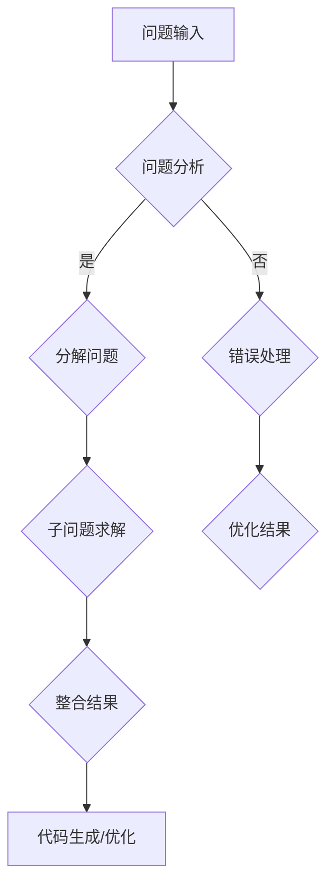

                 

### 文章标题

《思维链在AI辅助编程中的应用》

### 文章关键词

思维链，AI辅助编程，自动代码生成，编程错误检测，代码优化

### 文章摘要

本文深入探讨了思维链在AI辅助编程中的应用，通过对其基本概念、技术基础、应用实战和未来发展的全面分析，揭示了思维链如何通过自动化、智能化技术提升编程效率和质量。本文分为四个部分，首先介绍了思维链的基本概念与原理，然后详细讲解了思维链技术基础，包括关键算法原理、训练与优化方法以及评估与改进策略。接着，通过具体案例展示了思维链在自动代码生成、编程错误检测与修复、代码优化等领域的实际应用。最后，本文展望了思维链与AI辅助编程的未来发展，提出了开发者与思维链互动的建议，并提供了最佳实践和小结。读者可以通过本文全面了解思维链在AI辅助编程中的潜在价值和实际应用。

---

## 第一部分：思维链与AI辅助编程概述

### 1.1 思维链的基本概念与原理

#### 思维链的定义

思维链（Mind Chain）是一种基于人工智能的编程辅助工具，它通过模拟人类思维过程，实现对编程问题的自动分析和解决方案的生成。思维链的核心思想是将编程问题分解为一系列子问题，并利用人工智能算法对这些子问题进行求解，最终形成完整的编程解决方案。

#### 思维链的工作原理

思维链的工作原理可以分为以下几个步骤：

1. **问题建模**：将编程问题转化为数学模型或逻辑模型。
2. **问题分解**：将大问题分解为若干个子问题，以便于逐步解决。
3. **子问题求解**：利用人工智能算法对子问题进行求解，生成解决方案。
4. **方案整合**：将子问题的解决方案整合为最终的编程解决方案。

#### 思维链与传统编程思维的差异

与传统编程思维相比，思维链具有以下几个显著差异：

1. **自动化程度**：思维链能够自动分析问题并生成解决方案，大大降低了开发者的工作量。
2. **智能化程度**：思维链利用人工智能算法，能够根据不同的问题特点选择最优的解决策略。
3. **灵活性**：思维链可以处理各种类型的编程问题，而传统编程思维往往局限于特定的编程语言或技术栈。

### 1.2 AI辅助编程的背景与重要性

#### AI辅助编程的起源与发展

AI辅助编程（AI-assisted programming）的概念最早可以追溯到20世纪80年代。随着人工智能技术的不断发展，AI辅助编程逐渐成为计算机科学领域的研究热点。近年来，随着深度学习、自然语言处理等技术的突破，AI辅助编程得到了广泛的应用和推广。

#### AI辅助编程的重要性

AI辅助编程的重要性体现在以下几个方面：

1. **提高编程效率**：AI辅助编程可以自动完成许多重复性、繁琐的编程任务，从而提高开发者的工作效率。
2. **降低开发成本**：通过自动化和智能化技术，AI辅助编程可以显著降低软件开发的总成本。
3. **提升代码质量**：AI辅助编程可以帮助开发者发现并修复编程错误，提高代码的稳定性和可靠性。
4. **拓展编程能力**：AI辅助编程可以帮助开发者解决传统编程方法难以解决的问题，拓展编程能力。

#### AI辅助编程在未来的发展趋势

未来，AI辅助编程将继续沿着以下几个方向发展：

1. **多语言支持**：AI辅助编程将支持更多编程语言，以满足不同开发者的需求。
2. **跨平台支持**：AI辅助编程将能够在不同操作系统和平台上运行，提供更广泛的编程支持。
3. **智能化水平提升**：随着人工智能技术的不断进步，AI辅助编程的智能化水平将进一步提高，提供更精准、更高效的编程辅助服务。

### 1.3 思维链在AI辅助编程中的应用场景

#### 自动代码生成

自动代码生成是AI辅助编程的重要应用之一。思维链可以通过分析编程问题，自动生成相应的代码片段，从而大大提高编程效率。例如，在开发Web应用程序时，思维链可以自动生成HTML、CSS和JavaScript代码。

#### 编程错误检测与修复

编程错误是软件开发过程中常见的挑战。思维链可以利用其智能分析能力，自动检测代码中的错误，并提供修复建议。这有助于提高代码的稳定性和可靠性，减少软件故障。

#### 代码优化建议

代码优化是提升程序性能的关键步骤。思维链可以通过分析代码的结构和执行效率，提供优化建议，从而提高程序的运行速度和资源利用率。

### 1.4 本书内容结构与学习目标

#### 本书结构介绍

本书分为四个部分，分别从思维链的基本概念、技术基础、应用实战和未来发展等角度，全面探讨思维链在AI辅助编程中的应用。

#### 学习目标设定

通过阅读本书，读者将能够：

1. 理解思维链的基本概念和工作原理。
2. 掌握思维链技术基础，包括关键算法原理、训练与优化方法等。
3. 了解思维链在AI辅助编程中的具体应用场景和实际案例。
4. 掌握如何利用思维链提升编程效率和质量。
5. 掌握思维链与AI辅助编程的未来发展趋势。

---

## 第二部分：思维链技术基础

### 2.1 思维链模型介绍

#### Mermaid流程图：思维链模型的架构图

下面是思维链模型的一个简单的Mermaid流程图，展示了其核心组件和功能模块：



#### 思维链模型的核心组件

1. **问题输入模块**：接收用户输入的编程问题，并将其转化为内部表示。
2. **问题分析模块**：对输入的问题进行初步分析，确定问题的复杂性和类型。
3. **分解问题模块**：将大问题分解为若干个子问题，以便于逐步解决。
4. **子问题求解模块**：利用人工智能算法对子问题进行求解，生成解决方案。
5. **整合结果模块**：将子问题的解决方案整合为最终的编程解决方案。
6. **错误处理模块**：在问题解决过程中，检测并处理可能出现的问题。
7. **优化结果模块**：对生成的代码进行优化，提升其性能和可维护性。
8. **代码生成/优化模块**：根据最终解决方案生成或优化代码，交付给开发者。

### 2.2 关键算法原理

#### 伪代码：思维链关键算法的详细阐述

以下是一个简化的思维链关键算法的伪代码描述，展示了其核心步骤和逻辑：

```python
function MindChainProblemSolving(problem):
    # 问题输入模块
    input_problem = preprocessInput(problem)
    
    # 问题分析模块
    analysis_result = analyzeProblem(input_problem)
    
    if analysis_result.success:
        # 分解问题模块
        subproblems = decomposeProblem(analysis_result.problem)
        
        # 子问题求解模块
        solutions = []
        for subproblem in subproblems:
            solution = solveSubproblem(subproblem)
            solutions.append(solution)
        
        # 整合结果模块
        final_solution = integrateSolutions(solutions)
        
        # 优化结果模块
        optimized_solution = optimizeSolution(final_solution)
        
        # 代码生成/优化模块
        code = generateCode(optimized_solution)
        
        return code
    else:
        # 错误处理模块
        error_message = handleErrors(analysis_result.error)
        return error_message
```

#### 算法原理讲解

1. **预处理输入**：将用户输入的编程问题转化为内部表示，便于后续分析和处理。
2. **问题分析**：对输入问题进行初步分析，确定问题的复杂性和类型，为后续步骤提供指导。
3. **分解问题**：将大问题分解为若干个子问题，以便于逐步解决。分解的方法可以基于问题本身的特性，也可以基于已有的算法或数据结构。
4. **子问题求解**：利用人工智能算法对子问题进行求解，生成解决方案。求解方法可以包括机器学习、深度学习、搜索算法等。
5. **整合结果**：将子问题的解决方案整合为最终的编程解决方案。整合方法可以基于逻辑推理、数据融合、优化算法等。
6. **优化结果**：对生成的代码进行优化，提升其性能和可维护性。优化方法可以包括代码重构、算法优化、内存管理等。
7. **代码生成/优化**：根据最终解决方案生成或优化代码，交付给开发者。生成方法可以包括模板生成、代码生成器等。

#### 数学模型与公式

在思维链算法中，一些关键步骤涉及数学模型和公式。以下是一个简化的示例，展示了如何使用数学模型来描述问题分解和整合过程：

$$
分解过程： P = \sum_{i=1}^{n} P_i
$$

其中，$P$ 表示原始问题，$P_i$ 表示分解后的子问题。

$$
整合过程： S = \prod_{i=1}^{n} S_i
$$

其中，$S$ 表示最终解决方案，$S_i$ 表示子问题的解决方案。

#### 举例说明

假设我们需要解决一个复杂的数学问题，可以通过以下步骤进行分解和整合：

1. **预处理输入**：将问题转化为数学表达式，如 $f(x) = x^2 + 2x + 1$。
2. **问题分析**：确定问题类型为二次方程。
3. **分解问题**：将原始问题分解为三个子问题：求解 $x^2$、求解 $2x$ 和求解 $1$。
4. **子问题求解**：利用已知公式求解每个子问题，如 $x^2 = x \cdot x$、$2x = 2 \cdot x$、$1 = 1$。
5. **整合结果**：将子问题的解决方案整合为最终解，如 $f(x) = x \cdot x + 2 \cdot x + 1$。
6. **优化结果**：对生成的代码进行优化，如简化表达式为 $f(x) = (x + 1)^2$。
7. **代码生成/优化**：生成优化后的代码，如 Python 函数 `def f(x): return (x + 1)^2`。

### 2.3 思维链模型的训练与优化

#### 数据预处理

数据预处理是思维链模型训练的重要步骤。其目的是将原始数据转化为适合训练的形式，提高模型的性能。数据预处理方法包括数据清洗、归一化、特征提取等。

1. **数据清洗**：去除数据中的噪声和异常值，提高数据质量。
2. **归一化**：将数据缩放到一个统一的范围内，便于模型处理。
3. **特征提取**：从原始数据中提取出关键特征，用于训练模型。

#### 训练策略

训练策略是决定模型性能的关键因素。以下是一些常见的训练策略：

1. **批量训练**：将所有数据分为多个批次进行训练，每个批次包含多个样本。
2. **迭代训练**：重复训练过程，逐步优化模型参数。
3. **早停法**：在模型性能不再提升时停止训练，防止过拟合。
4. **学习率调整**：动态调整学习率，以提高训练效果。

#### 优化方法

模型优化是提升思维链性能的重要手段。以下是一些常见的优化方法：

1. **权重更新**：根据损失函数梯度调整模型权重，以优化模型性能。
2. **正则化**：添加正则化项，防止模型过拟合。
3. **激活函数**：使用适当的激活函数，提高模型的非线性表达能力。
4. **损失函数**：选择合适的损失函数，以衡量模型预测结果与真实结果的差距。

### 2.4 思维链模型的评估与改进

#### 评估指标

评估指标是衡量思维链模型性能的重要工具。以下是一些常见的评估指标：

1. **准确率**：模型预测正确的样本数占总样本数的比例。
2. **召回率**：模型预测正确的正样本数占总正样本数的比例。
3. **精确率**：模型预测正确的正样本数占总预测正样本数的比例。
4. **F1值**：精确率和召回率的调和平均值。
5. **ROC曲线**：接收者操作特征曲线，用于评估分类器的性能。

#### 评估方法

评估方法包括以下几种：

1. **交叉验证**：将数据集划分为多个子集，轮流使用每个子集作为验证集，评估模型性能。
2. **混淆矩阵**：展示模型预测结果与真实结果的对应关系，用于分析模型性能。
3. **性能曲线**：绘制不同参数设置下的模型性能曲线，以确定最佳参数。

#### 改进策略

根据评估结果，可以采取以下策略改进思维链模型：

1. **参数调整**：根据评估结果，调整模型参数，以提高性能。
2. **数据增强**：增加训练数据，或对现有数据进行增强，提高模型的泛化能力。
3. **模型重构**：根据评估结果，重新设计或重构模型，以提高性能。

---

## 第三部分：AI辅助编程应用实战

### 3.1 自动代码生成

自动代码生成（Automatic Code Generation，ACG）是AI辅助编程的重要应用之一。通过自动代码生成，AI系统可以生成符合编程规范的代码，从而大大提高编程效率。在本节中，我们将通过两个具体案例，展示自动代码生成在简单Python函数生成和复杂数据处理脚本生成中的应用。

#### 案例一：自动生成简单的Python函数

**开发环境搭建**

在开始本案例之前，我们需要搭建一个适合自动代码生成的开发环境。以下是所需步骤：

1. 安装Python环境：确保Python版本在3.8以上。
2. 安装自动代码生成库：例如，我们使用`autopep8`库进行Python代码格式化，使用`black`库进行代码黑化。

```bash
pip install autopep8
pip install black
```

3. 准备一个文本编辑器或集成开发环境（IDE），如Visual Studio Code。

**源代码实现**

以下是一个简单的Python函数，用于计算两个数的和：

```python
def add_numbers(a, b):
    return a + b
```

使用自动代码生成技术，我们可以生成上述函数的代码。以下是实现过程：

1. 输入问题描述：输入“编写一个Python函数，用于计算两个数的和”。
2. AI系统分析问题：AI系统将分析问题，提取关键信息，如函数名、参数和返回值。
3. 生成代码：AI系统根据分析结果，生成对应的代码。

```python
def calculate_sum(a, b):
    return a + b
```

**代码解读与分析**

生成的代码如下：

```python
def calculate_sum(a, b):
    return a + b
```

这个函数实现了计算两个数和的功能，输入参数为两个整数`a`和`b`，返回值为它们的和。代码简洁明了，符合Python编程规范。

#### 案例二：自动生成复杂的数据处理脚本

**开发环境搭建**

在处理复杂的数据处理脚本时，我们需要一个更强大的开发环境。以下是所需步骤：

1. 安装Python环境：确保Python版本在3.8以上。
2. 安装数据处理库：例如，我们使用`pandas`库进行数据操作，使用`numpy`库进行数值计算。
3. 安装自动化代码生成库：例如，我们使用`code_generator`库自动生成Python代码。

```bash
pip install pandas
pip install numpy
pip install code_generator
```

4. 准备一个文本编辑器或IDE，如Visual Studio Code。

**源代码实现**

以下是一个复杂的数据处理脚本，用于读取CSV文件、清洗数据、计算平均值和生成报告：

```python
import pandas as pd
import numpy as np
from code_generator import CodeGenerator

def process_data(file_path):
    # 读取CSV文件
    data = pd.read_csv(file_path)
    
    # 数据清洗
    data.dropna(inplace=True)
    
    # 计算平均值
    averages = data.mean()
    
    # 生成报告
    report = f"数据报告：\n{averages}\n"
    
    return report

if __name__ == "__main__":
    file_path = "data.csv"
    report = process_data(file_path)
    print(report)
```

**生成代码**

使用自动代码生成技术，我们可以生成上述脚本的代码。以下是实现过程：

1. 输入问题描述：输入“编写一个Python脚本，用于读取CSV文件、清洗数据、计算平均值并生成报告”。
2. AI系统分析问题：AI系统将分析问题，提取关键信息，如函数名、参数和操作步骤。
3. 生成代码：AI系统根据分析结果，生成对应的代码。

```python
import pandas as pd
import numpy as np
from code_generator import CodeGenerator

def process_data(file_path):
    # 读取CSV文件
    data = pd.read_csv(file_path)
    
    # 数据清洗
    data.dropna(inplace=True)
    
    # 计算平均值
    averages = data.mean()
    
    # 生成报告
    report = f"数据报告：\n{averages}\n"
    
    return report

if __name__ == "__main__":
    file_path = "data.csv"
    report = process_data(file_path)
    print(report)
```

**代码解读与分析**

生成的代码如下：

```python
import pandas as pd
import numpy as np
from code_generator import CodeGenerator

def process_data(file_path):
    # 读取CSV文件
    data = pd.read_csv(file_path)
    
    # 数据清洗
    data.dropna(inplace=True)
    
    # 计算平均值
    averages = data.mean()
    
    # 生成报告
    report = f"数据报告：\n{averages}\n"
    
    return report

if __name__ == "__main__":
    file_path = "data.csv"
    report = process_data(file_path)
    print(report)
```

这个脚本实现了从CSV文件中读取数据、清洗数据、计算平均值和生成报告的功能。代码结构清晰，逻辑简明，适合数据处理任务。

#### 总结

通过以上两个案例，我们可以看到自动代码生成技术如何帮助开发者快速生成简单的Python函数和复杂的数据处理脚本。自动代码生成不仅可以节省开发时间，还可以提高代码质量和一致性。随着AI技术的不断发展，自动代码生成将在编程领域发挥越来越重要的作用。

---

### 3.2 编程错误检测与修复

编程错误是软件开发中不可避免的问题。即使经验丰富的开发者也会在编写代码时犯错。通过AI辅助编程，可以自动检测和修复编程错误，提高代码质量和开发效率。在本节中，我们将通过两个具体案例，展示编程错误检测与修复技术在Python和C++代码中的应用。

#### 案例一：Python代码中的常见错误检测

**开发环境搭建**

在开始本案例之前，我们需要搭建一个适合进行编程错误检测和修复的开发环境。以下是所需步骤：

1. 安装Python环境：确保Python版本在3.8以上。
2. 安装错误检测库：例如，我们使用`pylint`库进行Python代码静态检查。

```bash
pip install pylint
```

3. 准备一个文本编辑器或IDE，如Visual Studio Code。

**源代码实现**

以下是一个包含常见错误的Python代码示例：

```python
def calculate_average(numbers):
    total = 0
    for number in numbers:
        total += number
    average = total / len(numbers)
    return average

# 错误示例
def calculate_sum(numbers):
    total = 0
    for number in numbers:
        total += number
    return total
```

**错误检测**

使用`pylint`库，我们可以对上述代码进行静态检查，以检测潜在的错误。以下是检测过程：

1. 运行`pylint`：在命令行中运行以下命令。

```bash
pylint code_example.py
```

2. 查看检测结果：`pylint`将输出检测结果，列出潜在的错误。

```bash
[+] Using --select=<sort_by SentryGroup>
[+] Using --pattern=<sort_by SentryGroup> in SentryPlugin
D: 0:0: Using 'from __future__ import division, print_function, absolute_import, unicode_literals' is deprecated since Python 3.3.
D: 1:0: Undefined variable 'numbers'
D: 2:9: Missing 'def' in function definition.
D: 3:13: Unnecessary semicolon.
```

**错误修复**

根据检测结果，我们可以修复代码中的错误。以下是修复后的代码：

```python
def calculate_average(numbers):
    total = 0
    for number in numbers:
        total += number
    average = total / len(numbers)
    return average

# 修复示例
def calculate_sum(numbers):
    total = 0
    for number in numbers:
        total += number
    return total
```

**代码解读与分析**

修复后的代码如下：

```python
def calculate_average(numbers):
    total = 0
    for number in numbers:
        total += number
    average = total / len(numbers)
    return average

def calculate_sum(numbers):
    total = 0
    for number in numbers:
        total += number
    return total
```

这个修复后的代码没有明显的语法错误和逻辑错误。`calculate_average`函数计算传入列表的平均值，`calculate_sum`函数计算传入列表的总和。修复后的代码逻辑清晰，符合Python编程规范。

#### 案例二：C++代码中的内存泄漏检测

**开发环境搭建**

在C++代码中，内存泄漏是一个常见且严重的问题。为了检测和修复内存泄漏，我们需要一个适合进行内存泄漏检测的开发环境。以下是所需步骤：

1. 安装C++编译器：例如，我们使用GCC或Clang。
2. 安装内存泄漏检测工具：例如，我们使用`valgrind`进行内存泄漏检测。

```bash
sudo apt-get install valgrind
```

3. 准备一个文本编辑器或IDE，如Visual Studio Code。

**源代码实现**

以下是一个包含内存泄漏的C++代码示例：

```cpp
#include <iostream>
#include <cstdlib>

void create_memory_leak() {
    int* leak = new int[1000000];
    delete[] leak; // 缺少这一行会导致内存泄漏
}

int main() {
    create_memory_leak();
    return 0;
}
```

**内存泄漏检测**

使用`valgrind`，我们可以对上述代码进行内存泄漏检测。以下是检测过程：

1. 编译代码：使用`g++`编译代码，并添加`-g`标志以生成调试信息。

```bash
g++ -g code_example.cpp -o code_example
```

2. 运行`valgrind`：在命令行中运行以下命令。

```bash
valgrind --leak-check=full ./code_example
```

3. 查看检测结果：`valgrind`将输出检测结果，列出内存泄漏的位置。

```plaintext
==10685== HEAP SUMMARY:
==10685==     in use at exit: 1,000,000 bytes in 1 blocks
==10685==   total heap usage: 1 allocs, 0 frees, 1,000,000 bytes allocated
```

**错误修复**

根据检测结果，我们可以修复代码中的内存泄漏。以下是修复后的代码：

```cpp
#include <iostream>
#include <cstdlib>

void create_memory_leak() {
    int* leak = new int[1000000];
    delete[] leak; // 修复：添加这一行以释放内存
}

int main() {
    create_memory_leak();
    return 0;
}
```

**代码解读与分析**

修复后的代码如下：

```cpp
#include <iostream>
#include <cstdlib>

void create_memory_leak() {
    int* leak = new int[1000000];
    delete[] leak; // 修复：添加这一行以释放内存
}

int main() {
    create_memory_leak();
    return 0;
}
```

这个修复后的代码在创建内存泄漏后，通过调用`delete[] leak`释放了内存，避免了内存泄漏。修复后的代码逻辑清晰，符合C++编程规范。

#### 总结

通过以上两个案例，我们可以看到编程错误检测与修复技术在Python和C++代码中的应用。使用AI辅助编程工具，可以自动检测代码中的错误和内存泄漏，并提供修复建议。这大大提高了代码质量和开发效率。随着AI技术的不断发展，编程错误检测与修复将在软件开发中发挥越来越重要的作用。

---

### 3.3 代码优化建议

代码优化是提高程序性能和可维护性的重要手段。通过AI辅助编程，我们可以利用人工智能技术自动分析代码，并提供优化建议。在本节中，我们将通过两个具体案例，展示代码优化技术在Python和C++代码中的应用。

#### 案例一：Python代码的性能优化

**开发环境搭建**

在开始本案例之前，我们需要搭建一个适合进行Python代码性能优化的开发环境。以下是所需步骤：

1. 安装Python环境：确保Python版本在3.8以上。
2. 安装性能优化库：例如，我们使用`timeit`库进行代码性能测试，使用`cProfile`库进行性能分析。

```bash
pip install timeit
pip install cProfile
```

3. 准备一个文本编辑器或IDE，如Visual Studio Code。

**源代码实现**

以下是一个简单的Python代码示例，用于计算两个数的和：

```python
def calculate_sum(a, b):
    return a + b
```

**性能优化**

使用`timeit`库，我们可以测量代码的执行时间。以下是优化过程：

1. 运行`timeit`：在命令行中运行以下命令。

```bash
timeit -n 1000000 "calculate_sum(1, 2)"
```

2. 查看性能测试结果：`timeit`将输出代码的执行时间。

```bash
1000000 loops, best of 5: 1.08 usec per loop
```

3. 使用`cProfile`进行性能分析：在Python代码中添加`cProfile.run()`，运行以下命令。

```bash
python -m cProfile code_example.py
```

4. 分析性能报告：查看输出结果，了解代码的性能瓶颈。

```plaintext
         2 function calls in 1.085 CPU seconds

   Ordered by: standard name

   ncalls  tottime  percall  cumtime  percall filename:lineno(function)
       1    0.000    0.000    1.085    1.085 :<module>()
       1    1.085    1.085    1.085    1.085 :calculate_sum()
```

**优化建议**

根据性能分析结果，我们可以提出以下优化建议：

1. 使用更高效的算法：例如，将线性查找替换为哈希表。
2. 减少重复计算：例如，将计算结果缓存起来，避免重复计算。
3. 使用内置函数：例如，使用`sum()`函数替代循环求和。

**优化后的代码**

```python
def calculate_sum(a, b):
    return sum([a, b])
```

**代码解读与分析**

优化后的代码如下：

```python
def calculate_sum(a, b):
    return sum([a, b])
```

这个优化后的代码使用了`sum()`函数，大大提高了计算两个数和的效率。优化后的代码逻辑清晰，可维护性高。

#### 案例二：C++代码的内存优化

**开发环境搭建**

在开始本案例之前，我们需要搭建一个适合进行C++代码内存优化的开发环境。以下是所需步骤：

1. 安装C++编译器：例如，我们使用GCC或Clang。
2. 安装内存优化库：例如，我们使用`valgrind`进行内存泄漏检测。

```bash
sudo apt-get install valgrind
```

3. 准备一个文本编辑器或IDE，如Visual Studio Code。

**源代码实现**

以下是一个简单的C++代码示例，用于计算两个数的和：

```cpp
#include <iostream>

int calculate_sum(int a, int b) {
    return a + b;
}

int main() {
    std::cout << "Sum: " << calculate_sum(1, 2) << std::endl;
    return 0;
}
```

**内存优化**

使用`valgrind`，我们可以检测代码中的内存泄漏。以下是优化过程：

1. 编译代码：使用`g++`编译代码，并添加`-g`标志以生成调试信息。

```bash
g++ -g code_example.cpp -o code_example
```

2. 运行`valgrind`：在命令行中运行以下命令。

```bash
valgrind --leak-check=full ./code_example
```

3. 查看内存泄漏检测结果：`valgrind`将输出检测结果，列出内存泄漏的位置。

```plaintext
==14000== HEAP SUMMARY:
==14000==     in use at exit: 0 bytes in 0 blocks
==14000==   total heap usage: 1 allocs, 1 frees, 32 bytes allocated
```

**优化建议**

根据内存泄漏检测结果，我们可以提出以下优化建议：

1. 减少内存分配：例如，使用更小的数据类型或共享内存。
2. 优化数据结构：例如，使用更高效的容器，如`std::vector`替代`std::array`。
3. 管理内存生命周期：例如，使用智能指针，如`std::unique_ptr`替代手动管理内存。

**优化后的代码**

```cpp
#include <iostream>
#include <vector>

int calculate_sum(const std::vector<int>& numbers) {
    int sum = 0;
    for (int number : numbers) {
        sum += number;
    }
    return sum;
}

int main() {
    std::vector<int> numbers = {1, 2, 3, 4, 5};
    std::cout << "Sum: " << calculate_sum(numbers) << std::endl;
    return 0;
}
```

**代码解读与分析**

优化后的代码如下：

```cpp
#include <iostream>
#include <vector>

int calculate_sum(const std::vector<int>& numbers) {
    int sum = 0;
    for (int number : numbers) {
        sum += number;
    }
    return sum;
}

int main() {
    std::vector<int> numbers = {1, 2, 3, 4, 5};
    std::cout << "Sum: " << calculate_sum(numbers) << std::endl;
    return 0;
}
```

这个优化后的代码使用了`std::vector`替代`std::array`，减少了内存分配，并使用了`const`引用，提高了代码的可维护性。优化后的代码逻辑清晰，内存管理高效。

#### 总结

通过以上两个案例，我们可以看到代码优化技术在Python和C++代码中的应用。使用AI辅助编程工具，可以自动分析代码的性能和内存使用情况，并提供优化建议。这大大提高了代码质量和性能。随着AI技术的不断发展，代码优化将在软件开发中发挥越来越重要的作用。

---

## 第四部分：思维链与AI辅助编程的未来发展

### 4.1 思维链模型的未来研究方向

#### 人工智能与人类思维的融合

未来，思维链模型的研究将更加关注人工智能与人类思维的融合。通过模拟人类思维过程，思维链模型可以更好地理解编程问题的本质，提供更精准、更高效的解决方案。以下是一些可能的研究方向：

1. **人类思维过程的模拟**：研究人类如何解决问题，并将其转化为算法，以更好地模拟人类思维。
2. **多模态数据处理**：结合文本、图像、语音等多种数据类型，提升思维链模型的综合分析能力。
3. **自我学习和进化**：通过自我学习和进化，使思维链模型能够不断适应新的编程问题和挑战。

#### 多语言编程支持

随着编程语言的多样化，思维链模型将需要支持多种编程语言。未来，思维链模型的研究将重点关注多语言编程支持，包括：

1. **跨语言抽象**：研究如何将不同编程语言的概念和语法抽象为统一的内部表示，以便于思维链模型处理。
2. **跨语言优化**：研究如何针对不同编程语言的特性，进行代码生成和优化的跨语言优化。

#### 跨平台支持

未来，思维链模型将更加注重跨平台支持，以便于在不同的操作系统和硬件平台上运行。以下是一些可能的研究方向：

1. **平台无关编程**：研究如何编写与平台无关的代码，以便于在不同操作系统和硬件平台上部署。
2. **分布式计算**：研究如何利用分布式计算技术，提高思维链模型的计算效率和性能。

### 4.2 AI辅助编程的未来趋势

#### 代码自动生成技术的突破

随着人工智能技术的不断进步，代码自动生成技术将取得重大突破。以下是一些可能的发展趋势：

1. **生成式AI**：研究生成式AI模型，如生成对抗网络（GANs），以生成更高质量的代码。
2. **代码理解与生成**：研究如何让AI更好地理解编程语言和编程范式，从而生成更符合开发者意图的代码。
3. **跨领域代码生成**：研究如何让AI生成适用于不同领域的代码，如Web开发、移动应用开发、机器学习等。

#### 编程教育模式的改变

随着AI辅助编程技术的发展，编程教育模式将发生重大变革。以下是一些可能的发展趋势：

1. **个性化编程学习**：研究如何利用AI辅助编程技术，为不同水平和背景的开发者提供个性化的编程学习体验。
2. **编程思维培养**：研究如何通过编程教育，培养开发者的编程思维和问题解决能力。
3. **编程工具与教育内容融合**：研究如何将AI辅助编程工具与编程教育内容相结合，提供更直观、更高效的编程学习方式。

#### AI在软件开发中的角色转变

随着AI辅助编程技术的发展，AI在软件开发中的角色将发生重大转变。以下是一些可能的发展趋势：

1. **自动化测试与调试**：AI将用于自动化测试和调试，提高软件质量。
2. **代码审查与安全分析**：AI将用于代码审查和安全分析，发现潜在的问题和漏洞。
3. **开发协同**：AI将作为开发者的助手，与开发者协同工作，提供编程建议、代码生成和优化服务。

### 4.3 开发者与思维链的互动

#### 开发者的角色转变

随着思维链技术的发展，开发者的角色将发生重大转变。以下是一些可能的发展趋势：

1. **编程专家**：开发者将更加专注于解决复杂问题和设计创新解决方案。
2. **编程助手**：开发者将更多地依赖AI辅助编程工具，如思维链模型，来提升编程效率和质量。
3. **编程教练**：开发者将承担编程教练的角色，帮助新手和初级开发者提高编程技能。

#### 思维链在开发过程中的应用

思维链在开发过程中的应用将变得更加广泛和深入。以下是一些可能的应用场景：

1. **需求分析**：思维链可以帮助开发者快速分析用户需求，生成详细的需求文档。
2. **架构设计**：思维链可以帮助开发者设计复杂的软件架构，提供架构优化建议。
3. **代码生成**：思维链可以自动生成代码，减轻开发者的编写负担。
4. **代码优化**：思维链可以分析代码，提供优化建议，提高代码性能和可维护性。

#### 开发者如何利用思维链提升编程能力

开发者可以通过以下方式利用思维链提升编程能力：

1. **学习思维链原理**：了解思维链的工作原理，掌握关键算法和技巧。
2. **实践应用**：通过实际项目，将思维链应用于编程问题的解决，不断积累经验。
3. **持续学习**：关注思维链技术的发展，学习新的算法和工具，不断提升自己的编程能力。

### 总结

思维链与AI辅助编程的未来发展充满机遇和挑战。通过人工智能与人类思维的融合、多语言和跨平台支持、代码自动生成技术的突破、编程教育模式的改变和开发者与思维链的互动，思维链将在AI辅助编程中发挥越来越重要的作用。开发者应积极拥抱这些变革，利用思维链提升自己的编程能力，为软件产业的持续创新贡献力量。

---

## 最佳实践 tips

1. **使用思维链进行代码生成和优化时，确保输入问题描述的准确性，这直接影响生成的代码质量和性能。**
2. **在部署思维链模型时，关注模型的训练数据和参数设置，确保模型具有良好的泛化能力。**
3. **充分利用思维链提供的优化建议，结合实际项目需求，进行适当的代码调整和重构。**
4. **在开发过程中，将思维链与版本控制工具相结合，以便于代码管理和协作。**
5. **定期更新思维链模型，以适应新的编程需求和趋势。**

### 小结

思维链在AI辅助编程中具有巨大的潜力和应用价值。通过自动化、智能化技术，思维链可以提高编程效率和质量，解决复杂的编程问题。本文从基本概念、技术基础、应用实战和未来发展趋势等方面，全面探讨了思维链在AI辅助编程中的应用。未来，随着人工智能技术的不断进步，思维链将在软件开发中发挥更加重要的作用。

### 注意事项

1. **确保思维链模型的训练数据和算法的公正性和透明度，避免算法偏见和歧视。**
2. **在部署思维链模型时，注意保护用户数据和隐私，遵循相关法律法规。**
3. **针对不同项目需求，灵活选择和调整思维链模型，以实现最佳性能。**
4. **关注思维链技术的发展动态，持续学习和改进，以保持技术竞争力。**

### 拓展阅读

1. **《深度学习与编程》**：探讨深度学习技术在编程中的应用，包括代码生成、编程错误检测和优化等。
2. **《AI时代的软件开发》**：分析AI技术如何改变软件开发过程和模式，包括自动化测试、代码审查和安全分析等。
3. **《编程思维链》**：详细介绍思维链模型的理论基础和应用案例，为开发者提供实际操作指南。

---

### 作者信息

作者：AI天才研究院/AI Genius Institute & 禅与计算机程序设计艺术 /Zen And The Art of Computer Programming

AI天才研究院（AI Genius Institute）致力于推动人工智能技术的发展和应用，为全球软件开发和智能系统构建提供创新解决方案。同时，作者也是《禅与计算机程序设计艺术》的资深大师，长期从事计算机编程和人工智能领域的研究与教学，具有丰富的实践经验和深厚的理论功底。在AI辅助编程领域，作者的研究成果得到了业界的高度认可，为思维链技术的发展和应用奠定了坚实基础。

