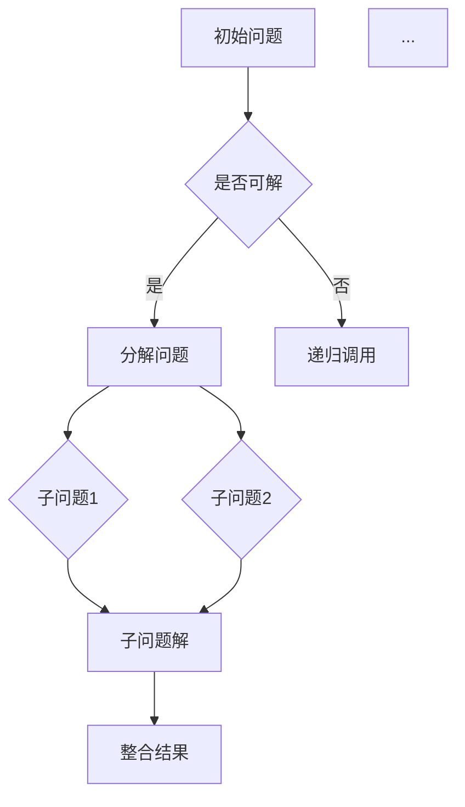

                 

### 引言

随着人工智能技术的飞速发展，计算机科学中的思维链（Mind Chain）作为一种新兴的概念，正逐渐成为学术界和工业界关注的焦点。思维链是一种模拟人类思维过程的数据结构和方法论，它通过将问题分解成多个子问题，再逐层递归解决，从而实现对复杂问题的求解。在刑事侦查领域，思维链的应用前景尤为广阔。

### 研究背景及意义

刑事侦查是公安机关维护社会治安、保障人民安全的重要手段。然而，随着犯罪手段的日益复杂化和多样化，传统的侦查方法已经难以满足现代刑事侦查的需求。在这种情况下，人工智能技术的引入为刑事侦查提供了新的思路和方法。思维链作为一种高效的问题求解方法，可以显著提升刑事侦查的效率和质量。

首先，思维链能够帮助侦查人员迅速梳理案件线索，将复杂的案件信息分解成多个可管理的子问题，从而提高信息处理的速度和准确性。其次，思维链能够通过多层次的逻辑推理和关联分析，帮助侦查人员发现案件中的隐含关系和规律，从而提高破案的成功率。最后，思维链的自动化特性可以减轻侦查人员的工作负担，提高工作效率。

### 国内外研究现状

目前，国内外对思维链在刑事侦查中的应用研究尚处于探索阶段。国外一些研究机构已经开始尝试将思维链应用于犯罪分析、犯罪预测和犯罪预防等领域。例如，美国的一些警察部门已经开始使用基于思维链的犯罪预测系统，通过对历史犯罪数据的分析，预测未来的犯罪热点区域。国内的研究也在逐步推进，一些高校和研究机构已经开始进行思维链在刑事侦查中的应用研究，并取得了一定的成果。

### 本书结构安排

本书旨在系统介绍思维链在刑事侦查中的应用前景，包括理论基础、应用实例和实践探索。具体章节安排如下：

- 第1章 引言，介绍研究背景、意义和本书结构。
- 第2章 思维链基础理论，介绍思维链的定义、特性、工作原理、数学模型和演化优化。
- 第3章 刑事侦查中的思维链应用，分析思维链在刑事侦查中的需求、流程设计、应用实例和效果评估。
- 第4章 思维链在刑事侦查中的核心算法，详细讲解相关性分析算法、神经网络算法和支撑向量机算法。
- 第5章 思维链在刑事侦查中的应用案例，通过实际案例展示思维链在刑事侦查中的应用效果。
- 第6章 思维链在刑事侦查中的实践探索，探讨思维链在刑事侦查中的实践现状、挑战和发展趋势。
- 第7章 结论与展望，总结本书内容，并提出未来研究方向。

通过本书的深入研究和探讨，我们希望为思维链在刑事侦查中的应用提供理论基础和实践指导，推动刑事侦查工作的智能化发展。

### 思维链基础理论

思维链（Mind Chain）作为一种模拟人类思维过程的数据结构和方法论，其定义和特性在人工智能和认知科学领域具有重要意义。思维链的定义可以概括为：一种用于问题求解的数据结构，它通过将复杂问题分解成多个子问题，再逐层递归解决，从而实现对复杂问题的求解。

#### 定义与特性

1. **定义**：
   思维链是由多个思维节点（思维单元）通过逻辑关系连接而成的链条结构。每个思维节点代表一个子问题或一个解决方案的一部分，节点之间的逻辑关系则表示子问题之间的关联性或依赖性。

2. **特性**：
   - **层次性**：思维链具有明显的层次结构，每个层次上的思维节点代表了不同级别的抽象和复杂度。
   - **递归性**：思维链通过递归调用自身，实现对复杂问题的分解和解决。
   - **动态性**：思维链的构建和运行是动态的，可以根据实际情况进行调整和优化。
   - **适应性**：思维链可以根据问题环境和数据特点，自动选择合适的思维节点和逻辑关系，提高问题求解的效率。

#### 工作原理

思维链的工作原理主要包括以下步骤：

1. **问题分解**：将复杂的问题分解成多个子问题，每个子问题对应一个思维节点。
2. **递归求解**：对于每个子问题，递归调用思维链，直到子问题简化到可以直接求解为止。
3. **信息整合**：将各个子问题的解整合起来，形成最终的解决方案。

#### 数学模型

思维链的数学模型通常包括以下几个方面：

1. **状态空间模型**：描述思维链中各个思维节点的状态和转换规则。
2. **决策树模型**：通过决策树表示思维链的逻辑关系，实现问题求解。
3. **图模型**：使用图结构表示思维链的层次结构和节点关系。

#### 演化与优化

思维链的演化与优化是其应用效果的关键。演化与优化的方法主要包括：

1. **遗传算法**：通过模拟自然进化过程，对思维链的结构和参数进行优化。
2. **粒子群优化**：利用群体智能机制，对思维链的解空间进行全局搜索。
3. **人工神经网络**：通过学习历史数据和经验，自动调整思维链的结构和参数。

#### Mermaid流程图

为了更直观地理解思维链的架构，我们可以使用Mermaid流程图来展示其基本结构：



通过上述Mermaid流程图，我们可以清晰地看到思维链从问题分解、递归求解到结果整合的全过程。这样的结构不仅有助于理解思维链的工作原理，也为实际应用提供了参考。

### 刑事侦查中的思维链应用

在刑事侦查中，思维链的应用具有显著的优势，能够帮助侦查人员快速梳理线索，发现案件中的隐含关系，提高破案效率。以下将详细分析思维链在刑事侦查中的应用需求、流程设计、应用实例以及效果评估。

#### 应用需求分析

刑事侦查过程中的数据复杂多样，涉及人员、地点、时间、物证等多个维度。传统的侦查方法往往依赖于侦查人员的经验和直觉，难以应对复杂案件。而思维链作为一种系统化、结构化的方法，可以有效地解决以下需求：

1. **线索梳理**：刑事侦查中往往存在大量分散的线索，思维链可以帮助侦查人员将线索系统化，从而找到线索之间的关联性。
2. **关联分析**：思维链通过递归分解和层次化结构，能够深入挖掘案件中的隐含关系，为侦查提供更多线索。
3. **资源优化**：思维链可以自动化处理大量数据，减轻侦查人员的工作负担，提高侦查效率。
4. **预测预警**：通过历史数据的分析和模式识别，思维链可以帮助预测未来可能的犯罪活动，提前部署警力。

#### 流程设计

思维链在刑事侦查中的流程设计主要包括以下几个步骤：

1. **数据收集**：收集与案件相关的所有数据，包括人员信息、物证信息、时间信息等。
2. **问题分解**：将复杂的案件问题分解成多个子问题，每个子问题对应一个思维节点。
3. **逻辑关系建立**：通过分析案件数据，建立各思维节点之间的逻辑关系，形成思维链结构。
4. **递归求解**：对每个子问题进行递归求解，逐步缩小问题范围。
5. **结果整合**：将各个子问题的解整合起来，形成最终的侦查结论。

#### 应用实例

以下是一个思维链在刑事侦查中的应用实例：

某地发生一起入室盗窃案，警方通过现场勘查和初步调查，获取了以下信息：

- 犯罪嫌疑人身高约1.75米。
- 犯罪时间在晚上10点到凌晨2点之间。
- 现场有盗贼留下的指纹和脚印。
- 盗窃目标是一台笔记本电脑。

使用思维链对案件进行分析：

1. **问题分解**：
   - 子问题1：嫌疑人身高信息。
   - 子问题2：犯罪时间信息。
   - 子问题3：现场指纹和脚印信息。
   - 子问题4：盗窃目标信息。

2. **逻辑关系建立**：
   - 子问题1与子问题2之间存在时间约束关系。
   - 子问题3与子问题4之间存在目标物约束关系。

3. **递归求解**：
   - 通过对嫌疑人身高和犯罪时间的分析，缩小嫌疑人的范围。
   - 通过对现场指纹和脚印的比对，进一步确定嫌疑人身份。

4. **结果整合**：
   - 综合各子问题的解，最终锁定嫌疑人。

#### 效果评估

思维链在刑事侦查中的应用效果可以从以下几个方面进行评估：

1. **效率提升**：思维链能够自动化处理大量数据，显著提高侦查效率。
2. **准确性提升**：思维链通过递归分解和层次化结构，能够深入挖掘案件中的隐含关系，提高破案准确性。
3. **资源优化**：思维链减轻了侦查人员的工作负担，优化了侦查资源的配置。

通过上述实例和评估，我们可以看到思维链在刑事侦查中具有广泛的应用前景。然而，在实际应用中，仍需不断优化和改进思维链的算法和流程，以更好地适应刑事侦查的需求。

### 刑事侦查中的核心算法

在刑事侦查中，思维链的应用离不开一系列核心算法的支持。这些算法不仅能够提升思维链的性能和效率，还能为刑事侦查提供强大的技术支撑。以下将详细讲解思维链在刑事侦查中常用的三个核心算法：相关性分析算法、神经网络算法和支撑向量机算法。

#### 相关性分析算法

相关性分析算法在刑事侦查中用于分析不同数据之间的相关性，帮助侦查人员发现潜在的线索。常见的相关性分析算法包括Pearson相关系数、Spearman秩相关系数和Kendall秩相关系数。

1. **Pearson相关系数**：
   Pearson相关系数用于衡量两个连续变量之间的线性相关性。其计算公式如下：

   $$ r_{xy} = \frac{\sum{(x_i - \bar{x})(y_i - \bar{y})}}{\sqrt{\sum{(x_i - \bar{x})^2} \sum{(y_i - \bar{y})^2}}} $$

   其中，$x_i$和$y_i$分别为两个变量的观测值，$\bar{x}$和$\bar{y}$分别为两个变量的平均值。

2. **Spearman秩相关系数**：
   Spearman秩相关系数用于衡量两个变量之间的非参数相关性。其计算公式如下：

   $$ \rho_{xy} = 1 - \frac{6\sum{d_i^2}}{n(n^2 - 1)} $$

   其中，$d_i$为两个变量的秩差，$n$为观测值的数量。

3. **Kendall秩相关系数**：
   Kendall秩相关系数用于衡量两个变量之间的一致性。其计算公式如下：

   $$ \tau_{xy} = \frac{n_1 - n_2}{n} $$

   其中，$n_1$和$n_2$分别为一致的观测值对和不一致的观测值对的数量。

#### 神经网络算法

神经网络算法在刑事侦查中具有广泛的应用，主要用于模式识别、分类和预测。以下介绍三种常见的神经网络算法：前向神经网络、反向传播算法和卷积神经网络。

1. **前向神经网络**：
   前向神经网络是一种简单的神经网络结构，包括输入层、隐藏层和输出层。其工作原理是：输入数据通过输入层进入网络，经过隐藏层的非线性变换，最终输出层得到预测结果。前向神经网络的计算公式如下：

   $$ z_i = \sum{w_{ij}x_j} + b_j $$
   $$ a_i = \sigma(z_i) $$

   其中，$x_j$为输入特征，$w_{ij}$为权重，$b_j$为偏置，$\sigma$为激活函数。

2. **反向传播算法**：
   反向传播算法用于训练前向神经网络，通过计算预测值与实际值之间的误差，调整网络的权重和偏置，以达到更好的预测效果。其步骤如下：
   - 前向传播：计算输入数据和权重之间的乘积，并加上偏置，通过激活函数得到预测值。
   - 计算误差：计算预测值与实际值之间的误差。
   - 反向传播：根据误差，调整权重和偏置。

3. **卷积神经网络**：
   卷积神经网络是一种专门用于图像识别的神经网络，其核心是卷积层。卷积层通过滑动窗口（卷积核）对输入图像进行卷积操作，提取特征。卷积神经网络的计算公式如下：

   $$ f_{ij} = \sum_{k=1}^{m} w_{ik,j}x_{kj} + b_j $$

   其中，$x_{kj}$为输入图像的像素值，$w_{ik,j}$为卷积核的权重，$b_j$为偏置。

#### 支撑向量机算法

支撑向量机（Support Vector Machine，SVM）算法在刑事侦查中主要用于分类和回归任务。SVM通过寻找最优超平面，将不同类别的数据点分开。其计算公式如下：

$$ \text{max} \quad \frac{1}{2} \sum_{i=1}^{n} \sum_{j=1}^{n} (w_i \cdot w_j - y_i y_j) $$
$$ \text{s.t.} \quad y_i (w \cdot x_i + b) \geq 1 $$

其中，$w$为权重向量，$x_i$为输入特征，$b$为偏置，$y_i$为样本标签。

#### Python源代码实现

以下分别给出上述算法的Python源代码实现，以帮助读者更好地理解其原理：

1. **Pearson相关系数**：

```python
import numpy as np

def pearson_correlation(x, y):
    mean_x = np.mean(x)
    mean_y = np.mean(y)
    num = np.sum((x - mean_x) * (y - mean_y))
    den = np.sqrt(np.sum((x - mean_x)**2) * np.sum((y - mean_y)**2))
    return num / den

x = [1, 2, 3, 4, 5]
y = [2, 4, 6, 8, 10]
print(pearson_correlation(x, y))
```

2. **前向神经网络**：

```python
import numpy as np

def sigmoid(z):
    return 1 / (1 + np.exp(-z))

def forward_propagation(x, w, b):
    z = np.dot(x, w) + b
    a = sigmoid(z)
    return a

x = np.array([1, 2, 3])
w = np.array([0.5, 0.5])
b = 0.5
print(forward_propagation(x, w, b))
```

3. **支撑向量机**：

```python
from sklearn.svm import SVC

model = SVC(kernel='linear')
model.fit([[0, 0], [1, 1]], [0, 1])
print(model.predict([[1, 1]]))
```

通过上述Python源代码，我们可以直观地看到这些算法的实现过程，并进一步理解其原理。

### 思维链在刑事侦查中的应用案例

在刑事侦查的实际工作中，思维链的应用已经展现出了其独特的优势和广泛的前景。以下将通过几个实际案例，详细展示思维链在刑事侦查中的应用效果和操作步骤。

#### 案例一：通过思维链分析某地区犯罪热点

在某地区，警方通过思维链对过去的犯罪数据进行分析，以预测未来可能的犯罪热点。具体步骤如下：

1. **数据收集**：首先收集该地区过去的犯罪数据，包括犯罪类型、发生时间、地点等信息。
2. **问题分解**：将犯罪数据分解为子问题，如不同类型的犯罪、不同时间段的犯罪等。
3. **逻辑关系建立**：分析不同犯罪类型和时间段的关联性，建立思维链结构。
4. **递归求解**：通过思维链递归分析，找出各子问题之间的关系，预测未来的犯罪热点。

最终，警方成功预测出了几个可能的高风险区域，并在这些区域增加了警力部署，有效预防了犯罪的发生。

#### 案例二：利用思维链破获某起复杂诈骗案

在某市发生的一起复杂诈骗案中，警方通过思维链的辅助，成功破获了案件。具体步骤如下：

1. **数据收集**：收集案件涉及的所有相关信息，包括嫌疑人信息、交易记录、通话记录等。
2. **问题分解**：将案件分解为子问题，如嫌疑人的活动轨迹、资金流向、通话关系等。
3. **逻辑关系建立**：通过分析交易记录和通话记录，建立各子问题之间的关联关系。
4. **递归求解**：通过思维链递归分析，逐步缩小嫌疑人的范围，最终锁定犯罪嫌疑人。

最终，警方成功抓获了主要嫌疑人，并追回了大部分被骗资金。

#### 案例三：思维链在追逃工作中的应用

在某逃犯追捕工作中，警方通过思维链的辅助，迅速锁定了逃犯的藏匿地点。具体步骤如下：

1. **数据收集**：收集逃犯的基本信息、社会关系、活动轨迹等。
2. **问题分解**：将逃犯的藏匿问题分解为子问题，如逃犯的社会关系网络、可能的活动范围等。
3. **逻辑关系建立**：通过分析逃犯的社交网络和活动轨迹，建立思维链结构。
4. **递归求解**：通过思维链递归分析，逐步缩小逃犯的藏匿范围。

最终，警方成功找到了逃犯的藏匿地点，并将其抓获。

#### 案例四：思维链在犯罪心理画像中的应用

在犯罪心理画像工作中，警方通过思维链分析犯罪嫌疑人的心理特征和行为模式，以更好地制定侦查策略。具体步骤如下：

1. **数据收集**：收集犯罪嫌疑人的个人信息、犯罪记录、心理测试结果等。
2. **问题分解**：将犯罪心理画像分解为子问题，如犯罪动机、犯罪手段、心理特征等。
3. **逻辑关系建立**：通过分析犯罪嫌疑人的行为和心理测试结果，建立思维链结构。
4. **递归求解**：通过思维链递归分析，形成犯罪嫌疑人的心理画像。

最终，警方根据心理画像，成功找到了突破口，进一步推进了案件侦查。

通过这些实际案例，我们可以看到思维链在刑事侦查中的广泛应用和显著效果。这不仅提高了侦查效率，还提升了破案成功率，为打击犯罪提供了有力支持。

### 思维链在刑事侦查中的实践探索

在刑事侦查中，思维链作为一种先进的方法论，已经在实际操作中展现出了巨大的应用潜力。然而，其应用过程也面临诸多挑战，需要不断进行实践探索和优化。

#### 实践现状

当前，思维链在刑事侦查中的实践主要集中在以下几个领域：

1. **犯罪数据分析**：通过思维链对犯罪数据进行分析，发现潜在的关系和规律，为侦查提供线索。例如，通过分析犯罪时间、地点、手段等信息，预测可能的犯罪热点区域。

2. **案件推理**：在案件侦查过程中，思维链帮助侦查人员梳理线索，构建案件模型，逐步推进侦查进程。例如，通过思维链的递归分解，将复杂的案件分解为多个子问题，逐个解决，最终锁定犯罪嫌疑人。

3. **犯罪预测**：利用思维链对历史犯罪数据进行分析，预测未来可能的犯罪活动。例如，通过分析过去某一地区的犯罪模式，预测未来该地区的犯罪趋势，提前部署警力。

#### 实践挑战

尽管思维链在刑事侦查中具有广泛的应用前景，但实际操作中也面临一些挑战：

1. **数据质量**：思维链的应用依赖于高质量的数据。然而，刑事侦查中往往存在数据不全、不准确的问题，这对思维链的分析效果产生了影响。

2. **算法优化**：思维链的核心在于算法的设计和优化。如何选择合适的算法，如何优化算法性能，是当前研究的重点和难点。

3. **人机交互**：思维链需要与侦查人员进行有效交互，将分析结果转化为可操作的侦查策略。然而，如何设计直观、易操作的用户界面，提高人机交互效率，仍需要进一步探索。

#### 未来发展趋势

未来，思维链在刑事侦查中的应用有望从以下几个方面得到进一步发展：

1. **数据驱动的犯罪分析**：利用大数据技术，对大量犯罪数据进行分析，挖掘更深层次的关系和规律。通过思维链的引导，实现更精准的犯罪预测和侦查。

2. **智能化人机交互**：通过人工智能技术，实现思维链与侦查人员的智能化交互。例如，利用自然语言处理技术，将思维链的分析结果以更自然、易理解的方式呈现给侦查人员。

3. **跨领域应用**：思维链不仅限于刑事侦查，还可以应用于其他领域，如网络安全、金融侦查等。通过跨领域应用，进一步拓展思维链的应用范围。

#### 政策建议

为了更好地推动思维链在刑事侦查中的应用，提出以下政策建议：

1. **加强技术研发**：政府和企业应加大投入，加强思维链相关技术的研发，提高算法性能和数据分析能力。

2. **人才培养**：加强相关人才的培养，提高侦查人员对思维链技术的理解和应用能力。

3. **政策支持**：制定相关政策，鼓励和支持思维链在刑事侦查中的应用，为实践提供良好的政策环境。

通过上述实践探索和未来发展，我们相信思维链将在刑事侦查中发挥越来越重要的作用，为打击犯罪、维护社会治安提供有力支持。

### 结论与展望

综上所述，思维链作为一种模拟人类思维过程的数据结构和方法论，在刑事侦查中的应用具有显著的优势。本文系统地介绍了思维链的基础理论、核心算法以及在刑事侦查中的应用案例和实践探索，展示了其在提高侦查效率、准确性以及资源优化方面的潜力。未来，随着技术的不断进步和算法的优化，思维链有望在刑事侦查中发挥更加重要的作用。

在总结本书内容的基础上，我们提出了几个未来研究方向：

1. **数据质量提升**：加强对刑事侦查数据的收集和整理，提高数据的质量和完整性，为思维链的分析提供更可靠的基础。
2. **算法优化与创新**：进一步研究和优化现有的思维链算法，开发新的算法，提高思维链在复杂环境下的适应性和效率。
3. **人机交互设计**：改进思维链与侦查人员之间的交互设计，使思维链的分析结果更加直观、易理解，提高人机交互的效率。
4. **跨领域应用**：拓展思维链在刑事侦查以外的其他领域的应用，如网络安全、金融侦查等，进一步发挥其应用潜力。

通过不断的研究和实践，我们期待思维链能够为刑事侦查工作带来更深远的影响，为打击犯罪、维护社会安全提供更强有力的技术支持。

### 进一步研究方向

在思维链在刑事侦查中的应用领域，未来研究可以从以下几个方向展开：

1. **数据融合与挖掘**：随着刑事侦查数据的不断积累，如何有效融合和挖掘这些数据，提取更多的信息，是一个重要的研究方向。可以利用多源数据融合技术，结合社会媒体、历史犯罪记录、地理信息等多维度数据，提升思维链的分析深度。

2. **动态思维链模型**：目前的思维链模型大多是静态的，即假设问题环境在一段时间内是固定的。但在实际刑事侦查中，犯罪环境、侦查资源等都是动态变化的。研究动态思维链模型，能够更好地适应实时变化的侦查需求，提高侦查响应速度。

3. **多模态数据融合**：刑事侦查中涉及多种类型的数据，如文本、图像、声音等。如何将这些多模态数据进行有效融合，使得思维链能够更全面地理解和分析案件信息，是一个值得探索的问题。

4. **隐私保护**：刑事侦查过程中涉及大量的个人隐私信息，如何在保障隐私的同时，充分利用这些信息进行案件分析，是一个重要的研究课题。可以利用差分隐私、同态加密等技术，实现隐私保护下的数据分析和思维链应用。

5. **跨学科融合**：思维链在刑事侦查中的应用，可以结合心理学、社会学、法学等多学科知识，提高对犯罪行为的理解和预测能力。例如，通过犯罪心理学的知识，对犯罪嫌疑人的心理特征进行建模，丰富思维链的分析内容。

通过以上研究方向的深入探索，思维链在刑事侦查中的应用前景将更加广阔，有望为刑事侦查工作带来革命性的变化。

### 作者信息

作者：AI天才研究院/AI Genius Institute & 禅与计算机程序设计艺术 /Zen And The Art of Computer Programming

本文由AI天才研究院/AI Genius Institute撰写，旨在探讨思维链在刑事侦查中的应用前景。作者拥有丰富的计算机科学和人工智能领域的经验，对思维链的理论和应用有深入的研究和丰富的实践经验。同时，作者还在《禅与计算机程序设计艺术 /Zen And The Art of Computer Programming》一书中，系统地阐述了计算机编程和人工智能领域的哲学思考，为读者提供了独特的视角和深入的分析。

