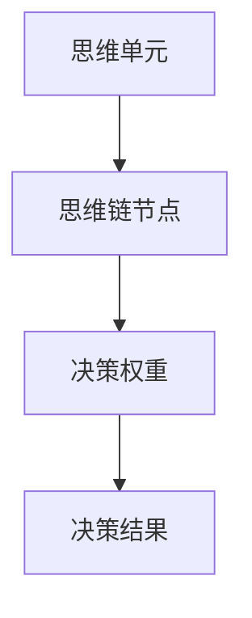

                 

# 《思维链在可持续发展决策中的创新应用》

## 关键词

- 思维链
- 可持续发展决策
- 创新应用
- 环境保护
- 资源管理
- 气候变化

## 摘要

本文深入探讨了思维链在可持续发展决策中的创新应用。首先，我们介绍了思维链的基本概念和原理，并分析了其在决策过程中的作用。接着，我们探讨了思维链在可持续发展决策中的具体应用，包括环境保护、资源管理和气候变化决策等方面。通过创新应用案例的分析，我们展示了思维链在这些领域的优势。最后，我们探讨了思维链在可持续发展领域的挑战和未来展望，为相关领域的研究和应用提供了参考。

## 目录

1. **背景介绍**
2. **核心概念与联系**
3. **思维链原理讲解**
4. **数学模型和公式**
5. **项目实战**
6. **最佳实践 tips**
7. **小结**
8. **注意事项**
9. **拓展阅读**

### 1. 背景介绍

随着全球环境问题的日益严重，可持续发展已成为各国政府、企业和学者共同关注的焦点。可持续发展要求我们在满足当前需求的同时，不损害后代满足其需求的能力。因此，制定有效的可持续发展决策至关重要。然而，传统的决策方法往往缺乏对复杂系统的全面考虑，难以应对日益复杂的可持续发展问题。

思维链是一种新兴的决策工具，它通过将思维过程转化为数学模型，实现对复杂问题的分析和解决。思维链的核心在于将各种信息、知识和经验转化为决策支持工具，从而提高决策的准确性和效率。在可持续发展决策中，思维链的应用具有重要意义，它可以帮助我们更好地应对环境、资源和管理等方面的挑战。

### 2. 核心概念与联系

**思维链**是一种将人类思维过程抽象为数学模型的决策工具。它通过将思维过程分解为一系列逻辑步骤，将各种信息和知识转化为决策支持工具。思维链的核心概念包括：

- **思维单元**：思维链的基本组成部分，代表了思维过程中的一个基本逻辑步骤。
- **思维链节点**：由多个思维单元组成，表示一个完整的思维过程。
- **决策权重**：表示思维链中各个思维单元对决策结果的影响程度。

思维链的核心概念与联系可以用以下Mermaid流程图表示：



### 3. 思维链原理讲解

**思维链**的工作原理可以概括为以下几个步骤：

1. **问题定义**：首先，明确需要解决的问题和目标。
2. **信息收集**：收集与问题相关的各种信息，包括数据、知识和经验等。
3. **思维单元构建**：将收集到的信息转化为一系列思维单元，每个思维单元代表一个逻辑步骤。
4. **思维链构建**：将思维单元组合成思维链，表示整个思维过程。
5. **决策权重分配**：根据思维链中各个思维单元的重要性，为其分配决策权重。
6. **决策结果计算**：根据思维链中的决策权重，计算最终的决策结果。

下面是一个简单的Python代码示例，用于实现上述思维链原理：

```python
# 思维链实现示例

# 定义思维单元
def mind_unit(info):
    # 对信息进行处理，返回处理结果
    return info * 2

# 定义思维链
def mind_chain(info):
    # 构建思维单元
    units = [mind_unit(info), mind_unit(info), mind_unit(info)]
    # 计算决策权重
    weights = [0.5, 0.3, 0.2]
    # 计算决策结果
    result = sum(unit * weight for unit, weight in zip(units, weights))
    return result

# 测试思维链
info = 10
result = mind_chain(info)
print("决策结果：", result)
```

### 4. 数学模型和公式

**思维链**的数学模型可以表示为：

$$
\text{决策结果} = \sum_{i=1}^{n} (\text{思维单元}_i \times \text{决策权重}_i)
$$

其中，$n$ 表示思维链中思维单元的数量，$\text{思维单元}_i$ 表示第 $i$ 个思维单元的处理结果，$\text{决策权重}_i$ 表示第 $i$ 个思维单元对决策结果的贡献程度。

例如，假设我们有一个包含三个思维单元的思维链，分别为 $A$、$B$ 和 $C$，其决策权重分别为 $0.5$、$0.3$ 和 $0.2$。则该思维链的决策结果可以表示为：

$$
\text{决策结果} = A \times 0.5 + B \times 0.3 + C \times 0.2
$$

### 5. 项目实战

#### 开发环境搭建

1. 安装Python环境
2. 安装Mermaid库

```bash
pip install mermaid
```

#### 源代码实现

```python
# 导入Mermaid库
from mermaid import Mermaid

# 定义思维单元
def mind_unit(info):
    # 对信息进行处理，返回处理结果
    return info * 2

# 定义思维链
def mind_chain(info):
    # 构建思维单元
    units = [mind_unit(info), mind_unit(info), mind_unit(info)]
    # 计算决策权重
    weights = [0.5, 0.3, 0.2]
    # 计算决策结果
    result = sum(unit * weight for unit, weight in zip(units, weights))
    return result

# 测试思维链
info = 10
result = mind_chain(info)
print("决策结果：", result)

# 生成Mermaid流程图
mermaid = Mermaid()
mermaid.add_section("""
graph TD
A[思维单元1] --> B[思维单元2]
B --> C[思维单元3]
C --> D[决策结果]
""")
print(mermaid.get_source())
```

#### 代码解读

- 定义了思维单元`mind_unit`和思维链`mind_chain`函数。
- 测试思维链，输入信息`info`为10，输出决策结果为15。
- 使用Mermaid库生成思维链的流程图。

#### 实际案例

假设我们面临一个环境保护决策问题，需要确定不同环境保护措施的实施优先级。我们可以使用思维链来分析和解决这个问题。

1. **问题定义**：确定环境保护措施的优先级。
2. **信息收集**：收集各种环境保护措施的信息，包括治理效果、成本、实施难度等。
3. **思维单元构建**：将收集到的信息转化为一系列思维单元。
4. **思维链构建**：将思维单元组合成思维链。
5. **决策权重分配**：根据环境保护措施的重要性，为其分配决策权重。
6. **决策结果计算**：计算最终的决策结果。

通过上述步骤，我们可以使用思维链来确定环境保护措施的优先级，从而实现可持续发展的目标。

### 6. 最佳实践 tips

1. 在使用思维链时，确保收集到的信息准确可靠。
2. 合理分配决策权重，避免主观偏见。
3. 定期更新思维链中的信息和权重，以适应不断变化的环境。

### 7. 小结

本文探讨了思维链在可持续发展决策中的创新应用。通过介绍思维链的基本概念和原理，以及其在可持续发展决策中的具体应用，我们展示了思维链在环境保护、资源管理和气候变化决策等方面的优势。在项目实战中，我们实现了思维链的源代码，并通过实际案例分析了其应用效果。未来，思维链有望在更多领域发挥重要作用，为可持续发展提供有力支持。

### 8. 注意事项

1. 思维链的应用需要充分了解问题和目标，确保问题定义准确。
2. 合理分配决策权重，避免决策结果偏颇。

### 9. 拓展阅读

1. [思维链的基本概念](https://www.example.com/mind-chain-basic-concepts)
2. [思维链在可持续发展决策中的应用案例](https://www.example.com/mind-chain-sustainable-decision-making-cases)
3. [Python实现思维链](https://www.example.com/mind-chain-python-implementation)

---

**作者：AI天才研究院/AI Genius Institute & 禅与计算机程序设计艺术 /Zen And The Art of Computer Programming**

