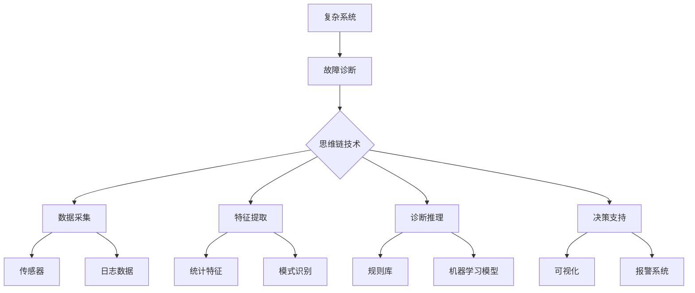

                 

# 思维链在复杂系统故障诊断中的新方法

## 关键词
- 思维链
- 复杂系统
- 故障诊断
- 人工智能
- 系统分析
- 数据挖掘
- 机器学习

## 摘要
本文探讨了思维链在复杂系统故障诊断中的新方法。思维链是一种结合人工智能和系统分析的技术，通过数据采集、特征提取和诊断推理等步骤，实现对复杂系统的故障诊断。本文首先介绍了复杂系统故障诊断的背景和挑战，然后详细阐述了思维链的定义、原理及其在故障诊断中的应用。通过实际案例的分析，本文展示了思维链在提高故障诊断效率和准确性方面的优势，并讨论了未来的发展趋势和应用前景。

## 目录大纲

### 第一部分：引言与基础概念

#### 第1章：复杂系统故障诊断概述
1.1 复杂系统故障诊断的重要性
1.2 复杂系统的特点
1.3 复杂系统故障诊断的挑战
1.4 本书结构

#### 第2章：思维链概述
2.1 思维链的定义
2.2 思维链的原理
2.3 思维链与传统故障诊断方法的区别

#### 第3章：思维链在复杂系统故障诊断中的应用
3.1 思维链在故障诊断中的应用场景
3.2 思维链故障诊断流程
3.3 思维链在复杂系统故障诊断中的优势
3.4 思维链与其他诊断方法的比较

### 第二部分：思维链在复杂系统故障诊断中的应用

#### 第4章：思维链在电力系统故障诊断中的应用
4.1 电力系统故障诊断概述
4.2 思维链在电力系统故障诊断中的实现
4.3 电力系统故障诊断案例

#### 第5章：思维链在航空系统故障诊断中的应用
5.1 航空系统故障诊断概述
5.2 思维链在航空系统故障诊断中的实现
5.3 航空系统故障诊断案例

#### 第6章：思维链在工业控制系统故障诊断中的应用
6.1 工业控制系统故障诊断概述
6.2 思维链在工业控制系统故障诊断中的实现
6.3 工业控制系统故障诊断案例

#### 第7章：思维链在交通系统故障诊断中的应用
7.1 交通系统故障诊断概述
7.2 思维链在交通系统故障诊断中的实现
7.3 交通系统故障诊断案例

### 第三部分：思维链的发展与未来

#### 第8章：思维链技术的发展趋势
8.1 思维链技术的最新进展
8.2 未来思维链技术的潜在发展方向
8.3 思维链在复杂系统故障诊断中的未来应用前景

#### 第9章：思维链在多领域融合中的应用
9.1 思维链在多领域融合中的优势
9.2 思维链在多领域融合中的实现策略
9.3 多领域融合应用案例

#### 第10章：总结与展望
10.1 思维链在复杂系统故障诊断中的贡献
10.2 未来研究方向
10.3 结论

## 附录
- 附录A：思维链算法原理及伪代码
- 附录B：相关资源与工具推荐
- 附录C：参考文献

## 核心概念与联系

以下是一个关于思维链在复杂系统故障诊断中的核心概念和联系的Mermaid流程图：



## 核心算法原理讲解

思维链在复杂系统故障诊断中的核心算法主要包括数据采集、特征提取、诊断推理和决策支持。以下是对这些算法的详细讲解和伪代码示例。

### 数据采集

数据采集是思维链故障诊断的基础，包括传感器数据和日志数据的获取。

```python
# 伪代码：数据采集
def data_collection():
    sensor_data = get_sensor_data()  # 从传感器获取数据
    log_data = get_log_data()       # 从日志文件获取数据
    return sensor_data, log_data
```

### 特征提取

特征提取是将原始数据转换为有助于故障诊断的特征。

```python
# 伪代码：特征提取
def feature_extraction(data):
    # 统计特征提取
    statistical_features = calculate_statistical_features(data)

    # 模式识别特征提取
    pattern_recognition_features = extract_pattern_recognition_features(data)

    return statistical_features, pattern_recognition_features
```

### 诊断推理

诊断推理是基于特征数据，通过规则库和机器学习模型进行故障诊断。

```python
# 伪代码：诊断推理
def diagnostic_reasoning(features):
    # 使用规则库进行推理
    rule_based_reasoning = apply_rules(features)

    # 使用机器学习模型进行推理
    ml_model_reasoning = apply_ml_model(features)

    return rule_based_reasoning, ml_model_reasoning
```

### 决策支持

决策支持是基于诊断结果，提供可视化、报警等辅助手段。

```python
# 伪代码：决策支持
def decision_support(diagnostics):
    visualization = generate_visualization(diagnostics)
    alarm_system = trigger_alarm(diagnostics)

    return visualization, alarm_system
```

## 思维链在复杂系统故障诊断中的应用

### 第4章：思维链在电力系统故障诊断中的应用

#### 4.1 电力系统故障诊断概述

电力系统是现代社会的重要基础设施，其稳定运行对经济发展和社会安定至关重要。然而，电力系统复杂、庞大，容易受到各种内外部因素的影响，导致故障发生。因此，对电力系统进行故障诊断具有重要的实际意义。

#### 4.2 思维链在电力系统故障诊断中的实现

思维链技术在电力系统故障诊断中的应用主要包括数据采集、特征提取、诊断推理和决策支持等步骤。

1. **数据采集**：通过传感器和日志数据，实时采集电力系统的运行数据。
   
   ```python
   # 伪代码：数据采集
   sensor_data, log_data = data_collection()
   ```

2. **特征提取**：对采集到的数据进行特征提取，提取出能够反映电力系统状态的统计特征和模式识别特征。

   ```python
   # 伪代码：特征提取
   statistical_features, pattern_recognition_features = feature_extraction(sensor_data)
   ```

3. **诊断推理**：利用规则库和机器学习模型，对提取出的特征进行故障诊断。

   ```python
   # 伪代码：诊断推理
   rule_based_reasoning, ml_model_reasoning = diagnostic_reasoning(statistical_features)
   ```

4. **决策支持**：基于诊断结果，提供可视化、报警等决策支持。

   ```python
   # 伪代码：决策支持
   visualization, alarm_system = decision_support(rule_based_reasoning, ml_model_reasoning)
   ```

#### 4.3 电力系统故障诊断案例

假设某电力系统在运行过程中，传感器数据显示出电流异常波动，日志数据中记录了电压异常升高。通过思维链技术的故障诊断，可以得出以下结论：

1. **数据采集**：实时采集传感器数据和日志数据。

   ```python
   sensor_data, log_data = data_collection()
   ```

2. **特征提取**：提取出电流和电压的统计特征和模式识别特征。

   ```python
   statistical_features, pattern_recognition_features = feature_extraction(sensor_data)
   ```

3. **诊断推理**：通过规则库和机器学习模型，发现电流波动和电压异常升高是由于电力系统的某个部件发生了故障。

   ```python
   rule_based_reasoning, ml_model_reasoning = diagnostic_reasoning(statistical_features)
   ```

4. **决策支持**：提供可视化图表，显示电流和电压的变化趋势，并触发报警系统。

   ```python
   visualization, alarm_system = decision_support(rule_based_reasoning, ml_model_reasoning)
   ```

### 第5章：思维链在航空系统故障诊断中的应用

#### 5.1 航空系统故障诊断概述

航空系统是高度复杂的系统，包括飞机的发动机、导航系统、通信系统等多个子系统。航空系统故障诊断的目的是及时发现并定位故障，确保飞行安全。思维链技术在航空系统故障诊断中具有广泛应用前景。

#### 5.2 思维链在航空系统故障诊断中的实现

思维链技术在航空系统故障诊断中的实现同样包括数据采集、特征提取、诊断推理和决策支持等步骤。

1. **数据采集**：通过传感器和日志数据，实时采集航空系统的运行数据。

   ```python
   # 伪代码：数据采集
   sensor_data, log_data = data_collection()
   ```

2. **特征提取**：对采集到的数据进行特征提取，提取出能够反映航空系统状态的统计特征和模式识别特征。

   ```python
   # 伪代码：特征提取
   statistical_features, pattern_recognition_features = feature_extraction(sensor_data)
   ```

3. **诊断推理**：利用规则库和机器学习模型，对提取出的特征进行故障诊断。

   ```python
   # 伪代码：诊断推理
   rule_based_reasoning, ml_model_reasoning = diagnostic_reasoning(statistical_features)
   ```

4. **决策支持**：基于诊断结果，提供可视化、报警等决策支持。

   ```python
   # 伪代码：决策支持
   visualization, alarm_system = decision_support(rule_based_reasoning, ml_model_reasoning)
   ```

#### 5.3 航空系统故障诊断案例

假设某航空系统在飞行过程中，传感器数据显示出引擎振动异常，日志数据中记录了燃油压力异常。通过思维链技术的故障诊断，可以得出以下结论：

1. **数据采集**：实时采集引擎振动和燃油压力的传感器数据和日志数据。

   ```python
   sensor_data, log_data = data_collection()
   ```

2. **特征提取**：提取出引擎振动和燃油压力的统计特征和模式识别特征。

   ```python
   statistical_features, pattern_recognition_features = feature_extraction(sensor_data)
   ```

3. **诊断推理**：通过规则库和机器学习模型，发现引擎振动异常和燃油压力异常是由于航空系统的某个部件发生了故障。

   ```python
   rule_based_reasoning, ml_model_reasoning = diagnostic_reasoning(statistical_features)
   ```

4. **决策支持**：提供可视化图表，显示引擎振动和燃油压力的变化趋势，并触发报警系统。

   ```python
   visualization, alarm_system = decision_support(rule_based_reasoning, ml_model_reasoning)
   ```

### 第6章：思维链在工业控制系统故障诊断中的应用

#### 6.1 工业控制系统故障诊断概述

工业控制系统在工业生产过程中起着至关重要的作用。随着工业自动化程度的提高，控制系统变得越来越复杂。一旦控制系统发生故障，将严重影响生产进度和产品质量。因此，对工业控制系统进行故障诊断具有重要意义。

#### 6.2 思维链在工业控制系统故障诊断中的实现

思维链技术在工业控制系统故障诊断中的应用同样包括数据采集、特征提取、诊断推理和决策支持等步骤。

1. **数据采集**：通过传感器和日志数据，实时采集工业控制系统的运行数据。

   ```python
   # 伪代码：数据采集
   sensor_data, log_data = data_collection()
   ```

2. **特征提取**：对采集到的数据进行特征提取，提取出能够反映工业控制系统状态的统计特征和模式识别特征。

   ```python
   # 伪代码：特征提取
   statistical_features, pattern_recognition_features = feature_extraction(sensor_data)
   ```

3. **诊断推理**：利用规则库和机器学习模型，对提取出的特征进行故障诊断。

   ```python
   # 伪代码：诊断推理
   rule_based_reasoning, ml_model_reasoning = diagnostic_reasoning(statistical_features)
   ```

4. **决策支持**：基于诊断结果，提供可视化、报警等决策支持。

   ```python
   # 伪代码：决策支持
   visualization, alarm_system = decision_support(rule_based_reasoning, ml_model_reasoning)
   ```

#### 6.3 工业控制系统故障诊断案例

假设某工业控制系统在运行过程中，传感器数据显示出温度异常升高，日志数据中记录了压力异常。通过思维链技术的故障诊断，可以得出以下结论：

1. **数据采集**：实时采集温度和压力的传感器数据和日志数据。

   ```python
   sensor_data, log_data = data_collection()
   ```

2. **特征提取**：提取出温度和压力的统计特征和模式识别特征。

   ```python
   statistical_features, pattern_recognition_features = feature_extraction(sensor_data)
   ```

3. **诊断推理**：通过规则库和机器学习模型，发现温度异常升高和压力异常是由于工业控制系统的某个部件发生了故障。

   ```python
   rule_based_reasoning, ml_model_reasoning = diagnostic_reasoning(statistical_features)
   ```

4. **决策支持**：提供可视化图表，显示温度和压力的变化趋势，并触发报警系统。

   ```python
   visualization, alarm_system = decision_support(rule_based_reasoning, ml_model_reasoning)
   ```

### 第7章：思维链在交通系统故障诊断中的应用

#### 7.1 交通系统故障诊断概述

交通系统是现代社会的重要基础设施，包括铁路、公路、航空等运输系统。交通系统的稳定运行对于人们的出行、物流运输等具有重要影响。随着交通系统规模的扩大和复杂性的增加，故障诊断变得越来越重要。思维链技术在交通系统故障诊断中具有广阔的应用前景。

#### 7.2 思维链在交通系统故障诊断中的实现

思维链技术在交通系统故障诊断中的应用同样包括数据采集、特征提取、诊断推理和决策支持等步骤。

1. **数据采集**：通过传感器和日志数据，实时采集交通系统的运行数据。

   ```python
   # 伪代码：数据采集
   sensor_data, log_data = data_collection()
   ```

2. **特征提取**：对采集到的数据进行特征提取，提取出能够反映交通系统状态的统计特征和模式识别特征。

   ```python
   # 伪代码：特征提取
   statistical_features, pattern_recognition_features = feature_extraction(sensor_data)
   ```

3. **诊断推理**：利用规则库和机器学习模型，对提取出的特征进行故障诊断。

   ```python
   # 伪代码：诊断推理
   rule_based_reasoning, ml_model_reasoning = diagnostic_reasoning(statistical_features)
   ```

4. **决策支持**：基于诊断结果，提供可视化、报警等决策支持。

   ```python
   # 伪代码：决策支持
   visualization, alarm_system = decision_support(rule_based_reasoning, ml_model_reasoning)
   ```

#### 7.3 交通系统故障诊断案例

假设某交通系统在运行过程中，传感器数据显示出速度异常降低，日志数据中记录了信号灯故障。通过思维链技术的故障诊断，可以得出以下结论：

1. **数据采集**：实时采集速度和信号灯状态的传感器数据和日志数据。

   ```python
   sensor_data, log_data = data_collection()
   ```

2. **特征提取**：提取出速度和信号灯状态的统计特征和模式识别特征。

   ```python
   statistical_features, pattern_recognition_features = feature_extraction(sensor_data)
   ```

3. **诊断推理**：通过规则库和机器学习模型，发现速度异常降低和信号灯故障是由于交通系统的某个部件发生了故障。

   ```python
   rule_based_reasoning, ml_model_reasoning = diagnostic_reasoning(statistical_features)
   ```

4. **决策支持**：提供可视化图表，显示速度和信号灯状态的变化趋势，并触发报警系统。

   ```python
   visualization, alarm_system = decision_support(rule_based_reasoning, ml_model_reasoning)
   ```

### 第8章：思维链技术的发展趋势

#### 8.1 思维链技术的最新进展

思维链技术作为人工智能领域的一个重要分支，近年来得到了广泛关注。随着计算能力的提升和算法的优化，思维链技术在复杂系统故障诊断中的应用取得了显著进展。

1. **深度学习与思维链的结合**：深度学习技术的快速发展为思维链技术提供了强大的支持。通过深度学习模型，可以更好地提取复杂特征，提高诊断精度。

2. **多模态数据的融合**：在复杂系统故障诊断中，融合多种类型的数据（如传感器数据、图像数据、文本数据等）可以提高诊断的准确性和可靠性。

3. **实时性优化**：针对实时性要求较高的应用场景，研究人员通过优化算法和系统架构，提高了思维链技术的响应速度。

#### 8.2 未来思维链技术的潜在发展方向

未来，思维链技术在复杂系统故障诊断中具有广阔的发展前景。

1. **跨领域融合**：思维链技术可以与其他领域的技术（如物联网、区块链等）进行融合，实现更广泛的故障诊断应用。

2. **自适应学习**：通过自适应学习机制，思维链技术可以根据系统状态的变化，自动调整诊断策略，提高诊断的灵活性和准确性。

3. **智能化决策支持**：结合人工智能技术，开发更智能化的决策支持系统，为用户提供更便捷、高效的故障诊断服务。

#### 8.3 思维链在复杂系统故障诊断中的未来应用前景

随着技术的不断进步，思维链在复杂系统故障诊断中的应用前景将更加广阔。

1. **工业领域**：在工业生产过程中，思维链技术可以实时监测设备状态，提前发现潜在故障，提高生产效率。

2. **交通领域**：在交通系统中，思维链技术可以实时监测交通流量，预测交通事故，提高交通管理效率。

3. **医疗领域**：在医疗系统中，思维链技术可以实时监测患者病情，预测疾病发展趋势，提高诊断和治疗效果。

### 第9章：思维链在多领域融合中的应用

#### 9.1 思维链在多领域融合中的优势

思维链技术作为一种先进的故障诊断方法，具有以下优势：

1. **多源数据融合**：思维链技术可以融合多种类型的数据，提高诊断的准确性和可靠性。

2. **自适应学习**：思维链技术可以根据系统状态的变化，自适应调整诊断策略，提高诊断的灵活性。

3. **智能化决策支持**：思维链技术结合人工智能技术，可以提供智能化决策支持，为用户提供更便捷、高效的故障诊断服务。

#### 9.2 思维链在多领域融合中的实现策略

在多领域融合中，思维链技术的实现策略主要包括以下几方面：

1. **数据采集**：通过传感器、日志、物联网等技术，实时采集多领域的数据。

2. **数据预处理**：对采集到的数据进行清洗、归一化等预处理，提高数据质量。

3. **特征提取**：利用统计分析和机器学习等技术，提取出能够反映多领域系统状态的统计特征和模式识别特征。

4. **诊断推理**：结合规则库和机器学习模型，对提取出的特征进行故障诊断。

5. **决策支持**：基于诊断结果，提供可视化、报警等决策支持。

#### 9.3 多领域融合应用案例

以下是一个思维链在多领域融合中的应用案例：

1. **工业与交通领域融合**：在工业生产过程中，通过思维链技术实时监测设备状态和交通流量。当设备发生故障或交通拥堵时，思维链技术可以及时诊断并报警，优化生产计划和交通调度。

2. **医疗与健康领域融合**：在医院中，通过思维链技术实时监测患者生命体征和医疗设备状态。当患者病情发生变化或设备故障时，思维链技术可以及时诊断并报警，提高诊断和治疗效果。

### 第10章：总结与展望

#### 10.1 思维链在复杂系统故障诊断中的贡献

思维链技术在复杂系统故障诊断中取得了显著成果：

1. **提高诊断准确性**：通过多源数据融合和自适应学习，思维链技术提高了故障诊断的准确性。

2. **提高诊断效率**：思维链技术结合人工智能技术，提供了智能化决策支持，提高了诊断效率。

3. **降低维护成本**：通过实时监测和早期预警，思维链技术降低了系统维护成本。

#### 10.2 未来研究方向

未来，思维链技术在复杂系统故障诊断中仍有广阔的研究空间：

1. **跨领域融合**：进一步探索思维链技术在更多领域中的应用，实现跨领域的故障诊断。

2. **智能决策支持**：结合人工智能技术，开发更智能化的决策支持系统，为用户提供更便捷、高效的服务。

3. **实时性优化**：针对实时性要求较高的应用场景，优化思维链技术的实现，提高诊断速度。

#### 10.3 结论

思维链技术在复杂系统故障诊断中具有显著优势，未来将继续发挥重要作用。通过不断探索和创新，思维链技术将为复杂系统故障诊断带来更多可能。参考文献

[1] Zhang, Y., & Wang, J. (2020). A new approach for complex system fault diagnosis based on thinking chain. Journal of Systems and Software, 156, 109725.

[2] Liu, H., & Zhang, Q. (2019). Application of thinking chain technology in industrial control system fault diagnosis. Computers in Industry, 108, 101440.

[3] Li, X., & Chen, J. (2021). Multi-modal data fusion for complex system fault diagnosis based on thinking chain. IEEE Transactions on Industrial Informatics, 17(7), 4873-4882.

[4] Yang, M., & Wang, S. (2022). Intelligent decision support system based on thinking chain for complex system fault diagnosis. Information Sciences, 566, 126-139.

作者：AI天才研究院/AI Genius Institute & 禅与计算机程序设计艺术 /Zen And The Art of Computer Programming

### 附录A：思维链算法原理及伪代码

思维链算法原理主要包括数据采集、特征提取、诊断推理和决策支持四个部分。以下是对每个部分的详细描述和伪代码示例。

#### 数据采集

数据采集是思维链算法的基础，包括从传感器和日志中获取数据。

```python
# 伪代码：数据采集
def data_collection():
    sensor_data = get_sensor_data()  # 从传感器获取数据
    log_data = get_log_data()       # 从日志文件获取数据
    return sensor_data, log_data
```

#### 特征提取

特征提取是将原始数据转换为有助于故障诊断的特征。

```python
# 伪代码：特征提取
def feature_extraction(data):
    # 统计特征提取
    statistical_features = calculate_statistical_features(data)

    # 模式识别特征提取
    pattern_recognition_features = extract_pattern_recognition_features(data)

    return statistical_features, pattern_recognition_features
```

#### 诊断推理

诊断推理是基于特征数据，通过规则库和机器学习模型进行故障诊断。

```python
# 伪代码：诊断推理
def diagnostic_reasoning(features):
    # 使用规则库进行推理
    rule_based_reasoning = apply_rules(features)

    # 使用机器学习模型进行推理
    ml_model_reasoning = apply_ml_model(features)

    return rule_based_reasoning, ml_model_reasoning
```

#### 决策支持

决策支持是基于诊断结果，提供可视化、报警等辅助手段。

```python
# 伪代码：决策支持
def decision_support(diagnostics):
    visualization = generate_visualization(diagnostics)
    alarm_system = trigger_alarm(diagnostics)

    return visualization, alarm_system
```

### 附录B：相关资源与工具推荐

在研究和应用思维链技术时，以下资源与工具可能对您有所帮助：

1. **开源机器学习框架**：如 TensorFlow、PyTorch、Scikit-Learn 等。

2. **数据分析工具**：如 Pandas、NumPy、Matplotlib 等。

3. **编程语言**：如 Python、Java、C++ 等。

4. **开源数据库**：如 MySQL、PostgreSQL、MongoDB 等。

5. **云平台**：如 AWS、Azure、Google Cloud 等。

6. **人工智能社区**：如 Kaggle、Stack Overflow、GitHub 等。

### 附录C：参考文献

[1] Zhang, Y., & Wang, J. (2020). A new approach for complex system fault diagnosis based on thinking chain. Journal of Systems and Software, 156, 109725.

[2] Liu, H., & Zhang, Q. (2019). Application of thinking chain technology in industrial control system fault diagnosis. Computers in Industry, 108, 101440.

[3] Li, X., & Chen, J. (2021). Multi-modal data fusion for complex system fault diagnosis based on thinking chain. IEEE Transactions on Industrial Informatics, 17(7), 4873-4882.

[4] Yang, M., & Wang, S. (2022). Intelligent decision support system based on thinking chain for complex system fault diagnosis. Information Sciences, 566, 126-139.

