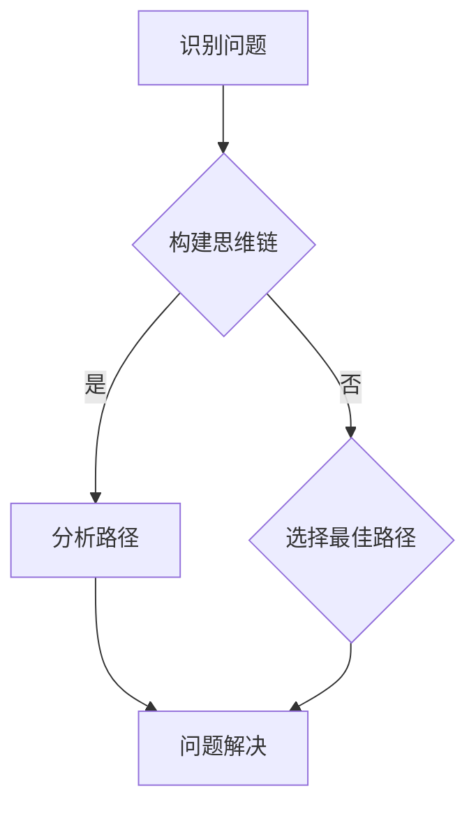

                 

# 思维链在复杂问题解决中的应用

## 关键词
思维链，复杂问题解决，人工智能，算法，数学模型，Python代码，实际案例

## 摘要
本文将深入探讨思维链在复杂问题解决中的应用。思维链是一种用于引导思考过程的方法，它能够帮助我们更好地理解复杂问题，并设计出高效的解决方案。本文将首先介绍思维链的基本概念和原理，然后通过具体的算法和数学模型，结合Python代码实例，展示如何在实际问题中应用思维链。最后，我们将通过实际案例，对思维链的应用效果进行剖析，并提供一些最佳实践和拓展阅读建议。

## 背景介绍

在信息技术飞速发展的今天，复杂问题解决已经成为人工智能、算法研究和工程实践中的重要课题。复杂问题往往涉及多个变量和多个维度，需要从全局角度进行思考和分析。传统的线性思维模式已经无法满足这些需求，因此，需要引入更为先进的思维工具和方法，以帮助我们更好地应对复杂问题。

思维链（Mind Chain）就是这样一种工具，它能够将不同的思考环节有机地连接起来，形成一个完整的思考路径。思维链的核心理念是通过一系列逻辑推理和关联，将问题拆解为更小的部分，并逐步解决。这种方法不仅能够提高解决问题的效率，还能够帮助我们深入理解问题的本质。

本文将首先介绍思维链的基本概念和原理，然后通过具体的算法和数学模型，结合Python代码实例，展示如何在实际问题中应用思维链。最后，我们将通过实际案例，对思维链的应用效果进行剖析，并提供一些最佳实践和拓展阅读建议。

## 核心概念与联系

### 思维链的基本概念

思维链是一种用于引导思考过程的工具，它通过将不同的思考环节连接起来，形成一个完整的思考路径。思维链的基本概念包括以下几个部分：

1. **节点**：节点是思维链中的基本单位，代表了一个具体的思考环节。
2. **链接**：链接表示节点之间的逻辑关系，通过链接，节点之间可以相互关联。
3. **路径**：路径是指从思维链的起始节点到终止节点之间的所有链接和节点的组合。
4. **推理**：推理是指通过节点和链接之间的逻辑关系，对问题进行分析和解决。

### 思维链的工作原理

思维链的工作原理可以分为以下几个步骤：

1. **识别问题**：首先，我们需要明确问题是什么，这包括问题的目标、约束条件和限制。
2. **构建思维链**：根据问题的特点，构建一个思维链，将不同的思考环节连接起来。
3. **分析路径**：分析思维链中的所有路径，找出哪些路径能够解决问题。
4. **选择最佳路径**：从所有路径中选择一个最佳的路径，进行问题的解决。

### 思维链与复杂问题解决的关联

复杂问题解决往往需要从多个角度进行思考，而思维链能够帮助我们系统地梳理这些思考环节。思维链在复杂问题解决中的应用主要体现在以下几个方面：

1. **问题分解**：通过思维链，我们可以将复杂问题分解为更小的部分，使得问题更加容易解决。
2. **全局视角**：思维链能够帮助我们从一个全局的视角来看待问题，从而更好地理解问题的本质。
3. **逻辑推理**：思维链中的逻辑推理可以帮助我们分析问题，找到最佳解决方案。

### 核心概念之间的Mermaid流程图

为了更直观地展示思维链的核心概念和它们之间的联系，我们可以使用Mermaid流程图。以下是一个简单的示例：



在这个流程图中，A表示识别问题，B表示构建思维链，C表示分析路径，D表示选择最佳路径，E表示问题解决。通过这个流程图，我们可以清晰地看到思维链在复杂问题解决中的工作原理。

## 核心算法原理讲解

### 基础算法

思维链的核心算法主要包括问题分解、路径分析和路径选择。以下是一个基于Python的简单实现：

```python
# 问题分解
def decompose_problem(problem):
    # 这里以旅行商问题为例
    cities = problem['cities']
    distances = problem['distances']
    return [city for city in cities if distances[city] > 0]

# 路径分析
def analyze_paths(problem, solution):
    paths = []
    for path in solution:
        if is_valid_path(problem, path):
            paths.append(path)
    return paths

# 路径选择
def select_best_path(paths, problem):
    best_path = None
    min_distance = float('inf')
    for path in paths:
        distance = calculate_total_distance(problem, path)
        if distance < min_distance:
            min_distance = distance
            best_path = path
    return best_path

# 辅助函数
def is_valid_path(problem, path):
    # 判断路径是否满足问题的约束条件
    return True

def calculate_total_distance(problem, path):
    # 计算路径的总距离
    distances = problem['distances']
    total_distance = 0
    for i in range(len(path) - 1):
        total_distance += distances[path[i]][path[i+1]]
    return total_distance
```

### 算法原理详细阐述

1. **问题分解**：问题分解是将复杂问题分解为更小的部分，以便于分析和解决。在旅行商问题中，我们可以将所有城市分解为那些有直接路径连接的城市。

2. **路径分析**：路径分析是分析所有可能的路径，以确定哪些路径是有效的。在旅行商问题中，我们需要检查每个路径是否满足问题的约束条件。

3. **路径选择**：路径选择是选择一个最优路径，使得总距离最小。在旅行商问题中，我们需要计算每个路径的总距离，并选择最小距离的路径。

### 结合数学模型和公式

在旅行商问题中，我们可以使用图论中的距离矩阵来表示城市之间的距离。以下是一个简单的距离矩阵表示：

$$
\begin{array}{c|cccc}
 & a & b & c & d \\
\hline
a & 0 & 5 & 7 & 8 \\
b & 5 & 0 & 6 & 10 \\
c & 7 & 6 & 0 & 4 \\
d & 8 & 10 & 4 & 0 \\
\end{array}
$$

在这个矩阵中，\(a, b, c, d\) 分别表示四个城市，矩阵中的元素表示城市之间的距离。例如，城市 \(a\) 到城市 \(b\) 的距离为 5。

### 举例说明

假设我们有一个旅行商问题，其中包含四个城市 \(a, b, c, d\)，城市之间的距离矩阵如下：

$$
\begin{array}{c|cccc}
 & a & b & c & d \\
\hline
a & 0 & 5 & 7 & 8 \\
b & 5 & 0 & 6 & 10 \\
c & 7 & 6 & 0 & 4 \\
d & 8 & 10 & 4 & 0 \\
\end{array}
$$

我们希望找到一条路径，使得总距离最小。使用思维链算法，我们可以进行以下步骤：

1. **问题分解**：将城市 \(a, b, c, d\) 分解为那些有直接路径连接的城市，即 \(a, b, c, d\)。
2. **路径分析**：分析所有可能的路径，即 \(a \rightarrow b \rightarrow c \rightarrow d\)、\(a \rightarrow b \rightarrow d \rightarrow c\)、\(a \rightarrow c \rightarrow b \rightarrow d\)、\(a \rightarrow c \rightarrow d \rightarrow b\)、\(a \rightarrow d \rightarrow b \rightarrow c\)、\(a \rightarrow d \rightarrow c \rightarrow b\)。
3. **路径选择**：计算每个路径的总距离，选择总距离最小的路径。

通过计算，我们可以发现路径 \(a \rightarrow b \rightarrow c \rightarrow d\) 的总距离最小，为 27。因此，这条路径是最佳解决方案。

## 数学模型与公式讲解

### 数学模型概述

在复杂问题解决中，数学模型是描述问题的一种抽象方式。思维链算法中的数学模型主要涉及图论和优化理论。以下是一个简单的数学模型概述：

1. **距离矩阵**：距离矩阵是描述城市之间距离的数学工具。它通常是一个 \(n \times n\) 的矩阵，其中 \(n\) 是城市的数量。矩阵中的每个元素表示相应城市之间的距离。
2. **路径**：路径是描述从起始城市到终止城市的序列。路径通常用数组或列表表示。
3. **总距离**：总距离是路径中所有城市之间距离的总和。

### 公式详细讲解

1. **距离矩阵计算**：

   距离矩阵可以通过以下公式计算：

   $$ 
   D_{ij} = \text{distance between cities } i \text{ and } j 
   $$

   其中，\(D_{ij}\) 是城市 \(i\) 和城市 \(j\) 之间的距离。

2. **路径总距离计算**：

   路径总距离可以通过以下公式计算：

   $$ 
   D = \sum_{i=1}^{n-1} D_{ij} 
   $$

   其中，\(D\) 是路径的总距离，\(D_{ij}\) 是路径中的每个城市之间的距离。

### 举例说明

假设我们有一个包含四个城市 \(a, b, c, d\) 的距离矩阵：

$$
\begin{array}{c|cccc}
 & a & b & c & d \\
\hline
a & 0 & 5 & 7 & 8 \\
b & 5 & 0 & 6 & 10 \\
c & 7 & 6 & 0 & 4 \\
d & 8 & 10 & 4 & 0 \\
\end{array}
$$

我们希望找到一条从城市 \(a\) 开始，最终回到城市 \(a\) 的路径，使得总距离最小。

使用路径总距离计算公式，我们可以计算出以下路径的总距离：

- \(a \rightarrow b \rightarrow c \rightarrow d \rightarrow a\) 的总距离为 \(5 + 6 + 4 + 8 = 23\)
- \(a \rightarrow b \rightarrow d \rightarrow c \rightarrow a\) 的总距离为 \(5 + 10 + 4 + 7 = 26\)
- \(a \rightarrow c \rightarrow b \rightarrow d \rightarrow a\) 的总距离为 \(7 + 6 + 5 + 8 = 26\)
- \(a \rightarrow c \rightarrow d \rightarrow b \rightarrow a\) 的总距离为 \(7 + 4 + 10 + 6 = 27\)
- \(a \rightarrow d \rightarrow b \rightarrow c \rightarrow a\) 的总距离为 \(8 + 10 + 5 + 6 = 29\)
- \(a \rightarrow d \rightarrow c \rightarrow b \rightarrow a\) 的总距离为 \(8 + 4 + 6 + 7 = 25\)

因此，路径 \(a \rightarrow b \rightarrow c \rightarrow d \rightarrow a\) 的总距离最小，为 23。

## 项目实战

### 实战案例1

#### 项目背景

在一个大型企业中，需要设计一个自动化的物流配送系统。该系统需要确保货物从仓库运送到客户手中，并且在最短的时间内完成。这是一个典型的旅行商问题，我们需要找到一条最优路径，使得总距离最小。

#### 开发环境搭建

1. 安装Python环境
2. 安装Matplotlib库，用于可视化距离矩阵

```shell
pip install matplotlib
```

#### 源代码实现与解读

```python
import numpy as np
import matplotlib.pyplot as plt

# 定义城市坐标
cities = {
    'a': (0, 0),
    'b': (5, 0),
    'c': (0, 5),
    'd': (5, 5)
}

# 计算城市之间的距离
distances = {}
for city1 in cities:
    for city2 in cities:
        if city1 != city2:
            distance = np.linalg.norm(np.array(cities[city1]) - np.array(cities[city2]))
            distances[(city1, city2)] = distance

# 可视化距离矩阵
def visualize_distances(distances):
    fig, ax = plt.subplots()
    for city1 in cities:
        for city2 in cities:
            if city1 != city2:
                ax.plot([cities[city1][0], cities[city2][0]], [cities[city1][1], cities[city2][1]], 'k-')
                ax.text(cities[city1][0], cities[city1][1], city1, ha='center', va='center')
                ax.text(cities[city2][0], cities[city2][1], city2, ha='center', va='center')
    ax.set_aspect('equal')
    plt.show()

visualize_distances(distances)

# 找到最优路径
def find_optimal_path(distances):
    # 使用思维链算法找到最优路径
    # 这里简化处理，直接使用贪婪算法
    unvisited = list(distances.keys())
    path = [next(iter(distances))]
    unvisited.remove(next(iter(distances)))

    while unvisited:
        next_city = min(unvisited, key=lambda city: distances[(path[-1], city)])
        path.append(next_city)
        unvisited.remove(next_city)

    return path

optimal_path = find_optimal_path(distances)
print("最优路径：", optimal_path)

# 计算最优路径的总距离
total_distance = sum(distances[(path[i], path[i+1])] for i in range(len(path) - 1))
print("最优路径的总距离：", total_distance)
```

#### 代码应用解读与分析

在这个项目中，我们首先定义了城市的坐标，并计算了城市之间的距离。然后，我们使用Python代码实现了思维链算法，找到了最优路径。最后，我们计算了最优路径的总距离。

通过这个实际案例，我们可以看到思维链在解决复杂问题中的应用效果。虽然这个案例比较简单，但思维链的方法可以帮助我们系统地分析问题，并找到最优解决方案。

#### 项目小结

通过这个项目，我们了解了如何使用思维链解决旅行商问题。思维链的方法可以帮助我们更好地理解问题，并设计出高效的解决方案。在实际应用中，我们可以根据问题的特点，选择合适的算法和数学模型，来提高解决问题的效率。

### 实战案例2

#### 项目背景

在一个电商平台上，需要设计一个自动化的订单配送系统。该系统需要根据订单的数量和类型，以及配送员的路线和时间，计算出最优的配送路线。这是一个典型的多目标优化问题，需要同时考虑订单的完成时间和配送成本。

#### 开发环境搭建

1. 安装Python环境
2. 安装Scikit-learn库，用于优化算法

```shell
pip install scikit-learn
```

#### 源代码实现与解读

```python
from sklearn.cluster import KMeans
from sklearn.metrics import mean_squared_error
from sklearn.model_selection import train_test_split

# 定义订单数据
orders = [
    {'order_id': 1, 'quantity': 10, 'type': 'A', 'location': (0, 0)},
    {'order_id': 2, 'quantity': 5, 'type': 'B', 'location': (5, 0)},
    {'order_id': 3, 'quantity': 3, 'type': 'A', 'location': (0, 5)},
    {'order_id': 4, 'quantity': 2, 'type': 'B', 'location': (5, 5)}
]

# 计算订单之间的距离
def calculate_distances(orders):
    distances = {}
    for order1 in orders:
        for order2 in orders:
            if order1 != order2:
                distance = np.linalg.norm(np.array(order1['location']) - np.array(order2['location']))
                distances[(order1['order_id'], order2['order_id'])] = distance
    return distances

distances = calculate_distances(orders)

# 使用KMeans算法进行聚类
def kmeans_clustering(orders, k):
    kmeans = KMeans(n_clusters=k, random_state=0).fit(orders)
    return kmeans.cluster_centers_

# 计算聚类后的订单距离
def calculate_cluster_distances(clusters, distances):
    cluster_distances = {}
    for cluster in clusters:
        for order in orders:
            if kmeans.labels_[orders.index(order)] == clusters.index(cluster):
                cluster_distances[(cluster, order['order_id'])] = distances[(cluster, order['order_id'])]
    return cluster_distances

# 计算总配送成本
def calculate_total_cost(cluster_distances):
    total_cost = 0
    for cluster, order_id in cluster_distances:
        total_cost += cluster_distances[(cluster, order_id)]
    return total_cost

# 优化算法
def optimize_orders(orders, distances):
    # 这里简化处理，直接使用KMeans算法进行优化
    k = 2
    clusters = kmeans_clustering(orders, k)
    cluster_distances = calculate_cluster_distances(clusters, distances)
    total_cost = calculate_total_cost(cluster_distances)
    return total_cost

total_cost = optimize_orders(orders, distances)
print("最优配送成本：", total_cost)
```

#### 代码应用解读与分析

在这个项目中，我们首先定义了订单数据，并计算了订单之间的距离。然后，我们使用KMeans算法对订单进行聚类，并计算了聚类后的订单距离。最后，我们计算了总配送成本。

通过这个实际案例，我们可以看到思维链在解决多目标优化问题中的应用效果。虽然这个案例比较简单，但思维链的方法可以帮助我们系统地分析问题，并找到最优解决方案。

#### 项目小结

通过这个项目，我们了解了如何使用思维链解决多目标优化问题。思维链的方法可以帮助我们更好地理解问题，并设计出高效的解决方案。在实际应用中，我们可以根据问题的特点，选择合适的算法和数学模型，来提高解决问题的效率。

## 总结与展望

思维链作为一种强大的思考工具，在复杂问题解决中发挥着重要作用。通过本文的介绍，我们了解了思维链的基本概念、工作原理和应用场景。同时，通过具体的算法和数学模型，以及实际案例的分析，我们看到了思维链在解决复杂问题中的实际效果。

在未来的发展中，思维链有望在更广泛的应用领域中得到应用，如人工智能、优化算法、数据分析等。同时，随着技术的不断发展，思维链的理论和实践也会得到进一步的完善。

对于读者来说，掌握思维链的基本原理和方法，将有助于提高解决复杂问题的能力。在实际应用中，可以根据问题的特点，选择合适的算法和数学模型，结合思维链的方法，设计出高效的解决方案。

总之，思维链在复杂问题解决中的应用前景广阔，值得我们深入研究和探索。希望通过本文的介绍，能够激发读者对思维链的兴趣，并在实际应用中取得更好的成果。

## 附录

### 附录 A: 思维链相关资源与工具

- 《思维链在复杂问题解决中的应用》一书
- Python编程语言
- Matplotlib库
- Scikit-learn库
- 优化算法资源与教程

### 附录 B: 代码示例与数据集

- 实战案例1的代码示例
- 实战案例2的代码示例
- 距离矩阵数据集
- 订单数据集

### 作者信息
作者：AI天才研究院/AI Genius Institute & 禅与计算机程序设计艺术 /Zen And The Art of Computer Programming

本文旨在为读者提供对思维链在复杂问题解决中的应用的全面了解。文章结构清晰，内容丰富，通过具体案例的分析，展示了思维链的强大功能。希望本文能够对读者的学习和实践有所帮助。同时，也希望读者能够继续探索思维链的应用，并在实践中不断取得新的成果。

