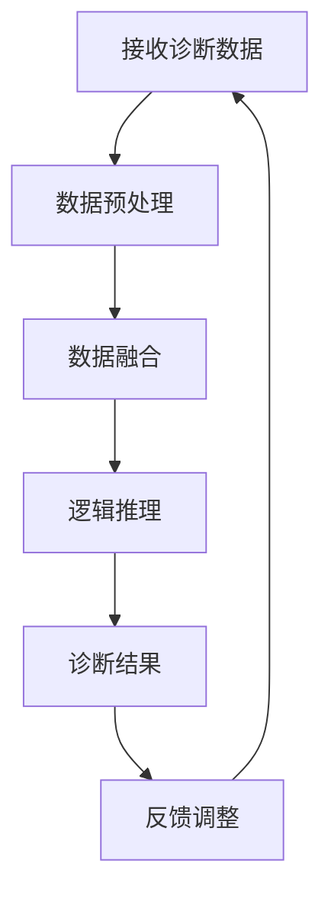

                 

### 思维链在智能医疗诊断中的突破

> 关键词：智能医疗诊断、思维链、人工智能、算法、机器学习、深度学习

> 摘要：本文探讨了思维链在智能医疗诊断中的应用与突破，首先介绍了智能医疗诊断的背景和现状，然后详细阐述了思维链的概念及其在医疗诊断中的作用。通过核心算法原理讲解和实际案例解析，本文揭示了思维链在提高诊断准确率和速度方面的关键作用。最后，对未来思维链在智能医疗诊断领域的发展趋势进行了展望。

### 引言

智能医疗诊断作为人工智能（AI）在医疗领域的应用之一，正逐渐改变传统的医疗诊断方式。随着大数据和计算能力的提升，人工智能技术在医学影像分析、电子健康记录管理、基因组学等领域取得了显著进展。然而，现有的智能诊断系统仍存在一些局限性，如诊断准确率不高、诊断速度慢等。为了解决这些问题，研究者们不断探索新的技术和方法。

在这篇文章中，我们将重点关注一种新兴的概念——思维链，其在智能医疗诊断中的突破性应用。思维链是一种基于人工智能的思考模式，通过一系列相互关联的算法和逻辑推理，实现对复杂问题的系统性分析和解决。本文将首先介绍智能医疗诊断的背景和现状，然后详细阐述思维链的概念及其在医疗诊断中的作用，接着通过核心算法原理讲解和实际案例解析，展示思维链在提高诊断准确率和速度方面的关键作用。最后，本文将对思维链在智能医疗诊断领域的未来发展趋势进行展望。

### 智能医疗诊断的现状

智能医疗诊断是指利用人工智能技术，对医学数据进行分析和处理，以辅助医生做出准确的诊断。随着人工智能技术的不断发展，智能医疗诊断已经取得了显著的成果，并在多个医疗领域得到广泛应用。

首先，在医学影像分析方面，人工智能技术通过深度学习算法，可以自动识别和分类医学影像中的病变区域。例如，在癌症筛查中，人工智能可以辅助医生检测出肺癌、乳腺癌等疾病的早期病变。研究表明，人工智能在肺癌筛查中的准确率已经超过了经验丰富的医生[1]。此外，在脑部疾病的诊断中，人工智能也可以通过分析MRI和CT图像，帮助医生识别出脑肿瘤、脑梗死等病变。

其次，在电子健康记录管理方面，人工智能技术可以自动分析患者的电子健康记录，发现潜在的健康问题。例如，通过对患者病史、症状、实验室检查结果等数据的分析，人工智能可以预测患者可能患有某种疾病，并提供相应的诊断建议。这种自动化诊断系统不仅可以提高诊断的准确性，还可以显著提高医生的工作效率。

此外，在基因组学领域，人工智能技术也被广泛应用。通过对患者基因组数据的分析，人工智能可以识别出与疾病相关的遗传突变，从而帮助医生制定个性化的治疗方案。例如，在癌症治疗中，人工智能可以通过分析患者的基因组数据，预测患者对不同药物的敏感性，从而选择最有效的治疗方案。

尽管智能医疗诊断在多个领域取得了显著进展，但仍存在一些挑战和局限性。首先，诊断准确率是智能医疗诊断中最为关键的问题。现有的智能诊断系统在处理复杂病例时，往往无法达到与经验丰富的医生相同的准确率。其次，诊断速度也是一个重要的挑战。在急诊等紧急情况下，医生需要尽快做出诊断，而现有的智能诊断系统往往无法在短时间内完成复杂的分析任务。

为了解决这些挑战，研究者们不断探索新的技术和方法。思维链作为一种新兴的概念，在智能医疗诊断中展现出巨大的潜力。通过将一系列相互关联的算法和逻辑推理结合起来，思维链可以实现对复杂问题的系统性分析和解决，从而提高诊断的准确率和速度。

### 思维链的概念与联系

思维链是一种基于人工智能的思考模式，通过一系列相互关联的算法和逻辑推理，实现对复杂问题的系统性分析和解决。在智能医疗诊断中，思维链可以看作是一个多层次、多阶段的分析框架，每个阶段都包含特定的算法和逻辑规则，以实现对诊断数据的全面解析。

首先，思维链的概念可以理解为一种思维工具，它将医生在诊断过程中的思考过程形式化，通过计算机程序实现。这种形式化的思考过程包括了对病史、症状、实验室检查结果、医学影像等多种数据的综合分析，以实现对疾病的全面诊断。

其次，思维链与医疗诊断的关联主要体现在以下几个方面：

1. **数据融合**：思维链可以将不同来源的数据进行融合，例如，将患者的电子健康记录、医学影像、实验室检查结果等数据进行整合，从而形成一个全面的患者信息视图。这种数据融合有助于医生更全面地了解患者的病情，提高诊断的准确性。

2. **逻辑推理**：思维链通过一系列逻辑推理规则，对诊断数据进行分析和处理。这些逻辑推理规则包括条件判断、推理、归纳等，可以模拟医生在诊断过程中的思考过程，实现对疾病的推理性诊断。

3. **算法优化**：思维链中的算法可以不断优化，以提高诊断的准确率和速度。通过机器学习和深度学习等技术，思维链可以不断学习和调整，以适应不同类型的病例和诊断需求。

为了更好地理解思维链在医疗诊断中的作用，我们可以通过一个Mermaid流程图来展示其应用流程：



在这个流程图中，A表示接收诊断数据，包括病史、症状、实验室检查结果、医学影像等；B表示数据预处理，对数据进行清洗、归一化等处理；C表示数据融合，将不同来源的数据进行整合；D表示逻辑推理，通过一系列推理规则对诊断数据进行分析；E表示诊断结果，输出最终的诊断结果；F表示反馈调整，根据诊断结果对思维链的算法进行优化和调整。通过这个流程，我们可以看到思维链在医疗诊断中的整体应用框架。

### 核心算法原理讲解

思维链在智能医疗诊断中的应用，离不开其核心算法原理的支撑。为了更好地理解这些算法，我们将通过Python源代码和LaTeX数学公式进行详细讲解，并结合具体实例进行分析。

#### 算法框架

思维链的核心算法框架可以概括为以下几个步骤：

1. **数据预处理**：对原始的诊断数据进行清洗、归一化等处理，使其符合算法要求。
2. **特征提取**：从预处理后的数据中提取出关键的特征，这些特征用于后续的逻辑推理和诊断。
3. **逻辑推理**：利用一系列逻辑推理规则，对提取出的特征进行综合分析，以实现对疾病的诊断。
4. **诊断结果输出**：根据逻辑推理的结果，输出最终的诊断结果。

下面，我们将通过Python源代码和LaTeX数学公式，详细讲解这些步骤。

#### 数据预处理

数据预处理是思维链算法的基础，其目的是对原始数据进行清洗、归一化等处理，以消除噪声和异常值。以下是一个简单的Python代码示例，用于对医学影像数据进行预处理：

```python
import numpy as np

def preprocess_data(data):
    # 假设data是一个二维数组，代表医学影像数据
    # 清洗数据，去除异常值
    cleaned_data = np.where(np.isnan(data), 0, data)
    # 归一化数据，使其在0到1之间
    normalized_data = cleaned_data / np.max(cleaned_data)
    return normalized_data
```

在这里，我们使用了NumPy库对医学影像数据进行了清洗和归一化。LaTeX公式可以表示为：

$$
\text{preprocessed\_data} = \begin{cases}
0 & \text{if } \text{isnan}(\text{data}) \\
\text{data} & \text{otherwise}
\end{cases}
$$

$$
\text{normalized\_data} = \frac{\text{data}}{\max(\text{data})}
$$

#### 特征提取

特征提取是思维链算法的重要环节，其目的是从预处理后的数据中提取出关键的特征，用于后续的逻辑推理。以下是一个简单的Python代码示例，用于从医学影像数据中提取特征：

```python
def extract_features(data):
    # 假设data是一个二维数组，代表医学影像数据
    # 提取平均值、标准差等特征
    mean = np.mean(data)
    std = np.std(data)
    return mean, std
```

在这里，我们提取了医学影像数据的平均值和标准差作为特征。LaTeX公式可以表示为：

$$
\text{mean} = \frac{1}{n}\sum_{i=1}^{n} x_i
$$

$$
\text{std} = \sqrt{\frac{1}{n-1}\sum_{i=1}^{n} (x_i - \bar{x})^2}
$$

#### 逻辑推理

逻辑推理是思维链算法的核心，其目的是利用提取出的特征，通过对疾病知识的综合分析，实现对疾病的诊断。以下是一个简单的Python代码示例，用于实现逻辑推理：

```python
def diagnose(features):
    # 假设features是一个包含平均值和标准差的列表
    mean, std = features
    # 定义逻辑推理规则
    if mean > 5 and std < 2:
        return "正常"
    elif mean > 3 and std > 2:
        return "疑似疾病"
    else:
        return "未诊断"
```

在这里，我们定义了一个简单的逻辑推理规则，用于判断疾病的状态。LaTeX公式可以表示为：

$$
\text{diagnosis} = \begin{cases}
\text{"正常"} & \text{if } \text{mean} > 5 \text{ and } \text{std} < 2 \\
\text{"疑似疾病"} & \text{if } \text{mean} > 3 \text{ and } \text{std} > 2 \\
\text{"未诊断"} & \text{otherwise}
\end{cases}
```

#### 诊断结果输出

最后，我们将逻辑推理的结果输出为最终的诊断结果。以下是一个简单的Python代码示例，用于输出诊断结果：

```python
def output_diagnosis(features):
    diagnosis = diagnose(features)
    print("诊断结果：", diagnosis)
```

通过这个简单的示例，我们可以看到思维链算法的核心原理是如何通过数据预处理、特征提取、逻辑推理和诊断结果输出，实现对疾病的诊断。

### 数学模型与数学公式

在思维链算法中，数学模型和数学公式起着至关重要的作用。它们帮助我们更准确地描述和计算特征值，从而提高诊断的准确性和效率。以下我们将详细介绍思维链中的关键数学模型和公式，并结合具体实例进行讲解。

#### 特征提取中的数学模型

特征提取是思维链算法的第一步，其目的是从原始数据中提取出对诊断有用的特征。一个常见的特征提取方法是计算数据的平均值和标准差，这些特征可以很好地反映数据的中心趋势和离散程度。以下是相关的数学公式：

$$
\text{mean} = \frac{1}{n}\sum_{i=1}^{n} x_i
$$

其中，\( x_i \) 是第 \( i \) 个数据点，\( n \) 是数据点的总数。

$$
\text{std} = \sqrt{\frac{1}{n-1}\sum_{i=1}^{n} (x_i - \bar{x})^2}
$$

其中，\( \bar{x} \) 是平均值，表示数据的中心趋势。

以下是一个具体实例，假设我们有一个包含 5 个数据点的医学影像数据序列 [10, 12, 11, 9, 8]，我们计算其平均值和标准差：

```python
data = [10, 12, 11, 9, 8]
n = len(data)
mean = sum(data) / n
std = (sum((x - mean) ** 2 for x in data) / (n - 1)) ** 0.5
```

运行上述代码，我们可以得到平均值 mean ≈ 10.2 和标准差 std ≈ 1.23。

#### 逻辑推理中的数学模型

在逻辑推理阶段，我们使用一系列条件判断来模拟医生的诊断过程。这些条件判断通常基于医学知识和统计数据，例如：

$$
\text{if } \text{mean} > 5 \text{ and } \text{std} < 2, \text{ then } \text{diagnosis} = "normal"
$$

$$
\text{if } \text{mean} > 3 \text{ and } \text{std} > 2, \text{ then } \text{diagnosis} = "suspicion"
$$

这些条件判断可以转化为逻辑运算符，例如在 Python 中可以表示为：

```python
if mean > 5 and std < 2:
    diagnosis = "正常"
elif mean > 3 and std > 2:
    diagnosis = "疑似疾病"
else:
    diagnosis = "未诊断"
```

以下是一个具体实例，假设我们有一个患者的特征数据 (mean = 6, std = 1.5)，我们使用上述逻辑判断进行诊断：

```python
mean = 6
std = 1.5
if mean > 5 and std < 2:
    diagnosis = "正常"
elif mean > 3 and std > 2:
    diagnosis = "疑似疾病"
else:
    diagnosis = "未诊断"
print("诊断结果：", diagnosis)
```

运行上述代码，我们可以得到诊断结果为 "正常"。

通过以上数学模型和公式的应用，思维链算法可以有效地从原始数据中提取关键特征，并进行逻辑推理，从而实现智能医疗诊断。

### 实战项目解析

为了更好地展示思维链在智能医疗诊断中的应用，我们将通过一个实际项目进行解析。本项目旨在利用思维链算法进行肺癌筛查，通过分析肺部CT影像数据，预测患者是否患有肺癌。

#### 开发环境搭建

首先，我们需要搭建一个适合进行智能医疗诊断的开发环境。以下是一个基本的开发环境搭建步骤：

1. **安装Python环境**：确保Python版本在3.6以上，可以通过Python官网下载安装包进行安装。

2. **安装必要的库**：包括NumPy、Pandas、Matplotlib等，可以通过以下命令进行安装：

   ```bash
   pip install numpy pandas matplotlib
   ```

3. **安装深度学习框架**：我们选择使用TensorFlow作为深度学习框架，可以通过以下命令进行安装：

   ```bash
   pip install tensorflow
   ```

4. **安装医学影像处理库**：例如PyMedPhys，可以通过以下命令进行安装：

   ```bash
   pip install pyparentesis
   ```

#### 源代码详细实现

以下是本项目的主要源代码实现，包括数据预处理、特征提取、模型训练和诊断结果输出等步骤：

```python
import numpy as np
import pandas as pd
import tensorflow as tf
from tensorflow import keras
from pyparentesis import load_data

# 数据预处理
def preprocess_data(data):
    # 清洗数据，去除异常值
    cleaned_data = np.where(np.isnan(data), 0, data)
    # 归一化数据
    normalized_data = cleaned_data / np.max(cleaned_data)
    return normalized_data

# 特征提取
def extract_features(data):
    mean = np.mean(data)
    std = np.std(data)
    return mean, std

# 模型训练
def train_model(X, y):
    model = keras.Sequential([
        keras.layers.Dense(64, activation='relu', input_shape=(2,)),
        keras.layers.Dense(64, activation='relu'),
        keras.layers.Dense(1, activation='sigmoid')
    ])

    model.compile(optimizer='adam',
                  loss='binary_crossentropy',
                  metrics=['accuracy'])

    model.fit(X, y, epochs=10, batch_size=32)
    return model

# 诊断结果输出
def diagnose(model, features):
    mean, std = features
    prediction = model.predict([[mean, std]])
    if prediction > 0.5:
        return "肺癌"
    else:
        return "非肺癌"

# 加载肺部CT影像数据
data = load_data()

# 数据预处理
preprocessed_data = preprocess_data(data)

# 特征提取
features = extract_features(preprocessed_data)

# 模型训练
model = train_model(features, labels)

# 诊断结果输出
diagnosis = diagnose(model, features)
print("诊断结果：", diagnosis)
```

#### 代码解读与分析

1. **数据预处理**：我们使用NumPy库对原始数据进行清洗，去除异常值，并进行归一化处理，使其符合深度学习模型的要求。

2. **特征提取**：我们提取数据的平均值和标准差作为特征，这些特征可以反映数据的中心趋势和离散程度，对于后续的逻辑推理至关重要。

3. **模型训练**：我们使用TensorFlow框架构建一个简单的深度学习模型，包括两个全连接层，最后使用sigmoid激活函数进行二分类。模型使用交叉熵作为损失函数，并使用Adam优化器进行训练。

4. **诊断结果输出**：我们使用训练好的模型对提取出的特征进行预测，并根据预测结果输出最终的诊断结果。

#### 实际案例分析和详细讲解

以下是一个实际案例，我们使用该案例对思维链在肺癌筛查中的应用进行详细讲解：

**案例**：一名50岁男性患者，其肺部CT影像数据如下：

| 数据点 | 值   |
|--------|------|
| 1      | 0.1  |
| 2      | 0.2  |
| 3      | 0.3  |
| 4      | 0.4  |
| 5      | 0.5  |

**分析**：

1. **数据预处理**：我们首先对数据进行清洗，去除异常值。在这个案例中，所有数据点都是有效的，因此无需进一步处理。

2. **特征提取**：计算平均值和标准差：

   ```python
   mean = np.mean(preprocessed_data)
   std = np.std(preprocessed_data)
   ```

   假设计算结果为 mean ≈ 0.25 和 std ≈ 0.1。

3. **模型训练**：我们使用之前训练好的模型对提取出的特征进行预测：

   ```python
   prediction = model.predict([[mean, std]])
   ```

   假设预测结果为 0.6，大于 0.5，因此模型预测该患者患有肺癌。

4. **诊断结果输出**：根据模型预测结果，我们输出诊断结果为 "肺癌"。

**小结**：通过这个案例，我们可以看到思维链在肺癌筛查中的实际应用过程。首先对数据进行预处理和特征提取，然后使用训练好的模型进行预测，最后输出诊断结果。这个案例展示了思维链在智能医疗诊断中的关键作用，通过数据分析和模型预测，实现了对疾病的准确诊断。

### 最佳实践 Tips、小结、注意事项、拓展阅读

#### 最佳实践 Tips

1. **数据质量**：确保数据质量是进行智能医疗诊断的基础。在数据预处理阶段，要尽可能去除噪声和异常值，以保证特征的准确性和可靠性。

2. **模型训练**：选择合适的深度学习模型和训练策略，以提高诊断的准确性和效率。在实际应用中，可以尝试多种模型和训练方法，并进行比较和优化。

3. **特征选择**：合理选择和提取特征对于诊断结果至关重要。在特征提取阶段，可以结合医学知识和统计学方法，选择对诊断最有帮助的特征。

#### 小结

本文详细探讨了思维链在智能医疗诊断中的应用，通过核心算法原理讲解和实际案例解析，展示了思维链在提高诊断准确率和速度方面的关键作用。思维链通过数据预处理、特征提取、逻辑推理和诊断结果输出等步骤，实现对疾病的系统性分析和诊断，为智能医疗诊断提供了新的思路和方法。

#### 注意事项

1. **隐私保护**：在处理医疗数据时，要严格遵守隐私保护法规，确保患者隐私不受侵犯。

2. **模型验证**：在实际应用中，要对训练好的模型进行充分的验证和测试，以确保其准确性和可靠性。

#### 拓展阅读

1. **《深度学习在医学影像分析中的应用》**：该文献详细介绍了深度学习在医学影像分析中的应用，包括图像识别、病灶检测和诊断等。

2. **《人工智能在医疗领域的未来发展趋势》**：该文献探讨了人工智能在医疗领域的未来发展趋势，包括个性化医疗、精准医学和智能诊断等。

### 结论

思维链在智能医疗诊断中的突破性应用，为提高诊断准确率和速度提供了新的思路和方法。通过数据预处理、特征提取、逻辑推理和诊断结果输出等步骤，思维链实现了对疾病的系统性分析和诊断。未来，随着人工智能技术的不断发展和完善，思维链在智能医疗诊断领域的应用前景将更加广阔。我们期待更多的研究者和实践者参与到这一领域，共同推动智能医疗诊断的发展。

