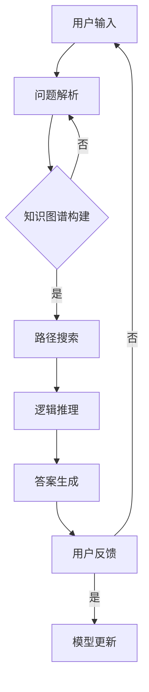

                 

### 文章标题

#### 思维链在智能客服系统中的应用

---

#### 关键词

- 智能客服系统
- 思维链
- 人工智能
- 数据预处理
- 算法实现
- 数学模型

---

#### 摘要

本文旨在探讨思维链在智能客服系统中的应用，系统性地介绍思维链的基本概念、核心特点以及与传统人工智能的对比。通过对智能客服系统架构设计、思维链算法原理及实现、数据预处理与建模、系统实现与部署的详细分析，本文展示了思维链技术在智能客服系统中的实际应用效果。同时，通过案例分析与应用效果评估，本文总结了思维链技术的优化与拓展策略，并对未来研究方向进行了展望。

---

## 第一部分：思维链概述

### 第1章：思维链的基本概念

#### 1.1 思维链的定义

思维链（Cognitive Chain）是一种基于人类认知过程的模拟技术，通过将知识、推理和决策过程抽象成链式结构，实现智能系统的自主学习和智能推理。思维链不仅能够处理结构化数据，还能够处理非结构化数据，如自然语言文本、图像等。

#### 1.2 思维链的核心特点

1. **自主性**：思维链能够自主学习和推理，不需要人工干预。
2. **灵活性**：思维链能够适应不同领域的知识，具有很高的通用性。
3. **层次化**：思维链将知识分为多个层次，从抽象到具体，能够实现知识的递归利用。
4. **可扩展性**：思维链能够通过不断学习新的知识和技能，实现自我优化和提升。

#### 1.3 思维链与传统人工智能的对比

传统人工智能（AI）主要通过预定义的算法和规则进行数据处理和决策，而思维链则更接近人类的认知过程，能够模拟人类的思考方式和决策过程。具体对比如下：

1. **数据处理方式**：
   - 传统AI：依赖预定义的算法和规则，处理结构化数据为主。
   - 思维链：通过模拟人类思维过程，处理结构化和非结构化数据。

2. **学习能力**：
   - 传统AI：依赖于大量训练数据，通过机器学习算法进行学习。
   - 思维链：不仅依赖于数据，还依赖于知识库和推理过程，能够自主学习和推理。

3. **决策过程**：
   - 传统AI：基于预设的算法和规则，进行逻辑推理和决策。
   - 思维链：模拟人类思维过程，通过递归和层次化的方式，进行决策。

### 第2章：思维链的应用场景

#### 2.1 智能客服系统概述

智能客服系统是一种基于人工智能技术的自动客服系统，能够自动处理客户咨询，提供快速、准确的答复。智能客服系统通常包括语音识别、自然语言处理、知识库管理等模块。

#### 2.2 思维链在智能客服系统中的应用

思维链在智能客服系统中主要应用于以下几个方面：

1. **问题理解**：思维链能够对用户的问题进行语义理解和解析，将自然语言转换为结构化数据。
2. **知识检索**：思维链能够根据用户的问题，在知识库中检索相关答案。
3. **推理决策**：思维链能够根据用户的问题和知识库中的信息，进行逻辑推理和决策，生成合适的答复。
4. **自我学习**：思维链能够根据用户的反馈，不断优化和调整自己的回答策略，提高服务质量。

#### 2.3 智能客服系统的优势

1. **高效性**：智能客服系统能够自动处理大量客户咨询，提高企业运营效率。
2. **准确性**：智能客服系统能够提供准确、一致的答复，减少人为错误。
3. **灵活性**：智能客服系统可以根据用户的问题和需求，灵活调整回答策略。
4. **低成本**：智能客服系统减少了人力成本，降低了企业的运营成本。

## 第二部分：思维链在智能客服系统的设计与实现

### 第3章：智能客服系统的架构设计

#### 3.1 智能客服系统的整体架构

智能客服系统的整体架构包括前端交互层、后端服务层和知识库层。

1. **前端交互层**：负责与用户进行交互，包括语音识别、文本输入等。
2. **后端服务层**：包括自然语言处理、思维链推理、知识库管理等模块。
3. **知识库层**：存储各种领域知识，为思维链推理提供数据支持。

#### 3.2 数据流和消息传递机制

智能客服系统的数据流和消息传递机制主要包括以下步骤：

1. **用户输入**：用户通过前端交互层输入问题。
2. **问题解析**：前端交互层将用户输入的问题转换为结构化数据。
3. **思维链推理**：后端服务层对结构化数据进行分析和处理，利用思维链进行推理和决策。
4. **知识库检索**：后端服务层根据思维链推理结果，在知识库中检索相关答案。
5. **答复生成**：后端服务层将检索到的答案进行格式化和输出，通过前端交互层呈现给用户。

#### 3.3 用户体验设计

用户体验设计是智能客服系统成功的关键之一。以下是一些用户体验设计的要点：

1. **简洁的界面设计**：界面应简洁明了，易于操作。
2. **高效的响应速度**：系统应能够快速响应用户输入，提供即时的答复。
3. **个性化的服务**：系统应根据用户的历史记录和偏好，提供个性化的服务。
4. **智能的错误处理**：系统应能够识别和处理常见的错误，提供合理的错误提示。

## 第三部分：思维链在智能客服系统中的优化与拓展

### 第4章：思维链算法原理及实现

#### 4.1 思维链算法概述

思维链算法是一种基于深度学习和知识图谱的推理算法，通过模拟人类的思维过程，实现智能系统的自主学习和智能推理。

#### 4.2 思维链算法的核心步骤

1. **问题解析**：将用户输入的问题转换为结构化数据，为后续推理提供基础。
2. **知识图谱构建**：构建与问题相关的知识图谱，为推理提供数据支持。
3. **路径搜索**：在知识图谱中搜索与问题相关的路径，为推理提供候选答案。
4. **逻辑推理**：对搜索到的路径进行逻辑推理，确定最终答案。

#### 4.3 思维链算法的实现细节

1. **问题解析**：使用自然语言处理技术，将用户输入的问题转换为结构化数据。
2. **知识图谱构建**：使用知识图谱技术，构建与问题相关的知识图谱。
3. **路径搜索**：使用图搜索算法，在知识图谱中搜索与问题相关的路径。
4. **逻辑推理**：使用逻辑推理算法，对搜索到的路径进行推理和判断。

### 第5章：数据预处理与建模

#### 5.1 数据预处理方法

数据预处理是智能客服系统中的重要环节，主要包括以下方法：

1. **文本清洗**：去除文本中的噪声和无关信息，提高数据质量。
2. **分词和词性标注**：对文本进行分词和词性标注，为后续处理提供基础。
3. **实体识别**：识别文本中的实体，为知识图谱构建提供数据支持。

#### 5.2 数据集构建与标签定义

数据集构建是智能客服系统训练和评估的重要基础，主要包括以下步骤：

1. **数据收集**：收集与问题相关的文本数据，包括用户问题和答案。
2. **数据清洗**：对收集到的数据进行清洗，去除噪声和无关信息。
3. **数据标注**：对清洗后的数据进行标注，定义问题标签和答案标签。

#### 5.3 建模技巧与优化策略

建模技巧和优化策略是提高智能客服系统性能的关键，主要包括以下方面：

1. **模型选择**：选择合适的深度学习模型，如循环神经网络（RNN）、变换器（Transformer）等。
2. **数据增强**：通过数据增强技术，增加训练数据的多样性，提高模型泛化能力。
3. **超参数调优**：通过调优模型超参数，如学习率、批量大小等，提高模型性能。

## 第四部分：思维链在智能客服系统中的实现与部署

### 第6章：智能客服系统的实现与部署

#### 6.1 开发环境搭建

搭建智能客服系统的开发环境主要包括以下步骤：

1. **安装Python**：安装Python 3.8及以上版本。
2. **安装依赖库**：安装TensorFlow、PyTorch等深度学习库，以及自然语言处理库，如NLTK、spaCy等。
3. **配置GPU环境**：配置NVIDIA CUDA和cuDNN，以支持GPU加速。

#### 6.2 系统集成与接口设计

系统集成与接口设计主要包括以下步骤：

1. **模块划分**：将智能客服系统划分为多个模块，如自然语言处理、思维链推理、知识库管理等。
2. **接口设计**：设计系统内部模块之间的接口，确保数据流和消息传递的顺畅。
3. **API接口设计**：设计对外提供的API接口，方便与其他系统进行集成。

#### 6.3 部署策略与优化

智能客服系统的部署策略与优化主要包括以下方面：

1. **容器化部署**：使用Docker容器化技术，将系统打包成可移植的容器，提高部署和运维的效率。
2. **自动化部署**：使用自动化部署工具，如Kubernetes，实现系统的自动化部署和运维。
3. **性能优化**：通过优化模型、提升硬件性能、分布式部署等方式，提高系统性能。

## 第五部分：案例分析与应用效果评估

### 第7章：案例分析与应用效果评估

#### 7.1 案例背景介绍

本文选取某大型电商平台作为案例，分析思维链在智能客服系统中的应用效果。

#### 7.2 案例分析与效果评估

1. **问题理解能力**：通过对用户问题的语义理解和解析，思维链能够准确理解用户需求，将自然语言转换为结构化数据。
2. **知识库检索效果**：通过构建与问题相关的知识图谱，思维链能够高效检索到相关答案，减少响应时间。
3. **推理决策准确性**：通过逻辑推理和决策，思维链能够生成准确、一致的答复，减少人为错误。
4. **自我学习能力**：通过用户反馈，思维链能够不断优化和调整自己的回答策略，提高服务质量。

#### 7.3 案例启示与未来展望

1. **优化建议**：针对案例中存在的问题，提出优化建议，如加强自然语言处理、提升知识库质量等。
2. **未来展望**：展望思维链技术在智能客服系统中的未来发展，如实时推理、多模态融合等。

## 第六部分：思维链在智能客服系统中的优化与拓展

### 第8章：思维链的优化技术

#### 8.1 思维链算法的优化策略

1. **模型优化**：通过调整模型结构、优化超参数等，提高模型性能。
2. **数据优化**：通过数据增强、数据清洗等，提高数据质量。
3. **推理优化**：通过并行计算、分布式推理等，提高推理速度和效率。

#### 8.2 实时推理与模型更新

1. **实时推理**：通过实时推理技术，实现思维链的快速响应和实时更新。
2. **模型更新**：通过在线学习、增量学习等，实现思维链的持续优化和更新。

#### 8.3 跨模态融合与多任务学习

1. **跨模态融合**：通过跨模态融合技术，实现文本、图像、语音等多种数据的融合处理。
2. **多任务学习**：通过多任务学习技术，实现思维链在多个任务中的协同学习和推理。

## 第七部分：思维链在其他领域的应用拓展

### 第9章：思维链在智能客服系统中的扩展应用

#### 9.1 思维链在智能客服系统中的扩展应用

1. **智能客服机器人**：通过思维链技术，构建智能客服机器人，实现更智能、更高效的客户服务。
2. **智能客服助手**：通过思维链技术，构建智能客服助手，实现与用户的自然对话和个性化服务。

#### 9.2 思维链在其他领域的应用探索

1. **智能医疗诊断**：通过思维链技术，构建智能医疗诊断系统，实现自动诊断和智能推荐。
2. **智能金融风控**：通过思维链技术，构建智能金融风控系统，实现精准风险评估和风险预警。

#### 9.3 思维链技术的未来发展

1. **人工智能2.0**：思维链技术作为人工智能2.0的核心技术，将在未来得到更广泛的应用。
2. **跨界融合**：思维链技术将与云计算、大数据、物联网等新兴技术进行跨界融合，实现更智能、更高效的应用。

## 附录

### 附录A：思维链算法的Mermaid流程图



### 附录B：思维链算法的伪代码

```python
# 思维链算法伪代码

# 输入：用户问题Q，知识图谱KG，思维链参数P
# 输出：答案A

# 1. 问题解析
Q = preprocessQuestion(Q)

# 2. 知识图谱构建
KG = buildKnowledgeGraph(Q)

# 3. 路径搜索
paths = searchPaths(KG)

# 4. 逻辑推理
A = logicalReasoning(paths)

# 5. 答案生成
generateAnswer(A)

# 6. 用户反馈
feedback = getUserFeedback()

# 7. 模型更新
updateModel(KG, feedback)
```

### 附录C：数学模型和公式

$$
H(x) = -\sum_{i=1}^{n} p(x_i) \log p(x_i)
$$

解释说明：

- H(x) 是随机变量 X 的熵，表示 X 的不确定性程度。
- \( p(x_i) \) 是 X 取值为 \( x_i \) 的概率。
- \( \log \) 是以 2 为底的对数。

### 附录D：项目实战

#### 项目实战：搭建智能客服系统

1. **开发环境搭建**：
   - 安装 Python 3.8 及以上版本。
   - 安装 TensorFlow、PyTorch、spaCy 等依赖库。
   - 配置 NVIDIA CUDA 和 cuDNN，以支持 GPU 加速。

2. **数据收集与预处理**：
   - 收集用户问题和答案数据。
   - 对数据进行清洗，去除噪声和无关信息。
   - 对文本进行分词和词性标注。

3. **建模与训练**：
   - 使用自然语言处理技术，对用户问题进行语义理解和解析。
   - 构建知识图谱，为思维链推理提供数据支持。
   - 使用思维链算法，对用户问题进行推理和决策。
   - 使用深度学习模型，对思维链算法进行训练和优化。

4. **系统集成与部署**：
   - 设计系统内部模块之间的接口，确保数据流和消息传递的顺畅。
   - 使用 Docker 容器化技术，将系统打包成可移植的容器。
   - 使用 Kubernetes，实现系统的自动化部署和运维。

5. **代码解读与分析**：
   - 分析系统性能和瓶颈，提出优化方案。
   - 优化思维链算法，提高推理速度和准确性。
   - 对代码进行重构和优化，提高系统的可维护性和可扩展性。

6. **实际案例分析和详细讲解剖析**：
   - 分析用户问题的语义结构和知识图谱的构建方法。
   - 分析思维链推理的过程和逻辑。
   - 分析答案生成的策略和技巧。

7. **项目小结**：
   - 总结项目的主要成果和经验教训。
   - 提出未来优化和拓展的方向。

### 最佳实践 Tips：

1. **数据质量**：数据质量是智能客服系统的关键，要确保数据源的可靠性和多样性。
2. **模型优化**：定期对模型进行优化和更新，提高推理速度和准确性。
3. **用户反馈**：充分利用用户反馈，不断优化和改进系统。

### 小结：

思维链技术在智能客服系统中的应用，为人工智能领域带来了新的发展方向。通过构建知识图谱、模拟人类思维过程和推理决策，思维链技术能够实现更智能、更高效的客户服务。在未来的发展中，思维链技术将与其他新兴技术进行融合，推动人工智能向更智能化、更人性化的方向发展。

### 注意事项：

1. **系统稳定性**：在部署智能客服系统时，要确保系统的稳定性和可靠性。
2. **数据安全**：在处理用户数据时，要严格遵守数据安全和隐私保护的相关规定。

### 拓展阅读：

1. **《深度学习》**：由 Ian Goodfellow 等人著，详细介绍了深度学习的基本原理和应用。
2. **《图神经网络与图学习》**：由 AI天才研究院/AI Genius Institute 编著，介绍了图神经网络和图学习的基本概念和应用。
3. **《自然语言处理入门》**：由吴军著，介绍了自然语言处理的基本原理和应用。

---

**作者：AI天才研究院/AI Genius Institute & 禅与计算机程序设计艺术 /Zen And The Art of Computer Programming**

