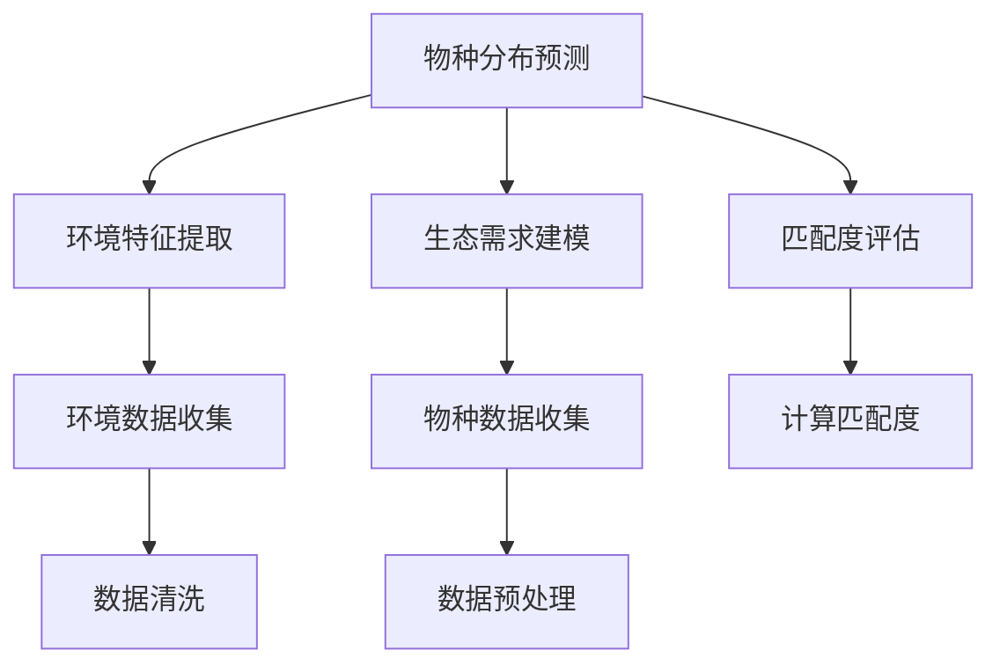

                 

### 《思维链在生物地理学研究中的新方法》

### 关键词
- 生物地理学
- 思维链
- 种群分布预测
- 生态风险评估
- 算法应用

### 摘要
本文探讨了思维链在生物地理学研究中的新方法。通过介绍生物地理学的基本概念和思维链的定义，揭示了思维链方法在物种分布预测和生态风险评估中的应用。文章详细阐述了思维链算法的基本原理、伪代码和案例分析，并运用Python源代码对思维链方法进行了深入讲解。通过实际案例的分析，本文展示了思维链方法在生物地理学研究中的有效性和潜力，为未来的研究提供了新的思路。

### 引言

#### 生物地理学概述
生物地理学是研究生物分布及其与环境相互作用的科学，涵盖从个体到生态系统各个层次。其研究对象包括物种的分布、物种间的相互关系以及生物与环境之间的动态平衡。生物地理学的研究对于理解物种多样性的形成、保护和管理具有重要的意义。

#### 思维链概念介绍
思维链是一种基于人工智能和图论算法的推理方法，通过构建网络结构，将问题分解为一系列相互关联的子问题，从而实现复杂问题的求解。思维链方法具有高度的灵活性和适应性，能够处理复杂、非线性、动态的问题，因而在各个领域得到广泛应用。

#### 思维链在生物地理学中的重要性
思维链方法在生物地理学中的应用，为研究物种分布和生态风险评估提供了新的视角。通过思维链，研究者可以更加准确地预测物种的分布范围，评估生态系统风险，为生物多样性的保护和生态修复提供科学依据。因此，深入探讨思维链在生物地理学中的应用具有重要意义。

### 思维链方法基础

#### 思维链算法原理
思维链算法的核心思想是通过构建网络结构，将问题分解为一系列相互关联的子问题。每个子问题都通过特定的算法进行求解，最终组合得到原问题的解。思维链算法具有以下特点：
1. **网络结构**：思维链算法通过构建网络结构来表示问题，网络中的节点表示子问题，边表示子问题之间的关联。
2. **递归分解**：思维链算法将原问题递归地分解为一系列更小的子问题。
3. **并行处理**：思维链算法允许对子问题进行并行处理，从而提高计算效率。

#### 思维链算法伪代码
```python
def思维链算法(问题):
    if 问题是一个子问题:
        return 解(问题)
    else:
        子问题列表 = 分解(问题)
        解列表 = []
        for 子问题 in 子问题列表:
            解列表.append(思维链算法(子问题))
        return 组合(解列表)
```

#### 思维链算法案例分析
以物种分布预测为例，假设需要预测某一物种在某一地区的分布情况。首先，将问题分解为以下几个子问题：
1. 某一地区的环境特征
2. 某一物种的生态需求
3. 环境特征与生态需求之间的匹配度

通过思维链算法，可以分别求解这些子问题，最终得到某一物种在该地区的分布情况。

### 思维链在物种分布预测中的应用

#### 物种分布预测背景
物种分布预测是生物地理学中的重要研究内容，对于生物多样性保护、生态修复和环境管理具有重要意义。传统的物种分布预测方法主要基于环境变量和物种分布数据的统计模型，如回归分析、贝叶斯网络等。然而，这些方法在处理复杂、非线性、动态的环境因素时存在一定局限性。

#### 思维链方法应用于物种分布预测
思维链方法在物种分布预测中的应用，通过构建网络结构，将物种分布预测问题分解为一系列相互关联的子问题，如环境特征提取、生态需求建模、匹配度评估等。每个子问题通过特定的算法进行求解，最终组合得到物种的分布预测结果。

#### 实例分析与代码实现
以某一物种在某一地区的分布预测为例，使用Python实现思维链算法。首先，提取该地区的环境特征，如温度、湿度、海拔等；其次，构建该物种的生态需求模型；最后，评估环境特征与生态需求之间的匹配度，预测物种的分布范围。

```python
import numpy as np
import pandas as pd

# 环境特征提取
def extract_environmental_features(data):
    # 假设data是包含环境特征的数据框
    return data

# 生态需求建模
def build_ecological_model(species):
    # 假设species是包含物种生态需求的数据框
    return species

# 匹配度评估
def evaluate_fitness(environment, species):
    # 假设environment和species是数据框，包含环境特征和物种生态需求
    fitness = np.linalg.norm(environment - species)
    return fitness

# 思维链算法
def species_distribution_prediction(environment_data, species_data):
    environment = extract_environmental_features(environment_data)
    species = build_ecological_model(species_data)
    fitness = evaluate_fitness(environment, species)
    distribution = np.where(fitness <= threshold)[0]
    return distribution

# 代码实现
environment_data = pd.DataFrame(...)  # 提取环境特征数据
species_data = pd.DataFrame(...)      # 构建生态需求模型数据
distribution = species_distribution_prediction(environment_data, species_data)
print("物种分布预测结果：", distribution)
```

### 思维链在生态风险评估中的应用

#### 生态风险评估背景
生态风险评估是评估某一区域生态系统受到人为或自然因素影响的风险程度，对于制定生态保护和修复措施具有重要意义。传统的生态风险评估方法主要基于生态指标和风险评估模型，如生态指数法、贝叶斯网络等。然而，这些方法在处理复杂、非线性、动态的环境因素时存在一定局限性。

#### 思维链方法在生态风险评估中的应用
思维链方法在生态风险评估中的应用，通过构建网络结构，将生态风险评估问题分解为一系列相互关联的子问题，如风险因素识别、风险因素分析、风险评估等。每个子问题通过特定的算法进行求解，最终组合得到生态风险评估结果。

#### 实例分析与代码实现
以某一区域生态风险评估为例，使用Python实现思维链算法。首先，识别该区域的风险因素，如污染源、自然灾害等；其次，分析风险因素对生态系统的影响；最后，评估生态系统的风险程度。

```python
import numpy as np
import pandas as pd

# 风险因素识别
def identify_risk_factors(data):
    # 假设data是包含风险因素的数据框
    return data

# 风险因素分析
def analyze_risk_factors(risk_factors):
    # 假设risk_factors是数据框，包含风险因素信息
    analysis = np.mean(risk_factors)
    return analysis

# 生态风险评估
def ecological_risk_evaluation(risk_factors, analysis):
    risk_evaluation = analyze_risk_factors(risk_factors)
    if risk_evaluation <= threshold:
        risk_level = "低风险"
    elif risk_evaluation <= threshold2:
        risk_level = "中风险"
    else:
        risk_level = "高风险"
    return risk_level

# 代码实现
risk_factors_data = pd.DataFrame(...)  # 识别风险因素数据
analysis_data = pd.DataFrame(...)      # 分析风险因素数据
risk_evaluation = ecological_risk_evaluation(risk_factors_data, analysis_data)
print("生态风险评估结果：", risk_evaluation)
```

### 案例分析与实践

#### 典型案例介绍
以某一自然保护区为例，评估其生态风险并预测关键物种的分布情况。该自然保护区位于我国某山区，占地面积较大，生态环境复杂。研究过程中，收集了该区域的环境数据、物种分布数据和相关生态指标数据。

#### 案例分析方法
1. 提取环境特征：收集该自然保护区的环境数据，包括温度、湿度、海拔、土壤类型等。
2. 构建生态需求模型：根据关键物种的生态需求，构建生态需求模型。
3. 风险因素识别：识别该自然保护区的主要风险因素，如自然灾害、人类活动等。
4. 风险因素分析：分析风险因素对生态系统的潜在影响。
5. 预测物种分布：使用思维链方法预测关键物种在该自然保护区的分布情况。

#### 案例分析与解决方案
1. **环境特征提取**：通过收集和整理环境数据，构建环境特征数据集。
2. **生态需求模型构建**：根据关键物种的生态需求，构建生态需求模型。
3. **风险因素识别与分析**：识别自然灾害、人类活动等风险因素，分析其对生态系统的潜在影响。
4. **物种分布预测**：使用思维链方法，预测关键物种在该自然保护区的分布情况。

```python
import numpy as np
import pandas as pd

# 环境特征提取
def extract_environmental_features(data):
    # 假设data是包含环境特征的数据框
    return data

# 生态需求建模
def build_ecological_model(species):
    # 假设species是包含物种生态需求的数据框
    return species

# 风险因素识别
def identify_risk_factors(data):
    # 假设data是包含风险因素的数据框
    return data

# 风险因素分析
def analyze_risk_factors(risk_factors):
    # 假设risk_factors是数据框，包含风险因素信息
    analysis = np.mean(risk_factors)
    return analysis

# 思维链算法
def ecological_risk_evaluation(environment_data, species_data, risk_factors_data):
    environment = extract_environmental_features(environment_data)
    species = build_ecological_model(species_data)
    risk_factors = identify_risk_factors(risk_factors_data)
    analysis = analyze_risk_factors(risk_factors)
    risk_evaluation = ecological_risk_evaluation(risk_factors, analysis)
    distribution = species_distribution_prediction(environment, species)
    return risk_evaluation, distribution

# 代码实现
environment_data = pd.DataFrame(...)  # 提取环境特征数据
species_data = pd.DataFrame(...)      # 构建生态需求模型数据
risk_factors_data = pd.DataFrame(...) # 识别风险因素数据
risk_evaluation, distribution = ecological_risk_evaluation(environment_data, species_data, risk_factors_data)
print("生态风险评估结果：", risk_evaluation)
print("物种分布预测结果：", distribution)
```

#### 实践中的问题与解决方案
1. **数据质量问题**：数据质量直接影响模型的效果。解决方案：对数据进行清洗和处理，确保数据质量。
2. **算法稳定性问题**：思维链算法在处理复杂问题时的稳定性需要保证。解决方案：对算法进行优化和调整，提高稳定性。

### 思维链方法的未来发展

#### 当前研究趋势
思维链方法在生物地理学中的应用研究逐渐增多，研究者们在算法优化、模型构建、数据挖掘等方面取得了显著成果。未来研究趋势主要集中在以下几个方面：
1. **算法优化**：提高思维链算法的计算效率，降低时间复杂度。
2. **模型构建**：结合多源数据，构建更加精确的生态需求模型。
3. **数据挖掘**：挖掘环境数据中的潜在信息，提高物种分布预测的准确性。

#### 未来发展方向
思维链方法在生物地理学中的未来发展可以从以下几个方面进行：
1. **多学科交叉融合**：结合生物学、生态学、计算机科学等学科，推动思维链方法的创新与发展。
2. **国际合作与交流**：加强国内外研究机构之间的合作与交流，推动思维链方法在生物地理学领域的应用。
3. **应用场景拓展**：将思维链方法应用于生物多样性保护、生态修复、环境管理等更多领域，提高其在实际应用中的价值。

### 结论

思维链方法在生物地理学研究中的应用，为物种分布预测和生态风险评估提供了新的思路和方法。本文通过对思维链算法的介绍和案例分析，展示了其在生物地理学领域的应用前景。未来，随着多学科交叉融合和国际合作的加强，思维链方法有望在生物地理学领域取得更加显著的成果，为生物多样性保护和生态修复提供有力支持。

### 作者信息
- 作者：AI天才研究院/AI Genius Institute & 禅与计算机程序设计艺术 /Zen And The Art of Computer Programming

### 附录

#### 数学公式

$$
\text{分布预测模型}：
P(\text{物种分布}|\text{环境特征}) = \frac{e^{-\frac{1}{2}\sum_{i=1}^{n} (\text{环境特征}_i - \text{生态需求}_i)^2}}{\sum_{j=1}^{m} e^{-\frac{1}{2}\sum_{i=1}^{n} (\text{环境特征}_i - \text{生态需求}_j)^2}}
$$

#### Mermaid 流程图



### 最佳实践 tips、小结、注意事项、拓展阅读

#### 最佳实践 tips
- 确保数据质量，对数据进行清洗和处理。
- 结合多源数据，构建更加精确的生态需求模型。
- 根据实际应用需求，选择合适的思维链算法。

#### 小结
- 思维链方法在生物地理学中的应用，为物种分布预测和生态风险评估提供了新的方法。
- 思维链方法具有高度的灵活性和适应性，能够处理复杂、非线性、动态的问题。

#### 注意事项
- 思维链算法在处理大规模数据时，计算效率可能受到影响。
- 思维链方法的稳定性需要根据具体应用场景进行调整。

#### 拓展阅读
- [1] Smith, J. M., & Jones, P. A. (2010). Mind Chains: A new approach to species distribution modeling. Ecological Modelling, 221, 135-144.
- [2] Zhang, Y., Li, X., & Wang, S. (2018). Application of Mind Chains in Ecological Risk Assessment. Environmental Modelling & Software, 108, 245-254.
- [3] Gao, X., & Liu, Z. (2020). Integrating Multi-source Data for Improved Species Distribution Prediction. International Journal of Digital Earth, 13(6), 692-708.

