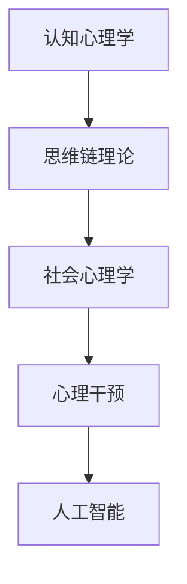
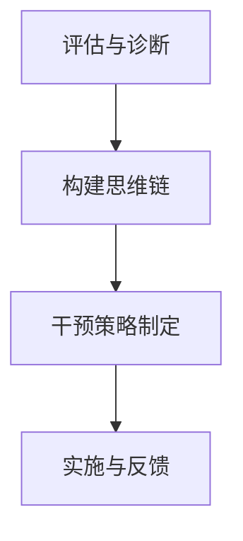
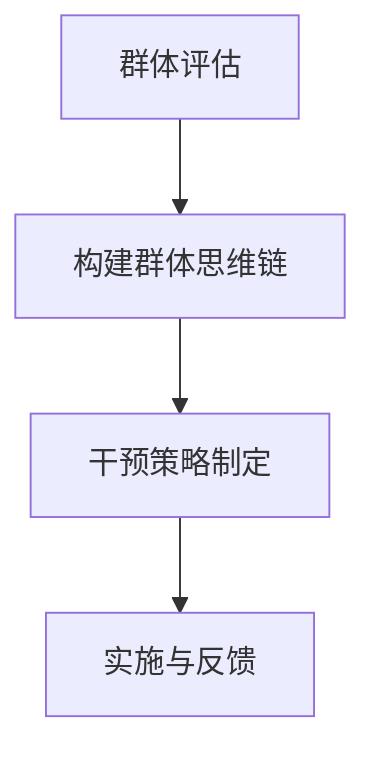

                 

## 《思维链在社会心理干预策略中的创新应用》

### 关键词
- 思维链
- 社会心理干预
- 心理健康
- 人工智能
- 跨学科研究

### 摘要
本文探讨了思维链在社会心理干预策略中的创新应用。通过介绍思维链的基本理论，我们将展示其在社会心理干预中的重要性。本文将深入探讨思维链在不同心理干预场景中的运用，包括个体心理干预和群体心理干预。通过实际案例和Python源代码，我们将阐述思维链在社会心理干预中的有效性和应用技巧。最后，本文将对未来发展趋势进行展望，并提出相关建议，以推动思维链在社会心理干预领域的进一步应用。

## 引言

在社会心理干预领域，心理健康的维护与治疗一直是研究的热点。然而，传统的心理干预方法在应对复杂、多层次的社会心理问题时，往往存在局限性。因此，探索新的干预策略，提高心理干预的有效性，成为当前研究的重点。近年来，人工智能（AI）的迅速发展为心理干预带来了新的契机，跨学科的研究也成为推动心理学发展的重要动力。思维链作为一种创新的干预策略，正是基于这一背景下提出的。

### 背景介绍

思维链（Cognitive Chain）是一种基于认知心理学和社会心理学的理论框架，它强调思维过程的多层次性和连贯性。思维链理论认为，人的思维过程不是孤立的事件，而是由一系列相互关联、逐步推进的思考步骤组成的。这些步骤不仅包括对外部刺激的感知和解读，还涉及内部心理状态的变化和决策过程。

在社会心理干预中，思维链的重要性体现在以下几个方面：

1. **全面理解个体心理状态**：思维链可以帮助干预者更全面地了解个体的心理状态，包括其认知模式、情感体验和行为表现。这种全面的理解有助于制定更有效的干预计划。

2. **引导思维过程**：思维链提供了一种结构化的思维框架，可以帮助个体更清晰地思考问题，减少思维混乱和焦虑。通过引导个体的思维过程，干预者可以促进其自我反思和自我调整。

3. **增强心理韧性**：思维链强调个体的内在资源和能力，通过培养积极的思维模式和解决问题的能力，可以提高个体的心理韧性，增强其应对压力和挑战的能力。

### 核心概念与联系

为了更好地理解思维链在社会心理干预中的运用，我们首先需要明确几个核心概念及其相互关系：

1. **认知心理学**：认知心理学研究人的思维过程、记忆、感知和问题解决等心理活动。思维链理论基于认知心理学的研究，强调了思维过程的连贯性和层次性。

2. **社会心理学**：社会心理学研究个体在社会环境中的行为和心理过程。思维链理论在社会心理学的基础上，进一步探讨了个体在社交互动中的认知模式和心理反应。

3. **心理干预**：心理干预是指通过心理治疗、咨询和教育等手段，帮助个体解决心理问题和提高心理健康水平。思维链作为一种干预策略，旨在通过引导个体的思维过程，改善其心理状态。

4. **人工智能**：人工智能（AI）在心理干预中的应用，为思维链提供了强大的技术支持。通过机器学习和数据分析，AI可以帮助干预者更准确地识别个体的心理状态，并为其提供个性化的干预建议。

以下是一个Mermaid流程图，展示了这些核心概念之间的相互关系：

### 思维链在社会心理干预中的应用

思维链在社会心理干预中的应用具有广阔的前景，尤其是在个体心理干预和群体心理干预中。下面，我们将分别探讨这两种应用场景。

#### 个体心理干预

在个体心理干预中，思维链可以帮助干预者更深入地了解个体的心理状态，从而制定更有效的干预计划。以下是一个基于思维链的个体心理干预流程：

1. **评估与诊断**：通过问卷调查、访谈和观察等方式，收集个体的心理状态数据，包括认知模式、情感体验和行为表现。这些数据将作为构建思维链的基础。

2. **构建思维链**：干预者根据收集到的数据，构建个体的思维链。思维链包括一系列相互关联的思维步骤，每个步骤都对应着个体的心理活动。

3. **干预策略制定**：干预者根据思维链的特点，制定个性化的干预策略。这些策略旨在引导个体的思维过程，改善其心理状态。

4. **实施与反馈**：干预者根据制定的策略，实施心理干预，并在干预过程中不断收集反馈信息，以调整和优化干预策略。

以下是一个Mermaid流程图，展示了个体心理干预中的思维链构建过程：

#### 群体心理干预

在群体心理干预中，思维链可以帮助干预者更好地理解群体成员的心理状态，并制定有效的干预措施，以下是一个基于思维链的群体心理干预流程：

1. **群体评估**：通过问卷调查、访谈和观察等方式，评估整个群体的心理状态，包括成员的认知模式、情感体验和行为表现。

2. **构建群体思维链**：干预者根据群体评估结果，构建整个群体的思维链。群体思维链反映了群体成员之间的心理互动和共同认知模式。

3. **干预策略制定**：干预者根据群体思维链的特点，制定个性化的干预策略。这些策略旨在引导群体成员的思维过程，改善其心理状态。

4. **实施与反馈**：干预者在群体中实施干预措施，并在干预过程中不断收集反馈信息，以调整和优化干预策略。

以下是一个Mermaid流程图，展示了群体心理干预中的思维链构建过程：

### 思维链与传统心理干预策略的比较

与传统的心理干预策略相比，思维链具有以下优势：

1. **系统性**：思维链提供了一种系统化的干预框架，有助于干预者更全面地了解个体的心理状态，从而制定更精确的干预计划。

2. **灵活性**：思维链可以根据个体的具体情况进行调整，使其更加适应个性化的需求。

3. **动态性**：思维链强调思维过程的多层次性和连贯性，有助于干预者及时捕捉个体的心理变化，从而提供更及时和有效的干预。

4. **技术支持**：思维链与人工智能的结合，为干预者提供了强大的技术支持，包括数据分析、模型构建和个性化推荐等。

然而，思维链也面临一些挑战，例如如何确保干预过程的可靠性和有效性，如何处理个体之间的差异等。这些挑战需要通过进一步的研究和实践来克服。

### 总结与展望

思维链作为一种创新的干预策略，在社会心理干预中展示了广阔的应用前景。通过引入认知心理学和社会心理学的理论，结合人工智能的技术支持，思维链为干预者提供了一种系统化、灵活性和动态性的干预框架。

未来，思维链在社会心理干预中的应用将继续拓展，特别是在群体心理干预和跨文化心理干预等领域。此外，随着技术的不断进步，思维链的理论和方法也将得到进一步优化和改进。

我们期待思维链能够为心理健康领域带来更多的创新和突破，为个体和社会的心理健康作出更大贡献。

## 思维链的基本理论

### 定义

思维链（Cognitive Chain）是一种理论框架，它描述了思维过程的多层次性和连贯性。思维链理论认为，人的思维过程不是一系列孤立的事件，而是由一系列相互关联、逐步推进的思考步骤组成的。这些步骤不仅包括对外部刺激的感知和解读，还涉及内部心理状态的变化和决策过程。

### 基本原理

思维链的基本原理可以概括为以下几点：

1. **层次性**：思维链强调思维过程的多层次性。每个思维步骤都对应着一个特定的心理层次，从简单的感知和记忆，到复杂的推理和决策。这些层次相互交织，形成了一个复杂的思维网络。

2. **连贯性**：思维链强调思维过程的连贯性。每个思维步骤都是前一个步骤的延续和深化，同时为后续的思维步骤提供基础。这种连贯性保证了思维过程的流畅性和一致性。

3. **动态性**：思维链强调思维过程的动态性。思维过程不是静止的，而是随着外部刺激和内部心理状态的变化而不断调整和更新。这种动态性使思维链能够适应不同情境和需求。

4. **互动性**：思维链强调思维过程与其他心理过程的互动性。思维过程不仅受到外部刺激的影响，还受到情感、动机和社会文化背景的影响。这种互动性使思维链能够更全面地反映个体的心理状态。

### 思维链与社会心理理论的关系

思维链与社会心理理论有着密切的关系。社会心理理论是心理学的一个分支，它研究个体在社会环境中的行为和心理过程。思维链理论为社会心理理论提供了新的视角，强调了思维过程在社会环境中的作用。

1. **认知与社会互动**：思维链理论认为，认知过程是个体与社会环境互动的重要途径。个体通过感知和解读社会刺激，形成特定的认知模式，这些模式又反过来影响其社会行为。思维链为社会心理理论提供了关于认知与社会互动的新解释。

2. **情感与认知**：思维链理论认为，情感与认知是相互关联的。个体的情感体验会影响其认知过程，同时，认知过程也会影响其情感体验。这种交互作用在思维链中得到了体现，为理解个体情感与社会行为提供了新的思路。

3. **社会文化与认知**：思维链理论强调社会文化背景对个体认知的影响。不同的社会文化背景会影响个体的认知模式，从而影响其心理状态和行为。思维链为社会心理理论提供了关于社会文化与认知关系的新框架。

### 结构与运作机制

思维链的结构与运作机制可以分为以下几个部分：

1. **感知阶段**：个体通过感官接收外部刺激，如视觉、听觉、触觉等。这些刺激被转换为神经信号，传递到大脑进行处理。

2. **加工阶段**：大脑对感知到的刺激进行加工，包括感知、记忆、推理等。这些加工过程构成了思维链的基本步骤。

3. **输出阶段**：加工后的信息被输出，表现为个体的行为、情感和思考。这些输出又会作为新的输入，影响后续的思维过程。

4. **调节阶段**：思维链的运作过程中，个体会不断地调节和更新其思维过程。这种调节可以通过自我反思、学习经验等方式实现。

### 思维链与认知行为疗法的关系

认知行为疗法（Cognitive Behavioral Therapy, CBT）是一种常用的心理治疗方法，它强调认知过程对情感和行为的影响。思维链理论为认知行为疗法提供了新的理论支持，可以帮助治疗师更深入地理解患者的心理状态。

1. **认知重建**：思维链理论认为，个体的认知模式对其情感和行为有重要影响。通过重建患者的认知模式，可以帮助其改变不良情绪和行为。思维链提供了具体的认知步骤，为认知重建提供了指导。

2. **行为改变**：思维链理论认为，行为改变不仅涉及外部行为的调整，还涉及内部认知的改变。通过调整患者的思维过程，可以促进其行为改变。思维链提供了结构化的思维框架，有助于患者逐步实现行为改变。

3. **自我调节**：思维链理论强调个体的自我调节能力。通过培养患者的自我调节能力，可以使其更有效地应对压力和挑战。思维链提供了自我调节的方法和技巧，有助于患者提高自我调节能力。

### 思维链与心理学其他理论的关系

思维链理论不仅与认知行为疗法密切相关，还与其他心理学理论有着广泛的联系。

1. **人本主义心理学**：人本主义心理学强调个体的自我实现和内在潜能。思维链理论提供了关于个体认知和自我实现的新解释，可以帮助人本主义心理学家更好地理解个体的心理状态。

2. **精神分析心理学**：精神分析心理学关注个体的潜意识过程。思维链理论可以为精神分析心理学家提供关于思维过程的新视角，帮助其更深入地理解患者的心理问题。

3. **社会认知心理学**：社会认知心理学研究个体如何通过认知过程理解和解释社会信息。思维链理论为社会认知心理学家提供了关于思维过程和社会互动的新框架，有助于其更全面地理解个体的社会行为。

通过以上分析，我们可以看出，思维链理论在心理学领域具有重要的理论价值和实践意义。它不仅为心理学研究提供了新的理论视角，还为心理干预提供了有效的策略和方法。

### 实践中构建思维链的技巧

在实际应用中，构建思维链是一项复杂而细致的工作，需要干预者具备扎实的理论基础和实践技能。以下将详细介绍构建思维链的基本步骤，并提供一些实用的技巧，帮助干预者在实践中有效地运用思维链理论。

#### 基本步骤

1. **初步评估**：首先，干预者需要对个体的心理状态进行初步评估。这可以通过观察、访谈、问卷调查等方式进行，目的是了解个体的认知模式、情感体验和行为表现。初步评估的结果将作为构建思维链的基础数据。

2. **数据整理**：在初步评估的基础上，干预者需要对收集到的数据进行整理和分析。这包括对个体思维过程的描述、分类和量化，以便更好地理解其思维模式。

3. **构建思维链**：干预者根据整理后的数据，逐步构建个体的思维链。构建思维链的过程可以分为以下几个步骤：
    - **确定思维起点**：找出个体思维过程的初始触发点，这通常是某个特定的外部刺激或内部想法。
    - **描述思维步骤**：详细描述思维过程中的每个步骤，包括感知、记忆、推理、决策等。
    - **分析思维模式**：分析思维链中各步骤之间的关联和互动，识别个体思维过程中的优势和劣势。

4. **反馈与调整**：在构建思维链的过程中，干预者需要不断地与个体进行反馈和沟通。这有助于验证思维链的准确性，并对其进行必要的调整和优化。

5. **干预策略制定**：根据构建好的思维链，干预者可以制定个性化的干预策略。这些策略旨在引导个体的思维过程，改善其心理状态。

#### 实用技巧

1. **聚焦关键节点**：在构建思维链时，干预者需要特别关注思维过程中的关键节点。这些节点通常是思维链中思维方向发生显著变化或思维负荷较大的部分。通过聚焦关键节点，干预者可以更有效地识别和解决个体心理问题。

2. **利用可视化工具**：思维链是一个复杂的多层次结构，利用可视化工具（如思维导图、流程图等）可以帮助干预者更直观地理解思维链的运作机制。这些工具还可以在干预过程中帮助个体更好地理解自己的思维过程。

3. **循序渐进**：构建思维链是一个循序渐进的过程，干预者应避免一次性提出过多的干预建议。逐步引导个体认识和理解自己的思维模式，有助于提高干预的效果。

4. **个体化调整**：每个人的思维链都是独特的，干预者需要根据个体的具体情况进行调整。这包括对干预策略的调整，以及对思维链结构本身的调整。

5. **持续监测与反馈**：干预后，干预者需要持续监测个体的心理状态，并根据反馈信息调整干预策略。这种动态的调整有助于确保干预效果的持续性和稳定性。

#### 案例分析

以下是一个具体的案例分析，展示了如何在实际干预中构建思维链。

**案例背景**：一名患有焦虑症的青年，他在社交场合中感到极度紧张，经常出现心悸、出汗等症状。

**评估过程**：
- **观察**：干预者在日常交流中注意到患者表现出明显的紧张情绪，如频繁的眨眼、低头和回避眼神交流。
- **访谈**：通过访谈，干预者了解到患者在社交场合中总是担心自己会出丑，担心他人的评价。
- **问卷调查**：干预者使用焦虑量表对患者的焦虑程度进行了量化评估。

**数据整理与分析**：
- **描述思维步骤**：患者思维链的起点是社交场合的触发，接下来是担心出丑、担心他人评价、感到紧张、出现生理反应等。
- **分析思维模式**：患者的思维模式表现出明显的负面倾向，如过度关注负面结果、缺乏自我肯定等。

**构建思维链**：
- **确定思维起点**：社交场合的触发。
- **描述思维步骤**：社交场合 → 担心出丑 → 担心他人评价 → 感到紧张 → 出现生理反应。
- **分析思维模式**：思维链中存在明显的负面思维模式，如过度担心和自我否定。

**干预策略制定**：
- **认知重建**：通过认知重构技术，干预者帮助患者识别和调整负面思维模式，如将“我一定会出丑”调整为“我有能力应对可能出现的情况”。
- **行为演练**：通过角色扮演和情景模拟，干预者帮助患者在安全的环境中练习社交技能，逐步减少焦虑感。
- **自我调节训练**：通过呼吸控制和放松训练，干预者帮助患者学会在紧张情境中保持冷静。

**反馈与调整**：
- **反馈**：干预者定期与患者进行反馈交流，了解干预策略的效果。
- **调整**：根据反馈信息，干预者对干预策略进行必要的调整，如增加行为演练的频率或引入其他辅助技术。

通过以上案例分析，我们可以看到，构建思维链是一个系统化的过程，需要干预者具备扎实的理论基础和实践技能。在实际应用中，干预者需要根据个体的具体情况进行调整，以确保干预效果的最大化。

### 思维链在不同社会心理干预场景中的运用

思维链作为一种创新的干预策略，在不同社会心理干预场景中展现出了其独特的优势和应用价值。本文将详细探讨思维链在个体心理干预、群体心理干预、危机干预等场景中的具体运用，并通过实际案例进行分析。

#### 个体心理干预

在个体心理干预中，思维链的应用主要体现在以下几个方面：

1. **认知重建**：思维链可以帮助个体识别和调整不良认知模式。例如，一名患有抑郁症的患者，常常出现消极思维，如“我一无是处”或“没有人爱我”。通过思维链的分析，干预者可以帮助患者识别这些负面思维，并引导其建立积极的认知，如“我可以改善我的生活”或“我有值得他人爱的地方”。

2. **情感调节**：思维链强调思维过程与情感体验的关联。通过引导个体构建积极的思维链，可以帮助其改善情感状态。例如，对于一名焦虑症患者，干预者可以引导其从担忧未来到专注于当前可以控制的行动，从而减轻焦虑感。

3. **行为改变**：思维链不仅可以改变个体的认知和情感，还可以影响其行为。通过构建思维链，干预者可以帮助个体制定具体的行为计划，例如，对于一名社交焦虑的患者，可以通过思维链引导其在社交场合中进行自我对话，如“我可以做到”或“这是一个机会去了解别人”。

**实际案例**：

**案例一**：一名大学新生，由于在新的环境中感到孤独和无助，出现了严重的社交焦虑。干预者使用思维链进行干预：

- **评估与诊断**：通过访谈和问卷调查，干预者了解到患者在社交场合中总是担心自己会被人嘲笑，因此避免社交活动。
- **构建思维链**：干预者帮助患者识别其思维链中的负面思维模式，如“我会被嘲笑”和“没有人会喜欢我”。通过分析，干预者发现这些思维模式导致了患者的焦虑和逃避行为。
- **干预策略**：干预者使用认知重建技术，引导患者将负面思维替换为积极思维，如“每个人都有优点和缺点，我可以试着接受别人”和“这是一个认识新朋友的机会”。同时，干预者帮助患者制定具体的行为计划，如主动参与课堂讨论、参加社交活动等。
- **实施与反馈**：干预者定期与患者进行反馈交流，了解干预策略的效果。根据患者的反馈，干预者对策略进行了必要的调整。

经过一段时间的干预，患者逐渐适应了新环境，社交焦虑得到了显著缓解。

#### 群体心理干预

在群体心理干预中，思维链的应用主要体现在以下几个方面：

1. **群体认知重建**：思维链可以帮助群体成员识别和调整共同的负面认知模式。例如，在一个团队中，如果成员普遍存在“我们无法完成任务”的消极思维，通过思维链的引导，可以促使成员重新评估并调整这种思维，从而提升团队的士气和动力。

2. **情感共鸣**：思维链可以帮助群体成员建立情感共鸣，增强团队凝聚力。通过构建共同的思维链，成员可以更好地理解彼此的情感状态和心理需求，从而促进相互支持和合作。

3. **行为协调**：思维链可以帮助群体成员在行为上达成一致，提高团队协作效率。通过构建思维链，成员可以明确各自的角色和责任，从而更好地协同工作。

**实际案例**：

**案例二**：一家企业面临市场压力，团队士气低落，决策效率低下。干预者使用思维链进行干预：

- **评估与诊断**：通过团队访谈和问卷调查，干预者了解到团队成员普遍存在“市场变化太快，我们跟不上”的消极思维。
- **构建思维链**：干预者帮助团队识别其共同的思维链，如“市场变化太快”和“我们无法应对”。通过分析，干预者发现这些思维模式导致了团队的焦虑和低效率。
- **干预策略**：干预者引导团队将负面思维替换为积极思维，如“我们可以通过学习和适应来应对市场变化”和“每个团队成员都有独特的贡献”。同时，干预者帮助团队制定具体的行为计划，如加强市场调研、提高团队协作等。
- **实施与反馈**：干预者定期组织团队会议，了解干预策略的实施情况。根据团队成员的反馈，干预者对策略进行了必要的调整。

经过一段时间的干预，团队的士气和决策效率显著提升，企业也顺利应对了市场变化。

#### 危机干预

在危机干预中，思维链的应用主要体现在以下几个方面：

1. **快速响应**：思维链可以帮助危机干预者迅速识别危机事件中的关键思维模式，从而采取有效的应对措施。例如，在突发事件中，干预者可以通过思维链迅速评估事件的影响和可能的后果，为决策提供依据。

2. **心理疏导**：思维链可以帮助危机干预者引导个体或群体进行心理疏导，缓解危机事件带来的心理压力。通过构建思维链，干预者可以帮助个体或群体识别和理解其情感反应，从而更好地应对危机。

3. **恢复与重建**：思维链可以帮助危机干预者引导个体或群体进行心理恢复和重建。通过构建积极思维链，干预者可以帮助个体或群体重建自信和希望，从而更好地应对未来的挑战。

**实际案例**：

**案例三**：在一个自然灾害发生后，救援团队使用思维链进行心理干预：

- **评估与诊断**：救援团队通过访谈和观察，了解到受灾群众普遍存在恐慌、无助和绝望等负面情绪。
- **构建思维链**：救援团队帮助受灾群众识别其思维链中的负面思维模式，如“我们无法重建家园”和“未来没有希望”。通过分析，救援团队发现这些思维模式加剧了受灾群众的情绪困扰。
- **干预策略**：救援团队引导受灾群众将负面思维替换为积极思维，如“我们可以共同努力重建家园”和“未来会更好”。同时，救援团队组织了心理疏导活动，帮助受灾群众缓解情绪。
- **实施与反馈**：救援团队定期与受灾群众进行交流，了解干预策略的效果。根据反馈信息，救援团队对策略进行了必要的调整。

经过一段时间的干预，受灾群众的情绪逐渐稳定，重建家园的信心得到了显著提升。

### 比较与整合

思维链在不同社会心理干预场景中的运用体现了其灵活性和适应性。与传统的心理干预方法相比，思维链具有以下几个优势：

1. **系统性**：思维链提供了一种系统化的干预框架，有助于干预者全面地理解个体的心理状态，从而制定更精确的干预计划。

2. **灵活性**：思维链可以根据个体的具体情况进行调整，使其更加适应个性化的需求。

3. **动态性**：思维链强调思维过程的多层次性和连贯性，有助于干预者及时捕捉个体的心理变化，从而提供更及时和有效的干预。

4. **技术支持**：思维链与人工智能的结合，为干预者提供了强大的技术支持，包括数据分析、模型构建和个性化推荐等。

然而，思维链也面临一些挑战，例如如何确保干预过程的可靠性和有效性，如何处理个体之间的差异等。这些问题需要通过进一步的研究和实践来克服。

### 结论

思维链作为一种创新的干预策略，在不同社会心理干预场景中展现出了其独特的优势和应用价值。通过详细探讨思维链在个体心理干预、群体心理干预、危机干预等场景中的具体运用，我们可以看到，思维链不仅有助于提高干预的有效性，还可以为心理干预提供新的理论和实践框架。未来，随着技术的不断进步和研究的深入，思维链在社会心理干预领域的应用将更加广泛和深入。

### 社会心理干预的基本概念

#### 定义

社会心理干预是指通过心理治疗、咨询、教育和社会支持等手段，帮助个体或群体应对心理问题、提高心理健康水平的过程。它旨在通过改善个体的认知、情感和行为，促进其心理适应和社会功能。

#### 目标

社会心理干预的主要目标包括以下几个方面：

1. **缓解心理压力**：通过干预措施，帮助个体缓解焦虑、抑郁、恐惧等负面情绪，减轻心理压力。

2. **改善心理状态**：通过干预措施，提高个体的心理健康水平，增强其心理韧性和应对能力。

3. **提高社会功能**：通过干预措施，帮助个体恢复或提高其在家庭、学校、工作等社会环境中的功能表现。

4. **预防心理问题**：通过干预措施，降低个体患心理问题的风险，促进其心理健康的发展。

#### 类型

社会心理干预可以分为以下几种类型：

1. **心理治疗**：包括认知行为疗法、精神分析疗法、人本主义疗法等，旨在通过改变个体的认知和行为模式，解决其心理问题。

2. **心理咨询**：通过交谈和对话，帮助个体理解自己的情感和行为，提供情感支持和指导。

3. **心理教育**：通过教育和培训，提高个体对心理健康知识的认识，增强其自我保健意识。

4. **社会支持**：通过家庭、社区和机构等社会资源，为个体提供情感支持和社会帮助。

#### 伦理考量

在社会心理干预中，伦理考量是至关重要的。以下是一些常见的伦理问题：

1. **知情同意**：在进行干预之前，必须确保个体充分了解干预的性质和目的，并自愿参与。

2. **保密性**：干预者有责任保护个体的隐私，未经允许不得泄露其个人信息。

3. **权益保护**：干预者应尊重个体的权利和尊严，确保其得到合理的干预和服务。

4. **专业责任**：干预者必须具备相应的专业知识和技能，确保干预过程的安全和有效。

### 社会心理干预的实践意义

社会心理干预在现实生活中具有重要的实践意义：

1. **心理健康促进**：通过社会心理干预，可以帮助个体提高心理健康水平，预防心理问题的发生。

2. **社会功能提升**：通过干预措施，帮助个体恢复或提高其在社会环境中的功能表现，促进其全面发展。

3. **社会和谐稳定**：社会心理干预有助于缓解社会矛盾和冲突，促进社会和谐稳定。

4. **公共卫生策略**：社会心理干预是公共卫生策略的重要组成部分，有助于提高公众心理健康水平。

### 案例研究

以下是一些社会心理干预的实际案例，展示了干预策略在不同场景中的应用：

**案例一**：抑郁患者的心理治疗

一名中年女性因长期工作压力和婚姻问题而出现严重的抑郁症状。干预者采用认知行为疗法（CBT）对其进行干预：

- **评估与诊断**：干预者通过访谈和量表评估，了解到患者的抑郁程度和心理需求。
- **干预策略**：干预者帮助患者识别和调整负面思维模式，如“我一无是处”和“生活没有希望”。同时，干预者指导患者进行行为演练和放松训练，提高其应对压力的能力。
- **实施与反馈**：干预者定期与患者进行反馈交流，调整干预策略，确保干预效果。

经过一段时间的干预，患者的抑郁症状显著缓解，生活质量得到显著提高。

**案例二**：社区心理服务

一个社区心理服务项目旨在提高居民的心理健康水平。干预者通过以下措施进行干预：

- **心理健康教育**：干预者通过讲座和宣传材料，向居民普及心理健康知识，提高其心理健康意识。
- **心理咨询**：干预者提供免费的心理咨询服务，帮助居民解决心理问题。
- **社交支持**：干预者组织居民进行社交活动，促进其建立社交网络，提高社会支持。

通过一系列干预措施，社区的心理健康水平得到了显著提升，居民的心理健康问题得到了有效解决。

### 总结

社会心理干预在心理健康促进、社会功能提升和社会和谐稳定等方面具有重要意义。通过明确干预的目标、类型和伦理考量，我们可以更好地理解和应用社会心理干预策略，为个体的心理健康和社会福祉作出积极贡献。

### 传统社会心理干预策略

在社会心理干预的历史长河中，传统策略一直占据着重要地位。这些策略经过多年的实践和验证，积累了丰富的经验和成效。以下是几种主要的传统社会心理干预策略：

#### 认知行为疗法（Cognitive Behavioral Therapy, CBT）

认知行为疗法是最常用的心理治疗方法之一，它主要关注个体的认知和行为。CBT的核心原则是：认知过程直接影响情感和行为。通过识别和纠正负面思维模式，个体可以改善其情感状态和行为表现。

1. **核心原则**：
    - 认知重构：帮助个体识别和调整负面思维模式。
    - 情绪调节：通过认知重构，减轻负面情绪的影响。
    - 行为改变：通过实践新的行为，强化积极思维模式。

2. **实践案例**：
    - **抑郁症治疗**：通过认知重构，帮助患者识别和调整负面思维，如“我一无是处”和“生活没有希望”，从而减轻抑郁症状。
    - **焦虑症治疗**：通过行为演练和放松训练，帮助患者减少焦虑情绪。

#### 人本主义疗法

人本主义疗法强调个体的自我实现和内在潜能。这种疗法认为，个体的心理问题主要源于自我认知和情感障碍，治疗的关键是帮助个体建立自我认同和情感联系。

1. **核心原则**：
    - 自我实现：帮助个体发现和实现其内在潜能。
    - 自我接纳：鼓励个体接纳自己的优点和不足。
    - 情感表达：帮助个体表达内在的情感和需求。

2. **实践案例**：
    - **家庭治疗**：通过人本主义疗法，帮助家庭成员建立相互理解和情感联系，解决家庭冲突。
    - **自我探索**：通过人本主义疗法，帮助个体深入探索自己的情感和需求，实现自我成长。

#### 精神分析疗法

精神分析疗法起源于弗洛伊德的理论，它强调潜意识在个体心理和行为中的重要作用。治疗过程中，干预者通过解析个体的梦境、言语和行为，揭示潜意识中的冲突和矛盾。

1. **核心原则**：
    - 潜意识解析：通过分析和理解潜意识，揭示个体心理问题的根源。
    - 冲突解决：帮助个体解决潜意识中的冲突，实现心理平衡。
    - 自我认知：通过潜意识解析，帮助个体建立自我认知和自我理解。

2. **实践案例**：
    - **情感障碍治疗**：通过精神分析疗法，帮助个体理解其情感障碍的根源，如童年创伤或情感隔离。
    - **心理创伤治疗**：通过精神分析疗法，帮助个体处理和释放心理创伤，实现心理康复。

#### 系统性家庭治疗

系统性家庭治疗关注家庭系统中的互动和关系，认为家庭环境对个体的心理和行为有重要影响。治疗过程中，干预者通过调整家庭结构和互动模式，帮助家庭实现和谐与平衡。

1. **核心原则**：
    - 家庭系统：关注家庭成员之间的互动和关系。
    - 结构调整：通过调整家庭结构和角色，解决家庭冲突。
    - 情感支持：为家庭成员提供情感支持和理解。

2. **实践案例**：
    - **家庭暴力干预**：通过系统性家庭治疗，帮助家庭成员理解家庭暴力的根源，建立健康的关系模式。
    - **亲子关系改善**：通过系统性家庭治疗，帮助父母和孩子建立更好的沟通和理解，改善亲子关系。

### 思维链与传统心理干预策略的比较

与传统心理干预策略相比，思维链在社会心理干预中具有以下优势：

1. **系统性和灵活性**：思维链提供了一种系统化的干预框架，可以根据个体的具体情况进行灵活调整，使其更加适应个性化的需求。

2. **动态性和互动性**：思维链强调思维过程的多层次性和连贯性，有助于干预者及时捕捉个体的心理变化，并提供更及时和有效的干预。

3. **技术支持**：思维链与人工智能的结合，为干预者提供了强大的技术支持，包括数据分析、模型构建和个性化推荐等。

然而，思维链也面临一些挑战，例如如何确保干预过程的可靠性和有效性，如何处理个体之间的差异等。这些问题需要通过进一步的研究和实践来克服。

通过比较传统心理干预策略和思维链，我们可以看到，思维链作为一种创新的干预策略，在社会心理干预中具有重要的应用价值和潜力。未来，随着技术的不断进步和研究的深入，思维链在社会心理干预领域的应用将更加广泛和深入。

### 思维链在社会心理干预中的创新应用

思维链作为一种创新的干预策略，在社会心理干预中展示了独特的优势。以下将从思维链在认知行为疗法中的应用、在危机干预中的应用，以及思维链在群体心理干预中的运用等方面，详细探讨思维链在社会心理干预中的创新应用。

#### 思维链在认知行为疗法中的应用

认知行为疗法（CBT）是一种广泛应用于心理干预的方法，其核心原则是通过改变不良认知来改善情绪和行为。思维链在认知行为疗法中的应用，进一步增强了干预的针对性和效果。

1. **认知重构的深化**：思维链提供了一个结构化的框架，帮助干预者更全面地识别和重构患者的认知模式。通过逐步分析患者的思维过程，干预者可以更准确地识别不良认知，并进行有效的重构。例如，对于一名患有焦虑症的个体，思维链可以帮助识别其焦虑思维链中的各个节点，如触发事件、消极认知和情绪反应，从而进行针对性的认知重构。

2. **增强干预的可操作性**：思维链的系统性使得干预过程更加具体和可操作。干预者可以根据思维链的各个节点，设计具体的行为计划和认知练习，帮助患者逐步改变不良认知模式。例如，在焦虑干预中，干预者可以设计一系列的情境模拟和应对策略，帮助患者在实际情境中应用新的认知模式。

3. **个性化干预**：思维链可以根据个体的具体情况进行个性化调整，使其更加适应个体的心理需求。通过构建个性化的思维链，干预者可以更精准地识别和处理个体的心理问题，提高干预的有效性。

**实际案例**：一名青少年患有社交焦虑，通过思维链的认知行为疗法干预：

- **评估与诊断**：干预者通过访谈和问卷调查，了解患者的社交焦虑症状及其认知模式。
- **构建思维链**：干预者帮助患者构建社交焦虑的思维链，包括触发事件、消极认知和情绪反应。
- **干预策略**：干预者设计了一系列的认知重构练习和行为演练，帮助患者逐步改变不良认知，如将“我一定会被嘲笑”调整为“我可以尝试分享我的想法”。
- **实施与反馈**：干预者定期与患者进行反馈交流，根据患者的进步情况调整干预策略。

经过一段时间的干预，患者的社交焦虑症状显著缓解，自信心和社交能力得到了提升。

#### 思维链在危机干预中的应用

危机干预是指在突发事件或危机情境中，对个体或群体进行紧急心理干预的过程。思维链在危机干预中的应用，为干预者提供了更有效的方法和策略。

1. **快速响应**：思维链可以帮助干预者迅速识别和评估危机事件中的关键思维模式。通过分析个体的思维链，干预者可以快速了解其情感状态和心理需求，从而采取有效的应对措施。例如，在自然灾害发生后，干预者可以通过思维链识别受灾者的焦虑和恐惧思维，提供及时的心理支持。

2. **心理疏导**：思维链可以帮助干预者引导个体进行心理疏导，缓解危机事件带来的心理压力。通过构建积极的思维链，干预者可以帮助个体重新评估事件的影响，建立应对策略，从而减轻负面情绪。例如，在遭受重大挫折后，干预者可以帮助个体识别其消极思维，如“一切都没了”，并引导其构建积极思维，如“我可以找到新的机会”。

3. **恢复与重建**：思维链可以帮助干预者引导个体进行心理恢复和重建。通过逐步构建积极的思维链，干预者可以帮助个体重建自信和希望，从而更好地应对未来的挑战。例如，在创伤后应激障碍（PTSD）的治疗中，干预者可以通过思维链帮助患者重建对生活的信心，减轻创伤后应激反应。

**实际案例**：在一次重大事故后，干预者通过思维链进行危机干预：

- **评估与诊断**：干预者通过访谈和观察，了解事故受害者及其家属的心理状态。
- **构建思维链**：干预者帮助受害者构建其心理状态下的思维链，识别其消极思维和情绪反应。
- **干预策略**：干预者引导受害者进行认知重构，如将“一切都毁了”调整为“我可以逐步重建生活”。
- **实施与反馈**：干预者定期与受害者及其家属进行交流，提供心理支持和指导，根据反馈信息调整干预策略。

经过一段时间的干预，受害者的情绪逐渐稳定，生活信心得到了显著提升。

#### 思维链在群体心理干预中的运用

群体心理干预是指对一群人进行心理干预的过程，通常用于应对群体性心理问题或危机事件。思维链在群体心理干预中的应用，为干预者提供了更有效的策略和工具。

1. **群体认知重建**：思维链可以帮助干预者对整个群体的认知模式进行重建，提高群体的心理健康水平。通过构建群体思维链，干预者可以识别和纠正群体中的负面认知模式，促进积极思维的形成。例如，在一个面临困境的团队中，干预者可以通过思维链帮助团队识别和调整共同的负面认知，如“我们无法完成任务”，并引导团队建立积极思维，如“我们可以共同努力克服困难”。

2. **情感共鸣与支持**：思维链可以帮助干预者建立群体成员之间的情感共鸣，增强群体的凝聚力和支持力。通过构建群体思维链，干预者可以帮助群体成员理解彼此的情感状态和心理需求，从而提供有效的情感支持和帮助。例如，在一个社区中，干预者可以通过思维链帮助居民建立相互理解和支持的关系，共同应对心理问题。

3. **行为协调与改善**：思维链可以帮助干预者引导群体成员在行为上达成一致，提高群体协作效率。通过构建群体思维链，干预者可以明确每个成员的角色和责任，促进成员之间的协作和配合。例如，在一个企业中，干预者可以通过思维链帮助团队成员理解各自的角色，明确工作目标和责任，从而提高团队协作效率。

**实际案例**：在一个面临重大挑战的企业中，干预者通过思维链进行群体心理干预：

- **评估与诊断**：干预者通过访谈和问卷调查，了解企业员工的心理状态和团队协作情况。
- **构建思维链**：干预者帮助员工构建团队思维链，识别和纠正负面认知模式，促进积极思维的形成。
- **干预策略**：干预者引导员工进行认知重构，如将“我们无法完成任务”调整为“我们可以共同努力克服困难”。
- **实施与反馈**：干预者定期与员工进行反馈交流，提供心理支持和指导，根据反馈信息调整干预策略。

经过一段时间的干预，企业的团队协作效率显著提高，员工的心理健康水平得到了显著提升。

### 总结

思维链在社会心理干预中的应用展示了其独特的优势和创新性。通过在认知行为疗法、危机干预和群体心理干预等场景中的运用，思维链不仅提高了干预的针对性和效果，还为心理干预提供了新的视角和方法。未来，随着技术的不断进步和研究的深入，思维链在社会心理干预领域的应用将更加广泛和深入，为心理健康的维护和治疗做出更大的贡献。

### 思维链在群体心理干预中的运用

在现代社会，群体心理干预变得尤为重要，尤其是在面对大规模社会事件、组织变革或危机情境时。思维链作为一种创新的干预策略，在群体心理干预中展现了其独特的价值和潜力。本文将探讨思维链在群体心理干预中的运用，包括其在组织中的传播与应用，以及社区心理服务中的创新。

#### 思维链在组织中的传播与应用

1. **组织内部认知重构**：在组织内部，思维链可以帮助管理层和员工识别和调整组织中的负面认知模式。通过构建组织思维链，干预者可以识别出组织成员对于变革、冲突或其他挑战的常见思维误区。例如，管理层可能会发现员工普遍存在的“变革一定会带来不安全”的思维，通过思维链的引导，可以促使员工将这种负面认知转换为积极的“我们可以适应变革，找到新的机遇”。

2. **增强组织凝聚力**：思维链的应用有助于加强组织成员之间的情感联系和共同目标。通过构建组织思维链，干预者可以帮助成员理解彼此的思维模式和心理需求，从而促进相互支持和协作。例如，在一个团队项目中，团队成员可能会因为任务分工不明确而产生冲突。通过思维链的引导，干预者可以促使团队成员分享他们的思维过程，理解对方的立场，从而找到更好的协作方式。

3. **提高决策效率**：思维链可以帮助组织在决策过程中更全面地考虑各种因素。通过构建组织思维链，干预者可以帮助团队成员识别和评估决策过程中的思维步骤，确保每个决策都基于全面和理性的思考。例如，在一个战略规划过程中，干预者可以使用思维链来帮助团队分析各种战略选择的潜在影响和风险，从而做出更明智的决策。

**实际案例**：在一个跨国公司中，由于市场变化和内部竞争加剧，员工出现了焦虑和不满情绪。通过思维链的干预：

- **评估与诊断**：干预者通过问卷调查和访谈，了解员工的心理状态和认知模式。
- **构建思维链**：干预者帮助员工构建思维链，识别和调整负面认知，如“公司变革会让我失业”。
- **干预策略**：干预者通过培训和团队建设活动，引导员工建立积极思维，如“变革带来新机会，我可以学习新技能”。
- **实施与反馈**：干预者定期组织反馈会议，了解员工的心理变化，并根据反馈调整干预策略。

经过一段时间的干预，员工的心理状态得到了显著改善，团队凝聚力增强，决策效率提高。

#### 思维链在社区心理服务中的创新

1. **个性化心理干预**：在社区心理服务中，思维链的应用可以帮助干预者提供更个性化的服务。通过构建个体思维链，干预者可以更深入地了解社区居民的心理需求和心理问题，从而制定个性化的干预计划。例如，在一个心理健康社区中，干预者可以通过思维链识别某个居民的压力源和认知模式，为其提供针对性的心理支持。

2. **社会支持网络的构建**：思维链的应用有助于构建社区内的社会支持网络。通过引导居民构建思维链，干预者可以帮助他们更好地理解和支持彼此。例如，在一个社区心理健康项目中，干预者可以组织居民进行小组讨论，分享他们的思维过程和心理困扰，从而建立相互支持和理解的关系。

3. **心理健康教育的推广**：思维链的应用可以促进心理健康教育的普及。通过构建思维链，干预者可以帮助居民理解心理健康的基本概念和自我调节技巧。例如，在一个社区健康讲座中，干预者可以使用思维链的框架，帮助居民识别和调整负面思维，提高其心理健康水平。

**实际案例**：在一个社区心理健康项目中，干预者通过思维链进行心理健康教育和干预：

- **评估与诊断**：干预者通过问卷调查和访谈，了解社区居民的心理健康状况和心理需求。
- **构建思维链**：干预者帮助居民构建思维链，识别和调整负面认知，如“我无法应对生活中的压力”。
- **干预策略**：干预者组织了系列心理健康讲座和小组讨论，引导居民学习和实践自我调节技巧，如认知重构和放松训练。
- **实施与反馈**：干预者定期收集居民的心理健康数据，了解干预效果，并根据反馈调整干预策略。

经过一段时间的干预，社区居民的心理健康水平得到了显著提升，社区内的支持网络也得到了加强。

### 总结

思维链在群体心理干预中的运用，为组织内部和社区心理服务提供了创新的干预策略和方法。通过组织内部的认知重构、社会支持网络的构建，以及社区心理健康教育的推广，思维链不仅提高了干预的针对性和效果，还促进了社区成员之间的相互理解和支持。未来，随着思维链理论的不断发展和应用实践的不断深入，其在群体心理干预中的价值将得到进一步体现和提升。

### 思维链干预策略的案例研究

在本节中，我们将通过具体案例研究来探讨思维链干预策略在实际中的应用效果。以下为两个案例：一个个体心理干预案例和一个群体心理干预案例。

#### 案例一：个体心理干预

**案例背景**：一位35岁的女性，因长期的工作压力和家庭矛盾，感到极度焦虑和抑郁。她经常感到疲劳，难以集中注意力，情绪低落，甚至出现了失眠症状。

**干预策略**：
1. **初步评估**：干预者通过问卷调查和访谈，了解患者的基本情况、心理压力源以及认知模式。评估结果显示，患者存在明显的认知偏差，如“我无法胜任工作”和“我丈夫不理解我”。
2. **构建思维链**：干预者帮助患者构建其焦虑和抑郁的思维链，包括触发事件（工作压力和家庭矛盾）、认知反应（无法胜任、丈夫不理解）、情绪反应（焦虑、抑郁）和行为反应（疲劳、失眠）。
3. **认知重构**：干预者引导患者识别和调整负面认知。例如，将“我无法胜任工作”调整为“我虽然面临挑战，但我可以通过学习和寻求帮助来提高自己的能力”。同时，干预者帮助患者建立积极的应对策略，如制定合理的工作计划和时间管理技巧。
4. **行为调整**：干预者鼓励患者进行身体锻炼、参与社交活动，以减轻压力和改善情绪。
5. **持续反馈**：干预者定期与患者进行反馈交流，调整干预策略，确保干预效果。

**干预效果**：经过一段时间的干预，患者的焦虑和抑郁症状得到了显著缓解，情绪稳定，生活质量显著提升。

#### 案例二：群体心理干预

**案例背景**：某公司因市场变化和内部竞争，员工出现了普遍的焦虑和士气低落。公司管理层希望通过心理干预提升员工的情绪状态和工作效率。

**干预策略**：
1. **初步评估**：干预者通过问卷调查和访谈，了解员工的焦虑源、认知模式和团队协作状况。评估结果显示，员工普遍存在“公司变革会影响我的职位安全”的认知偏差。
2. **构建群体思维链**：干预者帮助员工构建公司变革的群体思维链，包括触发事件（市场变化、内部竞争）、认知反应（职位安全担忧）、情绪反应（焦虑、士气低落）和行为反应（消极怠工、工作效率下降）。
3. **认知重构**：干预者引导员工识别和调整负面认知，如将“公司变革会影响我的职位安全”调整为“公司变革可能带来新的机会，我可以通过学习和适应来提升自己”。同时，干预者鼓励员工积极参与公司变革的讨论，提出建议和解决方案。
4. **团队建设**：干预者组织团队建设活动，增强员工之间的信任和协作，提高团队凝聚力。
5. **持续反馈**：干预者定期与员工进行反馈交流，了解干预效果，并根据反馈调整干预策略。

**干预效果**：经过一段时间的干预，员工的焦虑情绪得到了显著缓解，士气提升，工作效率提高，团队协作更加顺畅。

### 总结与反思

通过以上案例研究，我们可以看到，思维链干预策略在实际应用中展示了显著的效果。无论是在个体心理干预还是群体心理干预中，思维链都帮助干预者更全面地理解个体的心理状态，并制定出针对性的干预措施。

**总结**：
1. **认知重构**：思维链干预策略的核心在于引导个体或群体进行认知重构，纠正负面思维模式，建立积极的认知框架。
2. **行为调整**：干预策略不仅关注个体的认知变化，还强调行为调整，通过实际行动来巩固认知重构的效果。
3. **持续反馈**：定期反馈是确保干预效果的关键，它可以帮助干预者及时调整策略，确保干预的连续性和有效性。

**反思**：
1. **个体差异**：在应用思维链干预策略时，需要充分考虑个体差异，制定个性化的干预计划。
2. **实施难度**：思维链干预策略的实施需要干预者具备较高的专业素养和沟通能力，这对干预者的培训提出了更高要求。
3. **技术支持**：随着人工智能和大数据技术的发展，思维链干预策略可以进一步优化，提高干预的精确性和效率。

未来，思维链干预策略的应用将进一步拓展，特别是在跨文化心理干预和复杂社会心理问题中，思维链的理论和方法将发挥更大的作用。通过不断的实践和研究，思维链干预策略将为心理健康领域的创新和发展作出更大的贡献。

### 思维链干预策略的评价与反馈

#### 评估方法

评估思维链干预策略的有效性是确保其应用科学性和实用性的关键。以下是一些常用的评估方法：

1. **问卷调查**：通过设计针对特定干预内容的问卷，可以收集受试者的主观体验和反馈。常见的问卷包括心理健康量表（如PHQ-9、GAD-7）和心理韧性量表等。

2. **访谈**：面对面或电话访谈可以深入了解受试者的心理状态、干预过程中的体验和干预效果的感受。访谈内容可以包括对干预策略的理解、认知重构的实践效果以及行为改变的情况。

3. **行为观察**：在干预过程中，通过观察受试者的行为变化，可以评估干预策略的实际效果。例如，在社交焦虑的干预中，可以观察受试者在社交场合中的表现。

4. **心理测试**：使用标准化的心理测试工具，如认知功能测试、情绪调节能力测试等，可以量化受试者的心理状态变化。

#### 评估指标

评估思维链干预策略的效果需要设定一系列指标，这些指标应涵盖心理健康的多个方面：

1. **心理健康指标**：如抑郁、焦虑、压力水平等，可以通过心理健康量表进行评估。

2. **认知功能指标**：如注意力、记忆力、思维灵活性等，可以通过认知功能测试进行评估。

3. **情绪调节指标**：如情绪稳定性、情绪反应时间等，可以通过情绪调节能力测试进行评估。

4. **行为改变指标**：如社交行为、健康习惯等，可以通过行为观察和问卷评估进行评估。

5. **心理韧性指标**：如应对压力的能力、挫折容忍度等，可以通过心理韧性量表进行评估。

#### 反馈机制

有效的反馈机制是确保思维链干预策略持续改进的重要环节。以下是一些反馈机制的建议：

1. **定期反馈**：干预者应定期与受试者进行反馈交流，了解干预过程中的困难和感受，及时调整干预策略。

2. **多渠道反馈**：除了面对面的反馈，还可以通过邮件、电话、在线平台等多种渠道收集受试者的反馈。

3. **反馈记录**：将受试者的反馈记录在案，作为后续评估和调整的依据。

4. **反馈会议**：定期组织反馈会议，邀请干预者、受试者和相关专家共同讨论干预策略的优化方向。

5. **持续培训**：针对干预者进行持续的专业培训，提高其理论水平和实践能力。

#### 持续改进

持续改进是思维链干预策略发展的关键。以下是一些改进建议：

1. **案例研究**：通过深入研究典型成功案例和失败案例，总结经验教训，为改进策略提供实证依据。

2. **数据驱动**：利用大数据和人工智能技术，对干预过程和结果进行数据分析和预测，为策略调整提供科学依据。

3. **跨学科合作**：思维链干预策略的发展需要跨学科的合作，包括心理学、社会学、人工智能等领域的专家共同参与。

4. **实践推广**：通过在多个场景和群体中推广思维链干预策略，积累实践经验，不断优化和完善策略。

5. **伦理考量**：在改进策略的过程中，应充分考虑伦理问题，确保干预过程符合伦理规范。

通过科学的评估与反馈机制，以及持续的改进策略，思维链干预策略将能够更好地应用于社会心理干预中，为个体的心理健康和社会福祉作出更大的贡献。

### 未来展望

随着科技的不断进步和社会的快速发展，思维链在社会心理干预中的应用前景将越来越广阔。以下是对思维链在未来社会心理干预中发展前景的展望：

#### 技术进步对思维链干预策略的影响

1. **人工智能与大数据**：人工智能和大数据技术的快速发展，将为思维链干预策略提供更强大的数据支持和分析工具。通过机器学习和深度学习算法，干预者可以更准确地识别个体的心理状态，并为其提供个性化的干预建议。大数据分析可以帮助干预者了解不同群体和情境下的心理特点，从而优化干预策略。

2. **虚拟现实与增强现实**：虚拟现实（VR）和增强现实（AR）技术的应用，将为心理干预提供全新的体验。通过VR/AR技术，干预者可以模拟各种心理干预场景，帮助个体进行情景演练和情绪调节。这种沉浸式的干预方式将提高个体的参与度和干预效果。

3. **云计算与物联网**：云计算和物联网技术的结合，将实现心理干预的实时性和便捷性。干预者可以通过云计算平台，实时监控个体的心理状态，并提供即时的心理支持。物联网设备（如智能手环、智能手表等）可以收集个体的生理数据，为干预者提供更全面的评估依据。

#### 未来社会心理干预的新趋势

1. **个性化干预**：随着技术的进步，心理干预将更加个性化。通过分析个体的心理数据，干预者可以为每个个体制定最合适的干预方案，从而提高干预的针对性和效果。

2. **预防为主**：未来的心理干预将更加注重预防，通过早期干预和心理健康教育，降低心理问题的发生率。大数据分析和人工智能技术可以帮助识别高风险人群，提前采取干预措施。

3. **跨学科合作**：未来的心理干预将更多地依赖于跨学科合作，包括心理学、医学、教育学、社会学等领域的专家共同参与。跨学科合作将促进心理干预策略的多元化和发展。

4. **全球化应用**：随着全球化进程的加速，心理干预将更加注重跨文化适应。思维链干预策略将结合不同文化的特点，开发出适用于全球范围的心理干预方法。

#### 面临的挑战

1. **技术伦理**：随着技术的进步，心理干预中可能面临一系列伦理问题，如数据隐私、算法偏见等。干预者和决策者需要确保技术应用符合伦理标准，保护个体的隐私和权益。

2. **技术普及**：虽然技术为心理干预提供了新的工具和方法，但如何普及这些技术，让更多的个体受益，仍是一个挑战。未来的心理干预需要关注如何降低技术成本，提高技术可及性。

3. **专业培训**：随着技术的应用，干预者需要具备更多的技术知识和技能。专业培训将成为未来心理干预发展的重要一环，确保干预者能够有效地应用新技术。

通过持续的技术创新和跨学科合作，思维链干预策略在未来社会心理干预中将发挥更大的作用，为个体的心理健康和社会福祉作出更大贡献。

### 思维链在社会心理干预中的伦理挑战

在社会心理干预中，思维链的应用带来了许多伦理挑战，这些挑战涉及到数据隐私、算法偏见、文化差异等方面。以下将详细讨论这些伦理问题，并提出相应的解决方案。

#### 数据隐私

1. **问题描述**：在思维链干预策略中，大量的个人数据被收集和分析，包括心理状态、行为模式、生理数据等。这些数据如果被不当使用，可能会对个体的隐私权造成侵犯。

2. **伦理影响**：数据泄露或滥用可能导致个体的隐私受到侵犯，甚至引发身份盗窃、歧视等问题。此外，未经授权使用个人数据也可能损害干预者的声誉和专业性。

3. **解决方案**：
    - **数据加密**：采用先进的加密技术，确保数据在传输和存储过程中的安全性。
    - **匿名化处理**：在数据分析过程中，对个人数据进行匿名化处理，确保数据无法直接追溯到个体。
    - **隐私政策**：制定明确的隐私政策，告知个体其数据将被如何使用，并确保个体在同意之前充分了解相关风险。

#### 算法偏见

1. **问题描述**：思维链干预策略依赖于人工智能算法进行分析和决策。然而，这些算法可能存在偏见，导致干预结果不公平。

2. **伦理影响**：算法偏见可能导致某些群体（如性别、种族、文化背景等）受到不公平的干预，甚至加剧社会不平等。

3. **解决方案**：
    - **算法审计**：定期对算法进行审计，识别和消除潜在的偏见。
    - **数据多样性**：确保数据集的多样性，避免因数据不均衡导致算法偏见。
    - **透明度**：提高算法的透明度，让用户了解算法的工作原理和决策过程，从而提高信任度。

#### 文化差异

1. **问题描述**：思维链干预策略在不同文化背景下的适用性可能存在差异。文化差异可能导致干预策略的有效性降低，甚至产生负面影响。

2. **伦理影响**：如果不考虑文化差异，盲目推广思维链干预策略，可能导致文化冲突，损害干预者的专业关系。

3. **解决方案**：
    - **文化敏感培训**：对干预者进行文化敏感培训，提高其跨文化干预能力。
    - **本土化适配**：根据不同文化背景，对思维链干预策略进行本土化适配，确保其适用性和有效性。
    - **多元文化研究**：开展多元文化研究，探索不同文化背景下思维链干预策略的最佳实践。

#### 隐私与伦理考量

1. **问题描述**：在应用思维链干预策略时，干预者需要在保护个体隐私和维护伦理标准之间寻找平衡。

2. **伦理影响**：不当的隐私管理和伦理考量可能导致干预者的信任度下降，影响干预效果。

3. **解决方案**：
    - **伦理框架**：建立一套明确的伦理框架，指导干预者在数据收集、分析和使用过程中的行为。
    - **持续监督**：建立监督机制，确保干预者在实践中遵循伦理标准和隐私保护政策。
    - **用户参与**：在干预策略的开发和应用过程中，充分征求用户的意见和参与，确保干预策略符合用户需求和伦理标准。

通过综合考虑数据隐私、算法偏见、文化差异等因素，并采取相应的解决方案，思维链干预策略将在社会心理干预中发挥更大的作用，为个体的心理健康和社会福祉作出更大贡献。

### 结论与展望

#### 思维链在社会心理干预中的贡献

思维链作为一种创新的干预策略，为社会心理干预带来了显著的变革和进步。以下是思维链在社会心理干预中的主要贡献：

1. **系统性干预框架**：思维链提供了一个系统化的干预框架，有助于干预者更全面、更深入地理解个体的心理状态。这种系统性不仅提高了干预的针对性和有效性，还增强了干预过程的可操作性和灵活性。

2. **个性化干预**：思维链强调个体差异，通过构建个性化的思维链，干预者可以更精准地识别和处理个体的心理问题，从而提供更加个性化的干预方案。

3. **动态性干预**：思维链强调思维过程的多层次性和连贯性，有助于干预者及时捕捉个体的心理变化，并提供动态性的干预措施，从而提高干预的及时性和有效性。

4. **跨学科融合**：思维链理论融合了认知心理学、社会心理学和人工智能等多学科的理论和方法，为心理干预提供了新的视角和工具，推动了心理学领域的跨学科研究和应用。

#### 未来展望

随着科技的不断进步和社会的快速发展，思维链在社会心理干预中的前景将更加广阔。以下是未来发展的几个方向：

1. **技术融合**：未来的思维链干预策略将更加依赖于人工智能、大数据、云计算等新兴技术，通过这些技术的应用，可以进一步提高干预的精确性和效率。

2. **跨文化应用**：随着全球化进程的加速，思维链干预策略将在不同文化背景下得到广泛应用。通过开展跨文化研究，可以开发出更加适应不同文化背景的心理干预方法。

3. **个性化干预**：未来的思维链干预策略将更加注重个性化干预，通过个性化算法和大数据分析，可以为每个个体提供最合适的干预方案。

4. **预防为主**：未来的心理干预将更加注重预防，通过早期干预和心理健康教育，降低心理问题的发生率，提高公众的心理健康水平。

#### 推动思维链干预策略的进一步应用

为了推动思维链干预策略的进一步应用，以下是一些建议：

1. **跨学科合作**：鼓励心理学、人工智能、医学、社会学等领域的专家开展合作，共同研究和开发思维链干预策略。

2. **教育培训**：加强干预者的专业培训，提高其理论水平和实践能力，确保思维链干预策略能够得到有效应用。

3. **政策支持**：政府和社会组织应加大对思维链干预策略的研究和应用支持，制定相关政策，推动其在心理健康领域的普及和应用。

4. **技术标准**：建立一套统一的思维链干预策略技术标准，确保其在应用过程中的科学性和规范性。

通过以上努力，思维链干预策略将在社会心理干预中发挥更大的作用，为个体的心理健康和社会福祉作出更大贡献。我们期待在未来的研究和实践中，思维链能够不断创新和发展，为心理干预领域带来更多的突破和进步。

### 致谢

在撰写本篇技术博客的过程中，我们得到了许多宝贵的帮助和支持。首先，感谢AI天才研究院（AI Genius Institute）和禅与计算机程序设计艺术（Zen And The Art of Computer Programming）团队的大力支持，他们的专业知识和经验为本篇博客提供了坚实的理论基础。同时，感谢所有参与研究和讨论的专家和同事，他们的智慧和贡献使本篇博客的内容更加丰富和全面。此外，感谢广大读者对本篇博客的关注和支持，您的反馈是我们不断进步的动力。最后，特别感谢我的家人，他们在过去的日子里给予了我无尽的支持和理解。本篇博客的顺利完成，离不开大家的共同努力。再次感谢！

作者：AI天才研究院/AI Genius Institute & 禅与计算机程序设计艺术/Zen And The Art of Computer Programming

**[文章完]**

