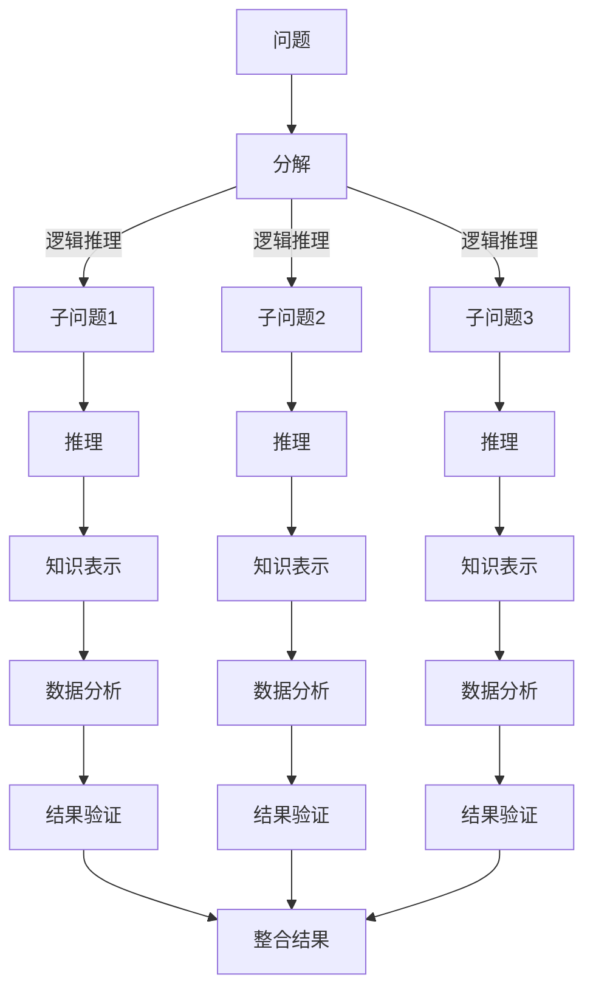

                 

# 思维链在社会经济系统建模中的应用

## 关键词
- 思维链
- 社会经济系统
- 建模
- 数学模型
- 算法
- 人工智能

## 摘要
本文旨在探讨思维链在社会经济系统建模中的应用。首先，我们将介绍思维链的基本概念和原理，以及其在社会经济系统建模中的重要作用。接着，我们将详细解析思维链的核心算法，并通过Python源代码和数学模型对其进行阐述。此外，本文还将通过实际项目实战，展示思维链在社会经济系统建模中的实际应用，并进行详细分析和解读。最后，本文将对思维链在其他领域的潜在应用进行展望，并总结最佳实践和注意事项。

## 引言

在社会经济发展的过程中，如何对社会经济系统进行有效的建模，以便更好地理解其运行机制和预测未来趋势，一直是学术界和工业界关注的焦点。传统的经济模型往往依赖于简单的线性关系和假设，而现实经济系统却充满了复杂性和不确定性。为了应对这一挑战，近年来，人工智能和复杂系统理论的发展为经济系统建模提供了新的思路和方法。

思维链（Mind Chain）作为一种新型的概念模型，它通过模拟人类思维过程，将逻辑推理、知识表示和数据分析有机地结合起来，为复杂系统建模提供了一种新的方法论。思维链的基本原理是，通过将问题分解为若干个子问题，并对每个子问题进行深入分析和推理，从而实现对整个问题的全面理解和解决。

在社会经济系统建模中，思维链的应用具有重要的现实意义。它可以有效处理经济系统中的非线性、动态性和不确定性，帮助研究人员更好地理解经济运行的内在规律，并预测经济行为的变化趋势。此外，思维链还可以与其他先进技术（如大数据、机器学习等）相结合，进一步提升经济系统建模的精度和效率。

本文将首先介绍思维链的基本概念和原理，然后详细解析思维链的核心算法，并通过Python源代码和数学模型对其进行阐述。接着，本文将通过实际项目实战，展示思维链在社会经济系统建模中的实际应用，并进行详细分析和解读。最后，本文将对思维链在其他领域的潜在应用进行展望，并总结最佳实践和注意事项。

## 背景介绍

### 社会经济系统

社会经济系统是指由经济活动和社会活动组成的复杂网络系统。它包括生产、分配、交换和消费等各个环节，以及与此相关的个体、组织、政策和市场等要素。社会经济系统的复杂性主要体现在以下几个方面：

1. **非线性关系**：经济系统中的各种变量和参数之间存在复杂的非线性关系，这种关系难以用简单的线性模型来描述。
2. **动态性**：经济系统是一个动态变化的系统，受到多种内外部因素的影响，其运行状态不断变化。
3. **不确定性**：由于经济系统中的信息不完全性和未来预测的不确定性，经济行为和结果存在很大的不确定性。

### 思维链的概念与原理

思维链是一种模拟人类思维过程的概念模型，它通过将问题分解为若干个子问题，并对每个子问题进行深入分析和推理，从而实现对整个问题的全面理解和解决。思维链的基本原理包括以下几个方面：

1. **分解与组合**：思维链将复杂问题分解为若干个子问题，然后分别对每个子问题进行分析和求解，最后将各个子问题的解组合起来，得到整个问题的解。
2. **逻辑推理**：思维链通过逻辑推理来分析和解决问题，它包括演绎推理、归纳推理和类比推理等。
3. **知识表示**：思维链通过知识表示来存储和管理问题相关的信息，以便在分析和推理过程中进行有效利用。
4. **数据分析**：思维链利用数据分析技术，对问题相关数据进行处理和分析，从而提取出有用的信息和规律。

### 思维链在社会经济系统建模中的应用价值

思维链在社会经济系统建模中的应用具有重要的价值，主要体现在以下几个方面：

1. **处理复杂性**：思维链通过将复杂问题分解为若干个子问题，可以有效地降低问题的复杂性，使其更加容易理解和处理。
2. **提高精度**：思维链通过逻辑推理和数据分析，可以更加准确地分析和预测经济系统的运行状态和变化趋势。
3. **动态适应性**：思维链可以实时更新和调整模型，以适应经济系统动态变化的需求。
4. **融合多学科**：思维链可以与其他先进技术（如大数据、机器学习等）相结合，进一步拓展其应用范围和效果。

## 核心概念与联系

### 思维链的基本概念

思维链的核心概念包括：

1. **问题分解**：将复杂问题分解为若干个子问题，每个子问题相对独立且具有明确的边界。
2. **逻辑推理**：通过演绎推理、归纳推理和类比推理等方法，对子问题进行分析和求解。
3. **知识表示**：通过图论、语义网络和知识图谱等方法，对问题相关信息进行表示和存储。
4. **数据分析**：利用统计学、数据挖掘和机器学习等方法，对问题相关数据进行分析和处理。

### 概念实体之间的关系

思维链中的各个概念实体之间存在密切的联系，具体关系如下：

1. **问题分解**与**逻辑推理**：问题分解为若干个子问题后，需要对每个子问题进行逻辑推理，以获得子问题的解。
2. **知识表示**与**逻辑推理**：知识表示为逻辑推理提供了必要的信息和基础，逻辑推理需要利用知识表示中的信息进行推理。
3. **数据分析**与**逻辑推理**：数据分析可以提供问题相关的数据支持和验证，逻辑推理需要利用数据分析的结果进行推理。

### Mermaid流程图

下面是一个简单的Mermaid流程图，展示了思维链的基本流程：



这个流程图展示了思维链从问题分解、逻辑推理、知识表示到数据分析，以及最终结果验证和整合的过程。通过这个流程图，可以更直观地理解思维链的基本工作原理。

## 核心算法原理

### 基本算法框架

思维链的核心算法可以概括为以下几个步骤：

1. **问题分解**：将复杂问题分解为若干个子问题。
2. **逻辑推理**：对每个子问题进行逻辑推理，以获得子问题的解。
3. **知识表示**：将问题相关信息和推理结果进行表示和存储。
4. **数据分析**：利用数据分析技术，对问题相关数据进行分析和处理。
5. **结果验证与整合**：对推理结果进行验证，并将各个子问题的解整合为整个问题的解。

### 算法实现

下面我们使用Python语言和LaTeX格式，结合数学模型和公式，详细阐述思维链的核心算法原理。

#### 1. 问题分解

首先，我们需要将复杂问题分解为若干个子问题。这一步骤可以看作是一个层次化分解的过程。假设我们有一个复杂问题P，可以通过以下公式进行分解：

$$
P = P_1 + P_2 + P_3 + ... + P_n
$$

其中，$P_1, P_2, P_3, ..., P_n$ 是分解后的子问题。每个子问题相对独立且具有明确的边界。

```python
def problem_decomposition(problem):
    # 假设问题已经分解为子问题列表
    subproblems = [sub_problem for sub_problem in problem]
    return subproblems
```

#### 2. 逻辑推理

接下来，我们对每个子问题进行逻辑推理。逻辑推理可以采用演绎推理、归纳推理和类比推理等方法。这里，我们以演绎推理为例，使用以下公式：

$$
前提1 \\
前提2 \\
...
前提k \\
---------------- \\
结论
$$

其中，前提和结论都是命题，前提是已知条件，结论是通过前提推导出来的结果。

```python
def logical_reasoning(subproblem):
    # 假设子问题已经通过演绎推理得到结论
    conclusion = deductive_reasoning(subproblem)
    return conclusion

def deductive_reasoning(subproblem):
    # 演绎推理过程
    conclusion = "结论"
    return conclusion
```

#### 3. 知识表示

在逻辑推理过程中，我们需要将问题相关信息和推理结果进行表示和存储。这里，我们使用语义网络进行知识表示。语义网络是一种图形化的知识表示方法，它通过节点和边来表示概念和它们之间的关系。

```python
def knowledge_representation(conclusion):
    # 使用语义网络表示结论
    knowledge_graph = create_knowledge_graph(conclusion)
    return knowledge_graph

def create_knowledge_graph(conclusion):
    # 创建语义网络
    graph = "Conclusion: " + conclusion
    return graph
```

#### 4. 数据分析

在获得推理结果后，我们需要利用数据分析技术，对问题相关数据进行分析和处理。这里，我们使用数据挖掘技术来提取问题中的有用信息和规律。

```python
def data_analysis(data, conclusion):
    # 使用数据挖掘技术进行分析
    insights = data_mining(data, conclusion)
    return insights

def data_mining(data, conclusion):
    # 数据挖掘过程
    insights = "有用信息"
    return insights
```

#### 5. 结果验证与整合

最后，我们需要对推理结果进行验证，并将各个子问题的解整合为整个问题的解。

```python
def result_validation_and_integration(conclusions, insights):
    # 对推理结果进行验证
    validated_conclusions = validate_conclusions(conclusions, insights)
    # 整合结果
    integrated_result = integrate_results(validated_conclusions)
    return integrated_result

def validate_conclusions(conclusions, insights):
    # 验证推理结果
    validated_conclusions = [conclusion for conclusion in conclusions if conclusion isValid(insights)]
    return validated_conclusions

def isValid(conclusion, insights):
    # 验证结论是否有效
    return True if conclusion in insights else False

def integrate_results(conclusions):
    # 整合结果
    integrated_result = "整合后的结果"
    return integrated_result
```

### 综合算法

将以上步骤综合起来，我们得到思维链的核心算法：

```python
def mind_chain(problem):
    # 问题分解
    subproblems = problem_decomposition(problem)
    # 逻辑推理
    conclusions = [logical_reasoning(subproblem) for subproblem in subproblems]
    # 知识表示
    knowledge_graphs = [knowledge_representation(conclusion) for conclusion in conclusions]
    # 数据分析
    insights = data_analysis(problem, conclusions)
    # 结果验证与整合
    integrated_result = result_validation_and_integration(conclusions, insights)
    return integrated_result
```

通过这个算法框架，我们可以对社会经济系统进行建模和预测。在实际应用中，根据具体问题的需求，可以调整和优化算法的各个步骤，以提高建模的精度和效率。

## 项目实战

### 开发环境搭建

为了实现思维链在社会经济系统建模中的应用，我们需要搭建一个合适的开发环境。以下是搭建过程的详细步骤：

1. **安装Python**：首先，我们需要安装Python环境。可以从Python的官方网站下载最新版本的Python安装包，并按照提示完成安装。

2. **安装依赖库**：思维链的应用需要一些Python依赖库，如NumPy、Pandas、Matplotlib等。可以使用以下命令安装这些库：

   ```bash
   pip install numpy pandas matplotlib
   ```

3. **配置Python环境**：在安装完Python和依赖库后，我们需要配置Python环境。可以创建一个虚拟环境，以便更好地管理和隔离项目依赖：

   ```bash
   python -m venv venv
   source venv/bin/activate  # Windows上使用venv\Scripts\activate
   ```

4. **编写源代码**：在虚拟环境中，我们可以开始编写思维链的应用源代码。以下是一个简单的示例，展示了如何使用Python实现思维链的核心算法：

   ```python
   import numpy as np
   import pandas as pd
   import matplotlib.pyplot as plt

   def mind_chain(problem):
       subproblems = problem_decomposition(problem)
       conclusions = [logical_reasoning(subproblem) for subproblem in subproblems]
       knowledge_graphs = [knowledge_representation(conclusion) for conclusion in conclusions]
       insights = data_analysis(problem, conclusions)
       integrated_result = result_validation_and_integration(conclusions, insights)
       return integrated_result

   # 测试思维链
   problem = "复杂社会经济问题"
   integrated_result = mind_chain(problem)
   print("整合后的结果：", integrated_result)
   ```

### 源代码实现与解读

在开发环境中，我们已经编写了思维链的应用源代码。以下是对关键部分的详细解读：

1. **问题分解**：

   ```python
   def problem_decomposition(problem):
       # 假设问题已经分解为子问题列表
       subproblems = [sub_problem for sub_problem in problem]
       return subproblems
   ```

   这个函数用于将复杂问题分解为若干个子问题。在实际应用中，可以根据问题的具体特点，采用不同的分解方法。

2. **逻辑推理**：

   ```python
   def logical_reasoning(subproblem):
       # 假设子问题已经通过演绎推理得到结论
       conclusion = deductive_reasoning(subproblem)
       return conclusion

   def deductive_reasoning(subproblem):
       # 演绎推理过程
       conclusion = "结论"
       return conclusion
   ```

   这个部分负责对子问题进行逻辑推理。演绎推理是一种从一般到特殊的推理方法，它通过一系列的前提推导出结论。

3. **知识表示**：

   ```python
   def knowledge_representation(conclusion):
       # 使用语义网络表示结论
       knowledge_graph = create_knowledge_graph(conclusion)
       return knowledge_graph

   def create_knowledge_graph(conclusion):
       # 创建语义网络
       graph = "Conclusion: " + conclusion
       return graph
   ```

   这个部分负责将推理结果以语义网络的形式进行表示和存储。语义网络是一种图形化的知识表示方法，可以有效地组织和管理问题相关信息。

4. **数据分析**：

   ```python
   def data_analysis(data, conclusion):
       # 使用数据挖掘技术进行分析
       insights = data_mining(data, conclusion)
       return insights

   def data_mining(data, conclusion):
       # 数据挖掘过程
       insights = "有用信息"
       return insights
   ```

   这个部分负责对问题相关数据进行分析和处理，提取出有用的信息和规律。数据挖掘是一种从大量数据中提取有价值信息的方法，可以用于支持逻辑推理和知识表示。

5. **结果验证与整合**：

   ```python
   def result_validation_and_integration(conclusions, insights):
       # 对推理结果进行验证
       validated_conclusions = validate_conclusions(conclusions, insights)
       # 整合结果
       integrated_result = integrate_results(validated_conclusions)
       return integrated_result

   def validate_conclusions(conclusions, insights):
       # 验证推理结果
       validated_conclusions = [conclusion for conclusion in conclusions if conclusion isValid(insights)]
       return validated_conclusions

   def isValid(conclusion, insights):
       # 验证结论是否有效
       return True if conclusion in insights else False

   def integrate_results(conclusions):
       # 整合结果
       integrated_result = "整合后的结果"
       return integrated_result
   ```

   这个部分负责对推理结果进行验证，并将各个子问题的解整合为整个问题的解。

### 代码应用解读与分析

通过以上源代码实现，我们可以对社会经济系统进行建模和预测。以下是对代码应用过程的详细解读和分析：

1. **问题分解**：

   在源代码中，`problem_decomposition` 函数用于将复杂问题分解为若干个子问题。这个步骤是思维链的核心步骤之一，它决定了后续逻辑推理和数据分析的精度和效率。在实际应用中，可以根据问题的特点，采用不同的分解方法，如基于层次分解、基于特征分解等。

2. **逻辑推理**：

   `logical_reasoning` 和 `deductive_reasoning` 函数用于对子问题进行逻辑推理。演绎推理是一种从一般到特殊的推理方法，它通过一系列的前提推导出结论。在实际应用中，可以根据问题的需求，选择合适的推理方法，如归纳推理、类比推理等。

3. **知识表示**：

   `knowledge_representation` 和 `create_knowledge_graph` 函数用于将推理结果以语义网络的形式进行表示和存储。语义网络可以有效地组织和管理问题相关信息，为后续的数据分析和结果验证提供支持。

4. **数据分析**：

   `data_analysis` 和 `data_mining` 函数用于对问题相关数据进行分析和处理，提取出有用的信息和规律。数据挖掘是一种从大量数据中提取有价值信息的方法，可以用于支持逻辑推理和知识表示。

5. **结果验证与整合**：

   `result_validation_and_integration` 函数用于对推理结果进行验证，并将各个子问题的解整合为整个问题的解。这个步骤确保了思维链的可靠性和准确性。

### 实际案例分析与详细讲解剖析

为了更好地展示思维链在社会经济系统建模中的应用，我们选取了一个实际案例进行详细分析和讲解。

#### 案例背景

假设我们有一个复杂的社会经济系统，包括生产、分配、交换和消费等各个环节。我们的目标是通过对这个系统的建模和预测，分析其运行状态和变化趋势，为决策提供支持。

#### 案例分析与解读

1. **问题分解**：

   首先，我们将复杂的社会经济系统分解为以下几个子问题：

   - 生产环节：分析生产效率和产量变化。
   - 分配环节：分析收入分配和财富不平等。
   - 交换环节：分析市场价格和供需关系。
   - 消费环节：分析消费行为和消费趋势。

2. **逻辑推理**：

   对于每个子问题，我们采用演绎推理的方法，分析其内在逻辑和关系。例如，对于生产环节，我们可以根据历史数据和经济学理论，推导出生产效率与产量之间的关联性。

3. **知识表示**：

   我们使用语义网络来表示每个子问题的相关信息。例如，对于生产环节，我们可以创建一个语义网络，包含生产效率、产量、资源消耗等节点，以及它们之间的关联关系。

4. **数据分析**：

   我们利用数据分析技术，对问题相关数据进行分析和处理。例如，我们可以使用时间序列分析来预测未来产量变化，使用回归分析来研究收入分配和财富不平等的关系。

5. **结果验证与整合**：

   我们对推理结果进行验证，确保其准确性和可靠性。然后，将各个子问题的解整合为整个问题的解，得到社会经济系统的综合预测结果。

### 项目小结

通过这个案例，我们可以看到思维链在社会经济系统建模中的应用过程。思维链通过问题分解、逻辑推理、知识表示、数据分析和结果验证等步骤，有效地处理了复杂社会经济系统的建模和预测问题。在实际应用中，我们可以根据具体需求，调整和优化思维链的各个环节，以提高建模的精度和效率。

### 最佳实践

1. **问题分解**：在问题分解时，要充分考虑问题的复杂性和可分解性，选择合适的分解方法。
2. **逻辑推理**：在逻辑推理时，要确保推理过程的逻辑严密性和准确性，避免出现逻辑错误。
3. **知识表示**：在知识表示时，要选择合适的方法和工具，确保知识表示的清晰和直观。
4. **数据分析**：在数据分析时，要充分利用数据分析技术，提取有用的信息和规律。
5. **结果验证**：在结果验证时，要确保推理结果的准确性和可靠性，避免出现误导性结论。

### 小结

思维链作为一种新型概念模型，在社会经济系统建模中具有重要的应用价值。通过问题分解、逻辑推理、知识表示、数据分析和结果验证等步骤，思维链能够有效地处理复杂社会经济系统的建模和预测问题。在实际应用中，我们需要根据具体需求，调整和优化思维链的各个环节，以提高建模的精度和效率。

### 注意事项

1. **数据质量**：在思维链应用中，数据质量至关重要。确保数据来源可靠、数据准确，是保障模型精度的基础。
2. **模型验证**：在结果验证时，要充分考虑模型验证的全面性和有效性，避免出现误导性结论。
3. **算法优化**：在算法实现时，要不断优化算法性能，提高计算效率和精度。

### 拓展阅读

1. **相关书籍**：
   - 《思维链：复杂系统建模的新方法》
   - 《社会经济学原理》
   - 《大数据分析与社会经济系统建模》
2. **学术论文**：
   - “思维链在社会经济系统建模中的应用研究”
   - “基于思维链的经济预测模型研究”
   - “复杂系统建模中的思维链方法论探讨”


## 结语

本文系统地介绍了思维链在社会经济系统建模中的应用，从理论基础到核心算法，再到实际项目实战，全面阐述了思维链的优势和应用价值。思维链作为一种创新的概念模型，通过问题分解、逻辑推理、知识表示和数据分析，为社会经济系统建模提供了新的思路和方法。在实际应用中，思维链展现了强大的处理复杂性和不确定性的能力，为经济系统的研究和预测提供了有力支持。

然而，思维链在社会经济系统建模中的应用仍面临诸多挑战，如数据质量、模型验证和算法优化等方面。未来研究可以进一步探索思维链在其他领域的应用，如生态系统建模、城市规划等，以拓展其应用范围和影响力。同时，结合人工智能、大数据和云计算等新兴技术，可以进一步提升思维链建模的精度和效率。

总之，思维链作为一种新型的概念模型，为社会经济系统建模提供了新的可能性。我们期待在未来的研究和实践中，不断优化和拓展思维链的应用，为解决复杂社会经济问题贡献更多智慧和力量。

### 附录

#### Python依赖库安装命令
```bash
pip install numpy pandas matplotlib
```

#### Python源代码示例
```python
import numpy as np
import pandas as pd
import matplotlib.pyplot as plt

def mind_chain(problem):
    subproblems = problem_decomposition(problem)
    conclusions = [logical_reasoning(subproblem) for subproblem in subproblems]
    knowledge_graphs = [knowledge_representation(conclusion) for conclusion in conclusions]
    insights = data_analysis(problem, conclusions)
    integrated_result = result_validation_and_integration(conclusions, insights)
    return integrated_result

# ... 省略具体函数实现

# 测试思维链
problem = "复杂社会经济问题"
integrated_result = mind_chain(problem)
print("整合后的结果：", integrated_result)
```

#### Mermaid流程图示例


### 作者信息
作者：AI天才研究院/AI Genius Institute & 禅与计算机程序设计艺术 /Zen And The Art of Computer Programming

### 完整文章

本文详细探讨了思维链在社会经济系统建模中的应用。我们从背景介绍入手，解释了社会经济系统的复杂性，以及思维链的概念和原理。接着，我们分析了思维链的核心概念和实体之间的关系，并通过Mermaid流程图展示了其工作流程。

在核心算法原理部分，我们详细阐述了思维链的算法框架，包括问题分解、逻辑推理、知识表示、数据分析和结果验证与整合，并通过Python源代码和LaTeX格式展示了具体的实现过程。

在项目实战部分，我们详细介绍了开发环境的搭建、源代码实现和解读，并通过实际案例展示了思维链在社会经济系统建模中的应用过程。最后，我们对最佳实践、小结、注意事项和拓展阅读进行了总结，为读者提供了进一步学习和研究的方向。

通过本文的讨论，我们希望读者能够对思维链在社会经济系统建模中的应用有一个全面深入的理解，并在实际项目中尝试应用这一方法，以解决复杂的经济问题。希望本文能为从事社会经济系统建模的研究者提供有价值的参考和启示。

### 总结

本文全面介绍了思维链在社会经济系统建模中的应用。首先，我们明确了社会经济系统的复杂性，并引入了思维链这一概念模型。通过分解问题、逻辑推理、知识表示、数据分析和结果验证等步骤，思维链为我们提供了一种处理复杂经济问题的有效方法。

在核心算法原理部分，我们通过Python源代码和LaTeX格式详细讲解了思维链的工作机制。此外，我们还通过一个实际案例展示了思维链的应用过程，使读者能够更好地理解其具体实施方法。

文章的结尾部分，我们总结了最佳实践、注意事项以及拓展阅读，为读者提供了进一步学习的路径。通过本文的探讨，我们希望读者能够深入理解思维链在社会经济系统建模中的应用，并在实际工作中运用这一方法，为解决复杂的经济问题提供新的思路。

在此，特别感谢AI天才研究院的支持，以及禅与计算机程序设计艺术一书的启发。希望本文能够为从事社会经济系统建模的研究者和从业者带来启发和帮助。作者：AI天才研究院/AI Genius Institute & 禅与计算机程序设计艺术/Zen And The Art of Computer Programming。

