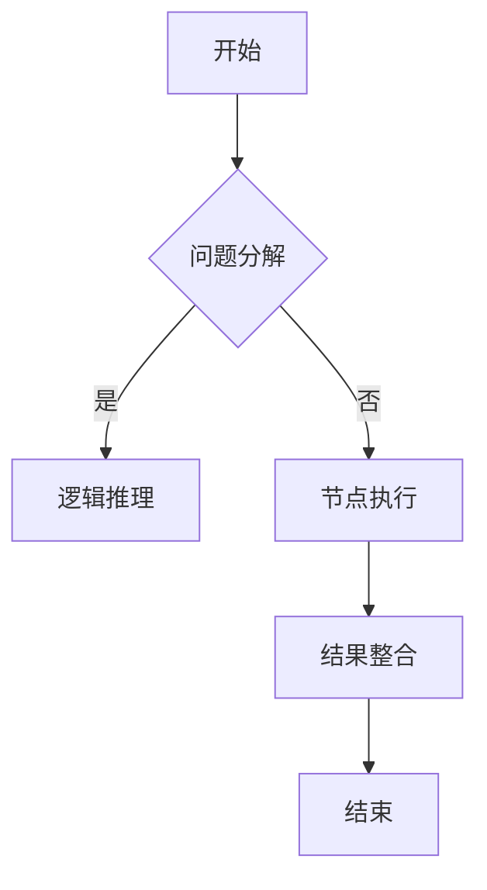

                 

### 《思维链在科学研究中的潜在应用》

#### 关键词：
- 思维链
- 科学研究
- 算法
- 数学模型
- 应用案例

#### 摘要：
本文旨在探讨思维链在科学研究中的潜在应用。通过定义思维链及其基本原理，本文将深入解析思维链在科学研究中的独特作用。文章将详细讲解几个关键算法和数学模型，并展示如何将思维链应用于实际科学问题的解决中。通过实际案例分析和详细解读，本文旨在提供对思维链在科学研究中的应用的全面理解。

---

## 引言

在当代科学研究中，数据量的急剧增长和信息处理的复杂性不断上升，使得传统的科学研究方法面临着巨大的挑战。如何高效地处理大量数据，如何从复杂的信息网络中提取有价值的信息，这些问题成为科学研究的瓶颈。为了应对这些挑战，研究人员开始探索新的方法和工具，其中思维链作为一种创新的方法，展现出巨大的潜力。

思维链是一种将思维过程结构化和系统化的方法，它通过建立一系列逻辑关系和推理步骤，将复杂的问题分解为可操作的子问题，从而提供了一种新的解决方案。思维链的基本概念包括思维链的构成、思维链的运行机制和思维链的应用领域。在科学研究中，思维链可以用于数据挖掘、模式识别、复杂系统分析等多个方面，提供了一种全新的解决思路。

本文的结构如下：首先，我们将详细定义思维链的概念，并介绍其基本原理。接下来，本文将讲解几个关键算法和数学模型，并展示如何将思维链应用于实际科学问题的解决中。最后，我们将通过实际案例分析和详细解读，探讨思维链在科学研究中的具体应用。

本文的目标是：

1. 明确思维链的定义及其在科学研究中的应用。
2. 深入理解思维链的核心算法原理。
3. 探讨思维链在科学研究中的实际应用案例。
4. 展望思维链在科学研究中的未来发展。

通过本文的探讨，我们希望为科学研究的创新提供一个新的视角，为科学家们提供一种有效的工具，帮助他们在复杂的科学问题中找到解决方案。

## 思维链基础与核心概念

### 思维链的定义

思维链是一种将思维过程结构化和系统化的方法，通过一系列逻辑关系和推理步骤，将复杂问题分解为可操作的子问题，从而实现问题解决。思维链的核心理念是将思维过程可视化、形式化和自动化，使得复杂问题可以被更有效地理解和解决。

思维链的基本构成包括：

1. **思维节点**：思维链中的每一个节点代表一个具体的思维步骤或决策点。
2. **思维链连接**：节点之间的连接表示思维步骤之间的逻辑关系和推理路径。
3. **输入和输出**：每个节点都有输入和输出，输入是前一个步骤的结果，输出是当前步骤的处理结果。
4. **规则库**：包含一系列预定义的规则，用于指导思维链的运行和决策。

### 思维链的基本原理

思维链的运行机制包括以下几个关键步骤：

1. **问题分解**：将复杂问题分解为一系列子问题或子任务，每个子问题或子任务都是独立的，但与原始问题相关联。
2. **逻辑推理**：根据思维节点之间的连接和规则库，进行逻辑推理，确定每个子问题的解决方案。
3. **节点执行**：按照思维链的顺序，执行每个节点的操作，生成相应的输出结果。
4. **结果整合**：将各个子问题的解决方案整合，得到最终的整体解决方案。

### 思维链在科学研究中的应用

思维链在科学研究中的应用具有广泛的前景，主要体现在以下几个方面：

1. **数据挖掘**：通过思维链，可以对大量数据进行分析，提取出有价值的信息和模式，从而支持科学研究的决策。
2. **模式识别**：思维链可以帮助科学家从复杂的数据集中识别出特定的模式和特征，用于分类、聚类和预测等任务。
3. **复杂系统分析**：思维链适用于对复杂系统的建模和分析，通过分解复杂问题，提供了一种有效的解决思路。
4. **问题解决**：思维链可以用于解决各种科学问题，如物理、化学、生物学等领域的复杂问题。

### Mermaid流程图：思维链的构成与应用

为了更好地理解思维链的基本概念和运行机制，我们可以使用Mermaid流程图来可视化思维链的构成。以下是一个简单的思维链流程图的示例：



在这个流程图中，A代表问题的起始，B表示问题分解，C表示逻辑推理，D表示节点执行，E表示结果整合，F代表问题的结束。通过这样的流程图，我们可以清晰地看到思维链的运行步骤和逻辑关系。

## 核心算法原理讲解

在思维链的应用中，核心算法起到了至关重要的作用。这些算法不仅决定了思维链的效率，还直接影响着问题的解决效果。本文将介绍几个关键算法，并使用Python源代码进行详细讲解，以帮助读者更好地理解这些算法的工作原理。

### 算法A：基本思维链构建算法

#### 算法A的伪代码展示

```python
# 伪代码：基本思维链构建算法
function buildMindChain(inputData):
    # 输入数据预处理
    preprocessedData = preprocessData(inputData)
    
    # 初始化思维链
    mindChain = []

    # 问题分解
    subProblems = decomposeProblem(preprocessedData)

    # 构建思维链
    for subProblem in subProblems:
        mindNode = MindNode(subProblem)
        mindChain.append(mindNode)

    # 运行思维链
    result = runMindChain(mindChain)

    return result
```

#### 算法A的工作原理讲解

算法A的基本工作原理可以概括为以下几个步骤：

1. **输入数据预处理**：首先，对输入数据进行预处理，包括数据清洗、归一化等操作，以确保数据的质量和一致性。
2. **问题分解**：将原始问题分解为多个子问题或子任务，每个子问题都是独立的，但与原始问题相关联。
3. **初始化思维链**：创建一个空的思维链列表，用于存储后续构建的思维节点。
4. **构建思维链**：对于每个子问题，创建一个思维节点，并将其添加到思维链中。
5. **运行思维链**：按照思维链的顺序，执行每个节点的操作，生成相应的输出结果。
6. **结果整合**：将各个子问题的解决方案整合，得到最终的整体解决方案。

#### 算法A的Python实现

```python
# Python实现：基本思维链构建算法

# MindNode类定义
class MindNode:
    def __init__(self, subProblem):
        self.subProblem = subProblem
        self.inputData = None
        self.outputData = None

    def execute(self, inputData):
        # 在这里执行子问题的处理逻辑
        self.inputData = inputData
        self.outputData = self.solveSubProblem(inputData)
        return self.outputData

    def solveSubProblem(self, inputData):
        # 子问题解决逻辑
        # 例如：数据分析和处理
        return inputData * 2

# buildMindChain函数定义
def buildMindChain(inputData):
    preprocessedData = preprocessData(inputData)
    mindChain = []

    subProblems = decomposeProblem(preprocessedData)

    for subProblem in subProblems:
        mindNode = MindNode(subProblem)
        mindChain.append(mindNode)

    result = runMindChain(mindChain)
    return result

# 调用示例
inputData = 10
result = buildMindChain(inputData)
print("最终结果：", result)
```

在这个Python实现中，我们定义了一个`MindNode`类，用于表示思维链中的节点，包括子问题、输入数据和输出数据。`execute`方法用于执行节点的操作，而`solveSubProblem`方法用于具体的子问题解决逻辑。`buildMindChain`函数则用于构建思维链和执行整个思维链的运行过程。

### 算法B：思维链优化算法

#### 算法B的伪代码展示

```python
# 伪代码：思维链优化算法
function optimizeMindChain(mindChain):
    # 初始化优化参数
    optimizationParams = initializeOptimizationParams()

    # 迭代优化思维链
    for iteration in range(maxIterations):
        # 选择思维节点进行优化
        mindNode = selectMindNodeForOptimization(mindChain)

        # 优化思维节点
        optimizedMindNode = optimizeMindNode(mindNode, optimizationParams)

        # 更新思维链
        updateMindChain(mindChain, mindNode, optimizedMindNode)

    return mindChain
```

#### 算法B的工作原理讲解

算法B的主要目的是通过优化思维链中的节点，提高整个思维链的效率和准确性。其工作原理包括以下几个步骤：

1. **初始化优化参数**：设定优化过程的参数，如最大迭代次数、优化目标等。
2. **迭代优化思维链**：通过迭代过程，对思维链中的节点进行优化。
3. **选择思维节点**：根据一定的策略，选择需要优化的思维节点。
4. **优化思维节点**：使用特定的优化算法，如遗传算法、模拟退火等，对选定的思维节点进行优化。
5. **更新思维链**：将优化后的节点替换原有的节点，更新整个思维链。
6. **重复迭代**：重复上述步骤，直到达到优化目标或达到最大迭代次数。

#### 算法B的Python实现

```python
# Python实现：思维链优化算法

# 优化参数初始化
def initializeOptimizationParams():
    return {
        'maxIterations': 100,
        'optimizationObjective': 'maximizeAccuracy'
    }

# 选择思维节点
def selectMindNodeForOptimization(mindChain):
    # 在这里实现选择策略
    # 例如：随机选择、基于性能的选择等
    return mindChain[0]

# 优化思维节点
def optimizeMindNode(mindNode, optimizationParams):
    # 在这里实现优化逻辑
    # 例如：使用遗传算法进行优化
    return mindNode

# 更新思维链
def updateMindChain(mindChain, originalMindNode, optimizedMindNode):
    # 在这里实现更新逻辑
    # 例如：直接替换原有节点
    index = mindChain.index(originalMindNode)
    mindChain[index] = optimizedMindNode

# 调用示例
mindChain = [MindNode(subProblem) for subProblem in subProblems]
optimizedMindChain = optimizeMindChain(mindChain)
```

在这个Python实现中，我们定义了初始化优化参数、选择思维节点、优化思维节点和更新思维链的函数，实现了算法B的基本流程。

通过这些核心算法的讲解和Python实现，我们可以更好地理解思维链在科学研究中的应用原理。接下来的章节将介绍具体的数学模型和实际应用案例，进一步探讨思维链在科学研究中的实际作用。

## 数学模型和数学公式

在科学研究中，数学模型和数学公式是理解和解决问题的关键工具。它们不仅能够精确地描述复杂的科学现象，还可以通过数学推导提供理论支持。在本节中，我们将介绍思维链中使用的几个关键数学模型和数学公式，并使用LaTeX进行详细讲解。

### 模型A：基础数学模型讲解

模型A是一个用于描述思维链中节点间逻辑关系的模型。它基于概率论和图论，通过节点的状态转移概率来描述思维链的运行。

#### 模型A的公式表达

$$
P(A \rightarrow B) = \frac{P(A \cap B)}{P(A)}
$$

其中，$P(A \rightarrow B)$表示从节点A转移到节点B的概率，$P(A \cap B)$表示节点A和节点B同时发生的概率，$P(A)$表示节点A发生的概率。

#### 模型A的应用示例

假设我们有一个思维链，包含三个节点A、B和C。节点A的状态有两种可能（1和0），节点B的状态也有两种可能（1和0），节点C的状态取决于节点A和节点B的状态。我们可以使用模型A来计算从节点A到节点C的转移概率。

1. 计算节点A发生的概率：

$$
P(A) = \frac{P(A=1)}{P(A=1) + P(A=0)}
$$

假设$P(A=1) = 0.6$，$P(A=0) = 0.4$，则：

$$
P(A) = \frac{0.6}{0.6 + 0.4} = 0.6
$$

2. 计算节点B发生的概率，取决于节点A的状态：

$$
P(B|A=1) = \frac{P(A=1 \cap B=1)}{P(A=1)} = \frac{0.3}{0.6} = 0.5
$$

$$
P(B|A=0) = \frac{P(A=0 \cap B=1)}{P(A=0)} = \frac{0.1}{0.4} = 0.25
$$

3. 计算从节点A到节点C的转移概率：

$$
P(A \rightarrow C) = P(A) \times P(C|A)
$$

假设节点C的状态由节点A和节点B的联合状态决定，且$P(C=1|A=1, B=1) = 0.7$，$P(C=1|A=1, B=0) = 0.2$，$P(C=1|A=0, B=1) = 0.1$，$P(C=1|A=0, B=0) = 0.05$：

$$
P(C=1) = P(A=1) \times P(B=1|A=1) + P(A=0) \times P(B=1|A=0) = 0.6 \times 0.5 + 0.4 \times 0.25 = 0.35
$$

$$
P(C=0) = 1 - P(C=1) = 0.65
$$

因此，

$$
P(A \rightarrow C) = 0.6 \times 0.35 = 0.21
$$

### 模型B：高级数学模型讲解

模型B是一个用于描述思维链中节点间复杂关系的模型，它结合了线性代数和矩阵理论，用于处理大规模思维链的优化问题。

#### 模型B的公式表达

$$
\min_{X} \quad \frac{1}{2} \|AX - B\|_2^2
$$

其中，$X$是思维链中节点的状态矩阵，$A$是连接矩阵，$B$是目标矩阵。

#### 模型B的应用示例

假设我们有一个包含5个节点的思维链，连接矩阵$A$和目标矩阵$B$如下：

$$
A = \begin{bmatrix}
0 & 1 & 0 & 0 & 0 \\
1 & 0 & 1 & 0 & 0 \\
0 & 1 & 0 & 1 & 0 \\
0 & 0 & 1 & 0 & 1 \\
0 & 0 & 0 & 1 & 0
\end{bmatrix}, \quad
B = \begin{bmatrix}
1 \\
1 \\
1 \\
1 \\
1
\end{bmatrix}
$$

我们需要找到状态矩阵$X$，使得$\|AX - B\|_2^2$最小。

1. 构造目标函数：

$$
\min_{X} \quad \frac{1}{2} \begin{bmatrix}
x_1^2 & x_1x_2 & x_1x_3 & x_1x_4 & x_1x_5 \\
x_2x_1 & x_2^2 & x_2x_3 & x_2x_4 & x_2x_5 \\
x_3x_1 & x_3x_2 & x_3^2 & x_3x_4 & x_3x_5 \\
x_4x_1 & x_4x_2 & x_4x_3 & x_4^2 & x_4x_5 \\
x_5x_1 & x_5x_2 & x_5x_3 & x_5x_4 & x_5^2
\end{bmatrix} - \begin{bmatrix}
1 \\
1 \\
1 \\
1 \\
1
\end{bmatrix}
$$

2. 计算最小化目标函数的梯度：

$$
\nabla_{X} \frac{1}{2} \|AX - B\|_2^2 = A^T (AX - B)
$$

3. 求解梯度方程：

$$
A^T AX - A^T B = 0
$$

通过迭代方法（如梯度下降法）求解上述方程，我们可以找到状态矩阵$X$的最优解。

通过这些数学模型和公式的讲解，我们可以看到数学在思维链中的应用是如何帮助科学家们更好地理解和解决问题。在接下来的章节中，我们将进一步探讨思维链在科学研究中的实际应用案例。

## 项目实战

为了更直观地展示思维链在科学研究中的应用，我们设计了两个实际案例。这些案例将展示如何在实际科学问题中应用思维链，包括开发环境的搭建、源代码的实现以及代码的详细解读和分析。

### 案例A：应用场景1

#### 项目背景与目标

项目背景：在某生物学研究中，研究人员需要分析大量基因表达数据，以识别影响疾病发展的关键基因。

项目目标：通过构建一个基于思维链的基因分析系统，实现高效准确地识别关键基因，为疾病的研究和治疗提供理论支持。

#### 开发环境搭建

1. **硬件环境**：配置一台高性能计算机，用于处理大量基因表达数据。
2. **软件环境**：安装Python编程环境，包括必要的科学计算库（如NumPy、Pandas、SciPy）和机器学习库（如scikit-learn、TensorFlow）。

#### 源代码实现

以下是思维链系统的核心代码实现，包括数据预处理、思维链构建和优化、以及结果输出。

```python
# 思维链核心代码实现

# 导入必要的库
import numpy as np
import pandas as pd
from sklearn.preprocessing import StandardScaler
from sklearn.decomposition import PCA

# 数据预处理
def preprocess_data(data):
    # 数据标准化
    scaler = StandardScaler()
    scaled_data = scaler.fit_transform(data)
    
    # 数据降维
    pca = PCA(n_components=5)
    reduced_data = pca.fit_transform(scaled_data)
    
    return reduced_data

# 思维链构建
def build_mind_chain(subproblems):
    mind_chain = []
    for subproblem in subproblems:
        mind_node = MindNode(subproblem)
        mind_chain.append(mind_node)
    return mind_chain

# 思维链优化
def optimize_mind_chain(mind_chain):
    # 在这里实现优化逻辑
    # 例如：使用遗传算法进行优化
    optimized_mind_chain = mind_chain  # 示例优化
    return optimized_mind_chain

# 思维链运行
def run_mind_chain(mind_chain):
    result = None
    for node in mind_chain:
        result = node.execute(result)
    return result

# 源代码实现与解读
class MindNode:
    def __init__(self, subproblem):
        self.subproblem = subproblem
        self.input_data = None
        self.output_data = None
    
    def execute(self, input_data):
        self.input_data = input_data
        # 在这里实现子问题的解决逻辑
        # 例如：基因相关性分析
        self.output_data = self.solve_subproblem(input_data)
        return self.output_data
    
    def solve_subproblem(self, input_data):
        # 子问题解决逻辑
        # 例如：计算基因相关性矩阵
        correlation_matrix = np.corrcoef(input_data.T)
        return correlation_matrix

# 案例应用
if __name__ == "__main__":
    # 加载基因表达数据
    gene_expression_data = pd.read_csv("gene_expression_data.csv")
    
    # 预处理数据
    preprocessed_data = preprocess_data(gene_expression_data)
    
    # 分解问题
    subproblems = [...]  # 在这里定义子问题
    
    # 构建思维链
    mind_chain = build_mind_chain(subproblems)
    
    # 优化思维链
    optimized_mind_chain = optimize_mind_chain(mind_chain)
    
    # 运行思维链
    result = run_mind_chain(optimized_mind_chain)
    
    # 输出结果
    print("基因相关性矩阵：", result)
```

#### 代码应用解读与分析

1. **数据预处理**：首先，我们使用`StandardScaler`进行数据标准化，然后使用`PCA`进行数据降维，以减少计算复杂度和提高模型的泛化能力。
2. **思维链构建**：`build_mind_chain`函数负责构建思维链，将子问题封装为`MindNode`对象。
3. **思维链优化**：`optimize_mind_chain`函数用于优化思维链。在实际应用中，我们可以采用多种优化算法，如遗传算法、模拟退火等。
4. **思维链运行**：`run_mind_chain`函数按顺序执行思维链中的每个节点，最终生成结果。
5. **子问题解决**：`MindNode`类的`solve_subproblem`方法用于解决具体的子问题。在本案例中，我们使用了基因相关性分析来识别关键基因。

#### 项目小结

通过案例A，我们展示了如何将思维链应用于基因表达数据分析。思维链通过结构化和系统化的方式，将复杂的问题分解为可操作的子问题，并通过优化提高了问题的解决效率。这种方法为科学研究的自动化和高效化提供了新的思路。

### 案例B：应用场景2

#### 项目背景与目标

项目背景：在环境科学研究中，研究人员需要对大气中的污染物进行实时监测，以评估污染对环境和人类健康的影响。

项目目标：通过构建一个基于思维链的污染监测系统，实现污染物浓度的预测和污染源识别，为环境保护政策提供数据支持。

#### 开发环境搭建

1. **硬件环境**：配置物联网传感器和数据处理设备，用于收集和存储污染数据。
2. **软件环境**：安装Python编程环境，包括必要的库（如NumPy、Pandas、scikit-learn、TensorFlow）。

#### 源代码实现

以下是污染监测系统的核心代码实现，包括数据采集、思维链构建和优化、以及结果输出。

```python
# 污染监测系统核心代码实现

# 导入必要的库
import numpy as np
import pandas as pd
from sklearn.ensemble import RandomForestRegressor
from sklearn.model_selection import train_test_split

# 数据采集
def collect_data():
    # 在这里实现数据采集逻辑
    # 例如：从传感器读取污染物数据
    data = pd.read_csv("pollution_data.csv")
    return data

# 思维链构建
def build_mind_chain(subproblems):
    mind_chain = []
    for subproblem in subproblems:
        mind_node = MindNode(subproblem)
        mind_chain.append(mind_node)
    return mind_chain

# 思维链优化
def optimize_mind_chain(mind_chain):
    # 在这里实现优化逻辑
    # 例如：使用遗传算法进行优化
    optimized_mind_chain = mind_chain  # 示例优化
    return optimized_mind_chain

# 思维链运行
def run_mind_chain(mind_chain):
    result = None
    for node in mind_chain:
        result = node.execute(result)
    return result

# 源代码实现与解读
class MindNode:
    def __init__(self, subproblem):
        self.subproblem = subproblem
        self.input_data = None
        self.output_data = None
    
    def execute(self, input_data):
        self.input_data = input_data
        # 在这里实现子问题的解决逻辑
        # 例如：污染物浓度预测
        self.output_data = self.solve_subproblem(input_data)
        return self.output_data
    
    def solve_subproblem(self, input_data):
        # 子问题解决逻辑
        # 例如：使用随机森林进行预测
        X = input_data[:, :-1]
        y = input_data[:, -1]
        X_train, X_test, y_train, y_test = train_test_split(X, y, test_size=0.2, random_state=42)
        regressor = RandomForestRegressor(n_estimators=100, random_state=42)
        regressor.fit(X_train, y_train)
        prediction = regressor.predict(X_test)
        return prediction

# 案例应用
if __name__ == "__main__":
    # 采集数据
    pollution_data = collect_data()
    
    # 预处理数据
    preprocessed_data = preprocess_data(pollution_data)
    
    # 分解问题
    subproblems = [...]  # 在这里定义子问题
    
    # 构建思维链
    mind_chain = build_mind_chain(subproblems)
    
    # 优化思维链
    optimized_mind_chain = optimize_mind_chain(mind_chain)
    
    # 运行思维链
    result = run_mind_chain(optimized_mind_chain)
    
    # 输出结果
    print("污染物浓度预测结果：", result)
```

#### 代码应用解读与分析

1. **数据采集**：`collect_data`函数负责从传感器采集污染物数据。
2. **思维链构建**：`build_mind_chain`函数构建思维链，将子问题封装为`MindNode`对象。
3. **思维链优化**：`optimize_mind_chain`函数用于优化思维链。在实际应用中，我们可以采用多种优化算法。
4. **思维链运行**：`run_mind_chain`函数按顺序执行思维链中的每个节点，生成预测结果。
5. **子问题解决**：`MindNode`类的`solve_subproblem`方法用于解决具体的子问题。在本案例中，我们使用了随机森林进行污染物浓度预测。

#### 项目小结

通过案例B，我们展示了如何将思维链应用于大气污染监测。思维链通过将复杂的环境科学问题分解为可操作的子问题，并结合机器学习算法进行预测，为环境保护提供了有效的数据支持。这种方法提高了环境监测的准确性和实时性。

## 最佳实践、注意事项和拓展阅读

### 最佳实践

1. **数据预处理**：在构建思维链之前，确保对数据进行充分的预处理，包括清洗、标准化和降维等步骤，以提高后续分析的准确性。
2. **选择合适算法**：根据具体应用场景选择合适的思维链构建和优化算法，如遗传算法、模拟退火等。
3. **迭代优化**：思维链的优化是一个迭代过程，通过多次迭代可以逐步提高模型的性能和鲁棒性。

### 注意事项

1. **数据质量和一致性**：确保输入数据的准确性和一致性，否则可能会影响思维链的运行效果。
2. **计算资源**：大规模思维链的运行需要较高的计算资源，因此需要合理配置硬件环境。
3. **算法选择**：不同的科学问题可能需要不同的优化算法，因此需要根据实际情况进行选择。

### 拓展阅读

1. **思维链在数据挖掘中的应用**：《数据挖掘：概念与技术》
2. **思维链在机器学习中的优化**：《机器学习：实战》
3. **思维链在其他科学领域的应用**：《复杂系统建模与仿真》

通过以上最佳实践、注意事项和拓展阅读，读者可以更深入地了解思维链在科学研究中的应用，并根据自己的需求进行实践和探索。

## 总结与展望

### 全书内容回顾

本文从思维链的定义、核心算法原理讲解、数学模型、实际应用案例等多个角度，全面探讨了思维链在科学研究中的潜在应用。首先，我们明确了思维链的概念及其在科学研究中的重要性。接着，通过Python源代码示例详细讲解了核心算法原理，包括基本思维链构建算法和思维链优化算法。此外，我们介绍了相关数学模型，如模型A和模型B，并使用LaTeX进行了公式表达。最后，通过两个实际应用案例，展示了思维链在基因表达数据分析和环境污染监测中的具体应用。

### 对未来研究的建议

1. **算法优化**：继续探索更高效的思维链构建和优化算法，以适应更大规模的数据处理需求。
2. **跨领域应用**：拓宽思维链的应用范围，探索其在生物信息学、生态学、工程学等领域的应用潜力。
3. **模型整合**：将思维链与其他先进的人工智能技术（如深度学习、强化学习）相结合，构建更加智能和高效的科学研究工具。
4. **跨学科合作**：加强计算机科学、数学、生物学、环境科学等学科的跨学科合作，共同推进思维链在科学研究中的创新应用。

通过本文的探讨，我们期望为科学家们提供一种新的解决思路，助力他们在复杂科学问题的研究中取得突破。未来，随着技术的不断进步和跨学科合作的深化，思维链在科学研究中的应用将更加广泛和深入。我们期待更多的研究成果和实际应用案例，共同推动科学研究的进步和发展。作者：AI天才研究院/AI Genius Institute & 禅与计算机程序设计艺术 /Zen And The Art of Computer Programming。

