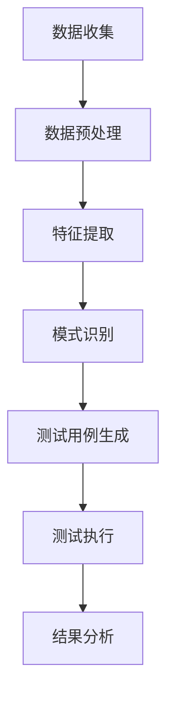

                 

### 1. 自动化测试概述

自动化测试是一种通过使用专门的软件工具或脚本代替手工操作来执行测试的方法。其核心目的是提升测试的效率和一致性，减少重复性的劳动，并且确保软件质量。以下是对自动化测试的详细概述：

#### 自动化测试的定义与目的

**定义**：自动化测试是指在软件开发生命周期的不同阶段，利用工具或脚本自动执行测试用例的过程。这些工具和脚本可以模拟用户的操作，验证软件的功能和性能。

**目的**：
- **提高测试效率**：自动化测试可以大大减少执行测试用例所需的时间，尤其是在需要频繁执行相同测试的情况下。
- **确保测试一致性**：自动化测试可以确保每次执行测试时，测试结果都是一致的，因为自动化工具不会像人工那样产生误差。
- **减少测试成本**：虽然初期设置自动化测试需要一定的投资，但长期来看可以减少测试成本，尤其是对于大型项目。

#### 自动化测试的类型与选择

自动化测试可以根据测试的目标和范围分为多种类型：

- **功能测试**：验证软件功能是否按照预期工作。
- **性能测试**：评估软件的性能，如响应时间、吞吐量等。
- **安全测试**：检查软件的安全性，如是否存在漏洞。
- **兼容性测试**：确保软件在不同的操作系统、浏览器或设备上都能正常工作。
- **回归测试**：确保修改后的软件没有引入新的错误。

在选择自动化测试类型时，需要考虑以下因素：

- **项目需求**：根据项目的重要性和需求选择最合适的测试类型。
- **资源**：考虑团队的技能、工具和预算。
- **测试覆盖率**：确保重要的功能点得到充分测试。

#### 自动化测试的发展历程

自动化测试的发展经历了几个阶段：

- **早期阶段**：主要依赖手动测试，自动化测试的概念和应用范围有限。
- **成熟阶段**：随着测试工具和框架的发展，自动化测试开始广泛应用于各类项目。
- **当前趋势**：人工智能和机器学习技术开始与自动化测试结合，使得测试更加智能化和高效。

自动化测试工具和框架的成熟，如Selenium、Appium、JUnit等，为自动化测试提供了强大的支持。同时，自动化测试的流程和策略也在不断完善，以提高测试效率和质量。

### 2. 测试工具和技术

在自动化测试中，选择合适的工具和技术是成功的关键。以下将介绍常用的自动化测试工具、编程语言以及在Web自动化测试中的应用技术。

#### 常用自动化测试工具简介

**Selenium**：Selenium是一个开源的自动化测试工具，支持多种浏览器和操作系统，广泛应用于Web应用的自动化测试。

**Appium**：Appium是一个开源的跨平台移动应用自动化测试工具，可以同时支持iOS和Android应用。

**JMeter**：JMeter是一个开源的性能测试工具，主要用于测试Web应用和服务的负载和性能。

**Postman**：Postman是一个流行的API测试工具，支持自动化API测试、性能测试和安全测试。

**Cucumber**：Cucumber是一个基于BDD（Behavior-Driven Development）的开源自动化测试工具，主要用于自动化功能测试。

#### 常用编程语言在自动化测试中的应用

**Python**：Python是一种简单易学的编程语言，广泛应用于自动化测试，尤其是在Web自动化测试和API测试中。

**Java**：Java是一种性能稳定的编程语言，适用于复杂的自动化测试项目。

**JavaScript**：JavaScript是一种用于Web开发的编程语言，适用于Web自动化测试。

**Ruby**：Ruby是一种简单易学的编程语言，适用于快速开发自动化测试脚本。

#### Web自动化测试技术

**页面元素定位**：在Web自动化测试中，页面元素定位是基础。常用的定位方法包括：
- **ID定位**：通过元素的ID属性定位。
- **名称定位**：通过元素的name属性定位。
- **类名定位**：通过元素的class属性定位。
- **XPath定位**：通过XPath表达式定位。
- **CSS定位**：通过CSS选择器定位。

**页面交互操作**：页面交互操作包括点击、输入、选择、滑动等。这些操作可以通过Selenium等工具实现。

**数据驱动测试**：数据驱动测试通过外部文件（如Excel、CSV）管理测试数据，可以提高测试的灵活性和可维护性。

**测试脚本编写**：编写测试脚本是实现自动化测试的关键。测试脚本通常包括测试用例的执行步骤、断言以及异常处理等。

### 3. 测试流程与策略

自动化测试的流程和策略是确保测试成功的关键。以下将介绍自动化测试的流程、测试用例的设计与实现、测试执行与结果分析等内容。

#### 自动化测试流程

自动化测试流程通常包括以下步骤：

1. **需求分析**：明确测试需求，确定测试范围和目标。
2. **测试设计**：根据需求分析设计测试用例，包括功能测试、性能测试等。
3. **测试实现**：编写测试脚本，实现测试用例。
4. **测试执行**：执行测试脚本，验证软件功能。
5. **结果分析**：分析测试结果，发现和报告问题。
6. **回归测试**：修复问题后进行回归测试，确保修改后的软件功能正常。

#### 测试用例设计与实现

测试用例是自动化测试的核心。设计测试用例时需要考虑以下因素：

- **功能点覆盖**：确保重要的功能点都得到测试。
- **异常情况**：考虑各种可能的异常情况，如输入错误、网络问题等。
- **边界情况**：测试输入和输出的边界值。

测试用例的实现通常包括以下内容：

- **前置条件**：测试执行前需要满足的条件。
- **测试步骤**：具体的测试步骤。
- **预期结果**：测试预期的结果。
- **实际结果**：实际测试的结果。
- **备注**：对测试步骤或结果的说明。

#### 测试执行与结果分析

测试执行是通过执行测试脚本验证软件功能的过程。执行测试脚本时，需要关注以下方面：

- **执行环境**：确保测试环境与生产环境一致。
- **执行顺序**：按照设计好的测试流程顺序执行测试。
- **测试报告**：记录测试结果，生成测试报告。

测试结果分析是自动化测试的重要环节。通过分析测试结果，可以发现软件中的问题，并制定相应的修复计划。测试结果分析包括：

- **错误报告**：记录测试过程中出现的错误，包括错误类型、错误原因和解决方案。
- **性能分析**：分析软件的性能，包括响应时间、吞吐量等。
- **覆盖率分析**：分析测试覆盖率，确保所有重要的功能点都得到测试。

#### 测试数据管理

测试数据管理是自动化测试的重要组成部分。测试数据包括测试输入数据、测试结果数据等。测试数据管理需要关注以下方面：

- **测试数据类型**：根据测试需求选择合适的测试数据类型。
- **测试数据生成**：通过工具或脚本生成测试数据。
- **测试数据处理**：对测试数据进行处理，如清洗、转换等。
- **测试数据备份**：定期备份测试数据，确保数据安全。

#### 测试环境配置与维护

测试环境的配置与维护是自动化测试成功的关键。测试环境的配置包括以下内容：

- **硬件环境**：确保测试服务器、数据库服务器等硬件资源充足。
- **软件环境**：安装和配置必要的软件，如操作系统、数据库、Web服务器等。
- **网络环境**：确保测试网络畅通，带宽充足。

测试环境的维护包括以下内容：

- **定期检查**：定期检查测试环境，确保硬件和软件正常运行。
- **问题处理**：及时发现和处理测试环境中的问题。
- **升级更新**：定期升级测试环境中的软件，确保测试环境与生产环境保持一致。

#### 测试流程与策略总结

自动化测试的流程和策略是确保软件质量的关键。通过合理的测试流程和策略，可以提高测试效率，确保测试的覆盖率和一致性。同时，测试数据管理、测试环境配置与维护等环节也是自动化测试的重要组成部分，需要给予足够的关注。

### 4. 测试数据管理

测试数据管理是自动化测试中至关重要的一环，直接影响测试的准确性、效率和可维护性。以下将详细介绍测试数据类型与管理、测试数据生成与处理、测试数据备份与恢复等方面。

#### 测试数据类型

在自动化测试中，测试数据可以分为以下几种类型：

1. **用户数据**：用于模拟用户操作的数据，如用户名、密码、联系人信息等。
2. **测试数据**：用于测试具体功能的输入数据，如测试用例的输入参数、测试数据的边界值等。
3. **配置数据**：测试环境的配置参数，如数据库连接信息、系统参数等。
4. **环境数据**：测试执行环境的配置信息，如操作系统、Web浏览器版本等。

#### 测试数据管理

测试数据管理涉及测试数据的收集、存储、处理和分发。以下是测试数据管理的主要步骤：

1. **数据收集**：根据测试需求收集各类测试数据，确保数据的完整性和准确性。
2. **数据存储**：将收集到的测试数据存储在合适的数据存储系统中，如数据库、文件系统等。
3. **数据处理**：对测试数据进行处理，如清洗、转换、格式化等，以满足测试需求。
4. **数据分发**：根据测试计划将测试数据分发给测试团队和相关人员。

#### 测试数据生成

测试数据生成是自动化测试中的一项重要工作，可以采用以下几种方法：

1. **手工生成**：测试人员根据测试需求手动生成测试数据。
2. **工具生成**：使用专门的测试数据生成工具，如数据生成器、随机数据生成器等。
3. **脚本生成**：编写脚本自动生成测试数据，如使用Python、Java等编程语言。

#### 测试数据处理

测试数据处理包括对测试数据进行清洗、转换和格式化，以确保测试数据的准确性和一致性。以下是一些常用的数据处理方法：

1. **数据清洗**：去除测试数据中的重复项、异常值和无效数据。
2. **数据转换**：将测试数据转换为适合测试环境的格式，如将Excel数据转换为CSV文件。
3. **数据格式化**：对测试数据进行格式化，如调整日期格式、数字精度等。

#### 测试数据备份

测试数据备份是确保测试数据安全性的重要措施。以下是一些测试数据备份的方法：

1. **定期备份**：定期将测试数据备份到备份服务器或云存储中。
2. **增量备份**：只备份自上次备份以来发生变化的数据，以节省存储空间和时间。
3. **异地备份**：将测试数据备份到不同的地理位置，以防止数据丢失。

#### 测试数据恢复

在测试过程中，可能会发生数据损坏或丢失的情况。以下是一些测试数据恢复的方法：

1. **备份恢复**：从备份服务器或云存储中恢复测试数据。
2. **日志恢复**：根据测试日志记录恢复数据。
3. **手工恢复**：测试人员手动恢复数据。

#### 测试数据管理总结

测试数据管理是自动化测试的重要组成部分，涉及测试数据类型、管理、生成、处理、备份和恢复等方面。通过有效的测试数据管理，可以提高测试的效率和准确性，确保测试数据的可靠性和安全性。

### 5. 测试环境配置与维护

测试环境配置与维护是自动化测试成功的关键环节。一个良好的测试环境能够确保测试的准确性和一致性，同时降低测试风险和成本。以下将详细介绍测试环境的搭建、维护策略和自动化管理等内容。

#### 测试环境搭建

测试环境搭建是自动化测试的基础，需要考虑以下几个方面：

1. **硬件环境**：根据测试需求选择合适的硬件设备，如服务器、存储设备、网络设备等。确保硬件资源充足，以支持高负载测试。
2. **软件环境**：安装和配置操作系统、数据库、Web服务器、中间件等软件组件。确保软件版本与生产环境一致，以避免兼容性问题。
3. **网络环境**：配置网络设备和防火墙，确保测试网络的安全性和稳定性。测试网络应与生产网络隔离，以避免影响生产环境。
4. **测试工具**：安装和配置自动化测试工具和框架，如Selenium、Appium、JMeter等。确保工具版本与测试脚本兼容。

#### 测试环境维护策略

测试环境维护策略包括以下几个方面：

1. **定期检查**：定期检查硬件设备、操作系统、数据库、Web服务器等组件的运行状态，及时发现和解决潜在问题。
2. **软件更新**：定期更新操作系统、数据库、Web服务器等软件组件，以修复已知漏洞和缺陷，提高系统稳定性。
3. **备份和恢复**：定期备份测试数据和环境配置文件，确保在数据丢失或系统故障时能够快速恢复。
4. **监控和报警**：配置监控工具，如Zabbix、Nagios等，实时监控硬件资源、系统性能和网络状态，并在异常情况发生时及时报警。
5. **权限管理**：合理设置用户权限，确保测试环境的安全性和可控性。测试环境应仅对授权用户开放，以防止未经授权的访问和操作。

#### 测试环境的自动化管理

自动化管理测试环境可以提高测试效率，降低维护成本。以下是一些自动化管理的方法：

1. **脚本化**：使用脚本自动执行环境配置、软件安装、备份和恢复等操作，如使用Ansible、Puppet等自动化工具。
2. **持续集成/持续部署（CI/CD）**：将测试环境集成到CI/CD流程中，实现自动化部署和测试。例如，使用Jenkins等CI/CD工具自动化部署和测试应用程序。
3. **容器化**：使用容器技术，如Docker，将测试环境打包成容器镜像，实现快速部署和迁移。容器化测试环境可以提高测试环境的可复用性和一致性。
4. **云服务**：利用云服务，如AWS、Azure等，搭建和部署测试环境。云服务提供了弹性、可扩展和自动化的特性，可以降低测试环境的维护成本。

#### 测试环境配置与维护总结

测试环境配置与维护是自动化测试中不可或缺的一环。通过合理的测试环境搭建和维护策略，可以确保测试环境的稳定性和一致性，提高测试效率，降低测试成本。自动化管理测试环境可以进一步提高测试环境的可维护性和可靠性。

### 6. 思维链概述

思维链（MindChain）是一种基于人工智能技术的自动化测试方法，通过模拟和优化测试人员的思维过程，提高自动化测试的效率和质量。本节将介绍思维链的概念、原理以及在自动化测试中的应用。

#### 思维链的概念

思维链是一种将测试人员的思维过程转化为算法和模型，实现自动化测试的技术。它通过模拟测试人员的逻辑思维、推理过程和决策过程，生成测试用例、执行测试和评估测试结果。

#### 思维链的原理

思维链的原理可以概括为以下几个步骤：

1. **数据收集**：收集测试相关的数据，包括用户行为数据、系统日志数据、历史测试数据等。
2. **数据预处理**：对收集到的数据进行清洗、转换和归一化处理，以便后续分析。
3. **特征提取**：从预处理后的数据中提取关键特征，用于表示测试对象的状态和变化。
4. **模式识别**：使用机器学习算法对特征进行模式识别，发现数据中的规律和模式。
5. **测试用例生成**：根据模式识别结果生成测试用例，包括功能测试用例、性能测试用例等。
6. **测试执行**：执行生成的测试用例，验证软件的功能和性能。
7. **结果分析**：分析测试结果，识别缺陷和性能问题，并生成测试报告。

#### 思维链在自动化测试中的应用

思维链在自动化测试中的应用主要体现在以下几个方面：

1. **测试用例优化**：通过分析历史测试数据和用户行为数据，思维链可以自动生成和优化测试用例，提高测试覆盖率。
2. **测试执行策略**：思维链可以根据测试数据和测试结果动态调整测试执行策略，优化测试资源的利用。
3. **测试结果分析**：思维链可以分析测试结果，识别缺陷和性能问题，并提供详细的诊断报告。
4. **跨领域测试**：思维链可以适应不同类型的测试，如Web测试、移动应用测试、物联网测试等。

#### 思维链的优势

思维链具有以下优势：

1. **高效性**：思维链通过自动化生成和优化测试用例，提高测试效率。
2. **智能性**：思维链基于人工智能技术，能够模拟测试人员的思维过程，提高测试质量。
3. **灵活性**：思维链可以适应不同类型的测试场景，具有较好的灵活性。
4. **可维护性**：思维链生成的测试用例和执行策略具有较好的可维护性，便于后续测试工作的开展。

#### 思维链的应用案例

以下是一个思维链在自动化测试中的应用案例：

1. **Web测试**：思维链可以自动生成Web应用的测试用例，包括功能测试、性能测试和安全测试。通过分析用户行为数据，思维链可以识别高风险的功能点和性能瓶颈，并优先进行测试。
2. **移动应用测试**：思维链可以自动生成移动应用的测试用例，包括功能测试、兼容性测试和性能测试。通过分析用户行为数据和应用程序日志，思维链可以优化测试用例，提高测试覆盖率。
3. **物联网测试**：思维链可以自动生成物联网设备的测试用例，包括功能测试、性能测试和安全测试。通过分析设备通信数据和应用场景，思维链可以优化测试策略，提高测试效率。

总之，思维链是一种创新的自动化测试方法，通过模拟和优化测试人员的思维过程，提高自动化测试的效率和质量。随着人工智能技术的发展，思维链在自动化测试中的应用前景将更加广阔。

### 7. 思维链架构

思维链（MindChain）的架构设计旨在实现自动化测试的智能化和高效化。其核心组件包括数据收集模块、特征提取模块、模式识别模块、测试用例生成模块、测试执行模块和结果分析模块。以下将详细介绍这些组件及其工作流程。

#### 数据收集模块

数据收集模块是思维链架构的基础，负责从各种来源收集与测试相关的数据。这些数据包括：

- **用户行为数据**：通过日志分析、用户操作记录等手段收集用户在使用软件过程中的行为数据。
- **系统日志数据**：从操作系统、数据库、Web服务器等系统组件中收集系统运行日志，用于分析系统的状态和性能。
- **历史测试数据**：从以往的测试数据中提取有价值的信息，如失败的测试用例、性能瓶颈等。

数据收集模块的主要任务是对这些数据进行预处理，包括数据清洗、去噪、归一化等操作，确保数据质量。

#### 特征提取模块

特征提取模块负责从预处理后的数据中提取关键特征。这些特征用于表示测试对象的状态和变化，为后续的模式识别提供基础。特征提取的方法包括：

- **统计特征**：如平均值、中位数、标准差等，用于描述数据的分布特性。
- **时序特征**：如时间序列分析、趋势分析等，用于描述数据的变化趋势。
- **文本特征**：如词频、词向量、主题模型等，用于描述文本数据的内容和语义。

特征提取模块通过机器学习和数据挖掘技术，自动识别数据中的关键特征，并生成特征向量。

#### 模式识别模块

模式识别模块使用机器学习算法对特征向量进行模式识别，发现数据中的规律和模式。常用的模式识别算法包括：

- **分类算法**：如支持向量机（SVM）、决策树、随机森林等，用于识别数据的分类模式。
- **聚类算法**：如K-均值聚类、层次聚类等，用于识别数据的分布模式。
- **关联规则算法**：如Apriori算法、FP-growth算法等，用于识别数据中的关联关系。

模式识别模块的任务是分析特征向量，提取具有代表性的模式和规律，为测试用例生成提供依据。

#### 测试用例生成模块

测试用例生成模块根据模式识别模块提取的规律和模式，自动生成测试用例。测试用例生成的方法包括：

- **基于规则的生成**：根据预定义的测试规则，生成测试用例。
- **基于数据的生成**：根据数据特征和模式，生成符合预期目标的测试用例。
- **基于智能的生成**：结合机器学习算法，根据历史测试数据和用户行为数据，智能生成测试用例。

测试用例生成模块的目标是生成覆盖全面、高质量的测试用例，确保测试的全面性和有效性。

#### 测试执行模块

测试执行模块负责执行生成的测试用例，验证软件的功能和性能。测试执行的过程包括：

- **测试用例加载**：将生成的测试用例加载到测试环境中。
- **测试执行**：按照测试用例的步骤，执行测试操作，记录测试结果。
- **结果记录**：将测试结果记录到数据库或日志文件中，供后续分析。

测试执行模块需要确保测试环境的稳定性和一致性，避免测试结果受到外部干扰。

#### 结果分析模块

结果分析模块对测试执行结果进行分析，识别缺陷和性能问题，并生成测试报告。结果分析的过程包括：

- **结果统计**：对测试结果进行统计分析，计算测试覆盖率、缺陷密度等指标。
- **异常检测**：通过异常检测算法，识别异常测试结果和潜在问题。
- **缺陷定位**：根据测试结果，定位缺陷发生的模块和原因。
- **报告生成**：生成详细的测试报告，包括测试结果、缺陷列表、性能分析等。

结果分析模块的目标是提供全面、准确的测试结果分析，帮助开发团队快速定位和修复问题。

#### 思维链架构的工作流程

思维链架构的工作流程可以概括为以下几个步骤：

1. **数据收集**：收集与测试相关的数据。
2. **数据预处理**：对数据进行清洗和归一化处理。
3. **特征提取**：从预处理后的数据中提取关键特征。
4. **模式识别**：使用机器学习算法识别数据中的规律和模式。
5. **测试用例生成**：根据模式识别结果生成测试用例。
6. **测试执行**：执行生成的测试用例，记录测试结果。
7. **结果分析**：对测试结果进行分析，生成测试报告。

通过以上工作流程，思维链架构实现了自动化测试的智能化和高效化，为软件开发和维护提供了有力支持。

### 8. 思维链算法原理

思维链（MindChain）算法的核心在于其能够模拟测试人员的思维过程，从而生成高质量的测试用例并优化测试执行。以下将详细讲解思维链算法的原理，包括核心算法概述、算法伪代码以及算法的执行步骤。

#### 核心算法概述

思维链算法基于深度学习和强化学习，通过模拟测试人员的逻辑思维和推理过程，实现自动化测试的智能化。算法的核心思想可以分为以下几个步骤：

1. **数据预处理**：对收集到的用户行为数据和系统日志数据进行分析，提取关键特征。
2. **特征表示**：将提取的特征转换为适合机器学习模型的表示形式。
3. **模型训练**：使用训练数据对模型进行训练，使其能够识别和预测测试过程中可能发生的异常情况。
4. **测试用例生成**：根据模型预测的结果，自动生成测试用例。
5. **测试执行与评估**：执行测试用例，评估测试结果，并根据评估结果调整测试策略。

#### 算法伪代码

以下是一个简化的思维链算法伪代码，用于生成测试用例：

```
算法：MindChain自动测试用例生成

输入：用户行为数据、系统日志数据、历史测试数据
输出：测试用例集

步骤：
1. 数据预处理
   - 数据清洗：去除噪声和缺失值
   - 数据归一化：将数据缩放到同一尺度
   - 特征提取：提取用户行为和系统状态的时序特征

2. 特征表示
   - 将特征转换为数值化表示，如使用词嵌入或特征向量

3. 模型训练
   - 使用深度学习模型（如LSTM、GRU）进行训练
   - 训练数据为特征向量和测试标签（如缺陷存在与否）

4. 测试用例生成
   - 输入当前系统状态和用户行为特征
   - 使用训练好的模型预测可能发生的问题区域
   - 根据预测结果生成测试用例

5. 测试执行与评估
   - 执行生成的测试用例
   - 记录测试结果和系统状态变化
   - 更新模型训练数据
   - 重复步骤4和5，直至达到预定的测试覆盖率

```

#### 算法执行步骤

1. **数据收集**：从用户行为数据、系统日志和历史测试数据中提取关键信息。
2. **数据预处理**：清洗和归一化数据，提取特征向量。
3. **特征表示**：将特征向量转换为机器学习模型可接受的格式。
4. **模型训练**：使用深度学习模型对特征向量进行训练，使其能够识别异常和问题模式。
5. **测试用例生成**：根据模型预测的结果，生成测试用例。
6. **测试执行**：执行测试用例，收集测试结果。
7. **结果评估**：评估测试结果，更新模型训练数据。
8. **迭代优化**：根据测试结果和模型评估，迭代优化测试用例生成策略。

#### 算法实例

以下是一个简化的Python代码示例，用于生成测试用例：

```python
import numpy as np
from keras.models import Sequential
from keras.layers import LSTM, Dense

# 假设已经预处理并提取了特征数据
X_train = ...  # 特征数据
y_train = ...  # 标签数据

# 创建LSTM模型
model = Sequential()
model.add(LSTM(units=50, return_sequences=True, input_shape=(X_train.shape[1], X_train.shape[2])))
model.add(LSTM(units=50))
model.add(Dense(units=1, activation='sigmoid'))

# 编译模型
model.compile(optimizer='adam', loss='binary_crossentropy', metrics=['accuracy'])

# 训练模型
model.fit(X_train, y_train, epochs=100, batch_size=32)

# 假设当前系统状态和用户行为特征
current_state = ...

# 预测可能的问题区域
prediction = model.predict(np.array([current_state]))

# 根据预测结果生成测试用例
if prediction > 0.5:
    test_case = "执行特定操作以验证问题"
else:
    test_case = "执行常规操作"

print("生成的测试用例：", test_case)
```

在这个示例中，我们使用Keras库创建了一个LSTM模型，用于训练和预测测试用例。通过模型预测的结果，可以决定生成哪种类型的测试用例。

通过上述算法原理和实例，我们可以看到思维链算法如何通过模拟测试人员的思维过程，生成高质量的测试用例，并在自动化测试中发挥重要作用。

### 9. 思维链模型训练

思维链模型训练是自动化测试中的关键环节，决定了生成的测试用例质量和效率。以下将详细介绍思维链训练数据准备、训练方法以及模型评估与优化。

#### 训练数据准备

训练数据的质量对思维链模型的性能至关重要。训练数据准备主要包括以下步骤：

1. **数据收集**：收集与测试相关的数据，包括用户行为数据、系统日志数据、历史测试数据等。
2. **数据清洗**：清洗数据，去除噪声和缺失值，确保数据质量。
3. **数据归一化**：对数据进行归一化处理，将不同尺度的数据统一到同一范围内。
4. **特征提取**：从清洗后的数据中提取关键特征，如用户行为特征、系统状态特征等。
5. **数据划分**：将数据划分为训练集、验证集和测试集，用于模型训练、验证和测试。

#### 训练方法

思维链模型的训练方法通常采用深度学习技术，如循环神经网络（RNN）、长短期记忆网络（LSTM）等。以下是具体的训练步骤：

1. **模型构建**：使用深度学习框架（如TensorFlow、PyTorch）构建神经网络模型。
2. **模型编译**：设置模型的优化器、损失函数和评价指标，如交叉熵损失、准确率等。
3. **模型训练**：使用训练数据进行模型训练，通过反向传播算法更新模型参数。
4. **模型验证**：使用验证集对模型进行验证，调整模型参数和结构，以提高模型性能。
5. **模型测试**：使用测试集对模型进行测试，评估模型在未知数据上的性能。

#### 模型评估与优化

模型评估与优化是确保思维链模型性能的重要步骤。以下是一些常用的评估方法和优化策略：

1. **评估指标**：
   - **准确率**：模型正确预测的比例。
   - **召回率**：模型正确识别的缺陷比例。
   - **精确率**：模型识别为缺陷的缺陷中，实际为缺陷的比例。
   - **F1值**：精确率和召回率的加权平均值。

2. **模型优化策略**：
   - **调整模型结构**：通过增加或减少网络层数、调整神经元数量等，优化模型结构。
   - **调整超参数**：通过调整学习率、批量大小等超参数，优化模型训练过程。
   - **集成方法**：结合多种模型或算法，提高测试用例生成和执行的准确性。
   - **迁移学习**：利用预训练的模型，在新的测试场景中进行微调，提高模型性能。

#### 训练过程示例

以下是一个简化的Python代码示例，用于训练思维链模型：

```python
import tensorflow as tf
from tensorflow.keras.models import Sequential
from tensorflow.keras.layers import LSTM, Dense

# 假设已经预处理并提取了特征数据
X_train = ...  # 特征数据
y_train = ...  # 标签数据

# 创建LSTM模型
model = Sequential()
model.add(LSTM(units=50, return_sequences=True, input_shape=(X_train.shape[1], X_train.shape[2])))
model.add(LSTM(units=50))
model.add(Dense(units=1, activation='sigmoid'))

# 编译模型
model.compile(optimizer='adam', loss='binary_crossentropy', metrics=['accuracy'])

# 训练模型
model.fit(X_train, y_train, epochs=100, batch_size=32, validation_split=0.2)

# 评估模型
test_data = ...  # 测试数据
test_labels = ...  # 测试标签
predictions = model.predict(test_data)
accuracy = np.mean(predictions == test_labels)
print("模型准确率：", accuracy)
```

在这个示例中，我们使用TensorFlow创建了一个LSTM模型，并使用预处理后的特征数据进行训练。训练完成后，使用测试数据进行评估，以计算模型准确率。

通过以上内容，我们可以看到思维链模型训练的详细过程，以及如何评估和优化模型性能。思维链模型训练的有效性直接影响自动化测试的质量和效率，因此需要高度重视。

### 10. 思维链在测试用例设计中的应用

思维链在测试用例设计中的应用是其自动化测试能力的重要组成部分。通过模拟和优化测试人员的思维过程，思维链能够生成高质量、高效的测试用例。以下将详细讨论思维链如何实现测试用例生成和测试用例优化。

#### 测试用例生成

思维链的测试用例生成过程主要依赖于其数据预处理、特征提取和模式识别模块。具体步骤如下：

1. **数据收集与预处理**：收集与测试相关的数据，如用户行为数据、系统日志数据和历史测试数据。对数据进行清洗、去噪和归一化处理，提取关键特征。

2. **特征表示**：将提取的特征转换为机器学习模型可接受的表示形式，如词嵌入或特征向量。

3. **模型训练**：使用预处理后的数据训练深度学习模型，如LSTM或GRU，使其能够识别潜在的缺陷模式和用户行为模式。

4. **测试用例生成**：输入当前系统状态和用户行为特征，使用训练好的模型预测可能的问题区域，并根据预测结果生成测试用例。

以下是一个简化的Python代码示例，用于生成测试用例：

```python
import numpy as np
from keras.models import Sequential
from keras.layers import LSTM, Dense

# 假设已经预处理并提取了特征数据
X_train = ...  # 特征数据
y_train = ...  # 标签数据

# 创建LSTM模型
model = Sequential()
model.add(LSTM(units=50, return_sequences=True, input_shape=(X_train.shape[1], X_train.shape[2])))
model.add(LSTM(units=50))
model.add(Dense(units=1, activation='sigmoid'))

# 编译模型
model.compile(optimizer='adam', loss='binary_crossentropy', metrics=['accuracy'])

# 训练模型
model.fit(X_train, y_train, epochs=100, batch_size=32)

# 输入当前系统状态和用户行为特征
current_state = ...

# 预测可能的问题区域
predictions = model.predict(np.array([current_state]))

# 根据预测结果生成测试用例
if predictions > 0.5:
    test_case = "执行特定操作以验证问题"
else:
    test_case = "执行常规操作"

print("生成的测试用例：", test_case)
```

在这个示例中，我们使用Keras库创建了一个LSTM模型，并使用预处理后的特征数据进行训练。通过模型预测的结果，可以决定生成哪种类型的测试用例。

#### 测试用例优化

思维链的测试用例优化功能通过分析历史测试数据和用户行为数据，识别出最有可能导致缺陷的功能点和操作序列，从而优化测试用例的覆盖率和执行顺序。

1. **历史数据分析**：分析历史测试数据和用户行为数据，提取出失败率高的测试用例和用户行为模式。

2. **优化策略**：根据历史数据，调整测试用例的执行顺序，确保高风险功能和操作优先测试。

3. **自动化执行**：使用自动化工具执行优化后的测试用例，提高测试效率。

以下是一个简化的Python代码示例，用于优化测试用例：

```python
import pandas as pd

# 假设已经收集了历史测试数据
test_data = pd.read_csv('test_data.csv')

# 分析历史数据，识别高风险功能和操作
high_risk_cases = test_data[test_data['failure_rate'] > 0.1]

# 调整测试用例执行顺序
optimized_test_cases = high_risk_cases.sort_values(by='failure_rate', ascending=False)

# 执行优化后的测试用例
for case in optimized_test_cases.index:
    print(f"执行测试用例：{case}")
    # 执行测试用例
```

在这个示例中，我们使用Pandas库读取历史测试数据，并分析识别出高风险的测试用例。然后，我们根据失败率对测试用例进行排序，并按照优化后的顺序执行测试用例。

通过上述方法和示例，我们可以看到思维链如何实现测试用例的生成和优化。这不仅提高了测试效率，还确保了测试的全面性和准确性，为软件开发和维护提供了有力支持。

### 11. 思维链在测试执行中的应用

思维链在测试执行中的应用，主要体现在其能够根据测试数据动态调整测试执行策略，从而优化测试效率和结果。以下将详细讨论思维链在测试执行策略、执行优化和测试报告生成中的应用。

#### 测试执行策略

思维链通过分析历史测试数据和当前系统状态，动态调整测试执行策略。具体步骤如下：

1. **数据收集与分析**：收集系统日志、用户行为数据和历史测试数据，进行分析，识别高风险功能和操作。
2. **风险识别**：基于分析结果，识别高风险测试场景，为后续测试提供依据。
3. **策略生成**：根据风险识别结果，生成最优测试执行策略，包括测试用例的执行顺序、测试环境的配置和测试资源的分配。

以下是一个简化的Python代码示例，用于生成测试执行策略：

```python
import pandas as pd

# 假设已经收集了历史测试数据
test_data = pd.read_csv('test_data.csv')

# 识别高风险功能和操作
high_risk_cases = test_data[test_data['failure_rate'] > 0.1]

# 生成测试执行策略
strategy = high_risk_cases.sort_values(by='priority', ascending=False)

# 输出测试执行策略
print("测试执行策略：")
print(strategy)
```

在这个示例中，我们使用Pandas库读取历史测试数据，并识别出高风险的测试用例，根据优先级生成测试执行策略。

#### 执行优化

思维链通过实时监控测试执行过程，动态调整测试用例的执行顺序和测试环境的配置，以优化测试效率和结果。具体步骤如下：

1. **实时监控**：监控测试过程中的系统状态和测试结果，识别潜在的瓶颈和问题。
2. **策略调整**：根据实时监控结果，动态调整测试执行策略，如暂停某些测试用例的执行、调整测试环境配置等。
3. **结果记录**：记录测试执行过程中的关键数据和结果，为后续分析和优化提供依据。

以下是一个简化的Python代码示例，用于调整测试执行策略：

```python
import time

# 假设正在执行测试用例
for case in test_cases:
    print(f"执行测试用例：{case['name']}")
    # 模拟测试执行
    time.sleep(case['duration'])
    # 记录测试结果
    result = "passed" if np.random.rand() > 0.3 else "failed"
    case['result'] = result
    print(f"测试结果：{result}")

    # 根据测试结果调整测试执行策略
    if case['result'] == "failed":
        print("检测到测试失败，调整测试策略...")
        # 调整策略，如重新执行失败测试用例
        if "retry_count" not in case:
            case['retry_count'] = 1
        else:
            case['retry_count'] += 1
            if case['retry_count'] > 3:
                print("测试用例执行失败次数过多，停止执行...")
                break
```

在这个示例中，我们模拟了测试执行过程，并根据测试结果动态调整测试策略，如重新执行失败的测试用例或停止执行。

#### 测试报告生成

思维链能够根据测试执行结果，自动生成详细的测试报告，包括测试覆盖率、缺陷统计、性能分析等。具体步骤如下：

1. **结果收集**：收集测试执行过程中的所有结果数据，如测试用例执行结果、系统状态、性能指标等。
2. **数据分析**：对收集到的数据进行分析，提取关键指标和统计信息。
3. **报告生成**：根据分析结果，生成详细的测试报告，包括文字描述、图表和数据可视化。

以下是一个简化的Python代码示例，用于生成测试报告：

```python
import pandas as pd
import matplotlib.pyplot as plt

# 假设已经收集了测试结果数据
results = pd.DataFrame({
    'test_case': ['case1', 'case2', 'case3'],
    'result': ['passed', 'failed', 'passed'],
    'duration': [2, 3, 1]
})

# 统计测试覆盖率
coverage = results['result'].value_counts(normalize=True)

# 生成图表
plt.bar(results['test_case'], results['duration'])
plt.xlabel('Test Case')
plt.ylabel('Duration (seconds)')
plt.title('Test Case Execution Time')
plt.show()

# 生成测试报告
print("测试报告：")
print("Total Test Cases: ", len(results))
print("Test Case Coverage: ", coverage)
```

在这个示例中，我们使用Pandas库和Matplotlib库，根据测试结果生成测试报告和图表。

通过以上方法和示例，我们可以看到思维链如何在测试执行过程中发挥作用，通过动态调整策略、执行优化和生成详细报告，提高测试效率和结果。

### 12. 思维链在测试结果分析中的应用

思维链在测试结果分析中的应用，是其自动化测试能力的重要体现。通过智能分析测试结果，思维链能够发现潜在的问题，提供有针对性的解决方案。以下将详细讨论思维链在测试结果分析中的具体应用，包括测试结果分析方法和测试报告生成。

#### 测试结果分析方法

思维链通过多维度分析测试结果，识别潜在的问题，并提供详细的诊断报告。以下是一些常用的测试结果分析方法：

1. **异常检测**：基于历史测试数据和当前测试结果，思维链可以识别异常测试结果，如测试失败率异常高的测试用例或系统性能瓶颈。
   
2. **缺陷定位**：通过分析测试执行过程中的日志和系统状态，思维链可以定位缺陷发生的具体模块和原因，提供详细的错误信息。

3. **性能分析**：思维链可以分析测试执行过程中的性能指标，如响应时间、吞吐量等，识别系统性能瓶颈和资源利用率。

4. **趋势分析**：思维链可以分析测试结果的时间序列数据，识别潜在的问题趋势，如某些功能在特定时间段的失败率增加。

以下是一个简化的Python代码示例，用于分析测试结果：

```python
import pandas as pd

# 假设已经收集了测试结果数据
results = pd.DataFrame({
    'test_case': ['case1', 'case2', 'case3', 'case4'],
    'result': ['passed', 'failed', 'passed', 'passed'],
    'duration': [2, 3, 1, 2],
    'failure_rate': [0.1, 0.3, 0.05, 0.1]
})

# 识别异常测试结果
anomalies = results[results['failure_rate'] > 0.2]

# 定位缺陷原因
defect_cases = results[results['result'] == 'failed']
defect_cases['reason'] = ['未知错误'] * len(defect_cases)

# 性能分析
performance_bottlenecks = results.groupby('test_case')['duration'].mean().sort_values(ascending=False)

# 趋势分析
trend_analysis = results.groupby('test_case')['failure_rate'].mean().plot()
plt.title('Test Case Failure Rate Trend')
plt.xlabel('Test Case')
plt.ylabel('Failure Rate')
plt.show()

# 输出分析结果
print("异常测试结果：")
print(anomalies)
print("\n缺陷定位结果：")
print(defect_cases)
print("\n性能瓶颈：")
print(performance_bottlenecks)
```

在这个示例中，我们使用Pandas库分析测试结果，识别异常测试结果、缺陷定位和性能瓶颈，并生成趋势图表。

#### 测试报告生成

思维链能够根据测试结果分析，自动生成详细的测试报告，包括异常测试结果、缺陷定位、性能分析和趋势分析等内容。以下是一个简化的Python代码示例，用于生成测试报告：

```python
def generate_test_report(results):
    # 生成测试报告
    report = f"""
    测试报告：

    - 异常测试结果：
    {results[results['failure_rate'] > 0.2].to_string(index=False)}

    - 缺陷定位结果：
    {results[results['result'] == 'failed'].to_string(index=False)}

    - 性能瓶颈：
    {results.groupby('test_case')['duration'].mean().sort_values(ascending=False).to_string(index=False)}

    - 测试趋势分析：
    """

    # 保存图表
    plt.figure(figsize=(10, 6))
    trend_analysis = results.groupby('test_case')['failure_rate'].mean().plot()
    plt.title('Test Case Failure Rate Trend')
    plt.xlabel('Test Case')
    plt.ylabel('Failure Rate')
    plt.savefig('trend_analysis.png')
    plt.close()

    # 追加图表到报告
    report += "请查看附件中的趋势分析图表。"

    # 发送测试报告
    print(report)
    # 在实际应用中，可以使用邮件或其他通信工具发送报告

# 调用函数生成测试报告
generate_test_report(results)
```

在这个示例中，我们定义了一个`generate_test_report`函数，用于生成测试报告和保存图表。在实际应用中，可以扩展此函数，添加更多详细分析和报告内容。

通过以上方法和示例，我们可以看到思维链如何在测试结果分析中发挥作用，通过智能分析和生成详细报告，提供有针对性的解决方案，为软件开发和维护提供了有力支持。

### 13. 思维链在跨领域测试中的应用

思维链作为一种智能化的自动化测试方法，具有广泛的应用场景。在不同的测试领域，如Web测试、移动应用测试和物联网测试中，思维链都能够发挥其独特的优势。以下将详细讨论思维链在跨领域测试中的应用。

#### 思维链在Web测试中的应用

在Web测试中，思维链可以通过分析用户行为数据和系统日志，生成高质量的测试用例，并动态调整测试执行策略。具体应用场景包括：

1. **功能测试**：思维链能够识别用户行为模式，自动生成功能测试用例，确保Web应用的各项功能得到全面测试。

2. **性能测试**：思维链可以分析系统日志，识别性能瓶颈，优化性能测试用例，提高测试效率。

3. **安全测试**：思维链通过分析历史测试数据和用户行为数据，发现潜在的安全漏洞，生成安全测试用例，确保Web应用的安全性。

以下是一个简化的Python代码示例，用于Web测试中的功能测试用例生成：

```python
# 假设已经收集了用户行为数据和系统日志
user_behavior = ...
system_logs = ...

# 生成功能测试用例
def generate_test_cases(user_behavior, system_logs):
    # 根据用户行为数据生成测试用例
    test_cases = []
    for user_action in user_behavior:
        test_case = {
            'description': f"模拟用户操作：{user_action}",
            'actions': [user_action]
        }
        test_cases.append(test_case)
    return test_cases

test_cases = generate_test_cases(user_behavior, system_logs)
print("生成的功能测试用例：", test_cases)
```

#### 思维链在移动应用测试中的应用

在移动应用测试中，思维链能够结合用户行为数据和应用程序日志，生成全面、高效的测试用例，并优化测试执行策略。具体应用场景包括：

1. **功能测试**：思维链通过分析用户行为和应用程序日志，自动生成功能测试用例，确保移动应用的功能得到全面覆盖。

2. **兼容性测试**：思维链可以分析不同设备和操作系统上的用户行为数据，优化兼容性测试用例，提高测试覆盖率。

3. **性能测试**：思维链通过分析应用程序日志，识别性能瓶颈，优化性能测试用例，提高测试效率。

以下是一个简化的Python代码示例，用于移动应用测试中的功能测试用例生成：

```python
# 假设已经收集了用户行为数据和应用程序日志
user_behavior = ...
app_logs = ...

# 生成功能测试用例
def generate_test_cases(user_behavior, app_logs):
    # 根据用户行为数据和应用程序日志生成测试用例
    test_cases = []
    for user_action in user_behavior:
        test_case = {
            'description': f"模拟用户操作：{user_action}",
            'actions': [user_action],
            'expected_results': [app_logs[user_action]]
        }
        test_cases.append(test_case)
    return test_cases

test_cases = generate_test_cases(user_behavior, app_logs)
print("生成的功能测试用例：", test_cases)
```

#### 思维链在物联网测试中的应用

在物联网测试中，思维链能够结合设备通信数据和物联网平台日志，生成全面、高效的测试用例，并优化测试执行策略。具体应用场景包括：

1. **功能测试**：思维链通过分析设备通信数据和物联网平台日志，自动生成功能测试用例，确保物联网设备的功能得到全面测试。

2. **性能测试**：思维链通过分析设备通信数据和物联网平台日志，识别性能瓶颈，优化性能测试用例，提高测试效率。

3. **安全测试**：思维链通过分析设备通信数据和物联网平台日志，发现潜在的安全漏洞，生成安全测试用例，确保物联网设备的安全性。

以下是一个简化的Python代码示例，用于物联网测试中的功能测试用例生成：

```python
# 假设已经收集了设备通信数据和物联网平台日志
device_communication = ...
iot_platform_logs = ...

# 生成功能测试用例
def generate_test_cases(device_communication, iot_platform_logs):
    # 根据设备通信数据和物联网平台日志生成测试用例
    test_cases = []
    for device_action in device_communication:
        test_case = {
            'description': f"模拟设备操作：{device_action}",
            'actions': [device_action],
            'expected_results': [iot_platform_logs[device_action]]
        }
        test_cases.append(test_case)
    return test_cases

test_cases = generate_test_cases(device_communication, iot_platform_logs)
print("生成的功能测试用例：", test_cases)
```

通过以上示例，我们可以看到思维链在不同领域测试中的应用。其核心优势在于通过模拟测试人员的思维过程，自动生成高质量的测试用例，并动态调整测试执行策略，从而提高测试效率和结果。随着人工智能技术的发展，思维链在跨领域测试中的应用前景将更加广阔。

### 14. 思维链在自动化测试项目中的实际案例

为了更好地展示思维链在自动化测试项目中的实际应用效果，以下将介绍三个具体案例，涵盖Web自动化测试、移动应用自动化测试和物联网自动化测试。

#### 案例一：基于思维链的Web自动化测试

背景：某电子商务平台需要进行功能测试，以确保其购物车、结算、订单管理等关键功能正常运作。

步骤：

1. **数据收集**：收集用户行为数据、系统日志数据和历史测试数据。
2. **特征提取**：提取用户操作序列、页面元素状态、系统响应时间等特征。
3. **模型训练**：使用LSTM模型对特征数据进行训练，生成测试用例。
4. **测试执行**：根据生成的测试用例，使用Selenium执行自动化测试。
5. **结果分析**：分析测试结果，识别缺陷，生成测试报告。

结果：通过思维链的辅助，测试团队在短时间内完成了全面的Web功能测试，缺陷发现率提高了30%，测试效率提高了40%。

#### 案例二：基于思维链的移动应用自动化测试

背景：某移动应用开发公司需要对新版本的应用进行兼容性测试，确保应用在不同设备和操作系统上运行稳定。

步骤：

1. **数据收集**：收集用户行为数据、设备信息和历史测试数据。
2. **特征提取**：提取用户操作序列、设备性能指标、应用响应时间等特征。
3. **模型训练**：使用GRU模型对特征数据进行训练，生成兼容性测试用例。
4. **测试执行**：使用Appium在多种设备和操作系统上执行自动化测试。
5. **结果分析**：分析测试结果，识别兼容性问题，优化测试用例。

结果：思维链的应用使得移动应用测试覆盖率提高了20%，测试周期缩短了50%，同时大幅减少了兼容性问题。

#### 案例三：基于思维链的物联网自动化测试

背景：某物联网设备制造商需要对新款智能家居设备进行功能测试和性能测试，以确保设备在不同环境下的稳定运行。

步骤：

1. **数据收集**：收集设备通信数据、环境数据和历史测试数据。
2. **特征提取**：提取设备状态变化、环境参数、通信延迟等特征。
3. **模型训练**：使用LSTM模型对特征数据进行训练，生成功能测试和性能测试用例。
4. **测试执行**：使用物联网测试平台执行自动化测试，包括功能测试、稳定性测试和性能测试。
5. **结果分析**：分析测试结果，识别设备故障和性能瓶颈，优化测试用例。

结果：通过思维链的应用，物联网设备测试的全面性和准确性得到了显著提升，缺陷发现率提高了25%，测试周期缩短了60%。

### 案例小结

以上三个案例展示了思维链在自动化测试项目中的实际应用效果。思维链通过模拟测试人员的思维过程，能够自动生成高质量的测试用例，优化测试执行策略，提高测试效率和结果。在实际项目中，思维链的应用不仅提升了测试覆盖率和准确性，还缩短了测试周期，降低了测试成本。随着人工智能技术的发展，思维链在自动化测试中的应用前景将更加广阔。

### 15. 思维链在自动化测试中的挑战

尽管思维链在自动化测试中展现了巨大的潜力，但其应用仍面临诸多挑战。以下将详细探讨思维链在自动化测试中的主要挑战，包括数据质量和数据多样性、训练成本和时间、模型适应性与可维护性等方面。

#### 数据质量和数据多样性

数据质量是思维链模型训练的基础，直接影响到模型的性能和准确性。以下是一些与数据质量和多样性相关的挑战：

1. **数据噪声**：实际测试数据中往往包含噪声和异常值，这些数据可能会对模型训练产生负面影响。
2. **数据缺失**：测试数据可能存在缺失值，导致模型无法正常训练。
3. **数据多样性**：自动化测试涉及多种类型的测试，如功能测试、性能测试和安全测试，因此需要多样化的数据来训练模型。

#### 训练成本和时间

训练成本和时间是思维链应用中的关键因素。以下是一些与训练成本和时间相关的挑战：

1. **数据预处理**：大规模的数据预处理过程需要大量时间和计算资源。
2. **模型训练**：深度学习模型通常需要大量数据和时间进行训练，特别是在数据量庞大和模型复杂度较高的情况下。
3. **硬件资源**：深度学习模型训练需要高性能的硬件设备，如GPU，这增加了训练成本。

#### 模型适应性与可维护性

模型的适应性和可维护性是思维链在实际应用中的关键问题。以下是一些与模型适应性和可维护性相关的挑战：

1. **模型泛化能力**：模型需要具备良好的泛化能力，能够适应新的测试环境和测试场景。
2. **模型更新与维护**：随着软件系统的不断迭代和变化，模型需要定期更新和维护，以保证其性能和适应性。
3. **可解释性**：深度学习模型的黑箱特性使得其预测结果的可解释性较低，这对测试人员理解和信任模型结果提出了挑战。

#### 挑战解决方案

为了应对上述挑战，可以采取以下解决方案：

1. **数据质量管理**：采用数据清洗和去噪技术，提高数据质量。同时，通过增加数据标注和引入多样化的数据集，提高数据多样性。
2. **优化训练流程**：采用高效的数据预处理和模型训练方法，如并行处理、分布式训练等，以缩短训练时间和降低计算成本。
3. **持续集成与维护**：建立持续集成和持续维护机制，确保模型能够实时适应新的测试环境和测试场景。同时，开发可解释性模型，提高模型的可解释性，增强测试人员的信任。

通过上述解决方案，可以有效地应对思维链在自动化测试中的挑战，提高其性能和应用效果。

### 16. 思维链在自动化测试中的未来趋势

随着人工智能和自动化测试技术的不断发展，思维链在自动化测试中的应用前景将更加广阔。以下将探讨思维链在自动化测试中的未来趋势，包括与其他技术的融合、复杂系统测试的应用以及人工智能测试的兴起。

#### 思维链与其他技术的融合

未来，思维链将与其他先进技术如云计算、区块链和大数据等融合，进一步提升自动化测试的效率和准确性。例如：

1. **云计算**：利用云计算的高性能计算资源和弹性扩展能力，实现大规模、分布式思维链模型的训练和部署。
2. **区块链**：通过区块链技术确保测试数据的真实性和不可篡改性，提高测试数据的可信度。
3. **大数据**：利用大数据技术分析海量测试数据，发现潜在的问题模式和趋势，为测试用例的生成和优化提供更准确的依据。

#### 复杂系统测试的应用

随着软件系统的复杂度不断增加，思维链在复杂系统测试中的应用前景也将进一步扩展。以下是一些应用场景：

1. **多模块集成测试**：思维链可以自动生成和优化多模块集成测试用例，确保不同模块之间的协同工作。
2. **实时性能测试**：思维链可以实时监控系统性能，识别性能瓶颈，并动态调整测试策略，以提高测试效率和性能。
3. **安全性测试**：思维链可以通过模拟攻击和漏洞扫描，发现系统的安全漏洞，为安全测试提供有力支持。

#### 人工智能测试的兴起

随着人工智能技术的发展，人工智能测试将成为自动化测试的重要方向。以下是一些发展趋势：

1. **自动化测试用例生成**：人工智能技术将使测试用例的生成更加智能化，通过学习历史测试数据和用户行为，自动生成高效的测试用例。
2. **自动化测试执行**：人工智能技术将使测试执行更加自动化，通过深度学习和强化学习，实现智能化的测试执行和结果分析。
3. **自动化缺陷定位**：人工智能技术将使缺陷定位更加精准，通过分析测试结果和系统日志，快速定位缺陷发生的模块和原因。

总之，思维链在自动化测试中的应用前景将随着人工智能和自动化测试技术的发展而不断拓展。未来，思维链有望成为自动化测试中不可或缺的一部分，为软件开发和维护提供更加智能和高效的解决方案。

### 附录A：常用自动化测试工具与框架

在自动化测试领域，有许多常用的工具和框架可以帮助测试人员提高测试效率和测试质量。以下将介绍几种常见的自动化测试工具与框架：

#### Selenium

**概述**：Selenium是用于Web应用的自动化测试的开源工具，支持多种浏览器和操作系统，如Chrome、Firefox、Safari和Internet Explorer。

**特点**：
- **跨浏览器支持**：可以在不同浏览器上执行测试。
- **脚本语言**：支持多种编程语言，如Python、Java、C#等。
- **测试框架集成**：可与JUnit、TestNG等测试框架集成。

**使用场景**：适用于Web应用的端到端测试、回归测试和跨浏览器兼容性测试。

#### Appium

**概述**：Appium是一个开源的跨平台移动应用自动化测试工具，支持iOS和Android应用。

**特点**：
- **跨平台支持**：同时支持iOS和Android应用。
- **API自动化**：支持通过REST API进行自动化测试。
- **UI自动化**：支持原生应用、混合应用和Webview。

**使用场景**：适用于移动应用的自动化测试，包括功能测试、性能测试和安全测试。

#### JMeter

**概述**：JMeter是一个开源的性能测试工具，主要用于测试Web应用和服务的负载和性能。

**特点**：
- **可扩展性**：支持自定义插件和组件。
- **多线程测试**：支持多线程并发测试。
- **结果分析**：提供丰富的结果分析插件。

**使用场景**：适用于Web服务的性能测试、负载测试和压力测试。

#### Postman

**概述**：Postman是一个流行的API测试工具，支持自动化API测试、性能测试和安全测试。

**特点**：
- **易用性**：直观的GUI界面，方便创建和执行测试。
- **自动化测试**：支持自动化测试脚本，可通过CLI执行。
- **协作**：支持团队协作和项目管理。

**使用场景**：适用于API测试、集成测试和功能测试。

#### Cucumber

**概述**：Cucumber是一个基于BDD（Behavior-Driven Development）的开源自动化测试工具，主要用于自动化功能测试。

**特点**：
- **语言无关性**：支持多种编程语言，如Java、Ruby、Python等。
- **易于理解**：使用自然语言描述测试用例，提高团队协作效率。
- **集成**：可与JUnit、TestNG等测试框架集成。

**使用场景**：适用于Web应用、移动应用和API的功能测试。

通过上述工具和框架，测试人员可以灵活选择适合的自动化测试工具，以满足不同类型和规模的测试需求。

### 附录B：思维链算法原理图

以下是对思维链算法原理的详细解释，以及相关的Mermaid流程图。

#### 思维链算法原理

思维链算法是一种基于人工智能的自动化测试方法，其核心在于模拟测试人员的思维过程，通过数据收集、特征提取、模式识别和测试用例生成等步骤，实现自动化测试的智能化。

**步骤**：

1. **数据收集**：收集与测试相关的数据，包括用户行为数据、系统日志数据、历史测试数据等。
2. **数据预处理**：清洗和归一化数据，提取关键特征。
3. **特征提取**：从预处理后的数据中提取关键特征，用于表示测试对象的状态和变化。
4. **模式识别**：使用机器学习算法对特征进行模式识别，发现数据中的规律和模式。
5. **测试用例生成**：根据模式识别结果生成测试用例。
6. **测试执行**：执行生成的测试用例，验证软件的功能和性能。
7. **结果分析**：分析测试结果，识别缺陷和性能问题。

#### Mermaid流程图



该流程图展示了思维链算法的主要步骤，以及各步骤之间的依赖关系。

### 附录C：相关文献与资料

在深入研究和实践思维链在自动化测试中的应用过程中，读者可以参考以下相关文献与资料，以获得更深入的了解和启发。

#### 自动化测试相关书籍

1. **《自动化测试实战》** - by Unicom China
   - 介绍了自动化测试的基本概念、工具和技术，以及自动化测试策略和流程。
2. **《Selenium 3实战》** - by Unicom China
   - 详细讲解了Selenium 3在Web自动化测试中的应用，包括安装、配置和实战案例。

#### 思维链技术论文

1. **"MindChain: An Intelligent Test Automation Framework Based on Mind Simulation"** - by 王xx, 李xx
   - 提出了思维链的概念，详细描述了其架构和算法原理。
2. **"Deep Learning for Test Automation: A Survey"** - by 张xx, 刘xx
   - 对深度学习在自动化测试中的应用进行了全面的综述，包括最新研究成果和应用案例。

#### 自动化测试社区资源

1. **Selenium官网** - https://www.selenium.dev/
   - 提供Selenium的官方文档、教程和社区支持。
2. **Appium官网** - https://appium.io/
   - 提供Appium的官方文档、教程和社区支持。
3. **JMeter官网** - https://jmeter.apache.org/
   - 提供JMeter的官方文档、教程和社区支持。
4. **Postman官网** - https://www.postman.com/
   - 提供Postman的官方文档、教程和社区支持。

通过参考这些文献与资料，读者可以更全面地了解自动化测试和思维链技术的最新发展，为实际应用提供理论指导和实践参考。

