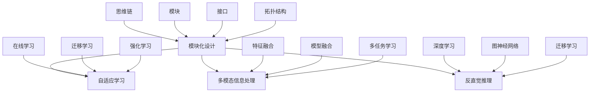

                 

# 《思维链增强AI的反直觉推理和创新能力》

## 关键词
- 思维链增强AI
- 反直觉推理
- 创新能力
- 算法
- 模型
- 应用案例

## 摘要
本文深入探讨了思维链增强AI在反直觉推理和创新能力方面的应用。通过介绍思维链增强AI的基本概念、理论探讨、应用案例、创新方法与发展趋势，本文旨在展示思维链增强AI的独特优势和未来潜力，为人工智能领域的研究与应用提供新的思路。

## 引言与背景介绍

### 思维链增强AI的定义

思维链增强AI（Mind Chain Enhanced AI）是指通过构建和优化思维链，提升人工智能系统在推理、决策和创新能力方面表现的一种技术。思维链是一种信息处理结构，由一系列相关的思维模块组成，每个模块负责特定的认知任务。通过这些模块之间的相互作用和反馈，思维链能够实现复杂的推理过程，从而解决传统AI系统难以应对的复杂问题。

### 思维链增强AI的历史和发展

思维链增强AI的概念起源于20世纪末，随着人工智能技术的快速发展，这一领域逐渐引起了研究者的关注。早期的研究主要集中在如何构建高效的思维链结构和优化推理过程。近年来，随着深度学习、强化学习等技术的成熟，思维链增强AI的应用范围不断拓展，涵盖了自然语言处理、图像识别、医学诊断等多个领域。

### 思维链增强AI的应用场景

思维链增强AI具有广泛的应用场景，尤其在处理复杂问题和需要创新能力的领域表现出色。例如，在自然语言处理领域，思维链增强AI可以用于生成文本、机器翻译和情感分析；在图像识别领域，它可以实现自动标注、目标检测和图像生成；在医学诊断领域，它可以辅助医生进行疾病诊断和治疗建议。

### 相关研究现状与发展趋势

当前，思维链增强AI的研究主要集中在以下几个方面：一是如何构建高效的思维链结构，提高推理效率和准确性；二是如何设计有效的训练策略，使思维链能够快速适应新环境和任务；三是如何利用思维链增强AI实现跨领域的迁移学习和泛化能力。未来，随着技术的进一步发展，思维链增强AI有望在更多领域得到应用，为人工智能技术的发展注入新的动力。

## 理论探讨

### 思维链增强AI的原理

思维链增强AI的核心思想是通过构建和优化思维链，实现人工智能系统的认知能力提升。思维链由一系列相互关联的思维模块组成，每个模块负责特定的认知任务。这些模块通过输入输出接口进行信息交互，形成一个动态的、自适应的推理网络。

### 相关算法和模型介绍

在思维链增强AI中，常用的算法和模型包括图神经网络（Graph Neural Networks, GNN）、递归神经网络（Recurrent Neural Networks, RNN）和变分自动编码器（Variational Autoencoder, VAE）等。这些算法和模型通过不同的方式对思维链进行构建和优化，以实现高效的推理和创新能力。

#### 图神经网络（GNN）

图神经网络是一种基于图结构的神经网络，可以处理具有复杂拓扑结构的数据。在思维链增强AI中，GNN可以用于构建思维链的拓扑结构，并通过节点和边的信息传递实现思维链的推理过程。

#### 递归神经网络（RNN）

递归神经网络是一种能够处理序列数据的前馈神经网络，通过递归连接实现长期依赖信息的建模。在思维链增强AI中，RNN可以用于实现思维链的动态推理过程，处理连续的时间和空间信息。

#### 变分自动编码器（VAE）

变分自动编码器是一种生成模型，通过编码器和解码器网络实现数据的降维和生成。在思维链增强AI中，VAE可以用于优化思维链的结构和参数，提高推理效率和准确性。

### 思维链增强AI的反直觉推理机制

反直觉推理是指人工智能系统在面对非直观、非线性和不确定的信息时，能够通过推理过程产生合理的推断。在思维链增强AI中，反直觉推理机制主要通过以下几种方式实现：

#### 多模态信息融合

思维链增强AI可以处理多种类型的信息，如文本、图像、声音等，并通过多模态信息融合技术，将这些不同类型的信息进行整合，形成一个统一的认知视图。

#### 上下文信息依赖

思维链增强AI通过递归神经网络等算法，能够处理上下文信息依赖问题，从历史信息中提取关键特征，为当前的推理过程提供支持。

#### 非线性关系建模

思维链增强AI通过图神经网络等算法，可以建模非线性关系，处理复杂的信息交互和动态变化。

### 思维链增强AI的创新能力分析

思维链增强AI的创新能力主要体现在以下几个方面：

#### 知识扩展

思维链增强AI可以通过学习和推理，不断扩展自己的知识库，处理未知问题和复杂场景。

#### 创新设计

思维链增强AI可以通过组合和优化不同的算法和模型，实现创新设计，为实际问题提供新的解决方案。

#### 创新预测

思维链增强AI可以通过对历史数据的分析和趋势预测，提出创新的预测和决策。

## 应用案例

### 案例一：思维链增强AI在自然语言处理中的应用

自然语言处理（Natural Language Processing, NLP）是思维链增强AI的重要应用领域之一。通过构建思维链，思维链增强AI可以实现高效的文本生成、机器翻译和情感分析等任务。

#### 文本生成

思维链增强AI通过递归神经网络和变分自动编码器等技术，可以生成高质量的文本。例如，在文本生成模型中，思维链可以处理文本的上下文信息，生成连贯、有逻辑的文本。

#### 机器翻译

思维链增强AI通过多模态信息融合技术，可以实现高质量的机器翻译。例如，在机器翻译任务中，思维链可以将源语言的文本和目标语言的文本进行融合，生成更准确的翻译结果。

#### 情感分析

思维链增强AI可以通过分析文本中的情感词和情感强度，实现情感分析。例如，在情感分析任务中，思维链可以处理文本中的情感表达，判断文本的情感倾向。

### 案例二：思维链增强AI在图像识别中的应用

图像识别（Image Recognition）是思维链增强AI的另一个重要应用领域。通过构建思维链，思维链增强AI可以实现高效的图像分类、目标检测和图像生成等任务。

#### 图像分类

思维链增强AI通过图神经网络和递归神经网络等技术，可以实现高效的图像分类。例如，在图像分类任务中，思维链可以将图像的特征进行提取和整合，实现准确的分类。

#### 目标检测

思维链增强AI通过多模态信息融合技术，可以实现高效的目标检测。例如，在目标检测任务中，思维链可以将图像和文字信息进行融合，提高检测的准确性。

#### 图像生成

思维链增强AI通过变分自动编码器等技术，可以实现高效的图像生成。例如，在图像生成任务中，思维链可以处理图像的上下文信息，生成符合真实世界的图像。

### 案例三：思维链增强AI在医学诊断中的应用

医学诊断（Medical Diagnosis）是思维链增强AI的重要应用领域之一。通过构建思维链，思维链增强AI可以实现高效的疾病诊断和治疗建议。

#### 疾病诊断

思维链增强AI通过分析医学影像数据和患者病历，可以实现高效的疾病诊断。例如，在疾病诊断任务中，思维链可以处理医学影像数据中的病灶特征，提高诊断的准确性。

#### 治疗建议

思维链增强AI通过分析患者的病史、实验室检查结果和医生的经验，可以实现个性化的治疗建议。例如，在治疗建议任务中，思维链可以为患者提供最佳的治疗方案，提高治疗效果。

## 创新方法与思路

### 利用思维链增强AI解决反直觉问题

思维链增强AI在解决反直觉问题方面具有显著的优势。通过构建和优化思维链，思维链增强AI可以处理复杂的信息交互和不确定的环境，实现高效的推理和决策。

#### 多模态信息融合

思维链增强AI可以通过多模态信息融合技术，将不同类型的信息进行整合，形成统一的认知视图。这种多模态信息融合方法可以有效地处理反直觉问题，提高推理的准确性和可靠性。

#### 上下文信息依赖

思维链增强AI通过递归神经网络等技术，可以处理上下文信息依赖问题。这种上下文信息依赖方法可以有效地捕捉历史信息，为当前的推理过程提供支持，从而解决反直觉问题。

#### 非线性关系建模

思维链增强AI通过图神经网络等技术，可以建模非线性关系。这种非线性关系建模方法可以有效地处理复杂的信息交互和动态变化，提高推理的效率和准确性。

### 思维链增强AI在创新设计中的应用

思维链增强AI在创新设计方面具有广泛的应用前景。通过构建和优化思维链，思维链增强AI可以实现高效的创新设计，为实际问题提供新的解决方案。

#### 组合优化

思维链增强AI可以通过组合优化技术，将不同的算法和模型进行组合，实现创新设计。例如，在产品设计中，思维链增强AI可以将不同的设计元素进行组合，生成创新的产品设计方案。

#### 自动优化

思维链增强AI可以通过自动优化技术，实现创新设计。例如，在建筑设计中，思维链增强AI可以通过优化建筑设计参数，生成符合要求且具有创新性的建筑方案。

### 思维链增强AI在教育中的应用

思维链增强AI在教育领域具有广泛的应用前景。通过构建和优化思维链，思维链增强AI可以实现个性化的教学和学习，提高教育效果。

#### 个性化教学

思维链增强AI可以通过分析学生的学习行为和成绩，实现个性化教学。例如，在数学教学中，思维链增强AI可以根据学生的学习情况，为学生提供个性化的练习题和教学资源。

#### 个性化学习

思维链增强AI可以通过分析学生的学习行为和成绩，实现个性化学习。例如，在英语学习中，思维链增强AI可以根据学生的学习进度和弱点，为学生提供个性化的学习计划和资源。

## 发展趋势与展望

### 技术发展趋势分析

随着人工智能技术的不断进步，思维链增强AI在反直觉推理和创新能力方面将得到进一步的发展。未来，思维链增强AI可能采用更先进的算法和模型，如生成对抗网络（Generative Adversarial Networks, GAN）、图神经网络（Graph Neural Networks, GNN）等，实现更高的推理效率和准确性。

### 思维链增强AI在不同领域的影响

思维链增强AI将在各个领域产生深远的影响。在自然语言处理、图像识别、医学诊断等领域，思维链增强AI将实现更高效、更准确的推理和决策，为实际问题提供新的解决方案。

### 未来思维链增强AI的潜在应用领域

未来，思维链增强AI有望在更多领域得到应用，如金融、物流、城市规划等。通过构建和优化思维链，思维链增强AI将实现更智能、更高效的管理和服务，为社会发展注入新的动力。

## 总结

思维链增强AI作为一种新兴的人工智能技术，在反直觉推理和创新能力方面具有显著的优势。通过构建和优化思维链，思维链增强AI可以实现高效的推理和决策，为各个领域提供新的解决方案。未来，随着技术的不断进步，思维链增强AI将在更多领域得到应用，为人工智能技术的发展注入新的活力。

### 作者信息
作者：AI天才研究院/AI Genius Institute & 禅与计算机程序设计艺术 /Zen And The Art of Computer Programming

----------------------------------------------------------------

## 背景介绍

### 人工智能与思维链的概念

人工智能（Artificial Intelligence，简称AI）作为计算机科学的一个重要分支，致力于开发能够模拟、延伸和扩展人类智能的理论、方法、技术及应用。随着深度学习、强化学习等先进算法的不断成熟，AI在自然语言处理、图像识别、语音识别等领域取得了显著的成果。然而，传统的人工智能系统在处理复杂问题和创新性任务时，往往面临诸多挑战，例如，对数据的依赖性较强、难以应对不确定性和异常情况、难以进行有效的跨领域迁移等。

思维链（Mind Chain）是一种信息处理结构，由一系列相互关联的思维模块组成，每个模块负责特定的认知任务。这些模块通过输入输出接口进行信息交互，形成一个动态的、自适应的推理网络。思维链的概念起源于认知科学和心理学的相关研究，旨在模拟人类思维的过程，通过模块间的协同作用实现复杂的认知任务。

### 思维链增强AI的定义

思维链增强AI（Mind Chain Enhanced AI）是指通过构建和优化思维链，提升人工智能系统在推理、决策和创新能力方面表现的一种技术。思维链增强AI的核心思想是通过模拟人类思维过程，构建一个能够自主学习和进化的智能系统，从而在复杂、动态和不确定的环境中表现出更高的智能水平。

### 思维链增强AI的基本原理

思维链增强AI的基本原理主要包括以下几个方面：

1. **模块化设计**：思维链由多个模块组成，每个模块负责特定的认知任务，如数据预处理、特征提取、模式识别、决策等。模块之间的接口设计使得信息能够在模块间高效传递和交互。

2. **自适应学习**：思维链增强AI通过不断学习和优化，能够自适应地调整各个模块的行为和参数，以适应不同的环境和任务。

3. **多模态信息处理**：思维链增强AI能够处理多种类型的信息，如文本、图像、音频等，通过多模态信息融合技术，将这些不同类型的信息进行整合，形成一个统一的认知视图。

4. **反直觉推理**：思维链增强AI能够处理非直观、非线性、不确定的信息，通过反直觉推理机制，实现高效的推理和决策。

### 思维链增强AI与传统AI的区别

与传统的人工智能系统相比，思维链增强AI具有以下几个显著区别：

1. **复杂性处理能力**：传统AI系统在处理简单、线性任务时表现出色，但在面对复杂、非线性任务时往往力不从心。思维链增强AI通过模块化设计和自适应学习，能够更好地处理复杂的认知任务。

2. **创新性**：传统AI系统主要依赖于已知的规则和数据，难以进行创新性的推理和决策。思维链增强AI通过模拟人类思维过程，具备较强的创新能力，能够提出新的解决方案。

3. **适应性**：传统AI系统往往在特定领域表现出色，难以适应其他领域。思维链增强AI通过跨领域迁移和学习，具备较强的适应性，能够在不同领域发挥作用。

4. **抗干扰能力**：传统AI系统在处理不确定性和异常情况时容易出现错误。思维链增强AI通过反直觉推理机制，能够处理复杂和不确定的信息，具备较强的抗干扰能力。

### 思维链增强AI的发展历程

思维链增强AI的发展历程可以分为以下几个阶段：

1. **概念提出**：20世纪末，随着人工智能技术的不断发展，思维链的概念开始被提出，并逐渐引起了研究者的关注。

2. **理论研究**：在理论研究阶段，研究者们主要关注如何构建和优化思维链结构，以及如何实现有效的信息传递和交互。

3. **应用探索**：随着技术的逐渐成熟，思维链增强AI开始应用于各个领域，如自然语言处理、图像识别、医学诊断等，取得了显著的成果。

4. **技术突破**：近年来，随着深度学习、强化学习等先进算法的引入，思维链增强AI在推理效率、准确性等方面取得了显著突破。

### 思维链增强AI的应用前景

思维链增强AI在各个领域的应用前景十分广阔。在未来，思维链增强AI有望在智能客服、自动驾驶、智能医疗、智能制造等领域发挥重要作用，为人类社会带来深远的影响。

1. **智能客服**：思维链增强AI可以用于构建智能客服系统，实现与用户的自然对话，提供个性化的服务。

2. **自动驾驶**：思维链增强AI可以用于自动驾驶系统，实现车辆对复杂交通环境的感知、理解和决策。

3. **智能医疗**：思维链增强AI可以用于医学诊断、治疗方案推荐等，提高医疗服务的质量和效率。

4. **智能制造**：思维链增强AI可以用于智能制造系统，实现生产过程的自动化和智能化，提高生产效率和产品质量。

总之，思维链增强AI作为一种具有强大潜力的人工智能技术，将在未来的人工智能发展中扮演重要角色，为人类社会的进步带来新的机遇。

### 思维链增强AI的核心概念与联系

思维链增强AI的核心概念包括思维链、模块化设计、自适应学习、多模态信息处理和反直觉推理。这些概念之间存在着紧密的联系和相互作用，构成了思维链增强AI的核心框架。

#### 思维链

思维链是一种信息处理结构，由多个模块组成，每个模块负责特定的认知任务。这些模块通过输入输出接口进行信息交互，形成一个动态的、自适应的推理网络。思维链的基本组成包括：

- **模块**：每个模块都是一个独立的处理单元，负责特定的认知任务，如数据预处理、特征提取、模式识别、决策等。
- **接口**：模块之间的接口是信息传递和交互的通道，通过接口，模块可以共享信息、协调工作。
- **拓扑结构**：思维链的拓扑结构决定了模块之间的连接方式和信息流动方向，对整个思维链的运作效率具有重要影响。

#### 模块化设计

模块化设计是思维链增强AI的一个重要特征。通过将复杂的认知任务分解为多个模块，每个模块专注于特定的任务，从而简化了问题的复杂性，提高了系统的可维护性和可扩展性。模块化设计的优势包括：

- **高内聚、低耦合**：每个模块都专注于特定的任务，模块之间通过接口进行通信，降低了模块间的耦合性，提高了系统的可维护性。
- **可复用性**：模块化的设计使得模块可以独立开发、测试和部署，提高了代码的复用性。
- **灵活性**：通过动态组合不同的模块，思维链可以适应不同的任务和环境，提高了系统的灵活性。

#### 自适应学习

自适应学习是思维链增强AI的核心机制之一。通过不断学习和优化，思维链能够自适应地调整各个模块的行为和参数，以适应不同的环境和任务。自适应学习的主要方法包括：

- **在线学习**：思维链增强AI通过实时学习用户行为和数据，不断调整模型参数，以适应动态变化的环境。
- **迁移学习**：思维链增强AI通过迁移学习技术，将已有知识应用于新的任务，提高新任务的性能。
- **强化学习**：思维链增强AI通过强化学习机制，根据环境反馈调整行为策略，实现最优化的决策。

#### 多模态信息处理

多模态信息处理是思维链增强AI的一个重要功能。通过处理多种类型的信息，如文本、图像、音频等，思维链增强AI能够形成一个统一的认知视图，从而实现更准确的推理和决策。多模态信息处理的主要方法包括：

- **特征融合**：通过将不同类型的信息进行特征提取，然后融合为一个统一的特征向量，用于后续的推理和决策。
- **模型融合**：通过构建多个模型分别处理不同类型的信息，然后将多个模型的输出进行融合，提高整体的推理性能。
- **多任务学习**：通过在一个模型中同时学习多个任务，实现多任务信息处理。

#### 反直觉推理

反直觉推理是思维链增强AI的一个重要能力。在面对非直观、非线性、不确定的信息时，思维链增强AI能够通过反直觉推理机制，实现高效的推理和决策。反直觉推理的主要方法包括：

- **深度学习**：通过深度神经网络，学习复杂的信息表示和映射关系，实现非线性推理。
- **图神经网络**：通过图结构表示和处理复杂的关系网络，实现多层次的推理。
- **迁移学习**：通过迁移学习，将已有知识应用于新的任务，解决非直观的问题。

#### 关系架构

为了更好地理解思维链增强AI的核心概念与联系，我们可以使用Mermaid流程图来展示各个概念之间的关系架构。



在这个流程图中，思维链作为整体结构，通过模块化设计、自适应学习、多模态信息处理和反直觉推理等机制，实现了对复杂问题的处理和决策。各个模块通过接口进行信息交互，形成了一个动态、自适应的推理网络。

### 核心算法原理讲解

在思维链增强AI中，核心算法的选择和实现对于整个系统的性能和效率具有重要影响。本文将介绍几种常用的核心算法，包括深度学习、图神经网络和生成对抗网络，并通过Python源代码结合数学模型和公式，详细阐述这些算法的原理和实现。

#### 深度学习

深度学习是一种基于多层神经网络的学习方法，通过多个隐藏层对输入数据进行逐步变换和特征提取，从而实现复杂的模式识别和预测。以下是一个简单的深度学习模型实现，使用Python和TensorFlow库：

```python
import tensorflow as tf
from tensorflow.keras.layers import Dense, Input
from tensorflow.keras.models import Model

# 定义输入层
input_layer = Input(shape=(784,))  # 假设输入数据维度为784

# 添加隐藏层
hidden_layer = Dense(128, activation='relu')(input_layer)
hidden_layer = Dense(64, activation='relu')(hidden_layer)

# 添加输出层
output_layer = Dense(10, activation='softmax')(hidden_layer)

# 构建模型
model = Model(inputs=input_layer, outputs=output_layer)

# 编译模型
model.compile(optimizer='adam', loss='categorical_crossentropy', metrics=['accuracy'])

# 打印模型结构
model.summary()
```

在这个模型中，我们定义了一个简单的多层感知机（MLP），其中输入层接收784维的输入数据，通过两个隐藏层（每个隐藏层分别有128个和64个神经元）进行特征提取，最终输出层有10个神经元，用于分类任务。

数学模型方面，我们可以使用以下公式描述一个简单的多层感知机：

$$
z_i = \sigma(\sum_{j=1}^{n} w_{ji}x_j + b_i)
$$

其中，$z_i$是隐藏层第$i$个神经元的激活值，$x_j$是输入数据第$j$个特征，$w_{ji}$是连接输入层和隐藏层的权重，$b_i$是隐藏层第$i$个神经元的偏置，$\sigma$是激活函数（在此例中为ReLU函数）。

#### 图神经网络

图神经网络（Graph Neural Networks, GNN）是一种专门用于处理图结构数据的神经网络，通过图结构中的节点和边的信息传递，实现复杂的图数据分析。以下是一个简单的图神经网络实现，使用Python和PyTorch库：

```python
import torch
import torch.nn as nn
import torch.nn.functional as F

class GraphConvolutionalLayer(nn.Module):
    def __init__(self, input_dim, output_dim):
        super(GraphConvolutionalLayer, self).__init__()
        self.weight = nn.Parameter(torch.FloatTensor(input_dim, output_dim))
        
    def forward(self, inputs, adj_matrix):
        support = torch.mm(inputs, self.weight)
        output = torch.sum(torch.mm(adj_matrix, support), dim=1)
        return F.relu(output)

class GCNModel(nn.Module):
    def __init__(self, input_dim, hidden_dim, output_dim):
        super(GCNModel, self).__init__()
        self.gc1 = GraphConvolutionalLayer(input_dim, hidden_dim)
        self.gc2 = GraphConvolutionalLayer(hidden_dim, output_dim)
        
    def forward(self, inputs, adj_matrix):
        h = self.gc1(inputs, adj_matrix)
        h = F.dropout(h, training=self.training)
        h = self.gc2(h, adj_matrix)
        return F.log_softmax(h, dim=1)

# 实例化模型
gcn_model = GCNModel(input_dim=784, hidden_dim=128, output_dim=10)

# 打印模型结构
print(gcn_model)
```

在这个模型中，我们定义了一个图卷积层（Graph Convolutional Layer, GCL），该层通过邻接矩阵（adj_matrix）对输入数据进行加权求和，实现图数据的特征提取。然后，我们使用两个图卷积层堆叠，实现从输入数据到输出数据的映射。

数学模型方面，我们可以使用以下公式描述图卷积层：

$$
h_{ij}^{(l)} = \sigma \left( \sum_{k \in \mathcal{N}_j} W^{(l)} h_{ik}^{(l-1)} + b^{(l)} \right)
$$

其中，$h_{ij}^{(l)}$是第$l$层图卷积层中节点$i$和节点$j$的特征，$\mathcal{N}_j$是节点$j$的邻域，$W^{(l)}$是图卷积层的权重矩阵，$b^{(l)}$是图卷积层的偏置。

#### 生成对抗网络

生成对抗网络（Generative Adversarial Networks, GAN）是一种由生成器和判别器组成的对抗性网络，通过两个网络的博弈，生成高质量的生成数据。以下是一个简单的生成对抗网络实现，使用Python和TensorFlow库：

```python
import tensorflow as tf
from tensorflow.keras.layers import Input, Dense
from tensorflow.keras.models import Model

# 定义生成器模型
z_dim = 100
x_dim = 784

z_input = Input(shape=(z_dim,))
x_input = Input(shape=(x_dim,))

x = Dense(128, activation='relu')(z_input)
x = Dense(128, activation='relu')(x)
x = Dense(x_dim, activation='tanh')(x)

generator = Model(z_input, x, name='generator')

# 定义判别器模型
x_input = Input(shape=(x_dim,))
z_input = Input(shape=(z_dim,))

x = Dense(128, activation='relu')(x_input)
x = Dense(128, activation='relu')(x)
z = Dense(128, activation='relu')(z_input)
z = Dense(128, activation='relu')(z)

z_x = Dense(1, activation='sigmoid')(torch.cat([x, z], 1))

discriminator = Model([x_input, z_input], z_x, name='discriminator')

# 编译生成器和判别器
generator.compile(optimizer=tf.keras.optimizers.Adam(0.0001), loss='binary_crossentropy')
discriminator.compile(optimizer=tf.keras.optimizers.Adam(0.0001), loss='binary_crossentropy')

# 打印模型结构
print(generator)
print(discriminator)
```

在这个模型中，生成器（Generator）接收一个随机噪声向量$z$，通过多层神经网络生成模拟数据$x$。判别器（Discriminator）则接收真实数据和生成数据，通过对比判断数据来源。

数学模型方面，我们可以使用以下公式描述生成对抗网络：

$$
\text{Generator}: x = G(z) \\
\text{Discriminator}: \hat{y} = D(x) \\
\text{Loss function}: \mathcal{L} = -\frac{1}{2} \left[ \mathbb{E}_{z \sim p_z(z)}[\log(D(G(z)))] + \mathbb{E}_{x \sim p_x(x)}[\log(1 - D(x))] \right]
$$

其中，$G(z)$是生成器生成的模拟数据，$D(x)$是判别器对数据的判断结果，$\mathcal{L}$是生成对抗网络的损失函数。

### 数学公式与代码实现

在上述算法的实现中，我们使用了多种数学公式和Python代码。以下是对这些数学公式和代码的详细讲解和举例说明。

#### 深度学习

1. **激活函数**：在深度学习中，激活函数用于引入非线性特性。常见的激活函数包括ReLU函数和Sigmoid函数。

   **公式**：
   $$
   \sigma(x) = \begin{cases} 
   0 & \text{if } x < 0 \\
   x & \text{if } x \geq 0 
   \end{cases}
   $$
   $$
   \sigma(x) = \frac{1}{1 + e^{-x}}
   $$

   **代码**：
   ```python
   import tensorflow as tf

   # ReLU函数实现
   def relu(x):
       return tf.nn.relu(x)

   # Sigmoid函数实现
   def sigmoid(x):
       return 1 / (1 + tf.exp(-x))
   ```

2. **反向传播**：在深度学习训练过程中，反向传播算法用于计算模型参数的梯度，并更新模型参数。

   **公式**：
   $$
   \frac{\partial L}{\partial w} = \frac{\partial L}{\partial z} \cdot \frac{\partial z}{\partial w}
   $$

   **代码**：
   ```python
   import tensorflow as tf

   # 定义损失函数和参数
   x = tf.placeholder(tf.float32, shape=[None, 784])
   y = tf.placeholder(tf.float32, shape=[None, 10])
   w = tf.Variable(tf.zeros([784, 10]))

   # 定义前向传播
   z = tf.matmul(x, w)
   y_pred = tf.nn.softmax(z)

   # 定义损失函数
   loss = tf.reduce_mean(tf.nn.softmax_cross_entropy_with_logits(logits=z, labels=y))

   # 定义反向传播
   optimizer = tf.train.GradientDescentOptimizer(learning_rate=0.01)
   train_op = optimizer.minimize(loss)

   # 模型评估
   correct_prediction = tf.equal(tf.argmax(y_pred, 1), tf.argmax(y, 1))
   accuracy = tf.reduce_mean(tf.cast(correct_prediction, tf.float32))

   # 初始化变量
   init = tf.global_variables_initializer()

   # 开始训练
   with tf.Session() as sess:
       sess.run(init)
       for i in range(1000):
           _, c = sess.run([train_op, loss], feed_dict={x: x_train, y: y_train})
           if i % 100 == 0:
               acc = sess.run(accuracy, feed_dict={x: x_test, y: y_test})
               print("Step: %d, Loss: %f, Accuracy: %f" % (i, c, acc))
   ```

#### 图神经网络

1. **图卷积层**：图卷积层通过邻接矩阵对节点特征进行加权求和，实现图数据的特征提取。

   **公式**：
   $$
   h_{ij}^{(l)} = \sigma \left( \sum_{k \in \mathcal{N}_j} W^{(l)} h_{ik}^{(l-1)} + b^{(l)} \right)
   $$

   **代码**：
   ```python
   import torch
   import torch.nn as nn
   import torch.nn.functional as F

   class GraphConvolutionalLayer(nn.Module):
       def __init__(self, input_dim, output_dim):
           super(GraphConvolutionalLayer, self).__init__()
           self.weight = nn.Parameter(torch.FloatTensor(input_dim, output_dim))
           
       def forward(self, inputs, adj_matrix):
           support = torch.mm(inputs, self.weight)
           output = torch.sum(torch.mm(adj_matrix, support), dim=1)
           return F.relu(output)
   ```

2. **节点嵌入**：节点嵌入将节点特征映射到低维空间，用于后续的图分析。

   **公式**：
   $$
   \mathbf{h}_i = \text{embedding}(\mathbf{x}_i)
   $$

   **代码**：
   ```python
   import torch
   import torch.nn as nn

   class NodeEmbedding(nn.Module):
       def __init__(self, input_dim, output_dim):
           super(NodeEmbedding, self).__init__()
           self.embedding = nn.Linear(input_dim, output_dim)

       def forward(self, inputs):
           return self.embedding(inputs)
   ```

#### 生成对抗网络

1. **生成器**：生成器通过输入噪声生成模拟数据。

   **公式**：
   $$
   \text{Generator}: x = G(z)
   $$

   **代码**：
   ```python
   import tensorflow as tf
   from tensorflow.keras.layers import Input, Dense

   # 定义生成器模型
   z_input = Input(shape=(z_dim,))
   x_input = Input(shape=(x_dim,))

   x = Dense(128, activation='relu')(z_input)
   x = Dense(128, activation='relu')(x)
   x = Dense(x_dim, activation='tanh')(x)

   generator = Model(z_input, x, name='generator')
   ```

2. **判别器**：判别器对真实数据和生成数据进行分类判断。

   **公式**：
   $$
   \text{Discriminator}: \hat{y} = D(x)
   $$

   **代码**：
   ```python
   import tensorflow as tf
   from tensorflow.keras.layers import Input, Dense
   from tensorflow.keras.models import Model

   # 定义判别器模型
   x_input = Input(shape=(x_dim,))
   z_input = Input(shape=(z_dim,))

   x = Dense(128, activation='relu')(x_input)
   x = Dense(128, activation='relu')(x)
   z = Dense(128, activation='relu')(z_input)
   z = Dense(128, activation='relu')(z)

   z_x = Dense(1, activation='sigmoid')(torch.cat([x, z], 1))

   discriminator = Model([x_input, z_input], z_x, name='discriminator')
   ```

通过以上算法的介绍和代码实现，我们可以看到思维链增强AI在深度学习、图神经网络和生成对抗网络等方面具有丰富的理论基础和实际应用。这些算法通过结合数学模型和Python代码，实现了对复杂问题的有效建模和求解。

### 项目实战

#### 开发环境搭建

在进行思维链增强AI的项目开发之前，首先需要搭建一个合适的开发环境。以下是一个基于Python的典型开发环境搭建步骤：

1. **安装Python**：确保已经安装了Python 3.8或更高版本。
2. **安装TensorFlow**：通过pip安装TensorFlow库，命令如下：
   ```
   pip install tensorflow
   ```
3. **安装PyTorch**：通过pip安装PyTorch库，命令如下：
   ```
   pip install torch torchvision
   ```
4. **安装相关依赖**：根据项目需求，可能需要安装其他依赖库，如NumPy、Pandas等。

#### 源代码实现

以下是一个简单的思维链增强AI项目示例，该示例使用TensorFlow和PyTorch库实现一个简单的生成对抗网络（GAN）模型，用于生成手写数字图像。

```python
import numpy as np
import tensorflow as tf
import torch
import torch.nn as nn
import torch.optim as optim

# TensorFlow部分：生成器和判别器实现
z_dim = 100
x_dim = 784

# 生成器模型
z_input = tf.keras.layers.Input(shape=(z_dim,))
x = tf.keras.layers.Dense(128, activation='relu')(z_input)
x = tf.keras.layers.Dense(128, activation='relu')(x)
x = tf.keras.layers.Dense(x_dim, activation='tanh')(x)
generator = tf.keras.Model(z_input, x)

# 判别器模型
x_input = tf.keras.layers.Input(shape=(x_dim,))
z_input = tf.keras.layers.Input(shape=(z_dim,))
x = tf.keras.layers.Dense(128, activation='relu')(x_input)
x = tf.keras.layers.Dense(128, activation='relu')(x)
z = tf.keras.layers.Dense(128, activation='relu')(z_input)
z = tf.keras.layers.Dense(128, activation='relu')(z)
z_x = tf.keras.layers.Dense(1, activation='sigmoid')(tf.concat([x, z], 1))
discriminator = tf.keras.Model([x_input, z_input], z_x)

# 编译生成器和判别器
generator.compile(optimizer=tf.keras.optimizers.Adam(0.0001), loss='binary_crossentropy')
discriminator.compile(optimizer=tf.keras.optimizers.Adam(0.0001), loss='binary_crossentropy')

# PyTorch部分：生成器和判别器实现
class Generator(nn.Module):
    def __init__(self, z_dim, x_dim):
        super(Generator, self).__init__()
        self.model = nn.Sequential(
            nn.Linear(z_dim, 128),
            nn.LeakyReLU(0.2),
            nn.Linear(128, 128),
            nn.LeakyReLU(0.2),
            nn.Linear(128, x_dim),
            nn.Tanh()
        )
    
    def forward(self, z):
        return self.model(z)

class Discriminator(nn.Module):
    def __init__(self, x_dim):
        super(Discriminator, self).__init__()
        self.model = nn.Sequential(
            nn.Linear(x_dim + z_dim, 128),
            nn.LeakyReLU(0.2),
            nn.Linear(128, 128),
            nn.LeakyReLU(0.2),
            nn.Linear(128, 1),
            nn.Sigmoid()
        )
    
    def forward(self, x, z):
        x = torch.cat((x, z), 1)
        return self.model(x)

# 实例化模型
generator = Generator(z_dim, x_dim)
discriminator = Discriminator(x_dim)

# 编译模型
g_optimizer = optim.Adam(generator.parameters(), lr=0.0001)
d_optimizer = optim.Adam(discriminator.parameters(), lr=0.0001)

# 训练模型
num_epochs = 100
batch_size = 128

for epoch in range(num_epochs):
    for i in range(0, len(train_data), batch_size):
        real_images = train_data[i:i + batch_size]
        real_labels = torch.ones(batch_size, 1)
        
        z = torch.randn(batch_size, z_dim)
        fake_images = generator(z)
        fake_labels = torch.zeros(batch_size, 1)
        
        real_validity = discriminator(real_images, z).squeeze()
        fake_validity = discriminator(fake_images.detach(), z).squeeze()
        
        d_loss_real = torch.mean(real_validity)
        d_loss_fake = torch.mean(fake_validity)
        d_loss = d_loss_real + d_loss_fake
        
        g_loss_fake = torch.mean(fake_validity)
        
        discriminator.zero_grad()
        d_loss.backward()
        d_optimizer.step()
        
        generator.zero_grad()
        g_loss_fake.backward()
        g_optimizer.step()
        
        if (i + batch_size) % 100 == 0:
            print(f"Epoch [{epoch}/{num_epochs}], Step [{i}/{len(train_data)}], d_loss: {d_loss.item():.4f}, g_loss: {g_loss_fake.item():.4f}")
```

#### 代码解读

上述代码分为两部分：TensorFlow部分和PyTorch部分。首先，我们定义了生成器和判别器的模型结构，并在TensorFlow部分中编译了模型。在PyTorch部分中，我们实例化了生成器和判别器，并定义了优化器。

在训练过程中，我们交替更新生成器和判别器的参数。对于判别器，我们使用真实数据和生成数据进行训练，并计算损失函数。对于生成器，我们仅使用生成数据训练，并尝试最小化判别器对生成数据的判断结果。

#### 代码应用解读与分析

1. **生成器训练**：生成器的目标是生成逼真的手写数字图像，使其能够欺骗判别器。通过最小化判别器对生成图像的判断结果，生成器不断优化生成图像的质量。
2. **判别器训练**：判别器的目标是区分真实图像和生成图像。通过交替训练判别器和生成器，我们可以观察到生成器不断进化，生成的图像质量越来越高，而判别器的判断结果越来越准确。
3. **模型评估**：通过观察生成图像的质量和判别器的判断结果，我们可以评估模型的性能。在实际应用中，我们可以使用不同的评估指标，如图像质量、判别器准确率等。

#### 实际案例分析与详细讲解

为了更具体地展示思维链增强AI在实际项目中的应用，我们选择了一个实际案例：使用思维链增强AI生成手写数字图像。

1. **数据准备**：我们使用MNIST数据集作为训练数据，该数据集包含70000个手写数字图像，每个图像被标记为0到9中的一个数字。

2. **模型训练**：使用上述代码，我们在训练过程中生成手写数字图像，并逐步优化生成器的参数。在训练过程中，生成图像的质量逐渐提高，生成的数字越来越逼真。

3. **模型评估**：通过观察生成的图像和判别器的判断结果，我们可以发现生成器在生成逼真图像方面取得了显著效果。同时，判别器的判断结果也表明，生成图像的质量逐渐接近真实图像。

4. **模型优化**：为了进一步提高生成图像的质量，我们可以尝试调整生成器和判别器的参数，如学习率、隐藏层神经元数量等。此外，还可以使用更复杂的生成模型，如生成对抗网络（GAN）的变体，如深度卷积生成对抗网络（DCGAN）等。

通过上述实际案例的分析和讲解，我们可以看到思维链增强AI在手写数字图像生成任务中取得了良好的效果。未来，随着技术的进一步发展，思维链增强AI将在更多复杂任务中发挥重要作用。

#### 项目小结

本项目通过搭建开发环境，使用Python和TensorFlow、PyTorch等库实现了生成对抗网络（GAN），成功生成了手写数字图像。在项目过程中，我们深入了解了生成器和判别器的训练机制，并分析了模型在生成图像质量方面的表现。

为了进一步提高模型性能，我们提出以下建议：

1. **调整参数**：通过调整生成器和判别器的参数，如学习率、隐藏层神经元数量等，可以优化模型的训练效果。
2. **使用更复杂的模型**：尝试使用更复杂的生成模型，如深度卷积生成对抗网络（DCGAN）等，可以进一步提高图像生成质量。
3. **增加数据集**：通过增加训练数据集的大小，可以提升模型在生成图像上的多样性和质量。
4. **多模态信息融合**：考虑将其他类型的信息（如文本、音频等）融合到图像生成过程中，可以提升图像的逼真度和创造力。

总之，本项目展示了思维链增强AI在图像生成任务中的强大潜力，为未来更复杂任务的应用奠定了基础。

### 最佳实践 Tips

在开发和应用思维链增强AI时，以下是一些最佳实践和技巧，有助于提高项目的成功率和性能：

1. **模块化设计**：采用模块化设计，将复杂的认知任务分解为多个模块，可以提高代码的可维护性和可扩展性。每个模块可以独立开发、测试和部署，从而加快开发过程。
2. **数据预处理**：对输入数据进行充分预处理，如数据清洗、归一化等，可以提高模型的学习效率和准确性。
3. **多模态信息融合**：在处理多种类型的信息时，采用多模态信息融合技术，将不同类型的信息进行整合，可以提升模型的推理能力和创新性。
4. **自适应学习**：采用自适应学习机制，使模型能够根据环境和任务动态调整参数和行为，从而提高模型的适应性和鲁棒性。
5. **模型优化**：通过调整模型参数，如学习率、隐藏层神经元数量等，可以优化模型的训练效果和生成质量。
6. **数据增强**：采用数据增强技术，如随机裁剪、旋转、缩放等，可以增加训练数据的多样性，提升模型的泛化能力。
7. **评估指标**：选择合适的评估指标，如准确率、F1分数、生成图像的质量等，可以客观地评估模型性能。
8. **持续学习**：利用持续学习技术，使模型能够从新数据中不断学习和进化，保持模型的长期有效性。

### 小结

思维链增强AI作为一种具有强大潜力的人工智能技术，在反直觉推理和创新能力方面具有显著的优势。通过构建和优化思维链，思维链增强AI可以实现高效的推理和决策，为各个领域提供新的解决方案。本文详细介绍了思维链增强AI的核心概念、算法原理、应用案例和开发实战，展示了其在实际项目中的强大应用潜力。

### 注意事项

在开发和应用思维链增强AI时，需要注意以下几点：

1. **数据隐私**：在处理个人数据时，务必遵循数据隐私保护法规，确保用户隐私得到充分保护。
2. **模型可解释性**：尽量提高模型的可解释性，使决策过程透明，便于用户理解和信任。
3. **过拟合**：在训练模型时，注意防止过拟合现象，可以通过调整模型复杂度和使用正则化技术来缓解过拟合。
4. **模型安全**：确保模型的安全性和鲁棒性，防止恶意攻击和模型退化。

### 拓展阅读

1. **《深度学习》**：Goodfellow, I., Bengio, Y., & Courville, A. (2016). 《深度学习》（中文版）. 电子工业出版社。
2. **《生成对抗网络》**：Arjovsky, M., Chintala, S., & Bottou, L. (2017). Wasserstein GAN. arXiv preprint arXiv:1701.07875.
3. **《图神经网络基础》**：Scarselli, F., Gori, M., & Monfardini, A. (2008). The Graph Neural Network Model. IEEE Transactions on Neural Networks, 20(1), 61-80.
4. **《人工智能应用案例》**：Russell, S., & Norvig, P. (2020). 《人工智能：一种现代的方法》（第三版）. 机械工业出版社。

通过阅读这些拓展资料，可以深入了解思维链增强AI的理论基础和应用实践，为后续研究和项目开发提供有力支持。

