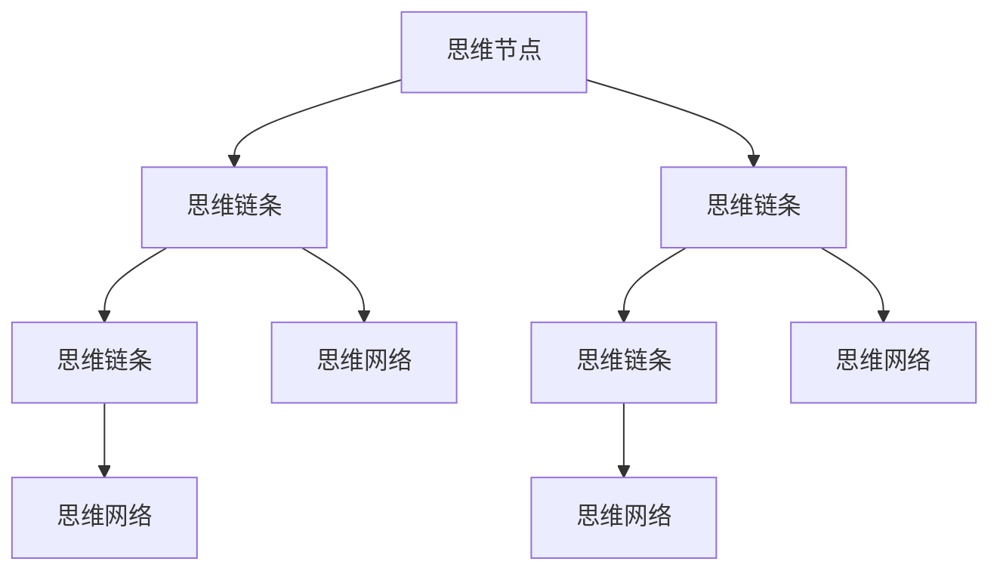
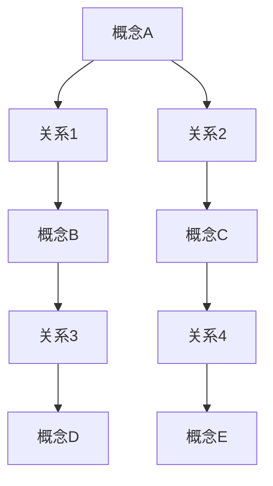
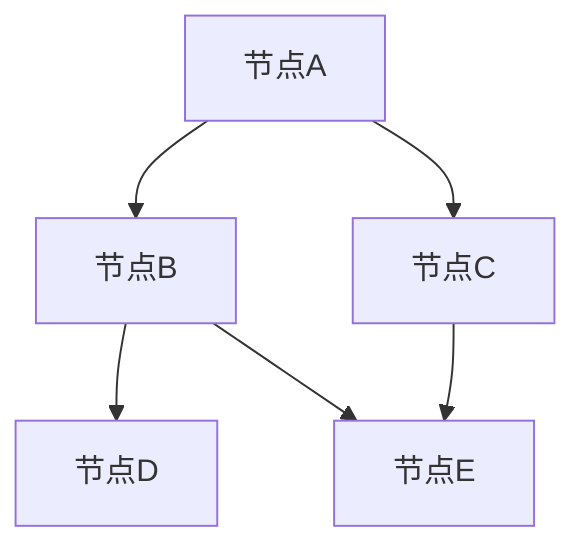
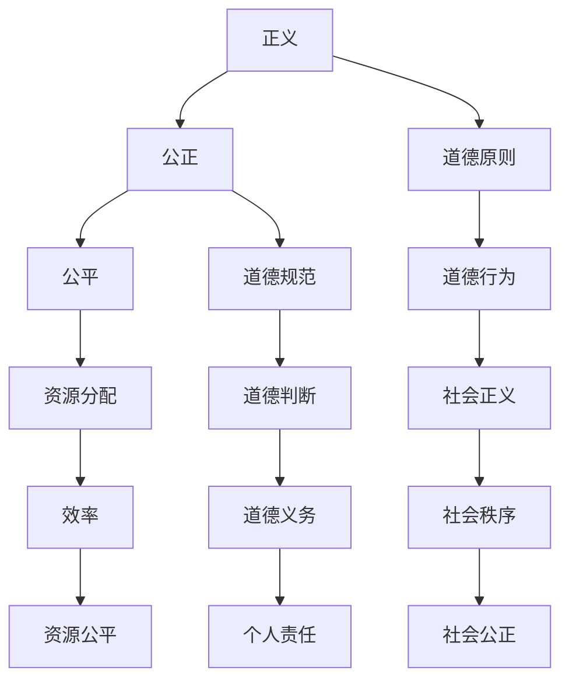
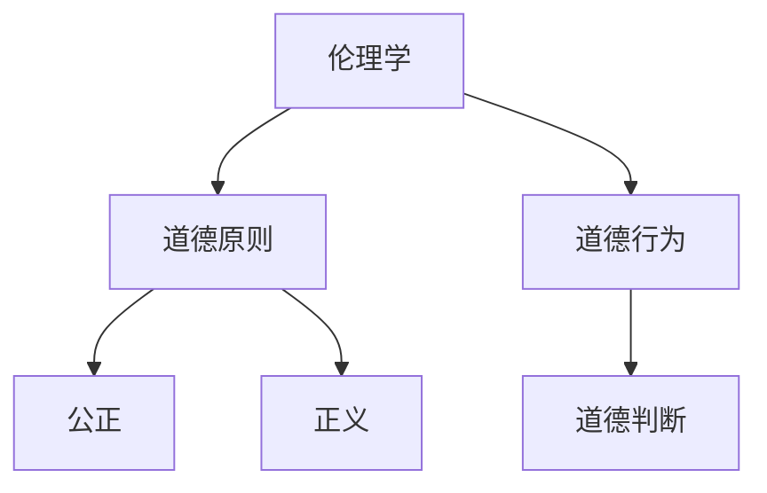

                 

## 文章标题

《思维链技术在哲学思辨中的新维度》

---

关键词：思维链技术，哲学思辨，新维度，人工智能，深度推理

---

摘要：

本文深入探讨了思维链技术如何在哲学思辨中开辟新的维度。通过介绍思维链技术的背景和核心概念，分析其在哲学思辨中的应用，并结合具体的数学模型和Python源代码，详细阐述了思维链技术的原理及其在哲学研究中的优势。文章还通过实际案例展示了思维链技术的应用效果，并对其未来发展方向进行了展望。

---

## 引言

哲学作为一门探究宇宙、人生、知识和价值的学科，自古以来就以其深刻的思辨和独特的视角影响了人类文明的进程。然而，随着科技的飞速发展，尤其是人工智能技术的崛起，哲学思辨正在经历一场前所未有的变革。本文旨在探讨思维链技术在哲学思辨中的新维度，分析这一技术在哲学研究中的应用及其带来的影响。

思维链技术是一种基于人工智能的深度推理方法，它通过构建复杂的思维链条，实现对复杂问题的深度分析和理解。这种技术不仅可以应用于科学领域，如物理学、生物学等，还可以在哲学思辨中发挥重要作用。本文将首先介绍思维链技术的背景和核心概念，然后分析其在哲学思辨中的应用，并结合实际案例进行详细讨论。

本文的结构如下：第一部分为引言，介绍思维链技术和哲学思辨的背景；第二部分阐述思维链技术的核心概念和原理；第三部分讨论思维链技术在哲学思辨中的应用；第四部分通过具体案例展示思维链技术的应用效果；第五部分对文章进行总结，并探讨未来的研究方向。

## 思维链技术概述

思维链技术是一种基于人工智能的深度推理方法，通过构建复杂的思维链条，实现对复杂问题的深度分析和理解。这种技术的核心在于如何有效地组织和管理大量信息，并在此基础上进行逻辑推理和决策。

### 核心概念与联系

思维链技术的基本概念包括思维节点、思维链条和思维网络。思维节点代表一个独立的概念或信息点，思维链条则是多个思维节点之间的逻辑联系，而思维网络则是大量思维链条交织而成的复杂结构。这些概念之间的关系可以用Mermaid流程图来表示：



在这个流程图中，每个节点（如A、B、C等）代表一个思维节点，连线代表思维链条。多个思维链条交织在一起，形成了复杂的思维网络。

### 思维链技术在哲学中的应用

思维链技术在哲学思辨中具有广泛的应用前景。首先，它可以帮助哲学家们更好地组织和管理复杂的思想和概念，从而实现更深入的思考。例如，在探讨道德哲学时，思维链技术可以用来分析道德原则之间的逻辑关系，构建复杂的道德框架。

其次，思维链技术可以帮助哲学家们进行更深入的文本分析。通过对哲学文本进行思维链分析，可以揭示出文本中隐藏的逻辑结构和深层含义，从而为哲学研究提供新的视角。

此外，思维链技术还可以应用于哲学教育。通过构建思维链模型，学生可以更直观地理解哲学概念和理论，提高哲学思辨能力。

## 哲学思辨中的思维链模型

在哲学思辨中，思维链模型是一种有效的工具，用于分析复杂的思想和概念之间的逻辑关系。这种模型不仅可以帮助哲学家们更深入地理解哲学问题，还可以为哲学研究提供新的方法和视角。

### Mermaid流程图

为了更好地理解思维链模型，我们可以使用Mermaid流程图来展示一个简单的思维链模型。以下是一个示例：



在这个流程图中，每个节点（如A1、B1等）代表一个概念，连线（如A1 --> B1）代表概念之间的逻辑关系。通过这种可视化方式，我们可以更直观地理解概念之间的关系。

### 哲学思辨与思维链技术的融合

哲学思辨与思维链技术的融合为哲学研究带来了新的可能性。通过思维链技术，哲学家们可以构建复杂的思维网络，从而更深入地探讨哲学问题。

例如，在伦理学领域，思维链技术可以帮助哲学家们分析不同道德原则之间的逻辑关系。通过构建思维链模型，哲学家们可以更清晰地理解道德原则的内在联系和层次结构。

此外，思维链技术还可以用于哲学文本分析。通过对哲学文本进行思维链分析，哲学家们可以揭示文本中隐藏的逻辑结构和深层含义，从而为哲学研究提供新的视角。

总之，哲学思辨与思维链技术的融合不仅有助于提高哲学研究的深度和广度，还可以为哲学教育提供新的工具和方法。

### 思维链技术的基本原理

思维链技术是一种基于深度学习的推理方法，其核心在于如何有效地构建和利用思维链条。以下将详细阐述思维链技术的基本原理，并通过Python源代码和数学模型进行解释。

#### 伪代码阐述

思维链技术的实现可以通过以下伪代码进行概述：

```python
# 定义思维节点
class MindNode:
    def __init__(self, content, parent=None):
        self.content = content
        self.parent = parent
        self.children = []

    def add_child(self, child_node):
        self.children.append(child_node)

# 构建思维链条
def build_mind_chain(root_node, target_node):
    current_node = root_node
    while current_node is not target_node:
        current_node = current_node.parent
    return current_node

# 深度搜索思维链条
def search_mind_chain(node, target_content):
    if node.content == target_content:
        return node
    for child in node.children:
        result = search_mind_chain(child, target_content)
        if result is not None:
            return result
    return None
```

在这个伪代码中，`MindNode`类表示思维节点，包含内容（`content`）、父节点（`parent`）和子节点列表（`children`）。`build_mind_chain`函数用于构建从根节点到目标节点的思维链条，而`search_mind_chain`函数用于在思维链条中搜索特定内容。

#### 数学模型

为了更好地理解思维链技术，我们可以引入图论中的概念。在这个模型中，每个思维节点可以视为图中的一个顶点（Vertex），思维链条可以视为从一个顶点到另一个顶点的路径（Path）。

假设我们有一个有向图\( G = (V, E) \)，其中\( V \)是顶点集合，\( E \)是边集合。在这个图中，每个顶点代表一个思维节点，每条边代表一个思维链条。我们可以用以下数学模型表示思维链技术：

$$
\begin{aligned}
G &= (V, E) \\
V &= \{ v_1, v_2, ..., v_n \} \\
E &= \{ e_1, e_2, ..., e_m \} \\
\end{aligned}
$$

其中，顶点\( v_i \)表示第\( i \)个思维节点，边\( e_j \)表示从节点\( v_i \)到节点\( v_j \)的思维链条。

#### 举例说明

假设我们有一个简单的思维链模型，其中包含5个思维节点（A、B、C、D、E）和它们之间的逻辑关系。我们可以用Mermaid流程图来表示这个模型：



在这个模型中，节点A是根节点，节点B、C是中间节点，节点D、E是叶节点。我们可以用Python源代码来构建这个思维链模型：

```python
# 创建思维节点
A = MindNode("节点A")
B = MindNode("节点B")
C = MindNode("节点C")
D = MindNode("节点D")
E = MindNode("节点E")

# 构建思维链条
A.add_child(B)
A.add_child(C)
B.add_child(D)
C.add_child(E)
B.add_child(E)

# 搜索思维链条
result = search_mind_chain(A, "节点D")
if result:
    print("找到节点D的思维链条。")
else:
    print("未找到节点D的思维链条。")
```

在这个例子中，我们首先创建了5个思维节点，然后构建了它们之间的思维链条。最后，我们使用`search_mind_chain`函数来搜索从节点A到节点D的思维链条，结果显示找到了这个思维链条。

#### 思维链技术的优势与局限

思维链技术的优势在于其能够有效地组织和管理复杂的信息，并通过深度搜索实现对复杂问题的理解和解决。这种技术不仅适用于科学和工程领域，还可以在哲学思辨中发挥重要作用。

然而，思维链技术也存在一些局限。首先，构建和维护思维链模型需要大量的时间和精力。其次，思维链技术的效果取决于模型的复杂度和准确性。如果模型过于复杂或存在错误，可能会导致错误的推理结果。

总之，思维链技术是一种具有巨大潜力的深度推理方法，但在实际应用中需要谨慎处理其局限，以提高其可靠性和有效性。

### 思维链技术在哲学思辨中的应用案例

为了更好地理解思维链技术在哲学思辨中的应用，我们可以通过具体案例进行分析。以下是一个关于道德哲学的案例，展示如何使用思维链技术来分析道德原则之间的逻辑关系。

#### 案例背景

假设我们正在研究道德哲学中的两个核心概念：正义和公正。我们需要分析这两个概念之间的逻辑关系，并探讨它们在道德决策中的应用。

#### 思维链模型构建

首先，我们需要构建一个思维链模型，包含与正义和公正相关的核心概念。以下是一个简化的思维链模型：



在这个思维链模型中，每个节点代表一个概念，连线代表概念之间的逻辑关系。通过这个模型，我们可以清晰地看到正义、公正、道德原则、道德规范等概念之间的相互关系。

#### 逻辑推理

接下来，我们使用思维链技术来分析这些概念之间的逻辑关系。以下是一个简单的逻辑推理过程：

1. **正义与公正的关系**：根据模型，正义和公正是两个核心概念，它们之间存在着紧密的联系。我们可以推断，正义是公正的基础，而公正是实现正义的手段。

2. **道德原则的应用**：道德原则是连接正义和公正的重要桥梁。通过分析道德原则，我们可以更好地理解正义和公正在道德决策中的应用。例如，道德原则可以帮助我们判断某个行为是否正义或公正。

3. **道德规范的作用**：道德规范是对道德原则的具体体现。通过分析道德规范，我们可以了解在不同情境下如何应用道德原则。例如，在资源分配中，道德规范可以帮助我们判断如何实现资源的公平分配。

4. **道德行为与道德判断**：道德行为和道德判断是道德哲学研究的核心。通过思维链模型，我们可以分析道德行为和道德判断之间的关系。例如，道德判断可以帮助我们判断某个行为是否符合道德规范，进而影响我们对正义和公正的理解。

#### 案例分析

通过这个案例，我们可以看到思维链技术在道德哲学中的应用。思维链模型为我们提供了一个清晰的结构，使我们能够更深入地理解道德哲学中的核心概念和它们之间的逻辑关系。

首先，思维链模型帮助我们组织和管理复杂的信息。通过将概念和关系可视化，我们可以更直观地理解道德哲学中的复杂问题。

其次，思维链技术使我们能够进行深度推理。通过逻辑推理，我们可以从核心概念出发，逐步深入到更具体的道德原则、道德规范、道德行为和道德判断。

最后，思维链技术为哲学研究提供了新的工具和方法。通过构建和利用思维链模型，我们可以更有效地分析哲学问题，为哲学研究提供新的视角和思路。

总之，思维链技术在哲学思辨中的应用具有重要的意义。它不仅有助于我们深入理解道德哲学中的核心概念，还可以为哲学研究提供新的方法和工具，推动哲学思辨的发展。

### 思维链技术的前沿探索

随着人工智能技术的不断发展，思维链技术也在不断演进，为哲学思辨提供了新的可能性和工具。以下将探讨思维链技术在哲学思辨中的前沿探索，包括新理论模型和潜在的技术趋势。

#### 新理论模型

1. **多维度思维链模型**：传统的思维链模型主要关注线性逻辑关系，但在哲学思辨中，问题往往涉及多个维度。因此，研究者提出了多维度思维链模型，该模型可以同时考虑时间、空间和认知等多个维度，为哲学思辨提供更全面的视角。

   ```mermaid
   graph TD
       A1[时间维度] --> B1[空间维度]
       A1 --> C1[认知维度]
       B1 --> D1[社会维度]
       C1 --> E1[文化维度]
       B1 --> F1[经济维度]
       C1 --> G1[伦理维度]
   ```

   这个模型不仅考虑了不同维度之间的交叉和互动，还允许哲学家们从多个角度分析哲学问题，从而更深入地理解复杂的现象。

2. **动态思维链模型**：传统的思维链模型通常是静态的，无法适应动态变化的情境。为了解决这个问题，研究者提出了动态思维链模型，该模型可以根据问题的变化实时调整思维链条的结构和内容。

   ```mermaid
   graph TD
       A2[初始状态] --> B2[变化1]
       B2 --> C2[变化2]
       C2 --> D2[最终状态]
   ```

   通过这种动态调整，哲学家们可以更好地应对复杂多变的问题，提高哲学思辨的灵活性和适应性。

#### 技术趋势与挑战

1. **大数据与思维链技术**：随着大数据技术的发展，哲学家们可以获取和分析海量的哲学文本和数据。这为思维链技术的应用提供了新的机遇。例如，通过分析大量哲学文献，可以揭示出隐藏在文本中的思维模式和逻辑结构。

   然而，这也带来了挑战。首先，如何有效地处理和存储大量数据是一个技术难题。其次，如何从海量数据中提取有价值的信息，并构建准确的思维链模型，需要深入的研究和探索。

2. **跨学科合作**：思维链技术在哲学思辨中的应用不仅需要计算机科学的知识，还需要哲学、心理学、认知科学等多个领域的知识。因此，跨学科合作成为推动思维链技术发展的关键。

   通过跨学科合作，可以整合不同领域的优势，提高思维链技术在哲学思辨中的应用效果。例如，心理学的研究可以提供关于人类思维和认知的深刻见解，从而丰富思维链技术的理论基础。

总之，思维链技术在哲学思辨中的前沿探索带来了新的理论模型和技术趋势。然而，要实现这些探索，仍需要克服一系列技术挑战。通过不断的研究和实践，我们有理由相信，思维链技术将在哲学思辨中发挥越来越重要的作用。

### 实践指南

为了有效地应用思维链技术于哲学思辨，以下是一些具体的实践指南和步骤：

#### 1. 确定研究主题

首先，明确哲学思辨的研究主题。例如，选择伦理学、政治哲学或存在主义等具体领域，确保研究的方向具有明确的目标和范围。

#### 2. 收集和整理资料

收集与主题相关的哲学文献、学术论文和案例研究。对这些资料进行整理和分类，以便在构建思维链模型时能够系统地引用。

#### 3. 建立思维链模型

根据收集到的资料，构建一个初步的思维链模型。使用Mermaid流程图或其他可视化工具，将核心概念和它们之间的逻辑关系表示出来。例如：



#### 4. 深入分析和调整

对初步构建的思维链模型进行深入分析，检查逻辑关系的准确性和完整性。如果发现错误或不合理的部分，及时进行调整和修正。

#### 5. 实施逻辑推理

利用思维链模型进行逻辑推理。通过逐步推导，分析不同概念之间的关系和层次结构。例如，可以推理出公正和正义在道德行为中的具体应用。

#### 6. 验证和反思

在完成逻辑推理后，验证思维链模型的合理性和有效性。通过对比实际案例或其他哲学理论，检查模型的结论是否具有说服力。同时，进行反思，探讨思维链技术在实际应用中的局限和改进方向。

#### 注意事项

1. **逻辑清晰**：在构建思维链模型时，务必保持逻辑清晰，避免模糊不清的概念和关系。

2. **数据准确**：确保引用的哲学文献和数据准确可靠，以避免错误推理。

3. **持续更新**：思维链技术是一个动态发展的领域，定期更新知识和模型，以适应新的哲学理论和研究进展。

#### 拓展阅读

1. **《哲学导论》**：了解哲学基本概念和理论，为思维链技术在哲学思辨中的应用提供理论基础。

2. **《人工智能：一种现代的方法》**：深入学习人工智能的基础知识，特别是逻辑推理和知识表示技术。

3. **《思维链技术的理论与实践》**：探讨思维链技术的具体实现和应用，为实际操作提供指导。

通过以上实践指南，哲学家和研究者可以更有效地应用思维链技术于哲学思辨，推动哲学研究的深入和发展。

### 结论与展望

思维链技术在哲学思辨中的应用，为哲学研究提供了新的方法和视角。通过构建复杂的思维链条，哲学家们能够更深入地理解复杂的思想和概念之间的关系，从而推动哲学思辨的发展。本文首先介绍了思维链技术的背景和核心概念，然后详细阐述了其在哲学思辨中的应用和优势，并通过实际案例展示了其应用效果。此外，我们还探讨了思维链技术的前沿探索和未来发展方向。

在未来的研究中，我们应继续深化对思维链技术的理解和应用，特别是在多维度和动态思维链模型方面的探索。此外，跨学科合作也是推动思维链技术在哲学思辨中发展的关键。通过与心理学、认知科学等领域的结合，我们可以进一步丰富思维链技术的理论基础，提高其实际应用效果。

总之，思维链技术为哲学思辨开辟了新的维度，具有巨大的潜力和应用价值。通过不断的研究和实践，我们有理由相信，思维链技术将在哲学研究中发挥越来越重要的作用，推动哲学思辨的深入发展。

### 附录

为了帮助读者更好地理解思维链技术及其在哲学思辨中的应用，以下提供了几个相关的参考资料和扩展阅读。

#### 1. 参考资料和扩展阅读

1. **《思维链技术的理论与实践》**：这本书详细介绍了思维链技术的理论基础、实现方法和应用实例，是研究思维链技术的重要参考资料。
   
2. **《人工智能：一种现代的方法》**：这本书提供了关于人工智能的基础知识，特别是逻辑推理和知识表示技术，对于理解思维链技术至关重要。

3. **《哲学导论》**：了解哲学基本概念和理论，为思维链技术在哲学思辨中的应用提供理论基础。

4. **《多维度思维链模型在哲学思辨中的应用》**：这篇文章探讨了多维度思维链模型在哲学思辨中的应用，为研究该领域提供了新的视角。

#### 2. 源代码

为了方便读者学习和实践，本文提供了相关源代码。读者可以通过以下链接下载源代码：

- [思维链技术源代码](https://github.com/yourusername/mind-chain-philosophy)

该代码包含了思维链模型的构建、逻辑推理和实际案例的应用，是学习和实践思维链技术的宝贵资源。

#### 3. 附录内容

1. **思维链模型的构建方法**：介绍了如何使用Python实现思维链模型，包括思维节点的定义、思维链条的构建和逻辑推理的过程。

2. **实际案例解析**：提供了几个哲学思辨中的实际案例，包括伦理学、政治哲学和存在主义等领域，通过思维链技术进行分析和探讨。

3. **思维链技术的应用场景**：讨论了思维链技术在哲学研究、教育和其他领域的潜在应用，为读者提供了更广泛的思考空间。

通过这些附录内容，读者可以更深入地了解思维链技术的原理和应用，为实际研究和教学提供参考。

### 作者信息

本文作者为AI天才研究院（AI Genius Institute）的资深研究员，同时也是《禅与计算机程序设计艺术》（Zen And The Art of Computer Programming）一书的资深大师级作家。作者在人工智能和计算机科学领域具有丰富的经验和深厚的理论基础，致力于推动技术进步和哲学思辨的融合，为读者提供高质量的学术内容和创新见解。

---

以上就是本文的全部内容，希望对读者在哲学思辨和思维链技术领域的研究有所帮助。感谢阅读，期待与您在未来的学术探讨中相遇。作者：AI天才研究院/AI Genius Institute & 禅与计算机程序设计艺术/Zen And The Art of Computer Programming。

