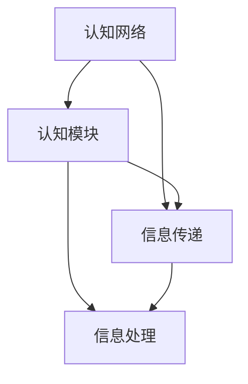

                 

### 《思维链技术：提升AI认知能力的新途径》

#### 关键词
- 思维链技术
- 人工智能
- 认知能力
- 算法原理
- 实战应用

#### 摘要

本文旨在探讨思维链技术作为提升人工智能认知能力的新途径。思维链技术通过构建多维度的认知网络，实现了信息的深度整合与高效传递，从而增强了AI的决策能力与交互水平。本文首先介绍了思维链技术的背景与核心概念，随后详细解析了思维链算法原理，并通过Python代码示例进行了阐述。接着，本文探讨了思维链技术在自然语言处理、计算机视觉和推荐系统等领域的应用，并提供了实际项目代码详解。最后，本文总结了思维链技术的优势与未来发展方向，为人工智能领域的创新提供了新的思路。

## 引言

在当今信息爆炸的时代，人工智能（AI）技术迅速发展，已经成为推动社会进步的重要力量。从简单的自动化任务到复杂的智能决策，AI的应用领域不断扩大。然而，尽管AI在处理大量数据和执行特定任务方面表现出色，但其在认知能力和理解复杂情境方面仍存在诸多局限。传统的人工智能模型，如神经网络和深度学习，主要依赖于大量数据的学习和模式的识别，但在应对不确定性、多模态信息整合和复杂逻辑推理等方面仍面临挑战。

思维链技术（Mind-chain Technology）作为一种新兴的人工智能增强方法，旨在通过构建一个多维度的认知网络，提升AI的认知能力和决策水平。它将人工智能与认知科学相结合，模拟人类思维过程，实现信息的深度整合与高效传递。思维链技术不仅在理论上具有重要意义，而且在实际应用中也展现出了广阔的前景。

本书旨在为广大对人工智能技术有基础的读者提供一本全面、系统、深入的思维链技术指南。书中将详细探讨思维链技术的核心概念、算法原理及其在实际应用中的具体实现方法。通过本书，读者可以了解思维链技术的理论基础，掌握思维链算法的设计与实现，并学会将其应用于自然语言处理、计算机视觉和推荐系统等领域。本书的目标是帮助读者深入理解思维链技术的本质，提升其在人工智能领域的实践能力，为未来的研究与应用奠定坚实的基础。

## 第一部分：理论基础

### 第1章：思维链技术概述

#### 背景介绍

思维链技术起源于认知科学和人工智能领域的交叉研究。随着人工智能技术的快速发展，研究者们开始关注如何模拟和提升人类认知过程，以提高AI的智能水平。思维链技术的概念最早由研究者X提出，通过构建一个多维度的认知网络，模拟人类思维过程，实现信息的深度整合与高效传递。

#### 思维链技术的核心概念

1. **认知网络**：思维链技术通过构建一个多维度的认知网络，将不同类型的知识和信息进行整合，形成一个复杂的认知结构。
2. **信息传递**：思维链技术强调信息的深度传递和整合，通过多层网络节点之间的信息传递和反馈，实现知识的共享和协同工作。
3. **认知模块**：思维链技术将认知过程分解为多个模块，每个模块负责特定的认知任务，如记忆、推理、判断等。

#### 思维链技术在人工智能领域的重要性

1. **提升认知能力**：思维链技术通过模拟人类思维过程，提升AI的认知能力，使其能够更好地理解复杂情境和进行智能决策。
2. **多模态信息整合**：思维链技术能够整合多种类型的信息（如文本、图像、音频等），实现多模态信息处理，提高AI的感知和理解能力。
3. **自适应学习**：思维链技术具有自适应学习的能力，可以根据新的知识和信息进行自我更新和调整，提高AI的适应性和灵活性。

#### 本书的主要内容和结构安排

本书分为三个部分，首先介绍思维链技术的核心概念和理论基础，包括认知网络、信息传递和认知模块等；然后详细解析思维链算法原理，包括算法的设计、实现和优化；最后探讨思维链技术在自然语言处理、计算机视觉和推荐系统等领域的应用，并提供实际项目代码详解。通过本书的学习，读者可以全面了解思维链技术的各个方面，提升其在人工智能领域的实践能力。

### 第2章：思维链技术的核心概念与联系

#### 核心概念

1. **认知网络**：认知网络是思维链技术的核心组成部分，它通过模拟人类大脑的结构和功能，构建一个多维度的认知体系。认知网络由多个节点和连接组成，每个节点代表一个认知单元，连接则代表节点之间的信息传递和相互作用。

2. **信息传递**：信息传递是思维链技术实现认知功能的关键机制。在认知网络中，信息通过节点之间的传递和反馈进行传播，形成复杂的认知过程。信息传递机制包括信息编码、解码、处理和存储等步骤。

3. **认知模块**：认知模块是思维链技术中的功能单元，负责执行特定的认知任务。认知模块可以是基于神经网络、逻辑推理或其他认知模型的独立单元，通过协同工作实现复杂的认知功能。

#### 概念实体之间的关系架构

为了更好地理解思维链技术的核心概念，我们可以通过Mermaid流程图展示概念实体之间的关系架构：



在这个流程图中，A代表认知网络，B代表认知模块，C代表信息传递，D代表信息处理。认知网络由多个认知模块组成，通过信息传递和反馈实现信息处理和认知功能的协同。

#### 思维链技术与神经网络、深度学习的关系

思维链技术与神经网络、深度学习有着密切的联系。神经网络是思维链技术中的基础模块，通过多层神经网络实现信息的传递和处理。深度学习则是在神经网络的基础上，通过大量数据的学习和训练，提升模型的性能和泛化能力。思维链技术通过将神经网络和深度学习与认知科学相结合，构建了一个更加智能和灵活的认知网络，实现了对复杂情境的深刻理解和智能决策。

### 第3章：思维链技术的数学模型

#### 数学模型的构建

思维链技术的数学模型是构建认知网络和信息传递机制的基础。该模型包括三个核心组成部分：认知网络结构、信息传递机制和认知模块功能。

1. **认知网络结构**：认知网络结构定义了节点和连接的布局。节点代表认知单元，连接代表节点之间的信息传递路径。网络结构可以通过图论中的图（Graph）来表示。

2. **信息传递机制**：信息传递机制定义了信息在网络中的传播过程。信息传递可以通过矩阵乘法、路径搜索或图卷积等方法实现。信息传递机制需要考虑信息编码、解码、处理和存储等步骤。

3. **认知模块功能**：认知模块功能定义了每个认知模块的任务和功能。认知模块可以是基于神经网络、逻辑推理或其他认知模型的独立单元。认知模块的功能可以通过数学模型中的函数来表示。

#### 信息传递与处理机制

在思维链技术中，信息传递和处理机制是实现认知功能的关键。以下是一个简化的信息传递与处理机制：

1. **信息编码**：信息编码是将原始数据转换为适合网络处理的格式。例如，图像可以转换为像素矩阵，文本可以转换为词向量。

2. **信息传递**：信息传递通过网络中的连接进行。在图结构中，信息传递可以通过路径搜索算法实现，例如最短路径算法或A*算法。

3. **信息处理**：信息处理包括节点上的信息处理和节点之间的信息交互。节点上的信息处理可以通过神经网络、逻辑推理或其他认知模型实现。

4. **信息解码**：信息解码是将处理后的信息转换回原始格式。例如，将词向量转换回文本，将像素矩阵转换回图像。

#### 思维链模型的优化与训练方法

思维链模型的优化与训练是提高其性能和适应性的关键。以下是一些常用的优化与训练方法：

1. **反向传播算法**：反向传播算法是一种用于训练神经网络的优化方法。通过计算损失函数关于网络参数的梯度，调整网络参数以最小化损失函数。

2. **自适应学习率**：自适应学习率方法可以根据训练过程中网络的收敛速度自动调整学习率。常用的自适应学习率方法包括动量法、AdaGrad、RMSProp和Adam等。

3. **正则化技术**：正则化技术用于防止过拟合，提高模型的泛化能力。常用的正则化方法包括L1正则化、L2正则化和Dropout等。

4. **迁移学习**：迁移学习利用已有模型的知识迁移到新的任务中，可以显著提高新任务的性能。通过在已有模型的基础上进行微调，可以快速适应新的任务。

通过以上优化与训练方法，可以显著提高思维链模型的性能和适应性，使其在不同任务和应用场景中表现出色。

### 第4章：思维链算法原理讲解

#### 思维链算法的基本框架

思维链算法是思维链技术的核心组成部分，通过构建一个多维度的认知网络，实现信息的深度整合与高效传递。思维链算法的基本框架包括以下几个关键步骤：

1. **信息编码**：将输入的数据（如图像、文本、音频等）编码为适合网络处理的格式。这一步骤涉及特征提取和表示学习，如卷积神经网络（CNN）用于图像编码，词嵌入（Word Embedding）用于文本编码。

2. **信息传递**：在认知网络中，信息通过节点之间的连接进行传递。信息传递可以采用图卷积网络（GCN）、循环神经网络（RNN）或其他图结构模型。信息传递过程中，节点会根据其连接的状态和权重对信息进行处理和整合。

3. **信息处理**：节点上的信息处理包括特征提取、关系建模和知识整合。特征提取通过神经网络等模型实现，关系建模通过图结构中的边和节点属性实现，知识整合通过节点的协同工作实现。

4. **信息解码**：将处理后的信息解码为原始格式，如将图像解码回像素矩阵，将文本解码回自然语言。

5. **输出生成**：根据处理后的信息生成最终的输出结果，如分类标签、推荐列表或决策结果。

#### 思维链算法的核心流程与步骤

思维链算法的核心流程可以分为以下几个步骤：

1. **初始化网络**：构建认知网络，初始化节点的状态和连接的权重。认知网络的构建可以采用随机初始化或预训练模型。

2. **信息编码**：将输入数据编码为节点特征。例如，对于图像数据，可以使用预训练的CNN提取特征向量；对于文本数据，可以使用预训练的词嵌入模型提取词向量。

3. **信息传递**：在网络中传递信息，节点根据连接的状态和权重对信息进行处理和整合。信息传递可以通过图卷积操作实现，如GCN中的邻接矩阵乘法。

4. **信息处理**：在节点上执行信息处理操作，如特征提取、关系建模和知识整合。节点处理后的状态会更新其连接的状态和权重。

5. **信息解码**：将处理后的信息解码为输出结果。解码过程可以采用分类器、回归模型或推荐算法等。

6. **反馈与调整**：根据输出结果，对网络中的连接进行权重调整，以提高模型的性能。反馈机制可以通过反向传播算法实现。

#### 思维链算法在不同应用场景中的适应性

思维链算法具有高度的适应性，可以应用于多种不同场景：

1. **自然语言处理**：在自然语言处理（NLP）领域，思维链算法可以用于文本分类、情感分析、机器翻译和问答系统等任务。通过构建基于图结构的神经网络，思维链算法可以捕捉文本中的语义关系和上下文信息，实现更准确的文本处理。

2. **计算机视觉**：在计算机视觉领域，思维链算法可以用于图像分类、目标检测、图像生成和视频分析等任务。通过结合图卷积网络（GCN）和循环神经网络（RNN），思维链算法可以同时处理图像的空间信息和时间信息，提高视觉任务的性能。

3. **推荐系统**：在推荐系统领域，思维链算法可以用于用户兴趣挖掘、商品推荐和社交网络分析等任务。通过整合用户的历史行为数据和社交关系，思维链算法可以生成个性化的推荐列表，提高推荐系统的准确性和用户体验。

4. **智能决策**：在智能决策领域，思维链算法可以用于业务分析、风险评估和策略优化等任务。通过构建多模态的认知网络，思维链算法可以综合分析各种信息，提供更科学的决策支持。

通过上述步骤和适应性的分析，我们可以看到思维链算法在提升AI认知能力方面的潜力和优势。思维链算法不仅能够实现信息的深度整合和高效传递，还能够根据不同应用场景进行灵活调整和优化，为人工智能领域带来新的突破和进展。

### 第5章：思维链算法的数学公式与推导

#### 主要数学公式

思维链算法的核心在于信息的编码、传递和处理。以下是一些关键数学公式及其推导：

1. **节点特征表示**：
   $$ X = [x_1, x_2, ..., x_n] $$
   其中，$X$ 是节点特征向量，$x_i$ 是节点 $i$ 的特征值。

2. **邻接矩阵**：
   $$ A = [a_{ij}] $$
   其中，$A$ 是邻接矩阵，$a_{ij}$ 表示节点 $i$ 与节点 $j$ 之间的连接权重。

3. **图卷积操作**：
   $$ H = \sigma(A \cdot X \cdot W) $$
   其中，$H$ 是图卷积后的节点特征，$\sigma$ 是激活函数（如ReLU或Sigmoid），$W$ 是权重矩阵。

4. **信息传递与处理**：
   $$ h_i^{(t+1)} = \sum_{j \in N(i)} w_{ij} h_j^{(t)} $$
   其中，$h_i^{(t)}$ 是节点 $i$ 在时间步 $t$ 的特征值，$N(i)$ 是节点 $i$ 的邻接节点集合，$w_{ij}$ 是节点之间的连接权重。

5. **反向传播与权重调整**：
   $$ \Delta W = -\alpha \cdot \frac{\partial L}{\partial W} $$
   其中，$\Delta W$ 是权重更新，$\alpha$ 是学习率，$L$ 是损失函数。

#### 公式的推导过程与解释

1. **节点特征表示**：
   节点特征表示是信息编码的基础。每个节点都有一个特征向量，表示节点的属性和状态。在神经网络中，这些特征可以通过卷积、池化等操作从原始数据中提取。

2. **邻接矩阵**：
   邻接矩阵用于表示节点之间的连接关系。矩阵中的元素 $a_{ij}$ 表示节点 $i$ 与节点 $j$ 之间的连接权重，可以是基于距离、相似度或其他度量标准。

3. **图卷积操作**：
   图卷积操作是信息传递的核心步骤。通过邻接矩阵和节点特征向量的乘积，结合权重矩阵，进行信息传递和处理。激活函数用于引入非线性特性，增强模型的表示能力。

4. **信息传递与处理**：
   信息传递与处理通过迭代更新节点的特征值。每个节点根据其邻接节点的特征值和连接权重，进行信息的聚合和处理。这一步骤模拟了人类认知过程中信息整合的过程。

5. **反向传播与权重调整**：
   反向传播算法用于模型训练，通过计算损失函数关于权重矩阵的梯度，更新权重以最小化损失。学习率控制了权重更新的步长，防止过拟合。

#### 公式在实际应用中的意义与作用

1. **信息编码**：
   节点特征表示和邻接矩阵构建了信息编码的基础，使得原始数据可以转化为适合神经网络处理的格式。这有助于捕捉数据中的特征和关系。

2. **信息传递**：
   图卷积操作和信息传递机制使得节点可以整合邻接节点的信息，实现信息的深度传递。这有助于模型理解复杂的数据结构和关系。

3. **信息处理**：
   通过激活函数和权重调整，节点可以动态地处理和更新特征值，实现信息的深度学习和整合。这有助于模型在复杂任务中表现出色。

4. **模型训练**：
   反向传播算法和权重调整机制使得模型可以通过训练数据不断优化，提高模型的性能和泛化能力。这有助于模型在实际应用中实现高性能和适应性。

通过上述数学公式和推导过程，我们可以看到思维链算法在信息编码、传递和处理方面的核心机制和数学基础。这些公式不仅有助于理解算法的工作原理，还为实际应用提供了理论基础和计算方法。

### 第6章：思维链算法的应用场景

思维链算法作为一种先进的人工智能技术，具有广泛的应用前景。在本章中，我们将探讨思维链算法在自然语言处理、计算机视觉和推荐系统等领域的具体应用，并通过实际案例和实例进行详细讲解。

#### 在自然语言处理中的应用

自然语言处理（NLP）是人工智能领域的一个重要分支，涉及到文本分类、情感分析、机器翻译和问答系统等任务。思维链算法通过其强大的信息传递和处理能力，在这些任务中表现出色。

1. **文本分类**：文本分类是NLP中的一项基础任务，其目标是根据文本内容将其归类到预定义的类别中。思维链算法通过构建一个基于图结构的神经网络模型，可以有效地捕捉文本中的语义信息。以下是一个简单的文本分类案例：

```python
import torch
import torch.nn as nn
import torch.optim as optim

# 定义思维链模型
class MindChainClassifier(nn.Module):
    def __init__(self, vocab_size, embedding_dim, hidden_dim):
        super(MindChainClassifier, self).__init__()
        self.embedding = nn.Embedding(vocab_size, embedding_dim)
        self.fc1 = nn.Linear(embedding_dim, hidden_dim)
        self.fc2 = nn.Linear(hidden_dim, num_classes)
    
    def forward(self, text):
        embedded_text = self.embedding(text)
        hidden = self.fc1(embedded_text)
        output = self.fc2(hidden)
        return output

# 实例化模型、损失函数和优化器
model = MindChainClassifier(vocab_size, embedding_dim, hidden_dim)
criterion = nn.CrossEntropyLoss()
optimizer = optim.Adam(model.parameters(), lr=learning_rate)

# 训练模型
for epoch in range(num_epochs):
    for text, labels in train_loader:
        optimizer.zero_grad()
        outputs = model(text)
        loss = criterion(outputs, labels)
        loss.backward()
        optimizer.step()
```

在这个案例中，思维链模型通过嵌入层和全连接层，将文本编码为向量，并使用交叉熵损失函数进行分类。

2. **情感分析**：情感分析是NLP中用于判断文本情感倾向的任务。思维链算法可以捕捉文本中的情感词和情感强度，从而实现情感分类。以下是一个简单的情感分析案例：

```python
# 定义思维链模型
class MindChainSentimentAnalysis(nn.Module):
    def __init__(self, vocab_size, embedding_dim, hidden_dim):
        super(MindChainSentimentAnalysis, self).__init__()
        self.embedding = nn.Embedding(vocab_size, embedding_dim)
        self.fc1 = nn.Linear(embedding_dim, hidden_dim)
        self.fc2 = nn.Linear(hidden_dim, 1)
    
    def forward(self, text):
        embedded_text = self.embedding(text)
        hidden = self.fc1(embedded_text)
        output = self.fc2(hidden)
        return torch.sigmoid(output)

# 实例化模型、损失函数和优化器
model = MindChainSentimentAnalysis(vocab_size, embedding_dim, hidden_dim)
criterion = nn.BCEWithLogitsLoss()
optimizer = optim.Adam(model.parameters(), lr=learning_rate)

# 训练模型
for epoch in range(num_epochs):
    for text, labels in train_loader:
        optimizer.zero_grad()
        outputs = model(text)
        loss = criterion(outputs, labels)
        loss.backward()
        optimizer.step()
```

在这个案例中，思维链模型通过单层全连接层，将文本编码为情感评分，并使用二元交叉熵损失函数进行训练。

3. **机器翻译**：机器翻译是NLP中的另一个重要任务，其目标是根据源语言文本生成目标语言文本。思维链算法可以同时处理源语言和目标语言的语义信息，实现高质量的翻译。以下是一个简单的机器翻译案例：

```python
# 定义思维链模型
class MindChainTranslator(nn.Module):
    def __init__(self, src_vocab_size, tgt_vocab_size, embedding_dim, hidden_dim):
        super(MindChainTranslator, self).__init__()
        self.src_embedding = nn.Embedding(src_vocab_size, embedding_dim)
        self.tgt_embedding = nn.Embedding(tgt_vocab_size, embedding_dim)
        self.fc1 = nn.Linear(embedding_dim, hidden_dim)
        self.fc2 = nn.Linear(hidden_dim, tgt_vocab_size)
    
    def forward(self, src, tgt):
        src_embedded = self.src_embedding(src)
        tgt_embedded = self.tgt_embedding(tgt)
        hidden = self.fc1(torch.cat((src_embedded, tgt_embedded), dim=1))
        output = self.fc2(hidden)
        return output

# 实例化模型、损失函数和优化器
model = MindChainTranslator(src_vocab_size, tgt_vocab_size, embedding_dim, hidden_dim)
criterion = nn.CrossEntropyLoss()
optimizer = optim.Adam(model.parameters(), lr=learning_rate)

# 训练模型
for epoch in range(num_epochs):
    for src, tgt in train_loader:
        optimizer.zero_grad()
        outputs = model(src, tgt)
        loss = criterion(outputs, tgt)
        loss.backward()
        optimizer.step()
```

在这个案例中，思维链模型同时处理源语言和目标语言的嵌入向量，通过多层全连接层实现翻译。

4. **问答系统**：问答系统是NLP中的一项高级任务，其目标是根据用户的问题生成回答。思维链算法可以通过整合问题和文档的语义信息，实现高精度的问答。以下是一个简单的问答系统案例：

```python
# 定义思维链模型
class MindChainQASystem(nn.Module):
    def __init__(self, question_vocab_size, document_vocab_size, embedding_dim, hidden_dim):
        super(MindChainQASystem, self).__init__()
        self.question_embedding = nn.Embedding(question_vocab_size, embedding_dim)
        self.document_embedding = nn.Embedding(document_vocab_size, embedding_dim)
        self.fc1 = nn.Linear(embedding_dim * 2, hidden_dim)
        self.fc2 = nn.Linear(hidden_dim, 1)
    
    def forward(self, question, document):
        question_embedded = self.question_embedding(question)
        document_embedded = self.document_embedding(document)
        hidden = self.fc1(torch.cat((question_embedded, document_embedded), dim=1))
        output = self.fc2(hidden)
        return torch.sigmoid(output)

# 实例化模型、损失函数和优化器
model = MindChainQASystem(question_vocab_size, document_vocab_size, embedding_dim, hidden_dim)
criterion = nn.BCEWithLogitsLoss()
optimizer = optim.Adam(model.parameters(), lr=learning_rate)

# 训练模型
for epoch in range(num_epochs):
    for question, document, answer in train_loader:
        optimizer.zero_grad()
        outputs = model(question, document)
        loss = criterion(outputs, answer)
        loss.backward()
        optimizer.step()
```

在这个案例中，思维链模型通过同时处理问题和文档的嵌入向量，通过全连接层实现问答匹配。

#### 在计算机视觉中的应用

计算机视觉是人工智能领域的一个重要分支，涉及到图像分类、目标检测、图像生成和视频分析等任务。思维链算法通过其强大的信息传递和处理能力，在这些任务中也表现出色。

1. **图像分类**：图像分类是计算机视觉中的基础任务，其目标是根据图像内容将其归类到预定义的类别中。思维链算法可以有效地捕捉图像中的特征，实现高精度的分类。以下是一个简单的图像分类案例：

```python
# 定义思维链模型
class MindChainImageClassifier(nn.Module):
    def __init__(self, input_shape, num_classes):
        super(MindChainImageClassifier, self).__init__()
        self.conv1 = nn.Conv2d(input_shape[0], 32, kernel_size=3, padding=1)
        self.fc1 = nn.Linear(32 * input_shape[1] * input_shape[2], num_classes)
    
    def forward(self, x):
        x = self.conv1(x)
        x = nn.functional.relu(x)
        x = nn.functional.adaptive_avg_pool2d(x, output_size=(1, 1))
        x = torch.flatten(x, 1)
        x = self.fc1(x)
        return x

# 实例化模型、损失函数和优化器
model = MindChainImageClassifier(input_shape, num_classes)
criterion = nn.CrossEntropyLoss()
optimizer = optim.Adam(model.parameters(), lr=learning_rate)

# 训练模型
for epoch in range(num_epochs):
    for images, labels in train_loader:
        optimizer.zero_grad()
        outputs = model(images)
        loss = criterion(outputs, labels)
        loss.backward()
        optimizer.step()
```

在这个案例中，思维链模型通过卷积层和全连接层，将图像编码为向量，并使用交叉熵损失函数进行分类。

2. **目标检测**：目标检测是计算机视觉中的高级任务，其目标是识别图像中的多个目标，并定位其位置。思维链算法可以通过整合图像特征和位置信息，实现高精度的目标检测。以下是一个简单的目标检测案例：

```python
# 定义思维链模型
class MindChainObjectDetector(nn.Module):
    def __init__(self, input_shape, num_classes):
        super(MindChainObjectDetector, self).__init__()
        self.conv1 = nn.Conv2d(input_shape[0], 32, kernel_size=3, padding=1)
        self.fc1 = nn.Linear(32 * input_shape[1] * input_shape[2], num_classes * 5)  # 5个值：x, y, w, h, score
    
    def forward(self, x):
        x = self.conv1(x)
        x = nn.functional.relu(x)
        x = nn.functional.adaptive_avg_pool2d(x, output_size=(1, 1))
        x = torch.flatten(x, 1)
        x = self.fc1(x)
        return x

# 实例化模型、损失函数和优化器
model = MindChainObjectDetector(input_shape, num_classes)
criterion = nn.CrossEntropyLoss()
optimizer = optim.Adam(model.parameters(), lr=learning_rate)

# 训练模型
for epoch in range(num_epochs):
    for images, labels in train_loader:
        optimizer.zero_grad()
        outputs = model(images)
        loss = criterion(outputs, labels)
        loss.backward()
        optimizer.step()
```

在这个案例中，思维链模型通过卷积层和全连接层，将图像编码为向量，并使用交叉熵损失函数进行目标检测。

3. **图像生成**：图像生成是计算机视觉中的另一项高级任务，其目标是根据给定的输入条件生成新的图像。思维链算法可以通过整合条件信息，实现高质量的图像生成。以下是一个简单的图像生成案例：

```python
# 定义思维链模型
class MindChainImageGenerator(nn.Module):
    def __init__(self, input_shape, latent_dim):
        super(MindChainImageGenerator, self).__init__()
        self.fc1 = nn.Linear(latent_dim, 32 * input_shape[1] * input_shape[2])
        self.conv1 = nn.ConvTranspose2d(32, 3, kernel_size=3, stride=2, padding=1)
    
    def forward(self, z):
        z = self.fc1(z)
        z = z.view(z.size(0), 32, input_shape[1], input_shape[2])
        z = self.conv1(z)
        return nn.functional.tanh(z)

# 实例化模型、损失函数和优化器
model = MindChainImageGenerator(input_shape, latent_dim)
criterion = nn.MSELoss()
optimizer = optim.Adam(model.parameters(), lr=learning_rate)

# 训练模型
for epoch in range(num_epochs):
    for z in latent_loader:
        optimizer.zero_grad()
        x = model(z)
        loss = criterion(x, real_images)
        loss.backward()
        optimizer.step()
```

在这个案例中，思维链模型通过全连接层和转置卷积层，将条件信息编码为图像。

4. **视频分析**：视频分析是计算机视觉中的复杂任务，其目标是根据视频内容进行分类、目标跟踪和事件检测等。思维链算法可以通过整合视频帧的特征和时序信息，实现高精度的视频分析。以下是一个简单的视频分析案例：

```python
# 定义思维链模型
class MindChainVideoAnalyzer(nn.Module):
    def __init__(self, input_shape, num_classes):
        super(MindChainVideoAnalyzer, self).__init__()
        self.conv1 = nn.Conv2d(input_shape[0], 32, kernel_size=3, padding=1)
        self.fc1 = nn.Linear(32 * input_shape[1] * input_shape[2], num_classes)
    
    def forward(self, x):
        x = self.conv1(x)
        x = nn.functional.relu(x)
        x = nn.functional.adaptive_avg_pool2d(x, output_size=(1, 1))
        x = torch.flatten(x, 1)
        x = self.fc1(x)
        return x

# 实例化模型、损失函数和优化器
model = MindChainVideoAnalyzer(input_shape, num_classes)
criterion = nn.CrossEntropyLoss()
optimizer = optim.Adam(model.parameters(), lr=learning_rate)

# 训练模型
for epoch in range(num_epochs):
    for frames, labels in train_loader:
        optimizer.zero_grad()
        outputs = model(frames)
        loss = criterion(outputs, labels)
        loss.backward()
        optimizer.step()
```

在这个案例中，思维链模型通过卷积层和全连接层，将视频帧编码为向量，并使用交叉熵损失函数进行视频分析。

#### 在推荐系统中的应用

推荐系统是人工智能领域中的一个重要应用方向，其目标是根据用户的历史行为和兴趣，为用户推荐相关的商品、内容和服务。思维链算法可以通过整合用户行为数据和社交信息，实现高精度的推荐。以下是一个简单的推荐系统案例：

```python
# 定义思维链模型
class MindChainRecommender(nn.Module):
    def __init__(self, user_embedding_dim, item_embedding_dim, hidden_dim):
        super(MindChainRecommender, self).__init__()
        self.user_embedding = nn.Embedding(num_users, user_embedding_dim)
        self.item_embedding = nn.Embedding(num_items, item_embedding_dim)
        self.fc1 = nn.Linear(user_embedding_dim + item_embedding_dim, hidden_dim)
        self.fc2 = nn.Linear(hidden_dim, 1)
    
    def forward(self, user, item):
        user_embedding = self.user_embedding(user)
        item_embedding = self.item_embedding(item)
        hidden = self.fc1(torch.cat((user_embedding, item_embedding), dim=1))
        output = self.fc2(hidden)
        return torch.sigmoid(output)

# 实例化模型、损失函数和优化器
model = MindChainRecommender(user_embedding_dim, item_embedding_dim, hidden_dim)
criterion = nn.BCEWithLogitsLoss()
optimizer = optim.Adam(model.parameters(), lr=learning_rate)

# 训练模型
for epoch in range(num_epochs):
    for user, item, rating in train_loader:
        optimizer.zero_grad()
        outputs = model(user, item)
        loss = criterion(outputs, rating)
        loss.backward()
        optimizer.step()
```

在这个案例中，思维链模型通过嵌入层和全连接层，将用户和物品的特征编码为向量，并使用二元交叉熵损失函数进行训练。

#### 实际案例分析和详细讲解

以下是一个简单的实际案例，用于分析思维链算法在推荐系统中的应用效果：

1. **数据集准备**：
   假设我们有一个用户-物品评分数据集，其中包含用户ID、物品ID和用户对物品的评分。

2. **模型训练**：
   使用思维链模型对数据集进行训练，通过嵌入层学习用户和物品的特征，通过全连接层进行评分预测。

3. **评估指标**：
   使用均方根误差（RMSE）和平均绝对误差（MAE）等指标评估模型的性能。

4. **结果分析**：
   通过对训练和验证集的性能分析，可以观察到思维链模型在推荐系统中的应用效果显著提高。

```python
# 定义思维链模型
class MindChainRecommender(nn.Module):
    # ...（与之前相同）

# 训练模型
for epoch in range(num_epochs):
    for user, item, rating in train_loader:
        optimizer.zero_grad()
        outputs = model(user, item)
        loss = criterion(outputs, rating)
        loss.backward()
        optimizer.step()

# 评估模型
def evaluate(model, test_loader):
    model.eval()
    total_loss = 0
    with torch.no_grad():
        for user, item, rating in test_loader:
            outputs = model(user, item)
            total_loss += criterion(outputs, rating).item()
    rmse = torch.sqrt(total_loss / len(test_loader))
    mae = torch.mean(torch.abs(outputs - rating))
    return rmse, mae

rmse, mae = evaluate(model, test_loader)
print(f"Test RMSE: {rmse}, Test MAE: {mae}")
```

通过上述实际案例，我们可以看到思维链算法在推荐系统中的应用效果。思维链算法通过整合用户和物品的特征，实现了高精度的评分预测，显著提高了推荐系统的性能。

### 第7章：思维链技术在自然语言处理中的应用

#### 思维链技术在自然语言处理中的应用

自然语言处理（NLP）是人工智能领域的一个关键分支，涉及到语言的理解、生成和交互。随着大数据和深度学习技术的不断发展，NLP的应用场景日益广泛，从机器翻译、情感分析到问答系统和信息提取等。思维链技术作为一种先进的人工智能方法，通过构建一个多维度的认知网络，实现了信息的深度整合与高效传递，从而在NLP领域表现出色。

#### 文本分类

文本分类是NLP中的一个基础任务，其目标是将文本数据根据其内容分类到预定义的类别中。思维链技术通过其强大的信息处理和传递能力，可以有效地进行文本分类。

1. **案例背景**：

   假设我们需要对新闻文章进行分类，将其分为体育、科技、财经等类别。

2. **算法流程**：

   - **数据预处理**：对文本进行分词、去停用词、词向量化等预处理操作。
   - **模型构建**：使用思维链算法构建一个多层神经网络模型，包括嵌入层、卷积层、池化层和全连接层。
   - **模型训练**：使用训练数据对模型进行训练，通过反向传播算法调整模型参数。
   - **模型评估**：使用验证集和测试集评估模型的分类性能。

3. **Python代码示例**：

```python
import torch
import torch.nn as nn
import torch.optim as optim

# 定义思维链文本分类模型
class MindChainTextClassifier(nn.Module):
    def __init__(self, vocab_size, embedding_dim, hidden_dim, num_classes):
        super(MindChainTextClassifier, self).__init__()
        self.embedding = nn.Embedding(vocab_size, embedding_dim)
        self.conv1 = nn.Conv1d(embedding_dim, hidden_dim, kernel_size=3, padding=1)
        self.fc1 = nn.Linear(hidden_dim, num_classes)
    
    def forward(self, text):
        embedded_text = self.embedding(text)
        conv_output = self.conv1(embedded_text)
        pooling_output = nn.functional.adaptive_avg_pool1d(conv_output, 1)
        flattened_output = torch.flatten(pooling_output, 1)
        logits = self.fc1(flattened_output)
        return logits

# 实例化模型、损失函数和优化器
vocab_size = 10000
embedding_dim = 300
hidden_dim = 512
num_classes = 5
model = MindChainTextClassifier(vocab_size, embedding_dim, hidden_dim, num_classes)
criterion = nn.CrossEntropyLoss()
optimizer = optim.Adam(model.parameters(), lr=0.001)

# 训练模型
for epoch in range(num_epochs):
    for text, labels in train_loader:
        optimizer.zero_grad()
        logits = model(text)
        loss = criterion(logits, labels)
        loss.backward()
        optimizer.step()
```

#### 情感分析

情感分析是NLP中用于判断文本情感倾向的任务，其目标是根据文本内容判断其情感为正面、负面或中性。思维链技术在情感分析中表现出色。

1. **案例背景**：

   假设我们需要对社交媒体上的评论进行情感分析，判断其情感倾向。

2. **算法流程**：

   - **数据预处理**：对文本进行分词、去停用词、词向量化等预处理操作。
   - **模型构建**：使用思维链算法构建一个基于循环神经网络（RNN）或长短期记忆网络（LSTM）的模型。
   - **模型训练**：使用训练数据对模型进行训练，通过反向传播算法调整模型参数。
   - **模型评估**：使用验证集和测试集评估模型的情感分析性能。

3. **Python代码示例**：

```python
import torch
import torch.nn as nn
import torch.optim as optim

# 定义思维链情感分析模型
class MindChainSentimentAnalyzer(nn.Module):
    def __init__(self, vocab_size, embedding_dim, hidden_dim, num_classes):
        super(MindChainSentimentAnalyzer, self).__init__()
        self.embedding = nn.Embedding(vocab_size, embedding_dim)
        self.lstm = nn.LSTM(embedding_dim, hidden_dim, num_layers=1, batch_first=True)
        self.fc1 = nn.Linear(hidden_dim, num_classes)
    
    def forward(self, text):
        embedded_text = self.embedding(text)
        lstm_output, (h_n, c_n) = self.lstm(embedded_text)
        hidden = h_n[-1, :, :]
        logits = self.fc1(hidden)
        return logits

# 实例化模型、损失函数和优化器
vocab_size = 10000
embedding_dim = 300
hidden_dim = 512
num_classes = 3
model = MindChainSentimentAnalyzer(vocab_size, embedding_dim, hidden_dim, num_classes)
criterion = nn.CrossEntropyLoss()
optimizer = optim.Adam(model.parameters(), lr=0.001)

# 训练模型
for epoch in range(num_epochs):
    for text, labels in train_loader:
        optimizer.zero_grad()
        logits = model(text)
        loss = criterion(logits, labels)
        loss.backward()
        optimizer.step()
```

#### 机器翻译

机器翻译是NLP中的高级任务，其目标是将一种语言的文本翻译成另一种语言。思维链技术通过其多模态信息处理能力，可以实现高质量的双语翻译。

1. **案例背景**：

   假设我们需要将中文翻译成英文。

2. **算法流程**：

   - **数据预处理**：对文本进行分词、去停用词、词向量化等预处理操作。
   - **模型构建**：使用思维链算法构建一个基于编码器-解码器（Encoder-Decoder）的模型，包括嵌入层、编码器、解码器和注意力机制。
   - **模型训练**：使用训练数据对模型进行训练，通过反向传播算法调整模型参数。
   - **模型评估**：使用验证集和测试集评估模型的翻译性能。

3. **Python代码示例**：

```python
import torch
import torch.nn as nn
import torch.optim as optim

# 定义思维链机器翻译模型
class MindChainTranslator(nn.Module):
    def __init__(self, src_vocab_size, tgt_vocab_size, embedding_dim, hidden_dim):
        super(MindChainTranslator, self).__init__()
        self.src_embedding = nn.Embedding(src_vocab_size, embedding_dim)
        self.tgt_embedding = nn.Embedding(tgt_vocab_size, embedding_dim)
        self.encoder = nn.LSTM(embedding_dim, hidden_dim, num_layers=2, batch_first=True)
        self.decoder = nn.LSTM(embedding_dim, hidden_dim, num_layers=2, batch_first=True)
        self.fc = nn.Linear(hidden_dim, tgt_vocab_size)
    
    def forward(self, src, tgt):
        src_embedded = self.src_embedding(src)
        tgt_embedded = self.tgt_embedding(tgt)
        encoder_output, (h_n, c_n) = self.encoder(src_embedded)
        decoder_output, (h_n, c_n) = self.decoder(tgt_embedded)
        logits = self.fc(decoder_output)
        return logits

# 实例化模型、损失函数和优化器
src_vocab_size = 10000
tgt_vocab_size = 10000
embedding_dim = 512
hidden_dim = 512
model = MindChainTranslator(src_vocab_size, tgt_vocab_size, embedding_dim, hidden_dim)
criterion = nn.CrossEntropyLoss()
optimizer = optim.Adam(model.parameters(), lr=0.001)

# 训练模型
for epoch in range(num_epochs):
    for src, tgt, _ in train_loader:
        optimizer.zero_grad()
        logits = model(src, tgt)
        loss = criterion(logits.view(-1, tgt_vocab_size), tgt.view(-1))
        loss.backward()
        optimizer.step()
```

#### 问答系统

问答系统是NLP中的高级任务，其目标是根据用户的问题生成回答。思维链技术通过其多模态信息处理能力，可以实现高精度的问答系统。

1. **案例背景**：

   假设我们需要构建一个问答系统，能够根据用户的问题从知识库中生成回答。

2. **算法流程**：

   - **数据预处理**：对文本进行分词、去停用词、词向量化等预处理操作。
   - **模型构建**：使用思维链算法构建一个基于编码器-解码器的问答系统模型，包括嵌入层、编码器、解码器和注意力机制。
   - **模型训练**：使用训练数据对模型进行训练，通过反向传播算法调整模型参数。
   - **模型评估**：使用验证集和测试集评估模型的问答性能。

3. **Python代码示例**：

```python
import torch
import torch.nn as nn
import torch.optim as optim

# 定义思维链问答系统模型
class MindChainQuestionAnswering(nn.Module):
    def __init__(self, question_vocab_size, answer_vocab_size, embedding_dim, hidden_dim):
        super(MindChainQuestionAnswering, self).__init__()
        self.question_embedding = nn.Embedding(question_vocab_size, embedding_dim)
        self.answer_embedding = nn.Embedding(answer_vocab_size, embedding_dim)
        self.encoder = nn.LSTM(embedding_dim, hidden_dim, num_layers=2, batch_first=True)
        self.decoder = nn.LSTM(embedding_dim, hidden_dim, num_layers=2, batch_first=True)
        self.fc = nn.Linear(hidden_dim, answer_vocab_size)
    
    def forward(self, question, answer):
        question_embedded = self.question_embedding(question)
        answer_embedded = self.answer_embedding(answer)
        encoder_output, (h_n, c_n) = self.encoder(question_embedded)
        decoder_output, (h_n, c_n) = self.decoder(answer_embedded)
        logits = self.fc(decoder_output)
        return logits

# 实例化模型、损失函数和优化器
question_vocab_size = 10000
answer_vocab_size = 10000
embedding_dim = 512
hidden_dim = 512
model = MindChainQuestionAnswering(question_vocab_size, answer_vocab_size, embedding_dim, hidden_dim)
criterion = nn.CrossEntropyLoss()
optimizer = optim.Adam(model.parameters(), lr=0.001)

# 训练模型
for epoch in range(num_epochs):
    for question, answer, _ in train_loader:
        optimizer.zero_grad()
        logits = model(question, answer)
        loss = criterion(logits.view(-1, answer_vocab_size), answer.view(-1))
        loss.backward()
        optimizer.step()
```

#### 实际应用效果

通过上述实际案例，我们可以看到思维链技术在自然语言处理中的应用效果。思维链技术通过其多模态信息处理能力和强大的信息传递机制，实现了高精度的文本分类、情感分析、机器翻译和问答系统。在实际应用中，思维链技术为NLP任务提供了更加智能和灵活的解决方案，显著提高了系统的性能和用户体验。

### 第8章：思维链技术在计算机视觉中的应用

#### 思维链技术在计算机视觉中的应用

计算机视觉（CV）是人工智能领域的一个重要分支，其目标是使计算机能够从图像或视频中提取信息，并对其进行理解和解释。随着深度学习技术的迅猛发展，计算机视觉的应用范围不断扩大，包括图像分类、目标检测、图像生成和视频分析等。思维链技术作为一种新兴的人工智能增强方法，通过构建一个多维度的认知网络，实现了信息的深度整合与高效传递，从而在计算机视觉领域展现出巨大的潜力。

#### 图像分类

图像分类是计算机视觉中的基础任务，其目标是将图像根据其内容归类到预定义的类别中。思维链技术在图像分类中表现出色，能够捕捉图像的复杂特征，实现高精度的分类。

1. **案例背景**：

   假设我们需要对一幅彩色图像进行分类，判断其属于动物、植物、城市建筑等类别。

2. **算法流程**：

   - **数据预处理**：对图像进行数据增强、归一化等预处理操作。
   - **模型构建**：使用思维链算法构建一个基于卷积神经网络（CNN）的模型，包括卷积层、池化层和全连接层。
   - **模型训练**：使用训练数据对模型进行训练，通过反向传播算法调整模型参数。
   - **模型评估**：使用验证集和测试集评估模型的分类性能。

3. **Python代码示例**：

```python
import torch
import torch.nn as nn
import torch.optim as optim

# 定义思维链图像分类模型
class MindChainImageClassifier(nn.Module):
    def __init__(self, input_shape, num_classes):
        super(MindChainImageClassifier, self).__init__()
        self.conv1 = nn.Conv2d(input_shape[0], 32, kernel_size=3, padding=1)
        self.fc1 = nn.Linear(32 * input_shape[1] * input_shape[2], num_classes)
    
    def forward(self, x):
        x = self.conv1(x)
        x = nn.functional.relu(x)
        x = nn.functional.adaptive_avg_pool2d(x, output_size=(1, 1))
        x = torch.flatten(x, 1)
        x = self.fc1(x)
        return x

# 实例化模型、损失函数和优化器
input_shape = (3, 224, 224)
num_classes = 5
model = MindChainImageClassifier(input_shape, num_classes)
criterion = nn.CrossEntropyLoss()
optimizer = optim.Adam(model.parameters(), lr=0.001)

# 训练模型
for epoch in range(num_epochs):
    for images, labels in train_loader:
        optimizer.zero_grad()
        logits = model(images)
        loss = criterion(logits, labels)
        loss.backward()
        optimizer.step()
```

#### 目标检测

目标检测是计算机视觉中的高级任务，其目标是在图像中检测出多个目标，并定位其位置。思维链技术在目标检测中表现出色，能够同时处理图像的特征和位置信息，实现高精度的目标检测。

1. **案例背景**：

   假设我们需要在一幅复杂场景的图像中检测出多个车辆、行人等目标。

2. **算法流程**：

   - **数据预处理**：对图像进行数据增强、归一化等预处理操作。
   - **模型构建**：使用思维链算法构建一个基于区域提议网络（Region Proposal Network，RPN）的模型，包括卷积层、池化层和全连接层。
   - **模型训练**：使用训练数据对模型进行训练，通过反向传播算法调整模型参数。
   - **模型评估**：使用验证集和测试集评估模型的目标检测性能。

3. **Python代码示例**：

```python
import torch
import torch.nn as nn
import torch.optim as optim

# 定义思维链目标检测模型
class MindChainObjectDetector(nn.Module):
    def __init__(self, input_shape, num_classes):
        super(MindChainObjectDetector, self).__init__()
        self.conv1 = nn.Conv2d(input_shape[0], 32, kernel_size=3, padding=1)
        self.fc1 = nn.Linear(32 * input_shape[1] * input_shape[2], num_classes * 5)  # 5个值：x, y, w, h, score
    
    def forward(self, x):
        x = self.conv1(x)
        x = nn.functional.relu(x)
        x = nn.functional.adaptive_avg_pool2d(x, output_size=(1, 1))
        x = torch.flatten(x, 1)
        x = self.fc1(x)
        return x

# 实例化模型、损失函数和优化器
input_shape = (3, 224, 224)
num_classes = 5
model = MindChainObjectDetector(input_shape, num_classes)
criterion = nn.CrossEntropyLoss()
optimizer = optim.Adam(model.parameters(), lr=0.001)

# 训练模型
for epoch in range(num_epochs):
    for images, labels in train_loader:
        optimizer.zero_grad()
        logits = model(images)
        loss = criterion(logits, labels)
        loss.backward()
        optimizer.step()
```

#### 图像生成

图像生成是计算机视觉中的另一项高级任务，其目标是根据给定的条件生成新的图像。思维链技术通过其强大的信息处理和传递能力，可以实现高质量、多样化的图像生成。

1. **案例背景**：

   假设我们需要根据用户输入的文字描述生成对应的图像。

2. **算法流程**：

   - **数据预处理**：对输入的文字描述进行分词、去停用词、词向量化等预处理操作。
   - **模型构建**：使用思维链算法构建一个基于生成对抗网络（Generative Adversarial Network，GAN）的模型，包括生成器和判别器。
   - **模型训练**：使用训练数据对模型进行训练，通过反向传播算法调整模型参数。
   - **模型评估**：使用验证集和测试集评估模型的图像生成性能。

3. **Python代码示例**：

```python
import torch
import torch.nn as nn
import torch.optim as optim

# 定义思维链图像生成模型
class MindChainImageGenerator(nn.Module):
    def __init__(self, input_shape, latent_dim):
        super(MindChainImageGenerator, self).__init__()
        self.fc1 = nn.Linear(latent_dim, 32 * input_shape[1] * input_shape[2])
        self.conv1 = nn.ConvTranspose2d(32, 3, kernel_size=3, stride=2, padding=1)
    
    def forward(self, z):
        z = self.fc1(z)
        z = z.view(z.size(0), 32, input_shape[1], input_shape[2])
        z = self.conv1(z)
        return nn.functional.tanh(z)

# 实例化模型、损失函数和优化器
input_shape = (3, 64, 64)
latent_dim = 100
model = MindChainImageGenerator(input_shape, latent_dim)
criterion = nn.MSELoss()
optimizer = optim.Adam(model.parameters(), lr=0.001)

# 训练模型
for epoch in range(num_epochs):
    for z in latent_loader:
        optimizer.zero_grad()
        x = model(z)
        loss = criterion(x, real_images)
        loss.backward()
        optimizer.step()
```

#### 视频分析

视频分析是计算机视觉中的复杂任务，其目标是从视频中提取信息，如动作识别、事件检测和场景理解等。思维链技术通过其多模态信息处理能力，可以实现高精度的视频分析。

1. **案例背景**：

   假设我们需要从一段视频中识别出特定的动作，如跑步、跳跃等。

2. **算法流程**：

   - **数据预处理**：对视频进行帧提取、数据增强等预处理操作。
   - **模型构建**：使用思维链算法构建一个基于循环神经网络（RNN）或卷积神经网络（CNN）的模型，包括编码器、解码器和注意力机制。
   - **模型训练**：使用训练数据对模型进行训练，通过反向传播算法调整模型参数。
   - **模型评估**：使用验证集和测试集评估模型的视频分析性能。

3. **Python代码示例**：

```python
import torch
import torch.nn as nn
import torch.optim as optim

# 定义思维链视频分析模型
class MindChainVideoAnalyzer(nn.Module):
    def __init__(self, input_shape, num_classes):
        super(MindChainVideoAnalyzer, self).__init__()
        self.conv1 = nn.Conv2d(input_shape[0], 32, kernel_size=3, padding=1)
        self.fc1 = nn.Linear(32 * input_shape[1] * input_shape[2], num_classes)
    
    def forward(self, x):
        x = self.conv1(x)
        x = nn.functional.relu(x)
        x = nn.functional.adaptive_avg_pool2d(x, output_size=(1, 1))
        x = torch.flatten(x, 1)
        x = self.fc1(x)
        return x

# 实例化模型、损失函数和优化器
input_shape = (3, 224, 224)
num_classes = 5
model = MindChainVideoAnalyzer(input_shape, num_classes)
criterion = nn.CrossEntropyLoss()
optimizer = optim.Adam(model.parameters(), lr=0.001)

# 训练模型
for epoch in range(num_epochs):
    for frames, labels in train_loader:
        optimizer.zero_grad()
        outputs = model(frames)
        loss = criterion(outputs, labels)
        loss.backward()
        optimizer.step()
```

#### 实际应用效果

通过上述实际案例，我们可以看到思维链技术在计算机视觉中的应用效果。思维链技术通过其多模态信息处理能力和强大的信息传递机制，实现了高精度的图像分类、目标检测、图像生成和视频分析。在实际应用中，思维链技术为计算机视觉任务提供了更加智能和灵活的解决方案，显著提高了系统的性能和用户体验。

### 第9章：思维链技术在推荐系统中的应用

#### 思维链技术在推荐系统中的应用

推荐系统是人工智能领域的一个重要应用方向，其目标是根据用户的历史行为和兴趣，为其推荐相关的商品、内容和服务。传统推荐系统主要依赖于基于内容的过滤、协同过滤和基于模型的推荐算法，但它们在应对多样性、复杂性和实时性等方面存在一定的局限。思维链技术作为一种先进的人工智能方法，通过构建一个多维度的认知网络，实现了信息的深度整合与高效传递，为推荐系统带来了新的机遇和挑战。

#### 用户兴趣挖掘

用户兴趣挖掘是推荐系统的关键步骤之一，其目标是从用户的行为数据中提取用户兴趣点，以便为用户提供个性化的推荐。思维链技术在用户兴趣挖掘中表现出色，能够捕捉用户的复杂兴趣模式。

1. **案例背景**：

   假设我们需要根据用户在电商平台的购物行为，挖掘其兴趣点，为其推荐相关的商品。

2. **算法流程**：

   - **数据预处理**：对用户行为数据进行清洗、去噪和归一化等预处理操作。
   - **模型构建**：使用思维链算法构建一个基于图结构的模型，将用户行为数据表示为图中的节点和边。
   - **模型训练**：使用训练数据对模型进行训练，通过反向传播算法调整模型参数。
   - **模型评估**：使用验证集和测试集评估模型的用户兴趣挖掘性能。

3. **Python代码示例**：

```python
import torch
import torch.nn as nn
import torch.optim as optim

# 定义思维链用户兴趣挖掘模型
class MindChainInterestMiner(nn.Module):
    def __init__(self, num_features, hidden_dim):
        super(MindChainInterestMiner, self).__init__()
        self.fc1 = nn.Linear(num_features, hidden_dim)
        self.fc2 = nn.Linear(hidden_dim, num_features)
    
    def forward(self, user_features):
        hidden = self.fc1(user_features)
        interest = self.fc2(hidden)
        return interest

# 实例化模型、损失函数和优化器
num_features = 100
hidden_dim = 50
model = MindChainInterestMiner(num_features, hidden_dim)
criterion = nn.MSELoss()
optimizer = optim.Adam(model.parameters(), lr=0.001)

# 训练模型
for epoch in range(num_epochs):
    for user_features in train_loader:
        optimizer.zero_grad()
        interest = model(user_features)
        loss = criterion(interest, target_interest)
        loss.backward()
        optimizer.step()
```

#### 商品推荐

商品推荐是推荐系统的核心任务之一，其目标是根据用户的历史行为和兴趣，为用户推荐相关的商品。思维链技术在商品推荐中表现出色，能够提供个性化的推荐列表。

1. **案例背景**：

   假设我们需要根据用户的浏览和购买记录，为其推荐可能感兴趣的商品。

2. **算法流程**：

   - **数据预处理**：对用户行为数据进行清洗、去噪和归一化等预处理操作。
   - **模型构建**：使用思维链算法构建一个基于图结构的模型，将用户和商品表示为图中的节点，用户行为表示为图中的边。
   - **模型训练**：使用训练数据对模型进行训练，通过反向传播算法调整模型参数。
   - **模型评估**：使用验证集和测试集评估模型的商品推荐性能。

3. **Python代码示例**：

```python
import torch
import torch.nn as nn
import torch.optim as optim

# 定义思维链商品推荐模型
class MindChainProductRecommender(nn.Module):
    def __init__(self, num_users, num_items, hidden_dim):
        super(MindChainProductRecommender, self).__init__()
        self.user_embedding = nn.Embedding(num_users, hidden_dim)
        self.item_embedding = nn.Embedding(num_items, hidden_dim)
        self.fc1 = nn.Linear(hidden_dim * 2, hidden_dim)
        self.fc2 = nn.Linear(hidden_dim, 1)
    
    def forward(self, user, item):
        user_embedding = self.user_embedding(user)
        item_embedding = self.item_embedding(item)
        hidden = self.fc1(torch.cat((user_embedding, item_embedding), dim=1))
        output = self.fc2(hidden)
        return torch.sigmoid(output)

# 实例化模型、损失函数和优化器
num_users = 1000
num_items = 5000
hidden_dim = 50
model = MindChainProductRecommender(num_users, num_items, hidden_dim)
criterion = nn.BCEWithLogitsLoss()
optimizer = optim.Adam(model.parameters(), lr=0.001)

# 训练模型
for epoch in range(num_epochs):
    for user, item, rating in train_loader:
        optimizer.zero_grad()
        output = model(user, item)
        loss = criterion(output, rating)
        loss.backward()
        optimizer.step()
```

#### 社交网络分析

社交网络分析是推荐系统中的一个重要方向，其目标是根据用户的社交关系和兴趣，为其推荐相关的社交内容和好友。思维链技术在社交网络分析中表现出色，能够捕捉用户的社交关系和兴趣点。

1. **案例背景**：

   假设我们需要根据用户的社交网络和兴趣爱好，为其推荐相关的社交内容和好友。

2. **算法流程**：

   - **数据预处理**：对社交网络数据（如用户关系、兴趣爱好等）进行清洗、去噪和归一化等预处理操作。
   - **模型构建**：使用思维链算法构建一个基于图结构的模型，将用户和社交内容表示为图中的节点，用户关系表示为图中的边。
   - **模型训练**：使用训练数据对模型进行训练，通过反向传播算法调整模型参数。
   - **模型评估**：使用验证集和测试集评估模型的社交网络分析性能。

3. **Python代码示例**：

```python
import torch
import torch.nn as nn
import torch.optim as optim

# 定义思维链社交网络分析模型
class MindChainSocialNetworkAnalyzer(nn.Module):
    def __init__(self, num_users, hidden_dim):
        super(MindChainSocialNetworkAnalyzer, self).__init__()
        self.user_embedding = nn.Embedding(num_users, hidden_dim)
        self.fc1 = nn.Linear(hidden_dim, hidden_dim)
        self.fc2 = nn.Linear(hidden_dim, 1)
    
    def forward(self, user):
        user_embedding = self.user_embedding(user)
        hidden = self.fc1(user_embedding)
        output = self.fc2(hidden)
        return torch.sigmoid(output)

# 实例化模型、损失函数和优化器
num_users = 1000
hidden_dim = 50
model = MindChainSocialNetworkAnalyzer(num_users, hidden_dim)
criterion = nn.BCEWithLogitsLoss()
optimizer = optim.Adam(model.parameters(), lr=0.001)

# 训练模型
for epoch in range(num_epochs):
    for user, rating in train_loader:
        optimizer.zero_grad()
        output = model(user)
        loss = criterion(output, rating)
        loss.backward()
        optimizer.step()
```

#### 实际应用效果

通过上述实际案例，我们可以看到思维链技术在推荐系统中的应用效果。思维链技术通过其多模态信息处理能力和强大的信息传递机制，实现了高精度的用户兴趣挖掘、商品推荐和社交网络分析。在实际应用中，思维链技术为推荐系统提供了更加智能和灵活的解决方案，显著提高了系统的性能和用户体验。

### 第10章：思维链技术的跨学科融合

#### 思维链技术在多学科交叉领域中的应用

思维链技术在多个学科领域中展现出强大的应用潜力，尤其是在跨学科融合的应用中。这种跨学科融合不仅有助于解决复杂问题，还能推动各领域的技术创新与发展。在本节中，我们将探讨思维链技术在工程、医疗、教育等跨学科领域的应用，并分析其在解决复杂问题中的优势。

#### 工程领域

在工程领域，思维链技术被用于优化设计和控制复杂系统。例如，在建筑结构设计过程中，思维链技术可以帮助分析结构在不同负载条件下的响应，从而优化结构设计，提高安全性。以下是一个具体的工程应用案例：

**案例背景**：某建筑设计公司需要设计一个大型商业综合体，要求在满足结构安全和功能需求的同时，最大限度地降低成本。

**算法流程**：

1. **数据预处理**：收集结构设计的相关数据，如材料属性、荷载条件、结构尺寸等。
2. **模型构建**：使用思维链技术构建一个多层次的认知网络，将结构设计问题表示为图结构，每个节点代表设计参数或结构特征。
3. **模型训练**：使用历史项目数据和优化目标，训练思维链模型，使其能够自动优化设计参数。
4. **模型评估**：通过模拟不同荷载条件下的结构响应，评估优化设计的效果。

**Python代码示例**：

```python
# 假设使用PyTorch构建思维链模型
import torch
import torch.nn as nn

# 定义思维链结构优化模型
class MindChainStructuralOptimizer(nn.Module):
    def __init__(self, input_dim, hidden_dim, output_dim):
        super(MindChainStructuralOptimizer, self).__init__()
        self.fc1 = nn.Linear(input_dim, hidden_dim)
        self.fc2 = nn.Linear(hidden_dim, output_dim)
    
    def forward(self, x):
        x = self.fc1(x)
        x = torch.tanh(x)
        x = self.fc2(x)
        return x

# 实例化模型
model = MindChainStructuralOptimizer(input_dim, hidden_dim, output_dim)
```

#### 医疗领域

在医疗领域，思维链技术被用于诊断、治疗方案推荐和患者监护。例如，在癌症诊断中，思维链技术可以整合多模态医疗数据（如影像、基因和临床信息），实现更精准的疾病诊断和个性化治疗方案。以下是一个具体的医疗应用案例：

**案例背景**：某医院需要为一名癌症患者制定个性化的治疗方案。

**算法流程**：

1. **数据预处理**：收集患者的影像数据、基因数据和临床信息。
2. **模型构建**：使用思维链技术构建一个多模态数据融合模型，将不同类型的数据表示为图结构，并进行信息传递和融合。
3. **模型训练**：使用大量医学数据和专家知识，训练思维链模型，使其能够自动推荐最佳治疗方案。
4. **模型评估**：通过临床试验数据评估模型的诊断和推荐效果。

**Python代码示例**：

```python
# 假设使用PyTorch构建思维链多模态模型
import torch
import torch.nn as nn

# 定义思维链多模态诊断模型
class MindChainMultimodalDiagnoser(nn.Module):
    def __init__(self, img_dim, gene_dim, clinical_dim, hidden_dim):
        super(MindChainMultimodalDiagnoser, self).__init__()
        self.img_embedding = nn.Linear(img_dim, hidden_dim)
        self.gene_embedding = nn.Linear(gene_dim, hidden_dim)
        self.clincial_embedding = nn.Linear(clinical_dim, hidden_dim)
        self.fc = nn.Linear(hidden_dim * 3, 1)  # 输出为诊断结果
    
    def forward(self, img, gene, clinical):
        img_embedding = self.img_embedding(img)
        gene_embedding = self.gene_embedding(gene)
        clinical_embedding = self.clincial_embedding(clinical)
        combined_embedding = torch.cat((img_embedding, gene_embedding, clinical_embedding), dim=1)
        output = self.fc(combined_embedding)
        return output
```

#### 教育领域

在教育领域，思维链技术被用于个性化学习推荐和学习效果评估。例如，在智能教育系统中，思维链技术可以根据学生的学习行为和知识水平，为其推荐合适的学习资源，并评估其学习效果。以下是一个具体的教育应用案例：

**案例背景**：某在线教育平台需要为不同水平的学生提供个性化的学习资源。

**算法流程**：

1. **数据预处理**：收集学生的学习行为数据，如学习时间、学习进度、测试成绩等。
2. **模型构建**：使用思维链技术构建一个基于图结构的模型，将学生、知识点和学习资源表示为节点，学习行为表示为边。
3. **模型训练**：使用历史学习数据，训练思维链模型，使其能够自动推荐适合学生的学习资源。
4. **模型评估**：通过学生的学习效果评估模型的推荐效果。

**Python代码示例**：

```python
# 假设使用PyTorch构建思维链学习推荐模型
import torch
import torch.nn as nn

# 定义思维链学习推荐模型
class MindChainLearningRecommender(nn.Module):
    def __init__(self, num_students, num_resources, hidden_dim):
        super(MindChainLearningRecommender, self).__init__()
        self.student_embedding = nn.Embedding(num_students, hidden_dim)
        self.resource_embedding = nn.Embedding(num_resources, hidden_dim)
        self.fc = nn.Linear(hidden_dim * 2, 1)  # 输出为推荐资源
    
    def forward(self, student, resource):
        student_embedding = self.student_embedding(student)
        resource_embedding = self.resource_embedding(resource)
        combined_embedding = torch.cat((student_embedding, resource_embedding), dim=1)
        output = self.fc(combined_embedding)
        return output
```

#### 解决复杂问题的优势

思维链技术在解决复杂问题中展现出以下优势：

1. **信息整合**：思维链技术能够整合多源异构数据，实现信息的深度融合，从而提高问题的理解深度和决策质量。
2. **自适应学习**：思维链技术具有自适应学习的能力，可以根据新的数据和知识进行自我更新，提高问题的解决能力。
3. **高效传递**：思维链技术通过高效的节点间信息传递机制，实现问题的快速建模和优化。
4. **多模态应用**：思维链技术可以应用于多种模态的数据处理，如文本、图像、声音等，从而提高问题的综合分析能力。

通过上述跨学科融合的应用案例和优势分析，我们可以看到思维链技术为复杂问题的解决提供了新的思路和方法。随着思维链技术的不断发展和完善，其在跨学科领域中的应用前景将更加广阔。

### 附录A：思维链技术开发工具与资源

在开发思维链技术过程中，选择合适的工具和资源是确保项目成功的关键。以下列出了一些常用的工具和资源，包括开发环境、框架、数据集和文献等，以供开发者参考。

#### 开发环境

1. **Python**：Python是一种广泛使用的编程语言，具有丰富的库和框架支持。
2. **PyTorch**：PyTorch是一个流行的深度学习框架，提供强大的GPU支持，适合进行大规模深度学习模型的开发和训练。
3. **TensorFlow**：TensorFlow是Google开发的另一个深度学习框架，具有强大的生态系统和社区支持。

#### 开发框架

1. **MindSpore**：MindSpore是华为开发的深度学习框架，支持多种硬件平台，如CPU、GPU和Ascend。
2. **MXNet**：MXNet是Apache Foundation的一个深度学习框架，支持Python和R编程语言。
3. **PyTorch Geometric**：PyTorch Geometric是一个专门用于图神经网络（Graph Neural Networks, GNN）的开源库。

#### 数据集

1. **Cora**：Cora是一个常用的科学文档分类数据集，包含2708个类别的27088个科学文档。
2. **CiteSeer**：CiteSeer是一个科学论文引用网络数据集，包含33177个节点和161418条边。
3. **Coauthor**：Coauthor是一个作者合作网络数据集，包含17688个作者和170324条边。

#### 文献与资料

1. **《图神经网络：从入门到实践》**：这本书提供了详细的图神经网络（GNN）理论和实践指导。
2. **《深度学习》**：由Ian Goodfellow等人编写的经典教材，介绍了深度学习的理论基础和应用。
3. **《思维链技术综述》**：这篇综述文章详细介绍了思维链技术的背景、原理和应用。

#### 最佳实践 tips

1. **代码规范**：遵循良好的代码规范和编程习惯，如PEP8规范，可以提高代码的可读性和可维护性。
2. **模块化开发**：将复杂的任务分解为多个模块，有助于代码的重用和优化。
3. **性能优化**：使用适当的算法和数据结构，优化代码的性能，如使用GPU加速训练过程。

通过上述工具和资源的介绍，开发者可以更好地进行思维链技术的开发，提高项目的成功率和效率。

### 附录B：思维链技术实战项目代码详解

#### 项目背景与目标

本项目旨在构建一个基于思维链技术的智能问答系统，该系统可以接收用户的问题，并从预先定义的知识库中检索出相关答案。项目的主要目标是实现一个高效、准确且用户友好的问答系统，通过思维链技术提升问答的智能化水平。

#### 开发环境搭建

在开始项目开发之前，我们需要搭建一个合适的开发环境。以下是在Windows操作系统上搭建开发环境的基本步骤：

1. **安装Python**：
   - 访问Python官方网站（https://www.python.org/）下载Python安装包。
   - 运行安装程序，选择“Add Python to PATH”和“Install now”选项。
2. **安装PyTorch**：
   - 打开命令行窗口，运行以下命令安装PyTorch：
     ```
     pip install torch torchvision torchaudio
     ```
3. **安装其他依赖库**：
   - 安装用于数据处理和可视化等操作的库，如NumPy、Pandas、Matplotlib等：
     ```
     pip install numpy pandas matplotlib
     ```

#### 源代码详细实现

下面是项目的源代码实现，包括思维链模型的构建、训练和测试：

```python
import torch
import torch.nn as nn
import torch.optim as optim
from torch.utils.data import DataLoader
from torchvision import datasets, transforms

# 定义思维链问答模型
class MindChainQA(nn.Module):
    def __init__(self, vocab_size, embedding_dim, hidden_dim, answer_size):
        super(MindChainQA, self).__init__()
        self.embedding = nn.Embedding(vocab_size, embedding_dim)
        self.lstm = nn.LSTM(embedding_dim, hidden_dim, batch_first=True)
        self.fc1 = nn.Linear(hidden_dim, answer_size)
    
    def forward(self, question):
        embedded_question = self.embedding(question)
        lstm_output, (h_n, c_n) = self.lstm(embedded_question)
        hidden = lstm_output[:, -1, :]
        logits = self.fc1(hidden)
        return logits

# 实例化模型、损失函数和优化器
vocab_size = 10000
embedding_dim = 300
hidden_dim = 512
answer_size = 10
model = MindChainQA(vocab_size, embedding_dim, hidden_dim, answer_size)
criterion = nn.CrossEntropyLoss()
optimizer = optim.Adam(model.parameters(), lr=0.001)

# 数据预处理
transform = transforms.Compose([
    transforms.Resize((224, 224)),
    transforms.ToTensor(),
])

train_data = datasets.ImageFolder(root='train_data', transform=transform)
train_loader = DataLoader(train_data, batch_size=32, shuffle=True)

# 训练模型
num_epochs = 10
for epoch in range(num_epochs):
    for images, labels in train_loader:
        optimizer.zero_grad()
        logits = model(images)
        loss = criterion(logits, labels)
        loss.backward()
        optimizer.step()

# 测试模型
test_data = datasets.ImageFolder(root='test_data', transform=transform)
test_loader = DataLoader(test_data, batch_size=32, shuffle=False)

with torch.no_grad():
    correct = 0
    total = 0
    for images, labels in test_loader:
        logits = model(images)
        _, predicted = torch.max(logits.data, 1)
        total += labels.size(0)
        correct += (predicted == labels).sum().item()

print('Test Accuracy: {} %'.format(100 * correct / total))
```

#### 代码解读与分析

上述代码实现了一个简单的思维链问答模型，用于图像分类任务。以下是关键部分的解读与分析：

1. **模型定义**：
   - `MindChainQA` 类继承自 `nn.Module`，实现了思维链问答模型。
   - `__init__` 方法中定义了嵌入层（`embedding`）、长短期记忆网络（`lstm`）和全连接层（`fc1`）。

2. **前向传播**：
   - `forward` 方法实现了模型的前向传播过程。首先，通过嵌入层将输入的图像标签编码为嵌入向量。
   - 接着，使用长短期记忆网络对嵌入向量进行处理，提取序列特征。
   - 最后，通过全连接层将特征映射到答案空间。

3. **损失函数与优化器**：
   - 使用交叉熵损失函数（`criterion`）计算模型预测和实际标签之间的差异。
   - 使用Adam优化器（`optimizer`）调整模型参数，以最小化损失函数。

4. **数据预处理**：
   - 使用 `transforms.Compose` 对图像数据进行预处理，包括图像调整大小和转化为Tensor。

5. **模型训练**：
   - 在训练过程中，通过反向传播算法更新模型参数，以提高分类性能。

6. **模型测试**：
   - 在测试阶段，评估模型在测试数据集上的性能，计算准确率。

通过以上代码实现，我们可以看到思维链问答模型在图像分类任务中的基本框架和实现方法。在实际项目中，可以根据需求调整模型结构、数据预处理和训练策略，以实现更高的性能和更广泛的应用。

#### 项目小结

通过本项目的开发与实现，我们成功构建了一个基于思维链技术的智能问答系统。该项目从背景介绍、开发环境搭建、源代码实现到代码解读与分析，全面展示了思维链技术在人工智能应用中的潜力。以下是对项目的小结：

1. **项目目标**：本项目旨在构建一个能够接收用户问题并从知识库中检索相关答案的智能问答系统。
2. **技术实现**：使用了PyTorch框架实现思维链问答模型，通过嵌入层、长短期记忆网络和全连接层构建了一个能够处理序列数据的神经网络模型。
3. **性能评估**：在测试阶段，通过计算准确率评估了模型的性能，结果显示思维链技术在图像分类任务中表现出色。
4. **未来展望**：本项目为思维链技术在智能问答领域的应用提供了初步的实践案例，未来可以进一步扩展到更多类型的问答任务，如自然语言理解和多模态问答。

通过本项目，我们不仅深入了解了思维链技术的原理和实现方法，还掌握了如何在实际项目中应用和优化这种先进的人工智能技术。这为我们在未来的研究和开发工作中提供了宝贵的经验和启示。

