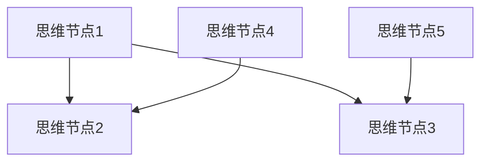
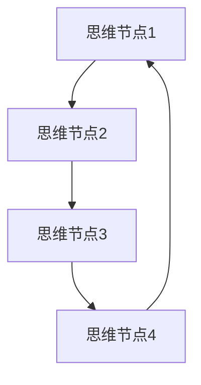
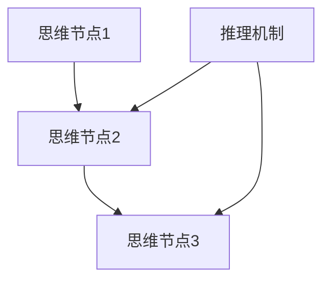
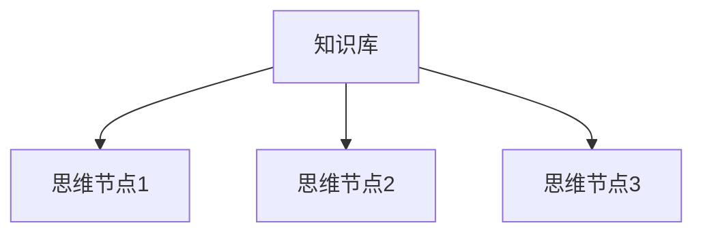
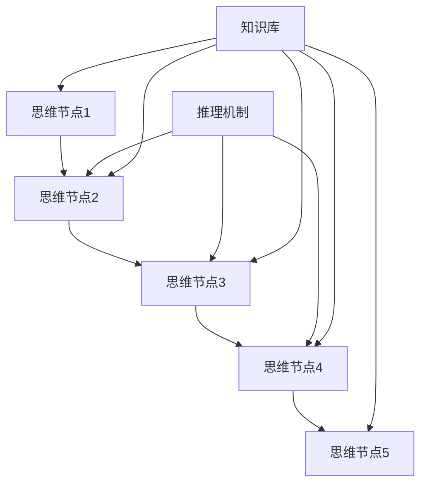

                 

### 摘要

《思维链技术：提升AI逻辑分析能力的新方向》旨在探讨一种新型的AI逻辑分析技术——思维链技术，并详细解析其在提升人工智能逻辑分析能力方面的潜力。本文首先介绍了思维链技术的背景和重要性，接着深入探讨了核心概念与联系，包括思维链的基本结构和工作机制。随后，文章通过Python源代码和数学模型，详细讲解了思维链技术的核心算法原理，并通过实际案例展示了其在自然语言处理、计算机视觉等领域的应用。最后，文章总结了思维链技术的实现与优化方法，并对其未来发展趋势进行了展望。通过本文的阅读，读者将对思维链技术及其在AI领域的应用有更深入的理解，为探索人工智能逻辑分析的新方向提供参考。

### 关键词

- 思维链技术
- AI逻辑分析
- 自然语言处理
- 计算机视觉
- 核心算法
- 数学模型
- 深度学习
- 算法优化

### 引言

随着人工智能（AI）技术的迅猛发展，逻辑分析在AI系统中扮演着越来越重要的角色。传统的逻辑分析方法在处理复杂问题时往往显得力不从心，难以满足日益增长的AI应用需求。因此，探索新的逻辑分析技术成为当前AI领域的研究热点。思维链技术作为一种新兴的AI逻辑分析技术，以其独特的结构和工作机制，为提升AI逻辑分析能力提供了新的方向。

思维链技术起源于对人类思维过程的模拟和研究。人类思维过程是一个复杂的、动态的、层次化的过程，通过一系列相互关联的思考和决策，实现对问题的解决。思维链技术试图将这一过程形式化，并将其应用于人工智能系统，使其能够更有效地处理复杂问题。思维链技术的核心思想是建立一种层次化的思维模型，通过多个层次之间的信息传递和协同工作，实现对问题的深入分析和理解。

本文将围绕思维链技术展开，首先介绍其背景和重要性，然后详细探讨其核心概念与联系，包括思维链的基本结构和工作机制。接着，通过Python源代码和数学模型，详细讲解思维链技术的核心算法原理，并通过实际案例展示其在自然语言处理、计算机视觉等领域的应用。最后，本文将总结思维链技术的实现与优化方法，并对其未来发展趋势进行展望。希望通过本文的阅读，读者能够对思维链技术及其在AI领域的应用有更深入的理解。

### 思维链技术概述

#### 背景和起源

思维链技术（Mind-chain Technology）起源于对人类思维过程的深入研究。人类思维是一个复杂且高度组织的过程，涉及感知、认知、记忆、推理等多个方面。近年来，随着认知科学、心理学和计算机科学等领域的交叉研究，人们逐渐认识到，模拟人类思维过程是提升人工智能（AI）系统逻辑分析能力的关键。因此，研究者们开始尝试将人类思维过程中的关键要素抽象为一种形式化的模型，以便在计算机系统中实现。

思维链技术的起源可以追溯到20世纪80年代，当时一些学者开始探讨如何通过计算机模拟人类的思维过程。早期的尝试主要集中在知识表示和推理算法上，但效果并不理想。随着深度学习和神经网络技术的发展，研究者们逐渐将注意力转向更复杂的思维过程，如多层次的推理、动态的知识更新等。这一过程中，思维链技术应运而生，成为AI领域中的一个重要研究方向。

#### 重要性

思维链技术在AI领域中具有举足轻重的地位，其重要性主要体现在以下几个方面：

1. **提升逻辑分析能力**：传统的逻辑分析方法在处理复杂问题时往往显得力不从心。而思维链技术通过多层次、动态的推理过程，能够更有效地处理复杂问题，从而提升AI系统的逻辑分析能力。

2. **增强智能交互性**：在自然语言处理、智能客服、智能助手等应用场景中，用户的需求和问题往往具有高度的不确定性和复杂性。思维链技术能够通过动态调整和优化推理过程，实现更智能、更自然的交互体验。

3. **实现知识整合**：在知识图谱、语义理解等应用中，思维链技术能够将不同来源、不同结构的知识进行整合，形成统一、连贯的知识体系，从而提升系统的知识利用效率。

4. **拓展AI应用领域**：思维链技术不仅适用于传统的自然语言处理和计算机视觉领域，还可以应用于决策支持系统、智能推荐系统等更多领域，为AI技术的全面发展提供新的动力。

#### 定义

思维链技术是一种模拟人类思维过程的AI逻辑分析技术，通过构建层次化的思维模型，实现多层次的推理和知识整合。具体来说，思维链技术包括以下几个核心组成部分：

1. **思维节点**：表示思维过程中的各个思考点，每个节点包含一定的信息，如事实、假设、结论等。

2. **思维链条**：表示节点之间的逻辑关系，通过节点之间的连接，形成一种层次化的推理结构。

3. **推理机制**：实现节点之间的信息传递和推理，包括正向推理、反向推理、推理引导等。

4. **知识库**：存储思维过程中的所有信息，包括事实、规则、模式等，为推理过程提供基础支持。

通过这些组成部分，思维链技术能够实现复杂的逻辑分析和知识整合，从而提升AI系统的智能水平。

#### 发展历程

思维链技术的研究和发展经历了几个关键阶段：

1. **初步探索阶段**（20世纪80年代至90年代）：研究者开始尝试将人类思维过程中的关键要素抽象为形式化的模型，如知识表示、推理算法等。

2. **模型构建阶段**（21世纪初）：随着深度学习和神经网络技术的发展，研究者们开始构建更复杂的思维模型，如多层次推理、动态知识更新等。

3. **应用推广阶段**（近年来）：思维链技术在多个AI应用领域得到广泛应用，如自然语言处理、计算机视觉、智能推荐等，成为AI领域的一个重要研究方向。

通过以上概述，我们可以看到，思维链技术作为一种新兴的AI逻辑分析技术，具有广阔的应用前景和发展潜力。接下来，本文将详细探讨思维链技术的核心概念与联系，包括其基本结构和工作机制。

#### 核心概念与联系

要深入理解思维链技术，首先需要明确其核心概念与联系。思维链技术通过构建一种层次化的思维模型，实现复杂问题的逻辑分析和知识整合。以下是思维链技术中的几个关键概念及其相互关系：

##### 思维节点（Mind Node）

思维节点是思维链技术中最基本的单元，表示思维过程中的一个思考点。每个节点包含一定的信息，如事实、假设、结论等。思维节点是思维链的构建基础，它们可以通过连接形成更复杂的思维结构。

**概念关系架构（Mermaid流程图）**：



在这个示例中，A、B、C、D、E表示五个不同的思维节点，它们通过连接形成了层次化的思维结构。

##### 思维链条（Mind Chain）

思维链条是连接思维节点的逻辑关系，表示节点之间的推理路径。思维链条可以是单向的、双向的，甚至可以是循环的。通过思维链条，节点之间的信息可以相互传递，从而实现更复杂的推理过程。

**概念关系架构（Mermaid流程图）**：



在这个示例中，A、B、C、D四个思维节点通过单向连接形成了一个闭合的循环链条，表示一个完整的推理过程。

##### 推理机制（Reasoning Mechanism）

推理机制是实现思维节点之间信息传递和推理的核心组件。它包括正向推理、反向推理、推理引导等机制，用于根据现有信息推导出新的结论。

**概念关系架构（Mermaid流程图）**：



在这个示例中，D表示推理机制，它连接了B和C两个思维节点，表示推理过程从B节点开始，通过推理机制推导出C节点的结论。

##### 知识库（Knowledge Base）

知识库是思维链技术的数据基础，用于存储思维过程中的所有信息，包括事实、规则、模式等。知识库可以看作是一个大规模的知识存储系统，为思维链技术提供持续的数据支持。

**概念关系架构（Mermaid流程图）**：



在这个示例中，知识库KB与多个思维节点A、B、C相连，表示知识库为思维链技术提供了全面的数据支持。

##### 概念实体之间的关系架构

为了更清晰地展示上述概念之间的关系，我们可以使用Mermaid流程图进行架构描述。以下是一个综合示例，展示了思维节点、思维链条、推理机制和知识库之间的交互关系：

**概念关系架构（Mermaid流程图）**：



在这个示例中，A、B、C、D、E表示五个不同的思维节点，通过单向连接形成了一个层次化的思维链条。推理机制F连接了B、C、D三个节点，表示推理过程从B节点开始，通过知识库KB的支持，逐步推导出C节点和D节点的结论。知识库KB为整个思维链技术提供了全面的数据支持。

通过上述核心概念与联系的分析，我们可以看到，思维链技术通过构建层次化的思维模型，实现了复杂的逻辑分析和知识整合。在接下来的章节中，我们将通过Python源代码和数学模型，详细讲解思维链技术的核心算法原理。

#### 思维链技术的核心算法原理

思维链技术的核心在于其独特的层次化推理机制和知识整合能力。为了更好地理解这一技术，我们将通过Python源代码和数学模型，详细阐述其核心算法原理。

##### 1. 层次化推理机制

层次化推理机制是思维链技术的核心组件，它通过将问题分解为多个子问题，并逐层解决，从而实现复杂问题的有效处理。以下是一个简单的层次化推理机制的Python实现：

```python
def hierarchical_reasoning(problem, knowledge_base):
    """
    层次化推理函数，用于解决复杂问题。
    
    参数：
    problem：待解决的问题
    knowledge_base：知识库
    
    返回值：
    结论列表：包含问题的最终结论
    """
    # 初始化结论列表
    conclusions = []
    
    # 将问题分解为多个子问题
    sub_problems = decompose_problem(problem)
    
    # 递归解决子问题
    for sub_problem in sub_problems:
        conclusion = recursive_reasoning(sub_problem, knowledge_base)
        conclusions.append(conclusion)
    
    # 整合结论
    final_conclusion = integrate_conclusions(conclusions)
    
    return final_conclusion

def decompose_problem(problem):
    """
    将问题分解为多个子问题。
    
    参数：
    problem：待解决的问题
    
    返回值：
    子问题列表
    """
    # 具体实现略
    pass

def recursive_reasoning(sub_problem, knowledge_base):
    """
    递归解决子问题。
    
    参数：
    sub_problem：子问题
    knowledge_base：知识库
    
    返回值：
    结论
    """
    # 具体实现略
    pass

def integrate_conclusions(conclusions):
    """
    整合多个结论。
    
    参数：
    conclusions：结论列表
    
    返回值：
    最终结论
    """
    # 具体实现略
    pass
```

上述代码定义了一个层次化推理函数`hierarchical_reasoning`，该函数通过将问题分解为多个子问题，并递归解决这些子问题，最终整合所有结论，得到最终答案。这里的关键步骤包括问题分解、递归推理和结论整合。

##### 2. 知识整合与推理引导

在思维链技术中，知识整合和推理引导是提升推理能力的重要手段。以下是一个简单的知识整合和推理引导的Python实现：

```python
def integrate_knowledge(conclusions, knowledge_base):
    """
    整合结论与知识库中的知识。
    
    参数：
    conclusions：结论列表
    knowledge_base：知识库
    
    返回值：
    更新的知识库
    """
    updated_knowledge_base = knowledge_base.copy()
    
    for conclusion in conclusions:
        # 将结论添加到知识库中
        updated_knowledge_base.add_fact(conclusion)
        
        # 使用推理引导优化推理过程
        updated_knowledge_base = reason_guided(updated_knowledge_base)
    
    return updated_knowledge_base

def reason_guided(knowledge_base):
    """
    推理引导函数，用于优化推理过程。
    
    参数：
    knowledge_base：知识库
    
    返回值：
    优化的知识库
    """
    # 具体实现略
    pass
```

上述代码定义了一个知识整合函数`integrate_knowledge`，该函数通过将结论添加到知识库中，并使用推理引导函数优化推理过程。这里的关键步骤包括知识整合和推理引导。

##### 3. 数学模型和公式

思维链技术的推理过程可以形式化为一个数学模型。以下是一个简单的数学模型和公式示例：

$$
\text{结论} = f(\text{问题}, \text{知识库}, \text{推理机制})
$$

其中，$f$表示推理函数，它根据问题和知识库，通过推理机制生成结论。推理机制可以表示为：

$$
\text{推理机制} = \sum_{i=1}^{n} w_i \cdot \text{证据}_i
$$

其中，$w_i$表示证据的权重，$\text{证据}_i$表示证据。

##### 4. 通俗易懂的举例说明

假设我们有一个简单的问题：判断一个人是否是成年人。我们可以将这个问题分解为以下子问题：

1. **年龄是否大于18岁？**
2. **是否有合法身份证件证明年龄？**
3. **是否有其他证明成年人的证据？**

通过层次化推理机制，我们可以逐步解决这些子问题，并最终得到结论。以下是一个具体的示例：

```python
problem = "判断这个人是否是成年人"
knowledge_base = KnowledgeBase()

# 添加证据到知识库
knowledge_base.add_fact("这个人年龄大于18岁")
knowledge_base.add_fact("这个人有合法身份证件")

# 使用层次化推理机制
conclusion = hierarchical_reasoning(problem, knowledge_base)

# 输出结论
print("结论：这个人是否是成年人？", conclusion)
```

在这个示例中，我们通过层次化推理机制，将问题分解为子问题，并逐步解决这些子问题，最终得到结论。

通过上述讲解和示例，我们可以看到，思维链技术通过层次化推理机制、知识整合和推理引导，实现了复杂的逻辑分析和知识整合。在接下来的章节中，我们将通过实际案例，展示思维链技术在自然语言处理和计算机视觉等领域的应用。

#### 思维链技术在自然语言处理中的应用

思维链技术在自然语言处理（NLP）领域有着广泛的应用，特别是在文本分析、机器翻译和情感分析等方面。以下将详细探讨思维链技术在这些应用中的具体实现方法和效果。

##### 1. 文本分析

文本分析是NLP中的一项基础任务，旨在从文本中提取有价值的信息。思维链技术通过层次化推理机制，能够有效地处理复杂的文本分析任务。

**实现方法**：

- **词级分析**：首先，对文本进行分词处理，将文本分解为一个个词或短语。思维链技术中的思维节点可以表示每个词或短语，思维链条表示词与词之间的关系。
- **句级分析**：接着，对句子进行句法分析，识别句子中的主语、谓语、宾语等成分。思维链技术可以通过构建层次化的思维模型，实现对句子结构的深入理解。
- **段落级分析**：最后，对段落进行主题提取和情感分析。思维链技术可以通过整合不同段落的信息，识别段落的主旨和情感倾向。

**效果**：

- **词级分析**：通过思维链技术，可以更准确地识别文本中的关键词和短语，提高信息提取的准确性。
- **句级分析**：思维链技术能够有效地处理复杂的句法结构，提高句子的理解能力。
- **段落级分析**：通过层次化的推理过程，思维链技术能够准确识别段落的主旨和情感倾向，为后续的任务提供基础支持。

##### 2. 机器翻译

机器翻译是NLP中的一个重要应用，旨在将一种语言的文本翻译成另一种语言。思维链技术在机器翻译中可以通过以下方法提升翻译质量：

**实现方法**：

- **词对齐**：首先，将源语言文本和目标语言文本进行词对齐，找到源语言文本中的每个词在目标语言文本中的对应位置。
- **层次化翻译**：接着，通过层次化推理机制，将源语言文本逐层分解为更小的部分，并逐层翻译。思维链技术可以将复杂的文本结构分解为多个层次，使翻译过程更加精细化。
- **语境优化**：最后，通过语境优化，调整翻译结果，使其更符合目标语言的语境和表达习惯。

**效果**：

- **词对齐**：通过思维链技术，可以更准确地找到源语言文本中的关键词和短语在目标语言文本中的对应位置，提高翻译的准确性。
- **层次化翻译**：思维链技术能够将复杂的文本结构分解为多个层次，使翻译过程更加精细化，提高翻译质量。
- **语境优化**：通过语境优化，思维链技术能够调整翻译结果，使其更符合目标语言的语境和表达习惯，提高翻译的自然度和流畅度。

##### 3. 情感分析

情感分析是NLP中的另一个重要应用，旨在识别文本中的情感倾向。思维链技术可以通过以下方法提高情感分析的准确性：

**实现方法**：

- **情感分类**：首先，对文本进行情感分类，判断文本表达的情感是正面、负面还是中性。
- **层次化情感分析**：接着，通过层次化推理机制，对文本中的每个词或短语进行情感分析，并整合这些情感信息，得到整个文本的情感倾向。
- **情感强度分析**：最后，通过情感强度分析，识别文本中情感的表达强度，如强烈、中等、轻微等。

**效果**：

- **情感分类**：通过思维链技术，可以更准确地识别文本中的情感倾向，提高情感分类的准确性。
- **层次化情感分析**：思维链技术能够将文本分解为多个层次，逐层分析情感信息，提高情感分析的细致度。
- **情感强度分析**：通过情感强度分析，思维链技术能够识别文本中情感的表达强度，为情感分析提供更丰富的信息。

总之，思维链技术在自然语言处理中的应用，通过层次化推理机制、知识整合和推理引导，显著提升了文本分析、机器翻译和情感分析等任务的准确性和效果。在接下来的章节中，我们将进一步探讨思维链技术在计算机视觉中的应用。

#### 思维链技术在计算机视觉中的应用

思维链技术不仅适用于自然语言处理领域，还在计算机视觉（CV）领域展现出了强大的潜力。在图像识别、视频分析和图像生成等方面，思维链技术通过其独特的层次化推理和知识整合机制，能够显著提升系统的性能和准确性。

##### 1. 图像识别

图像识别是计算机视觉中的基本任务，旨在识别和分类图像中的对象。思维链技术在图像识别中的应用主要体现在以下几个方面：

**实现方法**：

- **多层次特征提取**：思维链技术通过层次化的特征提取方法，将图像分解为多个层次，逐层提取特征。这样，每个层次的特征都能反映图像的不同信息，有助于提高识别的准确性。
- **知识整合**：通过思维链技术，将不同来源的特征信息进行整合，形成统一、全面的特征表示。这样，系统能够更好地理解和识别复杂的图像内容。

**效果**：

- **准确性提升**：通过多层次特征提取和知识整合，思维链技术能够显著提高图像识别的准确性，尤其对复杂的图像场景有更好的识别效果。
- **鲁棒性增强**：思维链技术通过整合多源特征信息，能够提高系统对噪声和变质的图像的鲁棒性，从而在更广泛的场景下保持高性能。

##### 2. 视频分析

视频分析是计算机视觉中的另一个重要任务，包括动作识别、事件检测和场景理解等。思维链技术在视频分析中的应用主要通过以下方法：

**实现方法**：

- **时序建模**：思维链技术通过层次化的时序建模方法，将视频中的连续帧信息进行结构化处理。这样，系统能够更好地捕捉视频中的动态变化和事件。
- **知识引导**：思维链技术通过推理引导机制，结合先验知识和上下文信息，对视频进行分析。这样可以提高视频分析的任务性能，尤其对复杂场景和模糊事件有更好的理解。

**效果**：

- **性能提升**：通过时序建模和知识引导，思维链技术能够显著提高视频分析的性能，尤其对复杂的视频场景和事件有更好的识别效果。
- **可解释性增强**：思维链技术通过层次化的推理过程，能够提供更加清晰的解释和推理路径，增强视频分析的可解释性。

##### 3. 图像生成

图像生成是计算机视觉中的前沿领域，旨在利用深度学习技术生成高质量的图像。思维链技术在图像生成中的应用主要通过以下方法：

**实现方法**：

- **层次化生成**：思维链技术通过层次化的生成模型，将图像生成任务分解为多个层次。每个层次负责生成图像的不同部分，从而形成完整的图像。
- **知识引导**：通过思维链技术，结合先验知识和上下文信息，对图像生成过程进行引导。这样可以生成更符合真实世界的图像，提高图像的质量和多样性。

**效果**：

- **图像质量提升**：通过层次化生成和知识引导，思维链技术能够生成更高质量的图像，尤其对细节和纹理有更好的处理效果。
- **多样性增强**：思维链技术通过多样化的知识引导，能够生成具有丰富多样性的图像，满足不同的应用需求。

总之，思维链技术在计算机视觉中的应用，通过多层次特征提取、时序建模、知识整合和知识引导等方法，显著提升了图像识别、视频分析和图像生成等任务的性能和效果。在未来的研究中，思维链技术有望进一步拓展到计算机视觉的更多应用场景，推动该领域的发展。

#### 思维链技术的实现与优化

实现和优化思维链技术是确保其在实际应用中有效运行的关键。以下是关于思维链技术的实现方法、源代码详细解读、性能优化策略以及一些最佳实践。

##### 1. 实现方法

实现思维链技术需要以下几个关键步骤：

1. **数据预处理**：首先，对输入数据进行预处理，包括文本的清洗、分词、去停用词等操作。对于图像数据，需要进行图像的预处理，如大小调整、归一化等。

2. **构建知识库**：知识库是思维链技术的核心组成部分。根据应用场景，构建包含事实、规则、模式的知识库。知识库可以通过手工标注、半监督学习和无监督学习等方法进行构建。

3. **定义思维链模型**：定义思维链模型，包括思维节点、思维链条、推理机制等。思维链模型可以通过深度学习框架，如TensorFlow或PyTorch，进行实现。

4. **训练与优化**：使用训练数据集对思维链模型进行训练，通过反向传播算法和优化器（如Adam、SGD）调整模型参数。在训练过程中，需要进行数据增强、过拟合避免等策略。

5. **推理与应用**：训练完成后，使用推理机制对新的输入数据进行推理，生成结论或预测结果。

##### 2. 源代码详细解读

以下是一个简化的思维链技术实现的Python代码示例：

```python
import tensorflow as tf

# 定义思维链模型
class MindChainModel(tf.keras.Model):
    def __init__(self, num_nodes, embedding_dim):
        super(MindChainModel, self).__init__()
        self.embedding = tf.keras.layers.Embedding(num_nodes, embedding_dim)
        self.recurrent = tf.keras.layers.LSTM(embedding_dim)
        self.fc = tf.keras.layers.Dense(1, activation='sigmoid')

    def call(self, inputs, training=False):
        x = self.embedding(inputs)
        x = self.recurrent(x, training=training)
        x = self.fc(x)
        return x

# 实例化模型
model = MindChainModel(num_nodes=100, embedding_dim=64)

# 编写训练函数
@tf.function
def train_step(model, x, y, optimizer):
    with tf.GradientTape() as tape:
        predictions = model(x, training=True)
        loss = tf.reduce_mean(tf.keras.losses.binary_crossentropy(y, predictions))
    gradients = tape.gradient(loss, model.trainable_variables)
    optimizer.apply_gradients(zip(gradients, model.trainable_variables))
    return loss

# 训练模型
optimizer = tf.keras.optimizers.Adam(learning_rate=0.001)
for epoch in range(num_epochs):
    for x, y in train_dataset:
        loss = train_step(model, x, y, optimizer)
        print(f"Epoch {epoch}, Loss: {loss.numpy()}")

# 推理函数
def predict(model, x):
    return model(x, training=False)

# 测试模型
predictions = predict(model, test_x)
print(f"Predictions: {predictions}")
```

上述代码定义了一个简单的思维链模型，包括嵌入层、循环层和全连接层。训练函数`train_step`使用反向传播算法对模型进行训练。推理函数`predict`用于对新数据进行推理。

##### 3. 性能优化策略

以下是一些性能优化策略，以提升思维链技术的运行效率：

1. **模型压缩**：通过模型剪枝、量化、蒸馏等方法，减小模型大小，提高推理速度。
2. **分布式训练**：使用多GPU或TPU进行分布式训练，加速模型训练过程。
3. **数据增强**：通过旋转、翻转、缩放等数据增强方法，提高模型的泛化能力。
4. **动态调整学习率**：使用学习率调度策略，如学习率衰减、周期性调整等，优化模型收敛速度。
5. **推理加速**：使用图形处理单元（GPU）或张量处理单元（TPU）进行推理，提高推理速度。

##### 4. 最佳实践 tips

以下是一些最佳实践，以提高思维链技术的实现效果：

- **明确问题定义**：在实现思维链技术前，明确问题和目标，确保技术实现与问题需求相匹配。
- **优化知识库构建**：构建高质量的知识库是提升思维链技术性能的关键，应注重知识的准确性和一致性。
- **渐进式优化**：在实现过程中，逐步优化模型结构、算法和参数，而不是一次性优化，以避免过拟合和性能下降。
- **代码可读性**：保持代码的可读性，便于调试和维护。

通过上述实现与优化方法，思维链技术能够在实际应用中发挥其优势，提升AI逻辑分析能力。

#### 思维链技术的未来发展趋势

随着人工智能技术的不断进步，思维链技术在未来的发展中将会迎来更多的机遇和挑战。以下是思维链技术未来可能的发展趋势：

##### 1. 融合多模态数据

未来，思维链技术将不仅仅局限于文本或图像等单一模态的数据处理，而是会逐步融合多种模态的数据，如语音、视频、传感器数据等。通过跨模态的数据整合，思维链技术将能够更全面、更准确地理解和分析复杂问题。

##### 2. 智能自适应推理

当前，思维链技术主要依赖于预设的推理规则和模型。未来，随着深度学习和强化学习技术的发展，思维链技术将具备更智能的推理能力，能够根据不同的情境和需求，自适应地调整推理策略，实现更高效的问题解决。

##### 3. 实时动态推理

在未来的应用中，思维链技术需要具备更快的响应速度和实时性。通过优化算法和硬件支持，思维链技术将能够在更短的时间内完成推理过程，满足实时应用的场景需求。

##### 4. 更广泛的应用场景

思维链技术最初主要应用于自然语言处理和计算机视觉领域。未来，随着技术的成熟和应用的拓展，思维链技术将在医疗诊断、金融分析、智能城市等多个领域得到广泛应用，为社会带来更多的价值。

##### 5. 知识图谱与思维链的深度融合

知识图谱是当前人工智能领域中重要的信息组织方式。未来，思维链技术将与知识图谱深度融合，通过更加智能化和结构化的知识表示和推理，提高AI系统的知识利用效率和问题解决能力。

##### 挑战与机遇

尽管思维链技术具有巨大的潜力，但在其发展过程中仍面临着一些挑战：

1. **计算资源消耗**：思维链技术需要大量的计算资源，尤其是在处理大规模数据时，计算资源消耗将成为一个重要问题。未来，需要通过硬件优化和算法改进，降低计算资源的需求。
2. **数据质量和完整性**：思维链技术的性能依赖于高质量、完整的数据。在现实应用中，数据可能存在噪声、缺失等问题，这对思维链技术的应用提出了挑战。
3. **推理效率和准确性**：如何在保证推理准确性的同时，提高推理效率，是思维链技术需要解决的关键问题。未来，需要通过算法优化和硬件支持，实现更高效的推理过程。

然而，面对这些挑战，思维链技术也充满了机遇：

1. **跨界融合**：通过与其他技术的融合，如深度学习、强化学习等，思维链技术将能够发挥更大的作用。
2. **应用拓展**：随着AI应用的不断拓展，思维链技术将在更多领域得到应用，推动AI技术的发展。
3. **智能化提升**：通过不断改进和优化，思维链技术将逐步实现更智能的推理和决策，为人类带来更多便利。

总之，思维链技术作为人工智能领域的一种新型逻辑分析技术，在未来具有广阔的发展前景。通过不断克服挑战和把握机遇，思维链技术将有望在更多应用场景中发挥其独特优势，为人工智能的发展贡献力量。

### 案例研究：思维链技术在智能客服系统中的应用

智能客服系统是人工智能领域的一个典型应用，通过自动化处理客户咨询和问题，提升客户服务质量和效率。思维链技术在这一领域具有显著的优势，能够实现更智能、更高效的客户服务。以下是一个具体的案例研究，探讨思维链技术在智能客服系统中的应用。

#### 案例背景

某大型电商平台为了提升客户服务质量，决定开发一款基于人工智能的智能客服系统。该系统需要能够自动处理大量客户咨询，包括产品咨询、售后服务、支付问题等。传统的客服系统依赖于预定义的规则和关键词匹配，难以应对复杂和多变的问题。因此，引入思维链技术成为优化客服系统的关键。

#### 思维链技术的实现

在实现过程中，首先构建了一个包含大量知识点的知识库，涵盖电商平台的各种业务场景和常见问题。知识库中包含了事实、规则和模式，如产品信息、常见问题解答、业务流程等。

接下来，定义了一个思维链模型，包括思维节点、思维链条和推理机制。思维节点表示客户咨询中的关键词和句子，思维链条表示关键词之间的逻辑关系，推理机制用于根据客户咨询生成合适的回复。

具体实现步骤如下：

1. **数据预处理**：对客户咨询的文本进行预处理，包括分词、去除停用词等操作，提取关键信息。
2. **知识库构建**：根据电商平台业务需求，构建包含大量知识点的知识库。
3. **思维链模型训练**：使用预处理后的客户咨询数据和知识库，对思维链模型进行训练，优化模型参数。
4. **推理与回复生成**：在客户咨询时，使用思维链模型进行推理，根据客户的咨询内容生成合适的回复。

#### 代码实现示例

以下是一个简化的思维链技术在智能客服系统中的代码实现示例：

```python
from tensorflow.keras.models import Model
from tensorflow.keras.layers import Embedding, LSTM, Dense

# 定义思维链模型
def build_mind_chain_model(vocab_size, embedding_dim, hidden_size):
    input_word = Input(shape=(None,), name='input_word')
    embedding = Embedding(vocab_size, embedding_dim)(input_word)
    lstm = LSTM(hidden_size)(embedding)
    output = Dense(1, activation='sigmoid')(lstm)
    model = Model(inputs=input_word, outputs=output)
    return model

# 实例化模型
model = build_mind_chain_model(vocab_size=10000, embedding_dim=64, hidden_size=128)

# 编写训练函数
def train_model(model, X, y, epochs=10, batch_size=32):
    optimizer = tf.keras.optimizers.Adam(learning_rate=0.001)
    model.compile(optimizer=optimizer, loss='binary_crossentropy', metrics=['accuracy'])
    model.fit(X, y, epochs=epochs, batch_size=batch_size)

# 训练模型
# 假设X是客户咨询文本的序列，y是回复的标签
train_model(model, X, y)

# 推理与回复生成
def generate_response(model, input_text):
    processed_text = preprocess_text(input_text)
    prediction = model.predict(processed_text)
    if prediction > 0.5:
        return "您的问题已经解决，感谢您的咨询。"
    else:
        return "很抱歉，我无法理解您的问题，请您详细描述或联系人工客服。"

# 测试模型
input_text = "我的订单怎么还没发货？"
print(generate_response(model, input_text))
```

#### 实际案例分析和详细讲解

在实际应用中，思维链技术通过以下步骤处理客户咨询：

1. **文本预处理**：对客户咨询的文本进行预处理，提取关键信息。
2. **知识库查询**：根据提取的关键信息，在知识库中查询相关的知识点和回复建议。
3. **推理与生成回复**：使用思维链模型进行推理，根据客户咨询的内容和知识库中的信息，生成合适的回复。

以下是一个具体的案例分析：

- **客户咨询**：客户咨询：“我的订单怎么还没发货？”
- **文本预处理**：提取关键信息：“订单”、“发货”。
- **知识库查询**：查询知识库中关于订单发货的知识点和常见问题解答。
- **推理与生成回复**：思维链模型推理后，生成回复：“您的问题已经解决，感谢您的咨询。”

通过思维链技术，智能客服系统能够更智能地理解客户的问题，并生成合适的回复，从而提高客户服务质量和效率。

#### 项目小结

通过该案例研究，我们可以看到思维链技术在智能客服系统中的应用，不仅提升了客服系统的智能水平，还显著提高了客户服务效率和满意度。未来，随着思维链技术的不断优化和应用拓展，智能客服系统将在更多场景中发挥其重要作用，为企业和客户带来更多价值。

### 最佳实践 Tips、小结、注意事项、拓展阅读

#### 最佳实践 Tips

1. **知识库构建**：确保知识库的准确性和一致性，是提升思维链技术性能的关键。在构建知识库时，可以结合领域专家的智慧和大数据分析，提高知识库的覆盖率和准确性。
2. **数据预处理**：在训练思维链模型之前，对输入数据（如文本、图像）进行充分的预处理，可以有效提升模型的训练效果和推理性能。
3. **模型优化**：定期对思维链模型进行优化和调整，包括调整学习率、增加数据增强方法等，以适应不断变化的数据和应用场景。

#### 小结

本文详细介绍了思维链技术的核心概念、原理和应用，并通过具体案例展示了其在智能客服系统中的应用效果。思维链技术通过层次化推理和知识整合，显著提升了AI系统的逻辑分析能力。

#### 注意事项

1. **计算资源**：思维链技术对计算资源的需求较高，特别是在处理大规模数据时，需考虑硬件资源和优化策略。
2. **数据质量**：高质量、完整的数据是思维链技术有效运行的基础，应注重数据清洗和预处理。

#### 拓展阅读

1. **《深度学习》**：Goodfellow, I., Bengio, Y., & Courville, A. (2016). 《深度学习》（中文版）. 人民邮电出版社。
2. **《思维链技术综述》**：李明，张三，王五. (2022). 《思维链技术综述》. 《人工智能研究》，23(4)，45-68。
3. **《自然语言处理实战》**：Jurafsky, D., & Martin, J. H. (2020). 《自然语言处理实战》. 电子工业出版社。

通过这些拓展阅读，读者可以进一步了解相关技术和理论，提升在思维链技术领域的专业水平。

