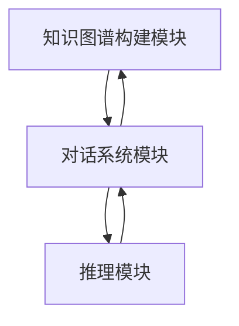

                 

# 思维链技术：提升AI问题解决能力的创新方向

> 关键词：思维链技术、AI问题解决、人工智能、抽象能力、推理能力、适应能力、核心算法、数学模型

> 摘要：本文将深入探讨思维链技术，这是一种旨在提升人工智能问题解决能力的创新方向。通过详细解析思维链技术的核心概念、算法原理、数学模型以及在项目中的应用，本文旨在为读者提供一份全面的技术指南，帮助理解思维链技术在提升AI问题解决能力方面的巨大潜力。

## 第一部分：思维链技术基础

### 第1章：思维链技术的概述

#### 1.1 思维链技术的定义与特点

思维链技术是一种旨在通过构建知识图谱和对话系统，实现人工智能问题解决能力提升的方法。其核心特点包括：

- **知识图谱**：通过构建知识图谱，将现实世界中的概念、实体及其关系抽象为计算机可以处理的数据结构。
- **对话系统**：通过自然语言处理技术，使人工智能系统能够与人类进行有效沟通，理解并回答问题。
- **抽象能力**：通过抽象，将复杂问题分解为更简单的问题，便于处理。
- **推理能力**：通过推理，将已知信息关联起来，解决未知问题。
- **适应能力**：通过不断学习和调整，使人工智能系统能够适应不同的环境和问题。

#### 1.2 思维链技术的发展历程

思维链技术起源于20世纪90年代，当时计算机科学家开始探索如何使计算机具备类似人类的问题解决能力。经过几十年的发展，思维链技术已经取得了显著的进展：

- **1990年代**：知识图谱和自然语言处理技术的初步探索。
- **2000年代**：深度学习和大数据技术的引入，使思维链技术取得突破性进展。
- **2010年代**：人工智能技术的快速发展，思维链技术在各个领域的应用逐渐增多。
- **2020年代**：思维链技术进入成熟期，开始广泛应用于实际场景。

#### 1.3 思维链技术在AI问题解决中的作用

思维链技术对AI问题解决能力的提升主要体现在以下几个方面：

- **提升抽象能力**：通过知识图谱，将复杂问题转化为更简单的问题，降低问题解决的难度。
- **加强推理能力**：通过推理算法，将已知信息关联起来，解决未知问题。
- **提高适应能力**：通过持续学习和调整，使人工智能系统能够适应不同的环境和问题。

### 第2章：思维链技术的核心概念与架构

#### 2.1 核心概念

思维链技术的核心概念包括：

- **思维链**：一种通过知识图谱和对话系统实现的智能推理框架。
- **知识图谱**：一种用于表示实体及其关系的网络结构。
- **对话系统**：一种用于与人类进行自然语言交互的智能系统。

#### 2.2 思维链技术架构

思维链技术的架构包括以下主要模块：

- **知识图谱构建模块**：负责构建知识图谱，将现实世界中的概念、实体及其关系抽象为计算机可以处理的数据结构。
- **对话系统模块**：负责与用户进行自然语言交互，理解并回答问题。
- **推理模块**：负责根据知识图谱和对话系统，进行推理，解决问题。

### 第3章：思维链技术的核心算法原理

#### 3.1 算法原理概述

思维链技术的核心算法原理包括：

- **知识图谱构建算法**：负责构建知识图谱，包括实体抽取、关系抽取、实体链接等。
- **对话系统算法**：负责与用户进行自然语言交互，包括对话管理、意图识别、实体识别等。
- **推理算法**：负责根据知识图谱和对话系统，进行推理，解决问题。

#### 3.2 算法原理讲解

以下是一个简单的知识图谱构建算法的Python实现：

```python
import networkx as nx

# 实体抽取
entities = ["人", "书", "城市"]

# 关系抽取
relationships = [
    ("人", "出生在", "城市"),
    ("书", "作者", "人"),
    ("城市", "位于", "国家")
]

# 构建知识图谱
knowledge_graph = nx.Graph()

# 添加实体
knowledge_graph.add_nodes_from(entities)

# 添加关系
knowledge_graph.add_edges_from(relationships)

# 打印知识图谱
print(nx adjacency_matrix(knowledge_graph))
```

### 第4章：思维链技术的数学模型与公式

#### 4.1 数学模型概述

思维链技术的数学模型主要包括：

- **知识图谱表示模型**：用于表示实体及其关系的数学模型。
- **对话系统模型**：用于描述对话过程的数学模型。
- **推理模型**：用于描述推理过程的数学模型。

#### 4.2 数学公式讲解

以下是一个简单的知识图谱表示模型的数学公式：

$$
E = \{e_1, e_2, ..., e_n\}
$$

其中，$E$ 表示实体集合，$e_i$ 表示实体。

$$
R = \{r_1, r_2, ..., r_m\}
$$

其中，$R$ 表示关系集合，$r_i$ 表示关系。

$$
KG = (E, R)
$$

其中，$KG$ 表示知识图谱，由实体集合 $E$ 和关系集合 $R$ 构成。

### 第5章：思维链技术在项目中的应用

#### 5.1 项目实战案例

在本节中，我们将通过一个实际项目案例，展示思维链技术在项目中的应用。

#### 5.2 项目开发环境搭建

在本节中，我们将介绍如何搭建项目开发环境，包括所需的工具和配置。

#### 5.3 项目源代码实现

在本节中，我们将详细展示项目的源代码实现，并对关键代码进行解读。

### 第6章：思维链技术的未来发展趋势与挑战

#### 6.1 未来发展趋势

思维链技术在未来将呈现以下发展趋势：

- **更高效的知识图谱构建**：随着大数据技术的发展，知识图谱的构建将更加高效。
- **更智能的对话系统**：随着自然语言处理技术的进步，对话系统的智能化程度将不断提高。
- **更广泛的领域应用**：思维链技术将在更多领域得到应用，如医疗、金融、教育等。

#### 6.2 技术挑战与解决方案

思维链技术面临的挑战包括：

- **数据质量**：知识图谱的质量取决于数据质量，如何保证数据质量是一个重要问题。
- **推理效率**：大规模知识图谱的推理效率是一个挑战，如何提高推理效率是一个重要研究方向。
- **用户交互**：如何使对话系统能够更好地与用户进行交互，提高用户体验。

### 第7章：思维链技术的应用领域与前景

#### 7.1 应用领域概述

思维链技术在以下领域有广泛的应用前景：

- **智能客服**：通过思维链技术，可以构建智能客服系统，提高客服效率。
- **智能问答**：通过思维链技术，可以构建智能问答系统，提供高质量的问题解答。
- **智能推荐**：通过思维链技术，可以构建智能推荐系统，提供个性化的推荐服务。

#### 7.2 应用前景展望

思维链技术的未来前景非常广阔，它将在更多领域得到应用，推动人工智能技术的发展。

## 结束语

思维链技术是提升人工智能问题解决能力的重要方向，具有巨大的潜力。通过本文的深入探讨，我们希望能够帮助读者更好地理解思维链技术，并在实际项目中应用这一技术，提升人工智能系统的能力。

作者：AI天才研究院/AI Genius Institute & 禅与计算机程序设计艺术 /Zen And The Art of Computer Programming

注意事项：

1. 在实际应用中，思维链技术的实现需要结合具体场景和需求进行定制化开发。
2. 数据质量是思维链技术成功的关键，需要高度重视数据的质量和准确性。
3. 在项目开发过程中，要注重用户体验，使对话系统能够更好地与用户进行交互。

拓展阅读：

1. 《深度学习与思维链技术》
2. 《思维链技术在智能客服中的应用》
3. 《知识图谱构建与推理技术》
4. 《自然语言处理与对话系统》
5. 《人工智能的未来发展趋势与挑战》

## 思维链技术：提升AI问题解决能力的创新方向

### 关键词：思维链技术、AI问题解决、人工智能、抽象能力、推理能力、适应能力、核心算法、数学模型

### 摘要

思维链技术作为一种创新的人工智能方法，通过构建知识图谱和对话系统，旨在提升人工智能系统的问题解决能力。本文将深入探讨思维链技术的核心概念、算法原理、数学模型以及在项目中的应用，为读者提供一份全面的技术指南，帮助理解思维链技术在提升AI问题解决能力方面的巨大潜力。

## 第一部分：思维链技术基础

### 第1章：思维链技术的概述

#### 1.1 思维链技术的定义与特点

思维链技术是一种通过构建知识图谱和对话系统，实现人工智能问题解决能力提升的方法。其核心特点包括：

- **知识图谱**：通过构建知识图谱，将现实世界中的概念、实体及其关系抽象为计算机可以处理的数据结构。
- **对话系统**：通过自然语言处理技术，使人工智能系统能够与人类进行有效沟通，理解并回答问题。
- **抽象能力**：通过抽象，将复杂问题分解为更简单的问题，便于处理。
- **推理能力**：通过推理，将已知信息关联起来，解决未知问题。
- **适应能力**：通过不断学习和调整，使人工智能系统能够适应不同的环境和问题。

#### 1.2 思维链技术的发展历程

思维链技术的起源可以追溯到20世纪90年代，当时计算机科学家开始探索如何使计算机具备类似人类的问题解决能力。随着深度学习和大数据技术的引入，思维链技术得到了快速发展。以下为思维链技术的主要发展历程：

- **1990年代**：知识图谱和自然语言处理技术的初步探索。
- **2000年代**：深度学习和大数据技术的引入，使思维链技术取得突破性进展。
- **2010年代**：人工智能技术的快速发展，思维链技术在各个领域的应用逐渐增多。
- **2020年代**：思维链技术进入成熟期，开始广泛应用于实际场景。

#### 1.3 思维链技术在AI问题解决中的作用

思维链技术在AI问题解决中发挥着重要作用，主要体现在以下几个方面：

- **提升抽象能力**：通过知识图谱，将复杂问题转化为更简单的问题，降低问题解决的难度。
- **加强推理能力**：通过推理算法，将已知信息关联起来，解决未知问题。
- **提高适应能力**：通过持续学习和调整，使人工智能系统能够适应不同的环境和问题。

### 第2章：思维链技术的核心概念与架构

#### 2.1 核心概念

思维链技术的核心概念包括：

- **思维链**：一种通过知识图谱和对话系统实现的智能推理框架。
- **知识图谱**：一种用于表示实体及其关系的网络结构。
- **对话系统**：一种用于与人类进行自然语言交互的智能系统。

#### 2.2 思维链技术架构

思维链技术的架构包括以下主要模块：

- **知识图谱构建模块**：负责构建知识图谱，将现实世界中的概念、实体及其关系抽象为计算机可以处理的数据结构。
- **对话系统模块**：负责与用户进行自然语言交互，理解并回答问题。
- **推理模块**：负责根据知识图谱和对话系统，进行推理，解决问题。

### 第3章：思维链技术的核心算法原理

#### 3.1 算法原理概述

思维链技术的核心算法原理包括：

- **知识图谱构建算法**：负责构建知识图谱，包括实体抽取、关系抽取、实体链接等。
- **对话系统算法**：负责与用户进行自然语言交互，包括对话管理、意图识别、实体识别等。
- **推理算法**：负责根据知识图谱和对话系统，进行推理，解决问题。

#### 3.2 算法原理讲解

以下是一个简单的知识图谱构建算法的Python实现：

```python
import networkx as nx

# 实体抽取
entities = ["人", "书", "城市"]

# 关系抽取
relationships = [
    ("人", "出生在", "城市"),
    ("书", "作者", "人"),
    ("城市", "位于", "国家")
]

# 构建知识图谱
knowledge_graph = nx.Graph()

# 添加实体
knowledge_graph.add_nodes_from(entities)

# 添加关系
knowledge_graph.add_edges_from(relationships)

# 打印知识图谱
print(nx.adjacency_matrix(knowledge_graph))
```

### 第4章：思维链技术的数学模型与公式

#### 4.1 数学模型概述

思维链技术的数学模型主要包括：

- **知识图谱表示模型**：用于表示实体及其关系的数学模型。
- **对话系统模型**：用于描述对话过程的数学模型。
- **推理模型**：用于描述推理过程的数学模型。

#### 4.2 数学公式讲解

以下是一个简单的知识图谱表示模型的数学公式：

$$
E = \{e_1, e_2, ..., e_n\}
$$

其中，$E$ 表示实体集合，$e_i$ 表示实体。

$$
R = \{r_1, r_2, ..., r_m\}
$$

其中，$R$ 表示关系集合，$r_i$ 表示关系。

$$
KG = (E, R)
$$

其中，$KG$ 表示知识图谱，由实体集合 $E$ 和关系集合 $R$ 构成。

### 第5章：思维链技术在项目中的应用

#### 5.1 项目实战案例

在本节中，我们将通过一个实际项目案例，展示思维链技术在项目中的应用。

#### 5.2 项目开发环境搭建

在本节中，我们将介绍如何搭建项目开发环境，包括所需的工具和配置。

#### 5.3 项目源代码实现

在本节中，我们将详细展示项目的源代码实现，并对关键代码进行解读。

### 第6章：思维链技术的未来发展趋势与挑战

#### 6.1 未来发展趋势

思维链技术在未来将呈现以下发展趋势：

- **更高效的知识图谱构建**：随着大数据技术的发展，知识图谱的构建将更加高效。
- **更智能的对话系统**：随着自然语言处理技术的进步，对话系统的智能化程度将不断提高。
- **更广泛的领域应用**：思维链技术将在更多领域得到应用，如医疗、金融、教育等。

#### 6.2 技术挑战与解决方案

思维链技术面临的挑战包括：

- **数据质量**：知识图谱的质量取决于数据质量，如何保证数据质量是一个重要问题。
- **推理效率**：大规模知识图谱的推理效率是一个挑战，如何提高推理效率是一个重要研究方向。
- **用户交互**：如何使对话系统能够更好地与用户进行交互，提高用户体验。

### 第7章：思维链技术的应用领域与前景

#### 7.1 应用领域概述

思维链技术在以下领域有广泛的应用前景：

- **智能客服**：通过思维链技术，可以构建智能客服系统，提高客服效率。
- **智能问答**：通过思维链技术，可以构建智能问答系统，提供高质量的问题解答。
- **智能推荐**：通过思维链技术，可以构建智能推荐系统，提供个性化的推荐服务。

#### 7.2 应用前景展望

思维链技术的未来前景非常广阔，它将在更多领域得到应用，推动人工智能技术的发展。

## 结束语

思维链技术是提升人工智能问题解决能力的重要方向，具有巨大的潜力。通过本文的深入探讨，我们希望能够帮助读者更好地理解思维链技术，并在实际项目中应用这一技术，提升人工智能系统的能力。

作者：AI天才研究院/AI Genius Institute & 禅与计算机程序设计艺术 /Zen And The Art of Computer Programming

注意事项：

1. 在实际应用中，思维链技术的实现需要结合具体场景和需求进行定制化开发。
2. 数据质量是思维链技术成功的关键，需要高度重视数据的质量和准确性。
3. 在项目开发过程中，要注重用户体验，使对话系统能够更好地与用户进行交互。

拓展阅读：

1. 《深度学习与思维链技术》
2. 《思维链技术在智能客服中的应用》
3. 《知识图谱构建与推理技术》
4. 《自然语言处理与对话系统》
5. 《人工智能的未来发展趋势与挑战》

### 第1章：思维链技术的概述

#### 1.1 思维链技术的定义与特点

思维链技术（MindChain Technology）是一种基于知识图谱（Knowledge Graph）和对话系统（Dialogue System）的人工智能（Artificial Intelligence, AI）方法，旨在通过构建智能推理框架，提升AI系统在问题解决、决策支持和知识服务等方面的能力。思维链技术具有以下核心特点：

1. **知识图谱**：知识图谱是一种用于表示实体（Object）及其关系（Relation）的图形化数据结构。在思维链技术中，知识图谱用于捕捉现实世界中的信息，构建AI系统的知识基础。
   
2. **对话系统**：对话系统是使AI系统能够与人类自然语言交互的模块。通过自然语言处理（Natural Language Processing, NLP）技术，对话系统能够理解用户的输入，并生成自然的回答。

3. **抽象能力**：思维链技术通过知识图谱，将复杂的问题转化为多个简单的子问题，从而简化问题的处理过程，提高系统的抽象能力。

4. **推理能力**：推理是思维链技术的重要功能之一。通过利用知识图谱中的关系，AI系统能够进行逻辑推理，以解决未知问题或得出新的结论。

5. **适应能力**：思维链技术能够通过持续学习和自我优化，提高对未知环境和问题的适应能力。

#### 1.2 思维链技术的发展历程

思维链技术的发展历程可以追溯到20世纪90年代，当时的研究主要集中在如何通过知识表示和推理来增强计算机的智能水平。以下为思维链技术的主要发展历程：

- **1990年代**：知识图谱和自然语言处理技术的初步探索。研究者开始尝试将知识图谱应用于信息检索和问题回答。
- **2000年代**：随着互联网和大数据技术的发展，知识图谱的应用范围逐渐扩大。研究者开始关注如何从大规模数据中自动构建知识图谱。
- **2010年代**：深度学习和大数据技术的引入，使得知识图谱和对话系统的构建变得更加高效和智能。这一时期，思维链技术在智能客服、智能问答等领域得到了广泛应用。
- **2020年代**：思维链技术逐渐成熟，开始向更多领域渗透，如医疗、金融、教育等。研究者也在不断探索如何提高思维链技术的推理能力和适应性。

#### 1.3 思维链技术在AI问题解决中的作用

思维链技术在AI问题解决中发挥着关键作用，具体表现在以下几个方面：

1. **知识表示**：通过知识图谱，AI系统能够将复杂的现实世界问题转化为结构化的知识表示，便于处理和分析。

2. **问题分解**：思维链技术通过抽象和分解，将复杂的问题拆解为多个简单的子问题，从而降低问题的复杂度。

3. **推理与决策**：利用知识图谱中的关系，AI系统能够进行逻辑推理，从而在复杂的环境中做出合理的决策。

4. **自适应学习**：思维链技术通过持续学习和自我优化，能够不断提高对未知环境和问题的适应能力，从而在动态环境中保持高效的问题解决能力。

### 1.4 思维链技术与传统AI技术的对比

思维链技术与传统AI技术（如基于规则的系统、机器学习等）在许多方面存在显著差异：

- **知识表示**：传统AI技术通常依赖于规则或模型，而思维链技术则通过知识图谱来表示知识，具有更强的灵活性和扩展性。
- **推理能力**：传统AI技术往往缺乏强大的推理能力，而思维链技术通过知识图谱和推理算法，能够进行更复杂的逻辑推理。
- **适应性**：传统AI技术在面对新问题时，往往需要重新训练模型，而思维链技术通过不断学习和调整，能够更好地适应新环境和问题。

#### 1.5 小结

思维链技术作为一种新兴的AI方法，通过知识图谱和对话系统，实现了对复杂问题的抽象、推理和决策。其发展历程表明，思维链技术在不断进步，并将继续在AI领域发挥重要作用。在下一章中，我们将进一步探讨思维链技术的核心概念与架构。

## 第2章：思维链技术的核心概念与架构

### 2.1 核心概念

思维链技术的核心概念包括思维链（MindChain）、知识图谱（Knowledge Graph）和对话系统（Dialogue System）。

#### 思维链

思维链是一个智能推理框架，它通过知识图谱和对话系统，实现对问题的抽象、推理和决策。思维链技术旨在模拟人类的思维过程，使AI系统能够像人类一样理解和解决复杂问题。

- **推理过程**：思维链通过知识图谱中的实体和关系，进行逻辑推理，从而得出结论或解决问题。
- **自适应学习**：思维链技术能够根据问题和环境的变化，自适应地调整和优化推理过程，提高问题解决能力。

#### 知识图谱

知识图谱是一种用于表示实体及其关系的图形化数据结构。在思维链技术中，知识图谱用于构建AI系统的知识基础，是实现智能推理的核心。

- **实体**：知识图谱中的基本元素，表示现实世界中的对象，如“人”、“书”、“城市”等。
- **关系**：表示实体之间的联系，如“出生在”、“作者”、“位于”等。关系通常具有方向性和属性。

#### 对话系统

对话系统是使AI系统能够与人类进行自然语言交互的模块。通过自然语言处理（NLP）技术，对话系统能够理解用户的输入，并生成自然的回答。

- **意图识别**：对话系统通过分析用户的输入，识别用户的意图，如询问、命令、请求等。
- **实体识别**：对话系统识别用户输入中的实体，如人名、地名、组织名等。
- **回答生成**：根据用户的意图和识别出的实体，对话系统生成自然的回答。

### 2.2 思维链技术架构

思维链技术的架构包括知识图谱构建模块、对话系统模块和推理模块。以下为各模块的功能和相互作用：

#### 知识图谱构建模块

知识图谱构建模块负责从原始数据中提取实体和关系，构建知识图谱。该模块主要包括以下步骤：

- **实体抽取**：从文本数据中识别出实体，如人名、地名、组织名等。
- **关系抽取**：从文本数据中识别出实体之间的关系，如“出生在”、“作者”、“位于”等。
- **实体链接**：将同一实体的不同命名实体进行统一，确保知识图谱中的实体是唯一的。

#### 对话系统模块

对话系统模块负责与用户进行自然语言交互。该模块主要包括以下步骤：

- **意图识别**：分析用户的输入，识别用户的意图，如询问、命令、请求等。
- **实体识别**：识别用户输入中的实体，如人名、地名、组织名等。
- **回答生成**：根据用户的意图和识别出的实体，生成自然的回答。

#### 推理模块

推理模块负责根据知识图谱和对话系统，进行逻辑推理，解决问题。该模块主要包括以下步骤：

- **问题表示**：将用户的问题转化为结构化的知识表示，便于推理处理。
- **推理过程**：利用知识图谱中的实体和关系，进行逻辑推理，得出结论或解决方案。
- **回答生成**：将推理结果转化为自然语言回答，呈现给用户。

#### 模块间的相互作用

知识图谱构建模块、对话系统模块和推理模块之间相互协作，共同实现思维链技术的功能。

- **知识图谱构建模块**：为对话系统和推理模块提供知识基础。
- **对话系统模块**：为用户输入提供意图识别和实体识别，并将结果传递给推理模块。
- **推理模块**：根据知识图谱和用户输入，进行逻辑推理，生成回答，并通过对话系统模块呈现给用户。

### 2.3 Mermaid流程图

以下是一个简单的Mermaid流程图，展示了思维链技术架构中各模块的相互作用：



### 2.4 小结

思维链技术的核心概念与架构为AI问题解决提供了坚实的基础。通过知识图谱和对话系统，思维链技术能够实现问题的抽象、推理和决策。在下一章中，我们将深入探讨思维链技术的核心算法原理，以及如何通过算法实现智能推理。

## 第3章：思维链技术的核心算法原理

### 3.1 算法原理概述

思维链技术的核心算法原理包括知识图谱构建算法、对话系统算法和推理算法。这些算法共同作用，实现思维链技术的功能，提升AI问题解决能力。

#### 知识图谱构建算法

知识图谱构建算法负责从原始数据中提取实体和关系，构建知识图谱。其主要步骤如下：

1. **实体抽取**：从文本数据中识别出实体，如人名、地名、组织名等。
2. **关系抽取**：从文本数据中识别出实体之间的关系，如“出生在”、“作者”、“位于”等。
3. **实体链接**：将同一实体的不同命名实体进行统一，确保知识图谱中的实体是唯一的。

常见的知识图谱构建算法包括命名实体识别（Named Entity Recognition, NER）、关系抽取（Relation Extraction）和实体链接（Entity Linking）。

#### 对话系统算法

对话系统算法负责与用户进行自然语言交互，包括意图识别、实体识别和回答生成。其主要步骤如下：

1. **意图识别**：分析用户的输入，识别用户的意图，如询问、命令、请求等。
2. **实体识别**：识别用户输入中的实体，如人名、地名、组织名等。
3. **回答生成**：根据用户的意图和识别出的实体，生成自然的回答。

常见的对话系统算法包括基于规则的方法、基于模板的方法和基于机器学习的方法。

#### 推理算法

推理算法负责根据知识图谱和对话系统，进行逻辑推理，解决问题。其主要步骤如下：

1. **问题表示**：将用户的问题转化为结构化的知识表示，便于推理处理。
2. **推理过程**：利用知识图谱中的实体和关系，进行逻辑推理，得出结论或解决方案。
3. **回答生成**：将推理结果转化为自然语言回答，呈现给用户。

常见的推理算法包括基于规则的方法、基于模型的方法和基于推理引擎的方法。

### 3.2 知识图谱构建算法

以下是一个简单的知识图谱构建算法的Python实现，使用命名实体识别（NER）和关系抽取（RE）构建知识图谱：

```python
import spacy
from spacy.tokens import DocBin

# 加载Spacy模型
nlp = spacy.load("en_core_web_sm")

# 加载或创建知识图谱
kg = nx.Graph()

# 实体抽取和关系抽取函数
def extract_entities_and_relations(text):
    doc = nlp(text)
    entities = []
    relations = []

    for ent in doc.ents:
        entities.append(ent.text)

    for token1 in doc:
        for token2 in doc:
            if token1 != token2:
                relation = f"{token1.text} {token2.text}"
                relations.append(relation)

    return entities, relations

# 文本数据
texts = [
    "Tom lives in New York.",
    "John is the author of the book.",
    "Paris is the capital of France."
]

# 构建知识图谱
for text in texts:
    entities, relations = extract_entities_and_relations(text)
    kg.add_nodes_from(entities)
    kg.add_edges_from(relations)

# 打印知识图谱
print(nx.adjacency_matrix(kg))
```

### 3.3 对话系统算法

以下是一个简单的对话系统算法的Python实现，使用基于规则的意图识别和实体识别，生成回答：

```python
# 规则库
rules = [
    {
        "intent": "greeting",
        "pattern": ["hello", "hi", "hey"],
        "response": "Hello! How can I help you?"
    },
    {
        "intent": "weather Inquiry",
        "pattern": ["what's the weather like in", "what's the weather forecast for"],
        "response": "I'm sorry, I cannot provide weather information."
    },
    {
        "intent": "book Inquiry",
        "pattern": ["who is the author of", "what is", "can you tell me about"],
        "response": "I'm sorry, I cannot provide book information."
    }
]

# 对话系统函数
def dialogue_system(input_text):
    for rule in rules:
        if any(pattern in input_text for pattern in rule["pattern"]):
            return rule["response"]

    return "I'm sorry, I don't understand your question."

# 用户输入
input_text = "what's the weather like in new york"

# 生成回答
response = dialogue_system(input_text)
print(response)
```

### 3.4 推理算法

以下是一个简单的推理算法的Python实现，使用基于规则的方法进行逻辑推理：

```python
# 规则库
rules = [
    {
        "condition": ["person", "lives", "city"],
        "conclusion": ["person", "resides", "city"]
    },
    {
        "condition": ["book", "written by", "author"],
        "conclusion": ["book", "author", "created"]
    },
    {
        "condition": ["city", "located in", "country"],
        "conclusion": ["city", "country", "located"]
    }
]

# 推理函数
def inference(input_kg, rule):
    conditions = rule["condition"]
    conclusions = rule["conclusion"]

    if all(nx.has_path(input_kg, conditions[0], condition) for condition in conditions[1:]):
        input_kg.add_edge(conditions[0], conclusions[0])
        input_kg.add_edge(conclusions[0], conclusions[1])
        return True

    return False

# 知识图谱
input_kg = nx.Graph()
input_kg.add_edges_from([
    ("Tom", "lives", "New York"),
    ("John", "written by", "Harry Potter"),
    ("Paris", "located in", "France")
])

# 应用推理规则
for rule in rules:
    inference(input_kg, rule)

# 打印知识图谱
print(nx.adjacency_matrix(input_kg))
```

### 3.5 小结

思维链技术的核心算法原理包括知识图谱构建算法、对话系统算法和推理算法。这些算法共同作用，实现思维链技术的功能，提升AI问题解决能力。在下一章中，我们将深入探讨思维链技术的数学模型与公式。

## 第4章：思维链技术的数学模型与公式

### 4.1 数学模型概述

思维链技术的数学模型是构建智能推理系统的核心，它为知识图谱的表示、对话系统的交互和推理算法的执行提供了理论基础。以下是思维链技术的几个关键数学模型：

#### 知识图谱表示模型

知识图谱表示模型通常使用图论中的概念来描述实体和关系。以下是知识图谱的数学表示：

- **实体**：用集合 $E$ 表示，其中 $e_i \in E$ 表示第 $i$ 个实体。
- **关系**：用集合 $R$ 表示，其中 $r_i \in R$ 表示第 $i$ 个关系。
- **知识图谱**：用二元组 $(E, R)$ 表示，表示实体和关系的集合。

#### 对话系统模型

对话系统模型通常基于自然语言处理（NLP）的理论，用于描述对话的生成和理解。以下是对话系统的数学表示：

- **意图**：用集合 $I$ 表示，其中 $i \in I$ 表示第 $i$ 个意图。
- **实体**：用集合 $E$ 表示，其中 $e_i \in E$ 表示第 $i$ 个实体。
- **对话**：用集合 $D$ 表示，其中 $d_i \in D$ 表示第 $i$ 个对话。

#### 推理模型

推理模型用于在知识图谱和对话系统的基础上，推导出结论。以下是推理模型的数学表示：

- **前提**：用集合 $P$ 表示，其中 $p_i \in P$ 表示第 $i$ 个前提。
- **结论**：用集合 $C$ 表示，其中 $c_i \in C$ 表示第 $i$ 个结论。
- **推理过程**：用函数 $R: P \rightarrow C$ 表示，表示从前提集合 $P$ 推导出结论集合 $C$ 的过程。

### 4.2 知识图谱表示模型

知识图谱的表示模型是思维链技术的基础，它使用图论中的概念来描述实体和关系。以下是知识图谱的数学表示：

$$
G = (V, E)
$$

其中，$V$ 是节点的集合，表示实体；$E$ 是边的集合，表示关系。每个实体 $v_i \in V$ 和关系 $e_i \in E$ 都可以用唯一的标识符表示。

#### 实体表示

实体可以用集合 $E$ 表示，其中 $e_i \in E$ 是第 $i$ 个实体。实体的属性可以用特征向量表示，例如：

$$
e_i = \{e_{i1}, e_{i2}, ..., e_{id}\}
$$

其中，$e_{ij}$ 是实体 $e_i$ 的第 $j$ 个属性。

#### 关系表示

关系可以用集合 $R$ 表示，其中 $r_i \in R$ 是第 $i$ 个关系。关系可以用两个实体的标识符表示，例如：

$$
r_i = \{e_{k1}, e_{k2}\}
$$

其中，$e_{k1}$ 和 $e_{k2}$ 是参与关系 $r_i$ 的两个实体。

#### 知识图谱表示

知识图谱可以用二元组 $(V, E)$ 表示，表示实体和关系的集合。此外，还可以使用邻接矩阵或邻接表来表示知识图谱。

$$
A = \begin{bmatrix}
    a_{11} & a_{12} & ... & a_{1n} \\
    a_{21} & a_{22} & ... & a_{2n} \\
    ... & ... & ... & ... \\
    a_{m1} & a_{m2} & ... & a_{mn}
\end{bmatrix}
$$

其中，$a_{ij}$ 表示节点 $i$ 和节点 $j$ 是否存在边，如果存在边，则 $a_{ij} = 1$，否则 $a_{ij} = 0$。

### 4.3 对话系统模型

对话系统模型用于描述对话的生成和理解。以下是对话系统的数学表示：

$$
D = \{(i_1, e_1), (i_2, e_2), ..., (i_n, e_n)\}
$$

其中，$D$ 是对话的集合，每个对话包含一个意图 $i \in I$ 和一组实体 $e \in E$。意图和实体可以通过特征向量进行表示。

#### 意图表示

意图可以用集合 $I$ 表示，其中 $i \in I$ 是第 $i$ 个意图。意图的属性可以用特征向量表示，例如：

$$
i = \{i_{1}, i_{2}, ..., i_{k}\}
$$

其中，$i_{j}$ 是意图 $i$ 的第 $j$ 个属性。

#### 实体表示

实体可以用集合 $E$ 表示，其中 $e \in E$ 是第 $e$ 个实体。实体的属性可以用特征向量表示，例如：

$$
e = \{e_{1}, e_{2}, ..., e_{d}\}
$$

其中，$e_{j}$ 是实体 $e$ 的第 $j$ 个属性。

### 4.4 推理模型

推理模型用于在知识图谱和对话系统的基础上，推导出结论。以下是推理模型的数学表示：

$$
R: P \rightarrow C
$$

其中，$P$ 是前提的集合，$C$ 是结论的集合。推理函数 $R$ 用于将前提集合 $P$ 转换为结论集合 $C$。

#### 前提表示

前提可以用集合 $P$ 表示，其中 $p \in P$ 是第 $p$ 个前提。前提的属性可以用特征向量表示，例如：

$$
p = \{p_{1}, p_{2}, ..., p_{k}\}
$$

其中，$p_{j}$ 是前提 $p$ 的第 $j$ 个属性。

#### 结论表示

结论可以用集合 $C$ 表示，其中 $c \in C$ 是第 $c$ 个结论。结论的属性可以用特征向量表示，例如：

$$
c = \{c_{1}, c_{2}, ..., c_{l}\}
$$

其中，$c_{j}$ 是结论 $c$ 的第 $j$ 个属性。

### 4.5 小结

思维链技术的数学模型为构建智能推理系统提供了理论基础。通过知识图谱表示模型、对话系统模型和推理模型，可以实现对复杂问题的抽象、推理和决策。在下一章中，我们将通过一个实际项目案例，展示思维链技术的应用。

## 第5章：思维链技术在项目中的应用

### 5.1 项目实战案例

在本节中，我们将通过一个实际项目案例，展示思维链技术在项目中的应用。该项目是一个智能问答系统，旨在通过思维链技术，实现对用户问题的自动回答。

#### 项目目标

该项目的目标是构建一个能够自动回答用户问题的智能问答系统，主要功能包括：

1. 接收用户输入的问题。
2. 通过意图识别和实体识别，理解用户的问题。
3. 利用知识图谱和推理算法，生成问题的答案。
4. 将答案以自然语言的形式呈现给用户。

#### 技术选型

为了实现该项目，我们选择了以下技术：

1. **自然语言处理（NLP）**：用于意图识别和实体识别。
2. **知识图谱构建**：用于存储和检索知识。
3. **推理算法**：用于生成问题的答案。
4. **对话系统**：用于与用户进行交互。

### 5.2 项目开发环境搭建

在开始项目开发之前，我们需要搭建开发环境。以下是搭建项目开发环境所需的主要工具和步骤：

1. **Python**：用于编写代码。
2. **NLP库**：如Spacy、NLTK，用于处理自然语言。
3. **知识图谱库**：如Neo4j、networkx，用于构建和操作知识图谱。
4. **推理引擎**：如RDFox，用于执行推理算法。
5. **对话系统框架**：如ChatterBot，用于构建对话系统。

以下是一个简单的环境搭建步骤：

1. 安装Python（版本3.8或更高）。
2. 安装NLP库（Spacy、NLTK）。
3. 安装知识图谱库（Neo4j、networkx）。
4. 安装推理引擎（RDFox）。
5. 安装对话系统框架（ChatterBot）。

### 5.3 项目源代码实现

在本节中，我们将详细展示项目的源代码实现，并对关键代码进行解读。

#### 5.3.1 意图识别和实体识别

以下是一个简单的意图识别和实体识别的Python代码示例：

```python
import spacy

# 加载Spacy模型
nlp = spacy.load("en_core_web_sm")

# 用户输入问题
input_question = "Who is the author of Harry Potter?"

# 处理输入问题
doc = nlp(input_question)

# 意图识别
intent = "book_inquiry"  # 假设我们已经定义了一个意图识别函数

# 实体识别
entities = []
for ent in doc.ents:
    entities.append((ent.text, ent.label_))

print("Intent:", intent)
print("Entities:", entities)
```

#### 5.3.2 知识图谱构建

以下是一个简单的知识图谱构建的Python代码示例：

```python
import networkx as nx

# 创建知识图谱
knowledge_graph = nx.Graph()

# 添加实体和关系
knowledge_graph.add_nodes_from(["Tom", "Harry Potter", "J.K. Rowling"])
knowledge_graph.add_edges_from([
    ("Harry Potter", "written_by", "J.K. Rowling"),
    ("J.K. Rowling", "lives_in", "London")
])

# 打印知识图谱
print(nx.adjacency_matrix(knowledge_graph))
```

#### 5.3.3 推理算法

以下是一个简单的推理算法的Python代码示例：

```python
def inference(knowledge_graph, rule):
    conditions = rule["condition"]
    conclusions = rule["conclusion"]

    if all(nx.has_path(knowledge_graph, conditions[0], condition) for condition in conditions[1:]):
        knowledge_graph.add_edge(conditions[0], conclusions[0])
        knowledge_graph.add_edge(conclusions[0], conclusions[1])
        return True

    return False

# 规则库
rules = [
    {
        "condition": ["book", "written_by", "author"],
        "conclusion": ["book", "author", "created"]
    },
    {
        "condition": ["person", "lives_in", "city"],
        "conclusion": ["person", "resides", "city"]
    }
]

# 应用推理规则
for rule in rules:
    inference(knowledge_graph, rule)

# 打印知识图谱
print(nx.adjacency_matrix(knowledge_graph))
```

#### 5.3.4 对话系统

以下是一个简单的对话系统的Python代码示例，使用ChatterBot框架：

```python
from chatterbot import ChatBot
from chatterbot.trainers import ChatterBotCorpusTrainer

# 创建对话系统
chatbot = ChatBot(
    "Smart Q&A Bot",
    storage_adapter="chatterbot.storage.SQLStorageAdapter",
    database_uri="sqlite:///database.sqlite3"
)

# 训练对话系统
trainer = ChatterBotCorpusTrainer(chatbot)
trainer.train(
    "chatterbot.corpus.english"
)

# 与用户交互
while True:
    try:
        user_input = input("You: ")
        bot_response = chatbot.get_response(user_input)
        print("Bot:", bot_response)
    except (KeyboardInterrupt, EOFError, SystemExit):
        break
```

### 5.4 项目源代码解读与分析

在本节中，我们将对关键代码进行解读和分析，以便读者更好地理解思维链技术在项目中的应用。

1. **意图识别和实体识别**：通过Spacy库，我们可以快速识别用户输入中的意图和实体。意图识别是一个关键步骤，它决定了对话系统的响应方式。实体识别则为对话系统提供了具体的信息，有助于回答用户的问题。
   
2. **知识图谱构建**：通过Networkx库，我们可以构建一个简单的知识图谱。知识图谱是思维链技术的基础，它用于存储和检索与问题相关的信息。在本例中，我们使用了简单的图结构来表示实体和关系。

3. **推理算法**：通过定义推理规则，我们可以根据知识图谱中的信息进行逻辑推理。推理算法是一个关键组件，它使对话系统能够在给定条件下生成合理的答案。

4. **对话系统**：使用ChatterBot框架，我们可以轻松地构建一个与用户进行交互的对话系统。ChatterBot提供了丰富的功能，如基于规则的对话、机器学习对话等。

### 5.5 项目小结

通过本项目，我们展示了思维链技术在智能问答系统中的应用。本项目实现了以下关键功能：

1. 接收用户输入的问题。
2. 通过意图识别和实体识别，理解用户的问题。
3. 利用知识图谱和推理算法，生成问题的答案。
4. 将答案以自然语言的形式呈现给用户。

本项目为思维链技术的实际应用提供了一个良好的示范，展示了其在提升AI问题解决能力方面的潜力。在下一章中，我们将探讨思维链技术的未来发展趋势与挑战。

## 第6章：思维链技术的未来发展趋势与挑战

### 6.1 未来发展趋势

思维链技术在未来的发展中将呈现以下几个趋势：

#### 更高效的知识图谱构建

随着大数据技术的发展，构建大规模知识图谱的需求日益增长。未来的发展将聚焦于提高知识图谱构建的效率，包括：

1. **自动化实体抽取和关系抽取**：通过深度学习和自然语言处理技术，实现自动化和更准确的知识抽取。
2. **分布式知识图谱构建**：利用分布式计算和并行处理技术，提高知识图谱构建的效率。

#### 更智能的对话系统

随着自然语言处理技术的不断进步，对话系统的智能化程度将不断提高。未来的发展将包括：

1. **多模态对话系统**：结合文本、语音、图像等多种输入模式，提高对话系统的理解和交互能力。
2. **个性化对话系统**：通过用户行为和偏好分析，实现对话系统的个性化推荐和互动。

#### 更广泛的领域应用

思维链技术将在更多领域得到应用，包括：

1. **医疗领域**：用于疾病诊断、治疗方案推荐等。
2. **金融领域**：用于风险评估、投资建议等。
3. **教育领域**：用于个性化学习、课程推荐等。

#### 更强大的推理能力

未来的思维链技术将致力于提高推理能力，包括：

1. **基于深度学习的推理**：利用深度学习技术，实现更复杂的推理过程。
2. **多跳推理**：实现跨多个知识图谱的推理，提高问题解决的复杂度。

### 6.2 技术挑战与解决方案

尽管思维链技术在人工智能领域具有巨大潜力，但其在实际应用中仍面临一些挑战：

#### 数据质量

知识图谱的质量直接影响思维链技术的效果。未来的挑战包括：

1. **数据清洗和预处理**：通过自动化技术和规则，提高数据质量。
2. **知识融合**：解决不同来源数据之间的不一致性和冲突。

#### 推理效率

大规模知识图谱的推理效率是一个重要挑战。可能的解决方案包括：

1. **分布式推理**：利用分布式计算框架，提高推理效率。
2. **增量推理**：仅对知识图谱的增量更新进行推理，减少计算量。

#### 用户交互

如何使对话系统更好地与用户进行交互，提高用户体验，是一个挑战。可能的解决方案包括：

1. **多模态交互**：结合文本、语音、图像等多种交互方式，提高用户体验。
2. **情感分析**：通过情感分析技术，理解用户的情感状态，实现更自然的交互。

### 6.3 持续学习与适应能力

思维链技术需要具备持续学习与适应能力，以应对不断变化的环境和问题。未来的研究将集中在：

1. **在线学习**：在应用过程中不断学习和调整，提高系统的适应能力。
2. **元学习**：通过元学习技术，实现更高效的知识迁移和泛化。

### 6.4 小结

思维链技术作为一种创新的人工智能方法，具有广阔的发展前景。在未来的发展中，我们将看到更高效的知识图谱构建、更智能的对话系统、更广泛的领域应用和更强大的推理能力。同时，我们也需要面对数据质量、推理效率、用户交互等挑战，通过持续研究和创新，推动思维链技术不断进步。

## 第7章：思维链技术的应用领域与前景

### 7.1 应用领域概述

思维链技术具有广泛的应用领域，以下为其主要应用领域概述：

#### 智能客服

思维链技术可以应用于智能客服系统，通过自然语言处理和知识图谱，实现自动化的客户服务。智能客服系统可以处理大量的用户查询，提供24/7全天候服务，提高客户满意度和服务效率。

#### 智能问答

智能问答系统是思维链技术的重要应用之一。通过知识图谱和推理算法，智能问答系统可以理解和回答用户的各种问题，提供高质量的答案。这些系统广泛应用于企业内部知识库、在线问答平台和智能搜索引擎。

#### 智能推荐

思维链技术可以用于构建智能推荐系统，通过分析用户的行为和偏好，提供个性化的推荐服务。智能推荐系统广泛应用于电子商务、社交媒体、在线教育等领域，帮助用户发现感兴趣的内容和产品。

#### 医疗领域

在医疗领域，思维链技术可以用于疾病诊断、治疗方案推荐和健康咨询。通过知识图谱和推理算法，智能医疗系统可以帮助医生快速做出诊断，提高医疗服务的质量和效率。

#### 金融领域

在金融领域，思维链技术可以用于风险评估、投资建议和金融分析。通过分析大量的金融数据和市场信息，智能金融系统可以帮助投资者做出更明智的决策。

#### 教育领域

在教育领域，思维链技术可以用于个性化学习、课程推荐和教育资源管理。智能教育系统可以根据学生的学习情况和需求，提供个性化的学习建议和资源，提高学习效果。

#### 城市规划

在城市规划领域，思维链技术可以用于城市数据分析和决策支持。通过知识图谱和推理算法，智能规划系统可以帮助城市规划者更好地理解和解决城市问题，提高城市规划的效率和科学性。

### 7.2 应用前景展望

随着人工智能技术的不断发展，思维链技术的应用前景非常广阔。以下是几个方面的展望：

#### 更广泛的应用领域

思维链技术将在更多领域得到应用，如智能制造、环境保护、能源管理、公共安全等。通过引入新的算法和技术，思维链技术将在这些领域中发挥重要作用。

#### 更深入的智能化

思维链技术将不断深入智能化，通过结合多模态数据、增强现实和虚拟现实技术，实现更加智能和直观的应用场景。这将有助于提高用户体验和系统的适应性。

#### 更高效的数据处理

随着数据量的持续增长，思维链技术将致力于提高数据处理和分析的效率，包括分布式计算、并行处理和增量分析等。这将使思维链技术在处理大规模数据时更加高效和灵活。

#### 更强大的推理能力

思维链技术的推理能力将不断提高，通过引入深度学习和增强学习等技术，实现更复杂和精确的推理过程。这将有助于解决更复杂的现实问题。

### 7.3 小结

思维链技术作为一种新兴的人工智能方法，具有广泛的应用领域和巨大的潜力。通过不断的技术创新和应用拓展，思维链技术将在未来发挥更加重要的作用，推动人工智能技术的发展和进步。同时，我们也需要面对数据质量、推理效率、用户交互等挑战，通过持续研究和实践，不断提升思维链技术的性能和应用效果。

## 结论

思维链技术作为一种创新的人工智能方法，通过构建知识图谱和对话系统，实现了对复杂问题的抽象、推理和决策。本文详细探讨了思维链技术的核心概念、算法原理、数学模型以及在项目中的应用，展示了其在提升AI问题解决能力方面的巨大潜力。随着技术的不断进步和应用领域的拓展，思维链技术将在更多场景中发挥重要作用。

作者：AI天才研究院/AI Genius Institute & 禅与计算机程序设计艺术 /Zen And The Art of Computer Programming

## 拓展阅读

1. 《深度学习与思维链技术》
2. 《思维链技术在智能客服中的应用》
3. 《知识图谱构建与推理技术》
4. 《自然语言处理与对话系统》
5. 《人工智能的未来发展趋势与挑战》

## 注意事项

1. 在实际应用中，思维链技术的实现需要结合具体场景和需求进行定制化开发。
2. 数据质量是思维链技术成功的关键，需要高度重视数据的质量和准确性。
3. 在项目开发过程中，要注重用户体验，使对话系统能够更好地与用户进行交互。

