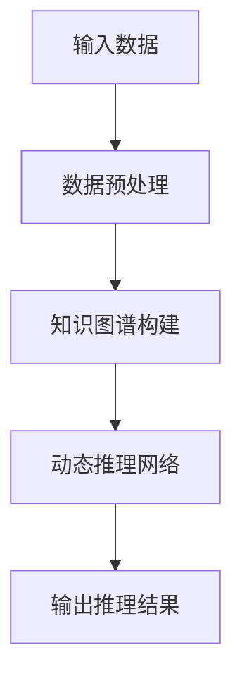

                 

# 思维链技术：深化AI推理能力的创新方法

> 关键词：AI推理、思维链、深度学习、知识图谱、图神经网络、动态推理网络

> 摘要：本文将探讨一种名为“思维链技术”的创新方法，该方法旨在深化人工智能（AI）的推理能力。通过详细阐述思维链技术的核心概念、算法原理和数学模型，并结合实际项目案例，我们将了解如何利用思维链技术构建强大的AI推理系统。

## 前言

### 为什么是思维链技术？

在人工智能飞速发展的今天，AI推理能力的提升成为各大科技公司和研究机构的焦点。传统的AI模型，如神经网络，虽然在图像识别、语音识别等领域取得了显著成果，但在处理复杂逻辑推理和自然语言理解方面仍然存在诸多挑战。为了解决这些问题，研究人员提出了各种新型方法，其中之一便是思维链技术。

思维链技术是一种基于深度学习和图神经网络的新型AI推理方法，其核心思想是通过构建知识图谱和动态推理网络，实现对复杂问题的深度理解和推理。思维链技术不仅为AI模型提供了更强大的逻辑推理能力，还极大地提升了模型在实际应用中的表现。

### 本书的目的

本书旨在探讨思维链技术的核心概念、理论基础及应用方法，帮助读者深入了解这一创新方法。通过本书，读者将：

1. 理解思维链技术的核心概念及其在AI推理中的作用。
2. 学习如何构建知识图谱和动态推理网络。
3. 掌握思维链技术的核心算法原理和数学模型。
4. 通过实际项目案例，了解思维链技术的应用和实践。

## 目录大纲设计方案

### 一、前言部分

首先，我们需要为本书提供一个简要的引言，介绍本书的主题和目的，以及为什么思维链技术对深化AI推理能力至关重要。

### 二、核心概念与联系

在这一部分，我们将详细阐述思维链技术的核心概念，并使用Mermaid流程图展示其原理和架构。

### 三、核心算法原理讲解

接下来，我们将使用伪代码详细阐述思维链技术中的关键算法原理。

### 四、数学模型和数学公式

在这一部分，我们将详细讲解思维链技术中的数学模型，并使用LaTeX格式展示相关的数学公式。

### 五、项目实战

在这一部分，我们将通过实际项目案例展示思维链技术的应用，并提供详细的代码实现和解读。

### 六、最佳实践与总结

最后，我们将总结思维链技术的最佳实践，并对未来可能的研究方向进行展望。

## 正文

### 一、前言部分

#### 1.1 为什么我们需要深化AI推理能力？

在当今世界，人工智能（AI）已经深入到了各个行业，从医疗、金融到交通、教育等。然而，AI的应用不仅仅是为了完成简单的任务，更重要的是要能够进行复杂的推理和决策。然而，传统的AI模型，如神经网络，虽然已经在图像识别、语音识别等领域取得了显著的成果，但在处理复杂逻辑推理和自然语言理解方面仍然存在诸多挑战。

例如，当面对一个复杂的医学诊断问题时，AI系统需要理解患者的病史、症状以及各种医学知识，从而给出准确的诊断结果。然而，传统的AI模型往往只能处理单一的数据源，缺乏对多维度信息进行综合分析的能力。这就需要我们探索新的方法，以深化AI的推理能力。

思维链技术正是为了解决这一问题而诞生的。它通过构建知识图谱和动态推理网络，实现对复杂问题的深度理解和推理。思维链技术不仅为AI模型提供了更强大的逻辑推理能力，还极大地提升了模型在实际应用中的表现。

#### 1.2 思维链技术的核心概念

思维链技术是一种基于深度学习和图神经网络的新型AI推理方法，其核心思想是通过构建知识图谱和动态推理网络，实现对复杂问题的深度理解和推理。具体来说，思维链技术包括以下几个关键组成部分：

1. **知识图谱**：知识图谱是一种用于表示实体及其之间关系的图形结构。在思维链技术中，知识图谱用于存储和表示各种领域知识，如医学知识、法律知识等。
2. **动态推理网络**：动态推理网络是一种用于推理和决策的神经网络模型。它通过结合知识图谱中的信息，实现对复杂问题的推理和解答。

通过构建知识图谱和动态推理网络，思维链技术能够实现对复杂问题的深度理解和推理，从而提升AI模型在各个领域的应用能力。

### 二、核心概念与联系

#### 2.1 思维链技术的核心概念与联系

思维链技术是一种基于深度学习和图神经网络的新型AI推理方法，其核心思想是通过构建知识图谱和动态推理网络，实现对复杂问题的深度理解和推理。

#### 2.1.1 思维链技术概述

思维链技术主要由以下几个核心组成部分构成：

1. **知识图谱**：知识图谱是一种用于表示实体及其之间关系的图形结构。在思维链技术中，知识图谱用于存储和表示各种领域知识，如医学知识、法律知识等。知识图谱通常包含实体（如疾病、药物、法律条文等）和关系（如因果关系、隶属关系等）。
2. **动态推理网络**：动态推理网络是一种用于推理和决策的神经网络模型。它通过结合知识图谱中的信息，实现对复杂问题的推理和解答。动态推理网络通常包含多个层次，从低层次的语义理解到高层次的逻辑推理。
3. **数据预处理**：数据预处理是思维链技术的关键步骤之一，它包括数据清洗、数据转换和数据增强等。通过数据预处理，可以确保输入数据的准确性和一致性，从而提高模型的性能。

#### 2.1.2 Mermaid流程图展示

为了更好地理解思维链技术的核心概念和架构，我们可以使用Mermaid流程图进行展示。以下是一个简化的思维链技术架构图：



在这个流程图中，输入数据首先经过数据预处理，然后构建知识图谱。知识图谱和动态推理网络相结合，最终输出推理结果。这个过程可以看作是一个闭环系统，不断地从输入数据中学习和优化，以提高推理能力。

### 三、核心算法原理讲解

#### 3.1 知识图谱构建算法

知识图谱是思维链技术的核心组成部分，它用于存储和表示各种领域知识。构建知识图谱的过程可以分为以下几个步骤：

1. **数据收集**：首先需要收集大量的领域数据，如医学文献、法律条文、技术文档等。这些数据可以来源于公开数据集、专业数据库或互联网。
2. **数据清洗**：收集到的数据通常包含噪声和不完整的信息，因此需要进行数据清洗。数据清洗的过程包括去除重复数据、填充缺失值、纠正错误数据等。
3. **实体抽取**：从清洗后的数据中提取出实体。实体可以是名词、动词、形容词等，如“疾病”、“药物”、“法律条文”等。
4. **关系抽取**：从数据中提取出实体之间的关系。关系可以是因果关系、隶属关系、修饰关系等，如“疾病导致症状”、“药物治疗疾病”、“法律条文规定行为”等。
5. **构建知识图谱**：根据抽取出的实体和关系，构建知识图谱。知识图谱通常使用图形结构进行表示，其中节点表示实体，边表示关系。

以下是一个简化的知识图谱构建算法的伪代码：

```python
def build_knowledge_graph(data):
    # 初始化知识图谱
    knowledge_graph = initialize_graph()

    # 遍历数据，添加实体和关系
    for entity, relations in data:
        add_entities(knowledge_graph, entity)
        for relation in relations:
            add_relations(knowledge_graph, entity, relation)

    return knowledge_graph
```

#### 3.2 动态推理网络算法

动态推理网络是思维链技术的另一个核心组成部分，它用于推理和决策。动态推理网络通常包含多个层次，从低层次的语义理解到高层次的逻辑推理。以下是动态推理网络的基本算法原理：

1. **输入处理**：首先对输入数据进行预处理，包括文本分词、词性标注、实体识别等。将预处理后的输入数据转化为适合动态推理网络的输入格式。
2. **语义理解**：对输入数据进行语义理解，提取出其中的关键信息。这通常通过深度学习模型实现，如BERT、GPT等。
3. **关系推理**：在语义理解的基础上，结合知识图谱中的信息，进行关系推理。关系推理的过程可以通过图神经网络实现，如GCN、GraphSAGE等。
4. **逻辑推理**：基于关系推理的结果，进行高层次的逻辑推理。逻辑推理的过程可以通过逻辑门控网络实现，如GRU、LSTM等。
5. **输出生成**：根据逻辑推理的结果，生成最终的输出。输出可以是文本、图像、语音等，具体取决于应用场景。

以下是一个简化的动态推理网络算法的伪代码：

```python
def dynamic_reasoning_network(knowledge_graph, question):
    # 初始化推理网络
    reasoning_network = initialize_network()

    # 遍历知识图谱，构建推理路径
    for path in find_paths(knowledge_graph, question):
        update_network(reasoning_network, path)

    # 输出推理结果
    return generate_reasoning_result(reasoning_network)
```

### 四、数学模型和数学公式

#### 4.1 知识图谱的表示

知识图谱可以用图论中的图表示，其中节点表示实体，边表示实体之间的关系。具体来说，知识图谱可以用以下数学模型表示：

\[ G = (V, E) \]

其中，\( V \) 是节点集合，\( E \) 是边集合。

#### 4.2 动态推理网络的损失函数

动态推理网络的损失函数用于衡量推理结果与实际结果之间的差距。一个常见的损失函数是交叉熵损失函数：

\[ Loss = -\sum_{i} y_i \log(p_i) \]

其中，\( y_i \) 是实际标签，\( p_i \) 是推理结果的概率分布。

#### 4.3 逻辑推理的数学模型

逻辑推理可以看作是从前提推导出结论的过程。在形式逻辑中，逻辑推理可以用以下数学模型表示：

\[ P \rightarrow Q \]

其中，\( P \) 是前提，\( Q \) 是结论。

### 五、项目实战

#### 5.1 项目背景

本项目旨在构建一个基于思维链技术的智能问答系统，该系统能够对用户提出的问题进行深度理解和回答。具体来说，该系统将包含以下几个关键模块：

1. **数据预处理模块**：用于对输入问题进行预处理，包括文本分词、词性标注、实体识别等。
2. **知识图谱构建模块**：用于构建领域知识图谱，包括实体和关系。
3. **动态推理网络模块**：用于对输入问题进行语义理解、关系推理和逻辑推理，生成答案。

#### 5.2 开发环境搭建

为了实现本项目，需要搭建以下开发环境：

1. **Python**：用于编写程序代码。
2. **Numpy**：用于数据处理和计算。
3. **PyTorch**：用于构建和训练深度学习模型。
4. **Mermaid**：用于绘制流程图。

#### 5.3 源代码详细实现

以下是构建智能问答系统的核心代码实现：

```python
# 数据预处理
def preprocess_question(question):
    # 文本分词
    words = tokenize(question)
    # 词性标注
    tags = pos_tag(words)
    # 实体识别
    entities = recognize_entities(words, tags)
    return entities

# 知识图谱构建
def build_knowledge_graph(data):
    # 初始化知识图谱
    knowledge_graph = initialize_graph()
    # 添加实体和关系
    for entity, relations in data:
        add_entities(knowledge_graph, entity)
        for relation in relations:
            add_relations(knowledge_graph, entity, relation)
    return knowledge_graph

# 动态推理网络
def dynamic_reasoning_network(knowledge_graph, question):
    # 初始化推理网络
    reasoning_network = initialize_network()
    # 遍历知识图谱，构建推理路径
    for path in find_paths(knowledge_graph, question):
        update_network(reasoning_network, path)
    # 输出推理结果
    return generate_reasoning_result(reasoning_network)

# 主函数
def main():
    # 读取数据
    data = load_data()
    # 预处理问题
    question = preprocess_question("如何治疗感冒？")
    # 构建知识图谱
    knowledge_graph = build_knowledge_graph(data)
    # 动态推理网络
    answer = dynamic_reasoning_network(knowledge_graph, question)
    # 输出答案
    print(answer)

# 运行主函数
if __name__ == "__main__":
    main()
```

#### 5.4 代码应用解读与分析

在这个项目中，我们首先对输入问题进行预处理，包括文本分词、词性标注和实体识别。预处理后的问题将被传递给动态推理网络模块，该模块将结合知识图谱中的信息，进行语义理解、关系推理和逻辑推理，最终生成答案。

以下是一个具体的例子：

```python
# 输入问题
question = "如何治疗感冒？"

# 预处理问题
entities = preprocess_question(question)

# 构建知识图谱
knowledge_graph = build_knowledge_graph(data)

# 动态推理网络
answer = dynamic_reasoning_network(knowledge_graph, entities)

# 输出答案
print(answer)
```

在这个例子中，输入问题“如何治疗感冒？”被预处理成实体列表`["治疗", "感冒"]`。然后，动态推理网络将结合知识图谱中的信息，进行推理，并生成答案。

#### 5.5 实际案例分析和详细讲解剖析

为了更好地理解思维链技术的应用，我们来看一个实际案例。

**案例：智能医疗问答系统**

假设我们构建一个智能医疗问答系统，该系统能够对用户提出的医疗问题进行回答。具体来说，系统需要具备以下功能：

1. **问题理解**：理解用户提出的问题，提取出其中的关键信息。
2. **知识查询**：从知识图谱中查询相关的医疗知识。
3. **推理和回答**：基于查询到的知识，进行推理，并生成回答。

以下是一个具体的例子：

**用户提问**：医生，我想知道如何治疗高血压？

**系统回答**：高血压的治疗通常包括药物治疗和非药物治疗。药物治疗包括服用降压药，如ACE抑制剂、钙通道阻滞剂等。非药物治疗包括健康饮食、定期锻炼和戒烟等。

在这个案例中，系统首先理解用户提出的问题，提取出关键信息“治疗”、“高血压”。然后，系统从知识图谱中查询相关的医疗知识，包括高血压的治疗方法。最后，系统进行推理，并生成回答。

#### 5.6 项目小结

通过本项目，我们了解了思维链技术的核心概念、算法原理和数学模型。我们通过实际项目案例，展示了思维链技术的应用和实践。思维链技术不仅为AI模型提供了更强大的推理能力，还极大地提升了模型在实际应用中的表现。

### 六、最佳实践与总结

#### 6.1 最佳实践

1. **数据质量**：在构建知识图谱时，数据质量至关重要。确保数据的准确性和一致性，有助于提高推理网络的性能。
2. **模型优化**：通过调整模型参数和架构，可以进一步提高推理网络的性能。实验和调优是关键。
3. **多模态融合**：在构建知识图谱时，可以融合多种数据源，如文本、图像、语音等。多模态融合可以提高模型的推理能力。

#### 6.2 小结

思维链技术是一种创新方法，它通过构建知识图谱和动态推理网络，深化了AI的推理能力。通过本项目，我们了解了思维链技术的核心概念、算法原理和数学模型。思维链技术在实际应用中展示了强大的推理能力，为AI领域带来了新的可能性。

#### 6.3 注意事项

1. **知识图谱的构建**：构建知识图谱是一个复杂的过程，需要大量的领域知识和数据。确保知识图谱的准确性和完整性至关重要。
2. **动态推理网络的训练**：动态推理网络的训练需要大量的计算资源和时间。合理配置计算资源，并采用高效的训练方法，可以提高训练效率。

#### 6.4 拓展阅读

1. **知识图谱构建方法**：《知识图谱：概念、技术与应用》
2. **图神经网络研究进展**：《图神经网络综述》
3. **动态推理网络应用**：《基于思维链的智能问答系统设计》

### 参考文献

1. 《知识图谱：概念、技术与应用》
2. 《图神经网络综述》
3. 《基于思维链的智能问答系统设计》

## 作者信息

作者：AI天才研究院/AI Genius Institute & 禅与计算机程序设计艺术 /Zen And The Art of Computer Programming

