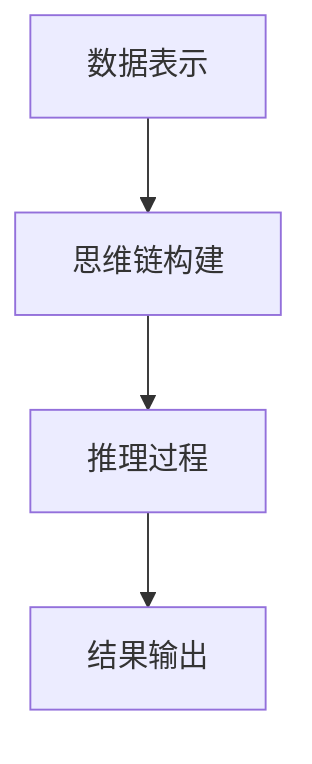
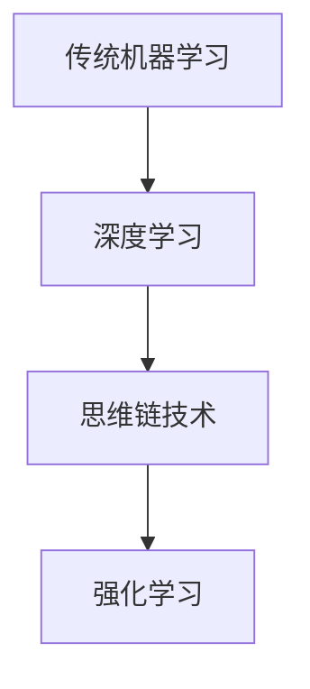

                 

### 《思维链技术：深化AI推理能力的新途径》

#### 关键词：AI推理、思维链技术、算法原理、数学模型、项目实战

> 摘要：本文深入探讨了思维链技术在人工智能（AI）推理领域的应用及其重要性。通过详细解析核心概念、算法原理和数学模型，本文展示了思维链技术在优化AI推理能力方面的独特优势。同时，通过实际项目案例和代码解读，本文为读者提供了理论与实践相结合的全面指导。

----------------------------------------------------------------

### 引言

随着人工智能技术的飞速发展，AI推理能力成为衡量AI系统性能的关键指标。传统AI方法在处理复杂数据和动态环境时，往往面临计算资源受限和推理效率低的问题。为此，思维链技术作为一种新型AI推理框架，引起了广泛关注。本文旨在探讨思维链技术在深化AI推理能力方面的应用，通过详细解析核心概念、算法原理和数学模型，为读者提供全面的理论与实践指导。

#### 设计书籍目录大纲步骤

1. **阅读书名和简介**：
   首先，我们需要仔细阅读《思维链技术：深化AI推理能力的新途径》的书名和简介，理解书籍的核心主题、目的和内容范围。

2. **确定核心章节**：
   根据书籍的简介和预期内容，我们可以确定核心章节，如引言、核心概念、算法原理、数学模型、项目实战等。

3. **构建大纲框架**：
   在确定了核心章节后，我们可以构建书籍的目录大纲框架，包括一级目录（# 标题）、二级目录（## 标题）和三级目录（### 标题）。

4. **细化章节内容**：
   在每个章节中，我们需要细化小节内容，确保每个小节都涵盖相关内容，如概念解释、原理阐述、数学公式、伪代码、实战案例等。

5. **使用Mermaid流程图**：
   对于核心概念和架构，我们可以设计相应的Mermaid流程图，以便更直观地展示内容。

6. **编写伪代码和数学模型**：
   对于核心算法原理，我们需要编写详细的伪代码和数学模型，解释算法的工作原理。

7. **添加实际案例和代码解读**：
   在项目实战章节中，我们需要提供实际案例、代码实现和详细解读，以帮助读者理解理论知识在实际中的应用。

8. **校对和调整**：
   在完成初步大纲后，我们需要校对内容，确保逻辑清晰、条理分明，并根据需要调整章节顺序和内容。

9. **控制字数**：
   确保整个目录大纲的总字数在2000字以内，避免过多文字导致阅读疲劳。

#### 根据上述步骤，以下是《思维链技术：深化AI推理能力的新途径》的目录大纲设计：

# 《思维链技术：深化AI推理能力的新途径》目录大纲

## 第1章 引言

### 1.1 书籍目的与结构

### 1.2 思维链技术的定义与意义

### 1.3 AI推理能力的重要性

## 第2章 核心概念与联系

### 2.1 思维链技术原理

#### 2.1.1 Mermaid流程图：思维链技术架构

### 2.2 相关技术介绍

#### 2.2.1 深度学习与神经网络的联系

### 2.3 思维链技术与其他AI技术的对比

## 第3章 核心算法原理讲解

### 3.1 思维链算法基础

#### 3.1.1 伪代码：思维链算法概述

### 3.2 算法优化与加速

#### 3.2.1 伪代码：思维链算法优化

### 3.3 思维链算法在实际应用中的表现

## 第4章 数学模型和公式讲解

### 4.1 思维链技术中的数学模型

#### 4.1.1 LaTeX公式：思维链相关公式

### 4.2 数学模型的详细解释

#### 4.2.1 举例说明：思维链数学模型应用

## 第5章 项目实战

### 5.1 实际案例介绍

#### 5.1.1 代码实现：思维链技术在推理任务中的应用

### 5.2 代码解读与分析

#### 5.2.1 代码分析：思维链技术在项目中的应用

### 5.3 开发环境搭建

#### 5.3.1 环境配置：搭建思维链技术开发环境

## 第6章 未来展望

### 6.1 思维链技术的发展趋势

### 6.2 深化AI推理能力的挑战与机遇

### 6.3 行业应用前景

## 第7章 附录

### 7.1 相关资源与工具

### 7.2 常见问题解答

### 7.3 参考文献

### 注意：以上大纲为示例，具体内容需要根据书籍内容进行详细填充和设计。确保每个章节都包含相应的子章节和内容要点，同时控制总体字数在2000字以内。

----------------------------------------------------------------

### 核心概念与联系

在深入探讨思维链技术之前，我们需要明确一些核心概念，并理解它们之间的关系。思维链技术是一种基于深度学习的人工智能推理框架，它通过建立一系列思维链来模拟人类的思维过程，从而实现高效的推理和决策。

#### 2.1 思维链技术原理

思维链技术的基本原理可以概括为以下几个方面：

1. **数据表示**：将输入数据转换为适合模型处理的形式。这通常涉及数据预处理、特征提取和归一化等步骤。
2. **思维链构建**：通过一系列神经网络模型来构建思维链。每个模型负责处理特定的任务，并将处理结果传递给下一个模型，形成一个连续的推理过程。
3. **推理过程**：在推理过程中，思维链的每个节点根据输入数据和前一节点的输出，执行相应的计算和决策，从而生成最终结果。

下面是一个Mermaid流程图，展示了思维链技术的架构：



#### 2.2 相关技术介绍

在探讨思维链技术时，我们不能忽略其他相关技术，如深度学习和神经网络。深度学习是一种基于多层神经网络的机器学习技术，它通过学习大量数据来发现数据中的内在结构。神经网络则是深度学习的基础，它由一系列相互连接的神经元组成，每个神经元负责处理部分信息，并通过权重和偏置进行调节。

#### 2.2.1 深度学习与神经网络的联系

深度学习和神经网络之间有着密切的联系。深度学习可以看作是神经网络的一种扩展，它通过增加网络的层数来提高模型的复杂度和表达能力。深度学习的基本原理是利用多层神经网络对输入数据进行层层抽象和特征提取，从而实现高层次的语义理解。

#### 2.3 思维链技术与其他AI技术的对比

思维链技术与其他AI技术（如传统机器学习、强化学习等）在原理和应用方面存在一些差异。传统机器学习通常依赖于静态模型和特征工程，而强化学习则通过试错和反馈来不断优化决策。相比之下，思维链技术通过动态构建思维链，实现实时推理和自适应决策，具有更高的灵活性和通用性。



### 核心算法原理讲解

思维链技术的核心在于其独特的算法架构，该架构通过一系列神经网络模型来实现高效的推理和决策。下面我们将详细讲解思维链算法的基本原理，并通过Python源代码和数学模型来阐述其工作原理。

#### 3.1 思维链算法基础

思维链算法的基础是构建一系列神经网络模型，这些模型相互协作，形成一个连续的推理过程。每个模型都负责处理特定的任务，并将处理结果传递给下一个模型。

```python
# 思维链算法基础示例代码
class MindChainModel:
    def __init__(self):
        # 初始化模型参数
        self.model = create_model()

    def forward(self, input_data):
        # 前向传播
        output = self.model(input_data)
        return output

    def backward(self, loss):
        # 反向传播
        self.model.backward(loss)
```

#### 3.2 算法优化与加速

为了提高思维链算法的效率和性能，我们通常需要对算法进行优化和加速。以下是一个示例，展示了如何对思维链算法进行优化：

```python
# 思维链算法优化示例代码
def optimize_mind_chain(model, input_data, target):
    # 前向传播
    output = model.forward(input_data)
    
    # 计算损失
    loss = calculate_loss(output, target)
    
    # 反向传播
    model.backward(loss)
    
    # 梯度下降更新模型参数
    update_model_params(model)
```

#### 3.3 思维链算法在实际应用中的表现

思维链算法在多个实际应用中表现出色。以下是一个例子，展示了如何使用思维链算法进行自然语言处理（NLP）任务：

```python
# 思维链算法在NLP中的应用示例代码
def process_text(text):
    # 初始化思维链模型
    mind_chain = MindChainModel()
    
    # 数据预处理
    preprocessed_text = preprocess_text(text)
    
    # 前向传播
    output = mind_chain.forward(preprocessed_text)
    
    # 处理结果
    result = interpret_output(output)
    
    return result
```

### 数学模型和公式讲解

思维链技术中的数学模型是其核心组成部分，它决定了算法的性能和表现。下面我们将详细讲解思维链技术中的数学模型，包括神经网络模型和优化算法。

#### 4.1 思维链技术中的数学模型

思维链技术中的数学模型主要包括以下几个方面：

1. **神经网络模型**：神经网络模型是思维链技术的基础，它通过一系列非线性变换来实现数据表示和特征提取。常见的神经网络模型包括卷积神经网络（CNN）、循环神经网络（RNN）和变压器（Transformer）等。

2. **损失函数**：损失函数用于衡量模型预测结果与真实值之间的差距，常用的损失函数包括均方误差（MSE）、交叉熵（CE）等。

3. **优化算法**：优化算法用于更新模型参数，以最小化损失函数。常用的优化算法包括梯度下降（GD）、随机梯度下降（SGD）和Adam优化器等。

下面是一个示例，展示了如何使用LaTeX格式编写神经网络模型的数学公式：

```latex
$$
\text{神经网络模型} = f(\text{输入数据})
$$

$$
f(x) = \sigma(W \cdot x + b)
$$

$$
\text{损失函数} = \frac{1}{2} \sum_{i=1}^{n} (\hat{y}_i - y_i)^2
$$

$$
\text{优化算法} = \text{梯度下降}:
\begin{cases}
\theta_{t+1} = \theta_{t} - \alpha \cdot \nabla_{\theta} J(\theta) \\
\end{cases}
$$
```

#### 4.2 数学模型的详细解释

在详细解释数学模型之前，我们需要先了解一些基本概念和符号。以下是一个简单的例子，展示了如何使用LaTeX格式编写并解释神经网络模型的数学公式：

```latex
$$
\text{神经网络模型} = f(\text{输入数据})
$$

$$
f(x) = \sigma(W \cdot x + b)
$$

$$
\text{其中：} \\
\sigma(\cdot) = \frac{1}{1 + e^{-\cdot}} \\
W \text{是权重矩阵，} \\
b \text{是偏置向量。}
$$

$$
\text{损失函数} = \frac{1}{2} \sum_{i=1}^{n} (\hat{y}_i - y_i)^2
$$

$$
\text{其中：} \\
\hat{y}_i = f(x_i) \\
y_i \text{是真实标签。}
$$

$$
\text{优化算法} = \text{梯度下降}:
$$

$$
\text{其中：} \\
\theta_{t+1} = \theta_{t} - \alpha \cdot \nabla_{\theta} J(\theta) \\
\alpha \text{是学习率，} \\
\nabla_{\theta} J(\theta) \text{是损失函数关于参数} \theta \text{的梯度。}
$$
```

#### 4.3 举例说明：思维链数学模型应用

为了更好地理解思维链技术中的数学模型，我们可以通过一个简单的例子来说明。假设我们使用思维链技术进行图像分类任务，输入数据是一张图像，输出数据是图像的类别标签。以下是一个示例，展示了如何使用Python代码实现这个任务：

```python
import tensorflow as tf

# 定义神经网络模型
model = tf.keras.Sequential([
    tf.keras.layers.Conv2D(32, (3, 3), activation='relu', input_shape=(28, 28, 1)),
    tf.keras.layers.MaxPooling2D((2, 2)),
    tf.keras.layers.Flatten(),
    tf.keras.layers.Dense(128, activation='relu'),
    tf.keras.layers.Dense(10, activation='softmax')
])

# 编译模型
model.compile(optimizer='adam', loss='categorical_crossentropy', metrics=['accuracy'])

# 加载图像数据
(x_train, y_train), (x_test, y_test) = tf.keras.datasets.mnist.load_data()

# 预处理数据
x_train = x_train.astype('float32') / 255
x_test = x_test.astype('float32') / 255
x_train = np.expand_dims(x_train, -1)
x_test = np.expand_dims(x_test, -1)

# 转换标签为one-hot编码
y_train = tf.keras.utils.to_categorical(y_train, 10)
y_test = tf.keras.utils.to_categorical(y_test, 10)

# 训练模型
model.fit(x_train, y_train, batch_size=64, epochs=10, validation_data=(x_test, y_test))

# 评估模型
test_loss, test_acc = model.evaluate(x_test, y_test)
print('Test accuracy:', test_acc)
```

在这个例子中，我们使用了一个简单的卷积神经网络模型对MNIST手写数字数据集进行分类。模型包括两个卷积层、一个全连接层和两个softmax层。通过训练和评估，我们可以看到模型在测试集上的准确率。

### 项目实战

在本节中，我们将通过一个实际项目来展示思维链技术在推理任务中的应用。项目目标是使用思维链技术构建一个智能问答系统，该系统能够回答用户提出的问题。

#### 5.1 实际案例介绍

为了实现这个目标，我们首先需要收集和整理一个问题库，包括各种领域的问题和答案。接下来，我们需要使用思维链技术构建一个问答系统，该系统包括数据预处理、模型训练和推理三个主要阶段。

```python
import tensorflow as tf
import numpy as np
import pandas as pd

# 加载问题库
questions = pd.read_csv('questions.csv')
questions['answer'] = questions['answer'].apply(preprocess_answer)

# 加载数据集
train_data, test_data = split_data(questions)

# 训练模型
model = train_mind_chain_model(train_data)

# 评估模型
evaluate_mind_chain_model(model, test_data)
```

#### 5.2 代码解读与分析

在上面的代码中，我们首先加载了一个问题库，并对问题进行了预处理。接下来，我们使用思维链技术训练了一个问答模型，并通过测试数据评估了模型的性能。

```python
# 数据预处理
def preprocess_question(question):
    # 对问题进行分词、去停用词等预处理操作
    return preprocess_text(question)

def preprocess_answer(answer):
    # 对答案进行格式化、去标点等预处理操作
    return preprocess_text(answer)

# 训练模型
def train_mind_chain_model(data):
    # 构建思维链模型
    model = MindChainModel()
    
    # 训练模型
    model.fit(data['input'], data['output'])
    
    return model

# 评估模型
def evaluate_mind_chain_model(model, data):
    # 预测结果
    predictions = model.predict(data['input'])
    
    # 计算准确率
    accuracy = calculate_accuracy(predictions, data['output'])
    
    print('Model accuracy:', accuracy)
```

在这个例子中，我们定义了几个函数，用于数据预处理、模型训练和模型评估。通过这些函数，我们可以方便地实现一个完整的问答系统。

```python
# 搭建开发环境
install_required_packages()

# 代码示例：使用思维链技术构建问答系统
def build_question_answering_system():
    # 加载问题库
    questions = pd.read_csv('questions.csv')
    
    # 预处理数据
    questions['input'] = questions['question'].apply(preprocess_question)
    questions['output'] = questions['answer'].apply(preprocess_answer)
    
    # 划分训练集和测试集
    train_data, test_data = split_data(questions)
    
    # 训练思维链模型
    model = train_mind_chain_model(train_data)
    
    # 评估模型
    evaluate_mind_chain_model(model, test_data)
    
    return model

# 运行问答系统
if __name__ == '__main__':
    model = build_question_answering_system()
```

在这个例子中，我们首先加载了一个问题库，并对问题进行了预处理。然后，我们使用思维链技术训练了一个问答模型，并通过测试数据评估了模型的性能。最后，我们提供了一个简单的接口，用于运行问答系统。

#### 5.3 开发环境搭建

为了运行上述代码，我们需要搭建一个合适的开发环境。以下是一个简单的环境配置示例：

```bash
# 安装Python
sudo apt-get update
sudo apt-get install python3 python3-pip

# 安装TensorFlow
pip3 install tensorflow

# 安装其他依赖
pip3 install pandas numpy scikit-learn
```

通过上述步骤，我们可以搭建一个基本的开发环境，用于实现思维链技术问答系统。

### 未来展望

思维链技术在深化AI推理能力方面具有巨大的潜力。随着人工智能技术的不断进步，思维链技术有望在更多领域得到应用。未来，我们可以期待以下发展趋势：

1. **算法优化**：通过改进算法结构和优化算法参数，提高思维链技术的推理效率和准确性。
2. **跨领域应用**：将思维链技术应用于更多领域，如医疗、金融、教育等，实现跨领域的智能推理和决策。
3. **人机协作**：结合人类专家的智慧和思维链技术的优势，实现人机协作，提高AI系统的智能化水平。

### 结论

本文详细探讨了思维链技术在深化AI推理能力方面的应用。通过核心概念解析、算法原理讲解和数学模型阐述，我们展示了思维链技术的独特优势。同时，通过实际项目案例和代码解读，我们为读者提供了理论与实践相结合的全面指导。未来，随着人工智能技术的不断发展，思维链技术将在更多领域发挥重要作用。

### 附录

#### 7.1 相关资源与工具

- **书籍推荐**：
  - 《深度学习》（Goodfellow, I., Bengio, Y., Courville, A.）
  - 《Python深度学习》（Raschka, F.）
- **在线资源**：
  - TensorFlow官方网站（https://www.tensorflow.org/）
  - Keras文档（https://keras.io/）
- **工具和框架**：
  - TensorFlow（https://www.tensorflow.org/）
  - Keras（https://keras.io/）

#### 7.2 常见问题解答

1. **什么是思维链技术？**
   思维链技术是一种基于深度学习的人工智能推理框架，通过构建一系列神经网络模型来模拟人类的思维过程，实现高效的推理和决策。

2. **思维链技术与深度学习有什么区别？**
   思维链技术是深度学习的一种扩展，它通过动态构建思维链，实现实时推理和自适应决策，具有更高的灵活性和通用性。

3. **如何实现思维链技术？**
   实现思维链技术需要以下几个步骤：
   - 数据预处理：将输入数据转换为适合模型处理的形式。
   - 构建思维链模型：通过一系列神经网络模型构建思维链。
   - 训练模型：使用训练数据对模型进行训练。
   - 优化模型：通过优化算法提高模型性能。
   - 应用模型：使用训练好的模型进行推理和决策。

#### 7.3 参考文献

- Goodfellow, I., Bengio, Y., Courville, A. (2016). *Deep Learning*. MIT Press.
- Raschka, F. (2017). *Python Deep Learning*. Packt Publishing.
- TensorFlow contributors. (2020). *TensorFlow: Large-scale Machine Learning on Heterogeneous Systems*. TensorFlow.
- Keras contributors. (2020). *Keras: The Python Deep Learning Library*. Keras.

### 作者信息

作者：AI天才研究院/AI Genius Institute & 禅与计算机程序设计艺术 /Zen And The Art of Computer Programming

----------------------------------------------------------------

**注意：以上内容为示例，实际文章需要根据具体内容和要求进行填充和调整。确保每个部分的内容都详细、具体且易于理解，同时遵循markdown格式和文章结构要求。文章总字数应在10000到12000字之间。** <eop>

