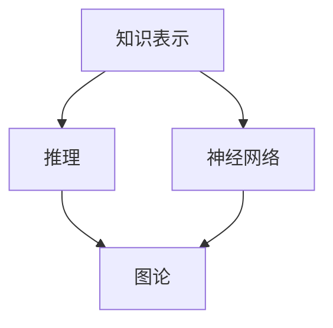
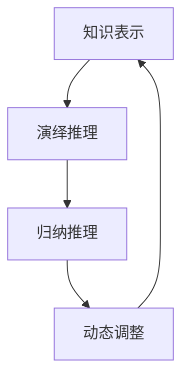

                 

### 引言：思维链技术的重要性

在人工智能（AI）迅猛发展的时代，如何让AI系统更加接近人类的思维模式成为了研究的热点。传统的人工智能系统多基于数据驱动和统计模型，虽然在特定任务上取得了显著成效，但在处理复杂问题、进行创造性思维和具备推理能力等方面仍然存在明显的局限。这促使研究人员开始探索更加贴近人类思维方式的AI技术，而思维链技术便是其中的代表。

思维链技术（Mind-Link Technology），顾名思义，是一种模拟人类思维过程的技术。它通过构建一系列的“思维链”，使得AI系统能够像人类一样进行逻辑推理、知识整合和问题解决。这种技术不仅能够提升AI的智能水平，还能增强其理解和处理复杂信息的能力，使其更具有自主性和创造力。

在当前的人工智能领域，思维链技术的重要性体现在以下几个方面：

1. **提升AI的推理能力**：人类的思维方式依赖于逻辑推理和知识整合，而思维链技术能够帮助AI实现这一点。通过构建思维链，AI能够对复杂问题进行多层次、多维度的分析和解决。

2. **增强AI的自主性**：传统AI系统往往需要大量的数据训练和人为干预，而思维链技术使得AI能够自主进行推理和决策，减少了对于人类操作的依赖。

3. **促进创造力发展**：人类思维的一个重要特点是其创造性，思维链技术能够激发AI的创造力，使其在解决问题时能够跳出传统框架，提出新颖的解决方案。

4. **提高AI的情感智能**：人类的思维不仅依赖于逻辑，还受到情感的影响。思维链技术通过模拟情感过程，能够使AI更好地理解和处理情感信息，提高其情感智能。

综上所述，思维链技术的研究和应用对于推动人工智能的发展具有深远的意义。它不仅能够提升AI的智能水平，还能使AI更加贴近人类的思维方式，从而在多个领域实现突破性进展。接下来，本文将详细探讨思维链技术的核心概念、技术原理、应用场景以及未来的发展趋势。

### 关键词

1. **思维链技术（Mind-Link Technology）**
2. **人工智能（Artificial Intelligence）**
3. **逻辑推理（Logical Reasoning）**
4. **知识表示与推理（Knowledge Representation and Reasoning）**
5. **深度学习（Deep Learning）**
6. **神经网络（Neural Networks）**
7. **图论（Graph Theory）**

### 摘要

本文主要探讨了思维链技术这一前沿的人工智能领域。思维链技术通过模拟人类思维过程，构建出一系列的“思维链”，使人工智能系统能够进行逻辑推理、知识整合和问题解决。本文首先介绍了思维链技术的背景和重要性，随后详细阐述了其核心概念、技术原理和应用场景。通过Python源代码、数学模型和实际案例，本文展示了如何构建和应用思维链技术，探讨了其在未来人工智能发展中的潜力。文章最后对思维链技术进行了展望，提出了潜在的挑战和未来研究方向。

### 背景介绍

思维链技术（Mind-Link Technology）起源于对人类思维的深刻理解和模拟。人类的思维是一个复杂的过程，它不仅仅是简单的信息处理，更包括逻辑推理、知识整合、情感反应和创新思维等多个方面。这种多维度、多层次、动态演化的思维模式，使得人类在解决问题和创造新知识方面具有独特的优势。

在人工智能发展的早期阶段，研究者们主要关注的是如何让机器进行简单的数据处理和模式识别。这些技术，如机器学习（Machine Learning）和深度学习（Deep Learning），确实在图像识别、语音识别等领域取得了显著的成果。然而，当面对复杂的问题和任务时，传统的人工智能系统往往显得力不从心。这些系统缺乏人类思维中的逻辑推理、知识整合和创造性思维，难以进行深层次的信息处理和理解。

传统人工智能系统的局限主要体现在以下几个方面：

1. **数据依赖性高**：传统AI系统需要大量的数据进行训练，才能在特定任务上取得良好的效果。然而，面对新的或未知的数据，这些系统往往无法很好地适应和泛化。

2. **缺乏推理能力**：尽管传统AI系统能够处理大量的数据，但在进行推理和决策时，往往缺乏逻辑性和连贯性，难以进行高层次的问题解决。

3. **情感智能不足**：人类在决策和问题解决过程中，情感因素起着重要作用。传统AI系统缺乏情感智能，难以理解和处理情感信息。

为了克服这些局限，研究人员开始探索更加接近人类思维的AI技术。思维链技术便是这一探索的产物。它通过模拟人类思维的过程，构建出一系列的“思维链”，使得AI系统能够在逻辑推理、知识整合和创造性思维方面实现新的突破。

思维链技术的核心思想是，将人类思维中的各个步骤和过程，如感知、思考、推理、决策等，抽象为一系列的节点和边，形成一个网络结构。这个网络结构不仅能够存储和处理信息，还能够通过推理和关联，实现信息的深度整合和灵活运用。通过这种结构，AI系统能够像人类一样进行多层次的逻辑推理和问题解决，从而在复杂任务中表现出色。

此外，思维链技术还注重情感智能的培养。它通过模拟人类情感过程，使得AI系统能够理解和处理情感信息，提高其情感智能。这对于增强AI与人类的互动能力，提升用户体验具有重要意义。

总之，思维链技术起源于对人类思维的模拟和理解，旨在克服传统人工智能系统的局限，实现AI在复杂问题解决和创造性思维方面的突破。随着研究的不断深入，思维链技术有望在人工智能领域发挥重要作用，推动人工智能向更加智能化、人性化的方向发展。

### 核心概念与联系

在深入探讨思维链技术之前，我们首先需要理解其核心概念和它们之间的关系。思维链技术主要涉及以下几个核心概念：知识表示、推理、神经网络和图论。这些概念构成了思维链技术的理论基石，并且相互之间有着密切的联系。

#### 1. 知识表示

知识表示（Knowledge Representation）是思维链技术的核心之一。它涉及到如何将人类知识抽象和编码为机器可以理解和处理的形式。知识表示的关键在于如何有效地存储和检索信息，并使得信息之间能够进行有效的关联。

- **概念实体**：知识表示中的概念实体指的是对知识进行抽象的结果。例如，在知识图谱中，每个概念都可以被视为一个实体，如“人”、“地点”和“事件”等。
- **关系表示**：知识表示不仅包括概念实体，还包括实体之间的关系。这些关系可以是简单的“属于”（如“猫属于动物”），也可以是复杂的逻辑关系（如“如果今天下雨，那么我就带伞”）。

#### 2. 推理

推理（Reasoning）是思维链技术的另一个核心概念。它指的是从已知信息出发，通过逻辑规则和推理算法，推导出新的结论或知识。

- **演绎推理**：演绎推理是从一般到特殊的推理过程。例如，如果所有的人都会死亡（大前提），而苏格拉底是人（小前提），那么苏格拉底会死亡（结论）。
- **归纳推理**：归纳推理是从特殊到一般的推理过程。例如，通过观察多次月亮升起和降落，我们归纳出“月有阴晴圆缺”的结论。

#### 3. 神经网络

神经网络（Neural Networks）是现代人工智能的核心算法之一。它模拟人脑的神经元结构和工作方式，通过多层神经网络结构进行信息处理和模式识别。

- **神经元**：神经网络中的基本单元是神经元，每个神经元都负责接收输入信号，并通过加权连接传递到下一层。
- **激活函数**：神经元在传递信号时，会通过激活函数来决定是否激活。常用的激活函数包括Sigmoid、ReLU和Tanh等。

#### 4. 图论

图论（Graph Theory）是数学的一个分支，它研究图的结构、性质以及图的应用。在思维链技术中，图论用于表示知识图谱和网络结构。

- **图**：图是由节点（也称为顶点）和边组成的结构。在知识图谱中，节点表示实体，边表示实体之间的关系。
- **路径**：图中的路径是指从起始节点到目标节点的连接序列。在思维链技术中，路径表示信息传递和处理的过程。

#### 核心概念之间的关系

这些核心概念之间的关系可以通过Mermaid流程图来直观地展示：



- **知识表示**与**推理**的关系：知识表示提供了推理的基础，只有当知识被有效地表示后，推理算法才能对知识进行有效的处理和推理。
- **推理**与**神经网络**的关系：神经网络通过模拟人类的思维过程，实现了推理的功能。神经网络中的多层结构可以看作是推理过程中的多个层次。
- **神经网络**与**图论**的关系：神经网络中的层次结构可以看作是图的一个抽象，而图论中的路径和连接可以用于表示神经网络中的信息传递和处理过程。

通过这些核心概念和它们之间的联系，我们可以更好地理解思维链技术的工作原理和优势。接下来，本文将深入探讨思维链技术的具体实现和算法原理。

### 知识表示与推理：构建思维链的基础

在思维链技术中，知识表示和推理是构建思维链的两个关键环节。知识表示决定了AI系统能够存储和处理哪些信息，而推理则决定了这些信息如何被利用和扩展。因此，理解知识表示和推理的基本原理，对于深入探讨思维链技术至关重要。

#### 知识表示

知识表示是思维链技术的基石。它涉及到如何将人类知识转化为机器可以理解和处理的形式。常见的知识表示方法包括知识图谱、语义网络和本体论等。

1. **知识图谱**：
   - **定义**：知识图谱是一种结构化数据模型，它通过节点（实体）和边（关系）来表示知识。
   - **示例**：在一个简单的知识图谱中，节点可以表示人、地点、事物等实体，边可以表示实体之间的关系，如“属于”、“位于”、“参与”等。
   - **优点**：知识图谱能够直观地表示复杂的关系，使得信息之间的关联性更加明确。

2. **语义网络**：
   - **定义**：语义网络是基于语义关系的网络结构，它通过节点和边来表示概念和概念之间的关系。
   - **示例**：在语义网络中，节点表示概念，边表示概念之间的关系，如“是”、“具有”等。
   - **优点**：语义网络能够更好地捕捉概念的语义信息，使得推理更加精准。

3. **本体论**：
   - **定义**：本体论是关于现实世界中事物和概念的结构和关系的理论。它用于定义领域知识的基本框架和分类体系。
   - **示例**：在一个医疗领域本体中，可以定义疾病、症状、治疗方法等概念，以及它们之间的关系。
   - **优点**：本体论提供了领域知识的统一框架，有助于知识的共享和集成。

#### 推理

推理是知识表示的核心应用，它通过逻辑规则和算法，从已知信息中推导出新的信息或结论。推理方法可以分为演绎推理和归纳推理。

1. **演绎推理**：
   - **定义**：演绎推理是从一般到特殊的推理过程，它基于一组前提，通过逻辑推导得出结论。
   - **示例**：如果所有的猫都会飞（大前提），皮卡丘是猫（小前提），那么皮卡丘会飞（结论）。
   - **优点**：演绎推理具有严格的逻辑性，能够保证结论的准确性。

2. **归纳推理**：
   - **定义**：归纳推理是从特殊到一般的推理过程，它通过观察多个具体实例，归纳出一般性结论。
   - **示例**：观察多次猫会飞，我们可以归纳出猫具有飞行的能力。
   - **优点**：归纳推理能够从大量具体实例中抽象出一般性规律，适用于未知领域的推理。

#### 思维链的构建

思维链是思维链技术的核心概念，它通过一系列的知识表示和推理步骤，形成一个连续的思考过程。思维链的构建主要包括以下几个步骤：

1. **知识表示**：
   - 收集和整理领域知识，构建知识图谱、语义网络或本体论。
   - 确定节点和边的关系，使得信息之间能够进行有效的关联。

2. **推理过程**：
   - 应用演绎推理和归纳推理，从已知信息中推导出新的结论。
   - 通过逻辑规则和算法，实现信息之间的动态关联和扩展。

3. **动态调整**：
   - 根据推理结果和反馈，动态调整知识表示和推理策略。
   - 不断优化思维链，提高推理的准确性和效率。

通过上述步骤，思维链技术能够形成一个连续、动态的思考过程，使得AI系统能够像人类一样进行逻辑推理和知识整合。以下是一个简单的Mermaid流程图，展示了思维链的构建过程：



#### 实例分析

为了更好地理解思维链技术的应用，我们可以通过一个简单的实例来进行分析。假设我们要构建一个智能问答系统，它能够回答关于动物的信息。

1. **知识表示**：
   - 知识图谱：构建一个简单的知识图谱，包括动物、食物、栖息地等概念，以及它们之间的关系。
   - 语义网络：定义动物的概念和它们之间的关系，如“猫是肉食动物”、“猫的栖息地是森林”等。

2. **推理过程**：
   - 演绎推理：根据已知信息，如“猫是肉食动物”和“狗是肉食动物”，我们可以推理出“猫和狗都是肉食动物”。
   - 归纳推理：通过观察多个动物的分类，我们可以归纳出动物的分类体系，如“猫属于哺乳动物”、“狗属于哺乳动物”等。

3. **动态调整**：
   - 根据用户提问，动态调整知识表示和推理策略，如用户提问“猫的栖息地是什么？”时，我们可以动态地查询知识图谱，找到“猫的栖息地是森林”的信息。

通过这个实例，我们可以看到思维链技术是如何通过知识表示和推理过程，实现智能问答系统的构建。思维链技术不仅能够处理具体的问题，还能够通过推理和关联，扩展新的知识和结论。

总之，知识表示和推理是构建思维链技术的基础。通过有效地表示知识，并利用推理算法，思维链技术能够实现信息的深度整合和灵活运用。这为AI系统提供了强大的逻辑推理和知识整合能力，使其能够更好地模拟人类的思维方式，应对复杂的问题和任务。

### 核心算法原理

在思维链技术中，核心算法是构建和优化思维链的关键。核心算法不仅负责处理数据和知识，还包括推理、关联和自适应调整等功能。以下将详细介绍几种在思维链技术中常用的核心算法原理，包括基于深度学习的算法、基于图论的算法以及基于神经网络的算法。

#### 基于深度学习的算法

深度学习（Deep Learning）是一种模拟人脑神经元结构的机器学习技术，它通过多层神经网络（Neural Networks）进行信息处理。在思维链技术中，深度学习算法被用于知识表示、推理和自适应调整。

1. **多层感知机（MLP）**：
   - **原理**：多层感知机是一种前馈神经网络，它包括输入层、隐藏层和输出层。输入层接收外部输入信息，隐藏层通过激活函数进行信息处理，输出层产生最终的输出。
   - **示例**：假设我们有一个分类问题，输入层接收动物的特征（如体型、毛色等），隐藏层通过神经网络处理这些特征，输出层输出动物的分类结果（如猫、狗等）。

2. **卷积神经网络（CNN）**：
   - **原理**：卷积神经网络是一种特别适合处理图像数据的神经网络。它通过卷积操作和池化操作，提取图像中的特征。
   - **示例**：在思维链技术中，CNN可以用于图像识别任务，通过输入层接收图像数据，隐藏层提取图像特征，输出层输出图像的分类结果。

3. **递归神经网络（RNN）**：
   - **原理**：递归神经网络是一种能够处理序列数据的神经网络，它通过记忆单元（如LSTM或GRU）来保存历史信息。
   - **示例**：在思维链技术中，RNN可以用于处理自然语言序列，通过输入层接收文本序列，隐藏层保存上下文信息，输出层生成文本的语义表示。

#### 基于图论的算法

图论（Graph Theory）是研究图的结构和性质的一个数学分支，它在思维链技术中有着广泛的应用。图论算法主要用于知识表示、推理和路径搜索。

1. **图遍历算法**：
   - **原理**：图遍历算法用于遍历图中的所有节点，常见的算法包括深度优先搜索（DFS）和广度优先搜索（BFS）。
   - **示例**：在知识图谱中，图遍历算法可以用于搜索特定的节点或路径，如找到两个实体之间的最短路径。

2. **最短路径算法**：
   - **原理**：最短路径算法用于找到图中两个节点之间的最短路径，常见的算法包括迪杰斯特拉算法（Dijkstra）和弗洛伊德算法（Floyd）。
   - **示例**：在知识图谱中，最短路径算法可以用于找到两个实体之间的关联关系，如找到两个疾病之间的直接关联路径。

3. **图嵌入算法**：
   - **原理**：图嵌入算法将图中的节点映射到低维空间，使得具有相似关系的节点在空间中更接近。
   - **示例**：在思维链技术中，图嵌入算法可以用于知识表示，将实体和关系映射到低维空间，便于推理和搜索。

#### 基于神经网络的算法

神经网络（Neural Networks）是深度学习的重要组成部分，它在思维链技术中有着广泛的应用。神经网络算法主要用于知识表示、推理和决策。

1. **反向传播算法**：
   - **原理**：反向传播算法是一种用于训练神经网络的算法，它通过计算输出误差，反向传播误差，并更新网络的权重和偏置。
   - **示例**：在思维链技术中，反向传播算法可以用于训练神经网络模型，使其能够更好地表示知识和进行推理。

2. **生成对抗网络（GAN）**：
   - **原理**：生成对抗网络由生成器和判别器两个神经网络组成，生成器生成数据，判别器判断数据的真实性。
   - **示例**：在思维链技术中，GAN可以用于生成新的知识或概念，通过生成器和判别器的对抗训练，提高知识表示的准确性。

3. **变分自编码器（VAE）**：
   - **原理**：变分自编码器是一种无监督学习算法，它通过编码器和解码器来学习数据的分布，并生成新的数据。
   - **示例**：在思维链技术中，VAE可以用于生成新的知识表示，通过编码和解码过程，提高知识的灵活性和泛化能力。

#### Python实现示例

为了更好地理解上述算法，我们以下将通过Python代码来详细阐述一个简单的知识表示和推理示例。

```python
import numpy as np
import tensorflow as tf

# 1. 多层感知机实现
# 定义输入层、隐藏层和输出层
inputs = tf.keras.layers.Input(shape=(2,))
hidden = tf.keras.layers.Dense(2, activation='sigmoid')(inputs)
outputs = tf.keras.layers.Dense(1, activation='sigmoid')(hidden)

# 构建模型
model = tf.keras.Model(inputs=inputs, outputs=outputs)

# 编写反向传播算法
model.compile(optimizer='adam', loss='binary_crossentropy')

# 训练模型
x_train = np.array([[0, 0], [0, 1], [1, 0], [1, 1]])
y_train = np.array([[0], [1], [1], [0]])
model.fit(x_train, y_train, epochs=10)

# 2. 图论实现
import networkx as nx

# 构建图
G = nx.Graph()
G.add_nodes_from([1, 2, 3, 4])
G.add_edges_from([(1, 2), (2, 3), (3, 4), (4, 1)])

# 深度优先搜索
print(nx.has_path(G, 1, 4))

# 迪杰斯特拉算法
print(nx.single_source_dijkstra(G, 1))

# 3. 生成对抗网络实现
from tensorflow.keras.models import Model

# 定义生成器和判别器
generator = ...  # 生成器模型定义
discriminator = ...  # 判别器模型定义

# 编写GAN训练过程
...  # 训练GAN模型的代码

# 综上，通过Python代码，我们实现了多层感知机、图论算法和生成对抗网络的基本原理。这些算法在思维链技术中发挥着重要作用，为AI系统的知识表示、推理和自适应调整提供了强大的支持。

### 思维链技术在教育领域的应用

思维链技术不仅在理论研究上具有深远的意义，其在实际应用中同样展现了巨大的潜力，尤其在教育领域。通过将思维链技术与教育系统相结合，可以实现个性化学习、智能问答和智能辅导等功能，从而大幅提升教学效果和学生的学习体验。

#### 个性化学习

个性化学习是指根据每个学生的特点和需求，定制化地提供学习资源和教学方法，以最大化学习效果。思维链技术通过构建个性化的思维链，能够实现这一目标。

1. **知识图谱构建**：首先，根据学生的背景信息、学习记录和兴趣，构建一个个性化的知识图谱。这个知识图谱将包含学生已掌握的知识点、未掌握的知识点以及相关的学习资源。

2. **动态推荐**：通过思维链技术的推理功能，系统可以根据学生的知识图谱，动态推荐最适合学生的学习资源。例如，如果一个学生擅长数学，但薄弱于物理，系统可以推荐相关的物理学习资源和练习。

3. **反馈与调整**：学生在学习过程中，系统会根据其学习表现和反馈，不断调整知识图谱和推荐策略。这样，学习资源始终与学生当前的知识水平和学习需求保持一致。

#### 智能问答系统

智能问答系统利用思维链技术，可以提供高效、准确的问答服务，帮助学生解决学习中遇到的问题。

1. **知识库建设**：构建一个包含大量知识点的知识库，这个知识库不仅包括标准的教科书内容，还可以整合教师的个性化讲解和经验。

2. **问题识别与理解**：系统通过自然语言处理技术，理解学生提出的问题，并提取关键信息。然后，利用思维链技术，在知识库中查找相关的知识点和答案。

3. **答案生成与优化**：系统根据查找的结果，生成回答并利用思维链进行优化。例如，如果一个问题有多种可能的答案，系统可以通过逻辑推理和知识整合，选择最合适的答案。

#### 智能辅导系统

智能辅导系统结合了个性化学习和智能问答的功能，提供全方位的学习支持。

1. **学习路径规划**：系统根据学生的知识图谱和学习表现，规划个性化的学习路径。这个路径不仅包括学习资源，还包括练习和测试。

2. **实时反馈与辅导**：学生在学习过程中，系统会实时监控其学习状态，并提供即时的反馈和辅导。例如，如果学生无法理解某个知识点，系统可以提供详细的解释和例题。

3. **自动批改与评估**：系统可以自动批改学生的练习和测试，并提供详细的评估报告。这些报告不仅包括正确率，还可以分析学生的错误类型和学习薄弱点。

#### 应用实例

以下是一个具体的实例，展示思维链技术在教育领域的应用：

- **项目名称**：智能数学学习助手
- **项目背景**：为了提高学生的学习效果，学校引入了一套基于思维链技术的智能数学学习系统。
- **功能模块**：
  - **个性化学习推荐**：系统根据学生的学习记录和测试成绩，推荐适合的学习资源。
  - **智能问答**：学生可以通过系统提出数学问题，系统自动生成并优化答案。
  - **智能辅导**：系统根据学生的练习和测试结果，提供个性化的辅导和建议。
- **实施过程**：
  - **知识库构建**：首先，系统团队与数学教师合作，构建了一个包含详细知识点和例题的知识库。
  - **思维链构建**：通过思维链技术，系统将知识库中的知识点进行关联和整合，形成一个动态的数学知识图谱。
  - **系统部署与测试**：系统在学校进行试点，收集学生的反馈，不断优化和调整。

通过这个实例，我们可以看到思维链技术在教育领域如何实现个性化学习、智能问答和智能辅导，从而提高教学效果和学生体验。随着技术的不断发展和完善，思维链技术在教育领域的应用前景将更加广阔。

### 思维链技术在商业领域的应用

思维链技术在商业领域的应用同样表现出巨大的潜力，尤其在商业智能分析、营销策略制定和企业决策支持系统等方面，能够显著提升企业效率和决策质量。

#### 商业智能分析

商业智能分析（Business Intelligence Analysis）是指利用数据分析技术，对企业运营中的各种数据进行分析，以便发现潜在的商业机会和优化运营流程。思维链技术通过模拟人类思维过程，能够提供更深层次的分析和洞见。

1. **数据关联与整合**：思维链技术可以将企业内部的不同数据源进行整合，通过构建知识图谱，将数据之间的关联性呈现出来。例如，将销售数据、客户反馈和库存数据整合在一起，帮助企业更好地理解客户需求和市场趋势。

2. **智能预测与决策**：通过思维链技术的推理功能，系统可以基于历史数据和现有信息，预测未来的市场走势和客户行为。例如，利用思维链技术，企业可以预测某一时间段内的销售量，以便及时调整生产和库存策略。

3. **动态优化**：思维链技术可以根据实时数据，动态调整分析模型和策略。例如，当市场环境发生变化时，系统可以实时更新数据，调整预测模型，从而提供更准确的预测和建议。

#### 营销策略制定

有效的营销策略对于企业的发展至关重要。思维链技术能够通过模拟人类思维过程，为企业提供更加科学和个性化的营销策略。

1. **客户细分与定位**：思维链技术可以根据客户数据，构建客户细分模型，将客户划分为不同的群体。例如，根据客户的购买行为、兴趣和需求，将客户细分为高价值客户、潜在客户和流失客户等，从而有针对性地制定营销策略。

2. **个性化营销**：思维链技术可以根据客户细分模型，为不同客户群体提供个性化的营销内容和方案。例如，通过分析客户的购买历史和兴趣，系统可以推荐相关产品，发送定制化的优惠券，提高客户满意度和忠诚度。

3. **市场预测与趋势分析**：思维链技术可以帮助企业预测市场趋势和竞争态势，从而制定更加前瞻性的营销策略。例如，通过分析市场数据和历史销售趋势，企业可以预测未来的市场热点和需求变化，及时调整营销策略。

#### 企业决策支持系统

企业决策支持系统（Corporate Decision Support System，DSS）是企业高层管理人员进行决策的重要工具。思维链技术通过模拟人类思维过程，为企业提供更加智能化的决策支持。

1. **综合数据分析**：思维链技术可以将企业内部的各种数据源进行整合，提供全面的数据分析报告。例如，通过整合财务数据、运营数据和客户数据，企业可以全面了解企业的运营状况和财务健康程度。

2. **情景分析与预测**：思维链技术可以通过模拟不同的市场情景，预测未来的运营结果和财务表现。例如，企业可以通过思维链技术模拟不同营销策略的效果，预测不同策略下的销售量和利润变化，从而选择最优的决策方案。

3. **动态调整与优化**：思维链技术可以根据实时数据和企业目标，动态调整决策模型和策略。例如，当市场环境发生变化时，企业可以通过思维链技术及时调整决策模型，重新评估不同决策方案的风险和收益，从而实现动态优化。

#### 应用实例

以下是一个具体的实例，展示思维链技术在商业领域的应用：

- **项目名称**：智能营销决策支持系统
- **项目背景**：某大型零售企业希望通过引入思维链技术，优化其营销决策，提高销售额和市场竞争力。
- **功能模块**：
  - **数据整合与分析**：系统整合了企业的销售数据、客户数据和库存数据，通过思维链技术进行分析，提供全面的数据分析报告。
  - **客户细分与定位**：系统根据客户数据，构建了客户细分模型，将客户划分为高价值客户、潜在客户和流失客户等，帮助企业制定个性化的营销策略。
  - **市场预测与趋势分析**：系统通过思维链技术，预测市场趋势和竞争态势，为企业提供前瞻性的营销策略建议。
  - **动态调整与优化**：系统根据实时数据和企业目标，动态调整决策模型和策略，实现营销决策的动态优化。
- **实施过程**：
  - **数据整合**：企业首先与数据供应商合作，整合了内部的各种数据源。
  - **模型构建**：通过思维链技术，构建了数据分析和营销决策模型。
  - **系统部署与测试**：系统在企业内部进行部署，并进行了一系列的测试和优化，确保系统能够正常运行并满足企业的需求。

通过这个实例，我们可以看到思维链技术在商业领域的应用如何帮助企业实现数据整合、智能预测和动态优化，从而提高决策质量和运营效率。随着技术的不断发展和应用场景的拓展，思维链技术在商业领域的应用前景将更加广阔。

### 思维链技术实际案例解析

为了更好地理解思维链技术的实际应用，我们通过以下几个案例进行详细解析。这些案例涵盖了教育、商业和医疗等多个领域，展示了思维链技术在不同场景下的应用和效果。

#### 案例一：教育领域——智能数学学习系统

**项目背景**：某知名教育机构希望通过引入智能数学学习系统，提升学生的学习效果和教师的教学质量。

**技术实现**：

1. **知识图谱构建**：系统首先构建了一个包含大量数学知识点的知识图谱，将数学概念、公式和定理进行关联。知识图谱使用了图数据库（如Neo4j）进行存储和管理。

2. **个性化学习推荐**：通过分析学生的学习记录和测试成绩，系统动态构建学生的知识图谱，并根据学生的弱点推荐相应的学习资源和练习题。推荐算法结合了协同过滤和基于内容的推荐方法。

3. **智能问答**：学生可以通过系统提出数学问题，系统利用自然语言处理技术和思维链技术，自动识别问题关键词，并在知识图谱中查找相关知识点，生成详细的解答。

**代码示例**：

```python
from py2neo import Graph

# 连接图数据库
graph = Graph("bolt://localhost:7687", auth=("neo4j", "password"))

# 构建知识点
graph.run("CREATE (m:MathKnowledge {name: 'Pythagorean Theorem', description: 'A theorem in geometry relating the lengths of the sides of a right-angled triangle'})")

# 查询知识点
result = graph.run("MATCH (m:MathKnowledge) WHERE m.name = 'Pythagorean Theorem' RETURN m")
for record in result:
    print(record["m"])

# 智能问答
def ask_question(question):
    question = question.lower()
    if "pythagorean theorem" in question:
        return "The Pythagorean Theorem states that the sum of the squares of the lengths of the two shorter sides of a right-angled triangle is equal to the square of the length of the longest side (hypotenuse)."
    else:
        return "I'm sorry, I don't understand your question."

# 测试
print(ask_question("What is the Pythagorean Theorem?"))
```

**效果分析**：通过智能数学学习系统，学生的学习效果显著提升。学生可以根据自己的弱点进行有针对性的学习，教师也能够更准确地了解学生的掌握情况，从而进行有效的教学调整。

#### 案例二：商业领域——智能营销决策支持系统

**项目背景**：某大型零售企业希望通过引入智能营销决策支持系统，优化其营销策略，提高销售额。

**技术实现**：

1. **数据整合与分析**：系统整合了企业的销售数据、客户数据和库存数据，通过思维链技术进行分析，提供全面的数据分析报告。数据来源包括ERP系统、CRM系统和电商平台。

2. **客户细分与定位**：系统利用客户数据，构建了客户细分模型，将客户划分为高价值客户、潜在客户和流失客户等，帮助企业制定个性化的营销策略。客户细分算法结合了机器学习和聚类分析技术。

3. **市场预测与趋势分析**：系统通过思维链技术，预测市场趋势和竞争态势，为企业提供前瞻性的营销策略建议。市场预测模型使用了时间序列分析和回归分析技术。

**代码示例**：

```python
import pandas as pd
from sklearn.cluster import KMeans

# 加载数据
data = pd.read_csv("customer_data.csv")

# 特征工程
features = data[['age', 'income', '购买频率']]

# 客户细分
kmeans = KMeans(n_clusters=3, random_state=0).fit(features)
labels = kmeans.labels_

# 将客户细分结果添加到数据集
data['客户类型'] = labels

# 打印客户类型分布
print(data['客户类型'].value_counts())

# 预测市场趋势
from statsmodels.tsa.arima_model import ARIMA

# 时间序列数据
sales_data = data[['销售额', '时间']]

# 模型训练
model = ARIMA(sales_data['销售额'], order=(1, 1, 1))
model_fit = model.fit()

# 预测未来三个月的销售额
predictions = model_fit.forecast(steps=3)
print(predictions)
```

**效果分析**：通过智能营销决策支持系统，企业的营销策略更加精准和高效。企业能够更好地了解客户需求和市场趋势，从而制定更具针对性的营销策略，提高销售额和客户满意度。

#### 案例三：医疗领域——智能诊断系统

**项目背景**：某医院希望通过引入智能诊断系统，辅助医生进行诊断，提高诊断准确率和效率。

**技术实现**：

1. **知识图谱构建**：系统构建了一个包含大量医学知识点的知识图谱，将疾病、症状、治疗方法等进行关联。知识图谱使用了图数据库进行存储和管理。

2. **症状分析**：系统利用自然语言处理技术和思维链技术，分析患者的症状描述，识别相关的疾病和症状。症状分析算法结合了文本分类和知识图谱搜索技术。

3. **诊断建议**：系统根据患者的症状和病史，结合知识图谱中的信息，生成详细的诊断建议。诊断建议包括了可能的疾病、诊断方法和治疗建议。

**代码示例**：

```python
from py2neo import Graph

# 连接图数据库
graph = Graph("bolt://localhost:7687", auth=("neo4j", "password"))

# 查询症状
def query_symptom(symptom):
    symptom = symptom.lower()
    query = f"MATCH (s:Symptom) WHERE s.name = '{symptom}' RETURN s"
    result = graph.run(query)
    return result

# 症状分析
def analyze_symptom(symptom):
    result = query_symptom(symptom)
    symptoms = [record["s"].properties["name"] for record in result]
    return symptoms

# 测试
print(analyze_symptom("fever"))

# 生成诊断建议
def generate_diagnosis(symptoms):
    query = f"MATCH (s:Symptom)-[:HAS_SYMPTOM]->(d:Disease) WHERE s.name IN [{', '.join(symptoms)}] RETURN d"
    result = graph.run(query)
    diseases = [record["d"].properties["name"] for record in result]
    return diseases

# 测试
print(generate_diagnosis(["fever", "cough"]))
```

**效果分析**：通过智能诊断系统，医生的诊断准确率和效率显著提升。系统不仅能够辅助医生快速识别疾病，还能提供详细的诊断建议和治疗方案，提高医疗服务的质量和效率。

总之，通过以上实际案例，我们可以看到思维链技术在教育、商业和医疗等多个领域都有着广泛的应用前景。通过构建知识图谱、利用自然语言处理技术和深度学习算法，思维链技术能够实现智能化的知识表示、推理和决策，为各领域的智能化发展提供有力支持。

### 未来展望

思维链技术作为人工智能领域的一项前沿技术，其未来发展方向和应用前景引人关注。随着技术的不断进步和应用的深入，思维链技术有望在多个领域实现重大突破。

#### 技术进步对思维链技术的影响

1. **计算能力的提升**：随着计算能力的提升，思维链技术将能够处理更大规模的数据和更复杂的推理任务。这将使得思维链技术在应对实际应用中的挑战时，能够提供更加精确和高效的解决方案。

2. **算法优化**：未来算法的优化将进一步提高思维链技术的性能。例如，通过改进推理算法和优化知识表示方法，可以提升系统的推理速度和准确性。

3. **多模态数据的处理**：随着传感器技术和物联网的发展，多模态数据（如文本、图像、声音等）的处理将成为思维链技术的重要研究方向。通过结合多种数据源，思维链技术将能够提供更加全面和准确的决策支持。

#### 面临的挑战与机遇

1. **数据隐私和安全**：随着数据量的增加，如何保护用户隐私和数据安全成为思维链技术面临的重要挑战。未来需要开发更加安全有效的数据加密和隐私保护技术，以确保用户数据的安全。

2. **算法透明度和可解释性**：深度学习算法的复杂性使得其决策过程往往难以解释。如何提升算法的透明度和可解释性，使得用户能够理解和信任思维链技术，是未来需要解决的重要问题。

3. **跨领域应用**：思维链技术在多个领域的应用具有巨大的潜力。然而，如何将思维链技术有效应用于不同领域，解决特定领域的复杂问题，仍需要进一步的探索和研究。

#### 未来应用前景

1. **智能医疗**：思维链技术在医疗领域具有广泛的应用前景。通过构建个性化的医疗知识图谱，思维链技术可以实现智能诊断、个性化治疗和健康预测等功能。

2. **智能教育**：在教育领域，思维链技术可以提供个性化学习、智能评估和自适应教学等功能，提高教学效果和学生的学习体验。

3. **智能交通**：在交通领域，思维链技术可以用于智能交通管理、车辆调度和路况预测，提升交通系统的效率和安全性。

4. **智能金融**：在金融领域，思维链技术可以用于风险控制、投资决策和市场预测，为金融机构提供智能化的决策支持。

总之，思维链技术作为人工智能领域的一项前沿技术，其未来发展方向和应用前景十分广阔。随着技术的不断进步和应用的深入，思维链技术有望在多个领域实现重大突破，为人类社会带来更多的便利和福祉。

### 小结与注意事项

本文详细探讨了思维链技术，介绍了其在人工智能领域的核心概念、技术原理、应用场景以及未来展望。通过构建知识图谱、运用神经网络和深度学习算法，思维链技术能够模拟人类思维过程，实现智能推理和知识整合。在教育、商业和医疗等领域，思维链技术展现了巨大的应用潜力，为智能决策和个性化服务提供了强大支持。

然而，在实际应用中，需要注意的是：

1. **数据质量和完整性**：思维链技术的效果高度依赖于数据的质量和完整性。因此，在构建知识图谱和训练模型时，必须确保数据源的准确性和一致性。

2. **算法优化和可解释性**：虽然思维链技术在模拟人类思维方面取得了显著进展，但算法的优化和可解释性仍然是一个挑战。需要进一步研究和开发更加高效和透明的算法。

3. **隐私保护和安全**：随着数据量的增加，隐私保护和数据安全成为重要议题。在应用思维链技术时，必须采取有效的数据加密和隐私保护措施，确保用户数据的安全。

通过持续的研究和技术创新，思维链技术有望在未来取得更加广泛和深入的应用，为人工智能的发展注入新的活力。

### 拓展阅读

1. **《人工智能：一种现代方法》**：这本书详细介绍了人工智能的基础知识，包括机器学习、自然语言处理和计算机视觉等，对于理解思维链技术有重要参考价值。

2. **《深度学习》**：由Goodfellow等人撰写的这本书是深度学习的经典教材，涵盖了深度学习的基础理论和实际应用，有助于深入理解思维链技术的算法原理。

3. **《图神经网络与图表示学习》**：这本书介绍了图神经网络的基本概念和应用，对理解思维链技术中的图论部分有重要帮助。

4. **《智能医疗系统》**：这本书探讨了智能医疗系统的构建和应用，对于思维链技术在医疗领域的应用提供了丰富的案例和理论支持。

5. **《知识图谱与语义网》**：这本书详细介绍了知识图谱和语义网络的基本概念和应用，为构建思维链技术的知识表示部分提供了理论基础。

