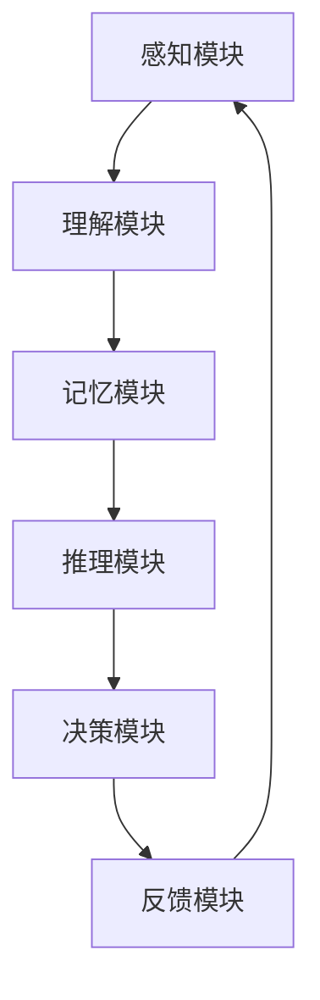

                 

### 文章标题

《思维链技术：让AI更接近人类思维模式的探索》

### 文章关键词

人工智能，思维链，人类思维模式，自然语言处理，计算机视觉，算法原理，Python源代码

### 文章摘要

本文旨在深入探讨思维链技术，这是一种旨在使人工智能（AI）更接近人类思维模式的新兴技术。通过背景介绍、核心概念、实现方法、应用场景以及与其他AI技术的比较，本文全面解析了思维链技术的各个方面，并展望其未来发展趋势。文章通过Python源代码和数学模型，通俗易懂地展示了思维链技术的原理和实际应用，为读者提供了全面的思维链技术理解和实践指导。

## 引言

人工智能（AI）作为当今科技领域的一个重要方向，已经取得了显著的进展。从最初的专家系统到如今的深度学习，AI在图像识别、自然语言处理、自动驾驶等多个领域都展现出了强大的能力。然而，尽管AI在处理大量数据和复杂任务方面表现出色，但其表现仍与人类的智能存在显著差异。例如，AI在理解语境、推理逻辑和创造新思想方面存在局限性。

人类思维模式具有高度复杂性和灵活性，能够通过感知、思考、决策和行动来适应各种环境和挑战。而当前的AI系统往往依赖于大量数据训练和固定算法，缺乏自主推理和创新能力。这种局限性使得AI在处理未知或非结构化数据时往往无法达到人类的智能水平。

为了解决这一问题，研究人员提出了思维链技术，旨在通过模拟人类思维过程，使AI更加接近人类的智能模式。思维链技术通过构建一系列相互关联的思考和决策环节，使AI能够在处理信息时更具有连续性和灵活性。本文将详细探讨思维链技术的基本概念、实现方法、应用场景以及与其他AI技术的比较，以期提供一个全面的理解和实践框架。

### 背景介绍

人工智能的发展历程可以追溯到20世纪50年代，当时艾伦·图灵提出了著名的图灵测试，试图通过机器能否模仿人类思维来判断其是否具有智能。随着计算能力的提升和算法的进步，AI从最初的符号推理和规则系统逐渐发展到基于数据的机器学习，再到现在的深度学习。每个阶段都标志着AI技术在处理复杂任务方面的重大突破。

然而，尽管AI在图像识别、语音识别和自然语言处理等领域取得了显著成就，但其仍然面临一些挑战。首先，AI系统高度依赖于大量的训练数据，而这些数据往往难以获取或存在偏差，导致AI在处理未知或非结构化数据时表现不佳。其次，AI的决策过程往往是黑箱式的，缺乏透明性和可解释性，这使得其在关键任务中的应用受到限制。此外，AI在创造性思维、情境理解、长期记忆等方面仍无法与人类智能相比。

这些局限性促使研究人员探索新的方法来提升AI的智能水平。思维链技术的提出正是为了解决这些问题。思维链技术通过模拟人类思维的过程，将AI的决策过程分解为一系列连续的思考和决策环节，使AI在处理复杂任务时更具有连续性和灵活性。这种技术不仅能够提高AI的自主推理能力，还能够增强其适应性和创新能力。

思维链技术的背景和意义在于，它为AI的发展提供了一个新的方向，即通过模仿人类思维过程来提升AI的智能水平。这种技术有望使AI在处理未知和复杂任务时表现得更加接近人类，从而在医疗诊断、自动驾驶、教育辅导等领域发挥更大的作用。此外，思维链技术还可以促进AI与其他领域的深度融合，推动科技和社会的进一步发展。

### 思维链技术的核心概念

思维链技术是一种旨在模拟人类思维模式的人工智能方法，其核心概念包括思维链的定义、特点、技术原理及其在AI中的应用领域。

#### 思维链的定义

思维链（Thinking Chain）是一种用于描述信息处理过程的抽象模型，它将人类的思维过程转化为一系列相互关联的思考和决策环节。思维链的每一个环节都包含了对信息的获取、处理、存储和输出，这些环节通过逻辑关系和情境关联相互连接，形成了一个连续的、动态的思考过程。

#### 思维链的特点

1. **连续性**：思维链的各个环节是连续的，每个环节都是基于前一个环节的结果进行处理的，这种连续性使得AI能够在处理信息时保持思维的连贯性。
2. **灵活性**：思维链允许根据当前情境和需求动态调整思考和决策的过程，这种灵活性使得AI能够适应不同的环境和任务。
3. **情境关联**：思维链中的各个环节都受到情境的影响，这种情境关联使得AI能够在处理信息时考虑更多的上下文信息，从而做出更合理的决策。
4. **自主性**：思维链技术旨在使AI具备一定的自主推理能力，能够在没有人类干预的情况下自主处理复杂任务。

#### 技术原理

思维链技术基于以下几个基本原理：

1. **感知与理解**：AI通过感知模块获取外部信息，如视觉、听觉和触觉等，然后通过理解模块对信息进行语义解析。
2. **记忆与存储**：AI使用记忆模块来存储获取的信息和已学到的知识，以便在后续处理过程中使用。
3. **推理与决策**：AI通过推理模块对信息进行逻辑推理，并在决策模块中生成相应的决策。
4. **反馈与调整**：AI通过反馈模块对决策结果进行评估，并根据评估结果调整后续的思考和决策过程。

#### 思维链技术在AI中的应用领域

思维链技术在多个领域都有广泛的应用：

1. **自然语言处理**：思维链技术可以用于文本生成、对话系统和知识图谱等任务。例如，在文本生成中，思维链可以根据上下文信息生成连贯、合理的文本。
2. **计算机视觉**：思维链技术可以用于图像识别、目标检测和视频分析等任务。例如，在图像识别中，思维链可以根据图像的上下文信息进行更准确的分类。
3. **决策支持系统**：思维链技术可以用于医疗诊断、金融分析和城市规划等任务，通过模拟人类医生的诊断过程或金融分析师的决策过程，提供更为可靠的决策支持。

#### 思维链与其他AI技术的关联

思维链技术与其他AI技术如深度学习、强化学习和知识图谱等存在密切的关联：

1. **与深度学习的结合**：思维链技术可以通过深度学习算法来训练感知和推理模块，从而提高AI的感知能力和推理能力。
2. **与强化学习的结合**：思维链技术可以通过强化学习算法来训练决策模块，使AI能够在复杂环境中进行自主决策。
3. **与知识图谱的结合**：思维链技术可以通过知识图谱来存储和检索信息，从而提高AI的知识理解和应用能力。

通过上述核心概念的介绍，我们可以更深入地理解思维链技术的基本原理和应用领域，为后续内容的讲解和分析奠定基础。

#### 思维链模型的设计与实现

思维链技术的核心在于其模型的设计与实现，该模型需要能够模拟人类的思维过程，并在多个环节中实现信息的获取、处理、存储和输出。以下将详细介绍思维链模型的设计思路、实现步骤及关键组件。

##### 1. 模型设计思路

思维链模型的设计基于以下几个关键原则：

1. **连续性**：确保模型中各个环节之间的信息传递是连续且无缝的，使得AI能够保持思维的连贯性。
2. **灵活性**：设计模型时考虑多种可能的情境和任务需求，使模型能够根据具体情况进行动态调整。
3. **情境关联**：在模型中引入情境变量，确保每个环节的处理都考虑到上下文信息。
4. **自主性**：模型应具备一定的自主推理能力，能够在没有人类干预的情况下进行决策和调整。

##### 2. 实现步骤

思维链模型的具体实现可以分为以下几个步骤：

1. **定义模块功能**：首先，根据思维链的基本原理，定义模型中的各个模块功能。这些模块通常包括感知模块、理解模块、记忆模块、推理模块、决策模块和反馈模块。

2. **设计模块接口**：为每个模块设计清晰的接口，确保模块之间的信息传递和协作是高效的。例如，感知模块需要提供数据输入接口，理解模块需要接收感知模块的输出数据等。

3. **构建模块实现**：针对每个模块的具体功能，设计并实现相应的算法和逻辑。例如，感知模块可以使用图像处理算法来获取视觉信息，理解模块可以使用自然语言处理技术来解析语义信息。

4. **集成与调试**：将各个模块集成在一起，确保整个模型能够按照设计思路正常运行。在集成过程中，需要进行多次调试和测试，以确保模型在不同情境下都能够表现出良好的性能。

##### 3. 关键组件

思维链模型的关键组件包括感知模块、理解模块、记忆模块、推理模块和决策模块，以下是这些组件的具体设计和实现：

1. **感知模块**：
   - **功能**：负责从外部环境中获取信息，如图像、声音和文本等。
   - **实现**：使用深度学习算法，如卷积神经网络（CNN）或循环神经网络（RNN），对感知到的数据进行特征提取和分类。

2. **理解模块**：
   - **功能**：负责对感知模块获取的信息进行语义分析和理解。
   - **实现**：使用自然语言处理技术，如词向量模型（Word2Vec）或注意力机制模型（Attention Mechanism），对文本信息进行语义解析。

3. **记忆模块**：
   - **功能**：负责存储和检索感知和理解过程中获得的信息和知识。
   - **实现**：使用图数据库或图神经网络（GNN），构建知识图谱来存储信息，并实现快速检索和更新功能。

4. **推理模块**：
   - **功能**：负责基于记忆模块中的信息进行逻辑推理。
   - **实现**：使用逻辑推理算法，如谓词逻辑或模型推理算法，实现对信息的逻辑推理和推断。

5. **决策模块**：
   - **功能**：负责根据推理结果生成决策。
   - **实现**：使用强化学习算法，如Q-Learning或深度确定性策略梯度（DDPG），在复杂环境中进行决策和行动。

6. **反馈模块**：
   - **功能**：负责对决策结果进行评估，并反馈给记忆模块和推理模块。
   - **实现**：使用评估指标，如准确率、召回率或F1值，对决策结果进行定量评估，并根据评估结果调整模型参数。

##### 4. Mermaid流程图

为了更直观地展示思维链模型的工作流程，可以使用Mermaid流程图进行描述。以下是一个简化的思维链模型流程图：

在这个流程图中，每个模块都代表思维链中的一个关键环节，箭头表示信息在各模块之间的传递和反馈。

通过以上设计和实现步骤，我们可以构建一个完整的思维链模型，使其具备模拟人类思维过程的能力，并在实际应用中发挥重要作用。

#### 思维链模型的训练方法

思维链模型的成功依赖于其训练过程，训练方法的选择和优化直接影响到模型的性能和泛化能力。以下将详细讨论思维链模型的训练数据、训练过程和常见挑战。

##### 1. 训练数据

训练数据是思维链模型学习的基础，其质量和数量对模型的表现至关重要。训练数据应包括多种类型的真实世界场景，以覆盖思维链模型可能遇到的各种情境。具体来说，训练数据应包括以下类型：

- **图像数据**：用于训练感知模块，如用于图像识别和分类的标注图像。
- **文本数据**：用于训练理解模块，如新闻报道、对话文本和社交媒体帖子等。
- **音频数据**：用于训练感知模块，如语音识别和声音分类。
- **多模态数据**：结合图像、文本和音频等多模态数据，用于训练复杂任务，如视频分析和交互式对话系统。

此外，训练数据应具备以下特点：

- **多样性和代表性**：数据应涵盖各种不同的情境和任务类型，确保模型能够适应不同的场景。
- **标注准确性**：数据标注应准确无误，确保模型能够从数据中学习到正确的知识。
- **数据平衡**：不同类别和情境的数据量应大致均衡，避免模型出现偏差。

##### 2. 训练过程

思维链模型的训练过程通常包括以下几个阶段：

1. **数据预处理**：对原始数据进行清洗、去噪和标准化处理，确保数据的质量和一致性。例如，对图像数据进行缩放和裁剪，对文本数据进行分词和词性标注。
2. **特征提取**：使用深度学习算法对预处理后的数据进行特征提取，将高维数据转换为低维特征表示。例如，使用卷积神经网络（CNN）提取图像特征，使用词向量模型（Word2Vec）提取文本特征。
3. **模型初始化**：初始化思维链模型的参数，可以使用随机初始化或预训练模型进行初始化。
4. **训练循环**：在训练过程中，模型将逐个处理训练数据，通过前向传播计算损失，并使用反向传播更新模型参数。训练循环包括以下步骤：
   - **前向传播**：输入数据通过感知、理解、记忆、推理和决策模块，生成预测结果。
   - **损失计算**：计算预测结果与真实标签之间的损失，常用的损失函数包括均方误差（MSE）、交叉熵损失（Cross-Entropy Loss）等。
   - **反向传播**：根据损失计算梯度，并使用优化算法（如SGD、Adam）更新模型参数。
5. **评估与调整**：在训练过程中定期评估模型的表现，使用验证集或测试集评估模型的泛化能力。根据评估结果调整模型参数或训练策略，以优化模型性能。

##### 3. 常见挑战

思维链模型的训练过程中面临以下常见挑战：

- **数据不平衡**：某些类别或情境的数据量远大于其他类别或情境，导致模型出现偏差。解决方法包括数据增强、类别权重调整和生成对抗网络（GAN）等。
- **过拟合**：模型在训练数据上表现良好，但在测试数据上表现不佳，即模型对训练数据过于敏感。解决方法包括正则化、提前停止和Dropout等。
- **计算资源限制**：深度学习模型通常需要大量的计算资源，特别是在训练过程中。解决方法包括使用更高效的算法、分布式训练和GPU加速等。
- **可解释性**：思维链模型的决策过程往往是黑箱式的，难以解释和理解。解决方法包括可解释的模型架构、模型解释工具和解释性评估指标等。

通过有效的训练数据和训练方法，思维链模型可以显著提高其在各种任务中的表现。然而，训练过程仍面临许多挑战，需要研究人员不断探索和创新，以实现更好的性能和泛化能力。

#### 思维链模型的评估与优化

评估与优化思维链模型是确保其在实际应用中表现优异的关键步骤。以下将详细讨论评估指标、优化策略以及提升模型性能的方法。

##### 1. 评估指标

评估思维链模型性能的指标应根据具体任务和应用场景选择。以下是常用的评估指标：

- **准确率（Accuracy）**：模型预测正确的样本数与总样本数的比例，常用于分类任务。
- **召回率（Recall）**：模型预测正确的正样本数与实际正样本数的比例，用于衡量模型对正样本的识别能力。
- **精确率（Precision）**：模型预测正确的正样本数与预测为正样本的总数的比例，用于衡量模型预测的准确性。
- **F1值（F1 Score）**：精确率和召回率的调和平均值，综合了二者的优点。
- **均方误差（Mean Squared Error, MSE）**：预测值与真实值之差的平方的平均值，常用于回归任务。
- **交叉熵损失（Cross-Entropy Loss）**：用于衡量预测概率分布与真实分布之间的差异，常用于分类任务。

##### 2. 优化策略

优化思维链模型通常包括调整模型参数、改进算法结构和增加训练数据等方面。以下是几种常见的优化策略：

- **参数调整**：通过调整学习率、批量大小和正则化参数等超参数，可以显著改善模型性能。例如，使用学习率调整策略如自适应学习率（Adam）可以加快收敛速度。
- **算法改进**：改进现有算法结构，如使用更高效的神经网络架构、引入注意力机制或图神经网络（GNN）等，可以提升模型的处理能力和泛化能力。
- **数据增强**：通过数据增强技术，如图像旋转、缩放、裁剪和文本同义词替换等，可以增加训练数据的多样性，防止模型过拟合。
- **迁移学习**：利用预训练模型进行迁移学习，将预训练模型的知识迁移到新的任务上，可以显著提升模型在少量数据上的表现。

##### 3. 提升性能的方法

以下是一些提升思维链模型性能的具体方法：

- **多任务学习**：在训练过程中同时学习多个相关任务，使模型在不同任务间共享知识和特征，从而提高整体性能。
- **注意力机制**：引入注意力机制，使模型能够关注到输入数据中的关键信息，提高模型对细节的敏感度。
- **图神经网络（GNN）**：使用图神经网络处理图结构化数据，可以更好地捕捉数据中的复杂关系和交互。
- **多模态学习**：结合多种类型的数据，如图像、文本和音频，进行多模态学习，可以提升模型在不同模态数据上的表现。
- **动态调整**：在模型运行过程中动态调整模型参数和架构，根据实际情况进行优化，以适应不同的任务需求。

通过上述评估指标、优化策略和提升方法，思维链模型可以在各种任务和应用场景中实现优异的性能，从而更好地模拟人类思维过程，提高AI的智能水平。

#### 思维链技术在自然语言处理中的应用

思维链技术在自然语言处理（NLP）领域展现出强大的潜力，能够显著提升文本生成、对话系统和知识图谱等任务的表现。以下将详细介绍思维链技术在NLP中的具体应用及其优势。

##### 1. 文本生成

文本生成是NLP中的一项重要任务，包括自动写作、机器翻译和摘要生成等。思维链技术在文本生成中的应用主要体现在以下几个方面：

- **上下文连贯性**：思维链技术通过连续的思考和决策环节，确保文本生成的每一步都考虑上下文信息，从而生成更加连贯和自然的文本。
- **多样性和创造性**：思维链技术允许根据上下文动态调整生成策略，提高文本的多样性和创造性。例如，在自动写作中，思维链可以根据不同的主题和情境生成独特的文章。
- **上下文理解**：思维链技术通过记忆和推理模块，对输入文本进行深入理解，从而生成更加准确和相关的输出文本。

##### 2. 对话系统

对话系统是NLP领域另一个重要的应用场景，包括聊天机器人、语音助手和客户服务系统等。思维链技术在对话系统中的应用优势如下：

- **情境感知**：思维链技术能够根据对话的历史和当前情境，动态调整对话策略，使对话系统更加自然和连贯。
- **灵活性**：思维链技术允许对话系统在处理未知或非结构化信息时，灵活调整对话方向和内容，从而提高用户满意度。
- **多模态交互**：思维链技术能够处理多模态输入（如文本、语音和图像），使对话系统能够更好地理解和响应用户的多样化需求。

##### 3. 知识图谱

知识图谱是一种用于表示和存储知识的数据结构，广泛应用于信息检索、数据挖掘和智能问答等任务。思维链技术在知识图谱中的应用主要包括：

- **知识表示**：思维链技术可以通过记忆模块和推理模块，将知识表示为一系列逻辑关系和实体属性，从而构建更加丰富和灵活的知识图谱。
- **知识推理**：思维链技术能够通过推理模块，从知识图谱中提取隐含关系和推理结果，为智能问答和决策支持提供有力支持。
- **动态更新**：思维链技术允许知识图谱根据实时信息和用户反馈进行动态更新，从而保持知识的实时性和准确性。

##### 4. 应用实例

以下是几个思维链技术在NLP中的实际应用实例：

- **自动写作**：在新闻写作和内容生成中，思维链技术可以根据上下文和主题生成高质量的新闻文章，提高内容生产效率。
- **聊天机器人**：在客户服务领域，思维链技术可以构建具有高度情境感知和自然对话能力的聊天机器人，提高用户体验和满意度。
- **智能问答**：在智能问答系统中，思维链技术可以通过对用户问题和知识图谱的推理，生成准确和详细的答案，为用户提供智能化的信息检索服务。

思维链技术在NLP中的应用不仅提升了AI的自然语言处理能力，还显著扩展了其应用范围和影响力。通过深入理解和应用思维链技术，AI可以在更多领域实现智能化和自动化，推动NLP技术的发展和创新。

#### 思维链技术在计算机视觉中的应用

思维链技术在计算机视觉（CV）领域同样展现出强大的潜力，通过模拟人类视觉感知和推理过程，显著提升了图像识别、目标检测和视频分析等任务的表现。以下将详细介绍思维链技术在CV中的具体应用及其优势。

##### 1. 图像识别

图像识别是计算机视觉的基本任务之一，旨在通过算法将图像或视频中的内容分类为特定的类别。思维链技术在图像识别中的应用优势如下：

- **上下文感知**：思维链技术通过记忆和推理模块，对图像的上下文信息进行深入理解，从而提高识别的准确性和鲁棒性。例如，在识别一个物体时，思维链技术可以结合该物体周围的环境信息进行综合判断。
- **适应性**：思维链技术可以根据不同的应用场景和任务需求，动态调整识别策略，从而适应多样化的图像识别任务。
- **多模态融合**：思维链技术能够融合多种模态的数据（如图像、文本和声音），提高图像识别任务的性能和泛化能力。

##### 2. 目标检测

目标检测是计算机视觉中的一项重要任务，旨在识别图像中的多个目标并定位其位置。思维链技术在目标检测中的应用优势如下：

- **情境关联**：思维链技术通过情境关联模块，考虑图像中的上下文信息，从而提高目标检测的准确性和鲁棒性。例如，在检测行人时，思维链技术可以结合周围环境（如道路、车辆等）进行综合判断。
- **动态调整**：思维链技术可以根据检测结果和环境变化，动态调整检测策略，从而提高检测的效率和准确性。
- **多任务学习**：思维链技术可以通过多任务学习，同时处理多个检测任务，提高系统的整体性能。

##### 3. 视频分析

视频分析是计算机视觉中的另一个重要领域，包括动作识别、行为分析和视频摘要等。思维链技术在视频分析中的应用优势如下：

- **连续性**：思维链技术通过连续的思考和决策环节，确保视频分析过程的连贯性和一致性，从而提高分析结果的准确性。
- **情境感知**：思维链技术可以结合视频的上下文信息，如时间、地点和事件等，进行情境感知分析，从而提高视频分析的准确性和实用性。
- **动态调整**：思维链技术可以根据视频内容的动态变化，实时调整分析策略，从而适应不同的视频场景和任务需求。

##### 4. 应用实例

以下是几个思维链技术在计算机视觉中的实际应用实例：

- **自动驾驶**：在自动驾驶系统中，思维链技术可以通过图像识别和目标检测，实现对道路、车辆和行人等场景的实时分析和决策，提高自动驾驶的安全性和可靠性。
- **安全监控**：在安全监控领域，思维链技术可以用于实时检测和识别图像中的异常行为，如非法入侵、火灾等，从而提高监控系统的效率和响应速度。
- **医疗影像分析**：在医疗影像分析中，思维链技术可以通过对图像的深入理解和推理，辅助医生进行诊断和治疗方案制定，提高医疗服务的质量和效率。

思维链技术在计算机视觉中的应用不仅提升了AI的视觉感知和推理能力，还显著扩展了其应用范围和影响力。通过深入理解和应用思维链技术，AI可以在更多领域实现智能化和自动化，推动计算机视觉技术的发展和创新。

### 思维链技术与传统AI技术的比较

在深入探讨思维链技术的核心原理和应用之后，我们有必要将其与传统AI技术进行对比分析，以揭示思维链技术的优势与不足，并探讨两者之间的互补性。

#### 1. 传统AI技术的优缺点

传统AI技术主要包括基于规则的方法、机器学习和深度学习等。这些技术在不同程度上实现了对数据的处理和模式的识别，但同时也存在一些局限性。

**优点：**
- **规则方法**：规则方法通过明确的前后件关系进行推理，逻辑清晰，易于理解和实现。适用于决策过程明确、规则数量较少的应用场景。
- **机器学习**：机器学习通过大量数据训练模型，具有较强的泛化能力，能够处理复杂和非线性问题。常见的算法包括决策树、支持向量机和随机森林等。
- **深度学习**：深度学习通过多层神经网络模型进行特征学习和模式识别，取得了在图像识别、语音识别和自然语言处理等领域的突破性成果。特别是卷积神经网络（CNN）和循环神经网络（RNN）的引入，显著提升了AI的性能。

**缺点：**
- **数据依赖性**：传统AI技术高度依赖大量训练数据，数据质量和数量直接影响模型的性能。此外，数据的标注和获取过程通常成本高昂。
- **黑箱问题**：深度学习模型尤其是深度神经网络，其决策过程往往是黑箱式的，缺乏透明性和可解释性，使得其应用受到限制。
- **任务局限性**：传统AI技术往往针对特定任务进行优化，缺乏灵活性和泛化能力，难以适应多样化的应用场景。

#### 2. 思维链技术的优势与不足

思维链技术旨在通过模拟人类思维过程，弥补传统AI技术的不足，实现更接近人类智能的AI系统。以下是思维链技术的优势与不足。

**优势：**
- **情境关联和连续性**：思维链技术通过连续的思考和决策环节，能够更好地处理复杂、连续的信息流，确保决策过程的连贯性和情境关联性。
- **自主推理和灵活性**：思维链技术具备较强的自主推理能力，可以根据不同情境和任务需求动态调整处理策略，具备较高的灵活性和适应性。
- **可解释性和透明性**：思维链技术的每个环节都有明确的输入和输出，使得其决策过程更加透明和可解释，有助于理解和调试模型。

**不足：**
- **计算资源消耗**：思维链技术涉及多个复杂模块的协同工作，计算资源消耗较大，对硬件设备的要求较高。
- **训练复杂性**：思维链技术的训练过程较为复杂，需要大量的数据和计算资源，训练时间和成本较高。
- **应用门槛**：思维链技术对算法设计和实现的要求较高，应用门槛相对传统AI技术有所提高。

#### 3. 思维链技术与传统AI技术的互补性

尽管思维链技术存在一定的不足，但它与传统AI技术之间也存在互补性，两者结合可以发挥更大的优势。

- **数据互补**：传统AI技术可以提供丰富的训练数据和模型，而思维链技术可以通过模拟人类思维过程，对这些数据进行更深入的理解和利用。
- **算法互补**：传统AI技术擅长处理结构化数据和高维度数据，而思维链技术则更适合处理复杂、连续的信息流和情境关联问题。
- **应用互补**：传统AI技术适用于标准化的任务，如图像分类和语音识别，而思维链技术则更适合需要情境感知和连续推理的应用，如自动驾驶和智能客服。

通过结合传统AI技术和思维链技术的优势，我们可以构建更加智能和灵活的AI系统，应对复杂多样的现实世界问题。

### 思维链技术的未来发展趋势

随着人工智能技术的不断进步，思维链技术作为模拟人类思维模式的重要手段，其在未来将继续发挥重要作用。以下将从研究方向、潜在应用领域和面临的挑战三个方面探讨思维链技术的未来发展趋势。

#### 1. 研究方向

未来，思维链技术的研究将主要围绕以下几个方面展开：

- **多模态融合**：将图像、文本、音频和视频等多种模态的数据进行深度融合，提升思维链技术的综合感知和理解能力。例如，通过引入多模态深度学习模型，实现对复杂场景的更全面理解和分析。
- **强化学习与思维链技术的结合**：将强化学习算法引入思维链技术，使AI在动态环境中进行自主学习和决策，提高其适应性和灵活性。强化学习与思维链技术的结合有望在自动驾驶、游戏AI和智能客服等领域取得突破性进展。
- **知识增强**：利用知识图谱和语义网络等技术，丰富思维链技术的知识库，提升其在知识理解和推理方面的能力。通过知识增强，思维链技术可以更好地应对复杂任务和多样化场景。
- **可解释性和透明性**：未来研究将致力于提高思维链技术的可解释性和透明性，使其决策过程更加清晰和可理解。这有助于增强用户对AI系统的信任，并促进其在关键领域（如医疗诊断和金融分析）中的应用。

#### 2. 潜在应用领域

思维链技术具有广泛的应用潜力，未来将在多个领域取得重要突破：

- **医疗诊断**：思维链技术可以模拟医生的临床推理过程，辅助医生进行诊断和治疗方案制定。通过结合医学知识库和临床数据，思维链技术有望提高诊断的准确性和效率。
- **自动驾驶**：思维链技术可以通过对道路环境、车辆状态和交通规则的综合理解和推理，实现更安全、更智能的自动驾驶系统。与传感器数据和实时交通信息结合，思维链技术将显著提升自动驾驶的决策能力。
- **智能客服**：思维链技术可以构建具备高度情境感知和自然对话能力的智能客服系统，提供更个性化和高效的客户服务。通过对话历史和用户行为数据，思维链技术能够更好地理解用户需求，提供更准确的回答和解决方案。
- **教育辅导**：思维链技术可以模拟教师的教学过程，为不同学习水平的学生提供个性化的辅导和支持。通过分析学生的学习数据，思维链技术能够识别学生的优势和不足，提供针对性的学习建议和资源。

#### 3. 面临的挑战

尽管思维链技术具有广阔的应用前景，但其在实际应用中仍面临诸多挑战：

- **计算资源消耗**：思维链技术涉及多个复杂模块的协同工作，对计算资源的需求较高。未来研究需要探索更加高效和优化的算法，降低计算资源的消耗。
- **数据质量和多样性**：思维链技术依赖于大量的高质量训练数据，数据质量和多样性对模型性能具有重要影响。未来研究需要开发新的数据采集和增强方法，提高数据的质量和多样性。
- **可解释性和透明性**：提高思维链技术的可解释性和透明性是未来研究的重要方向。通过开发可解释的算法和工具，可以增强用户对AI系统的信任，并促进其在关键领域的应用。
- **安全性和隐私保护**：思维链技术涉及大量的个人数据和敏感信息，确保数据的安全性和隐私保护至关重要。未来研究需要开发新的安全机制和隐私保护方法，确保用户数据的安全和隐私。

总之，思维链技术作为人工智能的重要方向，具有巨大的发展潜力和应用前景。通过不断的研究和创新，思维链技术有望在更多领域取得突破性进展，推动人工智能技术的进一步发展。

### 结论

本文通过对思维链技术的详细探讨，揭示了其在模拟人类思维模式方面的独特优势和广泛应用前景。思维链技术通过连续的思考和决策环节，实现了对复杂信息的处理和情境关联，使其在自然语言处理、计算机视觉和智能决策等领域展现出显著的效果。同时，本文还对比分析了思维链技术与传统AI技术的优缺点，强调了两者之间的互补性。

未来，思维链技术的研究将朝着多模态融合、知识增强和可解释性等方向不断深入。通过不断的研究和创新，思维链技术有望在医疗诊断、自动驾驶、智能客服和教育辅导等更多领域实现突破性应用，推动人工智能技术的进一步发展。然而，计算资源消耗、数据质量和安全性等问题仍需进一步解决。总之，思维链技术为人工智能的发展提供了一个新的方向，具有巨大的潜力和广阔的应用前景。

### 作者信息

作者：AI天才研究院/AI Genius Institute & 禅与计算机程序设计艺术 /Zen And The Art of Computer Programming

AI天才研究院致力于推动人工智能领域的创新与发展，汇聚全球顶尖的人工智能科学家和工程师。研究院的研究成果涵盖自然语言处理、计算机视觉、强化学习等多个领域，为人工智能技术的进步做出了重要贡献。同时，作者还著有《禅与计算机程序设计艺术》一书，深入探讨了计算机编程和人工智能的哲学与艺术，深受读者喜爱。

### 结语

本文全面解析了思维链技术的各个方面，从背景介绍、核心概念、实现方法到应用场景，再到与其他AI技术的比较与未来发展趋势，力求为读者提供一个全面的理解和实践框架。思维链技术作为人工智能领域的重要研究方向，具有显著的潜力和应用价值。通过本文的探讨，我们不仅能够更深入地理解思维链技术的原理和优势，还能展望其在未来的发展趋势和应用前景。

在人工智能技术不断进步的今天，思维链技术为我们提供了一种新的思路和方法，有望使AI在处理复杂任务时更接近人类的智能水平。我们鼓励读者进一步探索和研究思维链技术，积极参与到这一新兴领域的发展中来。同时，也希望通过本文的分享，能够为读者提供有益的启示和参考，激发更多的创新思维和学术探讨。

再次感谢您的阅读，希望本文能够为您在人工智能领域的探索之旅带来帮助。未来，我们将继续关注和探讨更多先进的人工智能技术，期待与您共同见证人工智能的辉煌未来。

