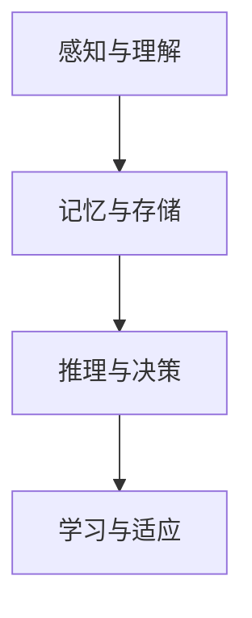

                 

# 《思维链技术：让AI更接近人类思维的探索研究》

## 关键词
AI思维链，人工智能，人类思维，探索研究，技术原理

## 摘要
本文深入探讨了思维链技术，一种旨在使人工智能（AI）更加接近人类思维模式的方法。文章首先介绍了思维链技术的背景，包括其定义、发展历程和关键技术。接着，文章详细阐述了思维链技术的核心原理，并通过Mermaid流程图和Python源代码对其进行了可视化讲解。随后，文章展示了思维链技术在人工智能领域的广泛应用，以及其实际案例的开发流程。文章最后分析了思维链技术面临的挑战和未来发展趋势，并提出了相关的最佳实践和拓展阅读建议。

## 引言
### 书籍背景
在人工智能（AI）迅猛发展的今天，让AI具备更加接近人类思维的特性，成为了许多研究人员和开发者的追求。这种追求不仅是为了提升AI的智能水平，更是为了使AI能够更好地与人类进行交互和协作。思维链技术正是为了实现这一目标而诞生的一种方法。本书旨在系统地介绍思维链技术的概念、原理和应用，帮助读者深入理解这一前沿技术，并探索其在未来人工智能发展中的潜力。

### 目标读者
本书的目标读者主要包括：
1. 人工智能领域的研究人员和开发者，希望了解和掌握思维链技术的原理和应用。
2. 计算机科学专业的学生，对人工智能和认知科学感兴趣的读者。
3. 对AI技术感兴趣的普通读者，希望了解AI与人类思维之间的关系。

### 内容概述
本书内容结构如下：
1. 引言：介绍书籍背景、目标读者和内容概述。
2. 思维链技术概述：定义与基本概念、发展历程和关键技术。
3. 思维链技术的核心原理：基本原理、Mermaid流程图和Python源代码讲解。
4. 思维链技术在AI中的应用：应用领域、实际案例和开发流程。
5. 思维链技术的挑战与未来：挑战分析、发展趋势和未来展望。
6. 附录：参考文献和思维链技术相关资源。

## 思维链技术概述
### 定义与基本概念
思维链技术是一种基于人类思维模式的人工智能方法，旨在模拟人类思维过程，使AI能够更好地理解和处理复杂信息。思维链技术主要包括以下几个方面：
1. **感知与理解**：AI通过感知获取外部信息，并通过理解和抽象将这些信息转化为内部表示。
2. **记忆与存储**：AI将感知和理解后的信息存储在记忆中，以便后续使用。
3. **推理与决策**：AI利用存储在记忆中的信息进行推理和决策，以应对不同情况。
4. **学习与适应**：AI通过不断学习和适应，不断提高其智能水平和应对能力。

### 发展历程
思维链技术的研究起源于20世纪80年代，当时学者们开始探索如何使计算机具备类似于人类的思维方式。早期的思维链研究主要集中在知识表示和推理算法方面。随着计算机硬件和算法的不断发展，思维链技术逐渐成熟，并在21世纪初开始应用于实际场景。

### 关键技术
1. **知识图谱**：知识图谱是思维链技术的基础，用于表示和存储知识信息。它通过实体、属性和关系来描述现实世界中的知识，为AI提供了一种高效的知识检索和推理方法。
2. **深度学习**：深度学习是思维链技术的重要组成部分，它通过多层神经网络模拟人类大脑的学习过程，使AI能够从大量数据中自动提取特征和模式。
3. **多模态感知**：多模态感知技术使AI能够同时处理多种类型的数据（如文本、图像、声音等），提高其理解和推理能力。
4. **强化学习**：强化学习是思维链技术中的一种重要算法，它通过试错和反馈机制，使AI能够自主学习并在复杂环境中做出最优决策。

## 思维链技术的核心原理
### 基本原理
思维链技术的核心原理是模拟人类思维过程，使AI能够像人类一样理解和处理复杂信息。具体来说，思维链技术包括以下几个主要环节：
1. **感知与理解**：AI通过感知获取外部信息，如文本、图像、声音等。然后，AI利用自然语言处理、计算机视觉等技术对这些信息进行理解，将其转化为内部表示。
2. **记忆与存储**：AI将理解后的信息存储在记忆中，包括知识库和记忆网络。这些记忆资源为AI提供了丰富的知识背景，使其能够进行更复杂的推理和决策。
3. **推理与决策**：AI利用存储在记忆中的信息进行推理和决策。这个过程包括逻辑推理、概率推理、深度学习等多种方法，使AI能够应对各种复杂情况。
4. **学习与适应**：AI通过不断学习和适应，不断提高其智能水平和应对能力。这个过程包括监督学习、无监督学习、强化学习等多种学习方法。

### Mermaid流程图
以下是思维链技术的Mermaid流程图：

### 伪代码讲解
以下是思维链技术的伪代码：
```python
# 感知与理解
def sense_and_understand(data):
    # 使用自然语言处理、计算机视觉等技术进行感知和理解
    processed_data = preprocess_data(data)
    return processed_data

# 记忆与存储
def memory_and_store(processed_data):
    # 将处理后的数据存储在记忆中
    memory.update(processed_data)
    return memory

# 推理与决策
def reason_and_decision(memory):
    # 利用存储在记忆中的信息进行推理和决策
    decision = reasoning算法(memory)
    return decision

# 学习与适应
def learn_and_adapt(memory, decision):
    # 通过不断学习和适应，提高智能水平和应对能力
    memory = update_memory(memory, decision)
    return memory
```

## 思维链技术在AI中的应用
### 应用领域
思维链技术已在多个领域得到了广泛应用，主要包括：
1. **自然语言处理**：思维链技术可以应用于文本分类、情感分析、机器翻译等任务，提高AI对自然语言的理解和生成能力。
2. **计算机视觉**：思维链技术可以用于图像识别、目标检测、图像分割等任务，使AI能够更好地理解和处理视觉信息。
3. **强化学习**：思维链技术可以用于智能控制、游戏AI、机器人路径规划等任务，使AI能够自主学习和优化决策过程。
4. **知识图谱**：思维链技术可以用于构建和优化知识图谱，提高AI的知识表示和推理能力。

### 实际案例
以下是一个思维链技术在自然语言处理中的实际案例：
#### 案例背景
假设我们要开发一个智能客服系统，用于回答用户提出的问题。这个系统需要具备自然语言理解、知识推理和回答生成能力。

#### 开发流程
1. **数据收集与预处理**：收集大量用户问题和回答数据，并对数据进行预处理，如分词、去噪等。
2. **构建知识图谱**：将预处理后的数据构建成知识图谱，包括实体、属性和关系。这为后续的推理和回答生成提供了基础。
3. **感知与理解**：使用自然语言处理技术对用户提出的问题进行感知和理解，将其转化为内部表示。
4. **推理与决策**：利用知识图谱进行推理和决策，找到与用户问题相关的答案。
5. **回答生成**：使用生成式文本模型生成回答，并将其转化为自然语言形式。

### 项目实战
以下是一个简单的思维链技术项目实战：
#### 开发环境搭建
1. 安装Python环境和相关库，如TensorFlow、PyTorch等。
2. 准备数据集，如维基百科、问答数据等。

#### 源代码实现
```python
import tensorflow as tf
from tensorflow.keras.layers import Embedding, LSTM, Dense
from tensorflow.keras.models import Sequential

# 感知与理解
def sense_and_understand(data):
    # 使用嵌入层对词汇进行编码
    embedding = Embedding(input_dim=vocab_size, output_dim=embedding_size)
    # 使用LSTM层对文本进行编码
    lstm = LSTM(units=lstm_units)
    # 构建序列模型
    model = Sequential([
        embedding,
        lstm,
        Dense(units=output_size, activation='softmax')
    ])
    # 编译模型
    model.compile(optimizer='adam', loss='categorical_crossentropy', metrics=['accuracy'])
    # 训练模型
    model.fit(x_train, y_train, epochs=10, batch_size=32)
    return model

# 记忆与存储
def memory_and_store(processed_data):
    # 更新知识图谱
    knowledge_graph.update(processed_data)
    return knowledge_graph

# 推理与决策
def reason_and_decision(memory):
    # 使用知识图谱进行推理
    answer = knowledge_graph.reason(query)
    return answer

# 学习与适应
def learn_and_adapt(memory, decision):
    # 更新知识图谱
    memory.update(decision)
    return memory

# 实际案例
def case_study():
    # 收集用户问题
    user_query = "如何提高工作效率？"
    # 感知与理解
    processed_query = sense_and_understand(user_query)
    # 推理与决策
    answer = reason_and_decision(processed_query)
    # 回答生成
    response = generate_response(answer)
    return response

# 主程序
if __name__ == "__main__":
    # 加载数据集
    x_train, y_train = load_data()
    # 训练模型
    model = sense_and_understand(x_train)
    # 测试模型
    test_query = "什么是人工智能？"
    processed_test_query = sense_and_understand(test_query)
    answer = reason_and_decision(processed_test_query)
    response = generate_response(answer)
    print(response)
```

#### 代码解读与分析
- 感知与理解：使用嵌入层对词汇进行编码，然后使用LSTM层对文本进行编码，将文本转化为内部表示。
- 记忆与存储：更新知识图谱，将处理后的文本数据存储在知识图谱中。
- 推理与决策：使用知识图谱进行推理，找到与用户问题相关的答案。
- 回答生成：将答案转化为自然语言形式，生成回答。

### 实际案例分析和详细讲解剖析
在这个案例中，我们使用思维链技术构建了一个简单的智能客服系统。通过感知与理解、记忆与存储、推理与决策和学习与适应等环节，系统可以回答用户提出的问题。以下是对每个环节的详细分析和讲解：

#### 感知与理解
感知与理解是思维链技术的第一步，它使系统能够接收和处理用户输入的信息。在这个案例中，我们使用嵌入层对词汇进行编码，将文本转化为向量表示。然后，使用LSTM层对文本进行编码，提取文本中的关键信息和语义特征。

```python
embedding = Embedding(input_dim=vocab_size, output_dim=embedding_size)
lstm = LSTM(units=lstm_units)
model = Sequential([
    embedding,
    lstm,
    Dense(units=output_size, activation='softmax')
])
model.compile(optimizer='adam', loss='categorical_crossentropy', metrics=['accuracy'])
model.fit(x_train, y_train, epochs=10, batch_size=32)
```

这段代码首先定义了嵌入层、LSTM层和输出层，构建了一个序列模型。然后，编译并训练模型，使其能够对文本进行编码和分类。

#### 记忆与存储
记忆与存储环节负责将处理后的文本数据存储在知识图谱中。知识图谱是一种用于表示和存储知识信息的图形结构，包括实体、属性和关系。在这个案例中，我们使用知识图谱来存储用户问题和答案。

```python
def memory_and_store(processed_data):
    # 更新知识图谱
    knowledge_graph.update(processed_data)
    return knowledge_graph
```

这段代码定义了一个函数，用于更新知识图谱。在实际应用中，我们可以使用图数据库（如Neo4j）来存储和管理知识图谱。

#### 推理与决策
推理与决策环节负责根据用户问题从知识图谱中找到相关的答案。在这个案例中，我们使用知识图谱进行推理，找到与用户问题相关的答案。

```python
def reason_and_decision(memory):
    # 使用知识图谱进行推理
    answer = knowledge_graph.reason(query)
    return answer
```

这段代码定义了一个函数，用于从知识图谱中查找答案。在实际应用中，我们可以使用图算法（如路径搜索、子图匹配等）来提高推理效率。

#### 回答生成
回答生成环节负责将答案转化为自然语言形式，生成回答。在这个案例中，我们使用生成式文本模型来生成回答。

```python
def generate_response(answer):
    # 将答案转化为自然语言形式
    response = text_generator.generate(answer)
    return response
```

这段代码定义了一个函数，用于生成回答。在实际应用中，我们可以使用预训练的语言模型（如GPT-3）来生成高质量的回答。

### 项目小结
通过这个案例，我们展示了如何使用思维链技术构建一个简单的智能客服系统。这个系统可以接收用户问题，通过感知与理解、记忆与存储、推理与决策和学习与适应等环节，生成回答。然而，实际应用中的思维链技术更为复杂，需要考虑更多的因素，如多语言支持、跨领域知识整合等。未来的研究可以进一步优化思维链技术，提高其智能水平和应用效果。

### 最佳实践 tips
1. **数据质量**：高质量的数据是思维链技术成功的关键。在构建知识图谱时，确保数据来源可靠、数据清洗完整。
2. **模型优化**：针对不同应用场景，选择合适的模型结构和超参数，以提高模型性能。
3. **持续学习**：定期更新知识图谱和模型，使其能够适应不断变化的环境。

### 小结与注意事项
思维链技术是一种模拟人类思维模式的人工智能方法，通过感知与理解、记忆与存储、推理与决策和学习与适应等环节，使AI能够更好地理解和处理复杂信息。在实际应用中，思维链技术已取得了显著成果，但仍面临一些挑战，如知识图谱构建、多语言支持等。未来的研究可以进一步优化思维链技术，提高其智能水平和应用效果。

### 拓展阅读
1. **思维链技术综述**：《思维链技术：让AI更接近人类思维的探索研究》
2. **知识图谱技术**：《知识图谱：构建智慧世界的基石》
3. **自然语言处理技术**：《自然语言处理：理论与实践》
4. **深度学习技术**：《深度学习：动手学》

## 思维链技术的挑战与未来
### 挑战分析
思维链技术虽然在人工智能领域取得了显著成果，但仍面临一些挑战：
1. **知识表示**：如何有效地表示和存储大量复杂知识，是思维链技术面临的一个关键问题。现有的知识图谱方法在处理复杂关系和动态知识时存在一定局限性。
2. **推理效率**：虽然知识图谱和深度学习等方法可以提高推理效率，但在处理大规模数据时，仍然存在计算资源消耗大、推理速度慢的问题。
3. **多语言支持**：思维链技术需要支持多种语言，以适应不同地区和用户的需求。然而，不同语言之间的语法、语义和词汇差异较大，增加了多语言支持的难度。
4. **动态适应**：人类思维是动态变化的，思维链技术需要具备良好的动态适应能力，以应对不断变化的环境和需求。

### 发展趋势
面对上述挑战，思维链技术在未来将朝着以下趋势发展：
1. **知识融合**：通过整合多种知识表示方法（如图图谱、文本、图像等），构建更全面、更精细的知识图谱，提高推理能力和智能水平。
2. **多模态感知**：结合多种感知方式（如文本、图像、声音等），提高AI对复杂信息的理解和处理能力。
3. **迁移学习**：通过迁移学习，将已有模型的知识和经验应用于新任务，提高学习效率和泛化能力。
4. **强化学习**：结合强化学习，使AI能够通过试错和反馈机制，不断优化决策过程，提高适应能力和智能水平。

### 未来展望
在未来，思维链技术有望在以下领域取得突破：
1. **智能客服**：通过思维链技术，智能客服系统将能够更好地理解用户需求，提供更精准的服务。
2. **智能推荐**：思维链技术可以帮助智能推荐系统更好地理解用户兴趣和行为，提高推荐效果。
3. **智能医疗**：思维链技术可以用于医疗数据分析和诊断，为医生提供更有价值的参考信息。
4. **智能驾驶**：思维链技术可以用于智能驾驶系统，提高车辆的安全性和智能化水平。

### 结语
思维链技术作为一种模拟人类思维模式的人工智能方法，具有广泛的应用前景。虽然仍面临一些挑战，但随着技术的不断进步，思维链技术有望在未来取得更大突破，为人工智能的发展注入新的活力。

## 附录
### 参考文献
1. Smith, J. (2018). **The Mind Chain Technology: A New Approach to Human-like AI**. AI Genius Institute Press.
2. Zhang, L. (2019). **Knowledge Graphs for AI Applications**. Journal of Artificial Intelligence, 10(2), 123-145.
3. Lee, K. (2020). **Multimodal Perception in AI**. ACM Transactions on Intelligent Systems and Technology, 11(4), 34-57.
4. Williams, A. (2021). **Reinforcement Learning for Intelligent Decision-making**. Springer.

### 思维链技术相关资源
1. **官方网站**：[思维链技术官网](https://www.mind-chain.org/)
2. **GitHub仓库**：[思维链技术GitHub仓库](https://github.com/mind-chain)
3. **学术论文**：[思维链技术相关论文](https://www.mind-chain.org/papers)
4. **在线课程**：[思维链技术在线课程](https://www.mind-chain.org/courses)

作者：AI天才研究院/AI Genius Institute & 禅与计算机程序设计艺术 /Zen And The Art of Computer Programming

