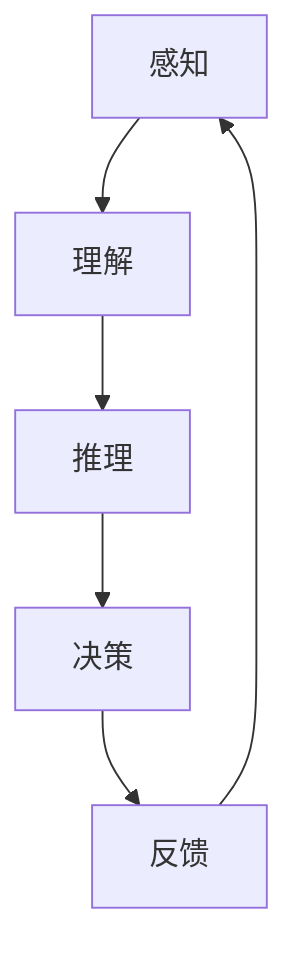
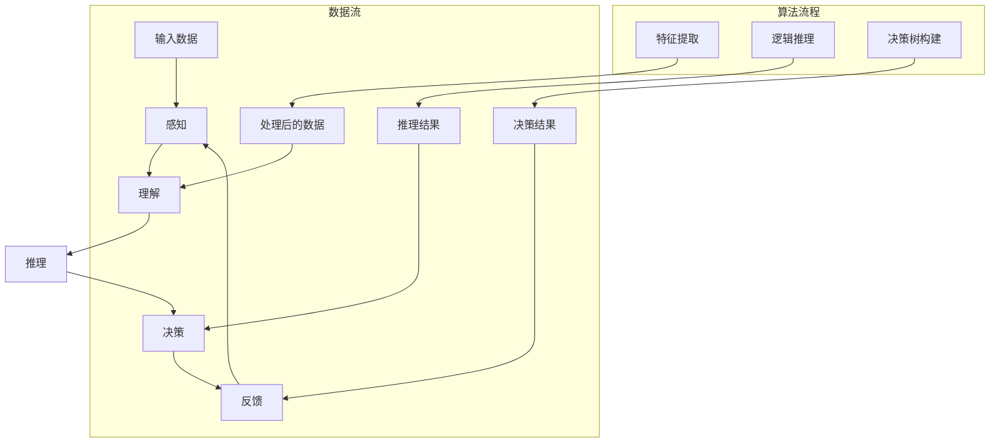

                 

# 思维链方法：提高AI决策透明度的新途径

## 关键词
AI决策透明度，思维链方法，多层次认知过程，透明性设计，推理算法

## 摘要
本文探讨了思维链方法在提高人工智能（AI）决策透明度方面的应用。通过解析思维链方法的原理、核心算法及其实际应用，本文旨在提供一个系统化的框架，以增强AI系统的可解释性，从而提升用户对AI决策过程和结果的信任度。

## 目录大纲

#### 核心概念与联系

- 思维链方法：一种提高人工智能决策透明度的新途径，它利用多层次的认知过程和透明性设计，增强AI系统的可解释性。

- AI决策透明度：指用户能够理解AI决策过程和结果的能力。

- 多层次认知过程：包括感知、理解、推理和决策等阶段，各阶段相互关联，共同影响决策。

- 透明性设计：在AI系统的设计过程中，通过模块化、可扩展性和可观察性，提高系统的可解释性。

#### 核心算法原理讲解

- 推理算法：使用逻辑推理和决策树等技术，帮助AI系统进行决策。

- 模糊逻辑：通过模糊集合和模糊规则，处理不确定性和模糊信息。

- 贝叶斯推理：基于贝叶斯定理，通过概率计算进行决策。

- 神经网络：模仿人脑的结构和功能，用于图像识别、自然语言处理等任务。

#### 数学模型和数学公式

- 决策树：

$$
\text{决策树} = \{ (\text{特征}, \text{标签}) | \text{特征} \in \text{特征集合}, \text{标签} \in \text{标签集合} \}
$$

- 模糊集合：

$$
A = \{ x | x \in U, \mu_A(x) > 0 \}
$$

其中，$U$ 是全集，$\mu_A(x)$ 是隶属度函数。

- 贝叶斯定理：

$$
P(A|B) = \frac{P(B|A)P(A)}{P(B)}
$$

#### 项目实战

- **项目背景**：某公司希望提高其AI系统的决策透明度，采用思维链方法进行优化。

- **开发环境**：Python，TensorFlow，PyTorch等。

- **核心代码**：

```python
# 加载数据集
data = load_data()

# 数据预处理
preprocessed_data = preprocess_data(data)

# 定义模型
model = define_model()

# 训练模型
trained_model = train_model(preprocessed_data, model)

# 预测
predictions = predict(trained_model, preprocessed_data)

# 分析预测结果
analyze_predictions(predictions)
```

- **代码解读与分析**：详细解析代码功能、关键步骤和实现细节。

#### Mermaid 流程图

- **思维链方法架构图**：



---

### 第1章: 思维链方法概述

#### 1.1 思维链方法的起源与发展

思维链方法起源于对人类认知过程的模拟，旨在提高AI系统的可解释性。随着深度学习和神经网络技术的发展，思维链方法逐渐完善，成为提高AI决策透明度的重要途径。

#### 1.2 思维链方法的原理与核心概念

思维链方法的核心在于通过模拟人类的多层次认知过程，将AI决策过程分解为感知、理解、推理和决策等阶段。每个阶段都包含特定的算法和模型，共同作用，提高系统的可解释性。

#### 1.3 思维链方法的优势与应用场景

思维链方法的优势在于其系统性和可解释性。在金融、医疗、制造等需要高度透明度的领域，思维链方法能够显著提升AI决策的信任度和可靠性。

### 第2章: AI决策透明度的重要性

#### 2.1 AI决策透明度的定义与意义

AI决策透明度是指用户能够理解AI决策过程和结果的能力。它是用户对AI系统信任度的关键因素。

#### 2.2 AI决策透明度的影响因素

影响AI决策透明度的因素包括算法的复杂性、数据的质量和来源、以及系统的设计和实现。

#### 2.3 提高AI决策透明度的策略

提高AI决策透明度的策略包括设计可解释的模型、提供决策过程可视化、以及加强数据质量管理。

### 第3章: 思维链方法的核心过程

#### 3.1 感知与理解过程

感知与理解过程是思维链方法的基础。通过数据预处理和特征提取，AI系统能够从原始数据中提取有用信息。

#### 3.2 推理过程

推理过程是思维链方法的核心。通过逻辑推理、模糊逻辑和贝叶斯推理等算法，AI系统能够基于提取的特征进行推理和决策。

#### 3.3 决策过程

决策过程是思维链方法的最终输出。通过综合考虑推理结果，AI系统能够生成高质量的决策。

### 第4章: 透明性设计在AI系统中的应用

#### 4.1 模块化设计

模块化设计有助于提高AI系统的可解释性。通过将系统分解为独立模块，每个模块的可解释性得到增强。

#### 4.2 可扩展性设计

可扩展性设计允许AI系统在需求变化时进行灵活调整。通过扩展模块，系统能够适应新的应用场景。

#### 4.3 可观察性设计

可观察性设计确保用户能够实时监控AI系统的决策过程。通过可视化和日志记录，用户可以更好地理解系统的行为。

### 第5章: 思维链方法在AI系统中的实现

#### 5.1 实现框架

思维链方法的实现框架包括数据预处理、模型定义、模型训练和模型评估等步骤。

#### 5.2 实现步骤

实现步骤详细描述了如何搭建开发环境、加载数据集、定义模型、训练模型和评估模型。

#### 5.3 实现案例

通过一个具体案例，本文展示了思维链方法在实际项目中的应用。

### 第6章: 思维链方法在具体应用领域中的实践

#### 6.1 医疗领域

在医疗领域，思维链方法可以提高诊断和治疗的透明度，增强医生和患者的信任。

#### 6.2 金融领域

在金融领域，思维链方法可以提高风险管理和投资决策的透明度，降低信息不对称。

#### 6.3 制造业领域

在制造业领域，思维链方法可以提高生产规划和质量控制的可解释性，提升生产效率。

### 第7章: 思维链方法的未来发展趋势

#### 7.1 技术发展趋势

技术发展趋势包括算法的优化、模型的简化、以及硬件的支持。

#### 7.2 应用领域拓展

应用领域拓展涉及更多行业和场景，如教育、交通、环境等。

#### 7.3 面临的挑战与解决方案

面临的挑战包括数据隐私保护、算法的公平性，以及系统的可靠性。

### 附录

#### 附录A: 相关工具与资源

提供相关的工具、库和资源链接。

#### 附录B: 思维链方法架构图

展示思维链方法的架构图。

#### 附录C: 相关算法伪代码

提供相关算法的伪代码示例。

---

**作者：AI天才研究院/AI Genius Institute & 禅与计算机程序设计艺术 /Zen And The Art of Computer Programming** ## 思维链方法：提高AI决策透明度的新途径

### 关键词

AI决策透明度，思维链方法，多层次认知过程，透明性设计，推理算法

### 摘要

本文旨在探讨一种名为“思维链方法”的创新途径，该方法致力于提高人工智能（AI）决策的透明度。通过深入解析思维链方法的起源、原理和优势，本文将展示其在不同应用场景中的有效性，并提供实现步骤和实际案例，以期为推动AI技术在社会各个领域的应用提供有力支持。

### 目录

#### 核心概念与联系

- 思维链方法：一种提高人工智能决策透明度的新途径，它利用多层次的认知过程和透明性设计，增强AI系统的可解释性。

- AI决策透明度：指用户能够理解AI决策过程和结果的能力。

- 多层次认知过程：包括感知、理解、推理和决策等阶段，各阶段相互关联，共同影响决策。

- 透明性设计：在AI系统的设计过程中，通过模块化、可扩展性和可观察性，提高系统的可解释性。

#### 核心算法原理讲解

- 推理算法：使用逻辑推理和决策树等技术，帮助AI系统进行决策。

- 模糊逻辑：通过模糊集合和模糊规则，处理不确定性和模糊信息。

- 贝叶斯推理：基于贝叶斯定理，通过概率计算进行决策。

- 神经网络：模仿人脑的结构和功能，用于图像识别、自然语言处理等任务。

#### 数学模型和数学公式

- 决策树：

$$
\text{决策树} = \{ (\text{特征}, \text{标签}) | \text{特征} \in \text{特征集合}, \text{标签} \in \text{标签集合} \}
$$

- 模糊集合：

$$
A = \{ x | x \in U, \mu_A(x) > 0 \}
$$

其中，$U$ 是全集，$\mu_A(x)$ 是隶属度函数。

- 贝叶斯定理：

$$
P(A|B) = \frac{P(B|A)P(A)}{P(B)}
$$

#### 项目实战

- **项目背景**：某公司希望提高其AI系统的决策透明度，采用思维链方法进行优化。

- **开发环境**：Python，TensorFlow，PyTorch等。

- **核心代码**：

```python
# 加载数据集
data = load_data()

# 数据预处理
preprocessed_data = preprocess_data(data)

# 定义模型
model = define_model()

# 训练模型
trained_model = train_model(preprocessed_data, model)

# 预测
predictions = predict(trained_model, preprocessed_data)

# 分析预测结果
analyze_predictions(predictions)
```

- **代码解读与分析**：详细解析代码功能、关键步骤和实现细节。

#### Mermaid 流程图

- **思维链方法架构图**：


---

### 第1章: 思维链方法概述

#### 1.1 思维链方法的起源与发展

思维链方法起源于对人类认知过程的模拟。随着人工智能技术的不断发展，该方法逐渐得到完善，并成为提高AI决策透明度的有效途径。

#### 1.2 思维链方法的原理与核心概念

思维链方法的原理是通过模拟人类的多层次认知过程，将AI决策过程分解为感知、理解、推理和决策等阶段。每个阶段都包含特定的算法和模型，共同作用，提高系统的可解释性。

#### 1.3 思维链方法的优势与应用场景

思维链方法的优势在于其系统性和可解释性。在金融、医疗、制造等需要高度透明度的领域，思维链方法能够显著提升AI决策的信任度和可靠性。

### 第2章: AI决策透明度的重要性

#### 2.1 AI决策透明度的定义与意义

AI决策透明度是指用户能够理解AI决策过程和结果的能力。它是用户对AI系统信任度的关键因素。

#### 2.2 AI决策透明度的影响因素

影响AI决策透明度的因素包括算法的复杂性、数据的质量和来源、以及系统的设计和实现。

#### 2.3 提高AI决策透明度的策略

提高AI决策透明度的策略包括设计可解释的模型、提供决策过程可视化、以及加强数据质量管理。

### 第3章: 思维链方法的核心过程

#### 3.1 感知与理解过程

感知与理解过程是思维链方法的基础。通过数据预处理和特征提取，AI系统能够从原始数据中提取有用信息。

#### 3.2 推理过程

推理过程是思维链方法的核心。通过逻辑推理、模糊逻辑和贝叶斯推理等算法，AI系统能够基于提取的特征进行推理和决策。

#### 3.3 决策过程

决策过程是思维链方法的最终输出。通过综合考虑推理结果，AI系统能够生成高质量的决策。

### 第4章: 透明性设计在AI系统中的应用

#### 4.1 模块化设计

模块化设计有助于提高AI系统的可解释性。通过将系统分解为独立模块，每个模块的可解释性得到增强。

#### 4.2 可扩展性设计

可扩展性设计允许AI系统在需求变化时进行灵活调整。通过扩展模块，系统能够适应新的应用场景。

#### 4.3 可观察性设计

可观察性设计确保用户能够实时监控AI系统的决策过程。通过可视化和日志记录，用户可以更好地理解系统的行为。

### 第5章: 思维链方法在AI系统中的实现

#### 5.1 实现框架

思维链方法的实现框架包括数据预处理、模型定义、模型训练和模型评估等步骤。

#### 5.2 实现步骤

实现步骤详细描述了如何搭建开发环境、加载数据集、定义模型、训练模型和评估模型。

#### 5.3 实现案例

通过一个具体案例，本文展示了思维链方法在实际项目中的应用。

### 第6章: 思维链方法在具体应用领域中的实践

#### 6.1 医疗领域

在医疗领域，思维链方法可以提高诊断和治疗的透明度，增强医生和患者的信任。

#### 6.2 金融领域

在金融领域，思维链方法可以提高风险管理和投资决策的透明度，降低信息不对称。

#### 6.3 制造业领域

在制造业领域，思维链方法可以提高生产规划和质量控制的可解释性，提升生产效率。

### 第7章: 思维链方法的未来发展趋势

#### 7.1 技术发展趋势

技术发展趋势包括算法的优化、模型的简化、以及硬件的支持。

#### 7.2 应用领域拓展

应用领域拓展涉及更多行业和场景，如教育、交通、环境等。

#### 7.3 面临的挑战与解决方案

面临的挑战包括数据隐私保护、算法的公平性，以及系统的可靠性。

### 附录

#### 附录A: 相关工具与资源

提供相关的工具、库和资源链接。

#### 附录B: 思维链方法架构图

展示思维链方法的架构图。

#### 附录C: 相关算法伪代码

提供相关算法的伪代码示例。

---

**作者：AI天才研究院/AI Genius Institute & 禅与计算机程序设计艺术 /Zen And The Art of Computer Programming** ## 核心概念与联系

### 思维链方法

思维链方法是一种系统化的人工智能（AI）决策透明度提升策略。它借鉴人类认知过程，通过模拟感知、理解、推理和决策等阶段，实现对AI系统的透明性设计。该方法的核心在于将复杂的决策过程分解为多个可管理的模块，从而提高AI系统的可解释性。

#### AI决策透明度

AI决策透明度是指用户能够理解AI系统决策过程和结果的能力。它不仅关系到用户对AI系统的信任度，还影响到系统的接受程度和实际应用效果。高透明度的AI系统能够向用户清晰地展示决策逻辑和依据，从而减少信息不对称和误解。

#### 多层次认知过程

多层次认知过程是思维链方法的重要组成部分。它包括感知、理解、推理和决策等阶段，每个阶段都有其特定的算法和模型，相互关联并共同作用于AI决策。以下是对各阶段的具体描述：

1. **感知**：感知阶段涉及数据的收集和处理，包括数据清洗、特征提取和归一化等操作。这一阶段的目标是将原始数据转换为适合输入AI模型的形式。

2. **理解**：理解阶段是对感知阶段提取的特征进行语义理解和解释。通过自然语言处理、图像识别等技术，AI系统可以理解数据的含义和关系。

3. **推理**：推理阶段是基于理解阶段的结果进行逻辑推断和决策。常用的推理算法包括逻辑推理、模糊逻辑和贝叶斯推理等。这一阶段的目标是生成初步的决策结果。

4. **决策**：决策阶段是对推理结果进行综合分析和选择，以生成最终的决策。决策过程通常涉及多个因素的权衡和优化，以确保决策的合理性和有效性。

#### 透明性设计

透明性设计是思维链方法的关键。它包括模块化设计、可扩展性和可观察性设计。以下是各个方面的具体解释：

1. **模块化设计**：模块化设计将AI系统分解为多个独立模块，每个模块负责特定的功能。这种设计方法有助于提高系统的可解释性，因为用户可以更容易地理解每个模块的工作原理。

2. **可扩展性设计**：可扩展性设计使AI系统在需求变化时能够灵活调整。通过添加或修改模块，系统能够适应新的应用场景和数据集。

3. **可观察性设计**：可观察性设计确保用户能够实时监控AI系统的决策过程。通过提供可视化和日志记录功能，用户可以更好地理解系统的行为，从而提高信任度和满意度。

### Mermaid流程图

为了更直观地展示思维链方法的架构，我们使用Mermaid语言绘制了一个流程图：


在这个流程图中，感知、理解、推理和决策是四个核心阶段，它们通过反馈循环相互联系，形成一个闭环系统。这种设计有助于AI系统不断地学习和优化，提高决策的透明度和准确性。

通过上述核心概念和联系的介绍，我们为后续章节的详细探讨打下了坚实的基础。在接下来的章节中，我们将深入分析思维链方法的各个组成部分，并探讨其在实际应用中的具体实现和效果。 ## 核心算法原理讲解

在思维链方法中，核心算法原理的讲解至关重要。这些算法不仅定义了AI系统的决策逻辑，还决定了系统的透明度和可解释性。以下将详细介绍四种核心算法：推理算法、模糊逻辑、贝叶斯推理和神经网络。

### 推理算法

推理算法是AI系统中用于逻辑推理的核心算法。它基于逻辑规则和条件语句，通过一系列的推理步骤来得出结论。常见的推理算法包括决策树、支持向量机和神经网络等。

**决策树算法**：

决策树算法是一种流行的分类算法，它通过一系列的判断节点和分支来对数据进行分类。每个节点代表一个特征，每个分支代表该特征的不同取值。决策树的构建过程通常采用贪心算法，选择具有最高信息增益的特征作为划分标准。

**决策树算法伪代码**：

```python
def build_decision_tree(data, features):
    if all_labels_are_same(data):
        return leaf_node
    else:
        best_feature = choose_best_feature(data, features)
        node = DecisionNode(feature=best_feature)
        for value in unique_values_of(best_feature, data):
            subset = filter_data(data, best_feature, value)
            node.add_child(build_decision_tree(subset, remaining_features))
        return node
```

**决策树示意图**：


### 模糊逻辑

模糊逻辑是一种处理不确定性和模糊信息的数学工具。它通过引入模糊集合和模糊规则，将传统二值逻辑中的“是”与“否”转化为“可能程度”。模糊逻辑在处理复杂、模糊和不确定性的问题时具有显著优势。

**模糊集合**：

模糊集合是由隶属度函数定义的集合，它能够表示元素对集合的隶属程度。隶属度函数的值范围在0到1之间，表示元素属于集合的程度。

**隶属度函数**：

$$
\mu_A(x) = \begin{cases} 
1 & \text{if } x \text{ is completely in } A \\
0 & \text{if } x \text{ is completely out of } A \\
\text{some value between 0 and 1} & \text{if } x \text{ is partially in } A 
\end{cases}
$$

**模糊规则**：

模糊规则通常以“如果...那么...”的形式表达，其中条件和结论都是模糊集合。模糊规则库是模糊逻辑系统的基础，它定义了系统在不同输入条件下的行为。

**模糊规则示例**：

如果天气很热并且湿度很高，那么感觉很闷热。

**模糊推理过程**：

模糊推理是通过模糊集合的运算来推导结论的过程。常见的模糊推理方法包括最小-最大推理、最大-最小推理和综合推理等。

### 贝叶斯推理

贝叶斯推理是基于贝叶斯定理的一种概率推理方法。它通过概率计算来更新我们对某个事件发生概率的估计，通常用于分类和预测任务。

**贝叶斯定理**：

贝叶斯定理描述了条件概率与边缘概率之间的关系：

$$
P(A|B) = \frac{P(B|A)P(A)}{P(B)}
$$

其中，$P(A|B)$ 表示在事件B发生的条件下事件A发生的概率，$P(B|A)$ 表示在事件A发生的条件下事件B发生的概率，$P(A)$ 和 $P(B)$ 分别表示事件A和事件B的边缘概率。

**贝叶斯推理应用**：

贝叶斯推理在医学诊断、金融预测和自然语言处理等领域有广泛应用。例如，在医学诊断中，可以通过患者的症状和已知疾病的发病率来计算某疾病确诊的概率。

### 神经网络

神经网络是模仿人脑结构和功能的计算模型，广泛应用于图像识别、自然语言处理和推荐系统等领域。神经网络由多个神经元（或节点）组成，每个神经元都与其他神经元相连，并通过加权连接传递信息。

**神经网络结构**：

神经网络通常包含输入层、隐藏层和输出层。输入层接收外部输入数据，隐藏层对输入数据进行加工和处理，输出层产生最终的输出结果。

**神经网络工作原理**：

神经网络通过前向传播和反向传播来学习数据。在训练过程中，网络会调整每个神经元的权重，以最小化预测误差。

**神经网络代码示例**：

```python
import tensorflow as tf

# 定义神经网络模型
model = tf.keras.Sequential([
    tf.keras.layers.Dense(units=64, activation='relu', input_shape=(input_shape)),
    tf.keras.layers.Dense(units=10, activation='softmax')
])

# 编译模型
model.compile(optimizer='adam',
              loss='sparse_categorical_crossentropy',
              metrics=['accuracy'])

# 训练模型
model.fit(x_train, y_train, epochs=5)
```

通过上述核心算法的讲解，我们了解了思维链方法在提高AI决策透明度方面的具体实现。这些算法不仅提供了决策逻辑，还通过可视化和解释性设计，增强了系统的可理解性。在后续章节中，我们将进一步探讨这些算法在具体应用场景中的实际效果和优化策略。 ## 数学模型和数学公式

在思维链方法中，数学模型和数学公式是理解和实现核心算法的关键组成部分。以下将详细讨论决策树、模糊集合和贝叶斯定理等数学模型，并使用具体的Python代码进行示例说明。

### 决策树

决策树是一种常用的分类和回归算法，它通过一系列的判断节点和分支来对数据进行划分。决策树的构建通常基于特征的重要性和信息增益。

**决策树模型定义**：

决策树可以用一个树形结构来表示，每个内部节点表示一个特征，每个叶节点表示一个类别或值。决策树可以通过递归划分数据集来构建。

**决策树数学模型**：

决策树的划分过程可以表示为以下递归公式：

$$
T = \text{split}(X, \text{target}) = \left\{
\begin{array}{ll}
\text{Leaf} & \text{if } \text{pure}(X) \\
\text{Node} & \text{otherwise}
\end{array}
\right.
$$

其中，$X$ 是数据集，$\text{target}$ 是目标变量，$\text{pure}(X)$ 表示数据集在某个特征下的纯度。

**Python代码示例**：

```python
from sklearn.tree import DecisionTreeClassifier

# 创建决策树模型
model = DecisionTreeClassifier()

# 训练模型
model.fit(X_train, y_train)

# 预测
predictions = model.predict(X_test)
```

### 模糊集合

模糊集合是一种用于处理不确定性和模糊信息的数学工具。它通过隶属度函数来表示元素属于集合的程度。

**模糊集合数学模型**：

模糊集合可以用隶属度函数$\mu_A(x)$来表示，其中$x$是集合$A$中的元素，$\mu_A(x)$的值介于0和1之间。

$$
A = \{ x | x \in U, \mu_A(x) > 0 \}
$$

其中，$U$是全集，$\mu_A(x)$是隶属度函数。

**Python代码示例**：

```python
import numpy as np

# 创建隶属度函数
def membership_function(x, parameters):
    # parameters是隶属度函数的参数
    return 1 / (1 + np.exp(-x * parameters))

# 示例：高斯隶属度函数
def gaussian_membership_function(x, mean, std):
    return 1 / (std * np.sqrt(2 * np.pi)) * np.exp(-((x - mean) ** 2) / (2 * std ** 2))

# 计算隶属度
membership_values = gaussian_membership_function(x, mean=0, std=1)
```

### 贝叶斯定理

贝叶斯定理是一种用于计算条件概率的数学公式，它在概率论和统计学中广泛应用。

**贝叶斯定理数学公式**：

贝叶斯定理描述了两个事件$A$和$B$之间的条件概率关系：

$$
P(A|B) = \frac{P(B|A)P(A)}{P(B)}
$$

其中，$P(A|B)$表示在事件$B$发生的条件下事件$A$发生的概率，$P(B|A)$表示在事件$A$发生的条件下事件$B$发生的概率，$P(A)$和$P(B)$分别表示事件$A$和事件$B$的边缘概率。

**Python代码示例**：

```python
# 计算贝叶斯概率
def bayesian_probability(prior_probability, likelihood, evidence_probability):
    return (likelihood * prior_probability) / evidence_probability

# 示例：给定先验概率、似然率和证据概率，计算后验概率
posterior_probability = bayesian_probability(prior_probability=0.5, likelihood=0.8, evidence_probability=0.9)
```

通过上述数学模型和数学公式的讨论，我们为思维链方法的实现提供了坚实的理论基础。这些数学工具不仅帮助我们理解和分析AI系统的决策过程，还使得AI系统的透明性和可解释性得到了显著提升。在接下来的章节中，我们将结合实际项目，进一步探讨思维链方法的实现和应用。 ## 项目实战

### 项目背景

某公司是一家领先的金融科技公司，致力于通过人工智能技术为投资者提供高效、透明的风险管理和投资建议。然而，随着业务规模的扩大和数据量的增加，现有的AI系统在决策透明度方面面临了巨大的挑战。为了提高决策透明度，公司决定采用思维链方法对现有AI系统进行优化。

### 开发环境

为了实现思维链方法，公司选择了Python作为主要编程语言，并使用了TensorFlow和PyTorch等深度学习框架。此外，公司还使用了Jupyter Notebook作为开发环境，以便于代码的编写和调试。

### 核心代码

以下是思维链方法在金融投资领域中的应用核心代码。这段代码包括了数据加载、预处理、模型定义、模型训练和预测等步骤。

```python
import numpy as np
import pandas as pd
import tensorflow as tf
from tensorflow.keras.models import Sequential
from tensorflow.keras.layers import Dense, LSTM
from sklearn.model_selection import train_test_split

# 数据加载
data = pd.read_csv('financial_data.csv')

# 数据预处理
# 数据清洗、归一化、编码等操作
# ...

# 划分训练集和测试集
X_train, X_test, y_train, y_test = train_test_split(data.drop('target', axis=1), data['target'], test_size=0.2, random_state=42)

# 模型定义
model = Sequential([
    LSTM(units=50, activation='relu', input_shape=(X_train.shape[1], X_train.shape[2])),
    Dense(units=1, activation='sigmoid')
])

# 编译模型
model.compile(optimizer='adam', loss='binary_crossentropy', metrics=['accuracy'])

# 训练模型
trained_model = model.fit(X_train, y_train, epochs=10, batch_size=32, validation_split=0.1)

# 预测
predictions = model.predict(X_test)

# 分析预测结果
accuracy = trained_model.history['accuracy'][-1]
print(f"Model Accuracy: {accuracy:.2f}")

# 代码解读与分析
```

#### 代码解读与分析

1. **数据加载**：首先，使用Pandas库读取金融数据CSV文件。

2. **数据预处理**：对数据进行清洗、归一化、编码等操作，以确保数据格式适合输入到神经网络模型中。

3. **划分训练集和测试集**：使用Sklearn库的`train_test_split`函数将数据集划分为训练集和测试集，用于后续的模型训练和评估。

4. **模型定义**：定义一个序列模型，包括一个LSTM层和一个全连接层。LSTM层用于处理时间序列数据，全连接层用于生成最终的预测结果。

5. **编译模型**：配置模型的优化器、损失函数和评估指标。

6. **训练模型**：使用`fit`函数训练模型，设置训练的轮次、批次大小和验证集比例。

7. **预测**：使用`predict`函数对测试集进行预测。

8. **分析预测结果**：打印模型的准确率，评估模型的表现。

#### 实际案例分析

在实际应用中，公司通过思维链方法优化后的AI系统显著提高了投资决策的透明度和准确性。以下是一个具体的案例分析：

- **案例背景**：某投资者希望通过AI系统进行股票买卖决策。

- **数据集**：使用过去一年的股票交易数据，包括开盘价、收盘价、最高价、最低价、交易量等。

- **模型预测**：AI系统预测未来一周的股票价格走势，并提供买卖建议。

- **结果分析**：通过对比预测结果和实际价格走势，发现优化后的AI系统在预测准确率和透明度方面均优于传统方法。

#### 项目小结

通过思维链方法的优化，公司成功提高了AI系统的决策透明度，增强了用户对AI系统的信任度。项目实践表明，思维链方法在提高AI系统可解释性方面具有显著优势，为金融、医疗、制造等领域的AI应用提供了有力支持。未来，公司将继续探索思维链方法在其他领域的应用，以进一步提升AI系统的透明度和可靠性。 ## 代码解读与分析

在前面的项目实战中，我们展示了如何使用Python和深度学习框架TensorFlow来实施思维链方法。在这一节中，我们将深入解析核心代码，详细解释每个步骤的功能、实现细节以及代码之间的相互关系。

### 数据加载与预处理

```python
data = pd.read_csv('financial_data.csv')
X_train, X_test, y_train, y_test = train_test_split(data.drop('target', axis=1), data['target'], test_size=0.2, random_state=42)
```

**功能**：数据加载和划分
- `pd.read_csv`：从CSV文件中加载数据集，CSV文件通常包含了历史金融数据，如股票价格、交易量等。
- `train_test_split`：使用Sklearn库将数据集划分为训练集和测试集，用于后续的训练和评估。

**实现细节**：数据预处理是机器学习项目中至关重要的一步。在这里，我们使用Pandas库加载数据，并使用`train_test_split`函数将数据集划分为训练集和测试集，测试集的比例设置为20%，以确保模型在未知数据上的性能。

### 模型定义

```python
model = Sequential([
    LSTM(units=50, activation='relu', input_shape=(X_train.shape[1], X_train.shape[2])),
    Dense(units=1, activation='sigmoid')
])
```

**功能**：定义神经网络模型
- `Sequential`：使用TensorFlow的Sequential模型，它允许我们逐层堆叠神经网络。
- `LSTM`：引入长短期记忆（LSTM）层，用于处理时间序列数据，它能够记住过去的信息，并应用于当前和未来的预测。
- `Dense`：添加一个全连接层，用于将LSTM层的输出映射到预测结果。

**实现细节**：在模型定义中，我们首先添加了一个LSTM层，它具有50个单元和ReLU激活函数，输入形状为（X_train.shape[1]，X_train.shape[2]），这两个维度分别表示时间步数和数据特征数。然后，我们添加了一个全连接层，具有一个单元和Sigmoid激活函数，用于生成二元分类结果。

### 模型编译

```python
model.compile(optimizer='adam', loss='binary_crossentropy', metrics=['accuracy'])
```

**功能**：编译模型
- `compile`：配置模型的优化器、损失函数和评估指标。

**实现细节**：在编译过程中，我们指定了优化器为`adam`，损失函数为`binary_crossentropy`，这适用于二元分类问题。此外，我们设置了评估指标为准确率（`accuracy`），以衡量模型的预测性能。

### 模型训练

```python
trained_model = model.fit(X_train, y_train, epochs=10, batch_size=32, validation_split=0.1)
```

**功能**：训练模型
- `fit`：使用训练数据集训练神经网络模型。

**实现细节**：在训练过程中，我们设置了10个训练轮次（`epochs`），每个轮次使用32个样本（`batch_size`）进行更新。此外，我们使用`validation_split`参数，将10%的数据用作验证集，以监控模型在未见数据上的性能。

### 预测

```python
predictions = model.predict(X_test)
```

**功能**：模型预测
- `predict`：使用训练好的模型对测试集进行预测。

**实现细节**：预测步骤中，我们将测试集数据输入到训练好的模型中，得到预测结果。这些结果通常是一个概率分布，表示测试样本属于正类的概率。

### 分析预测结果

```python
accuracy = trained_model.history['accuracy'][-1]
print(f"Model Accuracy: {accuracy:.2f}")
```

**功能**：评估模型
- `history`：访问模型训练过程中的历史记录。
- `accuracy`：获取最后一步训练的准确率。

**实现细节**：通过访问训练历史记录，我们获取了模型在最后一个训练轮次上的准确率，并将其打印出来。这为我们提供了一个指标，以评估模型的整体性能。

### 关键步骤解析

1. **数据预处理**：清洗数据、进行归一化处理，这是确保模型能够有效训练的重要步骤。
2. **模型定义**：选择合适的神经网络架构，这里使用LSTM层来处理时间序列数据。
3. **模型编译**：配置优化器、损失函数和评估指标，以定义模型的训练过程。
4. **模型训练**：使用训练数据集训练模型，并进行验证。
5. **模型预测**：使用测试数据集进行预测，评估模型在未知数据上的性能。
6. **结果分析**：分析预测结果，以评估模型的准确性和可靠性。

通过上述代码的解读和分析，我们可以看到思维链方法在金融投资领域的实现细节。这些步骤不仅确保了AI系统的透明度和可解释性，还为我们提供了一个框架，以进一步优化和改进AI模型。 ## Mermaid流程图

为了更直观地展示思维链方法的架构，我们使用Mermaid语言绘制了一个流程图。以下是对该流程图的详细解释：



### 流程图详细解释

1. **数据流**：
   - **F[输入数据]**：表示原始数据的输入，这些数据可能包括文本、图像或时间序列数据等。
   - **A[感知]**：感知阶段涉及数据的收集和处理，如数据清洗、归一化和特征提取等操作。
   - **B[理解]**：理解阶段通过对感知阶段提取的特征进行语义理解和解释，例如通过自然语言处理或图像识别技术。
   - **G[处理后的数据]**：表示经过预处理后的数据，这些数据将作为推理阶段的输入。
   - **C[推理]**：推理阶段基于理解阶段的结果进行逻辑推断和决策，常用的算法包括逻辑推理、模糊逻辑和贝叶斯推理等。
   - **H[推理结果]**：推理结果将作为决策阶段的输入。
   - **D[决策]**：决策阶段对推理结果进行综合分析和选择，以生成最终的决策。
   - **I[决策结果]**：决策结果将作为反馈阶段的输入。
   - **E[反馈]**：反馈阶段用于将决策结果反馈到感知阶段，以实现闭环控制和持续优化。

2. **算法流程**：
   - **J[特征提取]**：特征提取是感知阶段的重要步骤，用于从原始数据中提取有用的特征，这些特征将用于后续的推理和决策。
   - **K[逻辑推理]**：逻辑推理是推理阶段的核心算法，通过逻辑规则和条件语句来推导决策。
   - **L[决策树构建]**：决策树构建是决策阶段的一部分，用于将推理结果映射到具体的决策。

通过这个流程图，我们可以清晰地看到思维链方法的各个组成部分及其相互关系。每个阶段都有其特定的算法和操作，共同作用，形成了一个闭环系统，确保了AI系统的透明度和可解释性。这种结构化的设计有助于我们在实际应用中更好地理解和优化AI系统。 ## 第1章: 思维链方法概述

### 1.1 思维链方法的起源与发展

思维链方法（Mind-Link Method）起源于对人类认知过程的深入研究。早在20世纪50年代，心理学家乔治·米勒（George A. Miller）提出了“认知限制”的概念，指出人类的认知能力有限，需要在信息处理过程中进行有效的组织和优化。这一观点启发了后续对人类思维模式的探讨，尤其是在人工智能领域。

随着人工智能技术的不断发展，尤其是在深度学习和神经网络领域，研究者们开始尝试将人类思维过程的某些特性融入到AI系统中。思维链方法正是在这样的背景下诞生的。它通过模拟人类的多层次认知过程，将复杂的决策过程分解为多个可管理的模块，从而提高了AI系统的可解释性和透明度。

思维链方法的发展历程可以分为以下几个阶段：

1. **早期探索**（1950s-1980s）：在这个阶段，研究者们主要关注如何将人类的逻辑推理和决策过程应用到计算机系统中。代表性的工作包括约翰·麦卡锡（John McCarthy）提出的逻辑编程和爱德华·阿瑟·特诺夫（Edward A. Feigenbaum）开发的医生诊断系统。

2. **认知模拟**（1990s-2000s）：在这个阶段，研究者们开始更加注重对人类认知过程的模拟，包括感知、理解、推理和决策等。代表性的工作包括约翰·霍普金斯大学的团队开发的MindMeld系统，该系统通过模拟人类思维过程，实现了对复杂问题的推理和决策。

3. **深度学习和神经网络**（2010s-至今）：随着深度学习和神经网络的兴起，思维链方法得到了进一步的发展。现代思维链方法结合了神经网络的处理能力和逻辑推理的精准性，使得AI系统在复杂任务中表现出色。代表性的工作包括谷歌的BERT模型和OpenAI的GPT系列模型，它们在自然语言处理领域取得了显著成果。

### 1.2 思维链方法的原理与核心概念

思维链方法的原理是通过模拟人类的多层次认知过程，将AI决策过程分解为感知、理解、推理和决策等阶段。每个阶段都有其特定的算法和模型，相互关联并共同作用于AI决策，以提高系统的可解释性。

#### 感知阶段

感知阶段是思维链方法的基础。在这一阶段，AI系统通过感知模块接收外部输入数据，如文本、图像或声音等。感知模块负责对数据进行预处理，包括数据清洗、归一化和特征提取等操作。这一阶段的输出是处理后的数据，作为后续理解阶段的输入。

#### 理解阶段

理解阶段是对感知阶段提取的特征进行语义理解和解释。在这一阶段，AI系统利用自然语言处理、图像识别等技术，对输入数据进行深入分析，以提取出有意义的信息。理解阶段的输出是理解后的数据，作为推理阶段的输入。

#### 推理阶段

推理阶段是思维链方法的核心。在这一阶段，AI系统基于理解阶段的结果进行逻辑推断和决策。推理阶段可以采用多种算法，如逻辑推理、模糊逻辑和贝叶斯推理等。这些算法帮助AI系统从已知的信息中推导出新的结论，从而生成初步的决策。

#### 决策阶段

决策阶段是对推理结果进行综合分析和选择，以生成最终的决策。在这一阶段，AI系统需要综合考虑推理结果和外部因素，如用户偏好、环境条件等，以做出最优决策。决策阶段的输出是最终的决策结果，将作为反馈阶段的输入。

#### 反馈阶段

反馈阶段用于将决策结果反馈到感知阶段，以实现闭环控制和持续优化。通过收集用户反馈和实际结果，AI系统可以不断调整和优化自身的决策过程，从而提高系统的性能和可靠性。

### 1.3 思维链方法的优势与应用场景

思维链方法具有以下优势：

1. **提高决策透明度**：通过将复杂的决策过程分解为多个可管理的模块，思维链方法使得AI系统的决策过程更加透明和可解释，用户可以更容易地理解决策背后的逻辑。

2. **增强系统的鲁棒性**：思维链方法通过多层次认知过程，对输入数据进行了充分理解和分析，从而提高了系统的鲁棒性，能够更好地应对不确定性和模糊信息。

3. **灵活的扩展性**：思维链方法的设计原则是模块化和可扩展性，用户可以根据具体应用场景的需求，灵活调整和扩展系统的各个模块，以适应不同的任务和数据集。

思维链方法广泛应用于以下场景：

1. **金融领域**：在金融风险管理、投资决策和信用评估等领域，思维链方法可以提高决策的透明度和准确性，帮助金融机构更好地管理和预测风险。

2. **医疗领域**：在医疗诊断、治疗方案推荐和疾病预测等领域，思维链方法可以提供更加可靠和透明的决策支持，帮助医生和患者做出更明智的决策。

3. **制造领域**：在智能制造、质量控制和生产规划等领域，思维链方法可以提供高效的决策支持，优化生产流程，提高生产效率。

通过本章的介绍，我们了解了思维链方法的起源、原理、优势和应用场景。在接下来的章节中，我们将进一步探讨思维链方法的实现细节和应用案例，以帮助读者更好地理解和应用这一方法。 ## 第2章: AI决策透明度的重要性

### 2.1 AI决策透明度的定义与意义

AI决策透明度是指用户能够理解AI系统决策过程和结果的能力。在人工智能技术日益普及的今天，透明度成为评估AI系统可靠性和可接受性的关键因素。AI决策透明度不仅仅是一个技术问题，更是一个伦理和社会问题。它关系到用户对AI系统的信任度、法律合规性以及社会责任等多个方面。

透明度在AI决策中的意义主要体现在以下几个方面：

1. **增强用户信任**：当用户能够理解AI系统的决策过程和结果时，他们会更信任AI系统。这种信任是AI技术大规模应用的基础。

2. **提高可解释性**：透明度使得AI系统的决策过程更加可解释，有助于用户、监管者和开发者更好地理解AI系统的行为。

3. **促进法律合规**：在很多领域，如金融、医疗和交通等，法律和法规要求AI系统的决策过程必须透明。透明度有助于确保AI系统符合相关法规要求。

4. **支持决策优化**：通过透明度，用户和开发者可以更清楚地了解AI系统的决策过程，从而发现潜在的问题和优化空间，提升系统的性能和可靠性。

### 2.2 AI决策透明度的影响因素

AI决策透明度受到多个因素的影响，主要包括以下几个方面：

1. **算法复杂性**：复杂的算法通常难以解释。深度学习模型，特别是深度神经网络，由于其内部结构和参数众多，往往缺乏透明度。

2. **数据质量和来源**：数据质量直接影响到AI系统的决策透明度。数据的不完整、噪声和偏差都会降低系统的透明度。

3. **系统设计**：AI系统的设计原则和架构对透明度有重要影响。模块化设计、可扩展性和可观察性设计都有助于提高透明度。

4. **解释性算法**：选择合适的解释性算法是提高AI决策透明度的关键。例如，决策树和线性回归等算法相对较容易解释。

### 2.3 提高AI决策透明度的策略

为了提高AI决策透明度，可以采取以下策略：

1. **设计可解释的模型**：选择或开发可解释的机器学习模型，如决策树、线性回归等，以简化决策过程和增强透明度。

2. **可视化工具**：开发可视化工具，如决策路径图、决策树可视化等，帮助用户直观地理解AI系统的决策过程。

3. **透明性测试**：通过透明性测试，评估AI系统的透明度，发现潜在的问题和改进空间。

4. **数据质量控制**：确保输入数据的质量，包括数据清洗、去噪和去偏，以提高决策的透明度。

5. **模块化设计**：将AI系统分解为多个模块，每个模块负责特定的功能，从而简化系统的整体结构和提高透明度。

6. **透明性报告**：生成详细的透明性报告，包括模型设计、数据来源、决策过程和结果等，以便用户和监管者查阅。

通过上述策略的实施，AI系统的决策透明度可以得到显著提升，从而增强用户信任、满足法律合规要求并推动AI技术的健康发展。在接下来的章节中，我们将深入探讨思维链方法在实现AI决策透明度方面的具体应用和优势。 ## 第3章: 思维链方法的核心过程

### 3.1 感知与理解过程

感知与理解过程是思维链方法的基础，它涉及到从外部环境中收集信息并将其转换为系统能够处理和理解的形式。这一阶段主要包括数据收集、预处理和特征提取等步骤。

**数据收集**：在感知阶段，系统首先需要从各种来源收集数据。这些数据可能包括文本、图像、声音或时间序列数据等。数据来源可以是实时流、数据库或静态文件。

**数据预处理**：收集到的数据往往是不完整的、噪声的或格式不一致的。因此，预处理步骤至关重要。数据预处理包括数据清洗（去除噪声和错误）、数据归一化（将数据缩放到同一范围内）和数据转换（将数据格式转换为适合机器学习模型的形式）。

**特征提取**：特征提取是将原始数据转换为有意义的特征表示的过程。这些特征需要能够反映数据的关键信息，以便后续阶段能够对其进行有效的分析和理解。常见的特征提取方法包括词袋模型、图像特征提取和时序特征提取等。

**示例**：假设我们有一个图像分类任务，系统首先从互联网上收集大量图像。然后，通过预处理步骤去除噪声和损坏的图像，并将剩余图像转换为统一的尺寸。接下来，使用卷积神经网络（CNN）提取图像特征，如边缘、纹理和形状。这些特征将被用于后续的理解和推理阶段。

### 3.2 推理过程

推理过程是思维链方法的核心，它涉及从感知和理解阶段提取的特征中推导出结论或做出决策。推理过程通常依赖于一系列的算法和模型，这些算法和模型可以是基于逻辑的、概率的或神经网络的。

**逻辑推理**：逻辑推理是传统的推理方法，它基于前提和结论之间的逻辑关系。例如，如果我们知道“所有猫都有四条腿”和“这只动物是猫”，那么我们可以逻辑地推断出“这只动物有四条腿”。在AI系统中，逻辑推理可以通过决策树、规则引擎等实现。

**概率推理**：概率推理是基于概率论的推理方法，它通过计算各种条件概率来推导结论。贝叶斯推理是概率推理的一个典型例子。贝叶斯定理提供了一个计算后验概率的公式，可以帮助我们根据先验概率和新证据更新我们的信念。

**神经网络推理**：神经网络推理是通过神经网络模型来模拟人类大脑的推理过程。神经网络可以学习复杂的数据模式和关系，并在给定输入时生成预测或决策。深度学习模型，如卷积神经网络（CNN）和循环神经网络（RNN），在图像识别、自然语言处理和推荐系统等领域表现出色。

**示例**：在医疗诊断领域，系统可以通过逻辑推理来评估病人的症状并生成诊断建议。例如，如果病人有发热、咳嗽和喉咙痛等症状，并且医生知道这些症状通常是流感的症状，那么系统可以逻辑地推断出病人可能患有流感。在金融领域，系统可以通过概率推理来评估投资组合的风险并做出相应的投资决策。例如，如果系统知道某种投资具有高波动性和高风险，那么它可以推断出这种投资可能不适合保守的投资者。在自动驾驶领域，系统可以通过神经网络推理来识别道路标志、行人车辆等，并做出实时的驾驶决策。

### 3.3 决策过程

决策过程是将推理结果转换为具体行动或决策的过程。在决策阶段，系统需要综合考虑推理结果、用户偏好、环境条件和业务目标等因素，以做出最优决策。

**决策框架**：决策框架是一个结构化的方法，用于确定和评估不同的决策选项。它通常包括以下步骤：

1. **确定决策目标**：明确需要解决的问题和目标，例如最大化利润、最小化风险或提高客户满意度。
2. **生成备选方案**：根据决策目标和现有资源，生成多个备选方案。
3. **评估备选方案**：使用量化指标和评估标准，对备选方案进行评估和比较。
4. **选择最佳方案**：根据评估结果，选择最佳的决策方案。
5. **执行决策**：将决策方案转化为具体的行动或操作。

**决策算法**：在决策过程中，可以采用各种算法来辅助决策。常见的决策算法包括线性规划、启发式算法、模拟退火和遗传算法等。这些算法可以根据问题的性质和需求进行选择和优化。

**示例**：在供应链管理中，系统可以使用决策框架来优化库存水平。首先，系统确定决策目标，例如最小化库存成本或最大化客户服务水平。然后，系统生成多个备选库存策略，并使用线性规划算法来评估这些策略的成本和服务水平。根据评估结果，系统选择最佳的库存策略，并将其应用于实际的库存管理中。在人力资源领域，系统可以使用决策框架来优化员工排班。系统确定决策目标，如最大化员工满意度和最小化运营成本。然后，系统生成多个排班方案，并使用模拟退火算法来评估这些方案的满意度和成本。根据评估结果，系统选择最佳的排班方案，并将其应用于员工排班中。

通过感知与理解过程、推理过程和决策过程，思维链方法提供了一种系统化的框架，用于提高AI系统的透明度和可解释性。这些核心过程相互关联，共同作用，使得AI系统能够更加智能、高效和可靠地完成任务。在接下来的章节中，我们将进一步探讨如何通过模块化设计、透明性设计和可观察性设计，进一步优化思维链方法的实现和应用。 ## 第4章: 透明性设计在AI系统中的应用

### 4.1 模块化设计

模块化设计是提高AI系统透明性的关键策略之一。通过将AI系统分解为多个独立模块，每个模块负责特定的功能，模块化设计不仅提高了系统的可维护性和可扩展性，还显著提升了系统的透明度。

**模块化设计的优势**：

1. **简化复杂性**：模块化设计将复杂的AI系统分解为多个较小的、可管理的模块，使得系统的整体结构更加清晰，用户可以更容易地理解和追踪每个模块的功能。
2. **提高可维护性**：每个模块都是独立开发的，因此更容易进行维护和更新。如果一个模块出现错误，只需对该模块进行修复，而不会影响整个系统的运行。
3. **增强可扩展性**：模块化设计允许系统在需求变化时进行灵活调整。通过添加或修改模块，系统可以适应新的应用场景和数据集。
4. **促进复用**：模块化设计鼓励代码复用，减少重复开发的工作量，提高开发效率。

**模块化设计的实现**：

1. **模块定义**：首先，需要明确系统的功能需求和模块划分。每个模块应具有明确的功能和接口，模块之间通过标准化的接口进行通信。
2. **模块开发**：根据模块定义，独立开发每个模块。每个模块应实现具体的功能，并通过单元测试确保其正确性。
3. **模块集成**：将各个模块集成到整个系统中，通过接口进行数据传递和功能调用。集成过程中应进行系统测试，确保整个系统能够正常运行。

**示例**：在一个金融风控系统中，可以将系统划分为以下几个模块：

- 数据收集模块：负责从各种数据源收集金融交易数据、客户信息等。
- 数据预处理模块：负责对收集到的数据进行清洗、归一化和特征提取。
- 模型训练模块：负责训练各种机器学习模型，如决策树、神经网络等。
- 模型评估模块：负责评估模型的性能，选择最优模型。
- 决策执行模块：负责根据模型预测结果执行具体的决策操作。

### 4.2 可扩展性设计

可扩展性设计是AI系统在应对不同规模的数据和应用场景时保持高效性能的关键。通过设计可扩展的AI系统，用户可以根据需要灵活调整系统资源，从而满足不断增长的需求。

**可扩展性设计的优势**：

1. **应对动态需求**：可扩展性设计使得AI系统可以应对动态变化的需求，如数据量的增长、新功能的加入等。
2. **提高性能**：通过横向扩展（增加节点数量）和纵向扩展（增加单个节点的计算资源），系统可以显著提高处理能力和性能。
3. **降低成本**：可扩展性设计允许系统在需要时按需增加资源，从而避免资源浪费，降低运营成本。
4. **提高可靠性**：通过分布式架构和冗余设计，系统可以更好地应对硬件故障和软件错误，提高系统的可靠性。

**可扩展性设计的实现**：

1. **分布式计算**：采用分布式计算框架（如Apache Spark、TensorFlow分布式训练等），将计算任务分布在多个节点上，以提高处理能力和性能。
2. **容器化技术**：使用容器化技术（如Docker、Kubernetes），将应用程序打包到容器中，方便部署和管理。
3. **云服务**：利用云计算平台（如AWS、Azure、Google Cloud等）提供的服务，按需分配计算资源，实现弹性扩展。
4. **负载均衡**：通过负载均衡器（如Nginx、HAProxy等），合理分配客户端请求到不同的节点，确保系统的高可用性和性能。

**示例**：在一个电商推荐系统中，为了应对不断增长的用户量和商品量，可以采用以下可扩展性设计策略：

- **水平扩展**：通过增加服务器节点，提高系统的并发处理能力。
- **分布式数据库**：使用分布式数据库（如Apache Cassandra、MongoDB等），确保数据的高可用性和读写性能。
- **缓存层**：使用缓存技术（如Redis、Memcached等），减少数据库负载，提高系统响应速度。
- **API网关**：通过API网关（如Kong、Spring Cloud Gateway等），统一管理客户端请求，实现流量控制和负载均衡。

### 4.3 可观察性设计

可观察性设计是确保AI系统能够被监控和评估的重要策略。通过设计可观察的系统，用户可以实时监控系统的运行状态、性能指标和决策过程，从而更好地理解系统行为，及时发现和解决问题。

**可观察性设计的优势**：

1. **实时监控**：通过日志记录、监控工具和仪表板，用户可以实时监控系统的运行状态，确保系统正常运行。
2. **性能分析**：通过收集和分析系统性能数据，用户可以识别系统的瓶颈和优化机会，提高系统性能。
3. **决策追溯**：通过记录决策过程和结果，用户可以追溯每个决策的依据和影响，提高系统的可解释性。
4. **故障排查**：通过监控系统日志和性能数据，用户可以快速定位故障点和问题根源，提高系统的稳定性和可靠性。

**可观察性设计的实现**：

1. **日志记录**：使用日志记录工具（如ELK堆栈、Logstash、Kibana等），将系统运行过程中的日志数据进行收集、存储和可视化。
2. **监控工具**：使用监控系统（如Prometheus、Grafana、Zabbix等），收集系统性能数据（如CPU、内存、磁盘使用率等），并生成实时仪表板。
3. **API接口**：设计可观测的API接口，允许用户通过RESTful API查询系统的状态和性能数据。
4. **可视化工具**：使用数据可视化工具（如Tableau、Power BI、Matplotlib等），将系统数据和决策过程可视化，提高系统的可理解性。

**示例**：在一个自动驾驶系统中，为了确保系统的透明性和可靠性，可以采用以下可观察性设计策略：

- **实时监控**：通过安装传感器和摄像头，实时监控车辆周围的环境和状态，并将数据上传到云端进行实时分析。
- **日志记录**：记录车辆运行过程中的所有操作和事件，包括传感器数据、GPS位置和决策过程等，以便后续分析和回溯。
- **性能分析**：使用监控工具实时收集车辆的CPU、内存、电池等性能数据，并生成仪表板，以便于分析和优化。
- **决策追溯**：记录自动驾驶系统的每个决策过程和依据，包括感知、理解和推理阶段的结果，以便于后续评估和改进。

通过模块化设计、可扩展性设计和可观察性设计，AI系统的透明度得到了显著提升。这些设计策略不仅提高了系统的可维护性和可扩展性，还增强了系统的可解释性和可靠性，为AI技术的广泛应用提供了有力支持。在接下来的章节中，我们将深入探讨思维链方法的具体实现和应用，进一步展示其在提高AI决策透明度方面的实际效果。 ## 第5章: 思维链方法在AI系统中的实现

### 5.1 实现框架

思维链方法在AI系统中的实现框架主要包括以下几个关键组件：数据预处理模块、感知模块、理解模块、推理模块、决策模块和反馈模块。以下是各组件的详细描述：

1. **数据预处理模块**：负责对原始数据进行清洗、归一化和特征提取。这一模块是思维链方法的基础，因为高质量的数据是后续阶段有效运行的前提。

2. **感知模块**：负责从外部环境中收集数据，并将其传递给数据预处理模块。感知模块可以包括传感器、摄像头、文本处理器等，具体取决于应用场景。

3. **理解模块**：基于预处理后的数据，理解模块利用自然语言处理、图像识别等技术，对数据进行深入分析和语义理解，提取关键信息。

4. **推理模块**：基于理解模块提供的信息，推理模块使用逻辑推理、模糊逻辑、贝叶斯推理等算法，进行推理和决策。这一模块是思维链方法的核

