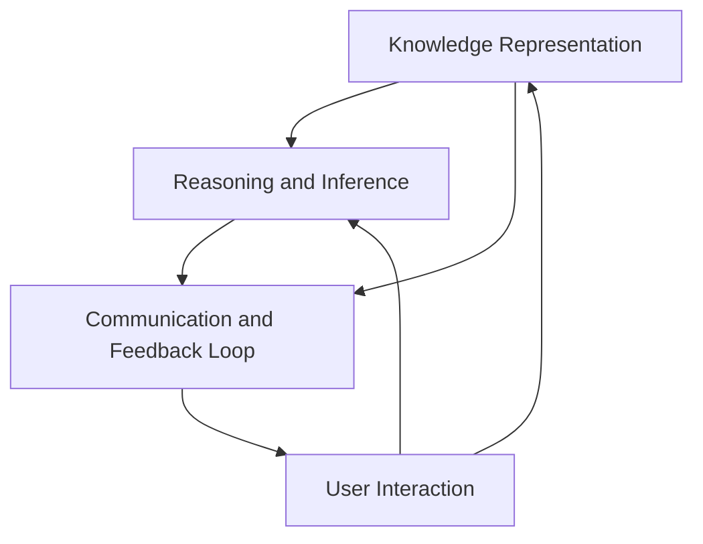

                 

### Introduction: Understanding the Mind Link Pattern

#### What is the Mind Link Pattern?

The Mind Link Pattern is an innovative approach in the realm of artificial intelligence (AI) that seeks to bridge the communication gap between humans and machines. At its core, it is a method for enhancing the ability of AI systems to understand and interpret human intentions, emotions, and thoughts with greater accuracy and depth. This pattern is designed to enable more natural and intuitive interactions between humans and AI, thereby improving the overall efficiency and effectiveness of AI applications.

#### The Importance of Understanding Human Intentions for AI

For AI to truly augment human capabilities, it must be able to comprehend the subtle nuances of human intentions. This is crucial because human interactions are often complex and multi-faceted, involving not just explicit requests but also implicit emotions, cultural context, and personal biases. By understanding these intentions, AI can provide more personalized and relevant responses, leading to a more satisfying user experience.

#### The Goals of This Book

The primary goal of this book is to provide a comprehensive guide to the Mind Link Pattern, covering its core concepts, principles, and practical applications. By the end of this book, readers will have a thorough understanding of:

1. The fundamental principles of the Mind Link Pattern and its significance in AI.
2. The key components and architecture of the Mind Link Pattern.
3. The core algorithms and techniques that underpin the Mind Link Pattern.
4. Practical examples and case studies demonstrating the effectiveness of the Mind Link Pattern in real-world applications.
5. Best practices for implementing and optimizing the Mind Link Pattern in various AI scenarios.

### Overview of AI and Human-Computer Interaction

#### The Evolution of AI

Artificial intelligence has come a long way since its inception. From early rule-based systems to modern machine learning models, AI has continually evolved, becoming more capable and versatile. Today, AI applications are ubiquitous, ranging from simple chatbots to complex autonomous systems.

#### Current Limitations in Human-AI Interaction

Despite the progress, human-AI interaction still faces several limitations. One of the main challenges is that current AI systems often struggle to understand the full spectrum of human intentions. This limitation can lead to misunderstandings, frustration, and a lack of trust in AI systems.

#### The Potential of Mind Link Pattern to Address These Limitations

The Mind Link Pattern has the potential to overcome these limitations by providing a framework for AI systems to better interpret and respond to human intentions. By leveraging advanced techniques in knowledge representation, reasoning, and communication, the Mind Link Pattern can significantly enhance the effectiveness of human-AI interactions.

### Structure of This Book

The book is organized into several sections, each focusing on a different aspect of the Mind Link Pattern. Here's a brief overview of the chapters:

1. **Introduction**: An overview of the Mind Link Pattern and its importance in AI.
2. **Core Concepts and Principles**: An in-depth exploration of the key concepts and principles of the Mind Link Pattern.
3. **Algorithmic Principles**: A detailed examination of the core algorithms and techniques that underpin the Mind Link Pattern.
4. **Case Studies and Applications**: Real-world examples demonstrating the practical applications of the Mind Link Pattern.
5. **Best Practices and Implementation**: Guidance on how to implement and optimize the Mind Link Pattern in various AI scenarios.

### Reading Suggestions

This book is aimed at a wide audience, including AI researchers, developers, and enthusiasts. While some technical knowledge is helpful, the book is written in a way that is accessible to readers from various backgrounds. Each chapter includes examples and explanations that make the concepts easy to understand.

### Key Takeaways

By the end of this book, readers will have:

- A solid understanding of the Mind Link Pattern and its significance in AI.
- Insights into the core concepts and principles that make up the Mind Link Pattern.
- Knowledge of the key algorithms and techniques used in the Mind Link Pattern.
- A collection of practical examples and case studies demonstrating the effectiveness of the Mind Link Pattern.
- Best practices for implementing and optimizing the Mind Link Pattern in real-world applications.

In summary, this book is a must-read for anyone interested in advancing the capabilities of AI and improving human-AI interactions. With the Mind Link Pattern, we are on the brink of a new era in AI, where machines can truly understand and collaborate with humans in a more natural and intuitive way.

---

### Core Concepts and Principles

#### Definition and Significance of Mind Link Pattern

The Mind Link Pattern is a systematic approach that integrates various AI techniques to create a more seamless and effective interaction between humans and machines. It is defined as a set of principles and methodologies aimed at enhancing the ability of AI systems to understand, interpret, and respond to human intentions, emotions, and thoughts.

The significance of the Mind Link Pattern lies in its potential to transform human-AI interactions. By enabling AI to grasp the subtleties of human behavior, it can offer more personalized, context-aware, and intuitive services. This not only enhances user satisfaction but also opens up new possibilities for AI applications in areas such as customer service, healthcare, education, and more.

#### Key Components of Mind Link Pattern

The Mind Link Pattern is composed of several key components, each playing a crucial role in its functioning. These components include:

1. **Knowledge Representation**: This component involves encoding human knowledge in a structured and machine-readable format. It is essential for enabling AI to access and understand information relevant to human intentions.

2. **Reasoning and Inference**: This component focuses on the AI's ability to analyze and interpret information, drawing conclusions and making inferences based on the available data. It is crucial for understanding the underlying logic of human intentions.

3. **Communication and Feedback Loop**: This component ensures a continuous exchange of information between the AI system and the user. It includes mechanisms for gathering feedback and refining the AI's responses based on user inputs, thereby improving the overall interaction quality.

#### Mermaid Flowchart of Mind Link Pattern Architecture

Below is a Mermaid flowchart illustrating the architecture of the Mind Link Pattern:

This flowchart provides a visual representation of how the components of the Mind Link Pattern interact and collaborate to create a cohesive and effective system.

#### Interaction Flow within the Mind Link Pattern

The interaction flow within the Mind Link Pattern can be described as follows:

1. **User Input**: The interaction begins with the user providing some form of input, which could be a question, command, or request.
2. **Knowledge Retrieval**: The AI system retrieves relevant knowledge from its knowledge base using the knowledge representation component.
3. **Reasoning and Inference**: The AI system uses reasoning and inference techniques to interpret the user's input and understand the underlying intentions.
4. **Feedback Loop**: The AI system communicates its understanding back to the user and gathers feedback to refine its responses.
5. **Response Generation**: Based on the feedback and the interpreted intentions, the AI system generates a response that is both contextually appropriate and intuitive.

This continuous loop of interaction allows the AI system to improve its understanding of human intentions over time, leading to more effective and satisfying interactions.

---

### Algorithmic Principles

#### Key Algorithms in Mind Link Pattern

The Mind Link Pattern is built upon several core algorithms that are fundamental to its functioning. These algorithms include:

1. **Knowledge Graph Construction Algorithm**: This algorithm is used to build a knowledge graph that represents the structure and relationships within the human knowledge base. The knowledge graph is essential for enabling efficient information retrieval and reasoning.

2. **Recurrent Neural Network (RNN) Algorithm**: This algorithm is employed for capturing the temporal dependencies in human interactions, enabling the AI system to understand the context and continuity of conversations.

3. **Natural Language Processing (NLP) Algorithm**: This algorithm is responsible for parsing and understanding human language, allowing the AI system to extract meaningful information from user inputs.

4. **Machine Learning Algorithm**: This algorithm is used for training the AI system to recognize patterns and make predictions based on historical data, thereby improving its ability to understand and respond to human intentions.

#### Knowledge Graph Construction Algorithm

The Knowledge Graph Construction Algorithm is designed to create a knowledge graph from a given knowledge base. This algorithm follows these steps:

1. **Input Knowledge Base**: The algorithm takes as input a knowledge base, which could be in the form of a database, ontologies, or any other structured format.

2. **Entity Extraction**: The algorithm identifies entities within the knowledge base, such as names, concepts, and relationships.

3. **Relationship Extraction**: The algorithm identifies relationships between entities, such as "is-a," "has-a," and "part-of."

4. **Knowledge Graph Construction**: The algorithm constructs a knowledge graph by connecting entities and relationships, creating a structured representation of the knowledge base.

5. **Optimization**: The algorithm optimizes the knowledge graph for efficient retrieval and reasoning, ensuring that the AI system can quickly access the relevant information.

#### Recurrent Neural Network (RNN) Algorithm

The Recurrent Neural Network (RNN) Algorithm is used to capture the temporal dependencies in human interactions. RNNs are particularly suitable for sequential data, such as text or speech. Here's how the RNN Algorithm works:

1. **Input Sequence**: The algorithm takes as input a sequence of user inputs, such as a series of text messages or spoken words.

2. **Embedding Layer**: The algorithm embeds each input sequence into a high-dimensional space, where similar inputs are close to each other.

3. **Recurrent Layer**: The algorithm processes the embedded inputs sequentially, using the information from previous inputs to inform the current processing.

4. **Output Layer**: The algorithm generates an output representation of the entire input sequence, capturing the temporal dependencies and context.

5. **Training**: The algorithm is trained using a large dataset of human interactions to improve its ability to understand and predict the next input in a sequence.

#### Natural Language Processing (NLP) Algorithm

The Natural Language Processing (NLP) Algorithm is used to parse and understand human language. NLP algorithms typically consist of several components, including:

1. **Tokenization**: The algorithm breaks the input text into individual words or tokens.

2. **Part-of-Speech Tagging**: The algorithm assigns a part of speech (noun, verb, adjective, etc.) to each token.

3. **Named Entity Recognition**: The algorithm identifies and classifies named entities (such as names, organizations, and locations) within the text.

4. **Sentiment Analysis**: The algorithm determines the sentiment or emotional tone of the text, providing insights into the user's emotions and intentions.

5. **Semantic Analysis**: The algorithm analyzes the meaning of the text, extracting meaningful information and understanding the relationships between words and concepts.

6. **Dialogue Management**: The algorithm manages the flow of the conversation, ensuring that the AI system responds appropriately based on the context and user inputs.

#### Machine Learning Algorithm

The Machine Learning Algorithm is used to train the AI system to recognize patterns and make predictions based on historical data. Here's how the algorithm works:

1. **Dataset Preparation**: The algorithm takes as input a dataset of human interactions, where each interaction is represented as a sequence of inputs and outputs.

2. **Feature Extraction**: The algorithm extracts relevant features from the input sequences, such as word embeddings, part-of-speech tags, and sentiment scores.

3. **Model Training**: The algorithm trains a machine learning model (e.g., a neural network) using the extracted features and the corresponding outputs.

4. **Prediction**: The trained model is used to predict the next output in a sequence based on the current input.

5. **Evaluation and Optimization**: The algorithm evaluates the performance of the model using metrics such as accuracy, precision, and F1 score. It then optimizes the model by adjusting its parameters or using techniques such as cross-validation and hyperparameter tuning.

By combining these core algorithms, the Mind Link Pattern enables AI systems to better understand and respond to human intentions, leading to more effective and intuitive interactions. In the following sections, we will delve deeper into each algorithm and explore their implementation and applications in real-world scenarios.

