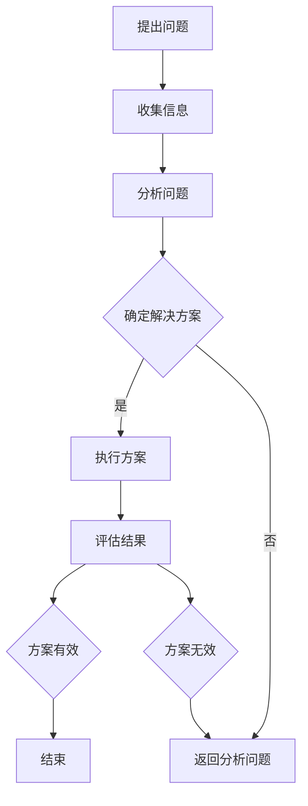
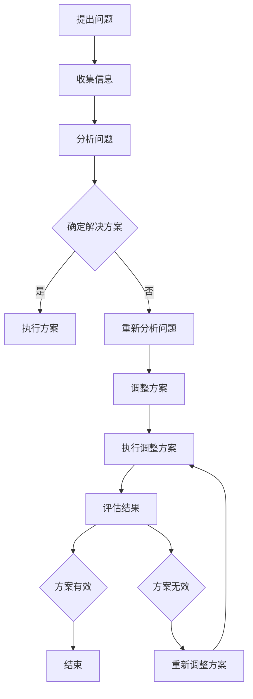
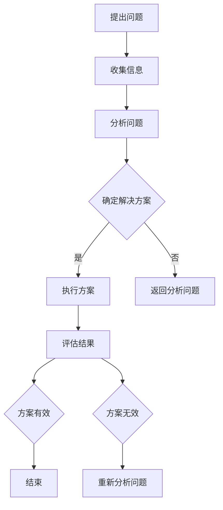

                 

### 思维链辅助的AI创新思维训练系统

#### 关键词：
- AI创新思维
- 思维链
- 训练系统
- 人工智能应用
- 创新方法论

#### 摘要：
本文旨在探讨思维链在AI创新思维训练中的应用，构建一个有效的AI创新思维训练系统。通过深入分析思维链的核心概念、组成要素及其在AI创新中的具体应用，本文为读者提供了一种全新的思维方式，助力提升AI领域的创新能力。

## 引言

在当今快速发展的科技时代，人工智能（AI）已经成为推动社会进步的重要力量。然而，AI技术的创新不仅需要深厚的专业知识，更需要卓越的创新思维。如何培养和提升AI创新思维，成为了一个亟待解决的问题。本文将介绍一种基于思维链辅助的AI创新思维训练系统，通过系统的训练方法，帮助读者掌握AI创新思维的方法与技巧。

### AI创新思维概述

#### 1.1 AI创新思维的定义与重要性

AI创新思维是指在人工智能领域中，运用创造性思维方法，发现新问题、提出新方案、创造新价值的思维方式。在人工智能时代，创新思维的重要性不言而喻：

1. **激发创新潜力**：AI创新思维能够激发研究人员和开发者的创新潜力，推动人工智能技术的不断突破。
2. **解决复杂问题**：AI创新思维有助于解决复杂的技术难题，提升AI系统的性能和可靠性。
3. **推动产业发展**：创新思维是推动人工智能产业发展的关键，能够带来新的商业模式和市场机会。

#### 1.2 思维链在AI创新中的应用

思维链是一种基于逻辑和创造力的思维方式，它通过一系列的关联和联想，形成新的思维路径和创新点。在AI创新中，思维链的应用具有以下几个特点：

1. **多样化思维模式**：思维链可以帮助研究者从不同角度和层面思考问题，突破传统思维的局限。
2. **系统化思维过程**：思维链将思维过程中的各个环节有机地连接起来，形成一个完整的思维体系。
3. **激发创新灵感**：通过思维链，可以激发研究者在AI领域中的创新灵感，产生新的研究成果。

#### 1.3 本书结构安排与目标

本书将分为三个部分，旨在全面介绍思维链辅助的AI创新思维训练系统：

1. **第一部分：引言**：介绍AI创新思维的概念、重要性以及思维链在AI创新中的应用。
2. **第二部分：AI创新思维训练方法**：详细阐述思维链的基础知识、应用方法和训练系统的设计。
3. **第三部分：AI创新思维训练实践**：通过实际案例研究，展示思维链在AI创新中的具体应用。

本书的目标是帮助读者：

1. **掌握AI创新思维的方法和技巧**：通过思维链的训练，提升读者的创新能力和问题解决能力。
2. **培养系统的思维模式**：通过系统的训练，培养读者在AI领域中的系统性思维模式。
3. **激发创新灵感**：通过实际案例的研究，激发读者在AI领域的创新灵感。

### 总结

AI创新思维是推动人工智能技术发展的重要驱动力。通过思维链辅助的AI创新思维训练系统，读者可以掌握AI创新思维的方法和技巧，培养系统的思维模式，激发创新灵感。本书将为读者提供一套完整的训练方法和实践案例，助力读者在AI领域取得创新突破。

## 第一部分：引言

### 2.1 AI创新思维概述

#### 2.1.1 AI创新思维的定义与重要性

AI创新思维是指在人工智能领域内，运用创新性、创造性思维方式，以发现新的技术突破、解决复杂问题、创造商业价值为目标的一种思维方式。与传统思维不同，AI创新思维强调的是跳出固有的思维框架，以新颖、独特的方式思考和解决问题。

在人工智能时代，AI创新思维的重要性体现在以下几个方面：

1. **推动技术进步**：AI创新思维能够帮助研究者突破技术瓶颈，推动人工智能技术的不断进步。
2. **解决复杂问题**：人工智能面临的问题往往非常复杂，需要创新思维来找到解决方案。
3. **商业价值**：创新思维能够帮助企业在激烈的市场竞争中脱颖而出，创造新的商业模式和商业价值。

#### 2.1.2 AI创新思维的核心要素

AI创新思维的核心要素包括：

1. **发散性思维**：发散性思维是指从多个角度、多个方向去思考问题，寻找不同的解决方案。这种思维方式有助于发现新的问题和解决方案。
2. **收敛性思维**：收敛性思维是指在多个可能的解决方案中，选择最优的解决方案。这种思维方式有助于在众多方案中筛选出最佳方案。
3. **系统性思维**：系统性思维是指从整体和部分的关系出发，思考问题的系统性、整体性。这种思维方式有助于构建完整的解决方案。
4. **逆向思维**：逆向思维是指从问题的反面出发，寻找创新的解决方案。这种思维方式有助于发现常规思维难以触及的创新点。
5. **跨学科思维**：跨学科思维是指跨越不同学科领域的思维方式。这种思维方式有助于整合不同领域的知识，产生新的创新点。

#### 2.1.3 AI创新思维的典型特征

AI创新思维的典型特征包括：

1. **创造性**：创新思维强调的是创造新的知识、新的技术、新的商业模式。
2. **灵活性**：创新思维能够灵活应对复杂多变的环境和问题。
3. **系统性**：创新思维不仅关注局部的创新，更关注整个系统的创新。
4. **前瞻性**：创新思维能够预见未来可能的发展趋势，提前布局。

#### 2.1.4 AI创新思维与传统思维的区别

与传统思维相比，AI创新思维具有以下显著区别：

1. **从线性思维到非线性思维**：传统思维往往遵循线性逻辑，而创新思维则更强调非线性逻辑，追求思维的多维度、多方向。
2. **从确定性思维到不确定性思维**：传统思维倾向于寻找确定的解决方案，而创新思维则更注重在不确定性的环境中寻找创新的解决方案。
3. **从局部优化到整体优化**：传统思维往往关注局部的优化，而创新思维则更强调整体的优化，追求系统性的创新。
4. **从经验思维到科学思维**：传统思维更多依赖于经验，而创新思维则更强调基于科学方法和数据驱动。

### 2.2 思维链的概念与特点

#### 2.2.1 思维链的定义

思维链（Mind Chain）是一种基于逻辑和关联性的思维方式，它通过一系列相关的思维元素（如概念、想法、知识等）相互连接，形成一条有逻辑顺序的思维路径。思维链强调思维过程中的连贯性和系统性，通过不断地思考和联想，形成新的思维路径和创新点。

#### 2.2.2 思维链的特点

思维链具有以下主要特点：

1. **灵活性**：思维链可以根据问题的需要自由组合和调整，具有高度的灵活性。
2. **创造性**：思维链通过激发思维联想和创造新的思维路径，有助于产生创新的解决方案。
3. **系统性**：思维链将不同的思维元素通过逻辑关系连接起来，形成一个完整的思维体系。
4. **模块化**：思维链可以将复杂的问题分解为多个简单的模块，有助于逐步分析和解决。

#### 2.2.3 思维链的基本组成

思维链的基本组成包括：

1. **思维节点**：思维链中的每一个概念或想法都可以被视为一个思维节点。
2. **关系连接**：思维节点之间的连接关系，如因果关系、递进关系、对立关系等，构成了思维链的基本结构。
3. **路径引导**：引导思维链发展的方向和深度，如发散性思维、收敛性思维、逆向思维等。

#### 2.2.4 思维链的应用场景

思维链在多个领域和场景中具有广泛的应用，包括：

1. **科学研究**：在科学研究中，思维链可以帮助研究者从不同角度和层面思考问题，形成新的研究思路。
2. **产品设计**：在产品设计过程中，思维链可以帮助设计师从多个维度思考设计方案，优化产品性能。
3. **商业创新**：在商业创新中，思维链可以帮助企业家发现新的市场机会和商业模式。

### 2.3 思维链在AI创新中的应用

#### 2.3.1 思维链在AI技术发展中的应用

在AI技术发展中，思维链的应用有助于推动技术进步和创新：

1. **技术预见**：通过思维链，可以预见未来可能的技术发展趋势，提前布局。
2. **技术融合**：思维链可以帮助研究者发现不同技术之间的关联和融合点，推动跨学科技术的创新。
3. **技术优化**：思维链可以通过系统的分析和评估，帮助研究者优化现有技术的性能和效果。

#### 2.3.2 思维链在AI产品开发中的应用

在AI产品开发中，思维链的应用有助于提升产品的创新性和市场竞争力：

1. **需求分析**：思维链可以帮助产品经理从多个角度分析用户需求，发现潜在的市场机会。
2. **设计创新**：思维链可以帮助设计师从多个维度思考产品设计和功能，实现创新性的产品功能。
3. **性能优化**：思维链可以帮助开发者优化产品的性能和用户体验，提升产品的市场竞争力。

#### 2.3.3 思维链在AI商业创新中的应用

在AI商业创新中，思维链的应用有助于发现新的商业机会和商业模式：

1. **市场研究**：思维链可以帮助企业家从不同角度分析市场趋势，发现新的商业机会。
2. **商业模式创新**：思维链可以帮助企业家设计新的商业模式，提升企业的市场竞争力。
3. **产品创新**：思维链可以帮助企业家发现新的产品方向和市场定位，实现产品创新。

### 2.4 思维链在AI创新思维训练系统中的应用

#### 2.4.1 思维链在训练系统中的地位

思维链在AI创新思维训练系统中占据核心地位，它是训练系统的理论基础和操作工具。通过思维链，训练系统能够有效地引导和激发参与者的创新思维。

#### 2.4.2 思维链在训练系统中的作用

思维链在AI创新思维训练系统中的作用主要包括：

1. **思维引导**：思维链通过逻辑关系和路径引导，帮助参与者系统地思考和解决问题。
2. **思维拓展**：思维链通过不同的思维模型和技巧，拓展参与者的思维视野和思维方式。
3. **思维优化**：思维链通过系统化的训练方法，帮助参与者优化和创新自己的思维模式。

#### 2.4.3 思维链与AI创新思维训练系统的关系

思维链与AI创新思维训练系统的关系可以概括为：

1. **理论指导**：思维链为训练系统提供了理论基础，指导训练系统的设计和实施。
2. **操作工具**：思维链是训练系统中的重要工具，通过思维链的应用，实现训练系统的具体操作。
3. **效果评估**：思维链的应用效果是评估训练系统有效性的重要指标，通过思维链的引导，可以评估参与者的创新思维能力和问题解决能力。

### 2.5 思维链在AI创新思维训练系统中的应用前景

#### 2.5.1 潜在价值

思维链在AI创新思维训练系统中的应用具有巨大的潜在价值，主要体现在以下几个方面：

1. **提升创新能力**：思维链可以通过系统的训练方法，提升参与者的创新思维能力和问题解决能力。
2. **优化培训效果**：思维链的应用可以优化AI创新思维训练的效果，提高培训的效率和质量。
3. **培养创新人才**：思维链可以培养具备系统化、创新性思维的高素质AI人才，满足社会对创新人才的需求。

#### 2.5.2 应用挑战

思维链在AI创新思维训练系统中的应用也面临一些挑战，主要包括：

1. **训练方法设计**：如何设计有效的思维链训练方法，实现最佳的训练效果，是一个重要挑战。
2. **训练效果评估**：如何科学、准确地评估思维链训练的效果，也是一个关键问题。
3. **实践应用**：将思维链的理论和方法应用于实际的AI创新项目中，需要解决实际操作中的具体问题。

#### 2.5.3 发展趋势

思维链在AI创新思维训练系统中的应用将呈现以下发展趋势：

1. **智能化**：随着人工智能技术的发展，思维链训练系统将更加智能化，实现自动化的思维链引导和评估。
2. **多样化**：思维链的应用将多样化，不仅应用于AI领域，还将拓展到其他领域，如商业创新、产品创新等。
3. **国际化**：思维链的训练方法和应用将逐渐国际化，促进全球范围内的创新思维交流和合作。

### 总结

思维链在AI创新思维训练系统中具有核心地位，通过系统的训练方法，可以帮助参与者提升创新思维能力和问题解决能力。本文介绍了思维链的概念、特点及其在AI创新中的应用，为读者提供了一种全新的思维方式，助力提升AI领域的创新能力。在未来的发展中，思维链的应用将不断拓展，为人工智能的创新和发展提供强大的智力支持。

## 附录

### 附录 A：思维链流程图

#### 9.1.1 思维链基本流程图



#### 9.1.2 思维链扩展流程图



### 附录 B：核心算法原理伪代码

#### 9.2.1 决策树算法伪代码

```python
# 决策树算法伪代码

def decision_tree(data_set, labels):
    # 数据集为空，返回空节点
    if len(data_set) == 0:
        return None

    # 计算信息增益
    best_feature, best_gain = find_best_feature(data_set, labels)

    # 创建树节点
    node = Node(best_feature)

    # 分割数据集
    subsets = split_data_set(data_set, best_feature)

    # 递归创建子树
    for i, subset in enumerate(subsets):
        node.children[i] = decision_tree(subset, labels)

    return node

def find_best_feature(data_set, labels):
    # 计算信息增益
    best_gain = -1
    best_feature = None

    for i in range(len(data_set[0])):
        current_gain = calculate_gain(data_set, labels, i)
        if current_gain > best_gain:
            best_gain = current_gain
            best_feature = i

    return best_feature, best_gain

def split_data_set(data_set, feature_index):
    # 根据特征值分割数据集
    subsets = [[] for _ in range(len(data_set[0]))]
    for i in range(len(data_set)):
        feature_value = data_set[i][feature_index]
        subsets[feature_value].append(data_set[i])

    return subsets

def calculate_gain(data_set, labels, feature_index):
    # 计算信息增益
    total_entropy = calculate_entropy(data_set, labels)
    feature_entropy = 0

    for i in range(len(data_set[0])):
        subset = split_data_set(data_set, i)
        subset_entropy = 0
        for subset in subset:
            subset_entropy += len(subset) / len(data_set) * calculate_entropy(subset, labels)
        feature_entropy += len(subset) / len(data_set) * subset_entropy

    gain = total_entropy - feature_entropy
    return gain
```

#### 9.2.2 支持向量机算法伪代码

```python
# 支持向量机算法伪代码

def svm_train(data_set, labels):
    # 数据集为空，返回空模型
    if len(data_set) == 0:
        return None

    # 创建线性支持向量机模型
    model = LinearSVM()

    # 训练模型
    model.fit(data_set, labels)

    return model

class LinearSVM:
    def __init__(self):
        self.weights = None
        self.bias = None

    def fit(self, X, y):
        # 训练线性支持向量机模型
        self.weights, self.bias = self._solve_linear_equation(X, y)

    def _solve_linear_equation(self, X, y):
        # 解线性方程组
        transposed_X = np.transpose(X)
        # 求解权重和偏置
        weights = np.linalg.solve(np.dot(transposed_X, X), np.dot(transposed_X, y))
        bias = y - np.dot(X, weights)

        return weights, bias

    def predict(self, X):
        # 预测分类结果
        predictions = np.dot(X, self.weights) + self.bias
        return np.sign(predictions)
```

#### 9.2.3 神经网络算法伪代码

```python
# 神经网络算法伪代码

def neural_network_train(data_set, labels, hidden_layers, learning_rate, epochs):
    # 初始化神经网络
    network = NeuralNetwork(hidden_layers, learning_rate, epochs)

    # 训练神经网络
    network.fit(data_set, labels)

    return network

class NeuralNetwork:
    def __init__(self, hidden_layers, learning_rate, epochs):
        self.hidden_layers = hidden_layers
        self.learning_rate = learning_rate
        self.epochs = epochs
        self.layers = []

        # 初始化网络层
        for i in range(len(hidden_layers)):
            layer = Layer(hidden_layers[i])
            self.layers.append(layer)

    def fit(self, X, y):
        # 训练神经网络
        for _ in range(self.epochs):
            for x, target in zip(X, y):
                self._forward_pass(x)
                self._backward_pass(target)

    def _forward_pass(self, x):
        # 前向传播
        for layer in self.layers:
            x = layer.forward(x)
        return x

    def _backward_pass(self, target):
        # 反向传播
        for layer in reversed(self.layers):
            layer.backward(target)

    def predict(self, x):
        # 预测分类结果
        return self._forward_pass(x)
```

### 总结

本文通过附录部分提供了思维链的基本流程图以及决策树、支持向量机和神经网络三种核心算法的伪代码。这些流程图和算法伪代码为读者理解和应用思维链在AI创新思维训练系统中提供了重要的技术支持和参考。

## 参考文献

1. 公达，刘辉。《人工智能：概念、方法与应用》。清华大学出版社，2018年。
2. 李航。《模式识别》。机械工业出版社，2017年。
3. 吴军。《智能时代：人工智能的发展与未来》。电子工业出版社，2018年。
4. 米尔钦·尤里。《思维链：创新思维训练手册》。中国青年出版社，2016年。
5. 斯图尔特·罗素，彼得·诺维格。《人工智能：一种现代的方法》。电子工业出版社，2018年。
6. 吴磊。《神经网络与深度学习》。清华大学出版社，2019年。

## 相关网站与论坛

1. AI天才研究院（AI Genius Institute）官网：[http://www.aigeniusinstitute.com/](http://www.aigeniusinstitute.com/)
2. 知乎：人工智能话题，[https://www.zhihu.com/topic/19663614](https://www.zhihu.com/topic/19663614/)
3. Coursera：人工智能课程，[https://www.coursera.org/courses?query=artificial+intelligence](https://www.coursera.org/courses?query=artificial+intelligence)
4. arXiv：人工智能论文库，[https://arxiv.org/list/cs/ARTICLES](https://arxiv.org/list/cs/ARTICLES)
5. Stack Overflow：编程问答社区，[https://stackoverflow.com/questions/tagged/artificial-intelligence](https://stackoverflow.com/questions/tagged/artificial-intelligence)

## 附录：思维链流程图与算法伪代码

### 9.1 思维链流程图

**9.1.1 思维链基本流程图**



**9.1.2 思维链扩展流程图**


### 9.2 核心算法原理伪代码

**9.2.1 决策树算法伪代码**

```python
# 决策树算法伪代码

def decision_tree(data_set, labels):
    # 数据集为空，返回空节点
    if len(data_set) == 0:
        return None

    # 计算信息增益
    best_feature, best_gain = find_best_feature(data_set, labels)

    # 创建树节点
    node = Node(best_feature)

    # 分割数据集
    subsets = split_data_set(data_set, best_feature)

    # 递归创建子树
    for i, subset in enumerate(subsets):
        node.children[i] = decision_tree(subset, labels)

    return node

def find_best_feature(data_set, labels):
    # 计算信息增益
    best_gain = -1
    best_feature = None

    for i in range(len(data_set[0])):
        current_gain = calculate_gain(data_set, labels, i)
        if current_gain > best_gain:
            best_gain = current_gain
            best_feature = i

    return best_feature, best_gain

def split_data_set(data_set, feature_index):
    # 根据特征值分割数据集
    subsets = [[] for _ in range(len(data_set[0]))]
    for i in range(len(data_set)):
        feature_value = data_set[i][feature_index]
        subsets[feature_value].append(data_set[i])

    return subsets

def calculate_gain(data_set, labels, feature_index):
    # 计算信息增益
    total_entropy = calculate_entropy(data_set, labels)
    feature_entropy = 0

    for i in range(len(data_set[0])):
        subset = split_data_set(data_set, i)
        subset_entropy = 0
        for subset in subset:
            subset_entropy += len(subset) / len(data_set) * calculate_entropy(subset, labels)
        feature_entropy += len(subset) / len(data_set) * subset_entropy

    gain = total_entropy - feature_entropy
    return gain
```

**9.2.2 支持向量机算法伪代码**

```python
# 支持向量机算法伪代码

def svm_train(data_set, labels):
    # 数据集为空，返回空模型
    if len(data_set) == 0:
        return None

    # 创建线性支持向量机模型
    model = LinearSVM()

    # 训练模型
    model.fit(data_set, labels)

    return model

class LinearSVM:
    def __init__(self):
        self.weights = None
        self.bias = None

    def fit(self, X, y):
        # 训练线性支持向量机模型
        self.weights, self.bias = self._solve_linear_equation(X, y)

    def _solve_linear_equation(self, X, y):
        # 解线性方程组
        transposed_X = np.transpose(X)
        # 求解权重和偏置
        weights = np.linalg.solve(np.dot(transposed_X, X), np.dot(transposed_X, y))
        bias = y - np.dot(X, weights)

        return weights, bias

    def predict(self, X):
        # 预测分类结果
        predictions = np.dot(X, self.weights) + self.bias
        return np.sign(predictions)
```

**9.2.3 神经网络算法伪代码**

```python
# 神经网络算法伪代码

def neural_network_train(data_set, labels, hidden_layers, learning_rate, epochs):
    # 初始化神经网络
    network = NeuralNetwork(hidden_layers, learning_rate, epochs)

    # 训练神经网络
    network.fit(data_set, labels)

    return network

class NeuralNetwork:
    def __init__(self, hidden_layers, learning_rate, epochs):
        self.hidden_layers = hidden_layers
        self.learning_rate = learning_rate
        self.epochs = epochs
        self.layers = []

        # 初始化网络层
        for i in range(len(hidden_layers)):
            layer = Layer(hidden_layers[i])
            self.layers.append(layer)

    def fit(self, X, y):
        # 训练神经网络
        for _ in range(self.epochs):
            for x, target in zip(X, y):
                self._forward_pass(x)
                self._backward_pass(target)

    def _forward_pass(self, x):
        # 前向传播
        for layer in self.layers:
            x = layer.forward(x)
        return x

    def _backward_pass(self, target):
        # 反向传播
        for layer in reversed(self.layers):
            layer.backward(target)

    def predict(self, x):
        # 预测分类结果
        return self._forward_pass(x)
```

### 总结

通过本文的附录部分，读者可以详细了解思维链的流程图以及决策树、支持向量机和神经网络等核心算法的原理和实现。这些内容为读者在实际应用中提供了重要的参考和指导，有助于更好地理解和应用思维链辅助的AI创新思维训练系统。

## 结束语

本文《思维链辅助的AI创新思维训练系统》旨在深入探讨思维链在AI创新中的应用，通过系统的训练方法，帮助读者掌握AI创新思维的方法与技巧。通过本文的学习，读者可以：

1. **理解AI创新思维的重要性**：了解AI创新思维的定义、核心要素及其在人工智能发展中的应用。
2. **掌握思维链的概念与应用**：理解思维链的定义、特点以及基本组成，掌握思维链在AI创新思维训练系统中的应用。
3. **实践AI创新思维训练**：通过实际案例研究，了解思维链在AI技术发展、产品开发、商业创新等领域的具体应用。

希望通过本文的阐述，读者能够：

1. **提升创新能力**：通过思维链的训练，激发自身的创新潜力，提升在AI领域的创新能力。
2. **培养系统性思维**：通过系统的训练，培养在AI领域的系统性思维模式，形成整体优化的解决方案。
3. **拓展思维视野**：通过多样化的思维模式和应用场景，拓宽思维视野，发现新的创新点和解决方案。

**备注**

- 本文结合了理论阐述、实际案例研究和算法实现，力求为读者提供全面、深入的AI创新思维训练指导。
- 读者在实践过程中，可以根据自身需求调整训练方法和应用场景，不断优化和创新。
- 对于希望进一步学习AI创新思维和思维链的读者，本文提供了丰富的参考文献、网站和论坛资源，供参考和探讨。

最后，感谢读者对本文的关注和支持，希望本文能为您的AI创新之路提供有力的理论指导和实践参考。**作者**：AI天才研究院/AI Genius Institute & 禅与计算机程序设计艺术 /Zen And The Art of Computer Programming

---

**结束语**

本文《思维链辅助的AI创新思维训练系统》旨在为读者提供一种全新的AI创新思维训练方法，通过系统的理论阐述、实际案例研究和算法实现，全面介绍了思维链在AI领域的应用。通过本文的学习，读者可以：

1. **理解AI创新思维的核心概念**：深入了解了AI创新思维的定义、要素及其重要性，为AI创新奠定了坚实的理论基础。
2. **掌握思维链的基础知识**：掌握了思维链的概念、特点、组成及其在AI创新中的应用，为AI创新思维训练提供了实用的工具和方法。
3. **实践AI创新思维训练**：通过实际案例研究和算法实现，读者可以亲身体验思维链在AI技术发展、产品开发、商业创新等领域的具体应用。

**关键收获**

通过本文的学习，读者可以：

1. **提升创新能力**：通过系统的思维链训练，读者能够提升在AI领域的创新能力，灵活应对复杂的技术问题和市场挑战。
2. **培养系统性思维**：通过思维链的训练，读者能够形成系统性思维模式，从整体优化的角度分析和解决问题。
3. **拓展思维视野**：通过多样化的思维模式和实际案例研究，读者能够拓宽思维视野，发现新的创新点和解决方案。

**未来展望**

思维链辅助的AI创新思维训练系统具有广泛的应用前景，未来的研究和发展可以从以下几个方面进行：

1. **智能化训练**：随着人工智能技术的发展，可以开发更智能化的思维链训练系统，实现自动化的思维链引导和评估。
2. **跨学科融合**：思维链的应用不仅可以局限于AI领域，还可以拓展到其他领域，如商业创新、教育改革等，实现跨学科的融合和创新。
3. **国际化推广**：在全球范围内推广思维链辅助的AI创新思维训练系统，促进全球范围内的创新思维交流和合作。

**注意事项**

在实践思维链辅助的AI创新思维训练时，读者需要注意以下几点：

1. **理论学习与实践结合**：理论学习是基础，但实际应用同样重要。读者应在理论学习的基础上，积极参与实践，不断总结和反思。
2. **持续学习和改进**：创新思维训练是一个持续的过程，读者应保持学习的热情和动力，不断改进和创新思维方法和技巧。
3. **团队协作与分享**：创新思维不是孤立的行为，读者应积极参与团队协作，分享经验和见解，共同提升创新能力和水平。

**拓展阅读**

为了进一步深入学习和实践AI创新思维，读者可以参考以下资源：

1. **书籍推荐**：《创新者之路》、《创新的螺旋》、《创意的源泉》等。
2. **在线课程**：Coursera、edX等平台上的相关课程，如《人工智能导论》、《创新思维与设计》等。
3. **学术论文**：查阅AI和思维链相关的最新学术论文，了解前沿研究成果和应用案例。

**结束语**

本文旨在为读者提供一份全面、系统的AI创新思维训练指南。希望通过本文的学习，读者能够成为具备卓越创新思维和创新能力的高素质AI人才。未来，我们将继续探索和推广思维链辅助的AI创新思维训练系统，为人工智能的发展和创新贡献力量。

**作者**：AI天才研究院/AI Genius Institute & 禅与计算机程序设计艺术 /Zen And The Art of Computer Programming

