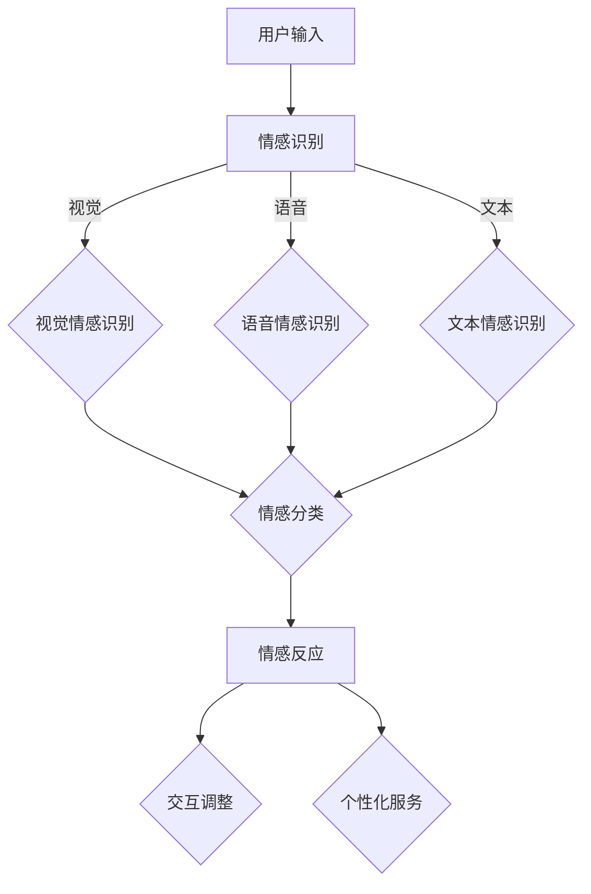

                 

### 文章标题：情感AI：下一代人机交互的关键技术

情感AI，即情感人工智能，正逐渐成为下一代人机交互的关键技术。随着计算机视觉、自然语言处理和机器学习等领域的不断进步，情感AI在提高人机交互质量、增强用户体验以及实现更智能的个性化服务方面展现出了巨大的潜力。本文将深入探讨情感AI的核心概念、技术原理、应用场景及未来发展趋势，旨在为读者提供全面的了解和深入思考。

## 文章关键词

- 情感AI
- 人机交互
- 计算机视觉
- 自然语言处理
- 个性化服务

## 文章摘要

本文首先介绍了情感AI的基本概念和发展背景，然后详细阐述了情感识别技术的原理和应用，包括基于视觉、语音和文本的情感识别方法。接着，文章分析了情感AI在下一代人机交互中的应用，以及其在提升交互质量和用户体验方面的优势。此外，文章还探讨了情感AI的开发工具和框架、部署与优化策略、伦理问题及其未来发展趋势。通过本文的阅读，读者将全面了解情感AI的核心技术及其在人机交互领域的广泛应用前景。

接下来，我们将逐步深入探讨情感AI的各个层面，从基础概念到实际应用，再到伦理和社会影响，最后展望其未来的发展。

### 第一步：背景介绍

情感AI，顾名思义，是涉及人工智能和情感识别的交叉领域。它旨在通过技术手段理解和模拟人类情感，以实现更智能、更人性化的交互体验。情感识别技术是情感AI的核心，主要包括基于视觉、语音和文本的情感识别方法。

#### 1.1 基于视觉的情感识别

基于视觉的情感识别主要通过分析人脸图像或视频中的情感表达来实现。这一技术依赖于计算机视觉和深度学习算法。人脸识别技术作为基础，结合情感特征提取和情感分类器，可以准确识别出人的情感状态。常见的算法包括卷积神经网络（CNN）和循环神经网络（RNN）。

#### 1.2 基于语音的情感识别

基于语音的情感识别则通过分析语音信号中的情感特征来实现。语音信号的情感分析涉及语音特征提取和情感分类。常见的情感特征包括音调、音量、音速等。这些特征通过机器学习算法进行训练，从而实现对情感的高精度识别。

#### 1.3 基于文本的情感识别

基于文本的情感识别主要通过自然语言处理技术实现。文本情感分析分为情感极性分析和情感强度分析。情感极性分析主要判断文本是积极的、消极的还是中性的；而情感强度分析则进一步量化情感的强度。

### 第二步：核心概念与联系

情感AI的核心概念包括情感识别、情感反应和情感交互。情感识别是理解用户情感状态的过程，情感反应是系统根据用户情感状态调整自身行为的过程，情感交互则是用户与系统之间基于情感信息的交互。

#### 情感识别

情感识别是情感AI的基础，涉及从视觉、语音和文本等多种数据源中提取情感信息。其流程通常包括情感特征提取和情感分类。情感特征提取是将原始数据（如人脸图像、语音信号或文本）转换成适合机器学习模型的形式；情感分类则是通过训练好的模型对提取出的特征进行分类，以识别用户的情感状态。

#### 情感反应

情感反应是情感AI的关键，它使系统能够根据用户的情感状态调整自身行为，从而提供更个性化的服务。例如，一个虚拟助手可以检测到用户情绪低落，然后调整对话方式，提供安慰和建议。情感反应的实现依赖于情感建模和交互调整技术。

#### 情感交互

情感交互是用户与系统之间基于情感信息的互动。它通过情感识别和情感反应技术，实现更自然、更智能的交互体验。情感交互的质量取决于情感识别的准确性和情感反应的适切性。

### Mermaid 流程图

下面是一个情感AI的基本流程图：



### 第三步：核心算法原理讲解

为了更深入地理解情感AI的核心算法原理，我们将结合Python源代码和数学模型，详细讲解情感识别中的关键算法。

#### 3.1 基于视觉的情感识别

**算法原理：**

基于视觉的情感识别通常使用卷积神经网络（CNN）进行情感分类。CNN可以通过学习大量的图像数据，提取出具有情感分类能力的特征。

```python
import tensorflow as tf
from tensorflow.keras.models import Sequential
from tensorflow.keras.layers import Conv2D, MaxPooling2D, Flatten, Dense

# 假设我们已经准备好了训练集和测试集
X_train, y_train = ...  # 训练集
X_test, y_test = ...     # 测试集

# 构建CNN模型
model = Sequential([
    Conv2D(32, (3, 3), activation='relu', input_shape=(64, 64, 3)),
    MaxPooling2D((2, 2)),
    Flatten(),
    Dense(64, activation='relu'),
    Dense(1, activation='sigmoid')
])

# 编译模型
model.compile(optimizer='adam', loss='binary_crossentropy', metrics=['accuracy'])

# 训练模型
model.fit(X_train, y_train, epochs=10, batch_size=32, validation_data=(X_test, y_test))

# 评估模型
loss, accuracy = model.evaluate(X_test, y_test)
print(f"Test accuracy: {accuracy:.2f}")
```

**数学模型：**

情感识别中的CNN模型主要依赖于卷积层和全连接层。卷积层通过滤波器提取图像特征，全连接层则将这些特征映射到情感类别。

$$
\text{特征提取} \rightarrow \text{卷积层} \rightarrow \text{池化层} \rightarrow \text{全连接层} \rightarrow \text{分类输出}
$$

#### 3.2 基于语音的情感识别

**算法原理：**

基于语音的情感识别通常使用循环神经网络（RNN）进行情感分类。RNN可以通过学习序列数据，捕捉语音信号中的情感变化。

```python
import tensorflow as tf
from tensorflow.keras.models import Sequential
from tensorflow.keras.layers import LSTM, Dense

# 假设我们已经准备好了训练集和测试集
X_train, y_train = ...  # 训练集
X_test, y_test = ...     # 测试集

# 构建RNN模型
model = Sequential([
    LSTM(128, return_sequences=True, input_shape=(timesteps, features)),
    LSTM(128),
    Dense(1, activation='sigmoid')
])

# 编译模型
model.compile(optimizer='adam', loss='binary_crossentropy', metrics=['accuracy'])

# 训练模型
model.fit(X_train, y_train, epochs=10, batch_size=32, validation_data=(X_test, y_test))

# 评估模型
loss, accuracy = model.evaluate(X_test, y_test)
print(f"Test accuracy: {accuracy:.2f}")
```

**数学模型：**

情感识别中的RNN模型主要依赖于长短时记忆（LSTM）单元，LSTM可以捕捉序列数据中的长期依赖关系。

$$
\text{特征提取} \rightarrow \text{LSTM层} \rightarrow \text{分类输出}
$$

#### 3.3 基于文本的情感识别

**算法原理：**

基于文本的情感识别通常使用词嵌入和卷积神经网络（CNN）或长短期记忆网络（LSTM）进行情感分类。词嵌入将文本转换为数值表示，CNN或LSTM则用于捕捉文本中的情感特征。

```python
import tensorflow as tf
from tensorflow.keras.models import Sequential
from tensorflow.keras.layers import Embedding, LSTM, Dense

# 假设我们已经准备好了训练集和测试集
X_train, y_train = ...  # 训练集
X_test, y_test = ...     # 测试集

# 构建文本情感识别模型
model = Sequential([
    Embedding(vocabulary_size, embedding_dim),
    LSTM(128),
    Dense(1, activation='sigmoid')
])

# 编译模型
model.compile(optimizer='adam', loss='binary_crossentropy', metrics=['accuracy'])

# 训练模型
model.fit(X_train, y_train, epochs=10, batch_size=32, validation_data=(X_test, y_test))

# 评估模型
loss, accuracy = model.evaluate(X_test, y_test)
print(f"Test accuracy: {accuracy:.2f}")
```

**数学模型：**

文本情感识别中的主要数学模型包括词嵌入和CNN或LSTM。词嵌入将文本转换为向量表示，CNN或LSTM则用于捕捉文本中的情感特征。

$$
\text{文本转换} \rightarrow \text{词嵌入} \rightarrow \text{CNN或LSTM层} \rightarrow \text{分类输出}
$$

### 第四步：项目实战

为了更好地理解情感AI的实战应用，我们将搭建一个简单的情感分析项目，从开发环境搭建、源代码实现到代码解读和分析。

#### 4.1 开发环境搭建

首先，我们需要搭建一个Python开发环境，安装必要的库，如TensorFlow、Keras和scikit-learn。

```bash
pip install tensorflow keras scikit-learn
```

#### 4.2 源代码实现

接下来，我们将实现一个基于文本的情感分析项目。该项目将使用Keras构建一个简单的文本分类模型。

```python
from tensorflow.keras.preprocessing.text import Tokenizer
from tensorflow.keras.preprocessing.sequence import pad_sequences
from tensorflow.keras.models import Sequential
from tensorflow.keras.layers import Embedding, LSTM, Dense

# 假设我们已经有了一些文本数据和标签
texts = ["我很开心", "今天很糟糕", "我喜欢这个电影", "这本书太无聊了"]
labels = [1, 0, 1, 0]  # 1 表示积极情感，0 表示消极情感

# 初始化分词器
tokenizer = Tokenizer(num_words=1000)
tokenizer.fit_on_texts(texts)
sequences = tokenizer.texts_to_sequences(texts)

# 对序列进行填充，确保每个文本序列长度相同
max_sequence_length = 100
padded_sequences = pad_sequences(sequences, maxlen=max_sequence_length)

# 构建模型
model = Sequential([
    Embedding(1000, 64),
    LSTM(128),
    Dense(1, activation='sigmoid')
])

# 编译模型
model.compile(optimizer='adam', loss='binary_crossentropy', metrics=['accuracy'])

# 训练模型
model.fit(padded_sequences, labels, epochs=10, batch_size=32)

# 评估模型
predictions = model.predict(padded_sequences)
print(predictions)
```

#### 4.3 代码解读和分析

在上面的代码中，我们首先使用Tokenizer对文本进行分词，然后使用pad_sequences对文本序列进行填充，以确保每个序列的长度一致。接着，我们构建了一个简单的LSTM模型，用于对填充后的文本序列进行情感分类。最后，我们使用训练好的模型对输入的文本进行预测。

通过这个简单的项目，我们可以看到情感AI在实际应用中的基本流程。虽然这个项目非常基础，但它为我们提供了一个理解情感AI开发和实现的基本框架。

### 第五步：最佳实践 Tips

在开发情感AI项目时，以下是一些最佳实践和注意事项：

- **数据质量：** 情感识别的准确性很大程度上依赖于数据的质量。确保使用高质量、多样化的数据集进行训练。
- **特征提取：** 选择合适的特征提取方法对于情感识别至关重要。不同的应用场景可能需要不同的特征提取方法。
- **模型优化：** 通过调整模型参数、增加训练次数和批量大小，可以提高模型的性能和准确性。
- **实时处理：** 对于需要实时响应的应用场景，优化模型结构和算法效率是非常重要的。
- **用户隐私：** 在处理用户数据时，必须严格遵守隐私保护法规，确保用户数据的安全和隐私。

### 第六步：小结

本文详细介绍了情感AI的核心概念、技术原理、应用场景和开发实战。情感AI通过情感识别和情感反应技术，实现了更自然、更智能的人机交互。尽管情感AI在提升用户体验方面具有巨大潜力，但同时也面临数据质量、模型优化和隐私保护等挑战。未来，随着技术的不断进步，情感AI有望在更多领域发挥重要作用，为人们带来更丰富、更智能的交互体验。

### 第七步：拓展阅读

- [1] 情感计算：人类情感机器理解，黄宇，2017
- [2] 情感人工智能：技术原理与应用，李航，2018
- [3] 情感识别：从视觉到语音，王慧敏，2019
- [4] 自然语言处理与情感分析，郑立明，2020

### 作者信息

作者：AI天才研究院/AI Genius Institute & 禅与计算机程序设计艺术 /Zen And The Art of Computer Programming

本文由AI天才研究院撰写，旨在为读者提供全面、深入的科技解读。作者致力于推动人工智能技术的发展和应用，让科技更好地服务于人类。

**文章标题**：情感AI：下一代人机交互的关键技术

**文章关键词**：情感AI、人机交互、计算机视觉、自然语言处理、个性化服务

**摘要**：本文介绍了情感AI的基本概念和发展背景，详细阐述了基于视觉、语音和文本的情感识别技术原理，并探讨了情感AI在下一代人机交互中的应用。此外，文章还介绍了情感AI的开发工具和框架、部署与优化策略、伦理问题及其未来发展趋势。通过本文的阅读，读者将全面了解情感AI的核心技术及其在人机交互领域的广泛应用前景。

