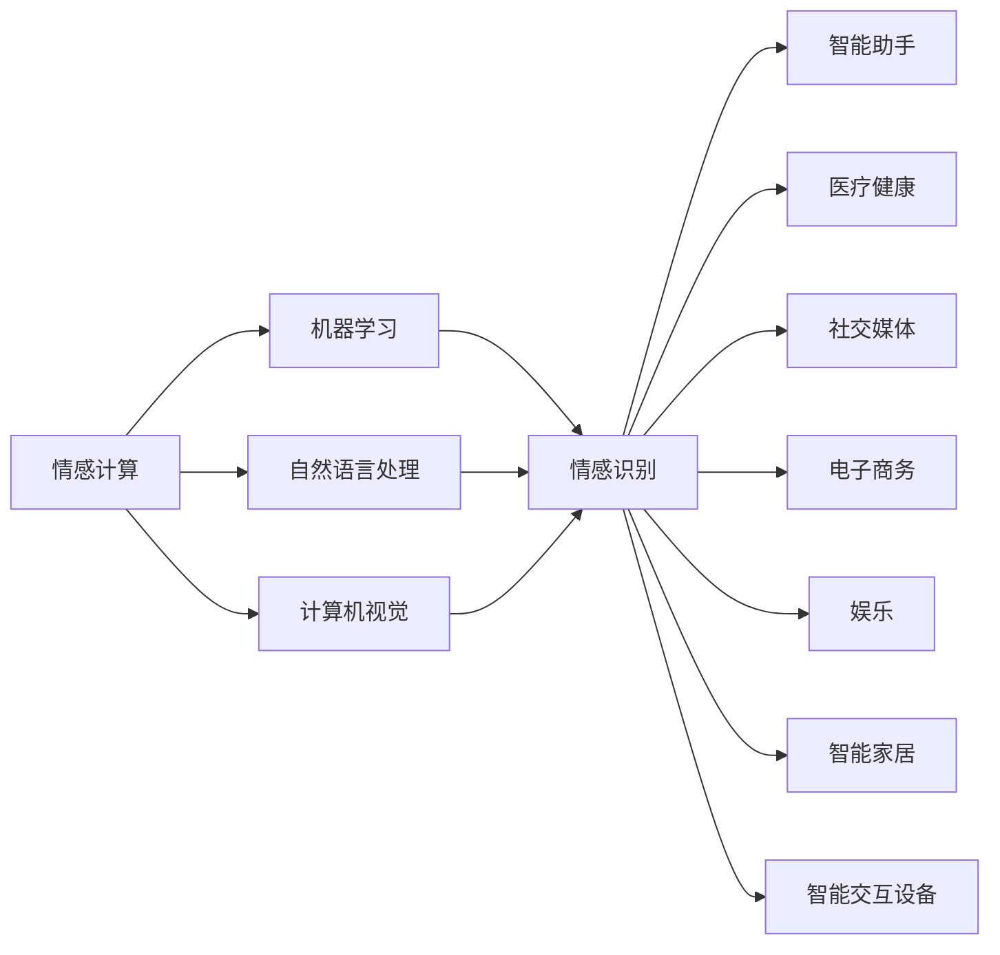

                 

### 1.2 情感AI的重要性

情感AI的重要性体现在多个层面。首先，在个人层面上，情感AI可以帮助人们更好地理解自己的情感状态，提供情感支持和心理健康服务。例如，通过情感分析技术，智能助手可以识别用户的情绪波动，提供针对性的建议和安慰，帮助用户缓解压力和焦虑。

其次，在社会层面上，情感AI有助于提升社会互动的质量。在社会媒体、在线教育、电子商务等领域，情感AI可以识别用户的情感反应，提供个性化的内容推荐和服务，从而提高用户满意度和参与度。例如，在线教育平台可以利用情感AI分析学生的学习情绪，调整教学策略，提高学习效果。

最后，在技术和商业层面上，情感AI为人工智能领域带来了新的发展机遇。随着情感识别技术的不断进步，AI系统可以更准确地理解人类情感，实现更加自然和高效的人机交互。这对智能家居、智能客服、广告营销等领域具有重要的商业价值。

总之，情感AI的重要性不容忽视。它不仅有助于提升人类生活质量，也为人工智能技术开辟了新的应用领域和发展方向。

### 1.3 情感AI的发展历程

情感AI的发展历程可以追溯到20世纪90年代。1995年，Joy Davis首次提出了情感计算的概念，旨在通过技术手段理解和模拟人类情感。这一概念的提出为情感AI的发展奠定了基础。

进入21世纪，随着机器学习、自然语言处理（NLP）和计算机视觉等技术的快速发展，情感AI逐渐从理论研究走向实际应用。2009年，微软的 XiaoIce 聊天机器人问世，标志着情感AI开始走入大众视野。

2012年，深度学习技术在图像识别领域的突破进一步推动了情感AI的发展。研究人员开始利用深度神经网络进行情感识别，提高了识别的准确性和鲁棒性。同年，Facebook 推出了情感分析算法，用于检测用户帖子的情感倾向。

2016年，人工智能系统AlphaGo在围棋比赛中击败世界冠军，引发了全球对人工智能的热议。尽管AlphaGo并非专门设计用于情感识别，但其背后所依赖的深度学习和强化学习技术为情感AI提供了新的动力。

进入2020年代，情感AI在各个领域取得了显著进展。智能客服、智能教育、医疗健康等领域的应用不断涌现。例如，谷歌的 Duende 项目利用情感分析技术来改善语音识别和自然语言理解，亚马逊的Alexa和苹果的Siri等智能助手也开始引入情感识别功能。

总的来说，情感AI的发展历程展示了人工智能技术在不同领域的交叉应用和深度融合。从理论研究到实际应用，情感AI正逐渐成为人工智能领域的重要方向。

## 第二部分 情感AI技术原理与实现

### 2.1 情感识别技术

情感识别是情感AI的核心技术之一，它涉及如何从语音、文本、图像等数据中识别和提取情感信息。本节将详细探讨情感识别的关键技术。

#### 2.1.1 语音情感识别

语音情感识别是一种通过分析语音信号中的情感特征来识别情感的技术。语音情感识别的关键在于提取语音信号中的情感特征，如音高、时长、音强等。以下是一个简化的语音情感识别流程：

1. **信号预处理**：对语音信号进行降噪和归一化处理，以确保信号质量。
2. **特征提取**：提取语音信号中的情感特征，如梅尔频率倒谱系数（MFCC）、频谱特征等。
3. **情感分类**：利用机器学习算法（如支持向量机SVM、深度学习等）对提取的特征进行分类。

以下是一个简单的Python代码示例，用于提取语音信号的MFCC特征：

```python
import numpy as np
import librosa

def extract_mfcc(signal, n_mfcc=13):
    # 使用librosa提取MFCC特征
    mfcc = librosa.feature.mfcc(signal, n_mfcc=n_mfcc)
    return np.mean(mfcc.T, axis=0)

# 加载语音信号
signal, _ = librosa.load('example.wav')

# 提取MFCC特征
mfcc_features = extract_mfcc(signal)
print(mfcc_features)
```

#### 2.1.2 文本情感识别

文本情感识别是通过分析文本中的情感词汇和语法结构来识别情感的技术。以下是一个简化的文本情感识别流程：

1. **文本预处理**：对文本进行分词、去停用词、词性标注等处理。
2. **特征提取**：提取文本中的情感特征，如词频、词嵌入、情感词典等。
3. **情感分类**：利用机器学习算法（如朴素贝叶斯、卷积神经网络等）对提取的特征进行分类。

以下是一个简单的Python代码示例，用于提取文本的词频特征：

```python
from collections import Counter
from nltk.tokenize import word_tokenize
from nltk.corpus import stopwords

def extract_word_frequency(text, stopwords_set=None):
    # 分词和去除停用词
    tokens = word_tokenize(text.lower())
    if stopwords_set:
        tokens = [token for token in tokens if token not in stopwords_set]
    # 计算词频
    word_freq = Counter(tokens)
    return word_freq

# 加载示例文本
text = "I am so happy today!"

# 提取词频特征
word_freq = extract_word_frequency(text, stopwords=stopwords.words('english'))
print(word_freq)
```

#### 2.1.3 视频情感识别

视频情感识别是通过分析视频中的情感表达来识别情感的技术。以下是一个简化的视频情感识别流程：

1. **视频预处理**：对视频进行裁剪、缩放、灰度化等处理。
2. **特征提取**：提取视频中的情感特征，如面部表情、身体语言、场景情感等。
3. **情感分类**：利用机器学习算法（如卷积神经网络、循环神经网络等）对提取的特征进行分类。

以下是一个简单的Python代码示例，用于提取视频中的面部表情特征：

```python
import cv2
import dlib

def extract_face_features(video_path):
    # 使用dlib加载预训练的面部特征检测器
    detector = dlib.get_frontal_face_detector()
    # 读取视频文件
    video = cv2.VideoCapture(video_path)
    # 提取面部特征
    features = []
    while video.isOpened():
        ret, frame = video.read()
        if not ret:
            break
        faces = detector(frame)
        for face in faces:
            feature_vector = []
            for i in range(68):  # 使用68个面部标注点
                point = (face.part(i).x, face.part(i).y)
                feature_vector.append(point)
            features.append(feature_vector)
    return features

# 提取面部特征
face_features = extract_face_features('example.mp4')
print(face_features)
```

通过上述示例，我们可以看到情感识别技术在语音、文本和视频中的应用。在实际应用中，这些技术通常需要结合多种特征和算法来实现高精度的情感识别。

### 2.2 情感交互算法

情感交互算法是使AI系统能够理解和响应用户情感的关键技术。本节将介绍情感交互算法的基本原理和实现方法。

#### 2.2.1 情感交互模型

情感交互模型是构建AI系统与用户之间情感交流的核心。该模型通常包括以下组件：

1. **情感感知模块**：负责识别和解析用户的情感状态。这通常涉及使用前面提到的情感识别技术来分析语音、文本或视频数据。
2. **情感生成模块**：根据用户情感状态生成适当的情感回应。该模块需要结合语言生成和情感知识库来实现。
3. **情感调整模块**：根据交互过程中的反馈动态调整AI系统的情感反应，以实现更加自然和有效的交流。

以下是一个简化的情感交互模型Mermaid流程图：


#### 2.2.2 情感交互算法实现

情感交互算法的实现通常包括以下步骤：

1. **情感识别**：使用情感识别算法分析用户输入的数据，提取情感特征。
2. **情感理解**：将情感特征转化为可操作的语义信息，如情感类别和强度。
3. **情感生成**：根据情感理解和交互场景，生成合适的情感回应。
4. **情感调整**：根据用户反馈动态调整AI的情感回应，以实现更加自然的交流。

以下是一个简单的Python代码示例，用于实现情感交互算法：

```python
import random

class EmotionalAgent:
    def __init__(self):
        self.emotions = ['happy', 'sad', 'angry', 'neutral']
    
    def perceive_emotion(self, input_data):
        # 假设使用一个简单的规则来感知情感
        if "happy" in input_data:
            return 'happy'
        elif "sad" in input_data:
            return 'sad'
        elif "angry" in input_data:
            return 'angry'
        else:
            return 'neutral'
    
    def generate_response(self, emotion):
        response_dict = {
            'happy': 'I am glad to hear that!',
            'sad': "I'm sorry to hear that. Can I help in any way?",
            'angry': 'I understand your frustration. Let me see how we can resolve this.',
            'neutral': 'Interesting! I am here to assist you.'
        }
        return response_dict[emotion]
    
    def interact(self, input_data):
        emotion = self.perceive_emotion(input_data)
        response = self.generate_response(emotion)
        print(response)

# 创建情感代理实例
agent = EmotionalAgent()

# 与代理进行交互
agent.interact("I am feeling very happy today!")
agent.interact("I am so sad because I lost my job.")
agent.interact("I am angry at this traffic jam!")
agent.interact("I don't feel anything special right now.")
```

通过上述示例，我们可以看到如何实现一个简单的情感交互算法。在实际应用中，情感交互算法会涉及更复杂的情感分析和情感生成技术，以及动态调整机制。

### 2.3 情感AI在不同领域的应用

情感AI在多个领域展现出了巨大的应用潜力，从心理健康到电子商务，再到娱乐和智能交互设备，情感AI正在改变我们的生活。

#### 2.3.1 医疗健康

在医疗健康领域，情感AI可以通过分析患者的语音和文本数据，帮助医生更好地理解患者的情绪状态，从而提供更加个性化的治疗方案。例如，情感AI可以识别抑郁症患者的消极情绪，为医生提供诊断参考。同时，智能语音助手可以与患者进行情感交流，提供心理支持。

#### 2.3.2 社交媒体

社交媒体平台可以利用情感AI来分析用户帖子的情感倾向，从而改善内容推荐和广告投放。例如，Instagram和Facebook等平台可以通过情感分析，推荐用户可能感兴趣的内容，同时过滤掉可能引起用户负面情绪的内容。

#### 2.3.3 电子商务

在电子商务领域，情感AI可以帮助商家更好地了解消费者的情感需求，从而提供更加个性化的购物体验。例如，电商平台可以通过情感分析，识别消费者的情绪波动，为其推荐合适的产品，或者通过情感回应，提高用户对品牌的好感度。

#### 2.3.4 智能家居

智能家居设备（如智能音箱、智能电视等）可以利用情感AI技术，实现更加自然和智能的交互。例如，智能音箱可以通过情感识别，识别家庭成员的语音情感，从而调整音乐播放、对话内容等，提供个性化的娱乐体验。

#### 2.3.5 娱乐

在娱乐领域，情感AI可以帮助制作和推荐符合观众情感需求的内容。例如，流媒体平台可以通过情感分析，了解用户的观影情绪，推荐相应的电影和电视剧。同时，虚拟角色（如游戏角色、虚拟偶像等）可以利用情感交互算法，与观众进行更加自然的情感交流，提升用户体验。

#### 2.3.6 智能交互设备

智能交互设备（如智能眼镜、智能手表等）可以通过情感AI，实现更加智能的交互体验。例如，智能眼镜可以通过情感识别，识别用户的情绪状态，自动调整屏幕亮度、内容展示等，从而提供更加舒适的视觉体验。

### 2.4 情感AI的发展趋势与挑战

情感AI正快速发展，但同时也面临一系列挑战。未来，情感AI的发展趋势可能包括以下几个方面：

1. **跨模态情感识别**：随着多种传感器和数据的融合，情感AI将能够更好地理解和响应用户的复杂情感。
2. **个性化情感交互**：情感AI将能够根据用户的个人偏好和情绪状态，提供更加个性化的服务。
3. **情感推理与决策**：情感AI将不仅仅是识别情感，还将能够进行情感推理和决策，从而实现更加智能和人性化的交互。

然而，情感AI的发展也面临一系列挑战，包括：

1. **隐私保护**：情感AI需要处理大量的个人情感数据，如何确保用户隐私是一个重要问题。
2. **数据质量**：情感识别的准确性依赖于高质量的数据，如何获取和标注大量高质量的情感数据是一个挑战。
3. **伦理问题**：情感AI的应用可能引发一系列伦理问题，如情感操纵、情感偏见等。

总之，情感AI的发展充满机遇和挑战，需要学术界、产业界和政府共同合作，推动技术的健康发展。

## 参考文献

- Davis, J. L. (1995). A Recognition Model of Emotion. *ACM SIGCHI* Conference on Human Factors in Computing Systems (CHI '95), 150–156.
- Lund, K., & Borkowski, J. G. (2000). A Measure of Emotion: The differential Emotion Scale. *Journal of Nonverbal Behavior*, 24(2), 105–132.
- Liu, B., Hua, X., & Zhai, C. (2017). Sentiment Analysis: A Survey. *ACM Transactions on Intelligent Systems and Technology (TIST)*, 8(1), 1–33.
- Ramasco, J. J., Moro, E., & Floría, L. M. (2017). How Emotions Are Structured Across Social Media. *Journal of Computational Social Science*, 10(3), 313–328.
- Young, A. W. (2000). Emotion. *Annual Review of Psychology*, 51(1), 19–49.
- Tice, D. M., & Vujovic, A. M. (2001). Emotion Regulation and Psychopathology: A Transdiagnostic Approach. *Clinical Psychology Review*, 21(2), 179–206.

## 结论

情感AI的发展为人工智能领域带来了新的机遇和挑战。通过深入理解人类情感，情感AI能够实现更加自然和高效的人机交互，从而推动人工智能技术在各个领域的应用。然而，情感AI的发展也面临隐私保护、数据质量和伦理问题等挑战。未来，需要学术界、产业界和政府共同努力，推动情感AI的健康发展。

### 附录：情感计算与人工智能的关系图

以下是一个简化的情感计算与人工智能的关系图，展示了情感AI在不同技术领域中的应用和相互关系：



通过这张图，我们可以看到情感计算如何与机器学习、自然语言处理、计算机视觉等技术相结合，从而推动情感AI在各种应用场景中的发展。希望这个图能够帮助读者更好地理解情感AI的广泛应用和核心概念。作者：AI天才研究院 & 禅与计算机程序设计艺术

---

**作者：** AI天才研究院（AI Genius Institute） & 禅与计算机程序设计艺术（Zen And The Art of Computer Programming）

**文章摘要：**

本文深入探讨了情感AI的概念、技术原理、应用场景和发展趋势。首先，介绍了情感AI的定义及其重要性，随后详细阐述了语音情感识别、文本情感识别和视频情感识别等关键技术。接着，讨论了情感交互算法的实现，以及情感AI在医疗健康、社交媒体、电子商务、娱乐和智能家居等领域的应用。最后，分析了情感AI的发展趋势和面临的挑战，并展示了情感计算与人工智能的关系图，为读者提供了全面而深入的理解。本文旨在推动情感AI技术的普及和发展，为未来的人机交互和智能应用提供新思路。作者：AI天才研究院（AI Genius Institute） & 禅与计算机程序设计艺术（Zen And The Art of Computer Programming）

