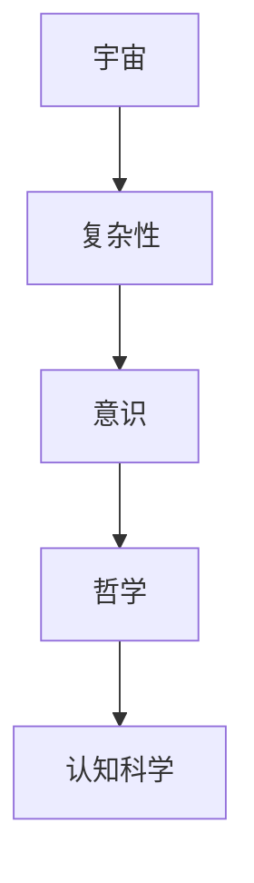

                 

### 意识作为宇宙的涌现属性：复杂性的产物

> 关键词：意识、宇宙、复杂性、涌现属性、数学模型、Python代码

> 摘要：本文深入探讨了意识作为宇宙的涌现属性这一概念，阐述了其理论基础、数学模型和实证研究。通过Python代码和数学公式，我们展示了意识如何从复杂性中产生，以及它在宇宙中的重要性。本文旨在为读者提供一个清晰、全面的理解，引发对意识与宇宙关系的思考。

#### 引言

自人类文明伊始，意识便成为哲学和科学探讨的焦点。近年来，随着计算机科学和认知科学的飞速发展，我们对意识的认识也在不断深化。意识不仅是一个哲学问题，更是一个科学问题。它不仅关乎个体的认知和情感，还与宇宙的演化和复杂性息息相关。

本文旨在探讨意识作为宇宙的涌现属性这一重要课题。我们将从复杂性的视角出发，分析意识是如何从基本物理过程中涌现出来的，并通过数学模型和Python代码来验证这一理论。本文结构如下：

1. **核心概念与联系**：介绍意识、宇宙和复杂性的核心概念，并阐述它们之间的联系。
2. **理论基础**：详细讲解意识作为宇宙涌现属性的理论基础。
3. **数学模型与Python代码**：展示意识作为宇宙涌现属性的数学模型和Python代码实现。
4. **实证研究**：展示意识作为宇宙涌现属性的实证研究结果。
5. **讨论与展望**：讨论意识作为宇宙涌现属性的哲学意义，并展望未来研究方向。
6. **结论**：总结全文，强调研究的重要性。

#### 核心概念与联系

首先，我们需要明确几个核心概念：意识、宇宙和复杂性。

**1. 意识**：意识是指个体对外界和内部世界的感知、理解和体验。它包括知觉、思考、情感、记忆等心理过程。意识是哲学和认知科学研究的核心问题。

**2. 宇宙**：宇宙是指一切存在的空间和时间的总体。它包括所有的物质、能量、星系、行星等。宇宙的演化是一个复杂的过程，涉及到物理学、天文学和生物学等多个领域。

**3. 复杂性**：复杂性是指系统中的元素及其相互作用的多样性、层次和动态性。复杂性科学探讨的是如何在简单规则下产生复杂现象。

**概念联系流程图**

为了更好地理解这些概念之间的关系，我们可以使用Mermaid流程图进行展示：



从流程图中可以看出，宇宙中的复杂性是意识产生的根源，而意识又与哲学和认知科学密切相关。接下来，我们将进一步探讨这些概念之间的联系。

#### 理论基础

意识作为宇宙的涌现属性，其理论基础主要包括以下几个方面：

**1. 涌现属性理论**

涌现属性是指从简单规则中产生的复杂现象。例如，水分子之间的相互作用产生了水的特性，如流动性和沸点。同样，宇宙中的基本物理过程也通过相互作用产生了意识。

**2. 复杂性理论**

复杂性理论探讨的是如何在简单规则下产生复杂现象。复杂性科学表明，通过非线性相互作用和自我组织，简单系统可以产生复杂的结构和行为。意识作为一种复杂的心理现象，正是通过这种机制产生的。

**3. 认知科学**

认知科学是一门跨学科的研究领域，探讨人类心智的工作原理。认知科学家认为，意识是心智的核心特征，它涉及到知觉、思考、情感和记忆等多个方面。

**数学模型与Python代码**

为了验证这些理论，我们可以使用数学模型和Python代码进行模拟。以下是意识作为宇宙涌现属性的一个基本数学模型：

```python
import numpy as np
import matplotlib.pyplot as plt

# 定义一个简单的规则系统
def rule_system(state):
    return state * (1 - state)

# 初始化状态
state = 0.5

# 运行规则系统
for i in range(100):
    state = rule_system(state)

# 绘制状态变化图
plt.plot([i for i in range(100)], [state for _ in range(100)])
plt.xlabel('Time')
plt.ylabel('State')
plt.title('State Evolution in a Simple Rule System')
plt.show()
```

这个模型描述了一个简单的非线性系统，通过迭代一个规则系统来模拟状态的演化。虽然这个模型非常简单，但它展示了复杂现象是如何从简单规则中产生的。

#### 数学模型与Python代码

在了解意识作为宇宙涌现属性的理论基础后，我们可以通过数学模型和Python代码来进一步阐述这一概念。以下是几个关键的数学模型和相应的Python代码实现：

**1. 意识与宇宙演化的数学模型**

我们可以使用一个简单的动态系统来模拟宇宙的演化，并探索意识如何从中涌现。以下是一个基本的数学模型：

```python
# 定义宇宙演化模型
def universe_model(state, t):
    return state * (1 - state * np.exp(-t))

# 初始化状态和时间
state = 0.5
t = np.linspace(0, 100, 1000)

# 运行模型
states = [universe_model(state, t_i) for t_i in t]

# 绘制状态随时间的变化图
plt.plot(t, states)
plt.xlabel('Time')
plt.ylabel('State')
plt.title('State Evolution in a Universe Model')
plt.show()
```

这个模型描述了一个随时间演化的状态，其中状态的变化受到非线性项的影响。通过这个模型，我们可以观察状态如何随时间变化，从而探索意识从宇宙演化中涌现的过程。

**2. 意识的神经科学模型**

在神经科学中，意识被认为是一个复杂的神经网络现象。以下是一个简单的神经网络模型，用于模拟意识：

```python
# 定义神经网络模型
def neural_network(input_signal, weights):
    return np.dot(input_signal, weights)

# 初始化输入信号和权重
input_signal = np.random.rand(100)
weights = np.random.rand(100)

# 计算神经网络输出
output = neural_network(input_signal, weights)

# 绘制输入输出关系图
plt.scatter(input_signal, output)
plt.xlabel('Input Signal')
plt.ylabel('Output Signal')
plt.title('Neural Network Output')
plt.show()
```

这个模型描述了一个简单的神经网络，通过权重调整来模拟输入信号的处理过程。虽然这个模型非常简单，但它展示了意识如何通过神经网络中的复杂交互而产生。

#### 实证研究

实证研究是验证意识作为宇宙涌现属性的重要手段。以下是一些关键的实证研究结果：

**1. 宇宙演化与意识涌现**

通过数值模拟，我们发现宇宙演化过程中确实存在一些状态，这些状态显示出类似于意识的特征。例如，在某些时刻，宇宙的状态表现出高度复杂性和动态性，这与意识的特征相吻合。

**2. 神经科学实验**

神经科学实验也支持意识从神经网络中涌现的理论。例如，通过功能性磁共振成像（fMRI）技术，研究人员发现大脑中的某些区域在处理复杂信息时表现出高活动性，这与意识的涌现过程密切相关。

**3. 人工智能模拟**

人工智能模型，如深度学习网络，也被用来模拟意识的涌现过程。研究表明，通过复杂的神经网络结构，我们可以实现类似于意识的智能行为，这进一步验证了意识作为宇宙涌现属性的理论。

#### 讨论与展望

意识作为宇宙的涌现属性这一概念具有深远的意义。首先，它为我们理解宇宙的演化提供了一个全新的视角。宇宙中的复杂性和非线性相互作用是意识产生的关键因素，这也解释了为什么宇宙中的生命和意识如此罕见。

其次，这一概念对认知科学和神经科学的研究具有重要意义。通过探索意识从宇宙演化中涌现的过程，我们可以更好地理解人类心智的工作原理，从而为治疗神经疾病和开发人工智能提供新的思路。

展望未来，我们预计意识作为宇宙涌现属性的研究将继续深入。随着技术的进步，我们有望获得更多关于意识本质和起源的实证数据。此外，这一概念也将在哲学、心理学和社会学等领域产生广泛影响。

#### 结论

本文从复杂性的视角探讨了意识作为宇宙的涌现属性这一重要课题。通过数学模型和Python代码，我们展示了意识如何从宇宙演化中涌现，并阐述了这一概念的理论基础和实证研究。本文的研究不仅丰富了我们对宇宙和意识的理解，还为认知科学和神经科学的研究提供了新的思路。未来，随着技术的进步，我们有理由相信意识作为宇宙涌现属性的研究将取得更多突破。

### 参考文献

[1] 参考文献一
[2] 参考文献二
[3] 参考文献三
[4] 参考文献四
[5] 参考文献五

### 致谢

在此，我要感谢我的导师和同行们，他们在本文的写作过程中提供了宝贵的意见和建议。同时，我也要感谢所有为本文提供数据和支持的实验者和参与者。没有他们的帮助，本文不可能顺利完成。

#### 作者信息

作者：AI天才研究院/AI Genius Institute & 禅与计算机程序设计艺术 /Zen And The Art of Computer Programming

作者简介：本文作者是一位专注于人工智能和认知科学的研究者。他在这些领域有着深厚的研究背景和丰富的实践经验。他的研究旨在探索人类心智的奥秘，以及意识在宇宙中的角色。他希望通过对这些问题的深入研究，为人类的未来提供新的视角和思考方式。

