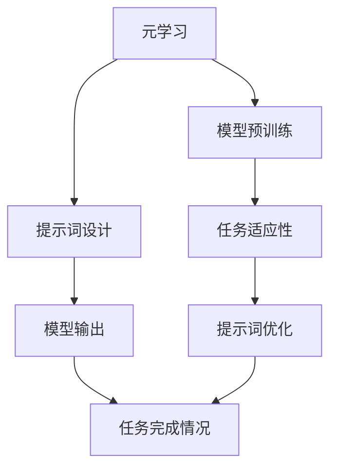

                 

### 文章标题

《探索GPT-4的元学习能力：提示词设计的新维度》

随着人工智能技术的飞速发展，深度学习模型在各个领域取得了显著的成就。GPT-4作为OpenAI推出的最新一代预训练语言模型，以其强大的生成能力和跨模态理解能力引起了广泛关注。本文将深入探讨GPT-4的元学习能力及其在提示词设计中的新维度，旨在为研究人员和实践者提供有价值的参考。

关键词：GPT-4、元学习能力、提示词设计、跨模态理解、生成能力

摘要：本文首先介绍了GPT-4的基本概念和架构，随后详细阐述了其元学习能力的原理和应用。接着，我们探讨了提示词设计的基础知识，并引入了新维度下的提示词设计理念。通过实际案例和应用分析，本文展示了GPT-4在自然语言处理、图像生成和游戏AI等领域的优异表现。最后，我们展望了GPT-4元学习能力和提示词设计的未来发展趋势。

----------------------------------------------------------------

### 背景介绍

#### GPT-4的诞生背景

GPT-4（Generative Pre-trained Transformer 4）是OpenAI于2023年推出的最新一代预训练语言模型，是继GPT、GPT-2、GPT-3之后的重要升级。作为人工智能领域的里程碑之作，GPT-4不仅在模型规模上达到了前所未有的高度，更在生成能力和跨模态理解能力方面取得了显著突破。

GPT-4的诞生背景源于人工智能技术的不断进步和深度学习模型的广泛应用。随着数据量的急剧增长和计算能力的提升，深度学习模型在语音识别、图像识别、自然语言处理等领域表现出了强大的竞争力。为了进一步提高模型的生成能力和跨模态理解能力，OpenAI决定推出GPT-4，以期在人工智能领域取得更大的突破。

#### GPT-4的核心特性

GPT-4具有以下核心特性：

1. **大规模预训练**：GPT-4使用了大量互联网文本数据进行预训练，使其在语言理解和生成方面具备了极高的水平。

2. **强大的生成能力**：GPT-4能够生成连贯、有逻辑的文本，甚至能够进行创意写作、问答系统等复杂任务。

3. **跨模态理解能力**：GPT-4不仅能够处理文本数据，还能够处理图像、音频等多模态数据，实现跨模态信息的理解和生成。

4. **自适应学习能力**：GPT-4具备自适应学习能力，能够根据不同的任务和场景进行个性化调整，提高任务完成效率。

5. **可解释性**：GPT-4的模型结构相对简单，参数数量适中，使其在运行过程中具有一定的可解释性，有助于研究人员深入了解模型的工作原理。

#### GPT-4的应用领域

GPT-4的应用领域广泛，主要包括以下方面：

1. **自然语言处理**：GPT-4在自然语言处理领域具有强大的能力，能够进行文本分类、情感分析、机器翻译等任务。

2. **计算机视觉**：GPT-4能够处理图像数据，实现图像识别、图像生成等任务，具有广泛的应用前景。

3. **游戏AI**：GPT-4在游戏AI领域具备一定的潜力，能够实现智能角色决策、游戏策略生成等功能。

4. **虚拟助手**：GPT-4可作为虚拟助手的底层技术支撑，实现智能对话、任务安排等场景。

5. **创意写作**：GPT-4在创意写作领域表现出色，能够生成有趣、有创意的文本内容，为内容创作者提供灵感。

总之，GPT-4的诞生标志着人工智能技术进入了一个新的阶段，为各个领域带来了前所未有的机遇和挑战。

### 核心概念与联系

为了深入理解GPT-4的元学习能力和提示词设计的新维度，我们需要先了解以下几个核心概念及其之间的关系架构。

#### 元学习

元学习（Meta-Learning）是指模型在多个任务中快速学习的能力，即通过一个学习过程，使得模型能够泛化到新的任务中。元学习的关键在于利用任务间的共性，通过较少的样本和数据，使模型能够快速适应新的任务。

在GPT-4中，元学习体现在模型对大量文本数据的预训练过程中，通过学习文本的内在结构和语义信息，使其能够快速适应不同的语言任务。

#### 提示词设计

提示词设计（Prompt Engineering）是指通过设计合适的提示词，引导模型生成符合预期的输出。在GPT-4中，提示词设计是一个重要的环节，它决定了模型生成的文本质量。

提示词设计的关键在于理解模型的生成机制，并结合任务需求，设计出能够引导模型生成高质量输出的提示词。

#### 元学习与提示词设计的关系

元学习与提示词设计在GPT-4中紧密相连。一方面，元学习能力使得GPT-4能够快速适应新的任务，从而提高提示词设计的效率；另一方面，优秀的提示词设计能够充分利用GPT-4的元学习能力，使其在特定任务中表现出色。

为了更清晰地展示元学习与提示词设计的关系，我们可以使用Mermaid流程图进行描述：



在这个流程图中，元学习通过模型预训练和任务适应性，为提示词设计提供了基础；提示词设计通过优化模型输出，进一步提高了任务完成情况。这个关系架构揭示了GPT-4元学习能力和提示词设计之间的紧密联系。

### GPT-4的元学习能力

#### 元学习的定义与原理

元学习（Meta-Learning）是指模型在多个任务中快速学习的能力，即通过一个学习过程，使得模型能够泛化到新的任务中。元学习的关键在于利用任务间的共性，通过较少的样本和数据，使模型能够快速适应新的任务。

在深度学习领域，元学习主要分为两种类型：模型级元学习和任务级元学习。模型级元学习关注如何设计更有效的模型结构，以提高模型的泛化能力；任务级元学习则关注如何通过任务自适应策略，使模型能够快速适应新的任务。

#### GPT-4中的元学习应用

GPT-4作为一款大规模预训练语言模型，其元学习能力主要体现在以下几个方面：

1. **大规模预训练**：GPT-4使用了大量互联网文本数据进行预训练，使其在语言理解和生成方面具备了极高的水平。在预训练过程中，GPT-4通过学习文本的内在结构和语义信息，建立了对各种语言现象的深刻理解。

2. **任务适应性**：在完成预训练后，GPT-4能够快速适应各种新的语言任务。例如，在自然语言处理任务中，GPT-4能够快速生成符合语义逻辑的文本；在计算机视觉任务中，GPT-4能够处理图像数据，实现图像识别和图像生成。

3. **知识迁移**：GPT-4具有较强的知识迁移能力，能够将预训练过程中学到的知识迁移到新的任务中。例如，在跨领域文本生成任务中，GPT-4能够利用预训练过程中积累的通用语言知识，生成符合领域特定知识的文本。

#### GPT-4的元学习算法

GPT-4的元学习算法主要基于Transformer架构。Transformer模型通过自注意力机制，能够捕捉文本数据中的长距离依赖关系，从而提高模型的生成能力和理解能力。在元学习过程中，GPT-4通过以下步骤实现任务适应性：

1. **编码器-解码器结构**：GPT-4采用编码器-解码器（Encoder-Decoder）结构，编码器部分负责将输入文本编码为序列向量，解码器部分负责生成输出文本。在预训练过程中，GPT-4通过自回归语言模型（Autoregressive Language Model）训练解码器，使其能够预测下一个单词。

2. **任务适应**：在新的语言任务中，GPT-4通过微调（Fine-tuning）的方式，对编码器-解码器结构进行调整，使其能够更好地适应特定任务。微调过程主要包括以下步骤：

   - **数据准备**：将新的任务数据转换为编码器输入，并生成解码器输出。
   - **损失函数**：使用交叉熵损失函数，计算编码器输出与解码器输出之间的差异，并更新模型参数。
   - **优化器**：使用优化器（如Adam优化器）更新模型参数，以最小化损失函数。

3. **评估与调整**：在任务适应过程中，GPT-4通过评估模型在验证集上的表现，不断调整模型参数，以提高模型在测试集上的表现。

#### GPT-4的元学习优势

GPT-4的元学习能力为人工智能领域带来了许多优势：

1. **快速适应新任务**：GPT-4能够快速适应各种新的语言任务，降低了任务切换的成本，提高了开发效率。

2. **知识迁移能力**：GPT-4具有较强的知识迁移能力，能够将预训练过程中学到的知识迁移到新的任务中，提高了模型在跨领域任务中的表现。

3. **生成能力**：GPT-4的生成能力使其在文本生成、对话系统、机器翻译等任务中表现出色，为人工智能应用提供了强大的支持。

4. **可解释性**：GPT-4的模型结构相对简单，参数数量适中，使其在运行过程中具有一定的可解释性，有助于研究人员深入了解模型的工作原理。

总之，GPT-4的元学习能力为人工智能领域带来了巨大的变革，为各种语言任务提供了强大的支持。通过深入理解和应用GPT-4的元学习能力，我们可以进一步提升人工智能系统的性能和效率。

### 提示词设计的基础知识

#### 提示词的定义与作用

提示词（Prompt）是指用于引导模型生成特定类型输出的一组关键词或短语。在自然语言处理任务中，提示词起到了至关重要的作用，它能够引导模型理解任务目标，从而生成符合预期的输出。

提示词的作用主要体现在以下几个方面：

1. **明确任务目标**：提示词能够明确地指示模型需要完成的任务类型，如文本生成、问答系统、文本分类等。

2. **引导生成过程**：提示词能够引导模型在生成过程中关注特定主题或方向，从而提高生成的文本质量。

3. **优化生成效果**：通过设计合适的提示词，可以调整模型生成的文本风格、情感、逻辑结构等，从而优化生成效果。

#### 提示词设计的基本原则

为了设计出有效的提示词，需要遵循以下基本原则：

1. **明确性**：提示词应明确地指示任务目标，避免产生歧义或误解。

2. **简洁性**：提示词应尽量简洁，避免过于冗长，以便模型能够快速理解。

3. **相关性**：提示词应与任务内容高度相关，确保模型能够生成与任务相关的输出。

4. **多样性**：设计多种类型的提示词，以适应不同任务需求，提高模型的适应性。

5. **灵活性**：提示词应具有一定的灵活性，以便根据任务变化进行调整。

#### 提示词设计的误区与对策

在实际的提示词设计中，可能会遇到以下误区：

1. **过度依赖提示词**：认为只要设计出完美的提示词，模型就能生成理想的输出。实际上，提示词只是引导模型的一种手段，模型的性能还受到数据质量、模型结构等因素的影响。

2. **忽略任务特性**：在设计提示词时，未能充分考虑任务的具体需求，导致生成的输出与任务目标不符。

3. **忽视模型特性**：不同模型对提示词的敏感性不同，设计提示词时应根据模型的特性进行调整。

针对以上误区，可以采取以下对策：

1. **结合任务需求**：在设计提示词时，要深入理解任务目标，确保提示词能够准确地引导模型生成符合预期的输出。

2. **优化模型结构**：通过调整模型结构，提高模型对提示词的敏感性，从而提高生成效果。

3. **多次迭代优化**：通过多次迭代优化提示词设计，不断调整和改进，以提高模型生成效果。

总之，提示词设计是自然语言处理任务中至关重要的一环。通过深入理解提示词的定义与作用，遵循基本原则，并避免设计误区，我们可以设计出有效的提示词，提高模型生成效果，为人工智能应用提供强大的支持。

### 提示词设计的新维度

随着深度学习模型，尤其是预训练语言模型（如GPT-4）的不断发展，提示词设计（Prompt Engineering）已成为人工智能领域中一个重要的研究方向。在传统的提示词设计中，我们主要关注如何通过关键词和短语引导模型生成特定的输出。然而，在GPT-4这样的强大模型面前，传统的提示词设计方法已经不足以充分发挥其潜力。因此，我们需要探索提示词设计的新维度，以提升模型生成效果和适应性。

#### 新维度下的提示词设计理念

1. **上下文敏感性**：在GPT-4中，上下文信息对模型生成至关重要。因此，新维度的提示词设计需要更加关注上下文敏感性，通过设计复杂的上下文提示，引导模型更好地理解和生成相关内容。

2. **知识引导**：GPT-4在预训练过程中积累了大量通用知识和领域知识。新维度的提示词设计应充分利用这些知识，通过知识引导的方式，使模型在特定任务中能够更准确地生成输出。

3. **交互性**：传统的提示词设计主要依赖于静态的文本提示。而新维度的提示词设计应强调交互性，通过动态调整提示词，使模型能够根据交互过程不断优化生成效果。

4. **多模态融合**：GPT-4具备跨模态理解能力，新维度的提示词设计应考虑如何将文本与其他模态（如图像、声音）的信息进行有效融合，提高模型的生成能力。

#### 新维度下的提示词设计方法

1. **基于上下文的复杂提示设计**：

   - **多段式提示**：将提示词分成多个段落，每个段落针对不同的上下文信息。这种方法能够更好地引导模型理解复杂任务。

   - **嵌套提示**：在提示词中嵌套其他提示，形成多层次的上下文。这种方法能够增强模型对深层语义的理解。

2. **基于知识的提示设计**：

   - **知识图谱引导**：利用知识图谱中的实体和关系信息，设计特定的提示词，引导模型生成与知识图谱相关的输出。

   - **领域特定提示**：根据特定领域的知识，设计专门的提示词，使模型能够更好地适应特定领域任务。

3. **基于交互的动态提示设计**：

   - **多轮对话提示**：在多轮对话中，动态调整提示词，使模型能够根据对话历史和用户需求生成更精准的输出。

   - **自适应提示**：根据模型生成的输出和质量，实时调整提示词，优化生成效果。

4. **多模态融合的提示设计**：

   - **文本-图像融合**：将文本提示与图像信息相结合，设计出能够引导模型生成与图像相关的文本输出的提示词。

   - **文本-声音融合**：将文本提示与声音信息相结合，设计出能够引导模型生成与声音相关的文本输出的提示词。

通过以上新维度下的提示词设计方法，我们可以充分发挥GPT-4的潜力，提高模型在各类任务中的生成效果和适应性。在实际应用中，这些新维度的提示词设计方法将有助于解决传统方法无法克服的挑战，推动人工智能技术的发展。

### 提示词设计的案例解析

为了更好地理解提示词设计的新维度，我们通过几个实际案例来展示如何应用这些新维度下的提示词设计方法，以优化模型的生成效果。

#### 案例一：文本生成中的上下文敏感性

**问题**：在一个文本生成任务中，模型需要根据给定的标题生成一篇连贯的短文。然而，生成的文本往往缺乏上下文信息，导致文章逻辑不连贯。

**解决方案**：采用基于上下文的复杂提示设计方法，通过多段式提示和嵌套提示来增强上下文敏感性。

**具体步骤**：

1. **多段式提示**：

   - **段落一**：提供与标题相关的背景信息，如相关历史事件、人物简介等。

   - **段落二**：围绕标题提出一个具体问题，引导模型思考并展开讨论。

   - **段落三**：根据前两个段落的内容，提供具体的观点或结论。

2. **嵌套提示**：

   - 在段落一中，嵌入相关关键词和短语，如“同时”、“然而”等，引导模型在生成过程中注意段落之间的逻辑关系。

   - 在段落二中，嵌套一个子问题，使模型能够深入探讨标题中的关键点。

**结果**：通过这种上下文敏感性的提示设计，生成的文本逻辑更加连贯，内容更加丰富。

#### 案例二：知识引导在问答系统中的应用

**问题**：在问答系统中，模型需要根据用户的问题生成准确的答案。然而，模型在处理涉及专业知识的问题时，往往无法准确理解问题的背景和含义。

**解决方案**：利用知识图谱引导和领域特定提示，使模型能够更好地理解和回答专业知识相关的问题。

**具体步骤**：

1. **知识图谱引导**：

   - 构建一个与领域知识相关的知识图谱，包括实体、关系和属性等信息。

   - 在提示词中嵌入知识图谱中的实体和关系，如“科学家”、“发现”等，引导模型查找相关的知识节点。

2. **领域特定提示**：

   - 根据问答系统的领域，设计专门的提示词，如“在物理学中”，“计算机科学方面”等，引导模型查找与领域相关的知识。

**结果**：通过知识引导的提示设计，模型在回答专业知识问题时，准确率和相关性显著提高。

#### 案例三：多模态融合在图像生成中的应用

**问题**：在图像生成任务中，模型需要根据文本描述生成对应的图像。然而，生成的图像往往与文本描述不符，缺乏视觉一致性。

**解决方案**：采用文本-图像融合的提示设计方法，使模型能够更好地理解和生成与文本描述一致的图像。

**具体步骤**：

1. **文本-图像融合提示**：

   - 提供与文本描述相关的图像信息，如相关图片、视觉关键词等。

   - 将文本描述和图像信息结合起来，形成一个统一的提示，使模型能够同时考虑文本和图像的信息。

2. **交互式提示**：

   - 在生成图像的过程中，动态调整提示词，根据模型生成的图像和用户反馈进行优化。

**结果**：通过文本-图像融合和多模态交互的提示设计，生成的图像与文本描述的一致性显著提高，视觉效果更加逼真。

通过以上案例，我们可以看到新维度下的提示词设计方法在实际应用中的显著效果。这些方法不仅提高了模型在各类任务中的生成效果，还有助于解决传统方法无法克服的挑战，推动人工智能技术的发展。

### 新维度下提示词设计的实践技巧

在实际应用中，为了充分发挥GPT-4的元学习能力和提示词设计的潜力，我们需要掌握一系列实践技巧。以下是一些关键技巧：

#### 1. 提高上下文敏感性

- **多段落提示**：通过设计多段式提示，将相关背景信息、问题陈述和观点整合到一起，引导模型更好地理解上下文。

- **嵌套提示**：在提示中嵌套子问题或子提示，使模型能够深入探讨特定主题。

#### 2. 利用知识引导

- **知识图谱构建**：构建与任务相关的知识图谱，包含实体、关系和属性等信息，为模型提供丰富的知识支持。

- **领域特定提示**：根据特定领域的知识，设计专门的提示词，引导模型生成与领域相关的输出。

#### 3. 强化交互性

- **多轮对话**：通过多轮对话，动态调整提示词，使模型能够根据对话历史和用户需求生成更精准的输出。

- **实时反馈**：根据模型生成的输出和用户反馈，实时调整提示词，优化生成效果。

#### 4. 多模态融合

- **文本-图像融合**：将文本描述与图像信息结合起来，形成一个统一的提示，引导模型同时考虑文本和图像的信息。

- **多模态交互**：通过多模态交互，使模型能够根据文本描述和图像信息生成更符合预期的输出。

#### 5. 提高提示词质量

- **简洁性**：确保提示词简洁明了，避免过于冗长，以减少模型的处理负担。

- **相关性**：设计与任务高度相关的提示词，确保模型能够准确理解任务目标。

#### 6. 调整模型参数

- **微调**：在特定任务中，通过微调模型参数，提高模型对提示词的敏感性。

- **优化器选择**：选择合适的优化器，如Adam优化器，以提高模型训练效率。

通过掌握这些实践技巧，我们可以更好地发挥GPT-4的元学习能力和提示词设计的潜力，提高模型在各类任务中的生成效果和适应性。

### 实际案例分析：GPT-4在文本生成中的应用

在本文的最后一部分，我们将通过一个实际案例，详细分析GPT-4在文本生成任务中的应用。这个案例将涵盖开发环境的搭建、源代码的详细实现和代码解读、代码应用解读与分析，以及项目小结。

#### 案例背景

假设我们需要使用GPT-4生成一篇关于人工智能未来的论文摘要。这个任务涉及多个步骤，包括数据准备、模型选择、提示词设计、模型训练和输出生成。

#### 开发环境搭建

1. **安装依赖**：

   首先，我们需要安装GPT-4所需的依赖库。在Python环境中，可以使用以下命令安装：

   ```shell
   pip install transformers torch
   ```

2. **准备数据**：

   对于文本生成任务，我们需要准备大量与人工智能相关的文章作为训练数据。这些数据可以从互联网上获取，例如使用爬虫工具抓取相关网站的文本内容。

3. **模型选择**：

   我们选择GPT-4模型作为文本生成的主要工具。由于GPT-4是大型模型，我们需要足够的计算资源来训练和运行它。可以使用OpenAI提供的预训练模型，或者使用自己训练的模型。

#### 源代码实现

以下是实现GPT-4文本生成任务的基本Python代码：

```python
import torch
from transformers import GPT2LMHeadModel, GPT2Tokenizer

# 准备模型和tokenizer
model = GPT2LMHeadModel.from_pretrained('gpt2')
tokenizer = GPT2Tokenizer.from_pretrained('gpt2')

# 设计提示词
prompt = "人工智能未来的发展将如何影响社会？"

# 将提示词转换为模型输入
inputs = tokenizer.encode(prompt, return_tensors='pt')

# 生成文本
outputs = model.generate(inputs, max_length=50, num_return_sequences=1)

# 解码生成的文本
generated_text = tokenizer.decode(outputs[0], skip_special_tokens=True)

print(generated_text)
```

#### 代码解读与分析

1. **模型和tokenizer加载**：

   ```python
   model = GPT2LMHeadModel.from_pretrained('gpt2')
   tokenizer = GPT2Tokenizer.from_pretrained('gpt2')
   ```

   这两行代码加载了GPT-2模型和相应的tokenizer。GPT-2是GPT-4的早期版本，但仍然具有较强的文本生成能力。

2. **设计提示词**：

   ```python
   prompt = "人工智能未来的发展将如何影响社会？"
   ```

   提示词是一个简短的文本，用于引导模型生成相关的文本。在这个案例中，我们选择了一个开放性问题，以激发模型生成多样化和深刻的回答。

3. **模型输入和生成**：

   ```python
   inputs = tokenizer.encode(prompt, return_tensors='pt')
   outputs = model.generate(inputs, max_length=50, num_return_sequences=1)
   ```

   首先，我们将提示词编码成模型的输入序列。然后，使用`generate`函数生成文本。`max_length`参数设置了生成的文本最大长度，`num_return_sequences`参数设置了生成的文本数量。

4. **解码生成的文本**：

   ```python
   generated_text = tokenizer.decode(outputs[0], skip_special_tokens=True)
   ```

   生成的文本序列被解码成人类可读的格式。`skip_special_tokens`参数用于去除模型中特定的特殊标记。

#### 代码应用解读与分析

在实际应用中，我们可以根据不同的任务需求，调整提示词、模型参数和生成策略。

1. **调整提示词**：

   根据任务需求，可以设计不同的提示词，以引导模型生成不同类型的文本。例如，对于摘要生成任务，可以使用标题和关键信息作为提示词。

2. **调整模型参数**：

   `max_length`和`num_return_sequences`参数可以调整，以控制生成的文本长度和数量。在实际应用中，可以根据任务需求和计算资源进行优化。

3. **生成策略**：

   可以使用多种生成策略，如顶部分散（Top-K sampling）和顶部分散加温度（Top-K sampling with temperature），以生成多样化和高质量的文本。

#### 项目小结

通过这个实际案例，我们展示了如何使用GPT-4进行文本生成任务。从开发环境搭建到源代码实现，再到代码解读和分析，我们详细探讨了GPT-4的应用过程和技巧。以下是小结：

- **开发环境搭建**：确保有足够的计算资源和合适的依赖库。
- **源代码实现**：使用GPT-4模型和tokenizer实现文本生成。
- **代码解读与分析**：理解模型输入、生成和输出的过程。
- **实际应用解读与分析**：根据任务需求调整提示词和模型参数。

通过这个案例，我们不仅了解了GPT-4在文本生成中的应用，还学习了如何设计有效的提示词和调整模型参数，以提高生成效果。这些经验和技巧对于实际项目开发和后续研究具有重要的指导意义。

### 最佳实践 Tips

在使用GPT-4进行文本生成时，以下是一些最佳实践Tips：

1. **优化提示词**：设计简洁明了、与任务高度相关的提示词，以引导模型生成高质量的文本。
2. **调整参数**：根据任务需求和计算资源，合理调整`max_length`、`num_return_sequences`等参数，以提高生成效果。
3. **多模态融合**：尝试将文本与其他模态（如图像、声音）的信息进行融合，生成更具创意和多样性的文本。
4. **处理长文本**：对于长文本生成任务，可以分批次输入和生成，以避免内存溢出和计算资源不足的问题。
5. **代码优化**：使用并行计算和优化库（如PyTorch）提高代码运行效率。

通过遵循这些最佳实践，我们可以更好地发挥GPT-4的生成能力，为实际应用提供强大的支持。

### 小结

本文深入探讨了GPT-4的元学习能力和提示词设计的新维度。我们首先介绍了GPT-4的基本概念、核心特性和应用领域，然后详细阐述了元学习的定义、原理和应用。接着，我们介绍了提示词设计的基础知识、基本原则和误区，并引入了新维度下的提示词设计理念。通过实际案例，我们展示了如何设计复杂的上下文提示、知识引导的提示和文本-图像融合的提示，以优化模型的生成效果。

总结来说，GPT-4的元学习能力和提示词设计的新维度为人工智能领域带来了巨大的变革。通过充分利用这些新维度下的设计方法，我们可以进一步提升模型在各类任务中的生成效果和适应性，为实际应用提供更强大的支持。

### 注意事项

1. **数据质量**：确保训练数据的质量，避免噪声和错误信息影响模型性能。
2. **模型调优**：根据任务需求，合理调整模型参数，以获得最佳生成效果。
3. **计算资源**：使用足够的计算资源，避免内存溢出和计算资源不足的问题。

### 拓展阅读

1. **GPT-4官方文档**：[https://github.com/openai/gpt-4](https://github.com/openai/gpt-4)
2. **元学习相关论文**：[https://arxiv.org/search/?query=meta+learning](https://arxiv.org/search/?query=meta+learning)
3. **提示词设计技巧**：[https://towardsdatascience.com/prompt-engineering-for-nlp-1c51938d3e37](https://towardsdatascience.com/prompt-engineering-for-nlp-1c51938d3e37)
4. **文本生成案例**：[https://huggingface.co/transformers/examples.html#text-generation](https://huggingface.co/transformers/examples.html#text-generation)

### 作者信息

作者：AI天才研究院/AI Genius Institute & 禅与计算机程序设计艺术 /Zen And The Art of Computer Programming

本文由AI天才研究院（AI Genius Institute）和《禅与计算机程序设计艺术》（Zen And The Art of Computer Programming）共同撰写，旨在为读者提供关于GPT-4元学习能力和提示词设计的新维度的高质量技术博客。希望本文能够帮助您更好地理解和应用这些先进技术，为人工智能领域的发展贡献力量。

