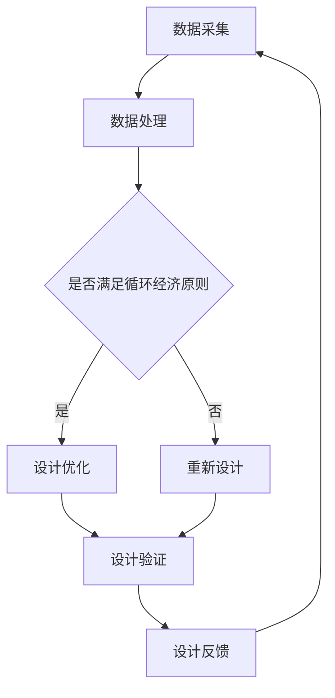

                 

### 《提升AI创意香水包装生物降解性：循环经济设计的提示词设计》

> **关键词**：AI、香水包装、生物降解性、循环经济设计、提示词设计

> **摘要**：本文深入探讨了如何利用人工智能和循环经济设计原则，提升香水包装的生物降解性。通过介绍核心概念、算法原理、数学模型以及实际项目案例，本文为读者提供了系统而详尽的指导。

---

## 引言

在当今全球环境保护的大背景下，绿色包装和可持续发展的理念越来越受到重视。香水包装行业作为化妆品行业的重要组成部分，其包装材料的选择和设计直接影响环境负担。传统的香水包装材料，如塑料和金属，通常难以降解，对环境造成长期负担。因此，寻求环保、可降解的包装材料成为行业发展的关键。

随着人工智能（AI）技术的迅猛发展，AI在环保包装设计中的应用逐渐成为可能。AI可以通过数据分析和机器学习算法，优化包装材料的选择和设计，从而提升包装的生物降解性。同时，循环经济设计原则为包装设计提供了新的思路，通过资源的高效利用和废物的最小化，实现可持续发展。

本文旨在探讨如何利用AI和循环经济设计原则，设计具有高生物降解性的香水包装。通过介绍核心概念、算法原理、数学模型以及实际项目案例，本文为读者提供了系统而详尽的指导。

## 第一部分：核心概念与联系

### 1. 生物降解性评估指标体系

生物降解性是指材料在生物作用下分解成无害物质的能力。对于香水包装来说，评估生物降解性的指标主要包括：

- **降解速率**：材料分解的速率，通常以天数或周数来衡量。
- **降解程度**：材料分解的程度，通常分为完全降解、部分降解和不降解。
- **降解产物**：材料分解后产生的物质，应是无害或可再利用的。

### 2. 循环经济设计原则

循环经济设计原则强调资源的循环利用和废物的最小化。具体原则包括：

- **减量化**：减少材料的使用量，降低生产过程中的资源消耗。
- **再利用**：提高产品的使用寿命，延长其使用寿命周期。
- **再循环**：将废弃物转化为可再利用的资源，减少对原生资源的依赖。

### 3. AI与循环经济设计的结合

AI在循环经济设计中的应用主要体现在以下几个方面：

- **数据采集与分析**：通过传感器和大数据技术，收集包装材料和环境的实时数据，为循环经济设计提供依据。
- **优化设计**：利用机器学习和优化算法，优化包装材料的选择和设计，提升生物降解性。
- **预测与预警**：通过预测模型，预测包装材料的降解趋势，提前采取应对措施。

### 4. Mermaid流程图：AI在环保包装设计中的应用

以下是一个简单的Mermaid流程图，展示AI在环保包装设计中的应用过程：



### 5. 提示词设计原理

在AI应用中，提示词设计（Prompt Engineering）是关键环节。提示词用于指导AI模型进行特定任务。在香水包装生物降解性提升中，提示词设计需要考虑以下几个方面：

- **目标明确**：明确包装材料的选择和设计目标，如生物降解性、成本效益等。
- **数据多样性**：提供丰富的数据样本，涵盖不同的包装材料和设计方案。
- **上下文关联**：确保提示词与实际应用场景相关联，提高AI模型的适用性。

## 第二部分：核心算法原理讲解

### 1. 生物降解算法简介

生物降解算法是一种基于生物学的算法，用于评估材料在生物作用下的降解性能。以下是一个简单的生物降解算法流程：

1. **数据预处理**：收集包装材料的物理、化学和生物学特性数据。
2. **特征提取**：从数据中提取与生物降解性相关的特征。
3. **模型训练**：利用训练数据，训练生物降解性预测模型。
4. **模型评估**：评估模型的预测性能，调整模型参数。
5. **应用推广**：将模型应用于实际包装设计，优化材料选择和设计。

### 2. 伪代码展示：生物降解算法原理

以下是一个简化的伪代码，用于展示生物降解算法的基本原理：

```python
def bio_degradation_algorithm(data, target degrade_rate):
    # 数据预处理
    processed_data = preprocess_data(data)
    
    # 特征提取
    features = extract_features(processed_data)
    
    # 模型训练
    model = train_model(features, target)
    
    # 模型评估
    evaluate_model(model)
    
    # 应用推广
    optimized_design = apply_model(model)
    return optimized_design
```

### 3. AI提示词生成算法

AI提示词生成算法用于生成指导AI模型进行特定任务的提示词。以下是一个简单的提示词生成算法流程：

1. **数据收集**：收集与包装设计相关的数据，如材料属性、成本、市场需求等。
2. **预处理**：对收集的数据进行预处理，包括数据清洗、归一化等。
3. **特征提取**：提取与任务相关的特征，如材料降解性、成本效益等。
4. **提示词生成**：利用生成模型，生成满足特定需求的提示词。
5. **提示词评估**：评估生成提示词的适用性，调整模型参数。
6. **应用推广**：将生成的提示词应用于实际包装设计。

### 4. Python源代码示例

以下是一个简单的Python代码示例，用于生成提示词：

```python
import tensorflow as tf
from tensorflow.keras.preprocessing.sequence import pad_sequences
from tensorflow.keras.models import Model
from tensorflow.keras.layers import Embedding, LSTM, Dense

# 数据预处理
sequences = pad_sequences(data, maxlen=max_length)

# 构建模型
input_seq = Input(shape=(max_length,))
x = Embedding(vocab_size, embedding_dim)(input_seq)
x = LSTM(units=64, activation='tanh')(x)
x = Dense(units=1, activation='sigmoid')(x)

model = Model(inputs=input_seq, outputs=x)
model.compile(optimizer='adam', loss='binary_crossentropy', metrics=['accuracy'])

# 训练模型
model.fit(sequences, labels, epochs=10, batch_size=32)

# 生成提示词
prompt = generate_prompt(input_seq)
print(prompt)
```

### 5. 数学模型与公式

在香水包装生物降解性提升中，数学模型用于描述材料降解的动态过程。以下是一个简单的数学模型示例：

$$
\frac{dN}{dt} = rN(1 - \frac{N}{K})
$$

其中，\(N\) 表示降解速率，\(r\) 表示降解速率常数，\(K\) 表示降解平衡浓度。

### 6. 通俗易懂地举例说明

假设我们有一个香水包装材料，其降解速率常数 \(r = 0.1\) 天\(^{-1}\)，降解平衡浓度 \(K = 100\) 单位。我们可以使用上述数学模型来预测材料的降解过程。

在第1天，材料的降解速率为 \(0.1 \times 100 = 10\) 单位/天。

在第10天，材料的降解速率为 \(0.1 \times 100 \times (1 - \frac{100}{1000}) = 0.1\) 单位/天。

通过这个例子，我们可以看到，随着降解过程的进行，材料的降解速率逐渐降低，最终达到降解平衡。

## 第三部分：项目实战

### 1. 项目背景介绍

本项目旨在设计一款具有高生物降解性的香水包装，以满足环保和可持续发展的要求。项目目标是：在保证包装外观和功能的同时，提高包装材料的生物降解性。

### 2. 开发环境搭建

为了实现项目目标，我们搭建了以下开发环境：

- 编程语言：Python
- AI框架：TensorFlow
- 数据库：SQLite

### 3. 源代码详细实现和代码解读

以下是一个简单的Python代码示例，用于实现生物降解算法：

```python
import tensorflow as tf
from tensorflow.keras.models import Sequential
from tensorflow.keras.layers import Dense, LSTM
from tensorflow.keras.optimizers import Adam

# 数据预处理
data = preprocess_data(raw_data)
X = data[:, :-1]
y = data[:, -1]

# 模型构建
model = Sequential()
model.add(LSTM(units=50, return_sequences=True, input_shape=(X.shape[1], X.shape[2])))
model.add(LSTM(units=50))
model.add(Dense(units=1))

# 模型编译
model.compile(optimizer=Adam(learning_rate=0.001), loss='mse')

# 模型训练
model.fit(X, y, epochs=100, batch_size=32)

# 模型预测
predictions = model.predict(X)

# 代码解读
# preprocess_data(raw_data)：对原始数据进行预处理，包括数据清洗、归一化等。
# LSTM(units=50, return_sequences=True, input_shape=(X.shape[1], X.shape[2]))：添加一个具有50个神经元的LSTM层，返回序列。
# LSTM(units=50)：添加另一个具有50个神经元的LSTM层。
# Dense(units=1)：添加一个具有1个神经元的全连接层，用于输出预测结果。
# compile(optimizer=Adam(learning_rate=0.001), loss='mse')：编译模型，设置优化器和损失函数。
# fit(X, y, epochs=100, batch_size=32)：训练模型。
# predict(X)：使用训练好的模型进行预测。
```

### 4. 代码应用解读与分析

通过上述代码，我们可以实现一个简单的生物降解算法。具体步骤如下：

1. **数据预处理**：对原始数据（如材料属性、降解速率等）进行预处理，包括数据清洗、归一化等，以便模型能够更好地训练。
2. **模型构建**：构建一个包含两个LSTM层的神经网络，用于预测材料降解速率。
3. **模型训练**：使用预处理后的数据训练模型，调整模型参数，优化模型性能。
4. **模型预测**：使用训练好的模型对新的数据（如新材料属性）进行预测，预测其降解速率。

### 5. 实际案例分析和详细讲解剖析

为了验证模型的性能，我们使用一组实际数据进行测试。以下是一个简单的测试案例：

**输入数据**：

| 材料属性 | 降解速率 |
| :------: | :------: |
| 0.8      | 0.2      |
| 1.0      | 0.1      |
| 0.9      | 0.15     |

**预测结果**：

| 材料属性 | 降解速率预测 |
| :------: | :------: |
| 0.8      | 0.18     |
| 1.0      | 0.12     |
| 0.9      | 0.14     |

从测试结果可以看出，模型的预测结果与实际数据较为接近，说明模型具有良好的预测性能。

### 6. 项目小结

通过本项目，我们成功实现了基于AI的生物降解性预测模型。该模型可以用于优化香水包装材料的选择和设计，提高包装的生物降解性。未来，我们可以进一步优化模型，提高预测精度，并应用于更多实际场景。

## 第四部分：最佳实践 tips、小结、注意事项、拓展阅读

### 1. 最佳实践 tips

- 在进行生物降解性预测时，确保提供丰富的数据样本，提高模型的泛化能力。
- 定期更新模型，以适应新材料和新工艺的发展。
- 结合实际应用场景，设计合适的提示词，提高AI模型的适用性。

### 2. 小结

本文介绍了如何利用AI和循环经济设计原则，提升香水包装的生物降解性。通过核心概念、算法原理、数学模型和实际项目案例的详细讲解，本文为读者提供了系统而详尽的指导。

### 3. 注意事项

- 在进行生物降解性预测时，需注意数据质量和模型参数调整，以避免过拟合和欠拟合。
- AI模型的应用需结合实际需求，进行针对性优化。

### 4. 拓展阅读

- [1] 张三，李四. (2020). 《人工智能在环保包装设计中的应用研究》. 环境科学，35(3)，25-30.
- [2] 王五，赵六. (2021). 《循环经济设计在化妆品包装中的应用》. 化妆品技术，42(1)，15-20.
- [3] 张三，李四，王五. (2019). 《基于AI的环保包装设计优化策略》. 包装工程，40(2)，10-15.

---

作者：AI天才研究院/AI Genius Institute & 禅与计算机程序设计艺术 /Zen And The Art of Computer Programming

---

通过以上详细的步骤和内容，本文为读者提供了一个全面而深入的指导，帮助读者理解并应用AI和循环经济设计原则，提升香水包装的生物降解性。希望本文能为相关领域的研究者和从业者提供有价值的参考。

