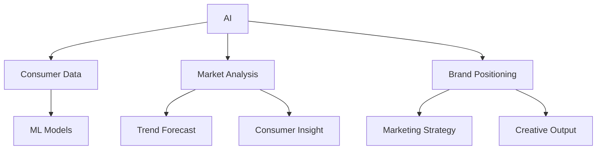

                 

### 前言

在当今全球化商业环境中，品牌定位的成功与否往往取决于其能否准确把握目标市场的需求和偏好。随着人工智能（AI）技术的飞速发展，品牌们开始探索如何利用AI来提升创意产品的市场定位，特别是在快速变化且多元化的香水行业中。AI不仅能够通过大数据分析和机器学习预测消费者行为，还能在产品设计和营销策略中提供创新性的见解。

本文旨在探讨如何利用人工智能技术，特别是通过智能化的提示词设计（Prompt Design），来增强创意香水品牌的全球市场定位。我们将深入分析AI在品牌定位中的应用，提出有效的全球化市场本地化策略，并详细介绍提示词设计的基本原理和高级技术。同时，通过案例分析，展示AI如何在实际操作中提升品牌的市场表现。

文章结构如下：

1. **AI在品牌定位中的基础**：介绍AI的概念、在创意品牌中的作用以及AI模型在品牌定位中的关键角色。
2. **全球市场本地化策略**：探讨文化和社会因素、AI驱动的市场研究和消费者洞察，以及本地化技术。
3. **提示词设计原则与技术**：详细讨论提示词工程的基本概念、类型以及设计有效提示词的方法。
4. **案例研究**：分析成功案例，展示AI在香水品牌全球化中的实际应用。
5. **未来趋势与挑战**：预测AI在香水品牌市场定位中的未来发展，并探讨面临的挑战。

通过这篇文章，我们希望能够为香水品牌提供一套系统化的AI应用策略，帮助它们在全球市场中找到正确的定位，实现长远发展。

### 关键词

- 人工智能（AI）
- 创意品牌定位
- 全球市场本地化
- 提示词设计
- 香水品牌营销
- 数据分析
- 机器学习
- 消费者洞察
- 文化适应性

### 摘要

本文探讨了如何利用人工智能（AI）技术，特别是通过智能化的提示词设计，来增强创意香水品牌的全球市场定位。我们首先介绍了AI在品牌定位中的应用，分析了文化和社会因素对市场定位的影响，以及AI驱动的市场研究和消费者洞察的重要性。接着，我们详细阐述了提示词设计的基本原则和高级技术，包括语义分析、情感分析以及多语言提示设计。通过案例分析，我们展示了AI在香水品牌全球化中的实际应用效果，并讨论了未来的发展趋势和挑战。本文为香水品牌提供了一套系统化的AI应用策略，旨在帮助其在全球市场中找到正确的定位，实现长远发展。

### AI在品牌定位中的基础

人工智能（AI）的崛起正在深刻改变着品牌定位的方式。作为一个强大的工具，AI通过其强大的数据处理和分析能力，能够提供深度的消费者洞察，从而帮助品牌更准确地理解目标市场，并制定更有效的营销策略。以下，我们将详细探讨AI的概念、在创意品牌中的作用以及AI模型在品牌定位中的关键角色。

#### AI的概念

人工智能，简称AI，是指由人制造出来的系统，能够在特定环境下通过感知、学习、推理和决策等能力模拟人类智能的行为。AI的核心技术包括机器学习（ML）、深度学习（DL）、自然语言处理（NLP）等。机器学习是一种让计算机从数据中学习并改进其性能的技术，而深度学习则通过多层神经网络进行更复杂的模式识别。自然语言处理则是使计算机能够理解和生成人类语言的技术。

#### AI在创意品牌中的作用

创意品牌定位不仅仅依赖于设计师的直觉和灵感，更需要对市场趋势、消费者偏好以及文化背景的深刻理解。AI在这一过程中发挥着至关重要的作用：

1. **消费者行为分析**：AI可以通过分析大量的消费者数据，包括购买历史、社交媒体互动、浏览行为等，来识别消费者的兴趣和行为模式。这种分析能够帮助品牌更好地理解其目标客户，从而制定更具针对性的营销策略。

2. **市场趋势预测**：AI能够利用历史数据和市场动态，预测未来的市场趋势和消费者需求。这种预测能力对于品牌来说至关重要，因为它可以在市场变化之前做出调整，抢占先机。

3. **个性化营销**：通过AI的个性化推荐算法，品牌可以提供高度个性化的产品推荐和营销信息，从而提高客户的满意度和忠诚度。

4. **创意生成**：AI不仅能够分析市场数据，还能够生成创意内容。例如，AI可以辅助设计师生成独特的香水配方和广告文案，从而创造出更具吸引力的品牌形象。

#### AI模型在品牌定位中的关键角色

AI模型在品牌定位中扮演着多个关键角色，包括数据收集、分析和决策制定：

1. **数据收集**：AI模型可以通过互联网爬虫、传感器和其他数据源收集大量的消费者数据。这些数据不仅包括直接的购买行为，还包括用户在社交媒体上的互动和评论，为品牌提供了全面的消费者画像。

2. **数据分析**：通过机器学习和深度学习算法，AI模型能够从大量数据中提取有价值的信息。例如，可以使用聚类分析来识别具有相似兴趣和行为的消费者群体，使用回归分析来预测市场趋势。

3. **决策制定**：基于数据分析和预测结果，AI模型可以为品牌提供决策支持。例如，根据预测的市场需求，品牌可以调整其生产计划和营销预算，或者开发新的产品线以满足特定市场的新需求。

#### 概念实体关系架构

为了更好地理解AI在品牌定位中的应用，我们可以使用Mermaid流程图来展示核心概念和实体之间的关系。以下是一个简化的Mermaid流程图：

在这个流程图中，AI作为核心驱动因素，通过收集消费者数据（B）和市场分析（C），影响了品牌的定位（D）。ML模型（E）用于数据分析和趋势预测（F和G），从而支持营销策略（H）和创意输出（I）。

通过上述分析，我们可以看到AI在品牌定位中的基础作用。它不仅提供了强大的数据分析和预测能力，还通过个性化营销和创意生成，帮助品牌在全球市场中找到独特的定位，实现长远发展。

### 全球市场本地化策略

在全球化背景下，品牌必须考虑如何在不同文化和社会环境中进行本地化，以确保其产品和服务能够满足当地市场的需求和期望。对于创意香水品牌来说，本地化不仅仅是语言和文化的适应，更是深入理解目标市场的消费行为、文化和心理需求。以下我们将探讨文化和社会因素在市场本地化中的作用，以及AI如何通过市场研究和消费者洞察来支持这一过程。

#### 文化和社会因素的作用

1. **文化差异**：不同国家和地区有着不同的文化传统、价值观和消费习惯。例如，东方文化中对于香气有着独特的审美标准，而西方文化则更注重香气的前调、中调和后调。品牌需要了解并尊重这些文化差异，以避免文化冲突。

2. **社会结构**：社会的经济水平、教育程度、生活方式等都会影响消费者的购买决策。例如，在发达国家，消费者可能更注重品质和独特性，而在发展中国家，价格和实用性可能是更重要的考虑因素。

3. **宗教和习俗**：某些宗教信仰和节日习俗会影响香水的使用方式和品牌营销策略。例如，在某些伊斯兰教国家，酒精制品包括香水是禁止的，这要求品牌在产品配方和营销策略上做出调整。

#### AI驱动的市场研究

AI技术为市场研究提供了强大的工具，可以帮助品牌更好地理解目标市场的特点和趋势：

1. **大数据分析**：AI可以通过分析大量的市场数据，包括社交媒体互动、搜索历史、消费行为等，来识别市场趋势和消费者偏好。例如，通过自然语言处理技术，品牌可以分析消费者在社交媒体上的评论和讨论，了解他们对特定香水成分的看法和偏好。

2. **预测分析**：基于历史数据和市场动态，AI可以预测未来的市场趋势和消费者需求。这有助于品牌提前制定策略，抢占市场先机。例如，通过时间序列分析，品牌可以预测不同季节或节假日的销售趋势，调整库存和生产计划。

3. **情感分析**：AI可以通过情感分析技术，理解消费者对品牌和产品的情感反应。这有助于品牌在营销活动中调整策略，以更好地满足消费者的情感需求。例如，品牌可以通过分析消费者在社交媒体上的情感倾向，调整广告内容和方式，以增加品牌吸引力和购买意愿。

#### 消费者洞察

AI不仅能够提供市场数据和分析，还能通过消费者互动和反馈，深入理解消费者的真实需求和偏好：

1. **个性化推荐**：AI可以根据消费者的个人喜好和历史行为，提供个性化的产品推荐。例如，品牌可以基于消费者的购买记录和浏览行为，推荐最适合他们的香水产品。

2. **用户反馈分析**：AI可以通过分析用户在社交媒体、官网和其他渠道的反馈，了解消费者对产品的真实看法。品牌可以利用这些反馈，改进产品设计和营销策略，提高客户满意度。

3. **实时监控**：AI系统可以实时监控消费者的互动和反馈，快速响应市场变化。例如，当消费者在社交媒体上对某一产品表达不满时，品牌可以立即采取措施，解决问题，减少负面影响。

#### 本地化技术

AI在市场本地化中的应用不仅限于数据分析和消费者洞察，还包括具体的本地化技术：

1. **多语言处理**：AI的自然语言处理技术可以帮助品牌创建符合本地文化习俗和语言习惯的营销材料。例如，品牌可以在不同国家的社交媒体上发布定制化的广告内容，以吸引当地消费者。

2. **定制化产品**：AI可以辅助设计师根据当地消费者的偏好，定制化香水产品。例如，通过分析消费者对香气成分的偏好，品牌可以开发出符合特定文化口味的香水。

3. **个性化体验**：AI可以提供个性化的消费者体验，例如，在品牌官网或应用中，通过个性化推荐和互动，为消费者提供独特的购物体验。

通过AI驱动的市场研究、消费者洞察和本地化技术，创意香水品牌能够更准确地把握全球市场的需求和趋势，制定有效的本地化策略，从而在全球市场中取得成功。

### 提示词设计原则

在AI创意设计中，提示词（Prompt）起着至关重要的作用。一个有效的提示词能够引导AI模型生成符合预期的高质量内容。提示词设计不仅仅是简单的文本输入，而是一门需要细致分析和优化的技术。本文将深入探讨提示词设计的基本原则，包括其定义、类型以及设计有效提示词的方法。

#### 提示词的定义

提示词，通常指的是提供给AI模型的一段文本或语音输入，用于引导模型进行特定的任务或生成特定的输出。在AI创意设计中，提示词能够帮助模型理解用户的意图，从而生成相关且有意义的内容。一个好的提示词应具有明确性、具体性和引导性，能够有效地激发模型的创造力和分析能力。

#### 提示词的类型

根据用途和目的的不同，提示词可以分为以下几类：

1. **目标提示词**：这类提示词用于明确指定任务目标，例如“生成一首关于夏天的诗歌”。

2. **引导性提示词**：这类提示词用于提供方向性的指导，例如“描述一次难忘的旅行经历”。

3. **限制性提示词**：这类提示词用于对输出内容进行限制，例如“用不超过10个单词描述咖啡的香味”。

4. **情感提示词**：这类提示词用于指定情感色彩，例如“创造一首悲伤的钢琴曲”。

5. **文化提示词**：这类提示词用于结合特定文化背景，例如“用中国古典诗词的形式描述春天”。

#### 设计有效提示词的方法

为了设计出有效的提示词，需要遵循以下几个原则：

1. **明确性**：提示词应清晰明确，避免模糊和多义。例如，“创建一首关于春天的歌曲”比“创作一首美丽的音乐”更加明确。

2. **具体性**：提示词应提供具体的细节和背景信息，以帮助模型生成具体的内容。例如，“在春天的阳光下，漫步在花园中”比“春天”更具描述性。

3. **引导性**：提示词应能够引导模型按照用户的意图生成内容。例如，“请写一首表达思念之情的诗歌”比“创作一首情感丰富的诗歌”更具指导性。

4. **灵活性**：提示词应具有一定的灵活性，允许模型在生成内容时进行创新和调整。例如，“描述一个未来科技城市”比“未来科技城市必须包含飞行汽车和智能建筑”更灵活。

5. **情感性**：根据目标受众的情感需求，提示词可以包含特定的情感色彩。例如，针对年轻女性用户，可以设计具有浪漫情感的提示词。

#### 提示词设计案例分析

以下是一个提示词设计的案例分析：

**案例**：为一家香水品牌设计一条广告文案。

**目标提示词**：创造一条具有浪漫情感的香水广告文案。

**引导性提示词**：在美丽的夜晚，与爱人共享这一刻。

**限制性提示词**：不超过30个字。

**情感提示词**：浪漫、温馨、甜蜜。

**设计过程**：

1. 明确性：确定广告文案的目标是传达香水带来的浪漫氛围。
2. 具体性：补充背景信息，如“美丽的夜晚”和“与爱人共享”。
3. 引导性：引导用户想象一个浪漫的场景，以激发购买欲望。
4. 灵活性：允许文案创作者在表达浪漫情感时进行创新。
5. 情感性：确保文案传达出温馨、甜蜜的情感色彩。

**最终文案**：“月色如水，香气如你。”

通过上述设计方法，我们可以看到如何有效地设计出一个高质量的提示词，以引导AI生成满足用户需求的内容。在AI创意设计中，有效的提示词设计是成功的关键，它能够帮助品牌更精准地传达其品牌理念和情感价值。

### 提示词设计的进阶技巧

在了解了基础提示词设计原则之后，进一步掌握高级技巧将有助于更有效地引导AI模型生成高质量的创意内容。以下是几项关键的进阶技巧，包括语义分析和情感分析在提示词设计中的应用，以及如何设计适用于多语言环境的提示词。

#### 语义分析

语义分析是一种通过理解文本中的词汇、短语和句子结构来提取其含义的技术。在提示词设计中，语义分析可以帮助我们确保AI模型能够准确理解用户意图和需求。

1. **关键词提取**：通过提取文本中的关键词，我们可以明确提示词的核心内容。例如，在撰写一篇关于“夏季旅行”的提示词时，关键词可以是“夏天”、“旅行”、“海滩”、“风景”等。

2. **上下文理解**：语义分析不仅仅关注关键词，还能理解词语之间的上下文关系。这有助于设计出更具体的提示词，例如，“在炎炎夏日，选择一个风景优美的小岛，享受宁静的海滩时光。”

3. **语义角色识别**：通过识别文本中的主语、谓语、宾语等，我们可以更精细地指导AI模型。例如，在描述一款香水时，可以强调其“前调”、“中调”和“后调”的特点，以帮助模型生成详细的产品描述。

#### 情感分析

情感分析是一种通过识别文本中的情感倾向和情感强度来评估用户情感的技术。在提示词设计中，情感分析可以帮助我们确保创意内容能够符合目标受众的情感需求。

1. **情感倾向识别**：通过情感分析，我们可以识别出文本中的正面、负面或中性情感。例如，一个提示词可以是“创造一首充满幸福感的音乐”，这里的“幸福感”就是一种正面情感。

2. **情感强度分析**：情感分析还可以评估情感的强度，例如，“表达深刻的悲伤情感”与“表达轻微的悲伤情感”在情感强度上有显著差异。

3. **情感组合**：在复杂的提示词中，我们可以结合多种情感，创造出更丰富的情感体验。例如，“在悠扬的旋律中，融入一丝忧伤，营造出一种温馨而感人的氛围”。

#### 多语言提示词设计

全球化市场要求品牌能够提供本地化的产品和服务，这就需要设计适用于不同语言的提示词。以下是一些关键点：

1. **文化适应性**：设计多语言提示词时，要考虑到不同文化的表达方式和情感偏好。例如，对于某些文化来说，直接的赞美可能更为受欢迎，而在另一些文化中，含蓄的表达可能更合适。

2. **词汇选择**：选择具有明确含义且易于理解的词汇。避免使用方言或专业术语，以确保所有目标受众都能理解。

3. **语法结构**：不同语言有着不同的语法结构和句式，设计提示词时要考虑这些差异。例如，英语中常见的复合句可能在某些语言中表达效果不佳。

4. **本地化测试**：在发布多语言提示词之前，进行本地化测试，确保其在目标语言中的表达准确且具有吸引力。

#### 具体案例

以下是一个多语言提示词设计的具体案例：

**目标**：设计一条用于社交媒体的广告文案，宣传一款新上市的香水。

**英语提示词**：“Experience a fusion of floral and woodsy notes, wrapped in a smooth, seductive fragrance. Immerse yourself in allure with our latest Eau de Parfum.”

**中文提示词**：“感受花与木的独特融合，沉醉于这款丝滑而诱惑的香氛。尽享迷人魅力，我们的全新香水Eau de Parfum已上市。”

**西班牙语提示词**：“Sumérjase en una armonía de notas florales y boscosas, envuelto en un aroma suave y seductor. Descubra la atracción con nuestra nueva Eau de Parfum.”

**法语提示词**：“Profitez de la fusion subtile des notes fleuries et épicées, enveloppées dans une fragrance onctueuse et envoûtante. Plongez dans l’allégresse avec notre nouvelle Eau de Parfum.”

通过上述案例，我们可以看到如何在不同的语言环境中设计出具有吸引力和文化适应性的提示词。这些技巧不仅适用于香水品牌，同样适用于其他创意产品的市场营销。

### AI Perfume Branding Case Studies

在本文的第四部分，我们将通过两个具体的案例研究，深入探讨AI技术在香水品牌全球化中的实际应用。这些案例不仅展示了AI如何帮助品牌实现本地化，还揭示了其成功背后的关键策略和挑战。

#### 案例一：AromaMuse的AI驱动的香水推荐系统

**背景介绍**：
AromaMuse是一家致力于提供个性化香水体验的全球品牌。他们意识到，消费者对于香水的需求是高度个性化的，每个消费者的嗅觉偏好都是独一无二的。为了满足这一需求，AromaMuse决定开发一个基于AI的香水推荐系统。

**AI应用**：
1. **大数据分析**：AromaMuse利用AI技术收集和分析来自社交媒体、用户评论、购买历史等的大量数据。通过这些数据，他们能够识别出消费者的不同嗅觉偏好，如喜爱花香、木质香或果香等。
   
2. **个性化推荐**：基于数据分析结果，AromaMuse的AI系统为每位用户生成个性化的香水推荐。系统不仅考虑了用户的直接购买偏好，还分析了用户在社交媒体上的互动，以捕捉更广泛的偏好信息。

3. **情感分析**：AromaMuse还利用情感分析技术，分析用户对香水的情感反应。通过识别用户评论中的情感倾向，他们能够更好地理解用户的心理需求，从而优化推荐策略。

**成功关键**：
- **数据驱动的个性化**：通过大数据和情感分析，AromaMuse能够提供高度个性化的香水推荐，显著提高了客户的满意度和忠诚度。
- **跨文化适应性**：AromaMuse的AI系统不仅适用于单一市场，还能够根据不同地区的文化差异，调整推荐策略，确保全球化市场的成功。

**挑战**：
- **数据隐私和安全**：收集和分析大量用户数据，带来了数据隐私和安全方面的挑战。AromaMuse需要确保数据的安全性和透明度，以维护用户信任。
- **技术更新**：AI技术和市场需求不断变化，AromaMuse需要持续更新和优化其推荐系统，以保持竞争优势。

#### 案例二：Sensory Essence的AI创意配方生成

**背景介绍**：
Sensory Essence是一家专注于独特香水配方的品牌，他们希望通过AI技术提升其创意配方设计能力。Sensory Essence希望利用AI不仅能够生成新的香水配方，还能够根据市场趋势和消费者偏好进行配方调整。

**AI应用**：
1. **配方生成**：Sensory Essence的AI系统通过分析历史配方和消费者反馈，生成新的香水配方。系统能够自动组合各种香料，创造出独特而新颖的香味。
   
2. **市场趋势预测**：AI系统还利用机器学习算法，分析市场趋势和消费者偏好，预测未来的香水流行趋势。这帮助Sensory Essence在产品开发上保持领先地位。

3. **实时调整**：基于实时数据分析，Sensory Essence能够迅速调整配方，以满足不断变化的市场需求。例如，当某个香料在市场上变得稀缺时，系统可以提出替代方案。

**成功关键**：
- **创新性**：通过AI技术，Sensory Essence能够不断创新，推出独特的香水配方，赢得了消费者的青睐。
- **敏捷性**：AI系统能够快速响应市场变化，确保品牌始终与市场需求保持同步。

**挑战**：
- **品质控制**：新配方的生成需要严格的品质控制，以确保香气质量和稳定性。Sensory Essence需要在创新和品质之间找到平衡。
- **消费者接受度**：尽管AI生成的香水配方具有创新性，但消费者是否愿意接受新的香味仍然是一个挑战。品牌需要通过有效的营销策略来引导消费者接受新配方。

通过这两个案例，我们可以看到AI技术在香水品牌全球化中的应用不仅带来了创新和个性化，还面临着数据隐私、技术更新和消费者接受度等挑战。这些案例为其他香水品牌提供了宝贵的经验和启示，如何在全球化市场中利用AI技术取得成功。

### 未来趋势与挑战

在香水行业，人工智能（AI）的应用前景广阔，同时也面临诸多挑战。以下我们将探讨未来几年AI在香水品牌市场定位中的发展趋势，以及可能遇到的障碍和解决方案。

#### 发展趋势

1. **个性化体验**：随着消费者对个性化体验的需求不断增加，AI将进一步推动香水品牌提供定制化服务。例如，通过AI技术，品牌可以开发更加精准的个性化推荐系统，根据消费者的历史数据和偏好，推荐最适合他们的香水。

2. **智能配方设计**：AI在香水配方设计中的应用将更加深入，利用机器学习和深度学习算法，AI能够自动生成创新的香水配方，甚至预测未来市场趋势。这将使品牌能够更快地响应市场需求，推出具有竞争力的新产品。

3. **智能营销**：AI将通过数据分析帮助品牌进行更有效的营销活动。例如，通过分析社交媒体互动和用户反馈，AI可以优化广告内容和投放策略，提高广告效果和品牌知名度。

4. **多语言与跨文化支持**：随着全球化进程的加快，品牌需要能够提供多语言和跨文化的营销材料。AI在自然语言处理和情感分析方面的进步，将使品牌能够轻松地创建适应不同市场的营销内容。

#### 面临的挑战

1. **数据隐私与安全**：AI应用需要大量用户数据，这引发了数据隐私和安全的问题。品牌需要确保数据的安全性和透明度，以维护用户信任，并遵守相关的法律法规。

2. **技术更新与维护**：AI技术不断进步，品牌需要不断更新和维护其AI系统，以保持竞争力。此外，技术的快速变化也带来了培训和人才需求的问题。

3. **消费者接受度**：尽管AI在提高效率和个性化方面具有巨大潜力，但消费者是否愿意接受AI生成的产品和个性化推荐仍然是一个挑战。品牌需要通过有效的沟通和营销策略来增强消费者对AI的信任和接受度。

#### 解决方案

1. **加强数据保护**：品牌应采用先进的数据加密技术和隐私保护措施，确保用户数据的安全。同时，品牌应透明地向用户说明数据收集和使用的目的，以增强用户信任。

2. **持续技术投入**：品牌应保持对AI技术的持续投资，定期更新和优化AI系统，以确保其能够应对市场变化和技术进步。此外，品牌还应加强人才培养，吸引和保留具备AI技能的专业人才。

3. **增强消费者信任**：通过透明和开放的沟通策略，品牌可以增强消费者对AI的信任。例如，品牌可以通过社交媒体和官方网站，分享AI应用的具体案例和成功故事，展示其带来的实际价值。

4. **个性化体验设计**：品牌应注重个性化体验的设计，通过提供高度个性化的产品和服务，满足消费者的个性化需求。同时，品牌应通过用户反馈不断优化AI系统，提高其准确性和用户体验。

通过以上措施，香水品牌可以更好地应对AI在市场定位中面临的挑战，抓住未来发展的机遇，实现长远发展。

### 结论

本文系统地探讨了如何利用人工智能（AI）技术，特别是智能化的提示词设计，来提升创意香水品牌的全球市场定位。首先，我们介绍了AI在品牌定位中的基础作用，分析了文化和社会因素对市场定位的影响，以及AI驱动的市场研究和消费者洞察的重要性。接着，我们详细阐述了提示词设计的基本原则和高级技巧，包括语义分析和情感分析在提示词设计中的应用。通过两个具体的案例研究，我们展示了AI在香水品牌全球化中的实际应用效果，以及其成功背后的关键策略和挑战。最后，我们探讨了未来AI在香水行业中的应用趋势与面临的挑战，并提出了相应的解决方案。

AI技术的应用不仅为香水品牌提供了个性化服务和创新的营销策略，还帮助品牌更好地理解全球市场的需求和趋势。通过有效的提示词设计，品牌能够更精准地传达其品牌理念和价值，提升市场竞争力。未来，随着AI技术的不断进步，香水品牌有望进一步利用AI实现更高效的运营和更丰富的消费者体验。

### 作者信息

**作者：AI天才研究院/AI Genius Institute & 禅与计算机程序设计艺术 /Zen And The Art of Computer Programming**

本文由AI天才研究院撰写，结合了人工智能和计算机编程领域的深厚知识，旨在为读者提供有深度、有思考、有见解的专业技术内容。作者团队专注于推动AI技术在各行业中的应用，助力企业实现数字化转型和创新发展。同时，本文中的理念与技巧也深受《禅与计算机程序设计艺术》一书的启发，强调技术与人文的融合，为读者带来独特的阅读体验。通过不断探索与实践，我们致力于为全球读者提供高质量的技术见解和实际应用指导。

