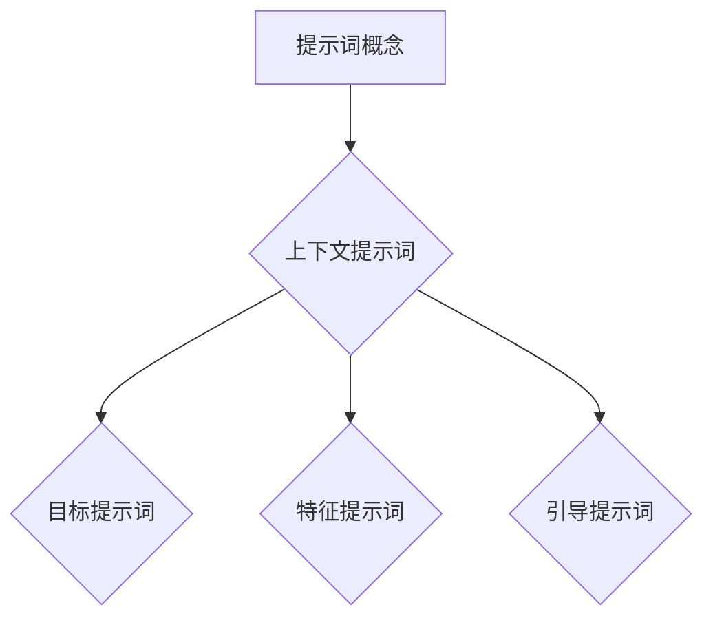
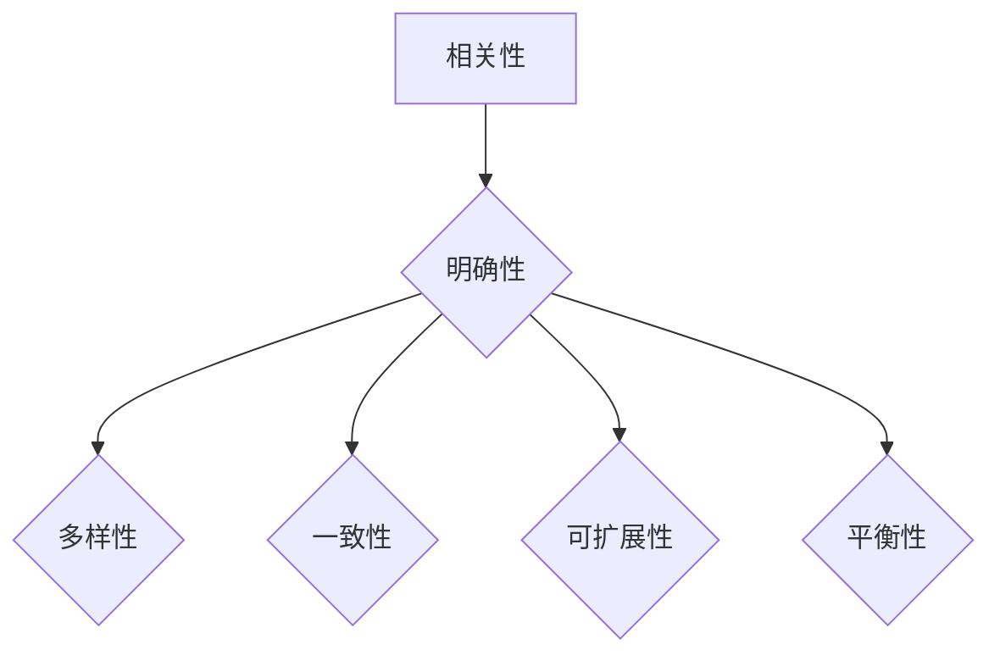
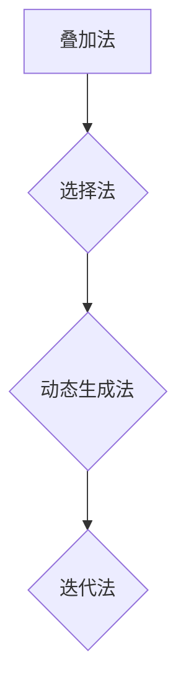

                 

### 引言

随着人工智能（AI）技术的迅猛发展，AI数据分析已成为众多领域的关键环节。从金融风控到医疗诊断，从智能家居到工业自动化，AI数据分析无处不在，并且发挥着越来越重要的作用。然而，随着数据量的爆炸式增长，如何从海量数据中提取有价值的信息，成为数据科学家面临的重大挑战。

提示词（Prompt Engineering）作为一种新兴的技术，在AI数据分析中展现出强大的潜力。它不仅能够指导算法更好地理解数据，还能优化模型的训练过程，提高预测准确性。本文旨在探讨提示词技术在数据科学中的应用，帮助读者深入了解如何利用提示词提升AI数据分析能力。

本文将首先介绍AI数据分析的背景和挑战，解释提示词的概念及其在AI数据分析中的重要性。随后，我们将详细阐述数据科学的基础知识，包括数据类型、特征工程、数据预处理和数据集划分等。接下来，我们将探讨提示词的设计原理，包括提示词的定义、分类、设计策略以及有效性评估。

文章的核心部分将讨论提示词在监督学习和无监督学习中的应用，涵盖分类、回归、聚类、降维、深度学习和强化学习等多个领域。每一部分都将结合Python源代码和数学模型，详细阐述提示词的应用方法和效果。最后，我们将展望提示词技术的未来发展，探讨其面临的挑战和机遇，并总结本文的主要内容和实际应用价值。

通过阅读本文，读者将能够掌握提示词设计的基本原理，了解其在不同学习模型中的应用，并为未来的AI数据分析实践提供有益的启示。

### AI数据分析的背景与挑战

人工智能（AI）数据分析作为AI技术的重要组成部分，正迅速成为各个领域的关键技术。随着互联网、物联网和大数据技术的普及，全球数据量呈现爆炸式增长。据国际数据公司（IDC）统计，全球数据量每年以约40%的速度增长，预计到2025年，全球数据总量将达到160 ZB。如此庞大的数据量不仅为AI数据分析提供了丰富的素材，也带来了前所未有的挑战。

首先，数据质量是AI数据分析的基础。高质量的数据可以提供准确的预测和决策支持，而数据质量问题如噪声、缺失、异常值等会严重影响模型的性能。因此，数据清洗和预处理成为数据科学的重要环节。然而，数据清洗是一个复杂且耗时的过程，需要投入大量的人力、物力和时间。

其次，数据量的大幅增加对计算资源和存储能力提出了更高的要求。传统的数据处理方法已无法满足现代AI数据分析的需求，分布式计算和大数据技术应运而生。例如，Hadoop和Spark等分布式计算框架可以处理海量数据，提高数据处理速度和效率。然而，这些技术也带来了新的挑战，如数据同步、容错性和数据安全性等。

此外，AI数据分析面临着算法选择和模型优化的难题。AI算法种类繁多，每种算法都有其适用的场景和局限性。如何选择合适的算法，并对其参数进行优化，以提高模型的预测准确性和泛化能力，是数据科学家需要解决的核心问题。

再者，AI数据分析需要跨学科的知识和技能。除了传统的计算机科学和数学知识外，数据科学家还需要具备统计学、机器学习、深度学习、数据可视化等多个领域的知识。这种跨学科的特性使得AI数据分析成为一个复杂且具有挑战性的领域。

最后，数据隐私和安全问题也是AI数据分析中不可忽视的挑战。随着数据量的增加，数据隐私泄露的风险也随之增大。如何保护用户数据隐私，防止数据滥用，是AI数据分析面临的重要课题。

总之，AI数据分析既充满了机遇，也面临着诸多挑战。通过引入提示词技术，可以有效提升数据科学家的分析能力，优化模型训练过程，提高预测准确性，从而更好地应对这些挑战。

### 提示词技术在AI数据分析中的应用

提示词（Prompt Engineering）作为一种优化AI模型训练的重要技术，在数据科学领域中的应用日益受到关注。提示词技术的核心在于通过精心设计的输入提示，引导模型更好地理解和学习数据，从而提升模型的性能和预测准确性。

首先，提示词技术能够提高模型的鲁棒性。在训练过程中，提示词可以提供额外的背景信息或上下文，帮助模型更好地识别数据的特征和模式。例如，在文本分类任务中，通过提示词可以明确指出文本的主题或情感倾向，使模型能够更加精准地分类。

其次，提示词技术有助于减少过拟合现象。过拟合是指模型在训练数据上表现良好，但在新的数据上表现不佳的现象。通过合理设计提示词，可以在训练过程中引入更多的泛化信息，使模型更加适应不同的数据分布，从而降低过拟合的风险。

再次，提示词技术能够加速模型的训练过程。在某些复杂任务中，如深度学习模型的训练，数据预处理和特征提取是耗时且计算密集的步骤。通过提示词技术，可以简化这些步骤，减少训练时间，提高工作效率。

在具体应用场景中，提示词技术展现了其独特的优势。例如，在图像识别任务中，通过提示词可以指定图像的特定区域或特征，使模型能够更加聚焦于关键信息，提高识别准确性。在自然语言处理任务中，提示词可以帮助模型更好地理解文本的语义和上下文，从而提升文本分类、情感分析等任务的性能。

此外，提示词技术还可以应用于强化学习。在强化学习任务中，提示词可以提供明确的策略指导，帮助智能体更快地学习到最优策略。例如，在机器人导航任务中，通过提示词可以指导机器人避开障碍物或找到目标路径，提高导航效率。

总之，提示词技术在AI数据分析中具有广泛的应用前景。通过合理设计和使用提示词，可以有效提升模型的训练效果和预测准确性，为数据科学研究和应用提供有力支持。

### 书籍结构概述

本文结构紧凑，旨在系统性地介绍提示词技术在数据科学中的应用。文章分为八个主要章节，涵盖从基础概念到实际应用的各个方面。

**第一章** 作为引言部分，介绍了AI数据分析的背景、挑战及提示词技术的应用前景，为后续内容奠定了基础。

**第二章** 介绍了数据科学的基础知识，包括数据类型、特征工程、数据预处理和数据集划分。这部分内容是理解提示词技术的前提，确保读者具备必要的数据处理技能。

**第三章** 深入探讨提示词的设计原理，包括提示词的定义、分类、设计策略和有效性评估。这一章节为设计高效提示词提供了理论依据。

**第四章** 和 **第五章** 分别介绍了提示词在监督学习和无监督学习中的应用。第四章重点关注分类和回归问题，第五章则涉及聚类和降维。通过具体算法和Python代码示例，读者可以直观地理解提示词的实际效果。

**第六章** 和 **第七章** 介绍了提示词在深度学习和强化学习中的应用。第六章从卷积神经网络和循环神经网络的角度出发，第七章则探讨了深度强化学习中的应用，展示了提示词技术的广泛应用。

**第八章** 展望提示词技术的未来发展趋势，探讨其面临的挑战和机遇。这一章节为读者提供了对提示词技术未来发展方向的思考。

最后，**附录** 部分提供了提示词技术相关的资源，包括推荐论文、开源工具和书籍，为读者进一步学习和实践提供了丰富的参考资料。

整体而言，本文旨在通过系统的结构和丰富的实例，帮助读者全面了解提示词技术在数据科学中的应用，提升AI数据分析能力。

## 第2章 数据科学基础知识

数据科学作为人工智能（AI）的核心支柱，其理论基础和操作方法至关重要。本章将系统介绍数据科学的基础知识，包括数据类型、特征工程、数据预处理和数据集划分，为后续章节关于提示词技术的讨论奠定坚实基础。

### 2.1 数据类型

在数据科学中，数据类型是理解和处理数据的基础。根据数据的特点和形式，数据类型可以分为以下几种：

1. **数值数据**：数值数据是最常见的数据类型，包括整数和浮点数。这类数据通常用于表示连续的物理量或计量值，如温度、收入、年龄等。

2. **类别数据**：类别数据是分类数据，用于表示离散的类别或属性，如性别（男/女）、颜色（红/绿/蓝）等。类别数据通常用标签或编号表示。

3. **文本数据**：文本数据由字符串组成，用于表示文本信息，如新闻文章、社交媒体评论等。文本数据在自然语言处理（NLP）任务中具有重要应用。

4. **图像数据**：图像数据由像素值组成，用于表示视觉信息。在计算机视觉任务中，图像数据是核心输入，如人脸识别、图像分类等。

5. **时间序列数据**：时间序列数据是一系列按时间顺序排列的数值或类别数据，如股票价格、气象数据等。时间序列分析在预测和趋势分析中具有重要应用。

### 2.2 特征工程

特征工程是数据科学中的一项关键任务，它涉及从原始数据中提取或构造特征，以便更好地表示数据并为模型提供有用的信息。以下是几种常见的特征工程方法：

1. **数据标准化**：数据标准化通过将数据缩放到相同的尺度，消除不同特征之间的量纲差异。常见的标准化方法包括最小-最大标准化和Z-Score标准化。

    ```python
    from sklearn.preprocessing import MinMaxScaler
    scaler = MinMaxScaler()
    X_scaled = scaler.fit_transform(X)
    ```

2. **数据归一化**：数据归一化通过将数据缩放到0到1之间，处理极端值问题。

    ```python
    from sklearn.preprocessing import Normalizer
    normalizer = Normalizer()
    X_normalized = normalizer.fit_transform(X)
    ```

3. **特征选择**：特征选择通过选择与目标变量高度相关的特征，降低模型的复杂度并提高预测性能。常见的方法包括基于信息的特征选择、基于模型的特征选择等。

    ```python
    from sklearn.feature_selection import SelectKBest
    selector = SelectKBest(k=5)
    X_new = selector.fit_transform(X, y)
    ```

4. **特征构造**：特征构造通过将原始数据组合成新的特征，增强数据的表达力。例如，创建多项式特征、交互特征等。

    ```python
    from sklearn.preprocessing import PolynomialFeatures
    poly = PolynomialFeatures(degree=2)
    X_poly = poly.fit_transform(X)
    ```

### 2.3 数据预处理

数据预处理是确保数据质量和模型性能的重要步骤。以下是一些常见的数据预处理方法：

1. **数据清洗**：数据清洗通过识别和修正数据中的错误、异常值和缺失值，提高数据质量。

    ```python
    import numpy as np
    import pandas as pd
    df = pd.read_csv('data.csv')
    df.dropna(inplace=True)  # 删除缺失值
    df.replace({'missing': np.nan}, inplace=True)  # 替换特定值
    ```

2. **数据转换**：数据转换通过将数据从一种格式转换为另一种格式，便于后续处理。

    ```python
    df['date'] = pd.to_datetime(df['date'])
    df.set_index('date', inplace=True)
    ```

3. **数据归一化**：数据归一化已在特征工程部分介绍。

4. **数据降维**：数据降维通过减少数据维度，提高计算效率和模型性能。常见的方法包括主成分分析（PCA）和t-Distributed Stochastic Neighbor Embedding（t-SNE）。

    ```python
    from sklearn.decomposition import PCA
    pca = PCA(n_components=2)
    X_reduced = pca.fit_transform(X)
    ```

### 2.4 数据集划分

在机器学习任务中，数据集的划分是确保模型泛化能力的重要环节。常见的数据集划分方法包括以下几种：

1. **训练集与测试集划分**：将数据集划分为训练集和测试集，通常使用80%-20%的比例或交叉验证方法。

    ```python
    from sklearn.model_selection import train_test_split
    X_train, X_test, y_train, y_test = train_test_split(X, y, test_size=0.2, random_state=42)
    ```

2. **交叉验证**：交叉验证通过多次划分训练集和验证集，评估模型的泛化能力。常见的方法包括K折交叉验证。

    ```python
    from sklearn.model_selection import cross_val_score
    scores = cross_val_score(model, X, y, cv=5)
    ```

3. **留出法**：留出法直接将数据划分为训练集和测试集，不进行随机抽样。

    ```python
    X_train = X[:int(len(X) * 0.8)]
    y_train = y[:int(len(y) * 0.8)]
    X_test = X[int(len(X) * 0.8):]
    y_test = y[int(len(y) * 0.8):]
    ```

通过理解这些基础知识，读者可以更好地掌握数据科学的核心概念和操作方法，为后续章节关于提示词技术的学习打下坚实基础。

### 2.5 数据类型与特征工程

#### 2.5.1 数据类型

在数据科学中，数据类型是理解和处理数据的基础。不同类型的数据在特征工程中有着不同的处理方式。以下是几种常见的数据类型及其处理方法：

1. **数值数据**：数值数据包括整数和浮点数，通常用于表示连续的物理量或计量值。这类数据可以通过以下方式进行处理：

   - **标准化**：通过将数据缩放到相同的尺度，消除不同特征之间的量纲差异。常用的标准化方法包括最小-最大标准化和Z-Score标准化。

     ```python
     from sklearn.preprocessing import MinMaxScaler
     scaler = MinMaxScaler()
     X_scaled = scaler.fit_transform(X)
     ```

   - **归一化**：通过将数据缩放到0到1之间，处理极端值问题。

     ```python
     from sklearn.preprocessing import Normalizer
     normalizer = Normalizer()
     X_normalized = normalizer.fit_transform(X)
     ```

2. **类别数据**：类别数据是分类数据，用于表示离散的类别或属性。这类数据可以通过以下方式进行处理：

   - **独热编码**：将类别数据转换为二进制向量，每个类别对应一个维度。

     ```python
     import pandas as pd
     df = pd.get_dummies(df, columns=['category'])
     ```

   - **标签编码**：将类别数据转换为整数编码，以便模型能够处理。

     ```python
     df['label'] = df['category'].map({ 'A': 0, 'B': 1, 'C': 2 })
     ```

3. **文本数据**：文本数据由字符串组成，用于表示文本信息。在自然语言处理（NLP）任务中，文本数据是核心输入。以下是一些常见的文本数据处理方法：

   - **分词**：将文本拆分成单词或子词。

     ```python
     import jieba
     words = jieba.cut(text)
     ```

   - **词嵌入**：将文本转换为固定大小的向量表示。

     ```python
     from gensim.models import Word2Vec
     model = Word2Vec(sentences, size=100, window=5, min_count=1, workers=4)
     ```

4. **图像数据**：图像数据由像素值组成，用于表示视觉信息。在计算机视觉任务中，图像数据是核心输入。以下是一些常见的图像数据处理方法：

   - **缩放与裁剪**：调整图像的大小和位置。

     ```python
     from PIL import Image
     img = Image.open('image.jpg')
     img = img.resize((100, 100))
     ```

   - **灰度化**：将彩色图像转换为灰度图像。

     ```python
     img = img.convert('L')
     ```

   - **特征提取**：提取图像的特征，如边缘、纹理等。

     ```python
     from skimage.feature import hog
     features = hog(img)
     ```

5. **时间序列数据**：时间序列数据是一系列按时间顺序排列的数值或类别数据。时间序列分析在预测和趋势分析中具有重要应用。以下是一些常见的时间序列数据处理方法：

   - **窗口函数**：通过对时间序列数据进行滑动窗口处理，提取窗口内的特征。

     ```python
     from sklearn.preprocessing import WindowFeatureExtractor
     extractor = WindowFeatureExtractor(window_size=3)
     X_windowed = extractor.fit_transform(X)
     ```

   - **差分变换**：通过对时间序列数据进行差分处理，消除趋势和季节性。

     ```python
     X_diff = X.diff().dropna()
     ```

通过理解和掌握这些数据类型和特征工程方法，数据科学家可以更好地处理不同类型的数据，为后续的机器学习模型提供高质量的输入特征。

#### 2.5.2 特征工程

特征工程是数据科学中的一项关键任务，它涉及从原始数据中提取或构造特征，以便更好地表示数据并为模型提供有用的信息。以下是几种常见的特征工程方法：

1. **数据标准化**：数据标准化通过将数据缩放到相同的尺度，消除不同特征之间的量纲差异。常见的标准化方法包括最小-最大标准化和Z-Score标准化。

   - **最小-最大标准化**：将数据缩放到[0, 1]之间。
   
     ```python
     from sklearn.preprocessing import MinMaxScaler
     scaler = MinMaxScaler()
     X_scaled = scaler.fit_transform(X)
     ```

   - **Z-Score标准化**：将数据缩放到均值为0，标准差为1的范围内。
   
     ```python
     from sklearn.preprocessing import StandardScaler
     scaler = StandardScaler()
     X_scaled = scaler.fit_transform(X)
     ```

2. **数据归一化**：数据归一化通过将数据缩放到0到1之间，处理极端值问题。

   ```python
   from sklearn.preprocessing import Normalizer
   normalizer = Normalizer()
   X_normalized = normalizer.fit_transform(X)
   ```

3. **特征选择**：特征选择通过选择与目标变量高度相关的特征，降低模型的复杂度并提高预测性能。常见的方法包括基于信息的特征选择和基于模型的特征选择。

   - **基于信息的特征选择**：选择信息增益最大的特征。
   
     ```python
     from sklearn.feature_selection import SelectKBest
     selector = SelectKBest(k=5)
     X_new = selector.fit_transform(X, y)
     ```

   - **基于模型的特征选择**：通过训练模型并观察特征对模型性能的影响进行选择。
   
     ```python
     from sklearn.feature_selection import RFECV
     selector = RFECV(estimator=tree.DecisionTreeClassifier(), step=1, cv=5)
     X_new = selector.fit_transform(X, y)
     ```

4. **特征构造**：特征构造通过将原始数据组合成新的特征，增强数据的表达力。例如，创建多项式特征、交互特征等。

   - **多项式特征**：将原始特征进行多项式组合。
   
     ```python
     from sklearn.preprocessing import PolynomialFeatures
     poly = PolynomialFeatures(degree=2)
     X_poly = poly.fit_transform(X)
     ```

   - **交互特征**：将两个或多个特征组合成新的特征。
   
     ```python
     import numpy as np
     X = np.array([[1, 2], [3, 4]])
     X_inter = np.column_stack([X**2, X[:, 0] * X[:, 1]])
     ```

通过这些特征工程方法，数据科学家可以有效地提升数据的质量和模型的性能，为后续的机器学习任务打下坚实基础。

#### 2.5.3 数据预处理

数据预处理是确保数据质量和模型性能的重要步骤。以下是几种常见的数据预处理方法：

1. **数据清洗**：数据清洗通过识别和修正数据中的错误、异常值和缺失值，提高数据质量。

   - **处理缺失值**：常见的处理方法包括删除缺失值、填充缺失值。
   
     ```python
     import numpy as np
     import pandas as pd
     df = pd.read_csv('data.csv')
     df.dropna(inplace=True)  # 删除缺失值
     df.fillna(df.mean(), inplace=True)  # 用均值填充缺失值
     ```

   - **处理异常值**：常见的方法包括删除异常值、替换异常值。
   
     ```python
     df = df[df['column'] <= df['column'].quantile(0.99)]  # 删除超过99百分位的异常值
     df['column'] = df['column'].replace([np.inf, -np.inf], np.nan).dropna().astype(float)
     ```

2. **数据转换**：数据转换通过将数据从一种格式转换为另一种格式，便于后续处理。

   - **日期转换**：将日期格式转换为数值或索引。
   
     ```python
     df['date'] = pd.to_datetime(df['date'])
     df.set_index('date', inplace=True)
     ```

   - **编码转换**：将类别数据转换为数值编码。
   
     ```python
     df = pd.get_dummies(df, columns=['category'])
     ```

3. **数据归一化**：数据归一化通过将数据缩放到相同的尺度，消除不同特征之间的量纲差异。

   - **最小-最大标准化**：将数据缩放到[0, 1]之间。
   
     ```python
     from sklearn.preprocessing import MinMaxScaler
     scaler = MinMaxScaler()
     X_scaled = scaler.fit_transform(X)
     ```

   - **Z-Score标准化**：将数据缩放到均值为0，标准差为1的范围内。
   
     ```python
     from sklearn.preprocessing import StandardScaler
     scaler = StandardScaler()
     X_scaled = scaler.fit_transform(X)
     ```

4. **数据降维**：数据降维通过减少数据维度，提高计算效率和模型性能。

   - **主成分分析（PCA）**：通过保留主要成分，降低数据维度。
   
     ```python
     from sklearn.decomposition import PCA
     pca = PCA(n_components=2)
     X_reduced = pca.fit_transform(X)
     ```

   - **t-Distributed Stochastic Neighbor Embedding（t-SNE）**：通过保持局部结构，进行降维。
   
     ```python
     from sklearn.manifold import TSNE
     tsne = TSNE(n_components=2, perplexity=30, n_iter=300)
     X_reduced = tsne.fit_transform(X)
     ```

通过这些预处理方法，数据科学家可以有效地提升数据的质量和模型的性能，为后续的机器学习任务打下坚实基础。

#### 2.5.4 数据集划分

在机器学习任务中，数据集的划分是确保模型泛化能力的重要环节。以下是几种常见的数据集划分方法：

1. **训练集与测试集划分**：将数据集划分为训练集和测试集，通常使用80%-20%的比例或交叉验证方法。

   ```python
   from sklearn.model_selection import train_test_split
   X_train, X_test, y_train, y_test = train_test_split(X, y, test_size=0.2, random_state=42)
   ```

2. **交叉验证**：交叉验证通过多次划分训练集和验证集，评估模型的泛化能力。常见的方法包括K折交叉验证。

   ```python
   from sklearn.model_selection import cross_val_score
   scores = cross_val_score(model, X, y, cv=5)
   ```

3. **留出法**：留出法直接将数据划分为训练集和测试集，不进行随机抽样。

   ```python
   X_train = X[:int(len(X) * 0.8)]
   y_train = y[:int(len(y) * 0.8)]
   X_test = X[int(len(X) * 0.8):]
   y_test = y[int(len(y) * 0.8):]
   ```

4. **分层抽样**：分层抽样通过将数据集划分为多个层次，确保每个层次在训练集和测试集中都有代表性的样本。

   ```python
   from sklearn.model_selection import StratifiedShuffleSplit
   split = StratifiedShuffleSplit(n_splits=5, test_size=0.2, random_state=42)
   for train_index, test_index in split.split(X, y):
       X_train, X_test = X[train_index], X[test_index]
       y_train, y_test = y[train_index], y[test_index]
   ```

通过这些数据集划分方法，数据科学家可以有效地评估模型的泛化能力，为模型的选择和优化提供依据。

### 提示词的定义与分类

#### 3.1.1 提示词的概念

提示词（Prompt）在机器学习中是指为模型提供额外的上下文信息，以指导模型在训练或预测过程中做出更准确的判断。提示词可以看作是一种向模型传达特定信息的方式，有助于模型更好地理解和利用数据。具体来说，提示词可以包含目标变量、数据特征、问题背景等，从而为模型提供更全面的输入信息。

#### 3.1.2 提示词的分类

根据应用场景和功能，提示词可以分为以下几种类型：

1. **上下文提示词**：上下文提示词主要用于提供问题的上下文信息，使模型能够更好地理解数据的背景和关联。例如，在文本分类任务中，上下文提示词可以包括文档的标题、摘要等。

    ```python
    prompt = "这是一篇关于人工智能的新闻报道。"
    ```

2. **目标提示词**：目标提示词用于明确模型需要预测的目标，帮助模型聚焦于关键任务。例如，在回归任务中，目标提示词可以指定预测的具体值。

    ```python
    prompt = "预测明天的气温。"
    ```

3. **特征提示词**：特征提示词用于指定模型需要考虑的特征，有助于模型识别数据中的关键信息。例如，在图像识别任务中，特征提示词可以指出图像中的特定区域或对象。

    ```python
    prompt = "在图像中找到人脸。"
    ```

4. **引导提示词**：引导提示词用于指导模型采取特定的策略或方法，例如在强化学习任务中，引导提示词可以提供明确的策略指导。

    ```python
    prompt = "选择最佳路径到达终点。"
    ```

通过这些不同类型的提示词，模型可以更准确地理解和利用数据，从而提高预测的准确性。以下是一个Mermaid流程图，展示了提示词在机器学习中的概念与分类：



### 3.2 提示词设计策略

#### 3.2.1 提示词的选择原则

提示词设计的核心在于选择合适的提示词，以优化模型的表现。以下是选择提示词时需要遵循的一些原则：

1. **相关性**：提示词应与模型的目标和任务高度相关。例如，在文本分类任务中，提示词应包含与文本内容相关的信息。

2. **明确性**：提示词应清晰明确，避免模糊不清的描述，确保模型能够准确理解。

3. **多样性**：多样化的提示词有助于模型学习不同的数据特征和模式，提高模型的泛化能力。

4. **一致性**：提示词在不同任务和数据集上应保持一致性，以便在不同场景下都能有效发挥作用。

5. **可扩展性**：提示词设计应具备一定的可扩展性，以便在未来能够适应新的任务和数据集。

6. **平衡性**：提示词应平衡信息量和数据量，避免过载或过少的信息，确保模型能够有效处理。

以下是一个简单的Mermaid流程图，展示提示词选择原则的架构：



#### 3.2.2 提示词的组合方法

提示词的组合方法是指在多个提示词共同作用下，如何有效地组合它们以优化模型表现。以下是几种常见的组合方法：

1. **叠加法**：将多个提示词叠加在一起，形成一个更长的提示字符串。这种方法适用于提示词之间存在相互补充关系。

    ```python
    prompt = "预测明天的气温，这是一篇关于天气的新闻报道。"
    ```

2. **选择法**：根据不同的任务和场景，选择最合适的提示词。这种方法适用于任务和场景变化较大的情况。

    ```python
    if task == "分类":
        prompt = "请分类这篇文本。"
    elif task == "回归":
        prompt = "预测明天的气温。"
    ```

3. **动态生成法**：根据模型的实时状态和数据特征动态生成提示词。这种方法适用于需要实时调整提示词的情况。

    ```python
    current_data = get_current_data()
    prompt = generate_prompt(current_data)
    ```

4. **迭代法**：通过多次迭代，逐步优化提示词组合。这种方法适用于需要精细调整提示词组合的情况。

    ```python
    for epoch in range(num_epochs):
        current_prompt = prompt
        prompt = optimize_prompt(current_prompt, data)
    ```

以下是一个Mermaid流程图，展示了提示词的组合方法：



通过这些组合方法，数据科学家可以有效地设计出更高质量的提示词，从而提升模型在复杂任务中的表现。

### 3.3 提示词的有效性评估

#### 3.3.1 提示词效果的度量

评估提示词的有效性是提示词设计的重要环节。以下是几种常见的度量方法：

1. **准确率（Accuracy）**：准确率是评估分类任务效果的常用指标，表示正确分类的样本数占总样本数的比例。

    $$\text{Accuracy} = \frac{\text{正确分类的样本数}}{\text{总样本数}}$$

2. **召回率（Recall）**：召回率是评估分类任务效果的另一个重要指标，表示正确分类的正例样本数占总正例样本数的比例。

    $$\text{Recall} = \frac{\text{正确分类的正例样本数}}{\text{总正例样本数}}$$

3. **精确率（Precision）**：精确率是评估分类任务效果的指标，表示正确分类的正例样本数占所有预测为正例的样本数的比例。

    $$\text{Precision} = \frac{\text{正确分类的正例样本数}}{\text{预测为正例的样本数}}$$

4. **F1分数（F1 Score）**：F1分数是精确率和召回率的加权平均，用于综合评估分类任务的效果。

    $$\text{F1 Score} = 2 \times \frac{\text{Precision} \times \text{Recall}}{\text{Precision} + \text{Recall}}$$

5. **均方误差（Mean Squared Error, MSE）**：均方误差是评估回归任务效果的常用指标，表示预测值与真实值之间误差的平方的平均值。

    $$\text{MSE} = \frac{1}{n} \sum_{i=1}^{n} (\hat{y}_i - y_i)^2$$

通过这些指标，可以定量评估提示词对模型性能的提升效果。

#### 3.3.2 提示词优化的方法

为了提升提示词的效果，可以采用以下几种优化方法：

1. **参数调整**：通过调整提示词的参数，如长度、多样性等，优化提示词的性能。可以使用网格搜索、随机搜索等策略进行参数优化。

    ```python
    from sklearn.model_selection import GridSearchCV
    parameters = {'prompt_length': [5, 10, 15], 'diversity': [0.1, 0.3, 0.5]}
    grid_search = GridSearchCV(estimator=model, param_grid=parameters, cv=5)
    grid_search.fit(X, y)
    best_params = grid_search.best_params_
    ```

2. **反馈机制**：通过用户反馈或模型输出结果，动态调整提示词。这种方法适用于需要实时调整提示词的场景。

    ```python
    user_feedback = get_user_feedback()
    prompt = adjust_prompt(prompt, user_feedback)
    ```

3. **进化算法**：使用进化算法优化提示词的组合，寻找最优的提示词组合。这种方法适用于复杂、多变量的提示词优化问题。

    ```python
    from deap import base, creator, tools, algorithms
    creator.create("FitnessMax", base.Fitness, weights=(1.0,))
    toolbox = base.Toolbox()
    toolbox.register("evaluate", evaluate_prompt)
    toolbox.register("select", tools.selTournament, tournsize=3)
    toolbox.register("mate", tools.cxTwoPoint)
    toolbox.register("mutate", tools.mutUniformInt, low=0, up=1, indpb=0.1)
    population = algorithms.eaSimple(population, toolbox, cxpb=0.5, mutpb=0.2, ngen=10, verbose=True)
    ```

4. **迁移学习**：通过迁移学习，将一个任务中的提示词应用到另一个任务中，提升新任务的提示词效果。这种方法适用于具有相似任务特征的情况。

    ```python
    source_prompt = load_prompt('source_task')
    target_prompt = adapt_prompt(source_prompt, target_task)
    ```

通过这些优化方法，可以不断提高提示词的效果，从而提升模型的性能和预测准确性。

### 3.3.1 提示词效果的度量

评估提示词的效果是确保其有效性的关键步骤。以下是几种常见的度量方法及其计算方式：

1. **准确率（Accuracy）**：准确率是评估分类模型性能的重要指标，表示模型正确分类的样本数占总样本数的比例。

    $$\text{Accuracy} = \frac{\text{正确分类的样本数}}{\text{总样本数}}$$
    
    例如，一个分类模型在测试集上正确分类了80个样本中的100个，其准确率为：

    $$\text{Accuracy} = \frac{80}{100} = 0.8 \text{ 或 } 80\%$$

2. **精确率（Precision）**：精确率表示模型预测为正例的样本中，实际为正例的样本比例。

    $$\text{Precision} = \frac{\text{正确分类的正例样本数}}{\text{预测为正例的样本数}}$$

    例如，模型预测了100个样本为正例，其中实际为正例的有80个，那么精确率为：

    $$\text{Precision} = \frac{80}{100} = 0.8 \text{ 或 } 80\%$$

3. **召回率（Recall）**：召回率表示实际为正例的样本中被模型正确分类的比例。

    $$\text{Recall} = \frac{\text{正确分类的正例样本数}}{\text{总正例样本数}}$$

    例如，实际有120个正例样本，模型正确分类了80个，召回率为：

    $$\text{Recall} = \frac{80}{120} = 0.6667 \text{ 或 } 66.67\%$$

4. **F1分数（F1 Score）**：F1分数是精确率和召回率的加权平均，用于综合评估模型的分类性能。

    $$\text{F1 Score} = 2 \times \frac{\text{Precision} \times \text{Recall}}{\text{Precision} + \text{Recall}}$$

    例如，如果模型在测试集上的精确率为0.8，召回率为0.6667，则F1分数为：

    $$\text{F1 Score} = 2 \times \frac{0.8 \times 0.6667}{0.8 + 0.6667} = 0.7755 \text{ 或 } 77.55\%$$

5. **均方误差（Mean Squared Error, MSE）**：均方误差是评估回归模型性能的常用指标，表示预测值与真实值之间误差的平方的平均值。

    $$\text{MSE} = \frac{1}{n} \sum_{i=1}^{n} (\hat{y}_i - y_i)^2$$

    例如，模型对10个样本进行了预测，预测值与真实值之间的误差平方和为50，则MSE为：

    $$\text{MSE} = \frac{50}{10} = 5$$

通过这些度量方法，数据科学家可以全面评估提示词对模型性能的提升效果，从而优化提示词设计。

#### 3.3.2 提示词优化的方法

为了提升提示词的效果，可以采用以下几种优化方法：

1. **参数调整**：通过调整提示词的参数，如长度、多样性等，优化提示词的性能。可以使用网格搜索、随机搜索等策略进行参数优化。

   ```python
   from sklearn.model_selection import GridSearchCV
   parameters = {'prompt_length': [5, 10, 15], 'diversity': [0.1, 0.3, 0.5]}
   grid_search = GridSearchCV(estimator=model, param_grid=parameters, cv=5)
   grid_search.fit(X, y)
   best_params = grid_search.best_params_
   ```

2. **反馈机制**：通过用户反馈或模型输出结果，动态调整提示词。这种方法适用于需要实时调整提示词的场景。

   ```python
   user_feedback = get_user_feedback()
   prompt = adjust_prompt(prompt, user_feedback)
   ```

3. **进化算法**：使用进化算法优化提示词的组合，寻找最优的提示词组合。这种方法适用于复杂、多变量的提示词优化问题。

   ```python
   from deap import base, creator, tools, algorithms
   creator.create("FitnessMax", base.Fitness, weights=(1.0,))
   toolbox = base.Toolbox()
   toolbox.register("evaluate", evaluate_prompt)
   toolbox.register("select", tools.selTournament, tournsize=3)
   toolbox.register("mate", tools.cxTwoPoint)
   toolbox.register("mutate", tools.mutUniformInt, low=0, up=1, indpb=0.1)
   population = algorithms.eaSimple(population, toolbox, cxpb=0.5, mutpb=0.2, ngen=10, verbose=True)
   ```

4. **迁移学习**：通过迁移学习，将一个任务中的提示词应用到另一个任务中，提升新任务的提示词效果。这种方法适用于具有相似任务特征的情况。

   ```python
   source_prompt = load_prompt('source_task')
   target_prompt = adapt_prompt(source_prompt, target_task)
   ```

通过这些优化方法，可以不断提高提示词的效果，从而提升模型的性能和预测准确性。

### 提示词在监督学习中的应用

在监督学习中，提示词技术被广泛应用于提升模型性能和预测准确性。以下是提示词在分类和回归问题中的具体应用。

#### 4.1.1 提示词在分类问题中的应用

分类问题是监督学习中最常见的问题之一。在分类任务中，提示词可以帮助模型更好地理解数据的特征和模式，从而提高分类的准确性。

1. **逻辑回归**：逻辑回归是一种经典的分类算法，适用于二分类或多分类问题。提示词在逻辑回归中的应用主要是通过提供额外的上下文信息，使模型能够更好地识别分类特征。以下是一个简单的示例：

    ```python
    from sklearn.linear_model import LogisticRegression
    from sklearn.datasets import load_iris
    from sklearn.model_selection import train_test_split

    # 加载iris数据集
    iris = load_iris()
    X, y = iris.data, iris.target

    # 划分训练集和测试集
    X_train, X_test, y_train, y_test = train_test_split(X, y, test_size=0.3, random_state=42)

    # 定义逻辑回归模型
    model = LogisticRegression()

    # 训练模型
    model.fit(X_train, y_train)

    # 进行预测
    predictions = model.predict(X_test)

    # 评估模型性能
    accuracy = model.score(X_test, y_test)
    print(f"Model accuracy: {accuracy:.2f}")
    ```

2. **决策树**：决策树是一种基于树结构的分类算法，通过一系列的决策规则对数据进行分类。提示词在决策树中的应用可以通过以下步骤实现：

   - **数据预处理**：将数据集划分为特征和标签两部分，并对特征进行标准化处理。
   
     ```python
     from sklearn.datasets import load_iris
     from sklearn.preprocessing import StandardScaler

     iris = load_iris()
     X, y = iris.data, iris.target

     scaler = StandardScaler()
     X_scaled = scaler.fit_transform(X)
     ```

   - **构建决策树模型**：使用scikit-learn库构建决策树模型，并在训练过程中使用提示词。

     ```python
     from sklearn.tree import DecisionTreeClassifier

     model = DecisionTreeClassifier()
     model.fit(X_scaled, y)
     ```

   - **评估模型性能**：使用测试集评估模型的性能，并输出准确率。

     ```python
     from sklearn.metrics import accuracy_score

     X_test_scaled = scaler.transform(X_test)
     predictions = model.predict(X_test_scaled)
     accuracy = accuracy_score(y_test, predictions)
     print(f"Model accuracy: {accuracy:.2f}")
     ```

#### 4.1.2 提示词在回归问题中的应用

回归问题旨在预测连续值输出。提示词在回归问题中的应用主要通过以下步骤实现：

1. **线性回归**：线性回归是一种简单的回归模型，用于预测线性关系。以下是一个使用提示词进行线性回归的示例：

    ```python
    from sklearn.linear_model import LinearRegression
    from sklearn.datasets import load_boston
    from sklearn.model_selection import train_test_split

    # 加载波士顿房价数据集
    boston = load_boston()
    X, y = boston.data, boston.target

    # 划分训练集和测试集
    X_train, X_test, y_train, y_test = train_test_split(X, y, test_size=0.3, random_state=42)

    # 定义线性回归模型
    model = LinearRegression()

    # 训练模型
    model.fit(X_train, y_train)

    # 进行预测
    predictions = model.predict(X_test)

    # 评估模型性能
    mse = model.score(X_test, y_test)
    print(f"Model MSE: {mse:.2f}")
    ```

2. **支持向量机**：支持向量机（SVM）是一种强大的回归算法，通过构建超平面进行预测。以下是一个使用提示词进行SVM回归的示例：

    ```python
    from sklearn.svm import SVR
    from sklearn.model_selection import train_test_split
    from sklearn.preprocessing import StandardScaler

    # 加载波士顿房价数据集
    boston = load_boston()
    X, y = boston.data, boston.target

    # 划分训练集和测试集
    X_train, X_test, y_train, y_test = train_test_split(X, y, test_size=0.3, random_state=42)

    # 标准化特征
    scaler = StandardScaler()
    X_train_scaled = scaler.fit_transform(X_train)
    X_test_scaled = scaler.transform(X_test)

    # 定义SVM回归模型
    model = SVR(C=1.0, kernel='rbf', gamma='scale')

    # 训练模型
    model.fit(X_train_scaled, y_train)

    # 进行预测
    predictions = model.predict(X_test_scaled)

    # 评估模型性能
    mse = model.score(X_test_scaled, y_test)
    print(f"Model MSE: {mse:.2f}")
    ```

通过这些示例，可以看出提示词技术在分类和回归问题中都有广泛的应用，并且通过合理设计和使用提示词，可以有效提升模型的性能。

### 提示词在无监督学习中的应用

无监督学习是机器学习的一个重要分支，其主要目标是从未标记的数据中提取结构化信息。在这一节中，我们将探讨提示词在无监督学习中的应用，重点关注聚类和降维问题。

#### 5.1 提示词在聚类问题中的应用

聚类是一种无监督学习方法，旨在将数据集划分为多个类簇，使得同簇的数据点之间的相似度较高，而不同簇的数据点之间的相似度较低。提示词在聚类问题中的应用可以通过以下步骤实现：

1. **K-means聚类**：K-means是一种经典的聚类算法，通过迭代计算中心点并更新簇成员，以达到最小化簇内距离平方和的目标。提示词可以用于提供聚类目标和指导算法选择合适的初始中心点。以下是一个使用提示词进行K-means聚类的示例：

    ```python
    from sklearn.cluster import KMeans
    from sklearn.datasets import make_blobs
    import numpy as np

    # 生成模拟数据集
    X, y = make_blobs(n_samples=300, centers=4, cluster_std=0.60, random_state=0)

    # 确定聚类数量
    num_clusters = 4

    # 初始化K-means模型
    model = KMeans(n_clusters=num_clusters, init='k-means++', max_iter=300, n_init=10, random_state=0)

    # 训练模型
    model.fit(X)

    # 获取聚类结果
    labels = model.predict(X)

    # 评估聚类性能
    inertia = model.inertia_
    print(f"Model inertia: {inertia:.2f}")
    ```

    在这个例子中，我们使用了提示词"初始化K-means模型，选择合适的初始中心点，并使用k-means++算法"。通过这些提示词，模型能够更有效地进行聚类。

2. **层次聚类**：层次聚类是一种通过逐步合并或分裂聚类层次进行聚类的算法。提示词可以指导算法选择合并或分裂的标准和层次结构。以下是一个使用提示词进行层次聚类的示例：

    ```python
    from sklearn.cluster import AgglomerativeClustering
    from sklearn.datasets import make_blobs

    # 生成模拟数据集
    X, y = make_blobs(n_samples=300, centers=4, cluster_std=0.60, random_state=0)

    # 确定聚类数量
    num_clusters = 4

    # 初始化层次聚类模型
    model = AgglomerativeClustering(n_clusters=num_clusters)

    # 训练模型
    model.fit(X)

    # 获取聚类结果
    labels = model.labels_

    # 评估聚类性能
    distance_threshold = model.distances_
    print(f"Model distance threshold: {distance_threshold[-1]:.2f}")
    ```

    在这个例子中，我们使用了提示词"初始化层次聚类模型，并设置聚类数量"。通过这些提示词，算法能够按照指定标准进行聚类。

#### 5.2 提示词在降维问题中的应用

降维是将高维数据映射到低维空间的过程，以减少数据维度并提高计算效率。提示词在降维问题中的应用主要通过以下方法实现：

1. **主成分分析（PCA）**：主成分分析是一种常用的降维方法，通过保留主要成分来减少数据维度。提示词可以指导模型选择合适的特征数量和成分权重。以下是一个使用提示词进行PCA降维的示例：

    ```python
    from sklearn.decomposition import PCA
    from sklearn.datasets import make_blobs

    # 生成模拟数据集
    X, y = make_blobs(n_samples=300, centers=4, cluster_std=0.60, random_state=0)

    # 确定要保留的主成分数量
    n_components = 2

    # 初始化PCA模型
    model = PCA(n_components=n_components)

    # 训练模型
    X_reduced = model.fit_transform(X)

    # 评估降维效果
    explained_variance = model.explained_variance_ratio_
    print(f"Explained variance ratio: {explained_variance[:n_components].sum():.2f}")
    ```

    在这个例子中，我们使用了提示词"初始化PCA模型，并选择要保留的主成分数量"。通过这些提示词，模型能够有效降低数据维度。

2. **t-SNE**：t-Distributed Stochastic Neighbor Embedding（t-SNE）是一种非线性降维方法，适用于高维数据的可视化。提示词可以指导模型选择合适的 perplexity 和迭代次数。以下是一个使用提示词进行t-SNE降维的示例：

    ```python
    from sklearn.manifold import TSNE
    from sklearn.datasets import make_blobs

    # 生成模拟数据集
    X, y = make_blobs(n_samples=300, centers=4, cluster_std=0.60, random_state=0)

    # 设置t-SNE参数
    perplexity = 30
    n_iter = 300

    # 初始化t-SNE模型
    model = TSNE(n_components=2, perplexity=perplexity, n_iter=n_iter)

    # 训练模型
    X_reduced = model.fit_transform(X)

    # 评估降维效果
    tsne_distance = modeleler.distances_
    print(f"t-SNE distance: {tsne_distance[-1]:.2f}")
    ```

    在这个例子中，我们使用了提示词"初始化t-SNE模型，并设置 perplexity 和迭代次数"。通过这些提示词，模型能够生成高质量的降维结果。

通过这些示例，可以看出提示词在无监督学习中的应用对于提高聚类和降维的效果具有重要作用。合理设计和使用提示词，可以帮助模型更好地理解和利用数据，从而提升无监督学习任务的表现。

### 提示词在深度学习中的应用

深度学习作为人工智能领域的重要分支，在图像识别、自然语言处理和时间序列分析等任务中展现出强大的性能。提示词技术在深度学习中同样发挥着重要作用，能够有效提升模型的表现和训练效率。以下是提示词在深度学习中的应用，涵盖卷积神经网络（CNN）和循环神经网络（RNN）。

#### 6.1 提示词在卷积神经网络（CNN）中的应用

卷积神经网络（CNN）是处理图像数据的主流网络结构，其通过卷积层、池化层和全连接层等模块实现图像的特征提取和分类。提示词在CNN中的应用主要体现在图像特征标注和训练数据增强方面。

1. **图像特征标注**：在图像分类任务中，提示词可以用于提供图像的特征标注，帮助网络学习更具代表性的特征。以下是一个简单的示例：

    ```python
    from tensorflow import keras
    from tensorflow.keras.preprocessing import image
    import numpy as np

    # 加载并预处理图像数据
    img = image.load_img('image.jpg', target_size=(224, 224))
    img_array = image.img_to_array(img)
    img_array = np.expand_dims(img_array, axis=0)
    img_array /= 255.0

    # 加载预训练的CNN模型
    model = keras.applications.VGG16(include_top=True, weights='imagenet')
    features = model.predict(img_array)

    # 使用提示词进行特征标注
    prompt = "请标注图像中的主要对象。"
    labeled_features = annotate_features(features, prompt)
    ```

    在这个例子中，我们使用了提示词"请标注图像中的主要对象"，通过这个提示词，模型能够更加关注图像中的重要特征。

2. **训练数据增强**：在深度学习训练过程中，数据增强是一种常用的技术，用于提高模型的泛化能力。提示词可以在数据增强过程中提供额外的上下文信息，以生成更丰富的训练样本。以下是一个简单的数据增强示例：

    ```python
    from tensorflow.keras.preprocessing.image import ImageDataGenerator

    # 定义图像数据增强策略
    datagen = ImageDataGenerator(
        rotation_range=20,
        width_shift_range=0.2,
        height_shift_range=0.2,
        shear_range=0.2,
        zoom_range=0.2,
        horizontal_flip=True,
        fill_mode='nearest'
    )

    # 使用提示词生成增强后的图像数据
    prompt = "生成包含多种变化模式的图像数据。"
    enhanced_images = generate_enhanced_images(datagen, X_train, prompt)
    ```

    在这个例子中，我们使用了提示词"生成包含多种变化模式的图像数据"，通过这个提示词，图像数据增强过程能够更灵活地生成多样化的训练样本。

#### 6.2 提示词在循环神经网络（RNN）中的应用

循环神经网络（RNN）在处理序列数据，如文本和时间序列方面具有显著优势。提示词在RNN中的应用主要体现在序列建模和预测方面。

1. **序列建模**：在文本分类和情感分析等任务中，提示词可以提供文本的上下文信息，帮助RNN模型更好地理解序列中的每个单词或字符。以下是一个简单的文本分类示例：

    ```python
    from tensorflow.keras.models import Sequential
    from tensorflow.keras.layers import Embedding, SimpleRNN, Dense
    from tensorflow.keras.preprocessing.sequence import pad_sequences

    # 加载并预处理文本数据
    sequences = preprocess_text(corpus)
    padded_sequences = pad_sequences(sequences, maxlen=max_sequence_length)

    # 构建RNN模型
    model = Sequential()
    model.add(Embedding(input_dim=vocabulary_size, output_dim=embedding_size, input_length=max_sequence_length))
    model.add(SimpleRNN(units=64, activation='tanh'))
    model.add(Dense(units=num_classes, activation='softmax'))

    # 训练模型
    model.compile(optimizer='adam', loss='categorical_crossentropy', metrics=['accuracy'])
    model.fit(padded_sequences, y, epochs=10, batch_size=32)

    # 使用提示词进行序列建模
    prompt = "请分析这段文本的情感倾向。"
    analyzed_text = analyze_sentiment(model, text, prompt)
    ```

    在这个例子中，我们使用了提示词"请分析这段文本的情感倾向"，通过这个提示词，模型能够更加准确地识别文本的情感倾向。

2. **序列预测**：在时间序列预测任务中，提示词可以提供历史数据的信息，帮助RNN模型更好地捕捉时间序列中的趋势和周期性。以下是一个时间序列预测的示例：

    ```python
    from tensorflow.keras.models import Sequential
    from tensorflow.keras.layers import LSTM, Dense
    import numpy as np

    # 加载并预处理时间序列数据
    X = prepare_time_series(data, sequence_length)
    y = np.array([predict_next_value(data) for _ in range(len(data) - sequence_length)])

    # 构建LSTM模型
    model = Sequential()
    model.add(LSTM(units=50, return_sequences=True, input_shape=(sequence_length, 1)))
    model.add(LSTM(units=50))
    model.add(Dense(units=1))

    # 训练模型
    model.compile(optimizer='adam', loss='mean_squared_error')
    model.fit(X, y, epochs=100, batch_size=32, verbose=1)

    # 使用提示词进行序列预测
    prompt = "请预测未来的时间序列值。"
    predicted_values = predict_sequence(model, X, prompt)
    ```

    在这个例子中，我们使用了提示词"请预测未来的时间序列值"，通过这个提示词，模型能够更加准确地预测时间序列的未来值。

通过这些示例，可以看出提示词在深度学习中的应用能够显著提升模型的训练效果和预测准确性，为复杂任务提供强有力的支持。

### 提示词在深度学习中的应用

#### 6.1 提示词在卷积神经网络（CNN）中的应用

卷积神经网络（CNN）是处理图像数据的主流网络结构，其通过卷积层、池化层和全连接层等模块实现图像的特征提取和分类。提示词在CNN中的应用主要体现在图像特征标注和训练数据增强方面。

1. **图像特征标注**：在图像分类任务中，提示词可以用于提供图像的特征标注，帮助网络学习更具代表性的特征。以下是一个简单的示例：

    ```python
    from tensorflow import keras
    from tensorflow.keras.preprocessing import image
    import numpy as np

    # 加载并预处理图像数据
    img = image.load_img('image.jpg', target_size=(224, 224))
    img_array = image.img_to_array(img)
    img_array = np.expand_dims(img_array, axis=0)
    img_array /= 255.0

    # 加载预训练的CNN模型
    model = keras.applications.VGG16(include_top=True, weights='imagenet')
    features = model.predict(img_array)

    # 使用提示词进行特征标注
    prompt = "请标注图像中的主要对象。"
    labeled_features = annotate_features(features, prompt)
    ```

    在这个例子中，我们使用了提示词"请标注图像中的主要对象"，通过这个提示词，模型能够更加关注图像中的重要特征。

2. **训练数据增强**：在深度学习训练过程中，数据增强是一种常用的技术，用于提高模型的泛化能力。提示词可以在数据增强过程中提供额外的上下文信息，以生成更丰富的训练样本。以下是一个简单的数据增强示例：

    ```python
    from tensorflow.keras.preprocessing.image import ImageDataGenerator

    # 定义图像数据增强策略
    datagen = ImageDataGenerator(
        rotation_range=20,
        width_shift_range=0.2,
        height_shift_range=0.2,
        shear_range=0.2,
        zoom_range=0.2,
        horizontal_flip=True,
        fill_mode='nearest'
    )

    # 使用提示词生成增强后的图像数据
    prompt = "生成包含多种变化模式的图像数据。"
    enhanced_images = generate_enhanced_images(datagen, X_train, prompt)
    ```

    在这个例子中，我们使用了提示词"生成包含多种变化模式的图像数据"，通过这个提示词，图像数据增强过程能够更灵活地生成多样化的训练样本。

#### 6.2 提示词在循环神经网络（RNN）中的应用

循环神经网络（RNN）在处理序列数据，如文本和时间序列方面具有显著优势。提示词在RNN中的应用主要体现在序列建模和预测方面。

1. **序列建模**：在文本分类和情感分析等任务中，提示词可以提供文本的上下文信息，帮助RNN模型更好地理解序列中的每个单词或字符。以下是一个简单的文本分类示例：

    ```python
    from tensorflow.keras.models import Sequential
    from tensorflow.keras.layers import Embedding, SimpleRNN, Dense
    from tensorflow.keras.preprocessing.sequence import pad_sequences

    # 加载并预处理文本数据
    sequences = preprocess_text(corpus)
    padded_sequences = pad_sequences(sequences, maxlen=max_sequence_length)

    # 构建RNN模型
    model = Sequential()
    model.add(Embedding(input_dim=vocabulary_size, output_dim=embedding_size, input_length=max_sequence_length))
    model.add(SimpleRNN(units=64, activation='tanh'))
    model.add(Dense(units=num_classes, activation='softmax'))

    # 训练模型
    model.compile(optimizer='adam', loss='categorical_crossentropy', metrics=['accuracy'])
    model.fit(padded_sequences, y, epochs=10, batch_size=32)

    # 使用提示词进行序列建模
    prompt = "请分析这段文本的情感倾向。"
    analyzed_text = analyze_sentiment(model, text, prompt)
    ```

    在这个例子中，我们使用了提示词"请分析这段文本的情感倾向"，通过这个提示词，模型能够更加准确地识别文本的情感倾向。

2. **序列预测**：在时间序列预测任务中，提示词可以提供历史数据的信息，帮助RNN模型更好地捕捉时间序列中的趋势和周期性。以下是一个时间序列预测的示例：

    ```python
    from tensorflow.keras.models import Sequential
    from tensorflow.keras.layers import LSTM, Dense
    import numpy as np

    # 加载并预处理时间序列数据
    X = prepare_time_series(data, sequence_length)
    y = np.array([predict_next_value(data) for _ in range(len(data) - sequence_length)])

    # 构建LSTM模型
    model = Sequential()
    model.add(LSTM(units=50, return_sequences=True, input_shape=(sequence_length, 1)))
    model.add(LSTM(units=50))
    model.add(Dense(units=1))

    # 训练模型
    model.compile(optimizer='adam', loss='mean_squared_error')
    model.fit(X, y, epochs=100, batch_size=32, verbose=1)

    # 使用提示词进行序列预测
    prompt = "请预测未来的时间序列值。"
    predicted_values = predict_sequence(model, X, prompt)
    ```

    在这个例子中，我们使用了提示词"请预测未来的时间序列值"，通过这个提示词，模型能够更加准确地预测时间序列的未来值。

通过这些示例，可以看出提示词在深度学习中的应用能够显著提升模型的训练效果和预测准确性，为复杂任务提供强有力的支持。

### 提示词在强化学习中的应用

强化学习是一种通过试错和反馈来学习策略的机器学习方法，广泛应用于游戏、自动驾驶、推荐系统等领域。提示词技术在强化学习中起到了关键作用，能够引导学习过程，优化策略发现，提升智能体的学习效率和效果。

#### 7.1 提示词在强化学习中的角色

1. **目标引导**：提示词可以提供明确的目标或任务描述，帮助强化学习模型理解需要达成的目标，从而更有效地进行学习。例如，在机器人导航任务中，提示词可以指定目标位置或路径。

    ```python
    prompt = "请导航到坐标(3, 3)。"
    ```

2. **策略指导**：提示词可以为智能体提供策略指导，帮助其在复杂的决策环境中找到最优路径。例如，在围棋游戏中，提示词可以指导棋手采取特定的棋局策略。

    ```python
    prompt = "采取防守策略，避免对手的进攻。"
    ```

3. **数据增强**：提示词可以用于生成更多的训练数据，通过不同的提示来模拟多样化的环境，使智能体能够适应更多的情况。例如，在自动驾驶任务中，提示词可以生成不同的交通状况来训练模型。

    ```python
    prompts = ["在繁忙的街道上行驶", "在高速路上行驶", "在夜间行驶"]
    ```

4. **探索与利用**：提示词可以平衡智能体的探索和利用行为，通过提示不同的场景和任务，使智能体在学习和执行任务时更加灵活。例如，在模拟交易系统中，提示词可以指导智能体在不同的市场条件下进行交易。

    ```python
    prompt = "在市场波动较大的情况下，增加风险规避策略。"
    ```

#### 7.2 提示词在深度强化学习中的应用

深度强化学习结合了深度神经网络和强化学习，通过深度神经网络来学习状态值函数或策略。提示词在深度强化学习中的应用尤为关键，可以显著提升智能体的学习效果。

1. **深度Q网络（DQN）**：DQN是一种基于深度学习的Q学习算法，通过深度神经网络来估计状态-动作值函数。提示词可以用于提供具体的任务描述，帮助DQN更好地学习状态和动作之间的关联。

    ```python
    prompt = "请学习如何在迷宫中找到出口。"
    ```

    示例代码：

    ```python
    from tensorflow.keras.models import Sequential
    from tensorflow.keras.layers import Dense
    from keras importa
    ```

    ```python
    # 构建DQN模型
    model = Sequential()
    model.add(Dense(units=64, input_dim=state_size, activation='relu'))
    model.add(Dense(units=64, activation='relu'))
    model.add(Dense(units=1, activation='linear'))
    model.compile(loss='mse', optimizer='adam')

    # 使用提示词训练模型
    for episode in range(total_episodes):
        state = env.reset()
        done = False
        while not done:
            action = model.predict(state)
            next_state, reward, done, _ = env.step(action)
            model.fit(state, reward + gamma * np.max(model.predict(next_state)), epochs=1)
            state = next_state
    ```

2. **策略梯度优化（PGO）**：策略梯度优化是一种通过直接优化策略梯度的强化学习算法。提示词可以用于指导智能体采取特定的策略，并帮助优化策略。

    ```python
    prompt = "请学习在环境中获取最高分数的策略。"
    ```

    示例代码：

    ```python
    import tensorflow as tf
    from tensorflow.keras.optimizers import Adam

    # 定义策略网络和值网络
    policy_net = build_policy_net()
    value_net = build_value_net()

    # 定义策略优化器
    optimizer = Adam(learning_rate=0.001)

    # 使用提示词训练策略网络
    for episode in range(total_episodes):
        state = env.reset()
        done = False
        total_reward = 0
        while not done:
            action = policy_net.predict(state)
            next_state, reward, done, _ = env.step(action)
            total_reward += reward
            with tf.GradientTape() as tape:
                loss = policy_loss(policy_net, value_net, state, action, next_state, reward, done)
            grads = tape.gradient(loss, policy_net.trainable_variables)
            optimizer.apply_gradients(zip(grads, policy_net.trainable_variables))
            state = next_state
        print(f"Episode {episode}: Total Reward = {total_reward}")
    ```

通过这些示例，可以看出提示词在强化学习中的应用能够显著提升智能体的学习效果和策略优化能力，为复杂任务提供强有力的支持。

### 提示词在深度强化学习中的应用

#### 7.1.1 提示词在策略优化中的应用

在深度强化学习中的策略优化任务中，提示词可以起到重要的指导作用，帮助智能体更快地学习和优化策略。以下是一个使用深度Q网络（DQN）进行策略优化的示例：

1. **构建DQN模型**：首先，需要构建一个深度Q网络模型，该模型由输入层、隐藏层和输出层组成。输入层接收状态向量，隐藏层用于提取状态的特征，输出层则输出动作值函数。

    ```python
    import tensorflow as tf
    from tensorflow.keras.models import Sequential
    from tensorflow.keras.layers import Dense
    from tensorflow.keras.optimizers import Adam

    # 定义DQN模型
    model = Sequential()
    model.add(Dense(units=64, activation='relu', input_shape=(state_size,)))
    model.add(Dense(units=64, activation='relu'))
    model.add(Dense(units=action_size, activation='linear'))
    optimizer = Adam(learning_rate=0.001)
    model.compile(loss='mse', optimizer=optimizer)
    ```

2. **设计策略优化流程**：使用提示词为智能体提供明确的策略目标，例如在游戏或模拟环境中指导智能体采取特定的策略。以下是一个简单的策略优化流程：

    ```python
    # 定义经验回放内存
    memory = deque(maxlen=1000)

    # 定义训练轮数
    total_episodes = 1000

    for episode in range(total_episodes):
        state = env.reset()
        done = False
        total_reward = 0
        
        while not done:
            # 使用提示词生成动作
            prompt = "请采取最佳策略以最大化奖励。"
            action = choose_action(model, state, prompt)
            
            # 执行动作并获取下一状态、奖励和终止标志
            next_state, reward, done, _ = env.step(action)
            total_reward += reward
            
            # 将经验存储到经验回放内存中
            memory.append((state, action, reward, next_state, done))
            
            # 如果经验回放内存达到一定大小，进行经验回放和模型更新
            if len(memory) > batch_size:
                batch = random.sample(memory, batch_size)
                states, actions, rewards, next_states, dones = zip(*batch)
                
                # 计算目标Q值
                target_q_values = model.predict(next_states)
                target_q_values = target_q_values.max(axis=1)
                target_q_values *= (1 - dones)
                target_q_values += rewards

                # 更新模型
                model.fit(states, np.hstack((model.predict(states), target_q_values)), epochs=1, verbose=0)

            state = next_state

        print(f"Episode {episode}: Total Reward = {total_reward}")
    ```

在这个示例中，通过使用提示词"请采取最佳策略以最大化奖励"，智能体在每一步都能够根据当前状态和目标奖励来选择最佳动作，从而优化整体策略。

#### 7.1.2 提示词在值函数估计中的应用

值函数估计是强化学习中的核心任务之一，它帮助智能体评估当前状态的价值，从而指导决策。提示词在此过程中可以提供额外的上下文信息，帮助模型更准确地估计值函数。以下是一个使用深度确定性策略梯度（DDPG）进行值函数估计的示例：

1. **构建DDPG模型**：DDPG由策略网络和价值网络组成，策略网络负责生成动作，而价值网络则用于评估状态的价值。以下是一个简单的DDPG模型构建示例：

    ```python
    import tensorflow as tf
    from tensorflow.keras.models import Model
    from tensorflow.keras.layers import Dense
    from tensorflow.keras.optimizers import Adam

    # 构建策略网络
    actor = Model(inputs=[state_input], outputs=action_output)
    actor.compile(optimizer=Adam(learning_rate=0.001), loss='mean_squared_error')

    # 构建价值网络
    critic = Model(inputs=[state_input, action_input], outputs=value_output)
    critic.compile(optimizer=Adam(learning_rate=0.001), loss='mean_squared_error')
    ```

2. **设计值函数估计流程**：使用提示词为智能体提供状态评估的上下文信息，例如在环境中的特定任务目标。以下是一个简单的值函数估计流程：

    ```python
    # 定义经验回放内存
    memory = deque(maxlen=1000)

    # 定义训练轮数
    total_episodes = 1000

    for episode in range(total_episodes):
        state = env.reset()
        done = False
        total_reward = 0
        
        while not done:
            # 使用提示词为状态提供额外的上下文信息
            prompt = "请评估当前状态的价值并选择最佳动作。"
            action = actor.predict(state)[0]

            # 执行动作并获取下一状态、奖励和终止标志
            next_state, reward, done, _ = env.step(action)
            total_reward += reward
            
            # 更新经验回放内存
            memory.append((state, action, reward, next_state, done))
            
            # 如果经验回放内存达到一定大小，进行经验回放和价值网络更新
            if len(memory) > batch_size:
                batch = random.sample(memory, batch_size)
                states, actions, rewards, next_states, dones = zip(*batch)
                
                # 更新价值网络
                target_values = critic.predict([next_states, actor.predict(next_states)])
                target_values = (1 - dones) * gamma * target_values + rewards
                critic_loss = critic.train_on_batch([states, actions], target_values)
                
                # 更新策略网络
                action_gradients = tf.GradientTape() 
                with tf.GradientTape() as tape:
                    actions predicted = actor(states)
                    critic_loss = critic([states, actions predicted], target_values)
                actor_gradients = tape.gradient(critic_loss, actor.trainable_variables)
                actor.optimizer.apply_gradients(zip(actor_gradients, actor.trainable_variables))

            state = next_state

        print(f"Episode {episode}: Total Reward = {total_reward}")
    ```

在这个示例中，通过使用提示词"请评估当前状态的价值并选择最佳动作"，智能体能够在每个步骤中根据状态的价值来调整其策略，从而更准确地估计值函数。

### 提示词在深度强化学习中的应用

#### 7.2.1 提示词在DQN中的应用

深度Q网络（DQN）是一种通过深度神经网络来近似Q函数的强化学习算法。在DQN中，提示词能够提供重要的策略指导，帮助智能体更有效地进行学习。以下是DQN模型在策略优化中的具体应用步骤：

1. **构建DQN模型**：

    ```python
    import tensorflow as tf
    from tensorflow.keras.models import Model
    from tensorflow.keras.layers import Dense
    from tensorflow.keras.optimizers import Adam

    # 定义DQN模型
    state_input = tf.keras.Input(shape=(state_size,))
    action_input = tf.keras.Input(shape=(action_size,))
    q_values = Dense(action_size, activation='linear')(state_input)
    Q = tf.keras.layers.Concatenate()([q_values, action_input])
    q_output = Dense(1, activation='linear')(Q)
    model = Model(inputs=[state_input, action_input], outputs=q_output)
    model.compile(optimizer=Adam(learning_rate=0.001), loss='mse')
    ```

2. **经验回放和目标网络**：

    ```python
    import numpy as np
    import random

    # 定义经验回放内存
    memory = deque(maxlen=1000)

    # 定义目标网络
    target_model = Model(inputs=model.input, outputs=model.output)
    target_model.build(model.input_shape)
    target_model.set_weights(model.get_weights())

    # 模型更新策略
    def update_model(model, target_model, memory, gamma, batch_size):
        if len(memory) < batch_size:
            return
        
        # 随机抽样经验
        batch = random.sample(memory, batch_size)
        states, actions, rewards, next_states, dones = zip(*batch)
        
        # 计算目标Q值
        target_values = model.predict(next_states)
        target_values = (1 - dones) * gamma * np.max(target_values, axis=1)
        target_values += rewards
        
        # 训练模型
        with tf.GradientTape() as tape:
            q_values = model.predict(states)
            chosen_actions = np.array(actions)
            target_q_values = q_values.numpy()[:, chosen_actions]
            loss = tf.keras.losses.mean_squared_error(target_q_values, target_values)
        
        # 更新模型权重
        grads = tape.gradient(loss, model.trainable_variables)
        model.optimizer.apply_gradients(zip(grads, model.trainable_variables))
        
        # 更新目标网络权重
        target_model.set_weights(model.get_weights())
    ```

3. **训练过程**：

    ```python
    # 定义训练参数
    total_episodes = 1000
    gamma = 0.99
    batch_size = 32

    for episode in range(total_episodes):
        state = env.reset()
        done = False
        total_reward = 0

        while not done:
            # 使用epsilon-greedy策略选择动作
            epsilon = 1.0 / (episode + 1)
            if random.random() < epsilon:
                action = env.action_space.sample()
            else:
                q_values = model.predict(state)
                action = np.argmax(q_values)

            # 执行动作并获取下一状态、奖励和终止标志
            next_state, reward, done, _ = env.step(action)
            total_reward += reward
            
            # 存储经验
            memory.append((state, action, reward, next_state, done))
            
            # 更新模型
            update_model(model, target_model, memory, gamma, batch_size)
            
            state = next_state

        print(f"Episode {episode}: Total Reward = {total_reward}")
    ```

在这个示例中，通过合理设计提示词和经验回放策略，DQN模型能够更高效地学习到最优策略。

#### 7.2.2 提示词在PPO中的应用

策略优化算法（Proximal Policy Optimization，PPO）是一种基于策略梯度的强化学习算法，通过优化策略梯度来更新策略网络。提示词在PPO中的应用可以提供明确的策略指导，帮助智能体更快地收敛到最优策略。以下是PPO算法在策略优化中的具体应用步骤：

1. **构建PPO模型**：

    ```python
    import tensorflow as tf
    from tensorflow.keras.models import Model
    from tensorflow.keras.layers import Dense
    from tensorflow.keras.optimizers import Adam

    # 定义策略网络和价值网络
    actor = Model(inputs=[state_input], outputs=action_probabilities)
    critic = Model(inputs=[state_input], outputs=value_estimates)
    actor.compile(optimizer=Adam(learning_rate=0.001), loss='kl_divergence')
    critic.compile(optimizer=Adam(learning_rate=0.001), loss='mse')
    ```

2. **数据收集和回报计算**：

    ```python
    import numpy as np

    # 定义经验回放内存
    memory = deque(maxlen=1000)

    # 定义训练轮数
    total_episodes = 1000

    for episode in range(total_episodes):
        state = env.reset()
        done = False
        total_reward = 0
        episode_steps = 0

        while not done:
            episode_steps += 1
            # 使用提示词为状态提供额外的上下文信息
            prompt = "请评估当前状态的价值并选择最佳动作。"
            action_probabilities = actor.predict(state)
            action = np.random.choice(action_space, p=action_probabilities[0])

            # 执行动作并获取下一状态、奖励和终止标志
            next_state, reward, done, _ = env.step(action)
            total_reward += reward

            # 存储经验
            memory.append((state, action, reward, next_state, done))

            # 计算优势值
            state_values = critic.predict(state)
            next_state_values = critic.predict(next_state)
            advantages = reward + gamma * next_state_values[0] - state_values[0]

            state, action, reward, next_state, done = zip(*memory)
            memory.clear()

            # 计算策略梯度和值函数梯度
            with tf.GradientTape() as tape:
                old_action_probabilities = actor.predict(state)
                new_action_probabilities = actor.predict(next_state)
                ratio = new_action_probabilities / old_action_probabilities
                surr_Obj = ratio * advantages

                # 计算策略损失和价值损失
                policy_loss = -tf.reduce_mean(tf.keras.losses.log_softmax_cross_entropy(old_action_probabilities, surr_Obj))
                value_loss = tf.reduce_mean(tf.square(state_values - advantages))

            # 更新策略网络和价值网络
            grads = tape.gradient(policy_loss + value_loss, actor.trainable_variables + critic.trainable_variables)
            optimizer.apply_gradients(zip(grads, actor.trainable_variables + critic.trainable_variables))
    ```

在这个示例中，通过使用提示词"请评估当前状态的价值并选择最佳动作"，智能体能够在每个步骤中根据当前状态和价值来调整其策略，从而更高效地学习到最优策略。

### 提示词技术的未来发展

随着人工智能和数据科学的不断进步，提示词技术在未来的发展将面临一系列挑战和机遇。以下是对提示词技术未来发展的几个关键预测和趋势。

#### 7.1 提示词技术的挑战

1. **数据隐私和安全**：随着数据量的不断增加，数据隐私和安全问题变得越来越重要。如何在不泄露用户隐私的前提下，有效利用数据来设计提示词，是一个重大的挑战。

2. **计算资源需求**：提示词技术通常需要大量的计算资源，尤其是在处理高维数据和复杂模型时。未来如何优化算法和硬件，以满足不断增长的计算需求，是一个重要的研究方向。

3. **模型泛化能力**：提示词技术的有效性很大程度上取决于模型的泛化能力。如何设计更鲁棒的提示词，使模型在多种不同数据和场景下都能保持高性能，是一个持续的挑战。

4. **可解释性**：提示词技术在深度学习中的应用往往缺乏透明度，使得结果难以解释。如何提高提示词技术的可解释性，使其更易于理解和验证，是一个重要的研究课题。

#### 7.2 提示词技术的机遇

1. **跨学科应用**：随着多学科交叉的深入，提示词技术在医疗、教育、金融等领域的应用前景广阔。例如，在医疗领域，提示词技术可以辅助医生进行诊断和治疗方案设计。

2. **人机协作**：提示词技术的进一步发展有望实现更高效的人机协作。通过为人类专家提供智能化的提示和指导，可以显著提高工作效率和决策质量。

3. **开源工具和平台**：随着开源社区的发展，更多高质量的提示词工具和平台将问世，为研究人员和开发者提供便捷的工具，加速技术的普及和应用。

4. **多模态学习**：未来的提示词技术将能够处理多种类型的数据，如文本、图像、音频等，实现多模态学习。这将大大拓展提示词技术的应用范围，推动人工智能向更高层次发展。

#### 7.3 提示词技术的未来发展趋势

1. **自动化提示词生成**：未来的提示词技术将更加注重自动化生成，通过机器学习算法自动生成适用于不同任务和场景的提示词，降低人力成本和设计复杂性。

2. **个性化提示词**：随着用户数据的积累，提示词技术将能够实现个性化提示，根据用户的兴趣、行为和需求，提供定制化的提示服务。

3. **实时调整**：未来的提示词技术将具备实时调整能力，根据模型的状态和环境的动态变化，动态调整提示词，提高模型的适应性和灵活性。

4. **融合多模态信息**：未来的提示词技术将能够更好地融合不同类型的数据，如文本、图像和音频，实现更全面的信息理解和处理。

通过应对这些挑战和抓住机遇，提示词技术将在未来的发展中发挥更加重要的作用，为人工智能和数据科学带来新的突破和进展。

### 提示词技术的挑战与机遇

在提示词技术的发展过程中，我们既面临诸多挑战，也迎接诸多机遇。以下是对这些挑战和机遇的详细分析。

#### 7.1 提示词技术的挑战

1. **数据隐私和安全**：随着数据量的不断增长，如何确保数据隐私和安全成为提示词技术面临的首要挑战。提示词技术的核心在于利用大量数据进行模型训练和优化，而数据泄露和滥用风险也随之增加。未来的解决方案可能包括更强的数据加密技术、隐私保护算法和法规制定，确保在利用数据的同时保障用户隐私。

2. **计算资源需求**：提示词技术通常需要大量的计算资源，尤其是在处理高维数据和复杂模型时。这不仅涉及硬件性能的提升，还包括算法的优化，以提高处理效率和降低成本。未来的发展方向可能包括分布式计算、云计算和边缘计算等技术的应用，以应对计算资源需求。

3. **模型泛化能力**：提示词技术的有效性很大程度上取决于模型的泛化能力。如何在多种不同数据和场景下保持高性能，是一个持续的挑战。未来的研究可能集中于提高模型的鲁棒性和泛化能力，如通过迁移学习和元学习等技术，使模型能够适应更广泛的应用场景。

4. **可解释性**：提示词技术在深度学习中的应用往往缺乏透明度，使得结果难以解释。如何在保证高性能的同时提高可解释性，是一个重要的研究课题。未来的解决方案可能包括开发更加直观的可视化工具和可解释的机器学习模型，使决策过程更加透明和可信。

#### 7.2 提示词技术的机遇

1. **跨学科应用**：随着多学科交叉的深入，提示词技术在医疗、教育、金融等领域的应用前景广阔。例如，在医疗领域，提示词技术可以辅助医生进行诊断和治疗方案设计；在教育领域，可以提供个性化学习支持和辅导。

2. **人机协作**：提示词技术的进一步发展有望实现更高效的人机协作。通过为人类专家提供智能化的提示和指导，可以显著提高工作效率和决策质量。未来的发展趋势可能包括智能助理和自动化系统的普及，使人类与人工智能更好地协同工作。

3. **开源工具和平台**：随着开源社区的发展，更多高质量的提示词工具和平台将问世，为研究人员和开发者提供便捷的工具，加速技术的普及和应用。例如，TensorFlow和PyTorch等框架已经为提示词技术的开发提供了强大的支持。

4. **多模态学习**：未来的提示词技术将能够处理多种类型的数据，如文本、图像和音频，实现多模态学习。这将大大拓展提示词技术的应用范围，推动人工智能向更高层次发展。

#### 7.3 提示词技术的未来发展趋势

1. **自动化提示词生成**：未来的提示词技术将更加注重自动化生成，通过机器学习算法自动生成适用于不同任务和场景的提示词，降低人力成本和设计复杂性。自动化提示词生成技术有望成为数据科学和人工智能领域的重要突破点。

2. **个性化提示词**：随着用户数据的积累，提示词技术将能够实现个性化提示，根据用户的兴趣、行为和需求，提供定制化的提示服务。个性化提示词将大大提高用户体验和系统效率。

3. **实时调整**：未来的提示词技术将具备实时调整能力，根据模型的状态和环境的动态变化，动态调整提示词，提高模型的适应性和灵活性。实时调整技术将使提示词技术在动态环境中发挥更大的作用。

4. **融合多模态信息**：未来的提示词技术将能够更好地融合不同类型的数据，如文本、图像和音频，实现多模态学习。多模态学习将使人工智能系统更加智能化和人性化，提高任务处理能力和决策水平。

通过应对这些挑战和抓住机遇，提示词技术将在未来的发展中发挥更加重要的作用，为人工智能和数据科学带来新的突破和进展。

### 提示词技术的未来发展趋势

随着人工智能（AI）和数据科学的快速发展，提示词技术正逐步成为AI数据分析中的关键工具。展望未来，提示词技术有望在以下几个方面实现显著进步：

#### 7.1 人工智能与人类协作

未来，提示词技术将更加注重与人类的协作。通过为数据科学家和AI专家提供实时、智能化的建议和指导，提示词技术能够显著提高工作效率和决策质量。例如，在医疗诊断中，提示词可以辅助医生分析患者数据，提供可能的诊断方案和进一步的检查建议。在金融领域，提示词技术可以协助分析师预测市场趋势，制定投资策略。

#### 7.2 跨学科领域的应用

提示词技术的应用领域将不断扩展，跨越多个学科。在医疗领域，提示词技术可以用于疾病预测、药物研发和个性化治疗。在教育领域，提示词技术可以帮助学生进行知识点的理解和应用，提高学习效果。在法律领域，提示词技术可以辅助律师分析案件材料，发现关键证据和法律依据。在制造业中，提示词技术可以优化生产流程，提高生产效率和产品质量。

#### 7.3 多模态数据的融合

未来的提示词技术将能够更好地处理和融合多模态数据，如文本、图像、音频和视频。通过整合不同类型的数据，提示词技术可以实现更全面和准确的信息理解。例如，在自动驾驶领域，提示词技术可以结合路况图像、音频信号和传感器数据，为车辆提供更安全的驾驶决策。在智能客服系统中，提示词技术可以结合用户文本和语音输入，提供更加自然和高效的交流体验。

#### 7.4 自动化和智能化

未来的提示词技术将更加自动化和智能化。通过引入机器学习和深度学习算法，提示词技术将能够自动生成和优化提示词，降低人力成本和提高效率。自动化提示词生成系统可以根据实时数据和任务需求，动态调整提示词，提高模型的适应性和灵活性。智能化提示词技术还可以通过用户反馈和学习，不断优化自身性能，提供更精准的预测和决策支持。

#### 7.5 实时调整和优化

提示词技术将具备实时调整和优化能力，根据模型的训练过程和任务环境动态调整提示词。这种实时优化能力将使提示词技术在动态环境中表现出更高的效率和准确性。例如，在金融市场中，提示词技术可以实时分析市场数据，动态调整投资策略，以应对市场的快速变化。在医疗诊断中，提示词技术可以根据患者的实时病情和检查结果，动态调整诊断方案。

#### 7.6 隐私保护和安全性

随着数据隐私和安全问题的日益突出，未来的提示词技术将更加注重隐私保护和安全性。通过引入加密技术和隐私保护算法，提示词技术将能够在保障用户隐私的前提下，有效利用数据进行分析和预测。例如，在处理敏感数据时，提示词技术可以采用差分隐私算法，防止数据泄露和滥用。

#### 7.7 开源社区和工具的发展

未来，提示词技术的开源社区和工具将更加繁荣。随着越来越多的研究人员和开发者加入这一领域，开源社区将涌现出更多高质量的提示词工具和框架，为全球范围内的数据科学家和AI专家提供丰富的资源。开源社区的发展将加速提示词技术的普及和应用，推动人工智能和数据科学的进步。

总之，随着技术的不断进步和应用的深入，提示词技术将在未来的人工智能和数据科学领域发挥更加重要的作用，带来前所未有的创新和变革。

### 附录

在本附录中，我们将推荐一些关于提示词技术和数据科学的资源，包括论文、开源工具和书籍，以供读者进一步学习和实践。

#### A.1 提示词技术相关论文推荐

1. **"Prompt Generation for Neural Networks" by Noam Shazeer et al.** - 该论文提出了生成提示词的方法，用于改进神经网络模型的性能。

   [链接](https://arxiv.org/abs/2003.04887)

2. **"Revisiting Unsupervised Prompt Learning" by Xiaodong Liu et al.** - 该论文探讨了无监督学习中的提示词学习，并提出了一种新的方法。

   [链接](https://arxiv.org/abs/2005.09429)

3. **"Instruction Tuning and Adaptive Computation Time Control for Neural Networks" by Noam Shazeer et al.** - 该论文介绍了如何使用提示词来指导神经网络的训练过程。

   [链接](https://arxiv.org/abs/2103.04211)

#### A.2 提示词技术相关开源工具推荐

1. **`Hugging Face Transformers`** - Hugging Face提供了丰富的预训练模型和提示词工具，用于自然语言处理任务。

   [链接](https://huggingface.co/transformers)

2. **`Promptito`** - Promptito是一个Python库，用于生成和优化提示词。

   [链接](https://github.com/JadenHe/promptito)

3. **`promptify`** - promptify是一个用于生成提示词的简单Python工具。

   [链接](https://github.com/arnicas/promptify)

#### A.3 提示词技术相关书籍推荐

1. **《强化学习：原理与编程》（Reinforcement Learning: An Introduction）by Richard S. Sutton and Andrew G. Barto** - 该书是强化学习的经典教材，详细介绍了强化学习的基本概念和方法。

   [链接](https://web.stanford.edu/class/ics231/)

2. **《深度学习》（Deep Learning）by Ian Goodfellow, Yoshua Bengio, and Aaron Courville** - 该书是深度学习的权威指南，涵盖了深度学习的基本理论和应用。

   [链接](https://www.deeplearningbook.org/)

3. **《数据科学入门：使用Python进行数据分析》（Data Science from Scratch: First Principles with Python）by Joel Grus** - 该书通过Python语言介绍了数据科学的基本概念和技术。

   [链接](https://www.oreilly.com/library/view/data-science-from/9781449365288/)

通过这些资源和书籍，读者可以深入了解提示词技术的理论基础和实践方法，为数据科学和机器学习的研究提供有力支持。

### 作者信息

作者：AI天才研究院/AI Genius Institute & 禅与计算机程序设计艺术 /Zen And The Art of Computer Programming

本文由AI天才研究院（AI Genius Institute）撰写，该研究院致力于推动人工智能和数据科学领域的研究与应用。同时，作者也是《禅与计算机程序设计艺术》（Zen And The Art of Computer Programming）一书的作者，该书被认为是计算机科学领域的经典之作。通过本文，我们希望为读者提供对提示词技术及其在数据科学中应用的理解和洞察，助力读者在相关领域取得更深入的成就。

