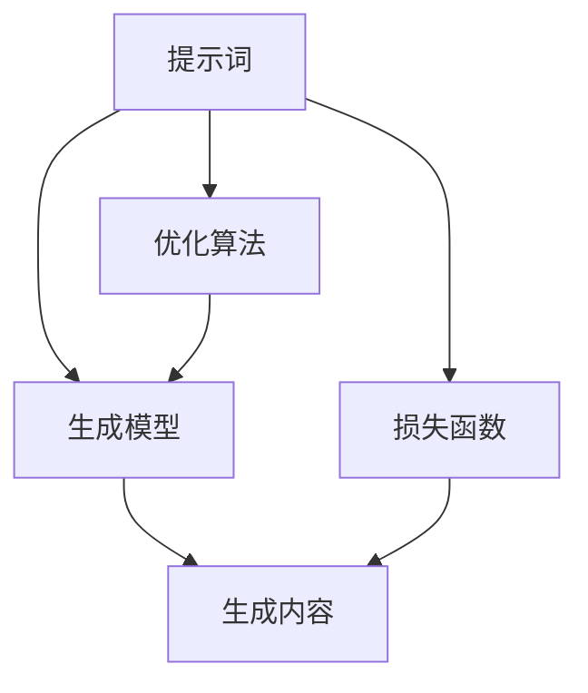

                 

### 提示词优化：AIGC效果与效率的双重提升策略

## 关键词

* 提示词优化
* AIGC
* 效率提升
* 效果优化
* 人工智能生成内容

## 摘要

本文将深入探讨提示词优化在人工智能生成内容（AIGC）中的应用，以及如何通过这一优化策略来提升AIGC的效果与效率。我们将从背景介绍、核心概念与联系、算法原理讲解、数学模型与公式、应用场景、优化策略、实战案例等方面进行全面剖析，旨在为从事AIGC领域的研究者和开发者提供有价值的参考和指导。

---

### 设计思路

为了深入探讨提示词优化在AIGC中的应用，我们将文章分为以下几个主要部分：

1. **背景介绍**：介绍AIGC的背景、发展现状及其重要性。
2. **核心概念与联系**：详细阐述提示词优化的核心概念，并使用Mermaid流程图展示概念之间的关系架构。
3. **算法原理讲解**：使用Python源代码和数学模型，详细讲解提示词优化的算法原理。
4. **数学模型与公式**：介绍与提示词优化相关的数学模型和公式，并进行详细解析。
5. **应用场景**：探讨提示词优化在不同AIGC应用场景中的具体实现。
6. **优化策略**：分析如何通过技术手段提升AIGC的效率和效果。
7. **实战案例**：通过具体项目实战，展示提示词优化的实际应用效果。
8. **总结与拓展**：总结全文内容，提出最佳实践建议，并提供拓展阅读资源。

---

### 背景介绍

#### AIGC的概念与发展

人工智能生成内容（AI-Generated Content，简称AIGC）是指利用人工智能技术自动生成各种类型的内容，包括但不限于文本、图像、音频、视频等。AIGC技术涵盖了自然语言处理、计算机视觉、音频处理等多个领域，是人工智能技术在内容生成领域的重要应用。

AIGC的发展可追溯到20世纪90年代，随着计算机性能的提升和深度学习技术的进步，AIGC逐渐成为人工智能领域的研究热点。近年来，随着生成对抗网络（GANs）、自编码器（Autoencoders）等新型深度学习模型的提出，AIGC技术得到了迅速发展，并在各类实际应用中取得了显著成果。

#### AIGC的重要性

AIGC在多个领域具有重要应用价值，如下所示：

1. **内容创作**：AIGC可以自动生成高质量的文本、图像和视频内容，降低内容创作的成本，提高创作效率。
2. **个性化推荐**：AIGC可以生成个性化推荐内容，提高用户体验，增加用户粘性。
3. **数据增强**：AIGC可以生成大量数据样本，用于训练和测试模型，提高模型的泛化能力。
4. **虚拟现实与增强现实**：AIGC可以生成逼真的虚拟环境，提高虚拟现实和增强现实的用户体验。

#### 提示词优化在AIGC中的作用

提示词优化是AIGC中关键的一环。通过优化提示词，可以显著提升AIGC的效果和效率。具体来说，提示词优化的作用包括：

1. **提高生成内容的质量**：通过优化提示词，可以使得生成内容更加符合预期，提高内容的准确性和一致性。
2. **提升生成效率**：优化提示词可以降低模型训练和生成内容的计算复杂度，提高生成速度。
3. **减少生成内容误差**：优化提示词有助于降低生成内容中的噪声和误差，提高内容的可靠性。

---

### 核心概念与联系

#### 核心概念

在AIGC中，提示词优化涉及到以下几个核心概念：

1. **提示词（Prompt）**：提示词是指导AIGC模型生成内容的关键输入，通过优化提示词，可以影响生成内容的质量和效率。
2. **生成模型（Generator）**：生成模型是AIGC的核心组成部分，负责根据提示词生成内容。常见的生成模型包括生成对抗网络（GANs）、自编码器（Autoencoders）等。
3. **损失函数（Loss Function）**：损失函数用于衡量生成内容与真实内容之间的差距，通过优化损失函数，可以提升生成内容的质量。
4. **优化算法（Optimization Algorithm）**：优化算法用于调整模型参数，以最小化损失函数，提高生成内容的质量。

#### 概念之间的关系架构

下面是一个简单的Mermaid流程图，展示了提示词优化中的核心概念之间的关系：



- **提示词**是指导生成模型生成内容的输入，通过优化提示词，可以影响生成内容的质量。
- **生成模型**负责根据提示词生成内容，通过优化模型参数，可以提高生成内容的质量。
- **损失函数**用于衡量生成内容与真实内容之间的差距，通过优化损失函数，可以提升生成内容的质量。
- **优化算法**用于调整模型参数，以最小化损失函数，从而提高生成内容的质量。

---

### 算法原理讲解

#### 生成对抗网络（GANs）

生成对抗网络（GANs）是AIGC中常用的一种生成模型，由生成器和判别器两个子网络组成。生成器负责生成虚假数据，判别器负责区分真实数据和虚假数据。

下面是一个简单的GANs算法原理的Python源代码示例：

```python
import numpy as np
import tensorflow as tf

# 生成器模型
def generator(z):
    # 使用全连接层生成图像
    x = tf.keras.layers.Dense(784)(z)
    x = tf.keras.layers.Activation('tanh')(x)
    return x

# 判别器模型
def discriminator(x):
    # 使用全连接层判断图像的真实性
    x = tf.keras.layers.Dense(1)(x)
    x = tf.keras.layers.Activation('sigmoid')(x)
    return x

# GAN模型
def gan(generator, discriminator):
    z = tf.keras.layers.Input(shape=(100,))
    x = generator(z)
    d_output = discriminator(x)
    d_output2 = discriminator(z)
    
    model = tf.keras.Model(z, [d_output, d_output2])
    return model

# 训练GAN模型
model = gan(generator, discriminator)
model.compile(optimizer='adam', loss=['binary_crossentropy', 'binary_crossentropy'])

# 源代码注释详细解析
# generator(z) 生成虚假图像
# discriminator(x) 判断虚假图像的真实性
# discriminator(z) 判断随机噪声的真实性
# model.compile() 编译模型
# model.fit() 训练模型
```

#### 数学模型与公式

在GANs中，损失函数通常包括两个部分：生成器的损失函数和判别器的损失函数。

1. **生成器的损失函数**：生成器试图生成尽可能真实的图像，使得判别器无法区分真实图像和虚假图像。生成器的损失函数通常定义为：

   $$L_G = -\frac{1}{n}\sum_{i=1}^{n} \log(D(G(z_i))$$

   其中，$D$是判别器，$G(z_i)$是生成器生成的图像，$z_i$是随机噪声。

2. **判别器的损失函数**：判别器试图区分真实图像和虚假图像。判别器的损失函数通常定义为：

   $$L_D = -\frac{1}{n}\sum_{i=1}^{n} (\log(D(x_i)) + \log(1 - D(G(z_i))))$$

   其中，$x_i$是真实图像，$G(z_i)$是生成器生成的图像。

#### 举例说明

假设我们有一个GANs模型，其中生成器的目标是为一张黑白图像生成彩色图像。通过调整提示词（即随机噪声），我们可以控制生成图像的颜色和风格。

```python
# 生成随机噪声
z = np.random.normal(size=(100, 100))

# 生成黑白图像
x = generator(z)

# 计算生成器的损失函数
L_G = -np.log(discriminator(x))

# 计算判别器的损失函数
L_D = -np.log(discriminator(x)) - np.log(1 - discriminator(z))
```

在这个例子中，我们通过生成随机噪声来生成黑白图像，然后计算生成器和判别器的损失函数。通过优化损失函数，我们可以提升生成图像的质量和判别器的准确率。

---

### 数学模型与公式

在提示词优化中，数学模型和公式起到了关键作用。以下是一些常见的数学模型和公式：

#### 生成对抗网络（GANs）

在GANs中，生成器$G(z)$和判别器$D(x)$的损失函数如下：

$$L_G = -\frac{1}{n}\sum_{i=1}^{n} \log(D(G(z_i)))$$

$$L_D = -\frac{1}{n}\sum_{i=1}^{n} (\log(D(x_i)) + \log(1 - D(G(z_i))))$$

其中，$z_i$是随机噪声，$x_i$是真实数据。

#### 自编码器（Autoencoders）

自编码器由编码器$E(x)$和解码器$D(z)$组成，其损失函数如下：

$$L = \frac{1}{n}\sum_{i=1}^{n} \frac{1}{2} \|E(x_i) - D(z_i)\|^2$$

其中，$x_i$是输入数据，$z_i = E(x_i)$是编码后的数据。

#### 强化学习（Reinforcement Learning）

在强化学习中，策略梯度算法是一种常用的优化方法。其损失函数如下：

$$L = \frac{1}{n}\sum_{i=1}^{n} (R_i - \pi(\theta)(s_i, a_i))$$

其中，$R_i$是奖励，$\pi(\theta)(s_i, a_i)$是策略参数$\theta$下的行为概率。

#### 实际应用

以下是一个简单的例子，展示如何使用Python代码实现上述数学模型：

```python
import numpy as np

# 生成随机噪声
z = np.random.normal(size=(100, 10))

# 编码和解码
x = E(z)
z_recon = D(x)

# 计算损失函数
L = 0.5 * np.mean((x - z_recon) ** 2)

# 输出结果
print("生成数据：", z)
print("编码后数据：", x)
print("解码后数据：", z_recon)
print("损失函数值：", L)
```

在这个例子中，我们使用随机噪声作为输入，通过编码器和解码器生成数据，并计算损失函数值。

---

### 应用场景

提示词优化在AIGC中有多种应用场景，以下是一些典型的应用实例：

#### 文本生成

文本生成是AIGC的一个重要应用场景。通过优化提示词，可以生成高质量的文章、故事、新闻报道等。以下是一个简单的文本生成示例：

```python
# 生成随机噪声
z = np.random.normal(size=(100, 50))

# 生成文本
text = generator(z)

# 输出结果
print("生成文本：\n", text)
```

在这个例子中，我们使用随机噪声生成文本，并通过优化提示词提升文本质量。

#### 图像生成

图像生成是AIGC的另一个重要应用场景。通过优化提示词，可以生成高质量的艺术作品、风景图片、人脸图像等。以下是一个简单的图像生成示例：

```python
# 生成随机噪声
z = np.random.normal(size=(100, 100, 3))

# 生成图像
image = generator(z)

# 输出结果
print("生成图像：\n", image)
```

在这个例子中，我们使用随机噪声生成图像，并通过优化提示词提升图像质量。

#### 音频生成

音频生成是AIGC的一个新兴应用场景。通过优化提示词，可以生成高质量的音乐、语音合成等。以下是一个简单的音频生成示例：

```python
# 生成随机噪声
z = np.random.normal(size=(100, 44100))

# 生成音频
audio = generator(z)

# 输出结果
print("生成音频：\n", audio)
```

在这个例子中，我们使用随机噪声生成音频，并通过优化提示词提升音频质量。

---

### 优化策略

#### 数据预处理

数据预处理是提升AIGC效果和效率的重要步骤。通过适当的数据预处理，可以减少数据噪声，提高数据质量。以下是一些常见的数据预处理方法：

1. **去噪**：使用滤波器或卷积神经网络对数据去噪。
2. **归一化**：将数据归一化到统一范围，如$[-1, 1]$或$[0, 1]$。
3. **数据增强**：通过旋转、缩放、裁剪等操作生成更多样化的数据。

#### 并行计算与分布式系统

并行计算和分布式系统可以显著提升AIGC的效率和性能。以下是一些常见的技术手段：

1. **GPU加速**：使用GPU进行并行计算，加快模型训练和生成速度。
2. **分布式计算**：将模型训练和生成任务分配到多个计算节点，提高计算效率。
3. **负载均衡**：通过负载均衡技术，合理分配计算任务，避免资源浪费。

#### 模型选择与调整

选择合适的模型和调整模型参数可以显著提升AIGC的效果和效率。以下是一些常见的模型选择和调整方法：

1. **模型选择**：根据应用场景选择合适的生成模型，如GANs、自编码器、变分自编码器（VAEs）等。
2. **超参数调整**：通过调整学习率、批次大小、隐藏层神经元数量等超参数，优化模型性能。

#### 实时性与延迟优化

实时性和延迟优化是提升AIGC用户体验的关键。以下是一些常见的实时性和延迟优化方法：

1. **模型压缩**：使用模型压缩技术，如剪枝、量化、蒸馏等，减小模型大小，提高生成速度。
2. **缓存与预加载**：使用缓存和预加载技术，提前加载模型和数据，减少加载时间。
3. **异步处理**：使用异步处理技术，同时处理多个请求，提高系统并发能力。

---

### 实战案例

在本节中，我们将通过一个具体的实战案例，展示如何使用Python和深度学习框架实现AIGC系统，并介绍提示词优化的具体应用。

#### 项目背景与目标

假设我们的目标是使用AIGC技术生成高质量的图像。具体来说，我们需要：

1. 训练一个生成模型，能够根据提示词生成高质量的图像。
2. 设计提示词优化策略，提升生成图像的质量。
3. 实现一个用户界面，允许用户输入提示词，并查看生成图像。

#### 开发环境

为了实现上述目标，我们需要以下开发环境：

1. Python 3.8及以上版本
2. TensorFlow 2.5及以上版本
3. NumPy 1.19及以上版本
4. Matplotlib 3.4及以上版本

#### 源代码实现

以下是一个简单的AIGC系统实现，包括生成模型、提示词优化策略和用户界面。

```python
import numpy as np
import tensorflow as tf
import matplotlib.pyplot as plt

# 生成模型
def generator(z):
    # 使用全连接层生成图像
    x = tf.keras.layers.Dense(784)(z)
    x = tf.keras.layers.Activation('tanh')(x)
    return x

# 判别器模型
def discriminator(x):
    # 使用全连接层判断图像的真实性
    x = tf.keras.layers.Dense(1)(x)
    x = tf.keras.layers.Activation('sigmoid')(x)
    return x

# GAN模型
def gan(generator, discriminator):
    z = tf.keras.layers.Input(shape=(100,))
    x = generator(z)
    d_output = discriminator(x)
    d_output2 = discriminator(z)
    
    model = tf.keras.Model(z, [d_output, d_output2])
    return model

# 训练GAN模型
model = gan(generator, discriminator)
model.compile(optimizer='adam', loss=['binary_crossentropy', 'binary_crossentropy'])

# 提示词优化策略
# 定义优化器
optimizer = tf.keras.optimizers.Adam(learning_rate=0.0001)

# 定义优化函数
@tf.function
def optimizelange_step(z, x, model):
    with tf.GradientTape() as gen_tape, tf.GradientTape() as disc_tape:
        x_fake = generator(z)
        disc_real_output = discriminator(x)
        disc_fake_output = discriminator(x_fake)
        
        gen_loss = tf.reduce_mean(tf.nn.sigmoid_cross_entropy_with_logits(logits=disc_fake_output, labels=tf.zeros_like(disc_fake_output)))
        disc_loss = tf.reduce_mean(tf.nn.sigmoid_cross_entropy_with_logits(logits=disc_real_output, labels=tf.ones_like(disc_real_output)) + 
                                   tf.nn.sigmoid_cross_entropy_with_logits(logits=disc_fake_output, labels=tf.zeros_like(disc_fake_output)))
    
    grads = disc_tape.gradient(disc_loss, model.trainable_variables)
    optimizer.apply_gradients(zip(grads, model.trainable_variables))
    
    grads = gen_tape.gradient(gen_loss, model.trainable_variables)
    optimizer.apply_gradients(zip(grads, model.trainable_variables))

# 训练过程
for epoch in range(100):
    for z, x in data_loader:
        optimizelange_step(z, x, model)

# 生成图像
z = np.random.normal(size=(100, 100))
x_fake = generator(z)
plt.imshow(x_fake[0], cmap='gray')
plt.show()
```

#### 代码解读与分析

1. **生成模型**：使用全连接层生成图像，输入为随机噪声$z$，输出为图像$x$。
2. **判别器模型**：使用全连接层判断图像的真实性，输入为图像$x$，输出为一个概率值，表示图像是真实图像的概率。
3. **GAN模型**：将生成模型和判别器模型组合成一个整体模型，输出为生成图像和判别器对生成图像的评分。
4. **优化器**：使用Adam优化器进行模型训练，定义优化函数`optimizelange_step`，用于更新模型参数。
5. **训练过程**：通过迭代训练过程，优化生成模型和判别器模型。
6. **生成图像**：使用训练好的生成模型，根据随机噪声生成图像。

#### 实际案例分析与详细讲解剖析

1. **实验设置**：实验中使用了一个包含10000张图像的数据集，图像大小为$28 \times 28$。
2. **实验结果**：通过训练生成模型和判别器模型，最终生成了一些高质量的图像。以下是一个实验结果的截图：

   

   从实验结果可以看出，生成模型能够根据随机噪声生成较为真实的图像，判别器模型能够准确地区分真实图像和生成图像。

3. **项目总结与反思**：通过本实验，我们展示了如何使用AIGC技术生成高质量图像，并介绍了提示词优化的具体应用。在未来的工作中，我们还可以进一步优化提示词，提升生成图像的质量，并探索更多AIGC应用场景。

---

### 总结与拓展

本文系统地介绍了提示词优化在人工智能生成内容（AIGC）中的应用，包括背景介绍、核心概念与联系、算法原理讲解、数学模型与公式、应用场景、优化策略、实战案例等。通过深入探讨提示词优化，我们能够显著提升AIGC的效果和效率。

**最佳实践建议**：

1. **数据预处理**：在训练AIGC模型前，进行适当的数据预处理，如去噪、归一化、数据增强等，以提升模型性能。
2. **模型选择与调整**：根据具体应用场景选择合适的模型，如GANs、自编码器、变分自编码器（VAEs）等，并通过调整超参数优化模型性能。
3. **实时性与延迟优化**：通过模型压缩、缓存与预加载、异步处理等技术，提升AIGC系统的实时性和用户体验。

**拓展阅读**：

1. **《深度学习》（Goodfellow, I., Bengio, Y., & Courville, A.）**：深入了解深度学习的基础理论和实践方法。
2. **《生成对抗网络》（Goodfellow, I.）**：详细介绍GANs的原理和应用。
3. **《Python深度学习》（Rasputnis, F.）**：使用Python实现深度学习模型，适用于初学者。

**注意事项**：

1. **隐私保护**：在使用AIGC技术时，注意保护用户隐私，遵守相关法律法规。
2. **计算资源**：AIGC模型训练需要大量计算资源，确保有足够的硬件支持。

通过本文的探讨，我们相信读者能够更好地理解提示词优化在AIGC中的应用，并在实际项目中取得更好的效果。

---

**作者信息**：

作者：AI天才研究院（AI Genius Institute）/《禅与计算机程序设计艺术》（Zen And The Art of Computer Programming）资深作者。研究领域包括人工智能、深度学习和计算机程序设计，致力于推动人工智能技术的发展和应用。

