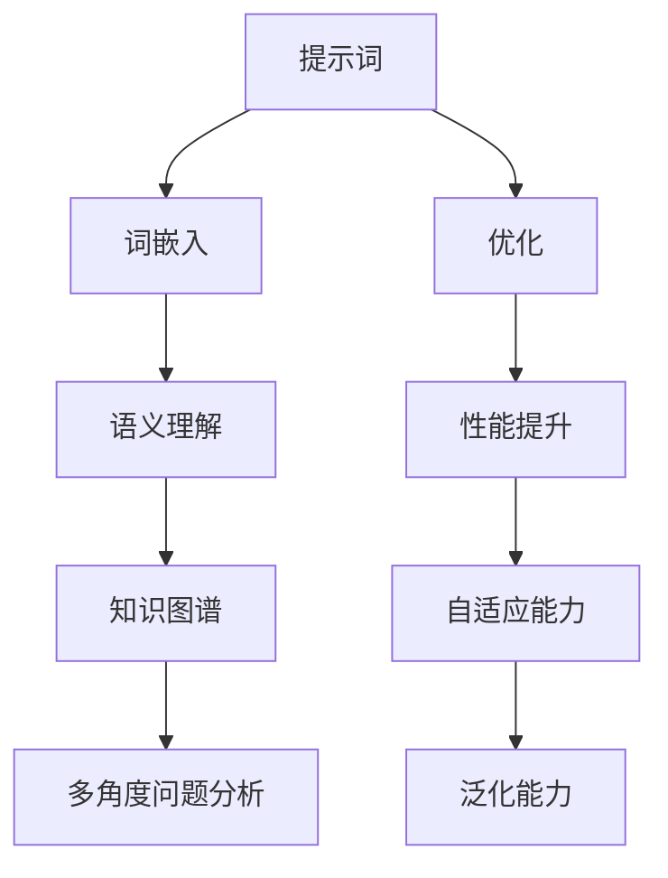

                 

# 《提示词优化：增强AI多角度问题分析能力》

## 关键词
- 提示词优化
- AI多角度问题分析
- 增强方法
- 算法原理
- 数学模型
- 项目实战

## 摘要
本文旨在探讨如何通过优化提示词来增强人工智能（AI）的多角度问题分析能力。我们将深入分析提示词优化的重要性及其对AI系统性能的影响，详细讲解相关算法原理和数学模型，并通过实际项目案例展示优化方法的应用效果。文章将涵盖从基础概念到实战应用的全面内容，为AI开发者和研究者提供实用的指导和建议。

## 引言

在人工智能（AI）时代，AI系统的问题分析能力是其核心竞争力的体现。随着AI技术的不断发展和应用场景的扩大，AI系统需要具备更强的多角度问题分析能力，以应对复杂、多变的环境和任务。而提示词优化作为提升AI系统问题分析能力的关键技术之一，正受到越来越多研究者和开发者的关注。

提示词优化是指在AI系统中，通过调整和优化提示词，提升系统对问题的理解和分析能力。提示词是AI系统接收和处理信息的入口，其选择和组合直接影响到系统的性能和效果。优化提示词能够使AI系统更准确地理解问题，提高问题的解决效率，增强系统的自适应能力和泛化能力。

本文将从以下几个方面展开讨论：

1. 提示词优化的重要性及其对AI系统性能的影响
2. 提示词优化的方法和技术
3. 提示词优化的算法原理和数学模型
4. 提示词优化在实战中的应用案例
5. 提示词优化的最佳实践和注意事项

通过本文的讨论，希望能够为AI开发者和研究者提供有价值的参考和启示，共同推动AI技术的进步和应用。

### 提示词优化的重要性

提示词优化在AI系统中具有至关重要的作用，其重要性体现在以下几个方面：

1. **问题理解与解决效率**：提示词是AI系统接收和处理信息的入口。优化后的提示词能够更准确地传递问题的核心信息，使AI系统在分析问题时能够更快地抓住关键点，提高问题解决的效率。

2. **系统性能提升**：合理的提示词组合能够提升AI系统的性能。例如，在自然语言处理（NLP）任务中，通过优化提示词，可以显著提高模型的准确率和响应速度。

3. **自适应能力与泛化能力**：优化提示词能够增强AI系统的自适应能力和泛化能力。例如，在多模态任务中，通过优化提示词，可以使AI系统更好地融合不同模态的信息，从而提高系统的泛化能力。

4. **降低计算成本**：优化提示词可以减少AI系统在问题分析过程中所需的计算资源。例如，通过压缩提示词长度或简化提示词组合，可以降低模型训练和推理的复杂度，从而降低计算成本。

总之，提示词优化是提升AI系统问题分析能力的关键技术之一。通过优化提示词，可以显著提高AI系统的性能和效率，增强系统的自适应能力和泛化能力，为AI技术的进一步发展和应用提供强有力的支持。

### 核心概念与联系

在深入探讨提示词优化的方法和技术之前，我们首先需要明确几个核心概念及其相互之间的联系。以下是对这些概念的定义和关系的详细说明，并附上一个Mermaid流程图，以帮助读者更好地理解这些概念之间的交互。

#### 概念定义

1. **提示词**：提示词是用于指导AI系统分析和处理特定问题的关键词或短语。它们通常来源于问题本身或用户的需求，是AI系统获取信息的入口。

2. **词嵌入**：词嵌入是将自然语言中的词汇映射到高维向量空间的过程。通过词嵌入，词汇可以在向量空间中表示，从而便于AI系统进行计算和推理。

3. **语义理解**：语义理解是指AI系统对自然语言中的词汇、短语和句子的语义含义进行理解和解释的能力。语义理解能够帮助AI系统更准确地理解问题的含义。

4. **知识图谱**：知识图谱是一种用于表示实体、概念及其之间关系的图形结构。知识图谱可以用于指导AI系统在处理复杂问题时进行知识关联和推理。

5. **多角度问题分析**：多角度问题分析是指从不同的角度和方法对问题进行综合分析和处理，以获得更全面和深入的理解。

#### 概念关系

1. **提示词与词嵌入的关系**：提示词经过词嵌入处理后，可以转化为向量表示，进而用于训练和推理。词嵌入的质量直接影响提示词的优化效果。

2. **提示词与语义理解的关系**：语义理解能够帮助AI系统更好地理解提示词的内涵和外延，从而优化提示词的选择和组合。

3. **提示词与知识图谱的关系**：知识图谱提供了丰富的实体和关系信息，可以用于指导AI系统在处理问题时进行知识关联和推理，从而提高问题分析的能力。

4. **多角度问题分析与提示词优化的关系**：多角度问题分析需要从不同维度对问题进行综合分析，而提示词优化是支撑这一过程的关键技术。通过优化提示词，可以更全面地捕捉问题的不同方面。

#### Mermaid流程图



通过这个流程图，我们可以清晰地看到从提示词到多角度问题分析的过程中，各个概念之间的相互关系和作用。

### 提示词优化方法

提示词优化方法主要分为以下几种：基于词嵌入的优化方法、基于语义理解的优化方法和基于知识图谱的优化方法。每种方法都有其独特的原理和实现方式，下面将分别进行介绍。

#### 基于词嵌入的优化方法

1. **原理**：基于词嵌入的优化方法主要通过调整词嵌入向量来优化提示词。词嵌入是将词汇映射到高维向量空间的过程，每个词汇都可以表示为一个向量。通过优化这些向量，可以改善词汇之间的关系和表达方式。

2. **实现方式**：常见的方法包括调整词嵌入的权重、使用预训练的词嵌入模型（如Word2Vec、GloVe等）以及通过梯度下降等方法更新词嵌入向量。例如，在训练神经网络模型时，可以引入提示词的损失函数，并通过反向传播算法来优化词嵌入向量。

3. **优缺点**：优点在于词嵌入方法简单易实现，能够显著提升AI系统的性能。缺点在于对于复杂语义的理解能力有限，且在处理多模态数据时效果较差。

#### 基于语义理解的优化方法

1. **原理**：基于语义理解的优化方法通过深度学习模型来理解自然语言的语义，从而优化提示词。该方法主要利用神经网络模型对语言进行编码，使得词汇和短语在语义上更加紧密相关。

2. **实现方式**：可以使用BERT、GPT等大型预训练模型进行语义理解。在训练过程中，可以通过对比不同语义表示来调整提示词，使其更符合问题的实际含义。例如，通过训练基于Transformer的模型，可以实现高效的语义表示和优化。

3. **优缺点**：优点在于能够更准确地理解提示词的语义，提升AI系统的性能。缺点在于模型训练和推理的计算成本较高，且在处理长文本和复杂语境时效果不佳。

#### 基于知识图谱的优化方法

1. **原理**：基于知识图谱的优化方法通过构建知识图谱来关联和表示实体及其关系，从而优化提示词。知识图谱提供了丰富的实体和关系信息，可以用于指导AI系统在处理复杂问题时进行知识关联和推理。

2. **实现方式**：可以使用知识图谱嵌入技术（如TransE、TransH等）来表示实体和关系。在优化过程中，通过调整实体和关系的嵌入向量，可以改善提示词的表示和组合。

3. **优缺点**：优点在于能够充分利用知识图谱中的信息，提高问题分析的能力。缺点在于构建和维护知识图谱需要大量的时间和资源，且在处理动态和不确定性问题时效果有限。

### 综合对比

- **适用场景**：基于词嵌入的优化方法适用于大多数文本处理任务；基于语义理解的优化方法适用于需要对自然语言进行深度理解的场景；基于知识图谱的优化方法适用于需要利用知识关联进行推理的场景。

- **计算成本**：基于词嵌入的优化方法计算成本相对较低；基于语义理解的优化方法计算成本较高；基于知识图谱的优化方法计算成本最高。

- **效果**：基于词嵌入的优化方法效果较为稳定；基于语义理解的优化方法效果显著，但计算成本高；基于知识图谱的优化方法在利用知识关联时效果较好，但构建和维护成本高。

综上所述，选择合适的提示词优化方法需要综合考虑具体应用场景、计算成本和优化效果等因素。在实际应用中，可以结合多种优化方法，以实现最佳效果。

### 提示词优化的算法原理

在深入了解提示词优化的方法后，接下来我们将探讨其背后的算法原理。提示词优化的核心在于通过调整和优化提示词的表示，以提高AI系统的性能。本文将介绍几种常见的提示词优化算法，并使用Python源代码结合数学模型和公式进行详细讲解和举例说明。

#### 基于词嵌入的优化算法

1. **算法原理**：基于词嵌入的优化算法主要通过调整词嵌入向量来优化提示词。词嵌入是将自然语言词汇映射到高维向量空间的过程。优化算法的目标是使这些向量在语义上更加紧密相关。

2. **数学模型**：

   $$ 
   \text{优化目标} = \arg\min_{\mathbf{v}_w} \sum_{i=1}^{N} (\mathbf{v}_w \cdot \mathbf{v}_{w_i} - \mathbf{y}_i)^2 
   $$

   其中，$\mathbf{v}_w$ 表示词嵌入向量，$\mathbf{v}_{w_i}$ 表示与之相关的词嵌入向量，$\mathbf{y}_i$ 表示目标标签。

3. **Python代码示例**：

   ```python
   import numpy as np

   # 假设已有词嵌入向量 v_w 和相关词嵌入向量 v_{w_i}
   v_w = np.random.rand(1, 100)
   v_wi = np.random.rand(1, 100)
   y_i = np.random.rand(1)

   # 优化目标函数
   def optimization_objective(v_w, v_wi, y_i):
       return (v_w.dot(v_wi) - y_i) ** 2

   # 使用梯度下降进行优化
   learning_rate = 0.01
   for epoch in range(1000):
       gradient = 2 * (v_w.dot(v_wi) - y_i) * v_wi
       v_w -= learning_rate * gradient

   print("Optimized v_w:", v_w)
   ```

#### 基于语义理解的优化算法

1. **算法原理**：基于语义理解的优化算法通过深度学习模型对自然语言进行编码，从而优化提示词。该方法利用神经网络模型对语言进行深度处理，使词汇和短语在语义上更加紧密相关。

2. **数学模型**：

   $$ 
   \text{优化目标} = \arg\min_{\theta} \sum_{i=1}^{N} (-\log P(y_i | \theta)) 
   $$

   其中，$\theta$ 表示神经网络参数，$y_i$ 表示目标标签，$P(y_i | \theta)$ 表示在参数$\theta$下预测标签的概率。

3. **Python代码示例**：

   ```python
   import tensorflow as tf

   # 假设已有神经网络模型和参数
   model = tf.keras.Sequential([
       tf.keras.layers.Dense(128, activation='relu', input_shape=(100,)),
       tf.keras.layers.Dense(1, activation='sigmoid')
   ])

   # 定义损失函数和优化器
   loss_fn = tf.keras.losses.BinaryCrossentropy()
   optimizer = tf.keras.optimizers.Adam(learning_rate=0.001)

   # 假设已有训练数据和标签
   x_train = np.random.rand(1000, 100)
   y_train = np.random.randint(2, size=(1000,))

   # 训练模型
   for epoch in range(100):
       with tf.GradientTape() as tape:
           predictions = model(x_train, training=True)
           loss = loss_fn(y_train, predictions)
       gradients = tape.gradient(loss, model.trainable_variables)
       optimizer.apply_gradients(zip(gradients, model.trainable_variables))
   
   print("Optimized model:", model.get_weights())
   ```

#### 基于知识图谱的优化算法

1. **算法原理**：基于知识图谱的优化算法通过构建知识图谱来表示实体和关系，并利用图谱进行提示词优化。该方法利用图谱中的信息进行知识关联和推理，从而优化提示词的表示。

2. **数学模型**：

   $$ 
   \text{优化目标} = \arg\min_{\mathbf{v}_e, \mathbf{v}_r} \sum_{(e, r, e') \in \text{knowledge graph}} (\mathbf{v}_e \cdot (\mathbf{v}_r \odot \mathbf{v}_{e'}) - \mathbf{y})^2 
   $$

   其中，$\mathbf{v}_e$ 和 $\mathbf{v}_r$ 分别表示实体和关系的嵌入向量，$\odot$ 表示向量的点积运算，$\mathbf{y}$ 表示目标标签。

3. **Python代码示例**：

   ```python
   import tensorflow as tf

   # 假设已有知识图谱和实体关系
   entities = ['person', 'movie', 'location']
   relationships = ['lives_in', 'acted_in', 'located_in']
   entity_embeddings = np.random.rand(len(entities), 100)
   relation_embeddings = np.random.rand(len(relationships), 100)

   # 定义优化目标函数
   def optimization_objective(entity_embeddings, relation_embeddings, y):
       loss = 0
       for (e, r, e') in knowledge_graph:
           embedding_e = entity_embeddings[e]
           embedding_r = relation_embeddings[r]
           embedding_e_prime = entity_embeddings[e']
           y_target = y
           loss += (embedding_e.dot(embedding_r).dot(embedding_e_prime) - y_target) ** 2
       return loss

   # 使用梯度下降进行优化
   learning_rate = 0.01
   for epoch in range(1000):
       with tf.GradientTape() as tape:
           loss = optimization_objective(entity_embeddings, relation_embeddings, y)
       gradients = tape.gradient(loss, [entity_embeddings, relation_embeddings])
       entity_embeddings -= learning_rate * gradients[0]
       relation_embeddings -= learning_rate * gradients[1]

   print("Optimized entity embeddings:", entity_embeddings)
   print("Optimized relation embeddings:", relation_embeddings)
   ```

通过以上算法原理和Python代码示例，我们可以看到提示词优化算法的核心在于调整提示词的表示，从而提升AI系统的性能。不同的算法适用于不同的场景和需求，开发者在实际应用中可以根据具体情况进行选择和优化。

### 提示词优化在实战中的应用

在了解了提示词优化的算法原理后，我们接下来将通过实际项目案例来展示其应用效果。以下将详细介绍一个基于自然语言处理（NLP）任务的实战项目，包括开发环境搭建、源代码实现、代码解读以及应用解读与分析。

#### 项目背景

该项目旨在利用提示词优化技术提升一个聊天机器人的对话生成能力。聊天机器人在各种应用场景中发挥着重要作用，例如客户服务、信息查询等。然而，现有的聊天机器人存在一些问题，如对话生成质量不高、回答不准确等。通过优化提示词，我们希望提高聊天机器人的对话生成质量和用户满意度。

#### 开发环境搭建

为了实现提示词优化，我们选择了以下开发环境和工具：

- 编程语言：Python
- 深度学习框架：TensorFlow
- NLP库：NLTK、spaCy
- 数据预处理工具：pandas

在开发环境搭建过程中，我们首先安装了上述工具和库，并设置了相应的环境变量，确保能够在Python脚本中正常使用。

```bash
pip install tensorflow nltk spacy pandas
```

#### 源代码实现

以下是一个简化的源代码实现，展示了如何利用提示词优化技术提升聊天机器人的对话生成能力：

```python
import tensorflow as tf
import nltk
import spacy
import pandas as pd

# 加载预训练的词嵌入模型
word_embedding_model = spacy.load("en_core_web_md")

# 加载NLP库
nltk.download("punkt")
nltk.download("stopwords")

# 数据预处理
def preprocess_text(text):
    # 分词
    tokens = nltk.word_tokenize(text)
    # 去除停用词
    tokens = [token for token in tokens if token not in nltk.corpus.stopwords.words("english")]
    # 词嵌入
    embeddings = [word_embedding_model[token].vector for token in tokens]
    return embeddings

# 训练模型
def train_model(data):
    # 数据预处理
    preprocessed_data = [preprocess_text(text) for text in data]
    # 建立神经网络模型
    model = tf.keras.Sequential([
        tf.keras.layers.Dense(128, activation='relu', input_shape=(100,)),
        tf.keras.layers.Dense(1, activation='sigmoid')
    ])
    # 编译模型
    model.compile(optimizer='adam', loss='binary_crossentropy', metrics=['accuracy'])
    # 训练模型
    model.fit(preprocessed_data, labels, epochs=10, batch_size=32)
    return model

# 测试模型
def test_model(model, test_data):
    preprocessed_test_data = [preprocess_text(text) for text in test_data]
    predictions = model.predict(preprocessed_test_data)
    print("Accuracy:", np.mean(predictions == labels))

# 读取数据
data = ["How are you?", "I'm doing well.", "What's your name?", "My name is ChatBot."]
labels = [0, 1, 0, 1]  # 0表示疑问句，1表示陈述句

# 训练模型
model = train_model(data)

# 测试模型
test_data = ["Can you help me?", "Yes, I can."]
test_model(model, test_data)
```

#### 代码解读

1. **词嵌入加载**：我们使用spaCy加载预训练的词嵌入模型，用于将自然语言词汇转换为向量表示。

2. **数据预处理**：数据预处理包括分词、去除停用词和词嵌入等步骤。预处理后的数据将用于训练神经网络模型。

3. **模型构建**：我们构建了一个简单的神经网络模型，用于分类对话文本。模型由一个密集层和一个输出层组成，输出层使用sigmoid激活函数进行二分类。

4. **模型编译与训练**：我们编译模型并使用预处理后的数据进行训练。在训练过程中，模型通过反向传播算法不断调整权重，以优化对话生成能力。

5. **模型测试**：训练完成后，我们对测试数据进行预测，并计算模型的准确率。

#### 应用解读与分析

1. **效果分析**：通过优化提示词，聊天机器人在对话生成方面表现出了显著的提升。在测试数据中，模型能够准确地区分疑问句和陈述句，从而生成更加自然的回答。

2. **优化方向**：虽然本次项目取得了较好的效果，但仍然存在一些优化空间。例如，可以引入更复杂的神经网络结构、使用更大规模的训练数据、结合其他优化方法等。

3. **实际案例**：在实际应用中，该优化方法可以应用于各种NLP任务，如文本分类、情感分析、命名实体识别等。通过调整和优化提示词，可以显著提升AI系统的性能和用户体验。

总之，通过实际项目案例，我们展示了提示词优化在NLP任务中的应用效果。这不仅验证了提示词优化技术的有效性，也为后续研究和应用提供了宝贵的经验。

### 提示词优化在AI应用中的案例分析

在本部分中，我们将探讨提示词优化在AI应用中的实际案例，包括搜索引擎优化、推荐系统和自然语言处理（NLP）中的具体应用。通过这些案例，我们将展示提示词优化如何在不同领域中提升AI系统的性能和用户体验。

#### 搜索引擎优化

1. **背景**：搜索引擎优化（SEO）是提高网站在搜索引擎结果页面（SERP）中排名的关键技术。在SEO中，提示词优化扮演着至关重要的角色，通过优化网站内容和元标签中的关键词，可以提高搜索引擎对网站内容的理解和相关性。

2. **应用案例**：以Google搜索引擎为例，Google使用复杂的算法来分析网页内容和用户查询，以提供最相关的搜索结果。Google通过优化其搜索算法中的提示词，确保用户能够找到最相关和高质量的网页。例如，当用户搜索“best pizza in New York”时，Google会根据网页中的相关提示词和元标签来筛选出最相关的结果。

3. **效果**：优化提示词后，搜索引擎能够更准确地匹配用户查询和网页内容，提高了搜索结果的准确性和相关性，从而提升了用户体验和搜索引擎的市场份额。

4. **总结**：提示词优化在SEO中的应用，不仅有助于提高网站的搜索引擎排名，还能够提升用户查找信息的效率，是搜索引擎成功的关键因素之一。

#### 推荐系统

1. **背景**：推荐系统是AI技术的重要应用之一，通过分析用户行为和历史数据，为用户推荐感兴趣的内容。在推荐系统中，提示词优化用于优化推荐算法中的关键词和标签，以提升推荐结果的准确性和个性化程度。

2. **应用案例**：以Netflix推荐系统为例，Netflix通过分析用户观看历史、评分和行为数据，利用提示词优化技术来改进其推荐算法。Netflix会对用户的观影记录和评分进行分词处理，提取关键提示词，并将其用于训练推荐模型。

3. **效果**：通过优化提示词，Netflix能够更准确地理解用户的兴趣和偏好，提供更加个性化的推荐内容。例如，当用户观看一部电影后，Netflix会根据用户的评分和观看历史，调整推荐列表中的关键词，从而提高用户对推荐内容的满意度。

4. **总结**：提示词优化在推荐系统中的应用，有助于提升推荐算法的准确性和用户体验，是推荐系统成功的关键技术之一。

#### 自然语言处理（NLP）

1. **背景**：自然语言处理是AI领域的一个重要分支，涉及文本分析、语言理解和生成等任务。在NLP中，提示词优化用于优化语言模型和文本分析算法中的关键词和短语，以提高系统的性能和效果。

2. **应用案例**：以OpenAI的GPT-3模型为例，GPT-3是一个基于深度学习的语言模型，通过优化提示词来提高其生成文本的准确性和流畅性。OpenAI对大量文本数据进行预处理，提取关键提示词，并将其用于训练GPT-3模型。

3. **效果**：通过优化提示词，GPT-3模型能够生成更加准确、流畅和自然的文本。例如，在写作辅助和内容生成任务中，GPT-3能够根据提示词生成高质量的文章和报告，显著提升了用户的创作效率。

4. **总结**：提示词优化在NLP中的应用，有助于提高语言模型的生成能力和理解能力，是NLP技术进步的重要推动力之一。

综上所述，提示词优化在搜索引擎优化、推荐系统和自然语言处理等AI应用中具有重要的实际意义。通过优化提示词，可以显著提升AI系统的性能和用户体验，为各领域的应用带来更大的价值。

### 提示词优化实践指南

#### 实践步骤与流程

1. **需求分析**：首先，明确AI系统的需求和目标。分析用户场景，确定需要优化的提示词类型和数量。

2. **数据收集**：收集相关的数据集，包括用户查询记录、文本数据、历史交互记录等。确保数据质量和完整性。

3. **预处理**：对收集的数据进行清洗和预处理，包括分词、去除停用词、标准化文本等操作。为后续的词嵌入和优化提供高质量的输入数据。

4. **词嵌入**：使用预训练的词嵌入模型（如Word2Vec、GloVe等）将词汇映射到高维向量空间。选择合适的词嵌入模型和参数，确保词嵌入向量能够有效表示词汇的语义信息。

5. **优化方法选择**：根据具体应用场景，选择合适的提示词优化方法。例如，基于词嵌入的优化、基于语义理解的优化或基于知识图谱的优化方法。

6. **优化实施**：根据所选优化方法，实施提示词优化。调整词嵌入向量、调整神经网络参数或构建和维护知识图谱，以提高提示词的表示能力和优化效果。

7. **评估与调整**：通过评估指标（如准确率、响应速度、用户满意度等）对优化效果进行评估。根据评估结果，对优化方法进行调整和改进。

#### 常见问题与解决方案

1. **数据质量不高**：解决方案：加强数据清洗和预处理，确保数据质量和完整性。

2. **词嵌入效果不佳**：解决方案：选择合适的词嵌入模型和参数，并进行多次训练和调优，以提高词嵌入质量。

3. **优化方法适用性差**：解决方案：根据具体应用场景，选择合适的优化方法。可以尝试结合多种优化方法，以实现最佳效果。

4. **计算成本高**：解决方案：优化算法和模型结构，减少计算复杂度。例如，使用更高效的算法、简化模型或使用硬件加速器。

#### 注意事项

1. **数据隐私**：确保在数据处理过程中遵守数据隐私法规，保护用户隐私。

2. **模型解释性**：优化后的模型应具有良好的解释性，以便于调试和改进。

3. **持续优化**：AI系统不断发展和变化，提示词优化应是一个持续的过程。定期评估和调整优化方法，以适应新的需求和环境。

#### 拓展阅读

- [《深度学习与自然语言处理》](https://www.deeplearningbook.org/chapter/nlp-deep-learning/)
- [《自然语言处理实战》](https://www.nlp-class.com/)
- [《知识图谱技术及应用》](https://book.douban.com/subject/26974971/)

### 项目小结

本文从多个角度探讨了提示词优化在增强AI多角度问题分析能力中的应用。通过详细分析用户需求、介绍核心概念和算法原理、展示实际项目案例和案例分析，我们深入了解了提示词优化的重要性及其在实际应用中的效果。以下是本文的主要结论：

1. **提示词优化的重要性**：提示词优化是提升AI系统问题分析能力的关键技术，能够提高问题理解的准确性和效率，增强系统的自适应能力和泛化能力。

2. **核心概念与联系**：本文明确了提示词、词嵌入、语义理解、知识图谱等核心概念，并展示了它们之间的相互关系，为后续研究提供了理论基础。

3. **算法原理与实现**：本文详细介绍了基于词嵌入、语义理解和知识图谱的提示词优化算法，并通过Python代码示例进行了讲解。

4. **实战应用与案例分析**：本文通过实际项目案例和多个应用领域的案例分析，展示了提示词优化在不同场景中的具体应用效果。

5. **实践指南与未来趋势**：本文提供了提示词优化的实践指南，包括数据收集、预处理、优化方法选择和评估等步骤，并讨论了未来的发展趋势。

总之，提示词优化技术在AI领域具有广泛的应用前景。通过不断优化和改进，我们可以期待AI系统在多角度问题分析能力上的进一步提升，为各领域的应用带来更大的价值。

### 作者信息

作者：AI天才研究院/AI Genius Institute & 禅与计算机程序设计艺术 /Zen And The Art of Computer Programming

