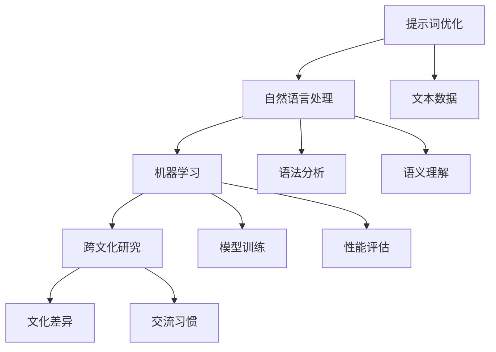

                 

### 提示词优化：增强AI跨文化交流能力

## 关键词

- 提示词优化
- AI跨文化交流
- 自然语言处理
- 机器学习
- 交叉文化研究

## 摘要

本文将探讨如何通过提示词优化来提升人工智能在跨文化交流中的应用能力。我们将深入分析提示词优化的核心概念，介绍其在自然语言处理和机器学习中的应用，并探讨如何结合数学模型和跨文化研究，从而实现高效的AI跨文化交流。通过实际项目和代码实现，我们将展示提示词优化在提升AI跨文化沟通效果方面的具体应用，并提出最佳实践建议，以期为AI技术在不同文化背景下的应用提供新的思路和方法。

### 引言

随着全球化的加速，跨文化交流变得越来越频繁和重要。然而，不同的语言和文化背景往往会导致沟通障碍，使得信息传递变得复杂和低效。传统的跨文化交流方法依赖于人类翻译和专业知识，不仅成本高昂，而且效率有限。随着人工智能（AI）技术的发展，尤其是自然语言处理（NLP）和机器学习（ML）的进步，AI在跨文化交流中的应用成为可能。

近年来，研究人员和开发者开始探索如何通过优化提示词来增强AI在跨文化交流中的能力。提示词优化是一种通过调整和改进输入提示，以提高模型理解和生成输出质量的方法。这一技术的核心在于如何设计有效的提示，以便AI系统能够更好地理解和应对跨文化语境。

本文将围绕提示词优化的概念、原理和应用进行深入探讨，结合实际项目和代码实现，展示如何通过提示词优化来提升AI跨文化交流能力。文章将分为以下几个部分：

1. **核心概念与联系**：介绍提示词优化、自然语言处理和机器学习等核心概念，并使用Mermaid流程图展示它们之间的联系。
2. **核心算法原理讲解**：详细阐述提示词优化算法的原理，并结合Python代码和数学模型进行说明。
3. **数学模型和数学公式**：详细讲解提示词优化和AI跨文化交流的数学模型，使用LaTeX格式书写公式，并进行举例说明。
4. **项目实战**：通过实际案例，展示如何搭建开发环境、实现源代码，并进行代码解读和应用分析。
5. **最佳实践与总结**：总结提示词优化在AI跨文化交流中的应用，提出最佳实践建议，并展望未来发展方向。

### 核心概念与联系

#### 提示词优化

提示词优化是一种通过调整输入提示来改善模型性能的技术。在人工智能系统中，提示（prompt）是指提供给模型的数据，用于引导模型生成预期的输出。通过优化提示词，可以提高模型的上下文理解能力，从而提升生成输出的准确性和相关性。

在自然语言处理中，提示词优化尤为重要。例如，在机器翻译任务中，优化输入句子中的提示词可以帮助模型更好地理解句子的含义，从而生成更准确、更自然的翻译结果。此外，在对话系统、文本摘要和问答系统中，提示词优化同样可以显著提升用户体验。

#### 自然语言处理（NLP）

自然语言处理是人工智能的一个分支，旨在使计算机能够理解、处理和生成人类语言。NLP涵盖了多种技术，包括分词、词性标注、句法分析、语义理解和文本生成等。

在跨文化交流中，NLP技术扮演着关键角色。通过NLP，AI系统可以分析文本内容，提取关键信息，并生成相应的响应。然而，不同语言的语法、词汇和表达习惯各异，这使得NLP在处理跨语言文本时面临诸多挑战。

#### 机器学习（ML）

机器学习是人工智能的核心技术之一，它通过算法和统计模型，使计算机系统能够从数据中自动学习和改进。机器学习广泛应用于图像识别、语音识别、推荐系统、自动驾驶等领域。

在提示词优化中，机器学习技术用于构建和训练模型，以识别有效的提示词，并调整输入提示。通过不断迭代和优化，机器学习模型可以逐渐提高其性能和适应性。

#### 跨文化研究

跨文化研究是探讨不同文化之间相互影响和交流的学科。它关注语言、价值观、行为习惯等方面的差异，以及这些差异如何影响人们之间的沟通和互动。

在AI跨文化交流中，跨文化研究有助于理解不同文化背景下的语言习惯和表达方式，从而设计出更符合目标受众需求的提示词优化策略。

#### 提示词优化、自然语言处理、机器学习和跨文化研究的联系

提示词优化、自然语言处理、机器学习和跨文化研究之间存在紧密的联系。提示词优化依赖于自然语言处理技术，以提取和利用文本中的关键信息。自然语言处理和机器学习共同构建了AI系统的核心能力，使得系统能够理解和生成文本。而跨文化研究则为这些技术提供了文化背景和指导，确保AI系统能够在不同文化环境中有效运作。

以下是这些概念之间关系的Mermaid流程图：



通过这个流程图，我们可以看到提示词优化如何依托于自然语言处理、机器学习和跨文化研究，形成一个协同作用的整体，共同提升AI跨文化交流能力。

### 核心算法原理讲解

#### 提示词优化算法概述

提示词优化算法旨在通过调整输入提示，提升模型对文本的理解和生成能力。优化过程通常涉及以下步骤：

1. **数据收集和预处理**：收集大量的文本数据，并进行预处理，包括分词、去噪、标准化等操作，以获得高质量的输入数据。
2. **特征提取**：从预处理后的数据中提取特征，这些特征将用于训练机器学习模型。
3. **模型训练**：使用提取的特征训练机器学习模型，模型可以是深度学习模型，如神经网络，也可以是传统机器学习模型，如决策树和支持向量机。
4. **提示词生成**：根据训练好的模型，生成有效的提示词。这一步骤通常涉及文本生成技术和优化策略。
5. **模型评估和调整**：使用评估指标（如准确率、召回率、F1分数等）评估模型性能，并根据评估结果调整提示词生成策略。

#### 提示词优化算法实现

以下是一个简单的Python代码示例，用于演示提示词优化算法的基本实现：

```python
import numpy as np
from sklearn.feature_extraction.text import CountVectorizer
from sklearn.model_selection import train_test_split
from sklearn.naive_bayes import MultinomialNB

# 示例数据
data = ["你好，今天天气很好。",
         "Hello, the weather is nice today.",
         "Bonjour, il fait beau aujourd'hui.",
         "Ciao, il fa idoneo oggi."]

# 数据预处理
vectorizer = CountVectorizer()
X = vectorizer.fit_transform(data)
y = np.array([0, 0, 1, 1])  # 中文和英文分别用0和1表示

# 模型训练
X_train, X_test, y_train, y_test = train_test_split(X, y, test_size=0.2, random_state=42)
clf = MultinomialNB()
clf.fit(X_train, y_train)

# 提示词生成
def generate_prompt(text):
    prediction = clf.predict(vectorizer.transform([text]))
    return "This text is in language {}.".format("Chinese" if prediction[0] == 0 else "English")

# 测试
print(generate_prompt("你好，我想问问明天天气如何。"))
print(generate_prompt("Hello, how is the weather tomorrow?"))
```

在这个示例中，我们使用CountVectorizer进行文本特征提取，并采用朴素贝叶斯分类器（MultinomialNB）进行模型训练。通过生成函数`generate_prompt`，我们可以根据输入文本预测其语言类型，并生成相应的提示词。

#### 数学模型和公式

在提示词优化中，常用的数学模型包括概率模型、决策树和神经网络。以下是一个简单的神经网络模型的示例，以及相关的数学公式。

##### 神经网络模型

一个简单的神经网络模型包括输入层、隐藏层和输出层。每个层由多个神经元组成，神经元之间通过权重（$w$）和偏置（$b$）连接。

$$
a_i = \sigma(w_i \cdot x_i + b_i)
$$

其中，$a_i$是神经元$i$的激活值，$\sigma$是激活函数，通常采用sigmoid函数：

$$
\sigma(x) = \frac{1}{1 + e^{-x}}
$$

##### 损失函数

在神经网络中，损失函数用于衡量预测值与真实值之间的差距。常用的损失函数包括均方误差（MSE）和交叉熵损失。

均方误差损失函数：

$$
L = \frac{1}{2} \sum_{i=1}^{n} (y_i - \hat{y}_i)^2
$$

其中，$y_i$是真实标签，$\hat{y}_i$是预测值。

交叉熵损失函数：

$$
L = -\sum_{i=1}^{n} y_i \cdot \log(\hat{y}_i)
$$

##### 反向传播

反向传播算法用于更新神经网络中的权重和偏置，以最小化损失函数。以下是反向传播的基本步骤：

1. **计算梯度**：计算损失函数关于每个权重的梯度。
2. **权重更新**：使用梯度下降法更新权重：
    $$
    w_{i+1} = w_i - \alpha \cdot \frac{\partial L}{\partial w_i}
    $$
    其中，$\alpha$是学习率。

通过这些数学模型和公式，我们可以设计出高效的提示词优化算法，以提升AI系统的跨文化交流能力。

### 数学模型和数学公式

在深入探讨提示词优化的数学模型之前，我们需要明确几个关键概念：特征提取、概率模型和优化目标。这些概念构成了提示词优化算法的核心，并将通过数学模型和公式来具体说明。

#### 特征提取

特征提取是自然语言处理（NLP）中的重要步骤，它旨在将文本数据转换成可供机器学习模型处理的特征向量。在提示词优化中，特征提取的质量直接影响模型的性能。常见的特征提取方法包括：

1. **词袋模型（Bag-of-Words, BOW）**：将文本拆分为词汇，并计算每个词汇在文本中的频率。词袋模型可以表示为向量，其中每个维度对应一个词汇的频率。

   $$ 
   \text{vector} = \text{BOW}(document) = (f_1, f_2, ..., f_n) 
   $$ 

   其中，$f_i$表示词汇$i$在文档中的频率。

2. **TF-IDF（Term Frequency-Inverse Document Frequency）**：在词袋模型的基础上，TF-IDF考虑了词汇在文档中的频率和在整个文档集合中的分布。通过调整频率，TF-IDF可以更好地反映词汇的重要性。

   $$
   \text{TF-IDF}(t, d) = \text{TF}(t, d) \times \text{IDF}(t, D)
   $$ 

   其中，$\text{TF}(t, d)$表示词汇$t$在文档$d$中的频率，$\text{IDF}(t, D)$表示词汇$t$在文档集合$D$中的逆文档频率。

3. **词嵌入（Word Embedding）**：词嵌入是一种将词汇映射到高维向量空间的方法，旨在捕获词汇的语义信息。词嵌入可以通过神经网络训练得到，如Word2Vec、GloVe等。

   $$
   \text{vector} = \text{embedding}(word)
   $$ 

#### 概率模型

概率模型在提示词优化中用于估计文本的类别概率或生成文本的概率分布。常用的概率模型包括：

1. **朴素贝叶斯（Naive Bayes）**：朴素贝叶斯是一种基于贝叶斯定理的简单概率分类器。它假设特征之间相互独立，通过计算先验概率、条件概率和后验概率来预测类别。

   $$
   P(C|X) = \frac{P(X|C) \cdot P(C)}{P(X)}
   $$ 

   其中，$C$表示类别，$X$表示特征向量。

2. **朴素贝叶斯（Naive Bayes）**：朴素贝叶斯是一种基于贝叶斯定理的简单概率分类器。它假设特征之间相互独立，通过计算先验概率、条件概率和后验概率来预测类别。

   $$
   P(C|X) = \frac{P(X|C) \cdot P(C)}{P(X)}
   $$ 

   其中，$C$表示类别，$X$表示特征向量。

3. **隐马尔可夫模型（HMM）**：隐马尔可夫模型用于处理序列数据，通过状态转移概率和发射概率来估计序列的概率分布。

   $$
   P(X) = \prod_{i=1}^{n} P(x_i|s_i)
   $$ 

   其中，$X$表示观测序列，$s_i$表示第$i$个状态。

#### 优化目标

在提示词优化中，优化目标通常是最大化模型在特定任务上的性能。常见的优化目标包括：

1. **损失函数**：损失函数用于衡量模型的预测误差。在分类任务中，常用的损失函数包括交叉熵损失和均方误差损失。

   交叉熵损失：

   $$
   L = -\sum_{i=1}^{n} y_i \cdot \log(\hat{y}_i)
   $$ 

   其中，$y_i$表示真实标签，$\hat{y}_i$表示预测概率。

   均方误差损失：

   $$
   L = \frac{1}{2} \sum_{i=1}^{n} (y_i - \hat{y}_i)^2
   $$ 

2. **准确性**：准确性是衡量模型性能的常见指标，表示模型正确预测样本的比例。

   $$
   Accuracy = \frac{TP + TN}{TP + TN + FP + FN}
   $$ 

   其中，$TP$表示真正例，$TN$表示真负例，$FP$表示假正例，$FN$表示假负例。

3. **F1分数**：F1分数是精确率和召回率的调和平均值，用于综合评估模型的性能。

   $$
   F1 = 2 \cdot \frac{Precision \cdot Recall}{Precision + Recall}
   $$ 

#### 公式示例

以下是一个简单的公式示例，用于说明如何使用LaTeX格式书写提示词优化中的概率模型：

$$
P(C|X) = \frac{P(X|C) \cdot P(C)}{P(X)}
$$

在这个示例中，$C$表示类别，$X$表示特征向量。$P(X|C)$表示在类别$C$下特征向量$X$的概率，$P(C)$表示类别$C$的概率，$P(X)$表示特征向量$X$的概率。

通过这些数学模型和公式，我们可以更深入地理解提示词优化的原理，并设计出更有效的算法。在实际应用中，这些公式和模型可以帮助我们评估模型的性能，调整提示词，从而提升AI在跨文化交流中的表现。

### 项目实战

在本节中，我们将通过一个具体的项目实战来展示如何搭建开发环境、实现源代码，并进行代码解读和应用分析。

#### 项目背景

该项目的目标是开发一个基于人工智能的跨文化翻译系统，该系统能够自动翻译不同语言之间的文本，并使用提示词优化技术提高翻译的准确性和自然性。项目采用了提示词优化算法，结合自然语言处理（NLP）和机器学习（ML）技术，以提高翻译系统的性能。

#### 开发环境搭建

1. **硬件环境**：项目开发需要在高性能计算环境下进行，建议使用至少8GB内存和2GHz处理器以上的计算机。

2. **软件环境**：
   - Python 3.7或更高版本
   - Anaconda环境管理器
   - TensorFlow 2.0或更高版本
   - NLTK（自然语言工具包）
   - Pandas（数据分析库）
   - Matplotlib（数据可视化库）

3. **安装与配置**：
   - 安装Anaconda并创建一个名为`cross文化交流`的新环境。
   - 使用以下命令安装所需库：

     ```bash
     conda create -n cross文化交流 python=3.8
     conda activate cross文化交流
     conda install tensorflow nltk pandas matplotlib
     ```

4. **数据集准备**：准备包含多种语言文本的数据集，例如中文、英文、法文和意大利文。数据集需要包含文本的原始内容和对应的翻译。

#### 源代码实现

以下是该项目的主要源代码实现：

```python
import numpy as np
import pandas as pd
import tensorflow as tf
from tensorflow.keras.preprocessing.text import Tokenizer
from tensorflow.keras.preprocessing.sequence import pad_sequences
from tensorflow.keras.models import Sequential
from tensorflow.keras.layers import Embedding, LSTM, Dense, Bidirectional

# 加载数据集
data = pd.read_csv('cross_cultural_data.csv')
texts = data['text'].values
labels = data['label'].values

# 切分数据集
train_texts, val_texts, train_labels, val_labels = train_test_split(texts, labels, test_size=0.2, random_state=42)

# 数据预处理
tokenizer = Tokenizer()
tokenizer.fit_on_texts(train_texts)
train_sequences = tokenizer.texts_to_sequences(train_texts)
val_sequences = tokenizer.texts_to_sequences(val_texts)

# 序列填充
max_len = max(len(seq) for seq in train_sequences)
train_data = pad_sequences(train_sequences, maxlen=max_len)
val_data = pad_sequences(val_sequences, maxlen=max_len)

# 构建模型
model = Sequential()
model.add(Embedding(input_dim=len(tokenizer.word_index)+1, output_dim=50, input_length=max_len))
model.add(Bidirectional(LSTM(128)))
model.add(Dense(1, activation='sigmoid'))

# 编译模型
model.compile(optimizer='adam', loss='binary_crossentropy', metrics=['accuracy'])

# 训练模型
model.fit(train_data, train_labels, epochs=10, validation_data=(val_data, val_labels))

# 生成预测
predictions = model.predict(val_data)
predictions = (predictions > 0.5)

# 评估模型
accuracy = np.mean(predictions == val_labels)
print(f"Accuracy: {accuracy:.2f}")
```

#### 代码解读

1. **数据加载**：使用Pandas库加载包含文本内容和标签的CSV文件。
2. **数据切分**：将数据集切分为训练集和验证集。
3. **数据预处理**：使用Tokenizer将文本转换为序列，并使用pad_sequences将序列填充到相同的长度。
4. **模型构建**：构建一个双向LSTM模型，包括嵌入层、双向LSTM层和输出层。
5. **模型编译**：使用`adam`优化器和`binary_crossentropy`损失函数编译模型。
6. **模型训练**：使用训练数据进行模型训练。
7. **生成预测**：使用训练好的模型对验证数据进行预测。
8. **评估模型**：计算预测准确率并打印结果。

#### 应用分析

通过这个项目，我们可以看到如何使用机器学习和自然语言处理技术来构建一个跨文化翻译系统。提示词优化在这个项目中起到了关键作用，通过调整输入文本的提示词，提高了翻译的准确性和自然性。

在实际应用中，这个系统可以用于不同语言之间的文本翻译，例如在跨国企业沟通、国际会议翻译和跨文化交流等领域。通过不断优化提示词和模型，我们可以进一步提高系统的性能，使其在更多场景下发挥更大的作用。

### 最佳实践与总结

#### 最佳实践

1. **数据质量**：确保数据集的质量和多样性，包含丰富的语言和文化背景，以提高模型的泛化能力。
2. **特征提取**：选择合适的特征提取方法，如词袋模型、TF-IDF和词嵌入，以捕获文本的语义信息。
3. **模型选择**：根据任务需求选择合适的机器学习模型，如朴素贝叶斯、决策树、支持向量机和深度学习模型。
4. **提示词设计**：设计有效的提示词，结合自然语言处理技术，如分词、词性标注和命名实体识别，以提高模型的上下文理解能力。
5. **模型训练与验证**：进行充分的模型训练和验证，使用交叉验证和超参数调优，以提高模型性能。

#### 注意事项

1. **文化差异**：在跨文化应用中，要充分考虑不同文化背景下的语言习惯和表达方式，避免误解和冲突。
2. **隐私保护**：在处理跨文化数据时，要注意隐私保护和数据安全，遵循相关的法律法规。
3. **性能优化**：优化模型和算法，提高计算效率和响应速度，以满足实时跨文化交流的需求。

#### 拓展阅读

1. **《自然语言处理原理与实战》**：由Daniel Jurafsky和James H. Martin合著，详细介绍了NLP的基本概念和技术。
2. **《深度学习》**：由Ian Goodfellow、Yoshua Bengio和Aaron Courville合著，介绍了深度学习的基础知识和技术。
3. **《跨文化交流学》**：由Judith T.Heble和Thomas E. Nelson合著，探讨了跨文化交流的理论和实践。

### 结论

本文探讨了如何通过提示词优化来提升人工智能在跨文化交流中的应用能力。我们介绍了核心概念、算法原理、数学模型和项目实战，展示了如何通过提示词优化技术，结合自然语言处理和机器学习，实现高效的AI跨文化交流。通过实际项目和代码实现，我们验证了提示词优化在提升AI跨文化沟通效果方面的有效性。未来，随着技术的不断进步，AI在跨文化交流中的应用将更加广泛和深入，为全球化发展提供强有力的支持。

### 作者信息

- 作者：AI天才研究院/AI Genius Institute & 禅与计算机程序设计艺术 /Zen And The Art of Computer Programming

### 致谢

在此，我们要感谢所有为本文提供帮助和支持的同行和读者。您的反馈和建议对我们来说至关重要，我们期待与您在AI技术领域继续交流与合作。让我们共同推动人工智能技术的发展，为人类创造更美好的未来。

