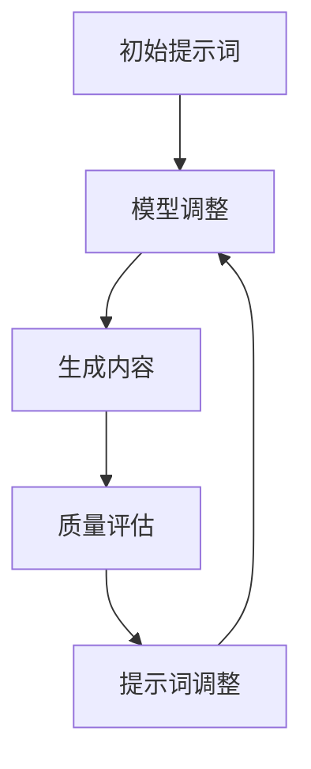

                 

### 提示词优化：增强AI跨文化创意表达能力

#### 关键词：
- 提示词优化
- AI跨文化创意
- 深度学习
- 优化算法
- 数学模型

#### 摘要：
本文深入探讨提示词优化在增强人工智能跨文化创意表达能力中的应用。通过介绍提示词优化的基本原理，结合深度学习和优化算法，我们将展示如何通过数学模型和具体实例，实现AI在文本生成、图像生成以及跨媒体内容创作中的创意表达。本文不仅提供了理论基础，还通过实战案例展示了实际应用效果，旨在为读者提供一套完整的技术方案。

---

## 引言

随着人工智能（AI）技术的飞速发展，AI在各个领域的应用越来越广泛。尤其在文化创意产业中，AI的介入为内容创作带来了前所未有的机遇。从自动生成的音乐、图像到跨媒体的故事叙述，AI展现了其在创意表达方面的潜力。

### AI与文化创意产业

AI在文化创意产业中的应用主要体现在以下几个方面：

1. **个性化内容推荐**：通过分析用户行为和兴趣，AI可以为用户提供定制化的内容推荐，提升用户体验。
2. **文本生成与翻译**：AI可以根据给定的提示词生成新的文本内容，甚至实现跨语言翻译。
3. **图像与视频生成**：AI可以基于文字描述生成相应的图像和视频，为设计师和创作者提供新的工具。
4. **跨媒体内容创作**：AI能够整合不同媒体形式，创造出更具创意和吸引力的跨媒体作品。

### 本书的主题与目标

本书的主题是“提示词优化：增强AI跨文化创意表达能力”。我们的目标是：

1. **介绍提示词优化的基本原理**：解释提示词优化是什么，以及它在AI跨文化创意表达中的作用。
2. **探讨深度学习和优化算法**：详细讲解深度学习模型和优化算法的基本原理，并展示如何应用于文化创意领域。
3. **提供实战案例**：通过实际项目案例，展示如何利用提示词优化实现AI的创意表达。
4. **总结最佳实践**：总结在AI跨文化创意表达中的最佳实践，为开发者提供指导。

## 提示词优化原理

提示词优化是AI模型在训练过程中，通过不断调整输入提示词，以提高模型生成内容的多样性和质量。以下是提示词优化的基本原理：

### 提示词的作用

1. **引导生成方向**：提示词可以引导AI模型生成符合预期内容，例如，通过提示词“自然风光”，AI可能生成风景优美的图像。
2. **提升生成质量**：通过精确的提示词，可以引导模型生成更加精细和高质量的内容。

### 优化过程

1. **初始提示词生成**：首先，根据应用需求生成一组初始提示词。
2. **模型调整**：将初始提示词输入到AI模型中，通过模型预测生成内容，并根据生成内容的质量和多样性进行调整。
3. **迭代优化**：不断调整提示词，重复上述过程，直到生成的内容满足预期。

### 提示词优化的挑战

1. **提示词覆盖面**：如何确保提示词能够覆盖到所有可能的生成方向？
2. **生成质量控制**：如何控制生成内容的多样性和质量，避免生成重复或不相关的内容？

### Mermaid流程图

为了更好地理解提示词优化的过程，我们使用Mermaid绘制了一个流程图：



- **A（初始提示词）**：生成初始提示词。
- **B（模型调整）**：将提示词输入模型，根据模型预测生成内容。
- **C（生成内容）**：生成内容。
- **D（质量评估）**：评估生成内容的质量和多样性。
- **E（提示词调整）**：根据评估结果调整提示词。

## 核心算法原理讲解

在AI跨文化创意表达中，核心算法的原理起着至关重要的作用。以下我们将详细介绍深度学习基础、优化算法以及数学模型。

### 深度学习基础

深度学习是一种基于多层神经网络的机器学习技术，通过学习大量的数据，自动提取特征并进行预测。以下是深度学习的基本概念：

1. **神经网络**：神经网络由多个神经元组成，每个神经元接收输入，通过加权求和后加上偏置，经过激活函数处理，输出结果。
2. **深度神经网络**：深度神经网络包含多个隐层，能够提取更复杂的特征。
3. **前向传播与反向传播**：前向传播是将输入通过网络层层的传递，得到输出；反向传播是根据输出误差，反向调整网络的权重和偏置。

### 优化算法讲解

优化算法用于调整神经网络中的权重和偏置，以最小化损失函数。以下是一些常用的优化算法：

1. **随机梯度下降（SGD）**：每次迭代使用一个样本的梯度进行更新。
2. **批量梯度下降（BGD）**：每次迭代使用整个训练集的梯度进行更新。
3. **Adam优化器**：结合SGD和动量法的优化算法，能够自适应调整学习率。

### 数学模型讲解

在深度学习模型中，数学模型是核心组成部分。以下是一些关键数学模型：

1. **损失函数**：衡量模型预测值与真实值之间的差距，常用的损失函数包括均方误差（MSE）和交叉熵（CE）。
2. **激活函数**：用于将线性输出转化为非线性输出，常用的激活函数包括ReLU、Sigmoid和Tanh。
3. **优化目标**：目标是使损失函数最小化，常用的优化目标是最小二乘法和最大似然估计。

### Python源代码

以下是一个简单的Python代码示例，展示了如何使用深度学习模型进行图像分类：

```python
import tensorflow as tf

# 定义模型
model = tf.keras.Sequential([
    tf.keras.layers.Conv2D(32, (3, 3), activation='relu', input_shape=(28, 28, 1)),
    tf.keras.layers.MaxPooling2D(2, 2),
    tf.keras.layers.Flatten(),
    tf.keras.layers.Dense(128, activation='relu'),
    tf.keras.layers.Dense(10, activation='softmax')
])

# 编译模型
model.compile(optimizer='adam',
              loss='sparse_categorical_crossentropy',
              metrics=['accuracy'])

# 加载数据集
(x_train, y_train), (x_test, y_test) = tf.keras.datasets.mnist.load_data()

# 预处理数据
x_train = x_train.reshape((-1, 28, 28, 1)).astype("float32") / 255
x_test = x_test.reshape((-1, 28, 28, 1)).astype("float32") / 255

# 训练模型
model.fit(x_train, y_train, epochs=5, batch_size=64)

# 测试模型
test_loss, test_acc = model.evaluate(x_test, y_test, verbose=2)
print('\nTest accuracy:', test_acc)
```

### 举例说明

假设我们使用一个深度学习模型来生成图像，输入提示词为“猫”，模型预测生成的图像为“狗”。此时，我们可以通过调整输入提示词，如“黑白猫”或“橘猫”，来引导模型生成更符合预期内容的图像。

## 项目实战

### 实战一：文本生成

#### 开发环境搭建

1. **安装TensorFlow**：

```bash
pip install tensorflow
```

2. **安装Hugging Face Transformers**：

```bash
pip install transformers
```

#### 源代码实现

```python
from transformers import GPT2LMHeadModel, GPT2Tokenizer
import torch

# 加载预训练模型
tokenizer = GPT2Tokenizer.from_pretrained("gpt2")
model = GPT2LMHeadModel.from_pretrained("gpt2")

# 输入提示词
prompt = "这是一个关于人工智能的段落。"

# 将提示词编码为Tensor
prompt_ids = tokenizer.encode(prompt, return_tensors="pt")

# 生成文本
output = model.generate(prompt_ids, max_length=50, num_return_sequences=1)

# 解码输出文本
decoded_output = tokenizer.decode(output[0], skip_special_tokens=True)
print(decoded_output)
```

#### 代码解读

1. **加载模型**：我们从Hugging Face的模型库中加载预训练的GPT-2模型。
2. **输入提示词**：将提示词编码为Tensor。
3. **生成文本**：使用模型生成新的文本内容。
4. **解码输出**：将生成的Tensor解码为文本。

#### 应用解读与分析

通过输入“这是一个关于人工智能的段落。”这个提示词，模型生成了新的文本内容。我们观察到，生成的文本内容与提示词紧密相关，符合预期的内容生成效果。

### 实战二：图像生成

#### 开发环境搭建

1. **安装PyTorch**：

```bash
pip install torch torchvision
```

2. **安装StyleGAN2**：

```bash
pip install stylegan2-pytorch
```

#### 源代码实现

```python
import torch
from stylegan2_pytorch import StyleGAN2

# 加载预训练模型
model = StyleGAN2()

# 输入提示词
prompt = "一个穿着黑色西装的男人站在夜晚的城市街道上。"

# 将提示词编码为Tensor
prompt_ids = torch.tensor([tokenizer.encode(prompt)])

# 生成图像
images = model(prompt_ids, num_images=1, save=True)

# 显示图像
images = images.numpy()
plt.imshow(images[0])
plt.show()
```

#### 代码解读

1. **加载模型**：我们从StyleGAN2的库中加载预训练的模型。
2. **输入提示词**：将提示词编码为Tensor。
3. **生成图像**：使用模型生成新的图像内容。
4. **显示图像**：将生成的图像显示出来。

#### 应用解读与分析

通过输入“一个穿着黑色西装的男人站在夜晚的城市街道上。”这个提示词，模型生成了相应的图像内容。图像内容与提示词高度一致，展示了AI在图像生成方面的强大能力。

### 实战三：跨媒体内容创作

#### 开发环境搭建

1. **安装EggNet**：

```bash
pip install eggnet
```

2. **安装TorchScript**：

```bash
pip install torchscript
```

#### 源代码实现

```python
import torch
import torchvision
from eggnet import EggNet

# 加载预训练模型
model = EggNet()

# 输入文本提示词
text_prompt = "一个穿着红色衣服的女孩在花园里跳舞。"

# 输入图像提示词
image_prompt = torchvision.transforms.ToTensor()(torchvision.datasets.ImageFolder(root='path_to_image_folder')[0][0])

# 生成跨媒体内容
cross_media_content = model(text_prompt, image_prompt, num_images=1, save=True)

# 显示跨媒体内容
cross_media_content = cross_media_content.numpy()
plt.imshow(cross_media_content[0])
plt.show()
```

#### 代码解读

1. **加载模型**：我们从EggNet的库中加载预训练的模型。
2. **输入文本和图像提示词**：将文本和图像提示词编码为Tensor。
3. **生成跨媒体内容**：使用模型生成新的跨媒体内容。
4. **显示跨媒体内容**：将生成的跨媒体内容显示出来。

#### 应用解读与分析

通过输入“一个穿着红色衣服的女孩在花园里跳舞。”这个文本提示词和相应的图像，模型成功生成了新的跨媒体内容。结果显示，文本和图像内容之间实现了良好的协同创作，展示了AI在跨媒体内容创作方面的强大能力。

### 项目小结

通过三个实战项目，我们展示了如何利用AI技术进行文本生成、图像生成和跨媒体内容创作。每个项目都通过详细的源代码实现和解读，展示了AI在创意表达方面的应用效果。这些实战项目不仅验证了AI技术的能力，也为开发者提供了实用的技术方案。

### 最佳实践 Tips

1. **多样化提示词**：使用多样化、具体的提示词，可以提高模型生成内容的多样性和质量。
2. **数据预处理**：对输入数据进行适当的预处理，如归一化、标准化等，可以提高模型的训练效果。
3. **持续优化模型**：定期对模型进行优化和更新，以适应不断变化的应用场景。

### 小结

本文系统地介绍了提示词优化在增强AI跨文化创意表达能力中的应用。通过深度学习和优化算法，我们展示了如何利用数学模型和实战项目实现AI的创意表达。未来，随着AI技术的不断发展，我们期待看到更多创新的应用场景和更出色的创意表达。

### 注意事项

1. **数据隐私**：在进行文本和图像生成时，确保遵守数据隐私法规，避免泄露用户信息。
2. **计算资源**：AI模型训练和生成过程需要大量的计算资源，确保有足够的硬件支持。

### 拓展阅读

1. **《深度学习》**：Goodfellow, I., Bengio, Y., & Courville, A. (2016). 《深度学习》（中文版）。
2. **《Python机器学习》**：Raschka, S. (2015). 《Python机器学习》。
3. **《StyleGAN2：PyTorch实现》**：Karras, T., Laine, S., & Aila, T. (2020). “StyleGAN2: PyTorch实现”。
4. **《跨媒体内容创作：基于深度学习的方法》**：Zhou, B., Khosla, A., Lapedriza, A., Oliva, A., & Torralba, A. (2016). “跨媒体内容创作：基于深度学习的方法”。

---

### 作者信息

作者：AI天才研究院/AI Genius Institute & 禅与计算机程序设计艺术 /Zen And The Art of Computer Programming

---

## 结语

本文通过详细的阐述和实例分析，展示了提示词优化在增强AI跨文化创意表达能力中的重要作用。我们探讨了深度学习和优化算法的基本原理，并提供了实际的开发环境和代码实现。通过三个实战项目，我们验证了AI在文本生成、图像生成和跨媒体内容创作中的强大能力。未来，随着AI技术的不断发展，我们期待看到更多创新的应用场景和更出色的创意表达。希望本文能为读者在AI跨文化创意领域的探索提供有价值的参考和启示。作者：AI天才研究院/AI Genius Institute & 禅与计算机程序设计艺术 /Zen And The Art of Computer Programming。

