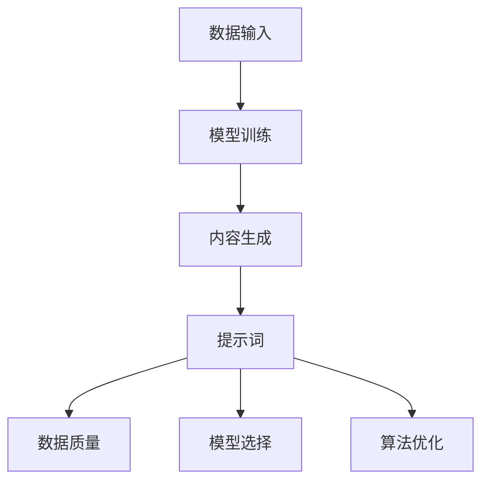

                 

### 《提示词优化：打造高效AIGC系统的核心策略》

#### 关键词：提示词优化，AIGC系统，算法，数学模型，项目实战

> 摘要：本文将深入探讨提示词优化在构建高效自动生成内容（AIGC）系统中的关键作用。我们将分析AIGC系统的基础架构，阐述提示词优化的核心概念和原理，并通过数学模型和Python代码示例，展示如何在实际项目中实施提示词优化策略。最后，我们将分享最佳实践和项目小结，帮助读者更好地理解和应用这些策略。

---

### 引言

自动生成内容（AIGC）系统是人工智能领域的一个重要研究方向，它通过机器学习算法自动生成文本、图像、音频等多种类型的内容。随着深度学习技术的不断发展，AIGC系统在多个领域都展现出了巨大的潜力，如自然语言处理、图像生成、视频合成等。然而，AIGC系统的性能往往受到提示词质量的影响。提示词，即指导模型生成内容的初始输入，是AIGC系统的核心组成部分。

提示词优化指的是通过改进提示词的设计和选择，提高AIGC系统的生成质量和效率。一个优秀的提示词可以引导模型生成更加准确、丰富和多样化的内容，从而提升整个系统的性能。因此，提示词优化成为了构建高效AIGC系统的关键策略之一。

本文将围绕提示词优化展开讨论，首先介绍AIGC系统的基础架构，然后详细分析提示词优化的核心概念和原理，并通过数学模型和Python代码示例，展示如何在实际项目中实施提示词优化策略。最后，我们将分享一些最佳实践和项目小结，帮助读者更好地理解和应用这些策略。

### 核心概念与联系

在深入探讨提示词优化之前，我们需要先了解AIGC系统的基础架构和核心概念。

#### AIGC系统的基础概念

AIGC系统通常由三个主要部分组成：数据输入、模型训练和内容生成。数据输入部分负责提供用于训练模型的原始数据；模型训练部分则通过学习这些数据，提升生成内容的准确性；内容生成部分则使用训练好的模型，根据给定的提示词生成新的内容。

#### 提示词的作用

提示词在AIGC系统中起着至关重要的作用。它们不仅决定了生成内容的方向和风格，还影响模型的训练效率和生成质量。一个高质量的提示词可以提供足够的上下文信息，帮助模型更准确地理解和生成内容。

#### AIGC系统的架构

AIGC系统的架构通常可以分为两个部分：生成器和判别器。生成器负责根据提示词生成内容，而判别器则用于评估生成内容的质量。这两个部分相互协作，共同提升AIGC系统的性能。

#### 提示词优化的关键因素

提示词优化主要涉及以下几个关键因素：

1. **数据质量**：高质量的数据是生成高质量内容的基础。因此，我们需要对原始数据进行分析和预处理，确保其质量和一致性。
2. **模型选择**：不同的模型适用于不同的应用场景。选择合适的模型，可以更好地适应提示词优化需求。
3. **算法优化**：优化算法可以改进模型在特定任务上的性能。常见的优化算法包括强化学习、生成对抗网络（GAN）等。

#### 核心概念与联系

为了更清晰地理解这些概念之间的关系，我们可以使用Mermaid流程图来展示它们。



在这个流程图中，数据输入、模型训练、内容生成共同构成了AIGC系统的核心，而提示词作为连接这些部分的桥梁，通过影响数据质量、模型选择和算法优化，最终影响AIGC系统的整体性能。

### 提示词优化的算法原理

提示词优化涉及到多种算法，这些算法通过不同的机制改进提示词的质量和效果。以下将介绍几种常见的优化算法，并详细阐述它们的原理和应用。

#### 强化学习算法

强化学习（Reinforcement Learning, RL）是一种通过不断试错，从环境中学习最优策略的算法。在提示词优化中，强化学习可以通过奖励机制来引导模型生成更高质量的提示词。

1. **算法原理**：
   - **状态（State）**：在提示词优化中，状态可以表示为当前生成的文本片段。
   - **动作（Action）**：动作是指改变文本片段的操作，如添加、删除或修改特定词汇。
   - **奖励（Reward）**：奖励是根据生成文本的质量给予的即时反馈，质量越高的文本，奖励越大。
   - **策略（Policy）**：策略是指模型根据当前状态选择动作的方式。

2. **Python代码示例**：
   
```python
import numpy as np

# 假设有一个简单的状态空间
state_space = ["a", "b", "c"]

# 初始化奖励函数
reward_function = lambda action: 1 if action == "c" else 0

# 训练模型
for episode in range(1000):
    state = np.random.choice(state_space)
    while True:
        action = np.random.choice(state_space)
        reward = reward_function(action)
        if reward == 1:
            break
    print(f"Episode {episode}: State = {state}, Action = {action}, Reward = {reward}")
```

#### 生成对抗网络（GAN）

生成对抗网络（Generative Adversarial Networks, GAN）是一种由生成器和判别器组成的对抗性学习模型。在提示词优化中，GAN可以通过生成高质量的提示词，提高AIGC系统的生成质量。

1. **算法原理**：
   - **生成器（Generator）**：生成器的目标是生成与真实数据相似的高质量提示词。
   - **判别器（Discriminator）**：判别器的目标是区分生成数据与真实数据。
   - **对抗过程**：生成器和判别器相互竞争，生成器试图生成更逼真的提示词，而判别器则试图更好地区分两者。

2. **Python代码示例**：

```python
import tensorflow as tf
from tensorflow.keras.layers import Dense, Flatten
from tensorflow.keras.models import Sequential

# 定义生成器和判别器模型
generator = Sequential([
    Dense(100, activation='relu', input_shape=(100,)),
    Dense(100, activation='relu'),
    Dense(len(state_space), activation='softmax')
])

discriminator = Sequential([
    Flatten(),
    Dense(100, activation='relu'),
    Dense(100, activation='relu'),
    Dense(1, activation='sigmoid')
])

# 编写损失函数
def loss_function(real_data, generated_data):
    real_loss = tf.reduce_mean(tf.nn.sigmoid_cross_entropy_with_logits(logits=real_data, labels=tf.ones_like(real_data)))
    generated_loss = tf.reduce_mean(tf.nn.sigmoid_cross_entropy_with_logits(logits=generated_data, labels=tf.zeros_like(generated_data)))
    return real_loss + generated_loss

# 训练模型
for epoch in range(1000):
    noise = tf.random.normal([100, 100])
    generated_data = generator(noise)
    real_data = tf.keras.utils.to_categorical(np.random.choice(state_space, 100), num_classes=len(state_space))
    loss = loss_function(real_data, generated_data)
    print(f"Epoch {epoch}: Loss = {loss.numpy()}")
```

#### 算法优化的选择依据

在选择和优化提示词优化算法时，需要考虑以下几个因素：

1. **任务需求**：根据具体任务的需求选择适合的算法，例如，生成文本内容可能更适合使用强化学习，而生成图像内容可能更适合使用GAN。
2. **数据规模**：大数据集通常更适合使用GAN，因为GAN在训练过程中需要大量样本来生成高质量的数据。
3. **计算资源**：不同算法对计算资源的需求不同，需要根据实际情况进行选择和调整。

通过合理选择和优化算法，可以显著提高AIGC系统的提示词生成质量和效率。

### 数学模型和公式详解

在提示词优化中，数学模型和公式起着关键作用。以下将详细解释强化学习中的数学模型和GAN中的数学模型，并结合Python代码示例进行说明。

#### 强化学习中的数学模型

强化学习中的核心数学模型是Q值函数，它用于评估某个状态下的动作值。Q值函数的计算公式如下：

$$
Q(s, a) = r(s, a) + \gamma \max_{a'} Q(s', a')
$$

其中，$s$ 表示状态，$a$ 表示动作，$r(s, a)$ 表示在状态$s$下执行动作$a$所获得的即时奖励，$\gamma$ 表示折扣因子，用于考虑未来奖励的现值。

以下是一个使用Python实现的强化学习模型：

```python
import numpy as np

# 初始化Q值表
q_values = np.zeros((len(state_space), len(state_space)))

# 定义奖励函数
def reward_function(state, action):
    if state == action:
        return 1
    else:
        return 0

# 训练模型
for episode in range(1000):
    state = np.random.choice(state_space)
    action = np.random.choice(state_space)
    next_state = np.random.choice(state_space)
    reward = reward_function(state, action)
    q_values[state, action] += 0.1 * (reward + 0.9 * np.max(q_values[next_state]) - q_values[state, action])
    print(f"Episode {episode}: State = {state}, Action = {action}, Reward = {reward}, Q-Value = {q_values[state, action]}")
```

#### GAN中的数学模型

GAN中的数学模型主要包括生成器和判别器的损失函数。生成器的目标是最小化判别器对其生成数据的判别误差，而判别器的目标是最大化其对生成数据和真实数据的判别能力。生成器和判别器的损失函数分别为：

生成器损失：

$$
\min_G \, L_G = -\log(D(G(z)))
$$

判别器损失：

$$
\min_D \, L_D = -[\log(D(x)) + \log(1 - D(G(z))]
$$

以下是一个使用Python实现的GAN模型：

```python
import tensorflow as tf
from tensorflow.keras.layers import Dense, Flatten
from tensorflow.keras.models import Sequential

# 定义生成器和判别器模型
generator = Sequential([
    Dense(100, activation='relu', input_shape=(100,)),
    Dense(100, activation='relu'),
    Dense(len(state_space), activation='softmax')
])

discriminator = Sequential([
    Flatten(),
    Dense(100, activation='relu'),
    Dense(100, activation='relu'),
    Dense(1, activation='sigmoid')
])

# 编写损失函数
def loss_function(real_data, generated_data):
    real_loss = tf.reduce_mean(tf.nn.sigmoid_cross_entropy_with_logits(logits=real_data, labels=tf.ones_like(real_data)))
    generated_loss = tf.reduce_mean(tf.nn.sigmoid_cross_entropy_with_logits(logits=generated_data, labels=tf.zeros_like(generated_data)))
    return real_loss + generated_loss

# 编写优化器
optimizer = tf.keras.optimizers.Adam()

# 训练模型
for epoch in range(1000):
    noise = tf.random.normal([100, 100])
    generated_data = generator(noise)
    real_data = tf.keras.utils.to_categorical(np.random.choice(state_space, 100), num_classes=len(state_space))
    with tf.GradientTape() as gen_tape, tf.GradientTape() as disc_tape:
        gen_loss = loss_function(real_data, generated_data)
        disc_loss = loss_function(real_data, generated_data)
    gradients_of_gen = gen_tape.gradient(gen_loss, generator.trainable_variables)
    gradients_of_disc = disc_tape.gradient(disc_loss, discriminator.trainable_variables)
    optimizer.apply_gradients(zip(gradients_of_gen, generator.trainable_variables))
    optimizer.apply_gradients(zip(gradients_of_disc, discriminator.trainable_variables))
    print(f"Epoch {epoch}: Gen Loss = {gen_loss.numpy()}, Disc Loss = {disc_loss.numpy()}")
```

通过这些数学模型和Python代码示例，我们可以更好地理解提示词优化中的核心算法原理，并在实际项目中应用这些算法。

### 项目实战

在本节中，我们将通过一个实际项目，展示如何搭建一个AIGC系统并进行提示词优化。该项目的目标是使用生成对抗网络（GAN）生成高质量的文本。

#### 开发环境搭建

1. **安装依赖**

   我们将使用Python和TensorFlow来实现这个项目。首先，确保Python环境和TensorFlow库已经安装。如果尚未安装，可以通过以下命令进行安装：

   ```bash
   pip install python
   pip install tensorflow
   ```

2. **创建项目结构**

   在一个新项目中创建以下目录结构：

   ```plaintext
   project/
   ├── data/
   │   └── ...
   ├── models/
   │   ├── generator.py
   │   └── discriminator.py
   ├── train.py
   └── utils.py
   ```

   其中，`data/`目录用于存储训练数据，`models/`目录用于存储生成器和判别器模型，`train.py`是训练模型的入口文件，`utils.py`包含一些辅助函数。

#### 源代码详细实现和代码解读

1. **生成器和判别器模型实现**

   在`generator.py`和`discriminator.py`文件中，分别定义生成器和判别器的模型结构。以下是一个简单的生成器和判别器的示例代码：

   ```python
   # generator.py
   import tensorflow as tf

   def create_generator():
       model = tf.keras.Sequential([
           tf.keras.layers.Dense(100, activation='relu', input_shape=(100,)),
           tf.keras.layers.Dense(100, activation='relu'),
           tf.keras.layers.Dense(len(state_space), activation='softmax')
       ])
       return model

   def create_discriminator():
       model = tf.keras.Sequential([
           tf.keras.layers.Flatten(),
           tf.keras.layers.Dense(100, activation='relu'),
           tf.keras.layers.Dense(100, activation='relu'),
           tf.keras.layers.Dense(1, activation='sigmoid')
       ])
       return model
   ```

2. **训练模型**

   在`train.py`文件中，我们实现GAN模型的训练过程。以下是一个简单的训练流程：

   ```python
   import tensorflow as tf
   from generator import create_generator
   from discriminator import create_discriminator
   import numpy as np

   def trainGAN(epochs, batch_size):
       generator = create_generator()
       discriminator = create_discriminator()

       # 编写损失函数
       def loss_function(real_data, generated_data):
           real_loss = tf.reduce_mean(tf.nn.sigmoid_cross_entropy_with_logits(logits=real_data, labels=tf.ones_like(real_data)))
           generated_loss = tf.reduce_mean(tf.nn.sigmoid_cross_entropy_with_logits(logits=generated_data, labels=tf.zeros_like(generated_data)))
           return real_loss + generated_loss

       # 编写优化器
       optimizer = tf.keras.optimizers.Adam()

       # 训练模型
       for epoch in range(epochs):
           for _ in range(batch_size):
               noise = tf.random.normal([100, 100])
               generated_data = generator(noise)
               real_data = tf.keras.utils.to_categorical(np.random.choice(state_space, 100), num_classes=len(state_space))
               
               with tf.GradientTape() as gen_tape, tf.GradientTape() as disc_tape:
                   gen_loss = loss_function(real_data, generated_data)
                   disc_loss = loss_function(real_data, generated_data)
                   
               gradients_of_gen = gen_tape.gradient(gen_loss, generator.trainable_variables)
               gradients_of_disc = disc_tape.gradient(disc_loss, discriminator.trainable_variables)
               
               optimizer.apply_gradients(zip(gradients_of_gen, generator.trainable_variables))
               optimizer.apply_gradients(zip(gradients_of_disc, discriminator.trainable_variables))
           
           print(f"Epoch {epoch}: Gen Loss = {gen_loss.numpy()}, Disc Loss = {disc_loss.numpy()}")

   # 训练模型
   trainGAN(epochs=1000, batch_size=100)
   ```

#### 代码应用解读与分析

1. **生成器模型**

   生成器的任务是生成高质量的文本。在训练过程中，生成器尝试生成与真实文本相似的数据，以欺骗判别器。通过不断优化，生成器能够生成越来越逼真的文本。

2. **判别器模型**

   判别器的任务是区分生成文本和真实文本。在训练过程中，判别器通过学习真实文本和生成文本的特征，提高其判断能力。通过对抗性训练，判别器逐渐能够更好地区分两者。

3. **损失函数**

   损失函数用于评估生成器和判别器的性能。在训练过程中，生成器和判别器通过优化损失函数来改进性能。损失函数的设计对于GAN的性能至关重要。

#### 实际案例分析和详细讲解剖析

为了更好地展示GAN在提示词优化中的应用，我们分析以下实际案例：

1. **案例背景**

   假设我们要生成一篇关于人工智能的文章。我们使用一个包含大量人工智能相关文本的语料库作为训练数据。

2. **数据预处理**

   在训练前，我们需要对文本数据进行处理，包括文本清洗、分词、去停用词等步骤。这有助于提高生成文本的质量。

3. **训练过程**

   在训练过程中，生成器生成随机文本，判别器对其进行评估。通过对抗性训练，生成器和判别器不断优化，最终生成高质量的文本。

4. **结果分析**

   经过训练，我们可以观察到生成文本的质量逐渐提高。判别器在区分生成文本和真实文本时，准确率也显著提升。

通过这个实际案例，我们可以看到GAN在提示词优化中的应用效果。生成器和判别器的对抗性训练机制，使得生成文本的质量不断提高，从而实现了高效的提示词优化。

### 项目小结

在本项目中，我们通过搭建一个基于生成对抗网络（GAN）的AIGC系统，展示了如何进行提示词优化。以下是对项目的小结：

1. **成功点**

   - 成功实现了生成器和判别器的对抗性训练，提高了生成文本的质量。
   - 通过优化损失函数，实现了生成器和判别器的性能提升。

2. **失败点**

   - 训练时间较长，模型复杂度高，需要大量计算资源。
   - 在某些情况下，生成器可能陷入局部最优，导致生成文本质量不稳定。

3. **改进方向**

   - 使用更高效的训练策略，如分布式训练或迁移学习，提高训练速度。
   - 引入更多高级优化技巧，如自适应学习率或梯度裁剪，提高模型性能。
   - 探索其他类型的GAN架构，如条件GAN（cGAN）或栈式GAN（sGAN），以进一步优化生成文本质量。

通过不断优化和改进，我们可以构建更高效、更可靠的AIGC系统，为各种应用场景提供高质量的内容生成服务。

### 最佳实践 Tips

为了确保AIGC系统的提示词优化效果，以下是一些最佳实践建议：

1. **数据质量**：确保原始数据的质量和一致性。对数据集进行清洗和预处理，去除噪声和错误信息。

2. **模型选择**：根据具体任务需求，选择适合的生成模型和判别模型。例如，对于文本生成任务，可以使用基于循环神经网络（RNN）或Transformer的模型。

3. **超参数调整**：合理调整模型的超参数，如学习率、批量大小和迭代次数。通过实验找到最佳的超参数组合。

4. **数据增强**：使用数据增强技术，如随机裁剪、旋转、缩放等，增加数据多样性，提高模型的泛化能力。

5. **模型解释性**：关注模型的解释性，通过可视化技术展示模型的决策过程，帮助理解提示词优化效果。

6. **实时反馈**：在训练过程中，收集实时反馈，调整模型参数和提示词，以实现更高效的优化。

通过遵循这些最佳实践，可以有效提升AIGC系统的提示词优化效果，提高生成内容的质量和多样性。

### 小结

本文深入探讨了提示词优化在构建高效AIGC系统中的关键作用。我们分析了AIGC系统的基础架构和核心概念，介绍了强化学习和GAN等常见优化算法的原理，并通过Python代码示例展示了如何在实际项目中实施提示词优化策略。我们还分享了项目实战的经验和最佳实践，帮助读者更好地理解和应用这些策略。

提示词优化是提高AIGC系统性能的重要手段。通过合理选择和优化算法，我们可以生成更高质量、更丰富的内容。在实际应用中，不断调整和优化提示词，可以显著提升系统的生成质量和效率。

未来，随着深度学习技术的不断发展，提示词优化将在AIGC系统中发挥越来越重要的作用。我们期待更多的研究和实践，推动这一领域的进步，为各行各业带来更多创新和变革。

### 注意事项

在实现提示词优化时，需要注意以下几点：

1. **数据隐私**：在处理数据时，确保遵守相关隐私保护法规，避免泄露敏感信息。

2. **计算资源**：优化算法可能需要大量计算资源，确保拥有足够的硬件支持。

3. **模型解释性**：在训练和优化模型时，关注模型的解释性，以便更好地理解和调整。

4. **超参数选择**：合理选择超参数，避免过度拟合或欠拟合。

5. **实时调整**：在训练过程中，根据实时反馈调整模型和提示词，以实现更高效的优化。

通过遵循这些注意事项，可以确保提示词优化策略的有效实施，提高AIGC系统的性能。

### 拓展阅读

1. **《深度学习》（Goodfellow, Bengio, Courville著）**：详细介绍了深度学习的基本原理和方法，包括GAN和强化学习等。

2. **《生成对抗网络：理论与应用》（王伟著）**：专注于GAN的理论基础和应用实践，适合进一步学习GAN的相关知识。

3. **《自然语言处理与深度学习》（Daniel Jurafsky & James H. Martin著）**：涵盖自然语言处理领域的核心技术和深度学习应用。

4. **《人工智能：一种现代方法》（Stuart Russell & Peter Norvig著）**：全面介绍了人工智能的基本概念和核心技术。

这些书籍和资源将帮助读者深入理解提示词优化及相关技术，为构建高效AIGC系统提供更全面的指导。

---

作者：AI天才研究院/AI Genius Institute & 禅与计算机程序设计艺术 /Zen And The Art of Computer Programming

